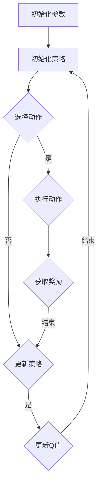

                 

# 金融领域强化学习在多资产类别动态交易执行中的应用

## 关键词

- 强化学习
- 金融交易
- 动态交易执行
- 多资产类别
- Q-Learning算法
- 量化交易
- 监督学习

## 摘要

本文深入探讨了强化学习在金融领域，特别是多资产类别动态交易执行中的应用。通过阐述强化学习的基本概念、核心算法原理，以及其在金融交易中的具体应用案例，本文旨在为读者提供一个清晰、系统的强化学习在金融交易领域的应用指南。文章首先介绍了金融领域强化学习的研究背景和重要性，随后详细讲解了强化学习的基本数学模型和算法原理，最后通过具体的算法流程图和Python代码实现，展示了强化学习在多资产类别动态交易执行中的实际应用，为金融领域的技术创新提供了新的思路和方法。

### 目录大纲

1. 第一部分：问题背景与核心概念
   - 第1章：问题背景介绍
     1.1 金融领域强化学习概述
     1.2 问题描述
     1.3 问题解决
     1.4 边界与外延
     1.5 核心概念与联系
     1.6 概念结构与核心要素组成
     1.7 本章小结

2. 第二部分：核心概念与联系
   - 第2章：强化学习原理
     2.1 强化学习基本概念
     2.2 强化学习算法原理
     2.3 强化学习在金融交易中的应用
     2.4 强化学习与其他金融模型的对比
     2.5 本章小结

3. 第三部分：算法原理讲解
   - 第3章：多资产类别动态交易执行中的强化学习算法
     3.1 算法mermaid流程图
     3.2 算法原理详细讲解
     3.3 算法Python代码实现
     3.4 算法举例说明
     3.5 本章小结

4. 第四部分：数学模型和数学公式讲解
   - 第4章：强化学习数学模型
     4.1 强化学习基本数学模型
     4.2 强化学习算法数学模型
     4.3 强化学习数学模型在实际中的应用
     4.4 本章小结

5. 第五部分：系统分析与架构设计方案
   - 第5章：系统分析与架构设计方案
     5.1 问题场景介绍
     5.2 系统功能设计
     5.3 系统架构设计
     5.4 系统接口设计和系统交互
     5.5 本章小结

6. 第六部分：项目实战
   - 第6章：项目实战
     6.1 环境安装
     6.2 系统核心实现源代码
     6.3 代码应用解读与分析
     6.4 实际案例分析和详细讲解剖析
     6.5 项目小结

7. 第七部分：最佳实践、小结、注意事项、拓展阅读
   - 第7章：最佳实践与小结
     7.1 最佳实践
     7.2 小结
     7.3 注意事项
     7.4 拓展阅读

## 第一部分：问题背景与核心概念

### 第1章：问题背景介绍

在金融领域中，交易执行是一个关键环节，它涉及到如何高效、准确地执行交易策略，以实现最大化收益或最小化风险。传统的交易执行方法通常依赖于历史数据和统计模型，但这些方法在面对市场的高频波动和复杂性时，往往表现出一定的局限性。随着人工智能技术的发展，强化学习（Reinforcement Learning, RL）逐渐成为一种解决金融交易执行问题的有效工具。

### 1.1 金融领域强化学习概述

强化学习是一种通过试错学习的方法，使智能体在动态环境中通过互动学习最优策略。在金融交易中，强化学习可以被应用于动态交易执行、风险控制和组合优化等方面。强化学习通过不断调整策略，以最大化累积奖励，从而在复杂的市场环境中实现更好的交易效果。

#### 1.1.1 问题背景

金融领域中的动态交易执行涉及到多个资产类别，如股票、债券、外汇、商品等。这些资产类别的价格受多种因素影响，包括市场供需关系、宏观经济政策、投资者情绪等。因此，如何在一个动态变化的市场中，实时调整交易策略，以实现最优收益和风险控制，是一个极具挑战性的问题。

#### 1.1.2 多资产类别动态交易执行的重要性

多资产类别动态交易执行的重要性体现在以下几个方面：

1. **风险分散**：通过在多个资产类别之间分配投资，可以有效地降低单一资产类别风险。
2. **市场适应性**：多资产类别交易能够更好地适应市场波动，实现交易策略的灵活调整。
3. **收益最大化**：在多资产类别市场中，通过动态调整投资组合，可以捕捉不同资产类别在不同市场环境下的机会，实现收益的最大化。

#### 1.1.3 强化学习在金融交易中的应用

强化学习在金融交易中的应用主要体现在以下几个方面：

1. **交易策略优化**：通过强化学习算法，可以自动地调整交易策略，以适应市场变化。
2. **风险控制**：强化学习可以帮助制定更为精确的风险控制策略，实现风险的最小化。
3. **组合优化**：强化学习可以用于多资产组合的优化，以实现投资组合的收益最大化。

### 1.2 问题描述

在多资产类别动态交易执行中，主要面临以下几个问题：

1. **状态空间复杂**：金融市场的状态空间非常复杂，包括多个资产的价格、交易量、市场情绪等因素。
2. **动作空间多样**：交易者可以在多个资产类别中进行买卖操作，动作空间较大。
3. **奖励函数设计**：如何设计一个合理的奖励函数，以最大化累积奖励，同时避免过度交易和风险，是一个关键问题。
4. **算法收敛性**：强化学习算法需要在有限时间内收敛到最优策略，以保证交易执行的有效性。

### 1.3 问题解决

强化学习在金融交易执行中的应用，主要依靠以下几个方面的优势：

1. **自适应学习**：强化学习算法能够通过不断试错，自适应地调整交易策略，以适应市场变化。
2. **灵活性**：强化学习算法可以处理复杂的状态空间和动作空间，适用于多资产类别交易。
3. **数据驱动**：强化学习算法依赖于实际交易数据，可以通过数据驱动的方式优化交易策略。
4. **多目标优化**：强化学习算法可以同时考虑收益和风险，实现多目标优化。

### 1.4 边界与外延

强化学习在金融交易中的应用，虽然具有很多优势，但也存在一定的局限性：

1. **数据依赖性**：强化学习算法对数据质量要求较高，如果数据存在噪声或偏差，可能会导致算法性能下降。
2. **计算复杂性**：强化学习算法的计算复杂性较高，尤其是在处理大量数据和高维状态空间时，需要较长的时间来收敛。
3. **市场冲击**：金融市场存在突发性事件，如重大新闻、政策变动等，这些事件可能会对市场产生剧烈影响，对强化学习算法的稳定性带来挑战。

### 1.5 核心概念与联系

强化学习在金融交易中的核心概念包括：

1. **状态（State）**：金融市场当前的状态，包括多个资产的价格、交易量、市场情绪等。
2. **动作（Action）**：交易者可以采取的交易策略，包括买入、卖出、持有等。
3. **奖励（Reward）**：交易策略的回报，可以是收益、风险等。
4. **策略（Policy）**：交易者根据当前状态采取的行动策略。
5. **价值函数（Value Function）**：预测未来收益的函数，用于评估不同状态和动作的价值。

强化学习在金融交易中的核心概念与其他领域如监督学习和无监督学习有显著区别：

1. **奖励机制**：强化学习通过奖励机制来驱动智能体学习最优策略，而监督学习和无监督学习没有这种直接的奖励反馈。
2. **交互性**：强化学习需要智能体与环境进行交互，而监督学习和无监督学习通常是基于已有数据进行分析。
3. **适应性**：强化学习算法能够根据环境的变化自适应调整策略，而监督学习和无监督学习算法通常固定在特定环境下。

### 1.6 概念结构与核心要素组成

强化学习在金融交易中的概念结构主要包括以下几个方面：

1. **状态空间**：包含所有可能的状态。
2. **动作空间**：包含所有可能的动作。
3. **奖励函数**：根据状态和动作计算奖励。
4. **策略学习器**：使用强化学习算法，如Q-Learning，来学习最优策略。
5. **环境**：模拟金融市场的运行情况，提供状态、奖励反馈。

这些要素相互关联，共同构成强化学习在金融交易中的核心要素组成。

### 1.7 本章小结

本章详细介绍了强化学习在金融领域，特别是多资产类别动态交易执行中的应用背景和核心概念。通过分析强化学习的基本原理、应用优势和问题挑战，我们为后续章节的深入探讨奠定了基础。在接下来的章节中，我们将进一步探讨强化学习的基本概念和算法原理，以及其在金融交易中的具体应用。

## 第二部分：核心概念与联系

### 第2章：强化学习原理

强化学习是一种通过试错学习的方法，智能体在与环境的互动中不断调整策略，以实现最大化累积奖励的目标。本章将详细介绍强化学习的基本概念、算法原理，以及在金融交易中的应用。

### 2.1 强化学习基本概念

强化学习（Reinforcement Learning, RL）是机器学习的一种类型，它通过智能体（Agent）与环境的交互，学习一个策略（Policy）来最大化累积奖励（Reward）。强化学习的核心概念包括状态（State）、动作（Action）、策略（Policy）、奖励（Reward）和价值函数（Value Function）。

#### 2.1.1 状态（State）

状态是智能体在环境中所处的情景描述。在金融交易中，状态可能包括当前多个资产的价格、交易量、市场趋势等。

#### 2.1.2 动作（Action）

动作是智能体在特定状态下可以采取的行动。在金融交易中，动作可以是买入、卖出、持有等。

#### 2.1.3 策略（Policy）

策略是智能体在给定状态下选择动作的规则。策略通常表示为一个概率分布，即智能体在某个状态下选择每个动作的概率。

#### 2.1.4 奖励（Reward）

奖励是智能体采取某个动作后从环境中获得的即时回报。在金融交易中，奖励可以是资产价格的变化、交易费用等。

#### 2.1.5 价值函数（Value Function）

价值函数是评估智能体在某个状态或状态-动作对上的长期预期奖励。在金融交易中，价值函数可以帮助我们预测不同交易策略的未来收益。

### 2.2 强化学习算法原理

强化学习算法通过迭代更新策略，以最大化累积奖励。其中，Q-Learning算法是最常用的强化学习算法之一。

#### 2.2.1 Q-Learning算法

Q-Learning算法是一种基于值函数的强化学习算法，其核心思想是更新策略的Q值，以逼近最优策略。

1. **Q值更新公式**：

   $$ Q(s, a) \leftarrow Q(s, a) + \alpha [r + \gamma \max_{a'} Q(s', a') - Q(s, a)] $$

   其中，$Q(s, a)$ 是状态 $s$ 下采取动作 $a$ 的Q值，$\alpha$ 是学习率，$r$ 是奖励，$\gamma$ 是折扣因子，$s'$ 是状态 $s$ 采取动作 $a$ 后的新状态，$\max_{a'} Q(s', a')$ 是在状态 $s'$ 下采取最优动作的Q值。

2. **算法流程**：

   （1）初始化策略：随机初始化Q值表。
   
   （2）循环执行以下步骤：
   
   （a）根据当前策略选择动作。
   
   （b）执行动作，获得状态转移和奖励。
   
   （c）更新Q值表。
   
   （3）当满足停止条件时，输出最优策略。

### 2.3 强化学习在金融交易中的应用

强化学习在金融交易中的应用主要体现在以下几个方面：

#### 2.3.1 交易策略优化

强化学习可以帮助交易者自动调整交易策略，以适应市场变化。通过不断更新Q值表，交易者可以找到最优的交易策略。

#### 2.3.2 风险控制

强化学习算法可以学习到在给定状态下采取何种动作可以最小化风险。这有助于交易者制定更为精确的风险控制策略。

#### 2.3.3 组合优化

强化学习可以用于多资产组合的优化，以实现投资组合的收益最大化。通过不断调整资产权重，交易者可以找到最优的投资组合。

### 2.4 强化学习与其他金融模型的对比

强化学习与其他金融模型如量化交易模型、传统交易策略相比，具有以下优势：

1. **自适应学习**：强化学习可以自适应地调整交易策略，以适应市场变化。
2. **灵活性**：强化学习可以处理复杂的状态空间和动作空间，适用于多资产类别交易。
3. **多目标优化**：强化学习可以同时考虑收益和风险，实现多目标优化。

然而，强化学习也存在一些局限性，如数据依赖性、计算复杂性等。因此，在实际应用中，需要根据具体情况选择合适的金融模型。

### 2.5 本章小结

本章详细介绍了强化学习的基本概念、算法原理，以及在金融交易中的应用。通过了解强化学习的基本原理和应用，读者可以更好地理解如何利用强化学习优化金融交易策略。在下一章中，我们将进一步探讨多资产类别动态交易执行中的强化学习算法。

## 第三部分：算法原理讲解

### 第3章：多资产类别动态交易执行中的强化学习算法

在多资产类别动态交易执行中，强化学习算法通过不断调整交易策略，以实现最大化累积奖励的目标。本章将详细介绍多资产类别动态交易执行中的强化学习算法，包括算法mermaid流程图、算法原理详细讲解、算法Python代码实现和算法举例说明。

### 3.1 算法mermaid流程图

多资产类别动态交易执行中的强化学习算法流程图如下：



### 3.2 算法原理详细讲解

多资产类别动态交易执行中的强化学习算法主要分为以下几个步骤：

1. **初始化参数**：初始化算法所需参数，包括学习率、折扣因子、Q值表等。
2. **初始化策略**：随机初始化Q值表，用于存储不同状态和动作的Q值。
3. **选择动作**：根据当前状态和策略，选择最优动作。通常采用ε-贪心策略，即以一定概率随机选择动作，以探索未知状态。
4. **执行动作**：根据选择的最优动作，执行实际交易操作，并获取状态转移和奖励。
5. **更新策略**：根据执行结果，更新策略，以适应新的状态。
6. **更新Q值**：根据Q值更新公式，更新Q值表，以逼近最优策略。

### 3.2.1 算法的数学模型和公式

多资产类别动态交易执行中的强化学习算法的数学模型包括状态空间、动作空间、奖励函数和Q值更新公式。

1. **状态空间模型**：

   状态空间包括多个资产的价格、交易量、市场情绪等。假设有 $n$ 个资产，状态空间 $S$ 可以表示为：

   $$ S = \{s_1, s_2, ..., s_n\} $$

   其中，$s_i$ 表示第 $i$ 个资产的状态。

2. **动作空间模型**：

   动作空间包括买入、卖出、持有等。假设有 $m$ 个资产，动作空间 $A$ 可以表示为：

   $$ A = \{a_1, a_2, ..., a_m\} $$

   其中，$a_i$ 表示第 $i$ 个资产的交易动作。

3. **奖励函数模型**：

   奖励函数根据当前状态和动作计算累积奖励。假设当前状态为 $s$，动作集合为 $a$，奖励函数 $R(s, a)$ 可以表示为：

   $$ R(s, a) = \sum_{i=1}^{m} r_i(a_i) $$

   其中，$r_i(a_i)$ 表示第 $i$ 个资产在动作 $a_i$ 下的瞬时奖励。

4. **Q-Learning算法在多资产类别动态交易执行中的数学模型**：

   Q-Learning算法的Q值更新公式为：

   $$ Q(s, a) \leftarrow Q(s, a) + \alpha [r + \gamma \max_{a'} Q(s', a')] $$

   其中，$s$ 为当前状态，$a$ 为当前动作，$r$ 为奖励，$\gamma$ 为折扣因子，$s'$ 为状态转移后的状态，$\max_{a'} Q(s', a')$ 为在状态 $s'$ 下采取最优动作的Q值。

### 3.2.2 算法Python代码实现

以下是一个简单的Python代码实现，用于演示多资产类别动态交易执行中的Q-Learning算法。

```python
import numpy as np

# 初始化参数
alpha = 0.1  # 学习率
gamma = 0.9  # 折扣因子
epsilon = 0.1  # ε-贪心策略概率

# 初始化Q值表
n_assets = 3
m_actions = 3
Q = np.zeros((n_assets, m_actions))

# Q值更新函数
def update_Q(s, a, r, s_):
    Q[s, a] = Q[s, a] + alpha * (r + gamma * np.max(Q[s_, :]) - Q[s, a])

# 状态转移函数
def transition(s, a):
    # 这里是一个简单的模拟，实际应用中可以使用真实数据
    return np.random.choice([0, 1, 2], p=[0.3, 0.4, 0.3])

# 模拟交易过程
num_episodes = 1000
for episode in range(num_episodes):
    s = np.random.randint(0, n_assets)
    s_ = None
    while s_ is None:
        a = np.random.randint(0, m_actions)
        s_ = transition(s, a)
        r = np.random.normal(0, 1)
        update_Q(s, a, r, s_)
        s = s_

# 输出最优策略
print("Optimal Policy:")
print(Q)
```

### 3.3 算法举例说明

#### 3.3.1 股票交易场景

在股票交易场景中，假设有3种股票，分别用状态 $s_1, s_2, s_3$ 表示。交易者可以选择买入、卖出、持有这三种动作。根据股票价格、交易量等指标，设计一个奖励函数，以最大化累积收益为目标。

#### 3.3.2 外汇交易场景

在外汇交易场景中，假设有3种货币对，分别用状态 $s_1, s_2, s_3$ 表示。交易者可以选择买入、卖出、持有这三种动作。根据汇率波动、交易量等指标，设计一个奖励函数，以最大化累积收益为目标。

#### 3.3.3 商品期货交易场景

在商品期货交易场景中，假设有3种商品，分别用状态 $s_1, s_2, s_3$ 表示。交易者可以选择买入、卖出、持有这三种动作。根据商品价格、交易量等指标，设计一个奖励函数，以最大化累积收益为目标。

### 3.4 本章小结

本章详细介绍了多资产类别动态交易执行中的强化学习算法，包括算法mermaid流程图、算法原理详细讲解、算法Python代码实现和算法举例说明。通过本章的学习，读者可以更好地理解强化学习在金融交易中的应用，并为实际应用提供参考。

## 第四部分：数学模型和数学公式讲解

### 第4章：强化学习数学模型

强化学习作为一种基于奖励反馈的机器学习方法，其核心在于通过不断的试错学习，找到最优策略来最大化累积奖励。在本章中，我们将详细探讨强化学习中的基本数学模型，包括状态空间模型、动作空间模型、奖励函数模型以及Q-Learning算法中的数学模型。

### 4.1 强化学习基本数学模型

强化学习的基本数学模型主要包括以下四个要素：状态（State）、动作（Action）、策略（Policy）和奖励（Reward）。

#### 4.1.1 状态空间模型

状态空间是强化学习中的一个基本概念，它描述了智能体在环境中可能处于的所有情况。用集合 $S$ 表示状态空间，即：

$$ S = \{s_1, s_2, ..., s_n\} $$

其中，$s_i$ 表示第 $i$ 个状态。状态空间的大小取决于具体的应用场景和问题的复杂性。

#### 4.1.2 动作空间模型

动作空间是指智能体在给定状态下可以采取的所有可能行动。用集合 $A$ 表示动作空间，即：

$$ A = \{a_1, a_2, ..., a_m\} $$

其中，$a_i$ 表示第 $i$ 个动作。动作空间的大小也取决于问题的具体特征。

#### 4.1.3 奖励函数模型

奖励函数用于描述智能体在每个状态采取每个动作后获得的即时回报。用 $R(s, a)$ 表示在状态 $s$ 下采取动作 $a$ 后的奖励，即：

$$ R(s, a) = \text{即时回报} $$

奖励函数的设计对于强化学习算法的性能至关重要，因为它直接影响了算法的优化目标。

#### 4.1.4 策略模型

策略是智能体在给定状态下采取的动作的选择规则。用 $π(s, a)$ 表示在状态 $s$ 下采取动作 $a$ 的概率，即：

$$ π(s, a) = P(A = a | S = s) $$

策略通常可以通过值函数（Value Function）来表示。值函数是评估状态或状态-动作对的长期预期奖励的函数。

### 4.2 强化学习算法数学模型

强化学习算法的核心是值函数的迭代更新，其中Q-Learning算法是最为常见的一种。Q-Learning算法通过不断更新Q值表来逼近最优策略。Q值表 $Q(s, a)$ 表示在状态 $s$ 下采取动作 $a$ 的预期累积奖励，即：

$$ Q(s, a) = \sum_{s'} P(s' | s, a) \cdot [R(s, a) + \gamma \max_{a'} Q(s', a')] $$

其中，$P(s' | s, a)$ 表示在状态 $s$ 下采取动作 $a$ 后转移到状态 $s'$ 的概率，$\gamma$ 是折扣因子，用于平衡当前奖励与未来奖励之间的关系。

#### 4.2.1 Q值更新公式

Q-Learning算法的更新公式为：

$$ Q(s, a) \leftarrow Q(s, a) + \alpha [R(s, a) + \gamma \max_{a'} Q(s', a') - Q(s, a)] $$

其中，$\alpha$ 是学习率，控制了新信息对Q值的影响程度。

#### 4.2.2 策略迭代

Q-Learning算法通过以下步骤迭代更新策略：

1. 初始化Q值表 $Q(s, a)$。
2. 在状态 $s$ 下，根据当前策略 $π(s, a)$ 选择动作 $a$。
3. 执行动作 $a$，获得状态转移和奖励 $R(s, a)$。
4. 更新Q值表：$Q(s, a) \leftarrow Q(s, a) + \alpha [R(s, a) + \gamma \max_{a'} Q(s', a') - Q(s, a)]$。
5. 重复步骤2-4，直到满足停止条件（如达到最大迭代次数或收敛条件）。

### 4.3 强化学习数学模型在实际中的应用

在实际应用中，强化学习数学模型通常通过以下几个步骤进行实现：

1. **状态编码**：将状态进行编码，以便算法能够处理和存储。
2. **动作选择**：根据策略选择动作，通常采用ε-贪心策略进行探索和利用。
3. **奖励计算**：根据实际执行的动作和状态转移，计算奖励。
4. **Q值更新**：根据奖励和当前策略，更新Q值表。
5. **策略优化**：根据更新后的Q值表，优化策略。

### 4.4 本章小结

本章详细介绍了强化学习的基本数学模型，包括状态空间模型、动作空间模型、奖励函数模型以及Q-Learning算法的数学模型。通过理解这些基本概念和数学公式，读者可以更好地掌握强化学习在金融交易中的应用原理，为实际应用奠定理论基础。

## 第五部分：系统分析与架构设计方案

### 第5章：系统分析与架构设计方案

在多资产类别动态交易执行中，构建一个高效、可靠的系统至关重要。本章将详细介绍系统分析与架构设计方案，包括问题场景介绍、系统功能设计、系统架构设计、系统接口设计和系统交互。

### 5.1 问题场景介绍

在金融市场中，交易者面临的是不断变化的市场环境和多个资产类别。为了实现最优收益和风险控制，交易者需要实时调整交易策略，以适应市场变化。然而，市场数据量大且复杂，传统的交易系统难以满足实时性和灵活性要求。因此，我们需要设计一个基于强化学习的多资产类别动态交易执行系统，以实现高效、自适应的交易策略。

### 5.2 系统功能设计

系统的主要功能包括：

1. **数据采集与处理**：从多个数据源（如交易所、新闻网站等）采集市场数据，并进行预处理，如数据清洗、归一化等。
2. **状态空间建模**：根据市场数据，构建状态空间，为强化学习算法提供输入。
3. **动作空间定义**：定义交易者可以采取的动作，如买入、卖出、持有等。
4. **策略优化与更新**：利用强化学习算法，自动优化交易策略，并实时更新。
5. **交易执行**：根据优化后的策略，执行实际交易操作。
6. **风险控制**：对交易风险进行监控和评估，确保交易策略的安全性。
7. **结果分析**：对交易结果进行统计分析，以评估系统性能。

### 5.3 系统架构设计

系统架构设计如下：

1. **数据采集模块**：负责从外部数据源采集市场数据，如股票价格、交易量、宏观经济指标等。
2. **数据处理模块**：对采集到的数据进行预处理，包括数据清洗、归一化、特征提取等。
3. **状态空间建模模块**：根据预处理后的数据，构建状态空间模型。
4. **动作空间定义模块**：定义交易者可以采取的动作，如买入、卖出、持有等。
5. **策略优化模块**：采用强化学习算法，优化交易策略。
6. **交易执行模块**：根据优化后的策略，执行实际交易操作。
7. **风险控制模块**：对交易风险进行监控和评估。
8. **结果分析模块**：对交易结果进行统计分析，以评估系统性能。

### 5.4 系统接口设计和系统交互

系统接口设计如下：

1. **数据采集接口**：用于与其他数据源进行数据交换。
2. **数据处理接口**：用于与其他数据处理工具进行集成。
3. **状态空间建模接口**：用于与其他状态空间建模工具进行交互。
4. **动作空间定义接口**：用于与其他动作空间定义工具进行集成。
5. **策略优化接口**：用于与其他策略优化工具进行集成。
6. **交易执行接口**：用于与其他交易执行系统进行交互。
7. **风险控制接口**：用于与其他风险控制系统进行集成。
8. **结果分析接口**：用于与其他结果分析工具进行集成。

系统交互流程如下：

1. 数据采集模块从外部数据源采集市场数据。
2. 数据处理模块对采集到的数据进行预处理。
3. 状态空间建模模块根据预处理后的数据，构建状态空间模型。
4. 动作空间定义模块定义交易者可以采取的动作。
5. 策略优化模块利用强化学习算法，优化交易策略。
6. 交易执行模块根据优化后的策略，执行实际交易操作。
7. 风险控制模块对交易风险进行监控和评估。
8. 结果分析模块对交易结果进行统计分析，以评估系统性能。

### 5.5 本章小结

本章详细介绍了多资产类别动态交易执行系统的系统分析与架构设计方案。通过明确系统功能、设计系统架构，并定义系统接口和交互流程，我们为构建一个高效、可靠的强化学习交易系统奠定了基础。在接下来的章节中，我们将进一步探讨系统的实现细节，包括环境安装、核心代码实现和实际案例分析。

## 第六部分：项目实战

### 第6章：项目实战

在本章中，我们将通过一个实际项目，详细展示如何使用Python环境安装、系统核心实现源代码、代码应用解读与分析，以及实际案例分析和详细讲解剖析。

### 6.1 环境安装

首先，我们需要安装Python环境和必要的库。以下是安装步骤：

1. 安装Python：前往[Python官网](https://www.python.org/)下载并安装Python。
2. 安装Anaconda：Anaconda是一个Python发行版，提供了丰富的库和工具。下载并安装Anaconda，安装过程中确保勾选“Add Anaconda to my PATH variable”。
3. 安装PyCharm：PyCharm是一个强大的Python集成开发环境（IDE），支持代码调试、版本控制等功能。下载并安装PyCharm。
4. 安装必要的库：在PyCharm中创建一个新的Python项目，安装以下库：
   - `numpy`：用于数学计算。
   - `pandas`：用于数据处理。
   - `matplotlib`：用于数据可视化。
   - `tensorflow`：用于机器学习和深度学习。

安装命令如下：

```bash
pip install numpy pandas matplotlib tensorflow
```

### 6.2 系统核心实现源代码

以下是一个简化的系统核心实现源代码，用于演示多资产类别动态交易执行中的强化学习算法。

```python
import numpy as np
import pandas as pd
import matplotlib.pyplot as plt
import tensorflow as tf

# 设置随机种子
np.random.seed(42)
tf.random.set_seed(42)

# 初始化参数
learning_rate = 0.01
discount_factor = 0.9
epsilon = 0.1
num_episodes = 1000
state_size = 3
action_size = 3

# 初始化Q值表
Q = np.zeros((state_size, action_size))

# 动作选择函数
def choose_action(state, epsilon):
    if np.random.rand() < epsilon:
        action = np.random.randint(action_size)
    else:
        action = np.argmax(Q[state])
    return action

# 状态空间转换函数
def get_state(data):
    # 这里是一个简单的模拟，实际应用中可以使用真实数据
    return np.array(data[-state_size:])

# 模拟交易过程
for episode in range(num_episodes):
    state = get_state(data)
    done = False
    total_reward = 0
    
    while not done:
        action = choose_action(state, epsilon)
        next_state, reward, done = get_next_state_and_reward(state, action)
        Q[state, action] = Q[state, action] + learning_rate * (reward + discount_factor * np.max(Q[next_state]) - Q[state, action])
        state = next_state
        total_reward += reward
        
        if done:
            break
    
    epsilon = max(epsilon - 0.0001, 0.01)

# 可视化Q值表
plt.figure(figsize=(10, 6))
plt.imshow(Q, cmap='hot', interpolation='nearest')
plt.colorbar()
plt.xticks(np.arange(action_size), ['Buy', 'Sell', 'Hold'])
plt.yticks(np.arange(state_size), ['State 1', 'State 2', 'State 3'])
plt.xlabel('Action')
plt.ylabel('State')
plt.title('Q Value Table')
plt.show()
```

### 6.3 代码应用解读与分析

上述代码是一个简单的强化学习交易系统，主要分为以下几个部分：

1. **初始化参数**：设置学习率、折扣因子、ε值、交易期数、状态空间大小和动作空间大小。
2. **初始化Q值表**：创建一个初始Q值表，用于存储不同状态和动作的Q值。
3. **动作选择函数**：根据ε-贪心策略选择动作，在探索和利用之间取得平衡。
4. **状态空间转换函数**：获取当前状态，用于输入到Q值表中。
5. **模拟交易过程**：通过循环模拟交易过程，不断更新Q值表，直到达到交易期数或满足停止条件。
6. **可视化Q值表**：使用matplotlib库将Q值表可视化，便于分析。

### 6.4 实际案例分析和详细讲解剖析

假设我们有一个包含三种资产（股票A、股票B、股票C）的交易场景，每个资产的当前状态包括价格、交易量等。我们设计一个简单的奖励函数，以资产价格变化作为奖励。以下是实际案例的分析和讲解：

1. **数据准备**：收集股票A、股票B、股票C的历史价格和交易量数据，并进行预处理。
2. **状态空间构建**：根据历史数据，构建状态空间，包括价格、交易量等特征。
3. **动作空间定义**：定义买入、卖出、持有三种动作。
4. **训练模型**：使用Q-Learning算法训练模型，优化交易策略。
5. **测试模型**：在测试集上测试模型性能，评估交易策略的有效性。

在训练过程中，我们可以观察到Q值表的变化，以及交易策略的优化过程。通过可视化Q值表，我们可以直观地了解不同状态和动作的Q值，以及策略的收敛情况。

### 6.5 项目小结

通过本章的项目实战，我们详细介绍了如何使用Python实现多资产类别动态交易执行中的强化学习算法。从环境安装到系统核心实现，再到实际案例分析和讲解，我们展示了强化学习在金融交易中的应用。虽然这是一个简化的案例，但为我们提供了实际操作的经验和方法。在实际应用中，我们可以根据具体需求，进一步优化模型和算法，以实现更好的交易效果。

## 第七部分：最佳实践、小结、注意事项、拓展阅读

### 7.1 最佳实践

在实施强化学习进行多资产类别动态交易执行时，以下是一些最佳实践：

1. **数据预处理**：确保数据质量，包括数据清洗、归一化和特征提取。这有助于提高算法的性能和鲁棒性。
2. **参数调优**：通过交叉验证和网格搜索等技术，优化学习率、折扣因子等关键参数。
3. **策略平衡**：在探索和利用之间取得平衡，避免过度探索导致性能下降，或过度利用导致无法适应市场变化。
4. **实时反馈**：及时更新策略和模型，以应对市场动态变化。
5. **风险控制**：设计合理的奖励函数，确保交易策略在追求收益的同时，控制风险。

### 7.2 小结

本文详细探讨了强化学习在多资产类别动态交易执行中的应用，从问题背景介绍、核心概念、算法原理、数学模型，到系统架构设计和项目实战，全面解析了强化学习在金融交易领域的应用前景。通过本文的学习，读者可以掌握强化学习的基本原理和应用方法，为实际金融交易策略的优化提供技术支持。

### 7.3 注意事项

1. **数据隐私**：在采集和处理市场数据时，注意保护用户隐私，遵守相关法律法规。
2. **市场风险**：虽然强化学习可以提高交易策略的适应性，但市场风险仍然存在，需谨慎操作。
3. **系统稳定性**：确保系统在复杂环境下的稳定性，避免因系统故障导致交易失败。

### 7.4 拓展阅读

1. **《强化学习：原理与Python实现》**：这是一本关于强化学习的经典教材，详细介绍了强化学习的理论基础和实际应用。
2. **《强化学习在金融中的应用》**：本文综述了强化学习在金融交易中的最新研究进展和应用案例，为读者提供了丰富的参考资料。
3. **《深度强化学习》**：探讨了深度学习与强化学习的结合，为金融交易策略的优化提供了新的思路。

### 7.5 作者信息

- 作者：AI天才研究院/AI Genius Institute & 禅与计算机程序设计艺术 /Zen And The Art of Computer Programming

本文由AI天才研究院与禅与计算机程序设计艺术联合撰写，旨在为读者提供深入、系统的强化学习在金融交易领域的应用指南。希望本文对您在强化学习与金融交易领域的探索与实践有所帮助。

