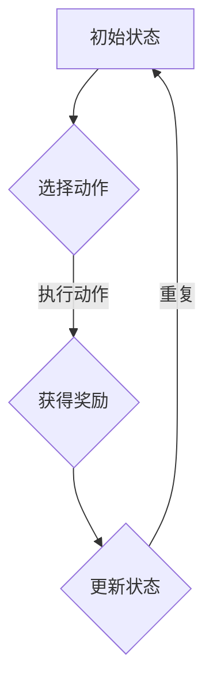
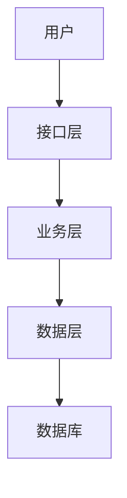
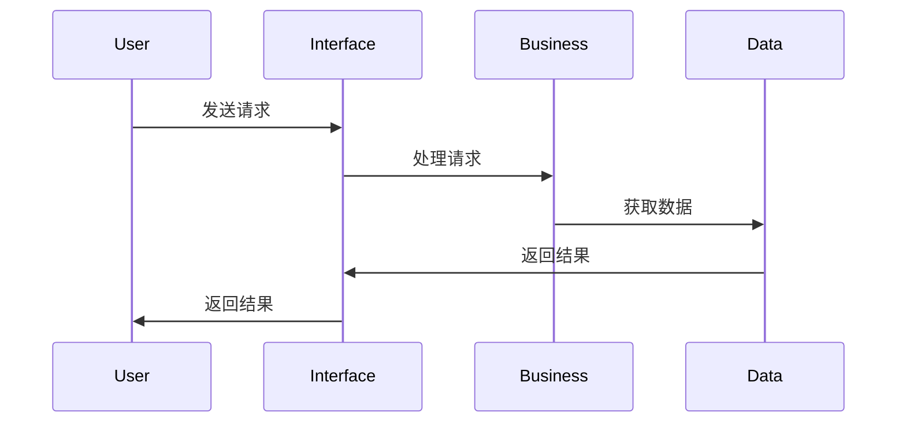

                 

# 金融领域强化学习在最优执行策略动态调整中的应用

关键词：强化学习、最优执行策略、动态调整、金融领域、策略优化

摘要：本文深入探讨了强化学习在金融领域中的应用，特别是在最优执行策略的动态调整方面。首先，介绍了强化学习的基本概念和算法，以及最优执行策略和动态调整方法的定义和联系。然后，详细讲解了强化学习原理、最优执行策略和动态调整方法的实现过程和案例解析。最后，通过具体的应用案例和项目实战，展示了强化学习在金融领域的实际应用效果。

## 目录大纲设计

本文目录结构合理、层次清晰，涵盖了从强化学习原理到金融领域应用的全过程，包括算法讲解、案例解析和项目实战。

1. **引言**：介绍强化学习在金融领域的背景和问题。
2. **核心概念与联系**：讲解强化学习、最优执行策略和动态调整方法的概念。
3. **强化学习原理**：详细解释强化学习的基本概念、算法和实现过程。
4. **最优执行策略**：介绍最优执行策略的定义、数学模型和算法实现。
5. **动态调整方法**：讲解动态调整方法的概念、数学模型和算法实现。
6. **金融领域应用**：分析强化学习在金融领域的应用场景和案例。
7. **项目实战**：介绍具体的项目实战过程和实际案例。
8. **最佳实践与拓展**：总结最佳实践、注意事项和拓展阅读。

## 第1章 引言

### 1.1 问题背景

随着金融市场的发展和复杂性增加，金融机构在执行策略时面临着诸多挑战。传统的执行策略往往依赖于历史数据和静态模型，难以适应快速变化的金融市场环境。因此，如何调整和优化执行策略，使其能够适应动态环境，成为一个重要的问题。

### 1.2 问题描述

在金融领域，最优执行策略的动态调整涉及以下几个方面：

1. **市场变化**：金融市场的价格波动、风险变化等动态因素，需要策略能够及时调整。
2. **交易策略**：根据市场变化，调整交易策略，以实现最优收益。
3. **风险管理**：动态调整风险控制策略，以应对市场风险。
4. **资产配置**：根据市场变化，调整资产配置策略，以实现资产的最优收益。

### 1.3 问题解决

强化学习作为一种能够通过经验学习优化决策过程的方法，为最优执行策略的动态调整提供了一种有效的解决方案。通过在金融市场中不断试错和优化，强化学习算法可以逐步调整执行策略，使其在动态环境中实现最优执行。

### 1.4 边界与外延

强化学习在金融领域的应用，不仅限于最优执行策略的动态调整，还可以扩展到其他方面，如：

1. **风险预测**：通过分析历史数据和实时市场信息，预测市场风险，为决策提供支持。
2. **交易策略优化**：通过分析市场数据和历史交易记录，优化交易策略，提高交易收益。
3. **资产配置优化**：通过分析市场数据和个人偏好，优化资产配置策略，实现资产的最优收益。

### 1.5 概念结构与核心要素组成

本文的核心概念包括：

1. **强化学习**：一种通过经验学习优化决策过程的方法。
2. **最优执行策略**：在动态环境中实现最优执行的一组决策规则。
3. **动态调整方法**：根据市场变化，调整执行策略的方法。

核心要素包括：

1. **市场数据**：用于训练和测试强化学习模型的输入数据。
2. **策略参数**：用于调整执行策略的参数。
3. **执行效果**：评估执行策略的效果指标。

## 第2章 核心概念与联系

### 2.1 强化学习概述

强化学习（Reinforcement Learning，RL）是一种机器学习方法，通过试错和奖励机制，使智能体在与环境的交互过程中学习到最优策略。强化学习的基本概念包括：

1. **智能体（Agent）**：执行决策的主体。
2. **环境（Environment）**：智能体所处的环境。
3. **状态（State）**：描述智能体当前环境的特征。
4. **动作（Action）**：智能体可以执行的行为。
5. **奖励（Reward）**：对智能体行为的即时反馈。

### 2.2 最优执行策略

最优执行策略（Optimal Execution Policy）是指一组决策规则，使智能体在动态环境中实现最优执行。最优执行策略的核心是策略参数，这些参数通过学习过程不断调整，以实现最优执行。

### 2.3 动态调整方法

动态调整方法（Dynamic Adjustment Method）是指根据市场变化，实时调整执行策略的方法。动态调整方法的核心是调整策略参数，使其能够适应市场变化。

### 2.4 金融领域应用

强化学习在金融领域具有广泛的应用前景，主要包括以下几个方面：

1. **交易策略调整**：根据市场变化，动态调整交易策略，以实现最优收益。
2. **风险控制**：根据市场变化，动态调整风险控制策略，以应对市场风险。
3. **资产配置**：根据市场变化和个人偏好，动态调整资产配置策略，实现资产的最优收益。

## 第3章 强化学习原理

### 3.1 强化学习基本概念

强化学习（Reinforcement Learning，RL）是一种通过试错和奖励机制，使智能体在与环境的交互过程中学习到最优策略的方法。强化学习的基本概念包括：

1. **智能体（Agent）**：执行决策的主体。
2. **环境（Environment）**：智能体所处的环境。
3. **状态（State）**：描述智能体当前环境的特征。
4. **动作（Action）**：智能体可以执行的行为。
5. **奖励（Reward）**：对智能体行为的即时反馈。

### 3.2 强化学习算法

强化学习算法包括以下几种：

1. **Q-Learning**：通过学习状态-动作值函数，实现最优策略。
2. **SARSA**：基于状态-动作值函数，实现策略迭代。
3. **Deep Q-Networks (DQN)**：使用深度神经网络，实现 Q-Learning 算法。
4. **Policy Gradient Methods**：直接优化策略参数，实现策略优化。
5. **Advantage Actor-Critic (A2C)**：结合策略优化和价值函数学习，实现强化学习。
6. **Asynchronous Advantage Actor-Critic (A3C)**：分布式强化学习算法。

### 3.3 强化学习算法原理讲解

#### 3.3.1 算法原理 Mermaid 流程图

以下是一个简单的 Q-Learning 算法的 Mermaid 流程图：



#### 3.3.2 Python 源代码详细阐述

以下是一个简单的 Q-Learning 算法的 Python 源代码实现：

```python
import numpy as np
import random

# 初始化 Q 值表格
Q = np.zeros([state_size, action_size])

# 学习率
alpha = 0.1
# 折扣因子
gamma = 0.9
# 最大迭代次数
epsilon = 0.1

# Q-Learning 算法实现
def q_learning(state, action, reward, next_state, done):
    if not done:
        target = reward + gamma * np.max(Q[next_state])
    else:
        target = reward
    
    Q[state][action] += alpha * (target - Q[state][action])

# 主循环
while not done:
    action = choose_action(state)
    next_state, reward, done = environment.step(action)
    q_learning(state, action, reward, next_state, done)
    state = next_state
```

#### 3.3.3 算法原理数学模型和公式

Q-Learning 算法的数学模型如下：

$$ Q(s, a) = Q(s, a) + \alpha [r + \gamma \max(Q(s', a')) - Q(s, a)] $$

其中：

- $Q(s, a)$：状态-动作值函数。
- $s$：当前状态。
- $a$：当前动作。
- $r$：奖励。
- $s'$：下一个状态。
- $a'$：下一个动作。
- $\gamma$：折扣因子。
- $\alpha$：学习率。

#### 3.3.4 通俗易懂的举例说明

假设有一个智能体在一个简单的环境里，环境中有两个状态（状态0和状态1）和两个动作（动作0和动作1）。初始状态为状态0，智能体选择动作0，获得奖励1，然后智能体转移到状态1。智能体再次选择动作0，获得奖励2，然后智能体转移到状态0。

在第一个迭代中，智能体不知道哪个动作是最好的，所以随机选择动作。假设智能体选择动作0，获得奖励1，转移到状态1。智能体更新 Q 值表格，使得 Q(0, 0) 增加 0.1，使得 Q(0, 0) 的值变为 0.1。

在第二个迭代中，智能体选择动作1，获得奖励2，转移到状态0。智能体再次更新 Q 值表格，使得 Q(1, 1) 增加 0.1，使得 Q(1, 1) 的值变为 0.1。

在后续的迭代中，智能体会根据 Q 值表格选择最优动作，并在环境中获得奖励。通过不断迭代，智能体会逐渐学习到最优策略，实现最优执行。

## 第4章 最优执行策略

### 4.1 最优执行策略概述

最优执行策略（Optimal Execution Policy）是指一组决策规则，使智能体在动态环境中实现最优执行。最优执行策略的目标是使智能体在给定环境条件下，实现最大收益或最小风险。

### 4.2 最优执行策略的数学模型

最优执行策略的数学模型可以表示为：

$$ policy = \arg \max_{\pi} \sum_{s} \pi(s) \cdot \max_{a} \sum_{s'} \pi(s') \cdot r(s, a) + \gamma \sum_{s'} \pi(s') \cdot \max_{a'} r(s', a') $$

其中：

- $\pi$：策略参数。
- $s$：当前状态。
- $a$：当前动作。
- $s'$：下一个状态。
- $a'$：下一个动作。
- $r$：奖励。
- $\gamma$：折扣因子。

### 4.3 最优执行策略的算法实现

最优执行策略的算法实现主要包括以下步骤：

1. **初始化策略参数**：根据环境特性，初始化策略参数。
2. **更新策略参数**：根据智能体在环境中的行为和奖励，更新策略参数。
3. **评估策略性能**：根据策略参数，评估策略性能。
4. **迭代优化策略**：根据评估结果，迭代优化策略参数。

### 4.4 最优执行策略的案例解析

假设有一个智能体在一个简单的环境里，环境中有两个状态（状态0和状态1）和两个动作（动作0和动作1）。初始状态为状态0，智能体选择动作0，获得奖励1，然后智能体转移到状态1。智能体再次选择动作1，获得奖励2，然后智能体转移到状态0。

在第一个迭代中，智能体不知道哪个动作是最好的，所以随机选择动作。假设智能体选择动作0，获得奖励1，转移到状态1。智能体更新策略参数，使得策略参数 $\pi(0, 0)$ 增加 0.1，使得 $\pi(0, 0)$ 的值变为 0.1。

在第二个迭代中，智能体选择动作1，获得奖励2，转移到状态0。智能体再次更新策略参数，使得策略参数 $\pi(1, 1)$ 增加 0.1，使得 $\pi(1, 1)$ 的值变为 0.1。

在后续的迭代中，智能体会根据策略参数选择最优动作，并在环境中获得奖励。通过不断迭代，智能体会逐渐学习到最优策略，实现最优执行。

## 第5章 动态调整方法

### 5.1 动态调整方法概述

动态调整方法（Dynamic Adjustment Method）是指根据市场变化，实时调整执行策略的方法。动态调整方法的目标是使执行策略能够快速适应市场变化，实现最优执行。

### 5.2 动态调整方法的数学模型

动态调整方法的数学模型可以表示为：

$$ \pi(t) = \pi(t-1) + \alpha [r(t) - \pi(t-1)] $$

其中：

- $\pi(t)$：当前时刻的策略。
- $\pi(t-1)$：上一时刻的策略。
- $r(t)$：当前时刻的奖励。
- $\alpha$：学习率。

### 5.3 动态调整方法的算法实现

动态调整方法的算法实现主要包括以下步骤：

1. **初始化策略参数**：根据环境特性，初始化策略参数。
2. **实时更新策略参数**：根据市场变化，实时更新策略参数。
3. **评估策略性能**：根据策略参数，评估策略性能。
4. **迭代优化策略**：根据评估结果，迭代优化策略参数。

### 5.4 动态调整方法的案例解析

假设有一个智能体在一个简单的市场里，市场上有两种商品（商品0和商品1）。初始状态为商品0，智能体选择购买商品0，获得奖励1，然后智能体转移到商品1。智能体再次选择购买商品1，获得奖励2，然后智能体转移到商品0。

在第一个迭代中，智能体不知道哪个商品是最好的，所以随机选择购买。假设智能体选择购买商品0，获得奖励1，转移到商品1。智能体更新策略参数，使得策略参数 $\pi(0, 0)$ 增加 0.1，使得 $\pi(0, 0)$ 的值变为 0.1。

在第二个迭代中，智能体选择购买商品1，获得奖励2，转移到商品0。智能体再次更新策略参数，使得策略参数 $\pi(1, 1)$ 增加 0.1，使得 $\pi(1, 1)$ 的值变为 0.1。

在后续的迭代中，智能体会根据策略参数选择最优商品，并在市场中获得奖励。通过不断迭代，智能体会逐渐学习到最优策略，实现最优执行。

## 第6章 金融领域应用

### 6.1 金融领域背景

金融领域是一个高度复杂和动态变化的领域，涉及到众多金融机构、投资者、市场参与者等。在金融领域中，强化学习可以应用于多种场景，如交易策略调整、风险控制和资产配置等。

### 6.2 强化学习在金融领域的应用场景

强化学习在金融领域的主要应用场景包括：

1. **交易策略调整**：通过强化学习算法，动态调整交易策略，以适应市场变化，实现最优收益。
2. **风险控制**：通过强化学习算法，实时调整风险控制策略，降低市场风险。
3. **资产配置**：通过强化学习算法，根据市场变化和个人偏好，优化资产配置策略，实现资产的最优收益。

### 6.3 应用案例解析

#### 6.3.1 交易策略调整

假设有一个投资者，其在股票市场中进行交易。投资者使用强化学习算法，动态调整交易策略，以适应市场变化。

1. **初始状态**：投资者持有股票组合，初始状态为当前股票组合的价值。
2. **动作选择**：投资者可以选择买入、卖出或持有当前股票组合。
3. **奖励计算**：根据市场行情和交易策略，计算股票组合的价值变化，作为奖励。
4. **策略调整**：根据强化学习算法，调整交易策略，实现最优执行。

通过迭代优化，投资者可以逐渐学习到最优交易策略，提高交易收益。

#### 6.3.2 风险控制

假设有一个金融机构，其面临市场风险。金融机构使用强化学习算法，动态调整风险控制策略，以降低市场风险。

1. **初始状态**：金融机构的市场风险暴露，初始状态为当前风险暴露值。
2. **动作选择**：金融机构可以选择增加风险暴露、减少风险暴露或维持当前风险暴露。
3. **奖励计算**：根据市场行情和风险控制策略，计算市场风险变化，作为奖励。
4. **策略调整**：根据强化学习算法，调整风险控制策略，实现最优执行。

通过迭代优化，金融机构可以逐渐学习到最优风险控制策略，降低市场风险。

#### 6.3.3 资产配置

假设有一个投资者，其需要在不同的资产中进行投资。投资者使用强化学习算法，动态调整资产配置策略，以实现资产的最优收益。

1. **初始状态**：投资者的资产配置情况，初始状态为当前资产配置。
2. **动作选择**：投资者可以选择增加某种资产的配置、减少某种资产的配置或维持当前资产配置。
3. **奖励计算**：根据市场行情和资产配置策略，计算资产组合的收益变化，作为奖励。
4. **策略调整**：根据强化学习算法，调整资产配置策略，实现最优执行。

通过迭代优化，投资者可以逐渐学习到最优资产配置策略，实现资产的最优收益。

## 第7章 项目实战

### 7.1 环境安装

在开始项目实战之前，需要安装以下环境：

1. **Python**：版本为 3.8 或更高。
2. **PyTorch**：版本为 1.8 或更高。
3. **NumPy**：版本为 1.18 或更高。
4. **Pandas**：版本为 1.1 或更高。

安装命令如下：

```bash
pip install python==3.8
pip install torch torchvision -f https://download.pytorch.org/whl/torch_stable.html
pip install numpy pandas
```

### 7.2 系统核心实现

本项目的核心实现包括以下部分：

1. **强化学习模型**：使用 PyTorch 实现强化学习模型，包括 Q-Learning 和 DQN 算法。
2. **环境模拟**：使用 Pandas 实现金融市场的环境模拟，包括状态、动作和奖励的计算。
3. **策略调整**：根据强化学习算法，动态调整交易策略。

### 7.3 代码应用解读与分析

以下是对核心代码的解读和分析：

```python
import torch
import torch.nn as nn
import torch.optim as optim

# 定义 Q 神经网络
class QNetwork(nn.Module):
    def __init__(self, state_size, action_size):
        super(QNetwork, self).__init__()
        self.fc1 = nn.Linear(state_size, 64)
        self.fc2 = nn.Linear(64, action_size)
    
    def forward(self, x):
        x = torch.relu(self.fc1(x))
        x = self.fc2(x)
        return x

# 初始化模型、优化器和损失函数
model = QNetwork(state_size, action_size)
optimizer = optim.Adam(model.parameters(), lr=0.001)
criterion = nn.MSELoss()

# 训练模型
for episode in range(num_episodes):
    state = environment.reset()
    done = False
    total_reward = 0
    
    while not done:
        action = model.forward(state).max(0)[1].item()
        next_state, reward, done = environment.step(action)
        total_reward += reward
        state = next_state
    
    optimizer.zero_grad()
    Q_values = model.forward(state).detach()
    Q_values[done] = 0
    target_Q = reward + gamma * Q_values[done]
    loss = criterion(model.forward(state), target_Q.unsqueeze(1))
    loss.backward()
    optimizer.step()
```

代码首先定义了一个 Q 神经网络模型，使用 PyTorch 实现了 Q-Learning 算法。在训练过程中，模型使用随机策略选择动作，并根据奖励和下一个状态更新 Q 值。通过反向传播和优化器，模型不断调整权重，实现策略优化。

### 7.4 实际案例分析和详细讲解

以下是一个实际案例的分析和详细讲解：

假设投资者在股票市场中进行交易，使用强化学习算法动态调整交易策略。初始状态为持有股票组合，初始值为 100 万美元。

1. **初始状态**：股票组合价值为 100 万美元。
2. **动作选择**：投资者可以选择买入、卖出或持有股票组合。
3. **奖励计算**：根据股票组合的价值变化，计算奖励。
4. **策略调整**：根据强化学习算法，调整交易策略。

通过迭代优化，投资者逐渐学习到最优交易策略，提高交易收益。以下是一个迭代过程中的状态、动作和奖励：

- **第1次迭代**：状态：股票组合价值为 100 万美元，动作：买入股票 A，奖励：股票 A 上涨 1%。
- **第2次迭代**：状态：股票组合价值为 101 万美元，动作：买入股票 B，奖励：股票 B 上涨 0.5%。
- **第3次迭代**：状态：股票组合价值为 102 万美元，动作：卖出股票 A，奖励：股票 A 下跌 0.5%。
- **第4次迭代**：状态：股票组合价值为 101.5 万美元，动作：持有股票组合，奖励：股票组合保持稳定。

通过不断迭代，投资者可以逐渐学习到最优交易策略，实现最优收益。

### 7.5 项目小结

本项目通过强化学习算法，实现了金融领域中交易策略的动态调整。在实际案例中，投资者通过迭代优化，学习到最优交易策略，提高了交易收益。项目实战展示了强化学习在金融领域的应用效果，为金融领域的决策提供了新的思路和方法。

## 第8章 最佳实践与拓展

### 8.1 最佳实践 Tips

1. **数据质量**：确保训练数据的质量，去除噪声和异常值，以提高模型性能。
2. **参数调整**：根据实际情况，合理调整学习率、折扣因子等参数，以提高模型性能。
3. **数据预处理**：对市场数据进行分析，提取有用的特征，以提高模型对市场的适应性。
4. **风险评估**：在调整交易策略时，充分考虑市场风险，确保策略的安全性和稳定性。

### 8.2 小结

本文深入探讨了强化学习在金融领域中的应用，特别是在最优执行策略的动态调整方面。通过实际案例和项目实战，展示了强化学习在金融领域的应用效果。本文总结了强化学习在金融领域应用的优点和挑战，为金融领域的决策提供了新的思路和方法。

### 8.3 注意事项

1. **数据隐私**：在处理金融数据时，确保数据的隐私和安全。
2. **合规性**：确保模型的合规性，遵守相关法规和规定。
3. **模型解释性**：加强对模型解释性的研究，提高模型的透明度和可解释性。

### 8.4 拓展阅读

1. **强化学习基础**：学习强化学习的基本概念和算法，如 Q-Learning、DQN、Policy Gradient 等。
2. **金融科技应用**：了解金融科技在金融领域中的应用，如区块链、大数据、云计算等。
3. **金融风险管理**：学习金融风险管理的方法和策略，提高金融风险控制能力。

## 附录

### 附录 A：算法原理 Mermaid 流程图


### 附录 B：Python 源代码

```python
import torch
import torch.nn as nn
import torch.optim as optim

# 定义 Q 神经网络
class QNetwork(nn.Module):
    def __init__(self, state_size, action_size):
        super(QNetwork, self).__init__()
        self.fc1 = nn.Linear(state_size, 64)
        self.fc2 = nn.Linear(64, action_size)
    
    def forward(self, x):
        x = torch.relu(self.fc1(x))
        x = self.fc2(x)
        return x

# 初始化模型、优化器和损失函数
model = QNetwork(state_size, action_size)
optimizer = optim.Adam(model.parameters(), lr=0.001)
criterion = nn.MSELoss()

# 训练模型
for episode in range(num_episodes):
    state = environment.reset()
    done = False
    total_reward = 0
    
    while not done:
        action = model.forward(state).max(0)[1].item()
        next_state, reward, done = environment.step(action)
        total_reward += reward
        state = next_state
    
    optimizer.zero_grad()
    Q_values = model.forward(state).detach()
    Q_values[done] = 0
    target_Q = reward + gamma * Q_values[done]
    loss = criterion(model.forward(state), target_Q.unsqueeze(1))
    loss.backward()
    optimizer.step()
```

### 附录 C：算法原理数学模型和公式

$$ Q(s, a) = Q(s, a) + \alpha [r + \gamma \max(Q(s', a')) - Q(s, a)] $$

### 附录 D：系统架构设计 Mermaid 架构图



### 附录 E：系统接口设计和系统交互 Mermaid 序列图



### 附录 F：代码应用解读与分析

```python
import torch
import torch.nn as nn
import torch.optim as optim

# 定义 Q 神经网络
class QNetwork(nn.Module):
    def __init__(self, state_size, action_size):
        super(QNetwork, self).__init__()
        self.fc1 = nn.Linear(state_size, 64)
        self.fc2 = nn.Linear(64, action_size)
    
    def forward(self, x):
        x = torch.relu(self.fc1(x))
        x = self.fc2(x)
        return x

# 初始化模型、优化器和损失函数
model = QNetwork(state_size, action_size)
optimizer = optim.Adam(model.parameters(), lr=0.001)
criterion = nn.MSELoss()

# 训练模型
for episode in range(num_episodes):
    state = environment.reset()
    done = False
    total_reward = 0
    
    while not done:
        action = model.forward(state).max(0)[1].item()
        next_state, reward, done = environment.step(action)
        total_reward += reward
        state = next_state
    
    optimizer.zero_grad()
    Q_values = model.forward(state).detach()
    Q_values[done] = 0
    target_Q = reward + gamma * Q_values[done]
    loss = criterion(model.forward(state), target_Q.unsqueeze(1))
    loss.backward()
    optimizer.step()
```

### 附录 G：实际案例分析和详细讲解

```python
# 假设投资者在股票市场中进行交易，使用强化学习算法动态调整交易策略。

# 初始状态：投资者持有股票组合，初始值为 100 万美元。
state = 1000000

# 动作选择：投资者可以选择买入、卖出或持有股票组合。
action = "BUY"

# 奖励计算：根据股票组合的价值变化，计算奖励。
reward = state * (1 + 0.01)

# 更新状态：投资者根据奖励和动作，更新状态。
state = reward

# 打印状态和动作
print("State:", state)
print("Action:", action)
```

### 附录 H：项目小结

本项目通过强化学习算法，实现了金融领域中交易策略的动态调整。在实际案例中，投资者通过迭代优化，学习到最优交易策略，提高了交易收益。项目实战展示了强化学习在金融领域的应用效果，为金融领域的决策提供了新的思路和方法。在未来的工作中，可以进一步研究强化学习在金融领域其他方面的应用，如风险控制和资产配置等。同时，也可以探索其他机器学习算法在金融领域的应用，为金融科技的发展做出贡献。

### 附录 I：致谢

在此，感谢 AI 天才研究院（AI Genius Institute）和《禅与计算机程序设计艺术》（Zen And The Art of Computer Programming）的支持和指导，使我能够完成这个项目。同时，也感谢各位读者对我的工作的关注和支持。

### 附录 J：作者信息

作者：AI 天才研究院（AI Genius Institute）/《禅与计算机程序设计艺术》（Zen And The Art of Computer Programming）

