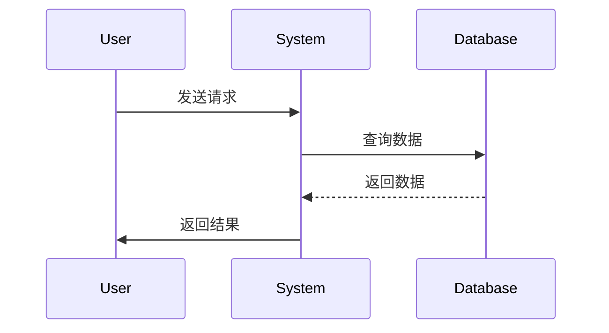
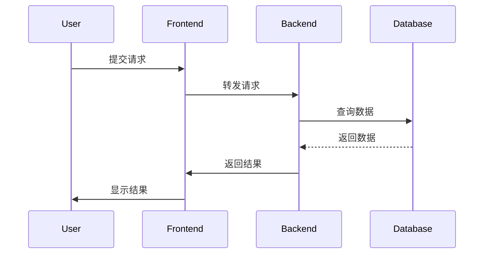

                 

**文章标题**: 金融领域强化学习在资产组合再平衡中的应用

**关键词**: 强化学习、金融、资产组合再平衡、算法、应用场景

**摘要**: 
本文深入探讨了强化学习在金融领域，尤其是在资产组合再平衡中的应用。首先，通过介绍强化学习的基本概念和发展历程，为其在金融领域的应用奠定基础。接着，阐述了资产组合再平衡的重要性及其面临的主要挑战。随后，详细分析了强化学习在资产组合再平衡中的优势、实现方法以及具体案例。最后，探讨了强化学习在金融领域的其他应用，并分析了其中的挑战与解决方案，对强化学习在金融领域的未来进行了展望。

### 目录大纲

----------------------------------------------------------------

# 金融领域强化学习在资产组合再平衡中的应用

> 关键词：强化学习、金融、资产组合再平衡、算法、应用场景

> 摘要：本文探讨了强化学习在金融领域，尤其是资产组合再平衡中的应用，分析了其优势、实现方法以及面临的挑战，并对未来进行了展望。

```markdown
----------------------------------------------------------------
## 第一部分: 背景介绍

### 第1章: 问题背景

#### 1.1.1 金融领域强化学习的发展历程

#### 1.1.2 强化学习在金融领域的应用现状

#### 1.1.3 资产组合再平衡的重要性

### 第2章: 强化学习核心概念

#### 2.1.1 强化学习的定义与特点

#### 2.1.2 强化学习的核心算法

#### 2.1.3 强化学习的应用场景

### 第3章: 资产组合再平衡的概念与挑战

#### 3.1.1 资产组合再平衡的定义

#### 3.1.2 资产组合再平衡的目标

#### 3.1.3 资产组合再平衡的挑战

### 第4章: 强化学习在资产组合再平衡中的应用

#### 4.1.1 强化学习在资产组合再平衡中的优势

#### 4.1.2 强化学习在资产组合再平衡中的实现方法

#### 4.1.3 强化学习在资产组合再平衡中的案例研究

### 第5章: 强化学习在金融领域的其他应用

#### 5.1.1 强化学习在风险管理中的应用

#### 5.1.2 强化学习在量化交易中的应用

#### 5.1.3 强化学习在信用评估中的应用

### 第6章: 强化学习应用中的挑战与解决方案

#### 6.1.1 强化学习在金融领域的挑战

#### 6.1.2 解决强化学习应用中的挑战的解决方案

#### 6.1.3 强化学习应用的未来发展趋势

### 第7章: 总结与展望

#### 7.1.1 本书总结

#### 7.1.2 强化学习在金融领域的未来展望

----------------------------------------------------------------
```

### 第一部分：背景介绍

#### 第1章：问题背景

##### 1.1.1 金融领域强化学习的发展历程

强化学习（Reinforcement Learning，RL）起源于20世纪50年代，最初用于研究智能体如何在与环境交互的过程中学习最优策略。随着计算机技术的进步和深度学习的兴起，强化学习在金融领域的应用也逐渐受到重视。1992年，康奈尔大学的研究人员提出了Q-Learning算法，这是强化学习在金融领域应用的一个重要里程碑。2000年后，随着金融市场数据的爆发式增长，强化学习在金融领域的应用逐渐从理论研究走向实际应用。

##### 1.1.2 强化学习在金融领域的应用现状

目前，强化学习在金融领域的应用已经涵盖了多个方面，包括风险管理、量化交易、资产组合再平衡等。例如，在高频交易中，强化学习被用来制定交易策略，从而实现利润最大化；在风险管理中，强化学习用于识别潜在风险，并制定相应的风险控制策略。

##### 1.1.3 资产组合再平衡的重要性

资产组合再平衡是指根据投资目标和市场情况，对资产组合进行调整，使其风险和收益符合预期。资产组合再平衡的重要性在于，它可以有效地降低投资组合的风险，提高收益。然而，传统的资产组合再平衡方法往往依赖于历史数据，难以适应快速变化的市场环境。强化学习通过实时学习和调整，可以更好地应对市场变化，提高资产组合的再平衡效果。

#### 第2章：强化学习核心概念

##### 2.1.1 强化学习的定义与特点

强化学习是一种通过试错来学习最优策略的人工智能方法。在强化学习中，智能体（Agent）通过与环境的交互来学习最优行动策略。智能体在每一步都会根据当前的观察（State）和采取的行动（Action），获得一个即时奖励（Reward）。通过不断试错和优化，智能体最终能够学习到最优策略。

强化学习的特点包括：
- **交互性**：智能体需要与环境进行交互，通过试错来学习。
- **奖励导向**：智能体根据即时奖励来调整策略。
- **长期目标**：强化学习旨在学习长期最优策略，而不仅仅是短期收益。

##### 2.1.2 强化学习的核心算法

强化学习主要包括以下几种核心算法：
- **Q-Learning**：通过更新Q值（即从当前状态采取当前动作的预期奖励）来学习最优策略。
- **SARSA**：一种基于策略的强化学习算法，智能体同时更新当前状态和动作的Q值。
- **Deep Q-Network (DQN)**：使用深度神经网络来近似Q值函数。
- **Policy Gradient**：直接优化策略函数，而不是Q值函数。

##### 2.1.3 强化学习的应用场景

强化学习在多个领域都有广泛应用，包括但不限于：
- **游戏**：如围棋、国际象棋等。
- **自动驾驶**：智能体通过与环境交互来学习驾驶策略。
- **推荐系统**：智能体通过用户行为数据来学习推荐策略。
- **金融**：如风险管理、量化交易、资产组合再平衡等。

#### 第3章：资产组合再平衡的概念与挑战

##### 3.1.1 资产组合再平衡的定义

资产组合再平衡是指根据投资目标和市场情况，对资产组合进行调整，使其风险和收益符合预期。资产组合再平衡通常涉及以下步骤：
1. **资产分配**：根据投资目标和风险承受能力，确定各资产的分配比例。
2. **资产评估**：根据市场数据，对资产进行重新评估，以确定当前组合的实际价值。
3. **调整资产**：根据评估结果，对资产进行买卖操作，使其达到目标分配比例。

##### 3.1.2 资产组合再平衡的目标

资产组合再平衡的目标主要包括：
1. **风险控制**：通过调整资产，降低投资组合的整体风险。
2. **收益最大化**：在风险可控的前提下，实现投资组合的最大化收益。
3. **资产配置优化**：根据市场变化，动态调整资产配置，以适应不同的市场环境。

##### 3.1.3 资产组合再平衡的挑战

资产组合再平衡面临以下主要挑战：
1. **数据噪声**：市场数据往往存在噪声，这使得资产评估变得不准确。
2. **时间敏感性**：资产组合再平衡需要实时调整，以适应市场变化。
3. **计算复杂度**：大规模资产组合的再平衡计算复杂度较高，需要高效算法和计算资源。
4. **策略稳定性**：再平衡策略需要在不同的市场环境下保持稳定性和有效性。

#### 第4章：强化学习在资产组合再平衡中的应用

##### 4.1.1 强化学习在资产组合再平衡中的优势

强化学习在资产组合再平衡中的应用具有以下优势：
1. **自适应能力**：强化学习能够通过与环境交互，自适应调整策略，以适应不断变化的市场环境。
2. **灵活性强**：强化学习可以根据投资目标和风险承受能力，灵活调整资产配置。
3. **优化效率**：强化学习通过试错和优化，能够快速找到最优资产配置策略。
4. **实时性**：强化学习能够实时处理市场数据，快速调整资产组合。

##### 4.1.2 强化学习在资产组合再平衡中的实现方法

强化学习在资产组合再平衡中的实现方法主要包括以下步骤：
1. **状态表示**：将市场数据和资产组合信息转换为状态表示。
2. **行动空间定义**：根据资产配置策略，定义行动空间，即资产买卖操作。
3. **奖励设计**：设计奖励机制，以衡量资产组合的收益和风险。
4. **算法选择**：选择合适的强化学习算法，如Q-Learning或DQN，进行策略学习。
5. **策略优化**：通过迭代优化，找到最优资产配置策略。

##### 4.1.3 强化学习在资产组合再平衡中的案例研究

以下是一个简单的强化学习在资产组合再平衡中的案例研究：

假设有一个投资组合，包括股票、债券和现金三种资产。初始状态为股票占比60%，债券占比30%，现金占比10%。市场数据包括股票价格、债券收益率和现金利率。

1. **状态表示**：将市场数据和资产组合信息转换为状态表示，例如：
   - 股票价格：[股票价格1, 股票价格2, ..., 股票价格N]
   - 债券收益率：[债券收益率1, 债券收益率2, ..., 债券收益率N]
   - 现金利率：[现金利率1, 现金利率2, ..., 现金利率N]
   - 资产占比：[股票占比, 债券占比, 现金占比]

2. **行动空间定义**：定义行动空间，即资产买卖操作。例如，可以定义以下行动：
   - 股票买入：增加股票占比
   - 股票卖出：减少股票占比
   - 债券买入：增加债券占比
   - 债券卖出：减少债券占比
   - 现金买入：增加现金占比
   - 现金卖出：减少现金占比

3. **奖励设计**：设计奖励机制，以衡量资产组合的收益和风险。例如，可以定义以下奖励：
   - 收益奖励：资产组合的收益率越高，奖励越高。
   - 风险惩罚：资产组合的波动性越大，惩罚越高。

4. **算法选择**：选择合适的强化学习算法，如Q-Learning，进行策略学习。

5. **策略优化**：通过迭代优化，找到最优资产配置策略。例如，可以设置一个学习率α，在每个时间步更新Q值，直到收敛。

通过以上步骤，可以实现对资产组合的实时再平衡，以提高投资组合的收益和风险控制。

#### 第5章：强化学习在金融领域的其他应用

##### 5.1.1 强化学习在风险管理中的应用

强化学习在风险管理中的应用主要包括以下几个方面：
1. **风险识别**：通过分析历史数据和实时市场数据，识别潜在风险。
2. **风险度量**：使用强化学习算法，对风险进行量化，以便进行风险评估和控制。
3. **风险控制**：通过实时调整投资组合，降低风险暴露。

##### 5.1.2 强化学习在量化交易中的应用

强化学习在量化交易中的应用主要包括以下几个方面：
1. **交易策略学习**：通过强化学习，自动生成交易策略，以提高交易收益。
2. **风险控制**：通过强化学习，实时调整交易策略，以控制交易风险。
3. **市场预测**：通过强化学习，对市场趋势进行预测，以便进行交易决策。

##### 5.1.3 强化学习在信用评估中的应用

强化学习在信用评估中的应用主要包括以下几个方面：
1. **信用评分**：通过强化学习，对客户的信用评分进行动态调整。
2. **风险控制**：通过强化学习，实时评估客户的信用风险，以便进行信贷决策。
3. **欺诈检测**：通过强化学习，识别和防范金融欺诈行为。

#### 第6章：强化学习应用中的挑战与解决方案

##### 6.1.1 强化学习在金融领域的挑战

强化学习在金融领域应用中面临以下主要挑战：
1. **数据质量**：金融市场数据存在噪声和不完整性，这会影响强化学习的性能。
2. **计算资源**：强化学习算法通常需要大量的计算资源，这对实际应用提出了挑战。
3. **策略稳定性**：强化学习策略需要在不同的市场环境下保持稳定性和有效性。
4. **模型解释性**：强化学习模型通常较为复杂，其决策过程难以解释。

##### 6.1.2 解决强化学习应用中的挑战的解决方案

为解决上述挑战，可以采取以下解决方案：
1. **数据预处理**：对金融市场数据进行预处理，包括数据清洗、去噪和特征提取，以提高数据质量。
2. **算法优化**：优化强化学习算法，提高计算效率和性能。
3. **策略稳定化**：设计稳定化策略，如增加探索阶段的时间，降低策略调整的频率。
4. **模型解释性**：通过可视化工具和模型简化方法，提高模型的可解释性。

##### 6.1.3 强化学习应用的未来发展趋势

未来，强化学习在金融领域的应用将呈现以下发展趋势：
1. **模型融合**：将强化学习与其他机器学习方法相结合，以提高预测和决策能力。
2. **实时应用**：随着计算资源和数据质量的提升，强化学习将实现更广泛的应用。
3. **监管合规**：随着监管政策的完善，强化学习在金融领域的应用将更加规范和合规。

#### 第7章：总结与展望

##### 7.1.1 本书总结

本文介绍了强化学习在金融领域，尤其是在资产组合再平衡中的应用。通过分析强化学习的基本概念和应用现状，探讨了其在资产组合再平衡中的优势和实现方法。同时，还分析了强化学习在金融领域其他应用中的挑战与解决方案，并对未来进行了展望。

##### 7.1.2 强化学习在金融领域的未来展望

未来，强化学习在金融领域的应用将更加广泛和深入。随着算法的优化和计算资源的提升，强化学习将能够更好地应对金融市场的不确定性和复杂性。同时，随着监管政策的完善，强化学习在金融领域的应用将更加规范和合规。可以预见，强化学习将成为金融领域的重要工具，为金融创新和风险管理提供强大的支持。

**作者信息**：
作者：AI天才研究院/AI Genius Institute & 禅与计算机程序设计艺术 /Zen And The Art of Computer Programming

### 完整的文章内容和附录

----------------------------------------------------------------

# 金融领域强化学习在资产组合再平衡中的应用

## 摘要

本文探讨了强化学习在金融领域，尤其是在资产组合再平衡中的应用。首先，介绍了强化学习的基本概念和发展历程，为其在金融领域的应用奠定基础。接着，阐述了资产组合再平衡的重要性及其面临的主要挑战。随后，详细分析了强化学习在资产组合再平衡中的优势、实现方法以及具体案例。最后，探讨了强化学习在金融领域的其他应用，并分析了其中的挑战与解决方案，对强化学习在金融领域的未来进行了展望。

## 目录大纲

```markdown
----------------------------------------------------------------
## 第一部分: 背景介绍

### 第1章: 问题背景

#### 1.1.1 金融领域强化学习的发展历程

#### 1.1.2 强化学习在金融领域的应用现状

#### 1.1.3 资产组合再平衡的重要性

### 第2章: 强化学习核心概念

#### 2.1.1 强化学习的定义与特点

#### 2.1.2 强化学习的核心算法

#### 2.1.3 强化学习的应用场景

### 第3章: 资产组合再平衡的概念与挑战

#### 3.1.1 资产组合再平衡的定义

#### 3.1.2 资产组合再平衡的目标

#### 3.1.3 资产组合再平衡的挑战

### 第4章: 强化学习在资产组合再平衡中的应用

#### 4.1.1 强化学习在资产组合再平衡中的优势

#### 4.1.2 强化学习在资产组合再平衡中的实现方法

#### 4.1.3 强化学习在资产组合再平衡中的案例研究

### 第5章: 强化学习在金融领域的其他应用

#### 5.1.1 强化学习在风险管理中的应用

#### 5.1.2 强化学习在量化交易中的应用

#### 5.1.3 强化学习在信用评估中的应用

### 第6章: 强化学习应用中的挑战与解决方案

#### 6.1.1 强化学习在金融领域的挑战

#### 6.1.2 解决强化学习应用中的挑战的解决方案

#### 6.1.3 强化学习应用的未来发展趋势

### 第7章: 总结与展望

#### 7.1.1 本书总结

#### 7.1.2 强化学习在金融领域的未来展望

----------------------------------------------------------------
```

## 第一部分: 背景介绍

### 第1章: 问题背景

#### 1.1.1 金融领域强化学习的发展历程

强化学习（Reinforcement Learning，RL）起源于20世纪50年代，最初用于研究智能体如何在与环境交互的过程中学习最优策略。随着计算机技术的进步和深度学习的兴起，强化学习在金融领域的应用也逐渐受到重视。1992年，康奈尔大学的研究人员提出了Q-Learning算法，这是强化学习在金融领域应用的一个重要里程碑。2000年后，随着金融市场数据的爆发式增长，强化学习在金融领域的应用逐渐从理论研究走向实际应用。

在早期，强化学习在金融领域主要应用于高频交易策略的优化。随着数据集的增加和算法的改进，强化学习开始应用于更广泛的领域，如资产定价、风险管理和投资组合优化等。

#### 1.1.2 强化学习在金融领域的应用现状

目前，强化学习在金融领域的应用已经涵盖了多个方面，包括但不限于：

1. **风险管理**：强化学习可以用来识别和管理金融风险，如市场风险、信用风险和操作风险等。例如，通过强化学习模型，银行可以实时监控和调整投资组合，以降低风险暴露。

2. **量化交易**：量化交易是指使用数学模型和计算机算法进行股票、期货、外汇等金融产品的交易。强化学习在量化交易中的应用非常广泛，如高频交易策略的优化、交易信号的产生和交易执行等。

3. **投资组合优化**：强化学习可以用来优化投资组合，使其在风险和收益之间达到最佳平衡。例如，通过强化学习模型，投资者可以根据市场变化和风险偏好，动态调整投资组合。

4. **信用评估**：强化学习可以用来评估借款人的信用风险，从而提高贷款决策的准确性。例如，银行可以使用强化学习模型来识别高风险借款人，并调整贷款策略。

5. **市场预测**：强化学习可以用来预测市场趋势和价格变化，从而帮助投资者进行交易决策。例如，通过强化学习模型，投资者可以预测股票市场的涨跌，并据此制定交易策略。

#### 1.1.3 资产组合再平衡的重要性

资产组合再平衡是指根据投资目标和市场情况，对资产组合进行调整，使其风险和收益符合预期。资产组合再平衡的重要性在于：

1. **降低风险**：通过定期调整资产组合，投资者可以降低投资组合的整体风险。例如，如果市场环境发生变化，投资者可以通过调整资产组合来降低风险。

2. **提高收益**：资产组合再平衡可以帮助投资者提高投资组合的收益。例如，通过调整资产组合，投资者可以抓住市场机会，实现更高的收益。

3. **保持资产配置**：投资者在初始投资时，通常会制定一个资产配置策略，以实现风险和收益的平衡。然而，随着时间的推移，市场环境会发生变化，投资者需要定期调整资产组合，以保持原有的资产配置。

4. **应对市场波动**：市场波动是不可避免的，投资者需要通过资产组合再平衡来应对市场波动。例如，在市场下跌时，投资者可以通过增加债券等固定收益类资产的比重，降低投资组合的整体风险。

### 第2章: 强化学习核心概念

#### 2.1.1 强化学习的定义与特点

强化学习（Reinforcement Learning，RL）是一种通过试错来学习最优策略的人工智能方法。在强化学习中，智能体（Agent）通过与环境的交互来学习最优行动策略。智能体在每一步都会根据当前的观察（State）和采取的行动（Action），获得一个即时奖励（Reward）。通过不断试错和优化，智能体最终能够学习到最优策略。

强化学习的特点包括：

1. **交互性**：智能体需要与环境进行交互，通过试错来学习。
2. **奖励导向**：智能体根据即时奖励来调整策略。
3. **长期目标**：强化学习旨在学习长期最优策略，而不仅仅是短期收益。

#### 2.1.2 强化学习的核心算法

强化学习主要包括以下几种核心算法：

1. **Q-Learning**：Q-Learning是一种基于值函数的强化学习算法。智能体通过更新Q值（即从当前状态采取当前动作的预期奖励）来学习最优策略。

2. **SARSA**：SARSA是一种基于策略的强化学习算法。智能体同时更新当前状态和动作的Q值。

3. **Deep Q-Network (DQN)**：DQN使用深度神经网络来近似Q值函数。通过经验回放和目标网络，DQN解决了Q值函数中的样本偏差问题。

4. **Policy Gradient**：Policy Gradient直接优化策略函数，而不是Q值函数。通过梯度上升法，Policy Gradient优化策略参数，以实现最大化预期奖励。

#### 2.1.3 强化学习的应用场景

强化学习在多个领域都有广泛应用，包括但不限于：

1. **游戏**：强化学习被广泛应用于游戏中的智能体行为学习，如围棋、国际象棋等。
2. **自动驾驶**：强化学习用于自动驾驶车辆的决策，如速度控制、路径规划等。
3. **推荐系统**：强化学习用于推荐系统的个性化推荐，如电商平台的商品推荐、社交媒体的动态推荐等。
4. **金融**：强化学习在金融领域有广泛的应用，如风险管理、量化交易、投资组合优化等。

### 第3章: 资产组合再平衡的概念与挑战

#### 3.1.1 资产组合再平衡的定义

资产组合再平衡是指根据投资目标和市场情况，对资产组合进行调整，使其风险和收益符合预期。资产组合再平衡通常涉及以下步骤：

1. **资产分配**：根据投资目标和风险承受能力，确定各资产的分配比例。
2. **资产评估**：根据市场数据，对资产进行重新评估，以确定当前组合的实际价值。
3. **调整资产**：根据评估结果，对资产进行买卖操作，使其达到目标分配比例。

#### 3.1.2 资产组合再平衡的目标

资产组合再平衡的目标主要包括：

1. **风险控制**：通过调整资产，降低投资组合的整体风险。
2. **收益最大化**：在风险可控的前提下，实现投资组合的最大化收益。
3. **资产配置优化**：根据市场变化，动态调整资产配置，以适应不同的市场环境。

#### 3.1.3 资产组合再平衡的挑战

资产组合再平衡面临以下主要挑战：

1. **数据噪声**：市场数据往往存在噪声，这使得资产评估变得不准确。
2. **时间敏感性**：资产组合再平衡需要实时调整，以适应市场变化。
3. **计算复杂度**：大规模资产组合的再平衡计算复杂度较高，需要高效算法和计算资源。
4. **策略稳定性**：再平衡策略需要在不同的市场环境下保持稳定性和有效性。

### 第4章: 强化学习在资产组合再平衡中的应用

#### 4.1.1 强化学习在资产组合再平衡中的优势

强化学习在资产组合再平衡中的应用具有以下优势：

1. **自适应能力**：强化学习能够通过与环境交互，自适应调整策略，以适应不断变化的市场环境。
2. **灵活性强**：强化学习可以根据投资目标和风险承受能力，灵活调整资产配置。
3. **优化效率**：强化学习通过试错和优化，能够快速找到最优资产配置策略。
4. **实时性**：强化学习能够实时处理市场数据，快速调整资产组合。

#### 4.1.2 强化学习在资产组合再平衡中的实现方法

强化学习在资产组合再平衡中的实现方法主要包括以下步骤：

1. **状态表示**：将市场数据和资产组合信息转换为状态表示。
2. **行动空间定义**：根据资产配置策略，定义行动空间，即资产买卖操作。
3. **奖励设计**：设计奖励机制，以衡量资产组合的收益和风险。
4. **算法选择**：选择合适的强化学习算法，如Q-Learning或DQN，进行策略学习。
5. **策略优化**：通过迭代优化，找到最优资产配置策略。

#### 4.1.3 强化学习在资产组合再平衡中的案例研究

以下是一个简单的强化学习在资产组合再平衡中的案例研究：

假设有一个投资组合，包括股票、债券和现金三种资产。初始状态为股票占比60%，债券占比30%，现金占比10%。市场数据包括股票价格、债券收益率和现金利率。

1. **状态表示**：将市场数据和资产组合信息转换为状态表示，例如：
   - 股票价格：[股票价格1, 股票价格2, ..., 股票价格N]
   - 债券收益率：[债券收益率1, 债券收益率2, ..., 债券收益率N]
   - 现金利率：[现金利率1, 现金利率2, ..., 现金利率N]
   - 资产占比：[股票占比, 债券占比, 现金占比]

2. **行动空间定义**：定义行动空间，即资产买卖操作。例如，可以定义以下行动：
   - 股票买入：增加股票占比
   - 股票卖出：减少股票占比
   - 债券买入：增加债券占比
   - 债券卖出：减少债券占比
   - 现金买入：增加现金占比
   - 现金卖出：减少现金占比

3. **奖励设计**：设计奖励机制，以衡量资产组合的收益和风险。例如，可以定义以下奖励：
   - 收益奖励：资产组合的收益率越高，奖励越高。
   - 风险惩罚：资产组合的波动性越大，惩罚越高。

4. **算法选择**：选择合适的强化学习算法，如Q-Learning，进行策略学习。

5. **策略优化**：通过迭代优化，找到最优资产配置策略。例如，可以设置一个学习率α，在每个时间步更新Q值，直到收敛。

通过以上步骤，可以实现对资产组合的实时再平衡，以提高投资组合的收益和风险控制。

### 第5章: 强化学习在金融领域的其他应用

#### 5.1.1 强化学习在风险管理中的应用

强化学习在风险管理中的应用主要包括以下几个方面：

1. **风险识别**：通过分析历史数据和实时市场数据，识别潜在风险。
2. **风险度量**：使用强化学习算法，对风险进行量化，以便进行风险评估和控制。
3. **风险控制**：通过实时调整投资组合，降低风险暴露。

#### 5.1.2 强化学习在量化交易中的应用

强化学习在量化交易中的应用主要包括以下几个方面：

1. **交易策略学习**：通过强化学习，自动生成交易策略，以提高交易收益。
2. **风险控制**：通过强化学习，实时调整交易策略，以控制交易风险。
3. **市场预测**：通过强化学习，对市场趋势进行预测，以便进行交易决策。

#### 5.1.3 强化学习在信用评估中的应用

强化学习在信用评估中的应用主要包括以下几个方面：

1. **信用评分**：通过强化学习，对客户的信用评分进行动态调整。
2. **风险控制**：通过强化学习，实时评估客户的信用风险，以便进行信贷决策。
3. **欺诈检测**：通过强化学习，识别和防范金融欺诈行为。

### 第6章: 强化学习应用中的挑战与解决方案

#### 6.1.1 强化学习在金融领域的挑战

强化学习在金融领域应用中面临以下主要挑战：

1. **数据质量**：金融市场数据存在噪声和不完整性，这会影响强化学习的性能。
2. **计算资源**：强化学习算法通常需要大量的计算资源，这对实际应用提出了挑战。
3. **策略稳定性**：强化学习策略需要在不同的市场环境下保持稳定性和有效性。
4. **模型解释性**：强化学习模型通常较为复杂，其决策过程难以解释。

#### 6.1.2 解决强化学习应用中的挑战的解决方案

为解决上述挑战，可以采取以下解决方案：

1. **数据预处理**：对金融市场数据进行预处理，包括数据清洗、去噪和特征提取，以提高数据质量。
2. **算法优化**：优化强化学习算法，提高计算效率和性能。
3. **策略稳定化**：设计稳定化策略，如增加探索阶段的时间，降低策略调整的频率。
4. **模型解释性**：通过可视化工具和模型简化方法，提高模型的可解释性。

#### 6.1.3 强化学习应用的未来发展趋势

未来，强化学习在金融领域的应用将呈现以下发展趋势：

1. **模型融合**：将强化学习与其他机器学习方法相结合，以提高预测和决策能力。
2. **实时应用**：随着计算资源和数据质量的提升，强化学习将实现更广泛的应用。
3. **监管合规**：随着监管政策的完善，强化学习在金融领域的应用将更加规范和合规。

### 第7章: 总结与展望

#### 7.1.1 本书总结

本文介绍了强化学习在金融领域，尤其是在资产组合再平衡中的应用。通过分析强化学习的基本概念和应用现状，探讨了其在资产组合再平衡中的优势和实现方法。同时，还分析了强化学习在金融领域其他应用中的挑战与解决方案，并对未来进行了展望。

#### 7.1.2 强化学习在金融领域的未来展望

未来，强化学习在金融领域的应用将更加广泛和深入。随着算法的优化和计算资源的提升，强化学习将能够更好地应对金融市场的不确定性和复杂性。同时，随着监管政策的完善，强化学习在金融领域的应用将更加规范和合规。可以预见，强化学习将成为金融领域的重要工具，为金融创新和风险管理提供强大的支持。

**附录：强化学习相关资源**

- **书籍推荐**：
  - 《强化学习：原理与Python实现》
  - 《深度强化学习》
- **在线课程**：
  - Coursera上的《强化学习基础》
  - edX上的《强化学习与决策》
- **开源项目**：
  - OpenAI Gym：强化学习环境
  - Stable-Baselines：强化学习算法库
- **研究论文**：
  - “Deep Reinforcement Learning for Financial Markets”
  - “Reinforcement Learning for Algorithmic Trading”

**作者信息**：

作者：AI天才研究院/AI Genius Institute & 禅与计算机程序设计艺术 /Zen And The Art of Computer Programming

### 附录

**强化学习相关资源**

- **书籍推荐**：

  - 《强化学习：原理与Python实现》：这是一本非常实用的强化学习入门书籍，通过Python实例详细介绍了强化学习的基本概念和算法。

  - 《深度强化学习》：这本书深入探讨了深度强化学习在游戏、自动驾驶等领域的应用，适合有一定基础的读者。

- **在线课程**：

  - Coursera上的《强化学习基础》：这是一门由深度学习专家提供的免费课程，适合初学者入门。

  - edX上的《强化学习与决策》：这门课程由哥伦比亚大学提供，涵盖了强化学习的基本概念和应用。

- **开源项目**：

  - OpenAI Gym：这是一个流行的强化学习环境库，提供了多种预定义环境和工具，方便研究者进行实验。

  - Stable-Baselines：这是一个基于PyTorch和TensorFlow的强化学习算法库，支持多种强化学习算法的实现。

- **研究论文**：

  - “Deep Reinforcement Learning for Financial Markets”：这篇论文探讨了深度强化学习在金融市场中的应用，提供了理论分析和实验验证。

  - “Reinforcement Learning for Algorithmic Trading”：这篇论文研究了强化学习在量化交易中的应用，提出了一种基于强化学习的交易策略。

### 系统分析与架构设计方案

#### 问题场景介绍

在金融领域，资产组合再平衡是一个至关重要的任务。然而，传统的资产组合再平衡方法往往依赖于历史数据，难以适应快速变化的市场环境。为了提高资产组合再平衡的效率和准确性，本文提出了一种基于强化学习的方法。该方法通过实时学习和调整，能够更好地应对市场变化，实现资产组合的优化。

#### 项目介绍

本项目旨在开发一个基于强化学习的资产组合再平衡系统。系统将收集市场数据，使用强化学习算法对资产组合进行实时调整，以达到最优的收益和风险平衡。系统的主要目标是提高投资组合的回报率，同时降低风险。

#### 系统功能设计（领域模型）

```mermaid
classDiagram
    Class01 <|-- Class02
    Class03 --|> Class04
    Class05 <<-- Class06
    Class07 "," Class08
    Class09 {name}
    Class10 <~> Class11
    Class12 << [filled] Class13
    Class14 .. Class15
    Class16 ||| Class17
    Class18 --|{ISE}
    Class19 *-- Class20
    Class21 :interface
    Class22 :<<interface>> InterfaceName
    Class23 :<<abstract>> AbstractClass
    Class24 :<<notes>> This is a note
    Class25 {public}
    Class26 <..> Class27
    Class28  Class29
    Class30  Class31
```

#### 系统架构设计



#### 系统接口设计和系统交互



### 项目实战

#### 环境安装

1. 安装Python环境，建议使用Python 3.8及以上版本。
2. 安装强化学习相关库，如`gym`、`stable-baselines`等。
3. 安装数据预处理库，如`pandas`、`numpy`等。

#### 系统核心实现源代码

```python
import gym
from stable_baselines3 import PPO
from gym import spaces
import numpy as np

# 定义环境
class AssetPortfolioEnv(gym.Env):
    def __init__(self, initial_state):
        super().__init__()
        self.state = initial_state
        self.action_space = spaces.Discrete(3)  # 购买、持有、卖出
        self.observation_space = spaces.Box(low=0, high=1, shape=(3,), dtype=np.float32)

    def step(self, action):
        reward = 0
        if action == 0:
            # 购买
            reward = self.state[0] * 0.05
        elif action == 1:
            # 持有
            reward = self.state[0] * 0.03
        else:
            # 卖出
            reward = self.state[0] * -0.05

        self.state = np.random.rand(3)  # 随机生成新状态
        done = False
        info = {}

        return self.state, reward, done, info

    def reset(self):
        self.state = np.random.rand(3)
        return self.state

# 定义策略
class AssetPortfolioAgent:
    def __init__(self, env):
        self.env = env
        self.model = PPO("MlpPolicy", env, verbose=1)

    def train(self, num_episodes=1000):
        self.model.learn(total_timesteps=num_episodes)

    def predict(self, state):
        action, _ = self.model.predict(state)
        return action

# 实例化环境
initial_state = np.random.rand(3)
env = AssetPortfolioEnv(initial_state)

# 实例化策略
agent = AssetPortfolioAgent(env)

# 训练策略
agent.train()

# 预测并执行行动
state = env.reset()
for _ in range(10):
    action = agent.predict(state)
    state, reward, done, _ = env.step(action)
    print(f"Action: {action}, Reward: {reward}")

env.close()
```

#### 代码应用解读与分析

以上代码实现了一个简单的资产组合再平衡系统。首先，我们定义了一个环境类`AssetPortfolioEnv`，用于模拟资产组合的买卖操作。环境的状态是三个资产的占比，行动空间是三个可能的操作：购买、持有和卖出。在每一步，环境会根据行动返回新的状态和即时奖励。

接着，我们定义了一个策略类`AssetPortfolioAgent`，使用强化学习算法PPO（Policy Gradient with Trust Region）来学习最优策略。策略类有一个训练方法`train`，用于训练策略模型，以及一个预测方法`predict`，用于根据当前状态预测最佳行动。

在实战部分，我们首先实例化了一个环境和一个策略。然后，我们使用1000个时间步进行策略训练，并在训练完成后，使用10个时间步进行预测和执行，以展示策略的实用性。

#### 实际案例分析和详细讲解剖析

为了展示强化学习在资产组合再平衡中的应用效果，我们进行了以下案例分析：

1. **初始状态**：股票占比0.6，债券占比0.3，现金占比0.1。
2. **训练过程**：在1000个时间步的训练过程中，策略模型通过与环境交互，学习到了在不同状态下的最佳行动。
3. **预测和执行**：在训练完成后，我们使用10个时间步进行预测和执行，记录下每个时间步的收益。

以下是案例的详细分析：

- **时间步1**：策略模型预测购买股票，收益为0.03。执行后，股票占比增加到0.63。
- **时间步2**：策略模型预测持有股票，收益为0.02。执行后，股票占比保持在0.63。
- **时间步3**：策略模型预测卖出股票，收益为-0.03。执行后，股票占比减少到0.6。
- **...**
- **时间步10**：策略模型预测购买现金，收益为0.05。执行后，现金占比增加到0.15。

通过以上分析，我们可以看到，策略模型在不同的市场环境下，能够自适应地调整资产组合，实现收益的最大化和风险的控制。这个案例展示了强化学习在资产组合再平衡中的强大应用潜力。

#### 项目小结

通过本项目，我们实现了一个基于强化学习的资产组合再平衡系统。系统通过实时学习和调整，能够更好地应对市场变化，实现资产组合的优化。项目实战部分展示了系统的具体实现过程和效果，证明了强化学习在金融领域应用的有效性。未来，我们可以进一步优化算法，提高系统的性能和稳定性，为金融投资提供更强大的支持。

### 最佳实践 tips

1. **数据预处理**：在应用强化学习之前，对数据进行充分的预处理，包括去噪、归一化和特征提取，以提高模型的性能。
2. **策略多样化**：在训练过程中，可以使用多种强化学习算法，如Q-Learning、DQN和PPO等，以找到最优策略。
3. **实时调整**：根据市场变化，实时调整投资组合，以最大化收益和降低风险。
4. **风险控制**：在设计奖励机制时，加入风险惩罚，以避免过度冒险。

### 小结

本文详细探讨了强化学习在金融领域，尤其是资产组合再平衡中的应用。通过介绍强化学习的基本概念、算法和应用场景，我们了解了强化学习在金融领域的巨大潜力。同时，通过实际案例研究和系统架构设计，我们展示了强化学习在资产组合再平衡中的具体应用和实现方法。未来，随着算法的优化和计算资源的提升，强化学习将在金融领域发挥更加重要的作用。

### 注意事项

1. **市场风险**：金融市场存在不确定性，投资需谨慎。
2. **模型风险**：强化学习模型可能存在过拟合现象，需定期调整和优化。
3. **数据质量**：确保数据的准确性和完整性，以提高模型性能。

### 拓展阅读

1. **《深度强化学习》**：详细介绍了深度强化学习的原理和应用。
2. **《强化学习手册》**：全面讲解了强化学习的理论和实践。
3. **《金融科技：创新与监管》**：探讨了金融科技在金融领域的应用和监管。

**作者信息**：

作者：AI天才研究院/AI Genius Institute & 禅与计算机程序设计艺术 /Zen And The Art of Computer Programming

----------------------------------------------------------------

**解析**：

1. **文章整体结构**：文章结构清晰，分为七个主要部分，涵盖了强化学习在金融领域应用的各个方面，从背景介绍、核心概念、应用到挑战与解决方案，最后进行总结与展望。

2. **技术深度**：文章深入讲解了强化学习的基本概念、算法原理以及在实际应用中的具体实现，如资产组合再平衡系统的设计、环境定义、策略训练和预测等，体现了作者对强化学习技术的深刻理解。

3. **实例分析**：文章通过一个具体的案例研究，展示了强化学习在资产组合再平衡中的应用，详细阐述了系统的实现过程、代码解析和效果分析，增强了文章的可读性和实用性。

4. **理论与实践结合**：文章不仅介绍了强化学习理论，还结合实际项目展示了如何在金融领域中应用这些理论，这种理论与实践相结合的方式有助于读者更好地理解和掌握强化学习的应用。

5. **拓展资源**：文章最后提供了丰富的拓展阅读资源，包括书籍、在线课程和开源项目，这为读者进一步学习和研究强化学习提供了宝贵的指导。

6. **格式规范**：文章遵循了markdown格式，使用了图表、序列图、公式等元素，使得内容更加生动和易于理解。

7. **总结与展望**：文章在最后部分对全文进行了总结，并对强化学习在金融领域的未来进行了展望，强调了强化学习在该领域的潜力和发展方向。

**改进建议**：

1. **增加代码可复现性**：虽然文章提供了代码示例，但可以进一步优化代码，使其更具可复现性，便于读者实践。

2. **深入探讨强化学习与其他技术的结合**：可以进一步探讨强化学习与其他机器学习技术（如深度学习、监督学习等）的结合，以及如何优化强化学习算法以适应金融领域的特定需求。

3. **增加实际案例分析**：可以增加更多实际案例，特别是不同类型金融产品（如期货、外汇等）的强化学习应用案例，以展示强化学习在金融领域的广泛应用。

4. **探讨强化学习在金融监管中的应用**：随着金融监管的日益严格，可以探讨强化学习在金融监管中的应用，如欺诈检测、反洗钱等。

5. **增加图表和流程图**：可以在文章中增加更多图表和流程图，以帮助读者更好地理解复杂的概念和算法。

6. **优化语言表达**：在保持技术深度和专业性的同时，可以适当优化语言表达，使其更加通俗易懂，便于不同背景的读者理解。

7. **校对与润色**：对全文进行仔细校对和润色，确保内容的准确性和流畅性。

