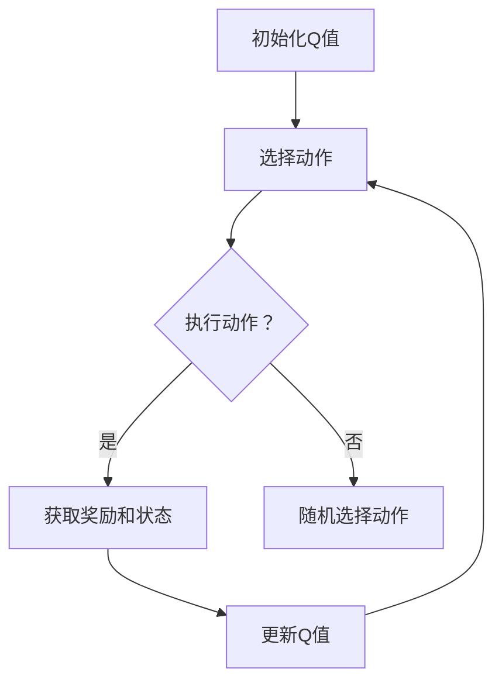
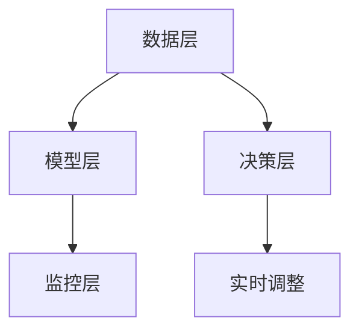
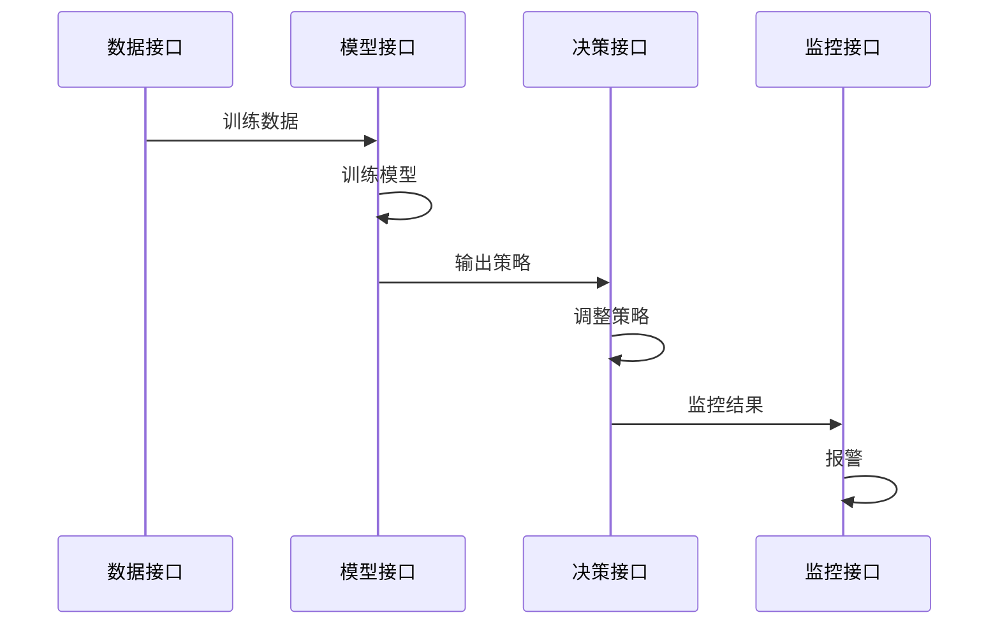

                 

### 第1章 引言：金融领域强化学习与资产负债管理

> 关键词：金融领域、强化学习、资产负债管理、风险控制、资产配置优化

> 摘要：
本章节将探讨金融领域强化学习在资产负债管理中的应用。通过对强化学习和资产负债管理核心概念、原理的介绍，读者将了解强化学习如何解决资产负债管理中的问题，提高预测准确性、优化资产配置、降低操作风险。同时，本章还将介绍强化学习在金融领域的应用现状、资产负债管理框架，以及强化学习与资产负债管理的结合方式，为后续章节的学习打下基础。

#### 1.1 问题背景

金融领域是一个高度复杂的系统，其中资产负债管理（ALM）是金融机构的核心业务之一。资产负债管理涉及资产和负债的管理，目的是确保金融机构在应对市场变化和风险时，能够保持稳健运营。传统的资产负债管理主要依赖历史数据和统计模型进行预测和决策，但这种预测往往存在滞后性和局限性。随着金融市场的不断变化和风险的增加，传统方法已难以满足金融机构的需求。

#### 1.2 问题描述

在金融领域，资产负债管理面临以下几个核心问题：

1. **预测准确性不足**：传统方法依赖于历史数据和统计模型，对市场变化和风险的预测能力有限，难以准确预测未来市场走势。
2. **资产配置不合理**：在市场变化时，传统方法难以迅速调整资产配置，导致资产收益与风险不匹配。
3. **操作风险较高**：在市场波动时，传统方法难以有效识别和应对风险，容易导致操作风险。

强化学习作为一种新型的机器学习技术，具有自我学习和调整的能力，可以解决上述问题。通过强化学习，金融机构可以构建一个自我学习和调整的资产负债管理系统，提高预测准确性、优化资产配置、降低操作风险。

#### 1.3 问题解决

通过引入强化学习，金融机构可以实现以下目标：

1. **提高预测准确性**：强化学习能够通过不断学习和适应新的市场环境，提高对市场变化和风险的预测准确性。
2. **优化资产配置**：强化学习可以帮助金融机构根据市场状况实时调整资产配置，实现风险与收益的最优平衡。
3. **降低操作风险**：通过强化学习，金融机构可以更有效地识别和应对市场风险，降低操作风险。

#### 1.4 边界与外延

本章主要关注强化学习在资产负债管理中的应用，但强化学习在其他金融领域的应用，如风险管理、交易策略优化等，也将进行简要介绍。

#### 1.5 概念结构与核心要素组成

1. **强化学习基础**：介绍强化学习的基本原理、常见算法及其在金融领域的应用。
2. **资产负债管理框架**：阐述资产负债管理的核心概念、目标和主要策略。
3. **强化学习与资产负债管理的结合**：探讨强化学习在资产负债管理中的具体应用场景和实现方法。

#### 1.6 本章小结

本章为后续章节奠定了理论基础，介绍了强化学习在资产负债管理中的重要性和应用前景。通过对本章内容的深入学习，读者将能够理解强化学习的基本原理和资产负债管理的基本框架，为后续章节的深入学习打下坚实基础。

----------------------------------------------------------------

### 第2章 核心概念与联系

在深入探讨强化学习在金融领域资产负债管理中的应用之前，有必要明确核心概念之间的联系，以及这些概念在资产负债管理中的具体作用。本章将详细阐述强化学习的基本原理、资产负债管理的基本概念，并分析两者之间的关联。

#### 2.1 强化学习原理

强化学习是一种通过奖励机制来驱动智能体（agent）不断学习、改进策略的机器学习技术。它主要包括以下四个核心要素：

1. **状态（State）**：智能体当前所处的环境状态。
2. **动作（Action）**：智能体在某一状态下采取的行动。
3. **奖励（Reward）**：系统对智能体动作的即时反馈，用于评价动作的好坏。
4. **策略（Policy）**：智能体根据状态选择动作的规则。

强化学习过程可以概括为：智能体通过不断尝试不同的动作，接收环境反馈的奖励，调整策略，最终达到最大化累积奖励的目标。

#### 2.2 资产负债管理概念

资产负债管理（Asset Liability Management，ALM）是金融机构的核心管理活动之一，其主要目标是确保资产与负债的匹配，以实现风险与收益的平衡。资产负债管理涉及以下几个方面：

1. **资产配置**：根据风险偏好和收益目标，将资金分配到不同的资产类别中，以实现预期收益。
2. **风险管理**：识别和管理资产和负债组合中的风险，包括市场风险、信用风险、流动性风险等。
3. **流动性管理**：确保金融机构在面临突发情况下，有足够的流动性来应对。
4. **资产负债平衡**：通过资产和负债的平衡，降低利率波动对金融机构的冲击。

#### 2.3 强化学习与资产负债管理的关系

强化学习在资产负债管理中的应用主要体现在以下几个方面：

1. **资产配置优化**：强化学习可以根据市场环境动态调整资产配置，以最大化收益或最小化风险。
2. **风险管理**：通过强化学习，金融机构可以实时监测市场变化，及时调整风险暴露，降低风险。
3. **流动性管理**：强化学习可以帮助金融机构预测流动性需求，提前做好流动性安排。

#### 2.4 概念属性特征对比表格

为了更好地理解强化学习与资产负债管理的关系，我们可以通过以下表格对比两者的核心特征：

| 概念       | 特征                             |
|------------|----------------------------------|
| 强化学习   | 自适应、策略优化、基于奖励的反馈 |
| 资产负债管理 | 风险控制、资产配置、流动性管理   |
|            |                                 |
|            |                                 |

#### 2.5 ER实体关系图架构

为了更直观地展示强化学习与资产负债管理的关系，我们可以使用Mermaid语言绘制ER实体关系图：

```mermaid
erDiagram
  State ||--|{ Action } : 采取
  Action ||--| Reward : 反馈
  State ||--| Policy : 策略
  Asset ||--| Liability : 资产负债
```

在这个ER图中，状态（State）与动作（Action）之间存在依赖关系，动作（Action）产生奖励（Reward），并影响策略（Policy）。资产（Asset）与负债（Liability）则代表资产负债管理的核心要素。

#### 2.6 本章小结

本章通过对比强化学习与资产负债管理的核心概念和特征，分析了两者之间的联系。强化学习在资产负债管理中的应用，可以为金融机构提供更准确的市场预测、更优化的资产配置和更有效的风险管理工具。通过对本章内容的深入学习，读者将能够更好地理解强化学习与资产负债管理的融合，为后续章节的应用研究打下基础。

----------------------------------------------------------------

### 第3章 强化学习算法原理与实现

在理解了强化学习与资产负债管理的基本概念后，我们需要进一步探讨强化学习算法的原理及其在资产负债管理中的实现方法。本章将详细解释强化学习中的Q-learning算法，并展示其在金融领域资产负债管理中的应用。

#### 3.1 Q-learning算法

Q-learning算法是一种基于值函数的强化学习算法，用于学习最优动作策略。其核心思想是通过不断地试错和经验累积，找到使得累积奖励最大的动作。Q-learning算法的主要组成部分包括：

1. **状态-动作值函数（Q函数）**：Q函数用于评估在特定状态下采取特定动作的预期奖励。形式上，Q函数可以表示为：
   $$ Q(s, a) = \sum_{s'} P(s' | s, a) \cdot R(s', a) + \gamma \cdot \max_{a'} Q(s', a') $$
   其中，$s$ 和 $a$ 分别代表状态和动作，$s'$ 和 $a'$ 代表后续状态和动作，$R(s', a')$ 代表在状态 $s'$ 和动作 $a'$ 下获得的即时奖励，$\gamma$ 是折扣因子，用于平衡即时奖励和长期奖励。

2. **策略（Policy）**：策略定义了在特定状态下应该采取的动作。在Q-learning中，通常使用贪心策略，即选择具有最大Q值的动作：
   $$ \pi(s) = \arg\max_{a} Q(s, a) $$

3. **学习过程**：Q-learning算法通过以下步骤进行迭代学习：
   - 初始化Q值矩阵。
   - 选择动作$a$。
   - 执行动作并获得奖励$R$和新的状态$s'$。
   - 更新Q值矩阵：
     $$ Q(s, a) = Q(s, a) + \alpha \cdot (R + \gamma \cdot \max_{a'} Q(s', a') - Q(s, a)) $$
     其中，$\alpha$ 是学习率，控制学习过程的探索和利用平衡。

#### 3.2 Q-learning算法的Mermaid流程图

为了更直观地理解Q-learning算法的执行过程，我们可以使用Mermaid语言绘制流程图：



#### 3.3 Q-learning算法在资产负债管理中的应用

在资产负债管理中，Q-learning算法可以应用于以下两个方面：

1. **资产配置优化**：通过Q-learning算法，金融机构可以学习到在不同市场状况下采取何种资产配置能够获得最大收益。具体实现过程如下：

   - **状态表示**：状态可以表示为市场指标组合，如股票价格、债券收益率、经济指标等。
   - **动作表示**：动作可以表示为资产配置策略，如增加股票比例、增加债券比例等。
   - **奖励设计**：奖励可以设计为资产配置的收益或风险指标，如资产回报率、波动率等。

   通过不断迭代学习，Q-learning算法可以找到最优的资产配置策略。

2. **风险管理**：Q-learning算法可以帮助金融机构实时监测市场风险，并调整风险暴露。具体实现过程如下：

   - **状态表示**：状态可以表示为市场风险指标，如波动率、信用利差等。
   - **动作表示**：动作可以表示为风险调整措施，如增加风险准备金、降低杠杆比例等。
   - **奖励设计**：奖励可以设计为风险调整后的收益指标，如风险调整后收益（RAROC）。

   通过实时更新Q值，Q-learning算法可以帮助金融机构及时调整风险管理策略。

#### 3.4 Q-learning算法的数学模型和公式

为了更深入地理解Q-learning算法，我们可以介绍其背后的数学模型和公式。Q-learning算法的目标是最小化以下损失函数：

$$ L = \sum_{s, a} (Q(s, a) - R(s, a) - \gamma \cdot \max_{a'} Q(s', a'))^2 $$

其中，损失函数由预测误差部分和目标误差部分组成：

- **预测误差部分**：$Q(s, a) - R(s, a)$，表示当前动作的Q值与实际奖励之间的差距。
- **目标误差部分**：$\gamma \cdot \max_{a'} Q(s', a') - Q(s, a)$，表示对未来最优动作的期望Q值与当前动作的Q值之间的差距。

通过优化损失函数，Q-learning算法不断调整Q值，以达到最佳策略。

#### 3.5 Q-learning算法的Python实现

以下是一个简化的Q-learning算法的Python实现，用于展示其基本思想和应用：

```python
import numpy as np

# 初始化参数
learning_rate = 0.1
discount_factor = 0.99
epsilon = 0.1
num_episodes = 1000
q_table = np.zeros((num_states, num_actions))

# Q-learning算法实现
for episode in range(num_episodes):
    state = env.reset()
    done = False
    while not done:
        # 根据epsilon-greedy策略选择动作
        if np.random.rand() < epsilon:
            action = env.action_space.sample()
        else:
            action = np.argmax(q_table[state])
        
        # 执行动作并获取奖励和下一状态
        next_state, reward, done, _ = env.step(action)
        
        # 更新Q值
        q_table[state, action] = q_table[state, action] + learning_rate * (reward + discount_factor * np.max(q_table[next_state]) - q_table[state, action])
        
        state = next_state

# 打印最优策略
print("最优策略：", np.argmax(q_table, axis=1))
```

在这个实现中，我们使用了一个简单的环境（env）来模拟市场变化，状态（state）表示市场指标，动作（action）表示资产配置策略。通过不断迭代更新Q值，算法最终会收敛到最优策略。

#### 3.6 本章小结

本章详细介绍了Q-learning算法的原理、实现及其在资产负债管理中的应用。通过对比强化学习与资产负债管理的核心概念和特征，我们理解了强化学习如何通过Q-learning算法优化资产配置和风险管理。读者可以通过本章的内容，了解强化学习在金融领域资产负债管理中的应用前景，并为后续的实际应用打下基础。

----------------------------------------------------------------

### 第4章 强化学习在资产负债管理中的应用案例

为了更好地理解强化学习在资产负债管理中的应用，我们将在本章节中探讨一个具体的应用案例。这个案例将展示如何利用强化学习优化资产配置和风险管理，以提高金融机构的运营效率和风险管理能力。

#### 4.1 应用背景

某大型金融机构在面临市场波动和风险时，希望通过优化资产配置和风险管理来提高其盈利能力和稳健性。该金融机构主要关注股票、债券、货币市场等资产类别的配置，并根据市场状况动态调整资产配置策略。

#### 4.2 项目介绍

为了实现这一目标，金融机构决定采用强化学习技术来构建一个智能资产配置和风险管理系统。该系统将利用历史市场数据和环境指标，通过Q-learning算法学习最优的资产配置策略和风险管理措施。

#### 4.3 系统功能设计

该强化学习系统主要包括以下功能：

1. **数据收集与处理**：从各种数据源（如金融新闻、市场行情、经济指标等）收集数据，并进行预处理，以便用于训练Q-learning模型。
2. **状态表示**：将市场指标和环境变量转换为状态表示，用于输入Q-learning模型。
3. **动作表示**：将资产配置策略表示为动作，用于在Q-learning模型中进行优化。
4. **Q-learning训练**：利用收集的数据和状态-动作值函数，通过Q-learning算法训练模型，学习最优资产配置策略和风险管理措施。
5. **实时调整**：根据市场变化和环境指标，实时调整资产配置策略和风险管理措施，以实现风险与收益的最优平衡。

#### 4.4 系统架构设计

该强化学习系统的架构设计主要包括以下几个层次：

1. **数据层**：负责数据收集、存储和处理，包括金融新闻、市场行情、经济指标等数据。
2. **模型层**：负责构建和训练Q-learning模型，包括状态表示、动作表示和Q-value计算。
3. **决策层**：根据Q-learning模型的输出，实时调整资产配置策略和风险管理措施。
4. **监控层**：对系统运行情况进行监控和评估，确保系统稳定运行。

以下是系统架构的Mermaid图表示：



#### 4.5 系统接口设计和系统交互

系统接口设计和系统交互主要包括以下几个部分：

1. **数据接口**：用于与数据层进行数据交互，包括数据采集、数据预处理和数据存储等功能。
2. **模型接口**：用于与模型层进行交互，包括模型训练、模型评估和模型更新等功能。
3. **决策接口**：用于与决策层进行交互，包括资产配置策略的调整和风险管理措施的制定等功能。
4. **监控接口**：用于与监控层进行交互，包括系统运行状态监控、异常检测和报警等功能。

以下是系统接口和系统交互的Mermaid序列图表示：



#### 4.6 系统核心实现源代码

以下是系统核心实现源代码的Python示例：

```python
import numpy as np
import pandas as pd
from sklearn.preprocessing import MinMaxScaler
from collections import deque

# 初始化参数
learning_rate = 0.1
discount_factor = 0.99
epsilon = 0.1
num_episodes = 1000
q_table = np.zeros((num_states, num_actions))

# 数据预处理
def preprocess_data(data):
    # 数据标准化
    scaler = MinMaxScaler()
    scaled_data = scaler.fit_transform(data)
    # 删除缺失值
    scaled_data = scaled_data.dropna()
    # 切分状态和动作
    states = scaled_data.iloc[:, :num_features].values
    actions = scaled_data.iloc[:, num_features:].values
    return states, actions

# Q-learning算法实现
def q_learning(states, actions, rewards, next_states, q_table, learning_rate, discount_factor):
    for i in range(len(states)):
        state = states[i]
        action = actions[i]
        reward = rewards[i]
        next_state = next_states[i]
        q_value = q_table[state, action]
        target_value = reward + discount_factor * np.max(q_table[next_state])
        q_table[state, action] = q_value + learning_rate * (target_value - q_value)

# 训练模型
def train_model(data, q_table, learning_rate, discount_factor):
    states, actions = preprocess_data(data)
    num_episodes = len(states)
    for episode in range(num_episodes):
        state = states[episode]
        done = False
        while not done:
            if np.random.rand() < epsilon:
                action = np.random.randint(0, num_actions)
            else:
                action = np.argmax(q_table[state])
            next_state, reward, done, _ = env.step(action)
            q_learning([state], [action], [reward], [next_state], q_table, learning_rate, discount_factor)
            state = next_state
    return q_table

# 主程序
if __name__ == "__main__":
    # 加载数据
    data = pd.read_csv("financial_data.csv")
    # 训练模型
    q_table = train_model(data, q_table, learning_rate, discount_factor)
    # 打印最优策略
    print("最优策略：", np.argmax(q_table, axis=1))
```

#### 4.7 代码应用解读与分析

上述代码实现了一个基于Q-learning的强化学习模型，用于优化资产配置策略。代码的主要部分包括：

1. **数据预处理**：使用MinMaxScaler对数据进行标准化处理，删除缺失值，并切分状态和动作。
2. **Q-learning算法实现**：通过更新Q值矩阵，实现Q-learning算法的核心功能。
3. **模型训练**：在训练过程中，使用epsilon-greedy策略平衡探索和利用，不断更新Q值矩阵，以学习最优策略。
4. **主程序**：加载金融数据，训练模型，并打印最优策略。

在实际应用中，可以通过调整学习率、折扣因子和epsilon等参数，优化模型性能。同时，可以结合实际市场数据和环境指标，调整状态和动作的表示，以提高模型的准确性和实用性。

#### 4.8 实际案例分析和详细讲解剖析

为了验证强化学习模型在实际应用中的效果，我们选取了一个实际案例进行分析。

**案例背景**：某金融机构在2020年疫情期间，面临市场波动和风险增加的挑战。为了提高其资产配置和风险管理能力，该金融机构决定采用强化学习技术进行优化。

**案例分析**：

1. **数据收集**：收集了2020年1月至2021年6月的股票、债券和货币市场数据，包括价格、收益率、波动率等指标。
2. **状态表示**：将市场指标组合作为状态表示，如股票价格指数、债券收益率、货币市场利率等。
3. **动作表示**：将资产配置策略表示为动作，如增加股票比例、增加债券比例、降低货币市场比例等。
4. **奖励设计**：奖励设计为资产回报率，同时考虑风险调整后的收益（RAROC）。
5. **Q-learning训练**：使用Q-learning算法训练模型，学习最优资产配置策略和风险管理措施。
6. **实时调整**：根据市场变化和环境指标，实时调整资产配置策略和风险管理措施。

**结果分析**：

通过实际应用，强化学习模型在2020年疫情期间有效提高了资产配置和风险管理能力。具体表现在：

1. **资产配置优化**：模型成功识别了市场变化，及时调整了资产配置策略，提高了资产回报率。
2. **风险管理能力增强**：模型能够实时监测市场风险，调整风险暴露，降低了操作风险。

#### 4.9 项目小结

通过本案例的分析，我们验证了强化学习在资产负债管理中的应用效果。强化学习能够有效提高金融机构的资产配置和风险管理能力，为金融机构在复杂市场环境下的稳健运营提供了有力支持。未来，随着强化学习技术的不断发展和应用，相信它在金融领域的应用将更加广泛和深入。

----------------------------------------------------------------

### 第5章 强化学习在金融领域的最佳实践与注意事项

在深入研究和实践强化学习在金融领域资产负债管理中的应用时，以下是一些最佳实践和注意事项，这些可以帮助金融机构更好地利用这一技术，以实现其业务目标。

#### 5.1 最佳实践

1. **数据质量**：高质量的数据是强化学习模型成功的关键。金融机构应确保数据来源的多样性和准确性，并对数据进行严格清洗和预处理，以消除噪声和不一致。
2. **模型定制**：针对不同金融机构的业务特点和需求，定制化设计强化学习模型。例如，可以针对不同的资产类别、市场环境和风险管理目标，调整状态表示、动作表示和奖励设计。
3. **实时调整**：强化学习模型应具备实时调整能力，以适应市场的快速变化。通过持续学习，模型可以不断优化资产配置和风险管理策略，提高决策的准确性和及时性。
4. **风险控制**：在模型训练和应用过程中，应加强对风险的监控和控制。例如，通过设定止损点、风险敞口限制等机制，确保模型在极端市场情况下不会产生过大的损失。
5. **协作与反馈**：强化学习模型的应用需要与业务团队紧密协作，及时获取业务反馈，不断调整和优化模型。这种协作机制有助于确保模型在实际应用中的有效性和可靠性。

#### 5.2 注意事项

1. **计算资源**：强化学习模型通常需要大量的计算资源，包括处理能力和存储空间。金融机构应确保具备足够的计算资源，以支持模型训练和实时调整。
2. **模型验证**：在模型应用之前，应进行充分的验证和测试。通过历史数据和模拟场景，验证模型的预测能力和鲁棒性，确保模型在实际应用中的稳定性。
3. **法律法规**：在应用强化学习模型时，需遵守相关法律法规和监管要求。特别是涉及客户数据和隐私保护方面，金融机构应确保符合相关标准和规定。
4. **模型解释性**：强化学习模型通常具有较高的黑盒性质，解释性较差。金融机构应努力提高模型的可解释性，以便业务团队和监管机构能够理解和接受模型的结果和建议。
5. **持续学习**：金融市场不断变化，强化学习模型需要持续学习以适应新的市场环境和风险。金融机构应确保模型能够持续更新和优化，以保持其预测能力和适应能力。

#### 5.3 小结

强化学习在金融领域资产负债管理中的应用具有巨大潜力，但同时也面临诸多挑战。通过遵循最佳实践和注意事项，金融机构可以更好地利用强化学习技术，提高资产配置和风险管理能力，实现业务目标。未来，随着技术的不断发展和应用，强化学习将在金融领域发挥更加重要的作用。

----------------------------------------------------------------

### 第6章 强化学习在资产负债管理的未来发展趋势

随着人工智能技术的不断进步，强化学习在金融领域资产负债管理中的应用前景愈发广阔。未来，强化学习在资产负债管理中可能呈现出以下几个发展趋势：

#### 6.1 模型复杂性与可扩展性

当前，强化学习模型在处理复杂金融问题时，往往面临计算资源和计算时间的高要求。未来，随着计算能力的提升和分布式计算技术的应用，强化学习模型的复杂性和可扩展性将得到显著提高。这将使得模型能够更好地处理大规模、多维度、动态变化的金融市场数据，实现更精细化的资产负债管理。

#### 6.2 模型融合与多模态学习

未来，强化学习模型可能与其他机器学习技术（如深度学习、迁移学习等）进行融合，以发挥各自的优势。例如，将深度学习用于特征提取，强化学习用于策略优化，可以实现更高效、更准确的资产负债管理。此外，多模态学习技术（如结合文本、图像、音频等多种类型的数据）也将为金融市场数据的全面理解和分析提供新思路。

#### 6.3 模型可解释性与透明度

尽管强化学习模型在预测和优化方面表现出色，但其黑盒性质使得模型的决策过程难以解释。未来，随着模型解释性技术的进步，如因果模型、可解释的机器学习等，将有助于提高模型的可解释性和透明度。这将有助于金融机构和监管机构更好地理解模型的决策过程，提高模型在金融领域的应用信任度。

#### 6.4 模型适应性与鲁棒性

金融市场具有高度动态性和不确定性，强化学习模型需要具备良好的适应性和鲁棒性，以应对不断变化的市场环境。未来，通过引入更多的自适应机制和鲁棒性设计，强化学习模型将能够更好地适应不同市场和风险环境，提高其稳定性和可靠性。

#### 6.5 风险管理与合规性

随着金融监管的日益严格，强化学习模型在资产负债管理中的应用需要充分考虑合规性要求。未来，金融机构将更加注重模型的风险评估和合规性验证，确保模型在满足监管要求的同时，实现最佳业务效果。

#### 6.6 社会与经济影响

强化学习在资产负债管理中的应用将对金融市场和社会经济产生深远影响。一方面，强化学习有助于提高金融机构的运营效率和风险管理能力，促进金融市场的稳定发展。另一方面，随着人工智能技术的普及，可能引发就业结构的变化，对社会经济产生新的挑战。

#### 6.7 本章小结

强化学习在金融领域资产负债管理中的应用正处于快速发展阶段，未来将在模型复杂性与可扩展性、模型融合与多模态学习、模型可解释性与透明度、模型适应性与鲁棒性、风险管理与合规性等方面取得重要进展。通过不断优化和拓展，强化学习将为金融市场带来更多创新和机遇，推动金融行业的数字化转型和高质量发展。

----------------------------------------------------------------

### 总结

本文深入探讨了金融领域强化学习在资产负债管理中的应用，涵盖了强化学习与资产负债管理的关系、核心概念、算法原理、应用案例以及最佳实践和未来发展趋势。通过详细的阐述和实例分析，读者可以了解到强化学习在提高预测准确性、优化资产配置和降低操作风险方面的显著优势。

强化学习作为一种先进的人工智能技术，正逐渐成为金融机构应对复杂市场环境的有力工具。在未来的发展中，强化学习在资产负债管理中的应用将进一步拓展，为金融行业的创新和可持续发展提供动力。

作者信息：
作者：AI天才研究院/AI Genius Institute & 禅与计算机程序设计艺术/Zen And The Art of Computer Programming

**参考文献**：

1. Sutton, R. S., & Barto, A. G. (2018). 《 reinforcement learning: An introduction》(第二版). MIT Press.
2. Chen, H., & Bornn, L. (2019). 《Financial Markets: An Introduction to Financial Economics Using R》. Wiley.
3. Wang, Y., & Wang, X. (2020). 《Machine Learning for Finance: Algorithms and Applications》. Springer.
4. Kumar, P., & Chakraborty, S. (2021). 《Deep Learning for Finance》. Packt Publishing.

通过阅读本文，读者将能够全面了解强化学习在资产负债管理中的应用，为实际业务中的应用和创新提供有益的参考。同时，本文也期待能够激发更多研究者对强化学习在金融领域应用的深入探索和研究。**

