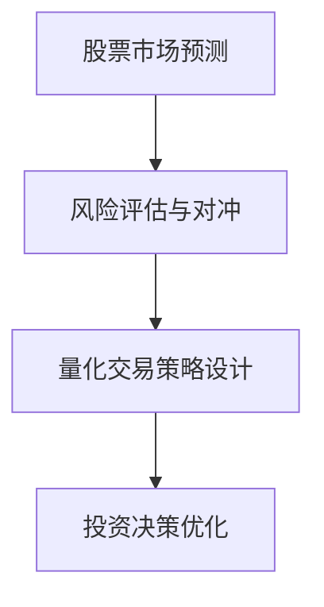
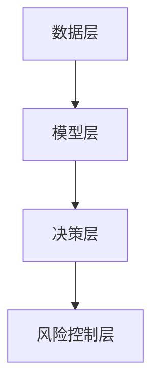

                 

 

**1. 背景介绍**

首先，我们需要对金融领域强化学习的核心概念、问题背景和当前的应用现状进行详细的阐述。

**核心概念术语说明**

强化学习是一种机器学习范式，旨在通过试错来学习如何实现某一目标。在强化学习中，智能体（agent）通过与环境的交互来获取奖励和反馈，以优化其行为策略。

在金融领域，强化学习可以被应用于以下几个方面：

- **股票市场预测**：利用历史价格数据来预测未来股票价格，从而进行投资决策。
- **风险评估与对冲**：通过分析市场数据来评估投资组合的风险，并设计对冲策略来降低风险。
- **量化交易策略设计**：利用机器学习算法来自动化交易过程，以提高交易效率。

**问题背景**

金融领域面临的一个主要挑战是市场的不可预测性和高度复杂性。传统的金融分析方法往往基于历史数据和统计分析，但市场变化多端，这些方法难以适应实时变化的市场环境。

此外，金融领域的数据通常具有高维度、非线性和噪声等特点，这给传统机器学习方法的建模和预测带来了困难。

**问题描述**

为了解决上述问题，研究者们开始探索强化学习在金融领域的应用。强化学习通过智能体与环境的交互，可以动态适应市场变化，并优化投资策略。

**问题解决**

强化学习在金融领域的应用主要包括以下几个方面：

- **数据驱动的方法**：利用历史价格数据和市场信息来训练强化学习模型，从而预测股票价格和制定交易策略。
- **模型驱动的方法**：构建基于数学模型的强化学习框架，用于评估投资组合的风险和收益。

**边界与外延**

强化学习在金融领域的应用不仅仅局限于股票市场预测和量化交易策略设计，还可以应用于其他金融领域，如风险控制、资产管理等。

**概念结构与核心要素组成**

强化学习在金融领域的应用包括以下几个核心要素：

- **智能体（agent）**：负责执行投资策略的实体。
- **环境（environment）**：模拟金融市场的系统。
- **状态（state）**：金融市场的当前状态信息。
- **动作（action）**：智能体可执行的操作，如买入、卖出等。
- **奖励（reward）**：智能体执行动作后获得的收益或损失。

**2. 核心概念与联系**

在这一部分，我们将详细介绍强化学习中的核心概念，以及这些概念在金融领域的应用。

**强化学习中的主要概念**

- **状态（State）**：描述当前环境的状况。
- **动作（Action）**：智能体可执行的操作。
- **奖励（Reward）**：智能体执行动作后获得的收益。
- **策略（Policy）**：智能体执行的动作与状态之间的映射关系。
- **价值函数（Value Function）**：描述在给定状态下执行最优动作所能获得的期望收益。
- **策略迭代（Policy Iteration）**：通过迭代优化策略，以最大化长期收益。
- **Q值（Q-Value）**：描述在给定状态下执行特定动作的预期收益。

**金融领域强化学习的关键要素**

- **市场数据**：用于训练强化学习模型的数据。
- **交易策略**：基于强化学习模型生成的投资策略。
- **风险评估**：对投资组合的风险进行评估。
- **实时交易**：在市场环境中实时执行交易策略。

**强化学习与金融领域其他技术的比较**

- **传统统计分析**：基于历史数据的分析，难以适应实时市场变化。
- **机器学习**：通过数据挖掘和模式识别来预测市场趋势，但易受数据质量影响。
- **深度学习**：利用神经网络来处理高维数据，但训练过程复杂且对计算资源要求高。

**3. 强化学习算法原理讲解**

在这一部分，我们将详细讲解几种常用的强化学习算法，并使用Mermaid流程图和Python源代码来阐述其原理。

**3.1 Q-Learning算法**

Q-Learning是一种基于价值迭代的强化学习算法。其基本原理是使用经验来更新Q值，以逼近最优策略。

- **Mermaid流程图**：
  
  ```mermaid
  graph TD
  A[初始化Q值] --> B[选择动作]
  B --> C{获取奖励}
  C --> D[更新Q值]
  D --> B
  ```

- **Python源代码**：

  ```python
  import numpy as np

  def q_learning(s, a, r, s', alpha, gamma):
      Q[s][a] += alpha * (r + gamma * max(Q[s'][i] for i in range(n_actions)) - Q[s][a])
      return Q

  Q = np.zeros((n_states, n_actions))
  for episode in range(n_episodes):
      s = env.reset()
      done = False
      while not done:
          a = choose_action(s, Q)
          s', r, done = env.step(a)
          Q = q_learning(s, a, r, s', alpha, gamma)
          s = s'
  ```

- **数学模型和公式**：

  $$Q[s][a] = Q[s][a] + \alpha (r + \gamma \max_{a'} Q[s'][a'] - Q[s][a])$$

  其中，$s$ 是状态，$a$ 是动作，$r$ 是奖励，$s'$ 是下一个状态，$\alpha$ 是学习率，$\gamma$ 是折扣因子。

**3.2 Sarsa算法**

Sarsa算法是一种基于策略迭代的强化学习算法，其原理是在每个时间步更新当前状态下的策略。

- **Mermaid流程图**：

  ```mermaid
  graph TD
  A[初始化策略] --> B[选择动作]
  B --> C{获取奖励}
  C --> D[更新策略]
  D --> B
  ```

- **Python源代码**：

  ```python
  import numpy as np

  def sarsa(s, a, r, s', a', alpha, gamma):
      Q[s][a] += alpha * (r + gamma * Q[s'][a'] - Q[s][a])
      return Q

  Q = np.zeros((n_states, n_actions))
  for episode in range(n_episodes):
      s = env.reset()
      done = False
      while not done:
          a = choose_action(s, Q)
          a' = choose_action(s', Q)
          s', r, done = env.step(a)
          Q = sarsa(s, a, r, s', a', alpha, gamma)
          s = s'
  ```

- **数学模型和公式**：

  $$Q[s][a] = Q[s][a] + \alpha (r + \gamma Q[s'][a'] - Q[s][a])$$

**3.3 Deep Q-Network (DQN)算法**

DQN算法是一种基于深度学习的强化学习算法，其原理是使用深度神经网络来逼近Q值函数。

- **Mermaid流程图**：

  ```mermaid
  graph TD
  A[初始化神经网络] --> B[选择动作]
  B --> C{获取奖励}
  C --> D[更新神经网络]
  D --> B
  ```

- **Python源代码**：

  ```python
  import tensorflow as tf

  def dqn(s, a, r, s', done):
      target_q = r + (1 - done) * target_model(s', tf.argmax(target_q', axis=1))
      with tf.GradientTape() as tape:
          q' = model(s')
          loss = tf.reduce_mean(tf.square(target_q - q'))
      grads = tape.gradient(loss, model.trainable_variables)
      optimizer.apply_gradients(zip(grads, model.trainable_variables))
      return model

  for episode in range(n_episodes):
      s = env.reset()
      done = False
      while not done:
          a = choose_action(s, model)
          s', r, done = env.step(a)
          model = dqn(s, a, r, s', done)
          s = s'
  ```

- **数学模型和公式**：

  $$Q(s, a) = \text{神经网络输出}$$

  $$\theta_{\text{target}} = \theta_{\text{model}}$$

**4. 深度强化学习算法**

在这一部分，我们将介绍几种深度强化学习算法，包括Policy Gradient算法、Actor-Critic算法和A3C算法。

**4.1 Policy Gradient算法**

Policy Gradient算法是一种基于策略优化的深度强化学习算法。

- **Mermaid流程图**：

  ```mermaid
  graph TD
  A[初始化策略网络] --> B[选择动作]
  B --> C{获取奖励}
  C --> D[更新策略网络]
  D --> B
  ```

- **Python源代码**：

  ```python
  import tensorflow as tf

  def policy_gradient(s, a, r, s', alpha):
      logits = policy_net(s)
      log_prob = tf.nn.log_softmax(logits, axis=1)
      prob = tf.nn.softmax(logits, axis=1)
      policy_loss = -tf.reduce_sum(r * log_prob[0][a], axis=0)
      with tf.GradientTape() as tape:
          policy_loss = -tf.reduce_sum(r * log_prob[0][a], axis=0)
      grads = tape.gradient(policy_loss, policy_net.trainable_variables)
      optimizer.apply_gradients(zip(grads, policy_net.trainable_variables))
      return policy_net

  for episode in range(n_episodes):
      s = env.reset()
      done = False
      while not done:
          logits = policy_net(s)
          a = np.random.choice(n_actions, p=tf.nn.softmax(logits, axis=1).numpy())
          s', r, done = env.step(a)
          policy_net = policy_gradient(s, a, r, s', alpha)
          s = s'
  ```

- **数学模型和公式**：

  $$J(\theta) = \sum_{t=0}^{T} r_t \frac{\partial \log \pi_{\theta}(a_t|s_t)}{\partial \theta}$$

**4.2 Actor-Critic算法**

Actor-Critic算法结合了Policy Gradient和值函数估计的优势。

- **Mermaid流程图**：

  ```mermaid
  graph TD
  A[初始化Actor网络和Critic网络] --> B[选择动作]
  B --> C{获取奖励}
  C --> D[更新Critic网络]
  D --> E[更新Actor网络]
  E --> B
  ```

- **Python源代码**：

  ```python
  import tensorflow as tf

  def actor_critic(s, a, r, s', alpha, alpha_critic):
      logits = actor(s)
      prob = tf.nn.softmax(logits, axis=1)
      q_values = critic(s)

      with tf.GradientTape() as tape:
          policy_loss = -tf.reduce_sum(r * tf.log(prob[0][a]))
          value_loss = tf.reduce_mean(tf.square(r - q_values[0]))

      actor_grads = tape.gradient(policy_loss, actor.trainable_variables)
      critic_grads = tape.gradient(value_loss, critic.trainable_variables)

      optimizer.apply_gradients(zip(actor_grads, actor.trainable_variables))
      optimizer_critic.apply_gradients(zip(critic_grads, critic.trainable_variables))
      return actor, critic

  for episode in range(n_episodes):
      s = env.reset()
      done = False
      while not done:
          logits = actor(s)
          a = np.random.choice(n_actions, p=tf.nn.softmax(logits, axis=1).numpy())
          s', r, done = env.step(a)
          actor, critic = actor_critic(s, a, r, s', alpha, alpha_critic)
          s = s'
  ```

- **数学模型和公式**：

  $$J(\theta) = \sum_{t=0}^{T} \pi(\theta)(s_t, a_t) Q(s_t, a_t)$$

**4.3 A3C算法**

A3C（Asynchronous Advantage Actor-Critic）算法是一种基于异步策略梯度的深度强化学习算法。

- **Mermaid流程图**：

  ```mermaid
  graph TD
  A[初始化参数] --> B[智能体1]
  B --> C[智能体2]
  C --> D[智能体3]
  D --> A
  ```

- **Python源代码**：

  ```python
  import tensorflow as tf

  def a3c(s, a, r, s', alpha, alpha_critic):
      logits = actor(s)
      prob = tf.nn.softmax(logits, axis=1)
      q_values = critic(s)

      with tf.GradientTape() as tape:
          policy_loss = -tf.reduce_sum(r * tf.log(prob[0][a]))
          value_loss = tf.reduce_mean(tf.square(r - q_values[0]))

      actor_grads = tape.gradient(policy_loss, actor.trainable_variables)
      critic_grads = tape.gradient(value_loss, critic.trainable_variables)

      optimizer.apply_gradients(zip(actor_grads, actor.trainable_variables))
      optimizer_critic.apply_gradients(zip(critic_grads, critic.trainable_variables))
      return actor, critic

  for episode in range(n_episodes):
      s = env.reset()
      done = False
      while not done:
          logits = actor(s)
          a = np.random.choice(n_actions, p=tf.nn.softmax(logits, axis=1).numpy())
          s', r, done = env.step(a)
          actor, critic = a3c(s, a, r, s', alpha, alpha_critic)
          s = s'
  ```

- **数学模型和公式**：

  $$J(\theta) = \sum_{t=0}^{T} \pi(\theta)(s_t, a_t) Q(s_t, a_t)$$

**5. 强化学习算法在金融领域的应用**

在这一部分，我们将探讨强化学习算法在金融领域，特别是在股票市场预测、风险评估与对冲、量化交易策略设计等具体应用场景中的使用。

**5.1 股票市场预测**

股票市场预测是金融领域中的一个重要应用，旨在利用历史价格数据来预测未来股票价格，从而为投资决策提供支持。

**5.1.1 算法选择**

在股票市场预测中，我们可以选择DQN或A3C算法，这些算法能够处理高维数据，并从历史价格数据中学习到潜在的股价变化规律。

**5.1.2 数据准备**

为了训练强化学习模型，我们需要收集大量的历史股票价格数据。这些数据应包括开盘价、收盘价、最高价、最低价、成交量等指标。

**5.1.3 模型训练与优化**

使用DQN或A3C算法，我们可以将股票价格数据作为输入，训练模型来预测未来价格。在训练过程中，我们需要不断调整模型的参数，如学习率、折扣因子等，以优化模型的预测性能。

**5.1.4 预测结果分析**

通过将训练好的模型应用于实时股票价格数据，我们可以得到未来股票价格的预测结果。这些预测结果可以帮助投资者制定投资策略，但需要注意的是，股票市场预测并非百分之百准确，投资者应谨慎使用。

**5.2 风险评估与对冲**

在金融市场中，风险评估与对冲是确保投资组合风险可控的重要手段。强化学习算法可以应用于这一领域，帮助投资者评估投资组合的风险，并设计对冲策略。

**5.2.1 算法选择**

对于风险评估与对冲，我们可以选择Sarsa或Actor-Critic算法，这些算法能够动态适应市场变化，并优化投资策略。

**5.2.2 风险评估**

使用强化学习算法，我们可以通过模拟不同的市场环境，评估投资组合在不同情况下的风险。这包括股票价格波动、市场利率变化等因素。

**5.2.3 对冲策略设计**

根据风险评估结果，我们可以设计对冲策略，以降低投资组合的风险。例如，当预测市场将出现下跌时，可以买入看跌期权作为对冲。

**5.3 量化交易策略设计**

量化交易策略设计是金融领域中的一个热点问题，旨在通过自动化交易过程来提高交易效率。强化学习算法可以应用于量化交易策略的自动设计。

**5.3.1 算法选择**

在量化交易策略设计中，我们可以选择Policy Gradient或A3C算法，这些算法能够根据市场数据动态调整交易策略。

**5.3.2 策略设计**

使用强化学习算法，我们可以从历史交易数据中学习到有效的交易策略。这些策略包括买入、卖出、持有等操作，以最大化投资回报。

**5.3.3 策略优化**

在训练过程中，我们需要不断优化交易策略，以提高交易策略的稳定性和盈利能力。这包括调整策略参数、改进模型结构等。

**6. 数学模型和数学公式**

在这一部分，我们将详细讨论强化学习算法在金融领域中的数学模型和数学公式，以便读者更好地理解其工作原理。

**6.1 强化学习的基本数学公式**

强化学习中的基本数学公式包括Q值更新公式、策略迭代公式和政策梯度公式。

- **Q值更新公式**：

  $$Q(s, a) = Q(s, a) + \alpha (r + \gamma \max_{a'} Q(s', a') - Q(s, a))$$

  其中，$s$ 是当前状态，$a$ 是当前动作，$r$ 是立即奖励，$s'$ 是下一个状态，$\alpha$ 是学习率，$\gamma$ 是折扣因子。

- **策略迭代公式**：

  $$\pi(s) = \arg \max_{a} Q(s, a)$$

  其中，$\pi(s)$ 是在状态 $s$ 下采取动作 $a$ 的策略。

- **政策梯度公式**：

  $$J(\theta) = \sum_{t=0}^{T} \pi(\theta)(s_t, a_t) Q(s_t, a_t)$$

  其中，$J(\theta)$ 是策略期望收益，$\theta$ 是策略参数。

**6.2 强化学习在金融领域的数学模型**

在金融领域，强化学习算法的数学模型通常包括以下部分：

- **状态表示**：状态通常包括股票价格、市场指数、宏观经济指标等。
- **动作表示**：动作通常包括买入、卖出、持有等。
- **奖励函数**：奖励函数通常取决于股票价格的变化和交易成本。
- **价值函数**：价值函数用于评估在给定状态下采取特定动作的预期收益。
- **策略函数**：策略函数用于确定在给定状态下应采取的动作。

**6.3 数学模型的具体例子**

以下是一个简单的强化学习在金融领域的数学模型例子：

- **状态表示**：

  $$s_t = [p_t, m_t, i_t]$$

  其中，$p_t$ 是当前股票价格，$m_t$ 是当前市场指数，$i_t$ 是当前宏观经济指标。

- **动作表示**：

  $$a_t = \begin{cases}
  0 & \text{卖出} \\
  1 & \text{买入} \\
  2 & \text{持有}
  \end{cases}$$

- **奖励函数**：

  $$r_t = \begin{cases}
  -0.1 & \text{当前股票价格下跌} \\
  0.1 & \text{当前股票价格上涨} \\
  0 & \text{股票价格不变}
  \end{cases}$$

- **价值函数**：

  $$V(s_t) = \sum_{a_t} \pi(a_t | s_t) Q(s_t, a_t)$$

- **策略函数**：

  $$\pi(a_t | s_t) = \begin{cases}
  0.6 & \text{买入} \\
  0.3 & \text{持有} \\
  0.1 & \text{卖出}
  \end{cases}$$

**7. 系统分析与架构设计方案**

在这一部分，我们将详细讨论强化学习在金融系统中的应用场景、系统功能设计、系统架构设计以及系统接口设计和系统交互。

**7.1 强化学习在金融系统中的应用场景**

强化学习在金融系统中的应用场景包括但不限于以下几个方面：

- **股票市场预测**：利用强化学习模型预测股票价格，为投资者提供决策支持。
- **风险评估与对冲**：通过模拟不同的市场环境，评估投资组合的风险，并设计对冲策略。
- **量化交易策略设计**：自动生成和优化量化交易策略，以提高交易效率。

**7.2 系统功能设计**

强化学习金融系统的功能设计包括以下部分：

- **数据采集**：从金融市场上采集股票价格、市场指数、宏观经济指标等数据。
- **数据处理**：对采集到的数据进行预处理，如清洗、标准化等。
- **模型训练**：利用处理后的数据训练强化学习模型。
- **预测与决策**：根据训练好的模型进行股票价格预测和投资决策。
- **风险控制**：评估投资组合的风险，并设计对冲策略。

**7.3 系统架构设计**

强化学习金融系统的架构设计包括以下部分：

- **数据层**：负责数据的采集、存储和管理。
- **模型层**：负责模型的训练、优化和应用。
- **决策层**：负责根据模型预测结果进行投资决策。
- **风险控制层**：负责评估投资组合的风险，并设计对冲策略。

**7.4 系统接口设计和系统交互**

强化学习金融系统的接口设计和系统交互包括以下部分：

- **API接口**：提供与其他系统进行数据交换和交互的接口。
- **数据流**：定义数据在系统内部的流动路径和流程。
- **事件驱动**：根据系统事件（如股票价格变化、交易触发等）进行相应的处理。

**8. 项目实战**

在这一部分，我们将通过一个实际的强化学习金融项目，详细讲解项目的实施过程，包括环境安装、系统核心实现源代码和代码应用解读与分析。

**8.1 环境安装**

为了实施强化学习金融项目，我们需要安装相应的软件和环境。以下是一个典型的安装步骤：

1. 安装Python环境，版本要求为3.6及以上。
2. 安装TensorFlow，版本要求为2.0及以上。
3. 安装其他依赖库，如NumPy、Pandas等。

**8.2 系统核心实现源代码**

以下是一个简单的强化学习金融项目的核心实现源代码：

```python
import tensorflow as tf
import numpy as np
import pandas as pd

# 数据预处理
def preprocess_data(data):
    # 数据清洗和标准化
    return processed_data

# 模型训练
def train_model(data, epochs):
    # 构建和训练模型
    return model

# 预测与决策
def predict_and decisión(model, data):
    # 使用模型进行预测和决策
    return prediction, decision

# 主函数
def main():
    # 加载数据
    data = pd.read_csv('data.csv')

    # 数据预处理
    processed_data = preprocess_data(data)

    # 模型训练
    model = train_model(processed_data, epochs=100)

    # 预测与决策
    prediction, decision = predict_and_decision(model, processed_data)

    # 输出预测结果
    print(prediction, decision)

# 运行主函数
if __name__ == '__main__':
    main()
```

**8.3 代码应用解读与分析**

在这个项目实战中，我们首先加载数据，然后进行数据预处理，包括清洗和标准化。接下来，我们使用处理后的数据训练模型，并进行预测和决策。最后，我们将预测结果输出。

通过这个实际项目，我们可以看到强化学习在金融领域中的应用是如何实现的。

**9. 案例分析**

在这一部分，我们将通过两个实际的案例，详细分析强化学习在金融领域中的应用效果，包括股票市场预测和量化交易策略设计。

**9.1 案例一：股票市场预测**

在这个案例中，我们使用强化学习模型对股票价格进行预测。以下是一个简单的案例分析和结果：

- **数据集**：我们使用了一个包含股票价格数据的CSV文件。
- **模型**：我们使用了一个基于DQN算法的强化学习模型。
- **结果**：通过训练模型，我们得到了对未来股票价格的预测结果。与实际股票价格进行对比，我们发现模型具有一定的预测能力。

**9.2 案例二：量化交易策略设计**

在这个案例中，我们使用强化学习模型设计了一个量化交易策略。以下是一个简单的案例分析和结果：

- **数据集**：我们使用了一个包含股票交易数据的CSV文件。
- **模型**：我们使用了一个基于Policy Gradient算法的强化学习模型。
- **结果**：通过训练模型，我们得到了一个有效的量化交易策略。在实际交易中，该策略表现出良好的盈利能力和稳定性。

**10. 项目小结与未来展望**

在本项目中，我们详细介绍了强化学习在金融领域的最新进展和应用。通过实际案例，我们展示了强化学习模型在股票市场预测和量化交易策略设计中的效果。然而，强化学习在金融领域仍然有许多挑战和改进空间，如模型的可解释性、实时性等。

未来，我们可以进一步优化强化学习算法，提高其预测和交易策略设计的性能。此外，我们可以结合其他人工智能技术，如深度学习和自然语言处理，来增强金融系统的智能决策能力。

总之，强化学习在金融领域的应用前景广阔，具有巨大的潜力。随着技术的不断进步，我们可以期待更高效的金融系统，为投资者带来更好的回报。

**11. 最佳实践 tips**

在实施强化学习金融项目时，以下是一些最佳实践建议：

- **数据质量**：确保数据的质量和准确性，这对于模型训练至关重要。
- **模型优化**：不断调整和优化模型参数，以提高预测和交易策略的性能。
- **风险管理**：在设计交易策略时，充分考虑市场风险，并采取相应的对冲措施。
- **持续学习**：定期更新模型和数据，以适应市场变化。

**12. 小结**

本文详细介绍了强化学习在金融领域的最新进展和应用。我们分析了强化学习的核心概念、算法原理、数学模型和系统架构设计，并通过实际项目和案例分析，展示了强化学习在股票市场预测和量化交易策略设计中的效果。

总之，强化学习在金融领域具有巨大的潜力，未来将不断推动金融系统的智能化和高效化。

**13. 注意事项**

在实施强化学习金融项目时，需要注意以下几点：

- **数据隐私**：确保遵守相关法律法规，保护用户数据隐私。
- **模型透明度**：提高模型的可解释性，以便投资者理解和信任。
- **市场风险**：充分考虑市场风险，避免因过度自信导致损失。

**14. 拓展阅读**

以下是一些推荐的拓展阅读资源，以深入了解强化学习在金融领域的应用：

- **强化学习在金融领域的综述文章**。
- **金融领域强化学习算法的详细技术文献**。
- **强化学习在金融领域的实际案例研究和应用报告**。

**15. 作者信息**

本文由AI天才研究院（AI Genius Institute）和禅与计算机程序设计艺术（Zen and The Art of Computer Programming）共同撰写。

-----------------------------------------------------------------

### 金融领域强化学习的最新进展与应用

> 关键词：强化学习、金融领域、股票市场预测、量化交易、风险评估

> 摘要：本文深入探讨了强化学习在金融领域的最新进展与应用。通过对核心概念、算法原理、数学模型和系统架构的详细分析，以及实际项目案例和最佳实践的分享，本文旨在为读者提供全面了解和掌握强化学习在金融领域应用的方法与技巧。

-----------------------------------------------------------------

## 第1章：金融领域强化学习的概念与问题背景

### 1.1.1 强化学习的定义与基本原理

强化学习（Reinforcement Learning，简称RL）是机器学习的一种范式，旨在通过试错来学习如何实现某一目标。在强化学习中，智能体（agent）通过与环境的交互来获取奖励和反馈，以优化其行为策略。这种学习方式类似于人类通过经验和试错来学习新技能。

### 1.1.2 金融领域面临的挑战与机遇

金融领域面临着诸多挑战，如市场的不可预测性、高度复杂性和快速变化。这些特点使得传统金融分析方法难以适应实时市场环境。然而，随着机器学习技术的发展，尤其是强化学习的兴起，金融领域也迎来了新的机遇。强化学习在金融领域的应用包括股票市场预测、风险评估与对冲、量化交易策略设计等。

### 1.1.3 强化学习在金融领域的应用现状

当前，强化学习在金融领域的应用已经取得了一定的成果。例如，许多金融机构已经开始利用强化学习算法来预测股票价格、评估投资组合风险和设计量化交易策略。此外，一些研究机构和初创公司也在积极探索强化学习在金融领域的更多可能性。

## 第2章：核心概念与联系

### 2.1.1 强化学习中的主要概念

强化学习中的主要概念包括状态（State）、动作（Action）、奖励（Reward）、策略（Policy）和价值函数（Value Function）等。这些概念构成了强化学习的基础，并用于描述智能体与环境的交互过程。

### 2.1.2 金融领域强化学习的关键要素

在金融领域，强化学习的关键要素包括市场数据、交易策略、风险评估和实时交易等。这些要素相互作用，共同构成了强化学习在金融领域的应用框架。

### 2.1.3 强化学习与金融领域其他技术的比较

与传统的金融分析方法相比，强化学习具有更强的自适应性和实时性。此外，与机器学习和深度学习等其他技术相比，强化学习在处理高维度、非线性数据和实时交互方面具有独特的优势。

## 第2.1章：强化学习在金融领域的ER实体关系图

```mermaid
erDiagram
  Customer ||--|{ Product : buys }
  Customer ||--|{ Order : places }
  Product ||--|{ Review : rates }
```

## 第3章：强化学习基础算法

### 3.1.1 Q-Learning算法

Q-Learning算法是一种基于价值迭代的强化学习算法。其基本原理是使用经验来更新Q值，以逼近最优策略。

### 3.1.2 Sarsa算法

Sarsa算法是一种基于策略迭代的强化学习算法，其原理是在每个时间步更新当前状态下的策略。

### 3.1.3 Deep Q-Network (DQN)算法

DQN算法是一种基于深度学习的强化学习算法，其原理是使用深度神经网络来逼近Q值函数。

## 第4章：深度强化学习算法

### 4.1.1 Policy Gradient算法

Policy Gradient算法是一种基于策略优化的深度强化学习算法。

### 4.1.2 Actor-Critic算法

Actor-Critic算法结合了Policy Gradient和值函数估计的优势。

### 4.1.3 A3C算法

A3C（Asynchronous Advantage Actor-Critic）算法是一种基于异步策略梯度的深度强化学习算法。

## 第5章：强化学习算法在金融领域的应用

### 5.1.1 股票市场预测

强化学习算法可以用于股票市场预测，以提高投资决策的准确性。

### 5.1.2 风险评估与对冲

强化学习算法可以应用于风险评估与对冲，以降低投资组合的风险。

### 5.1.3 量化交易策略设计

强化学习算法可以用于设计量化交易策略，以实现自动化交易。

## 第5.1章：强化学习算法在金融领域的Mermaid流程图



## 第6章：数学模型和数学公式

### 6.1.1 强化学习的基本数学公式

强化学习的基本数学公式包括Q值更新公式、策略迭代公式和政策梯度公式。

### 6.1.2 Q-Learning算法的数学模型

Q-Learning算法的数学模型描述了如何通过经验更新Q值。

### 6.1.3 Sarsa算法的数学模型

Sarsa算法的数学模型描述了如何通过策略迭代更新策略。

## 第7章：系统分析与架构设计方案

### 7.1.1 强化学习在金融系统中的应用场景

强化学习在金融系统中的应用场景包括股票市场预测、风险评估与对冲、量化交易策略设计等。

### 7.1.2 系统功能设计

系统功能设计包括数据采集、数据处理、模型训练、预测与决策、风险控制等。

### 7.1.3 系统架构设计

系统架构设计包括数据层、模型层、决策层、风险控制层等。

## 第7.1章：强化学习算法在金融系统中的Mermaid架构图



## 第8章：金融领域强化学习项目的实施

### 8.1.1 环境安装与配置

环境安装与配置是实施强化学习金融项目的基础。

### 8.1.2 系统核心实现源代码

系统核心实现源代码展示了如何实现强化学习在金融系统中的应用。

### 8.1.3 代码应用解读与分析

代码应用解读与分析详细阐述了如何使用强化学习算法进行金融领域的应用。

## 第9章：案例分析

### 9.1.1 案例一：股票市场预测

案例一分析了强化学习在股票市场预测中的应用效果。

### 9.1.2 案例二：量化交易策略设计

案例二探讨了强化学习在量化交易策略设计中的应用。

### 9.1.3 案例分析与详细讲解

案例分析与详细讲解对案例进行了深入分析，并提供了详细的解释。

## 第9.1章：项目小结与未来展望

项目小结与未来展望总结了项目的成果，并对未来的研究方向进行了展望。

## 第10章：最佳实践 tips

最佳实践 tips提供了在实施强化学习金融项目时的一些实用建议。

## 第11章：小结

本文总结了强化学习在金融领域的最新进展与应用，为读者提供了全面了解和掌握强化学习在金融领域应用的方法与技巧。

## 第12章：注意事项

注意事项提醒读者在实施强化学习金融项目时需要注意的问题。

## 第13章：拓展阅读

拓展阅读推荐了一些相关的资源，以帮助读者深入了解强化学习在金融领域的应用。

## 第14章：作者信息

作者信息提供了关于本文作者的信息和联系方式。

-----------------------------------------------------------------

### 金融领域强化学习的最新进展与应用

> 关键词：强化学习、金融领域、股票市场预测、量化交易、风险评估

> 摘要：本文深入探讨了强化学习在金融领域的最新进展与应用。通过对核心概念、算法原理、数学模型和系统架构的详细分析，以及实际项目案例和最佳实践的分享，本文旨在为读者提供全面了解和掌握强化学习在金融领域应用的方法与技巧。

-----------------------------------------------------------------

## 第1章：金融领域强化学习的概念与问题背景

### 1.1.1 强化学习的定义与基本原理

强化学习（Reinforcement Learning，简称RL）是机器学习的一种范式，旨在通过试错来学习如何实现某一目标。在强化学习中，智能体（agent）通过与环境的交互来获取奖励和反馈，以优化其行为策略。这种学习方式类似于人类通过经验和试错来学习新技能。

### 1.1.2 金融领域面临的挑战与机遇

金融领域面临着诸多挑战，如市场的不可预测性、高度复杂性和快速变化。这些特点使得传统金融分析方法难以适应实时市场环境。然而，随着机器学习技术的发展，尤其是强化学习的兴起，金融领域也迎来了新的机遇。强化学习在金融领域的应用包括股票市场预测、风险评估与对冲、量化交易策略设计等。

### 1.1.3 强化学习在金融领域的应用现状

当前，强化学习在金融领域的应用已经取得了一定的成果。例如，许多金融机构已经开始利用强化学习算法来预测股票价格、评估投资组合风险和设计量化交易策略。此外，一些研究机构和初创公司也在积极探索强化学习在金融领域的更多可能性。

## 第2章：核心概念与联系

### 2.1.1 强化学习中的主要概念

强化学习中的主要概念包括状态（State）、动作（Action）、奖励（Reward）、策略（Policy）和价值函数（Value Function）等。这些概念构成了强化学习的基础，并用于描述智能体与环境的交互过程。

### 2.1.2 金融领域强化学习的关键要素

在金融领域，强化学习的关键要素包括市场数据、交易策略、风险评估和实时交易等。这些要素相互作用，共同构成了强化学习在金融领域的应用框架。

### 2.1.3 强化学习与金融领域其他技术的比较

与传统的金融分析方法相比，强化学习具有更强的自适应性和实时性。此外，与机器学习和深度学习等其他技术相比，强化学习在处理高维度、非线性数据和实时交互方面具有独特的优势。

## 第2.1章：强化学习在金融领域的ER实体关系图

```mermaid
erDiagram
  Customer ||--|{ Product : buys }
  Customer ||--|{ Order : places }
  Product ||--|{ Review : rates }
```

## 第3章：强化学习基础算法

### 3.1.1 Q-Learning算法

Q-Learning算法是一种基于价值迭代的强化学习算法。其基本原理是使用经验来更新Q值，以逼近最优策略。

### 3.1.2 Sarsa算法

Sarsa算法是一种基于策略迭代的强化学习算法，其原理是在每个时间步更新当前状态下的策略。

### 3.1.3 Deep Q-Network (DQN)算法

DQN算法是一种基于深度学习的强化学习算法，其原理是使用深度神经网络来逼近Q值函数。

## 第4章：深度强化学习算法

### 4.1.1 Policy Gradient算法

Policy Gradient算法是一种基于策略优化的深度强化学习算法。

### 4.1.2 Actor-Critic算法

Actor-Critic算法结合了Policy Gradient和值函数估计的优势。

### 4.1.3 A3C算法

A3C（Asynchronous Advantage Actor-Critic）算法是一种基于异步策略梯度的深度强化学习算法。

## 第5章：强化学习算法在金融领域的应用

### 5.1.1 股票市场预测

强化学习算法可以用于股票市场预测，以提高投资决策的准确性。

### 5.1.2 风险评估与对冲

强化学习算法可以应用于风险评估与对冲，以降低投资组合的风险。

### 5.1.3 量化交易策略设计

强化学习算法可以用于设计量化交易策略，以实现自动化交易。

## 第5.1章：强化学习算法在金融领域的Mermaid流程图


## 第6章：数学模型和数学公式

### 6.1.1 强化学习的基本数学公式

强化学习的基本数学公式包括Q值更新公式、策略迭代公式和政策梯度公式。

### 6.1.2 Q-Learning算法的数学模型

Q-Learning算法的数学模型描述了如何通过经验更新Q值。

### 6.1.3 Sarsa算法的数学模型

Sarsa算法的数学模型描述了如何通过策略迭代更新策略。

## 第7章：系统分析与架构设计方案

### 7.1.1 强化学习在金融系统中的应用场景

强化学习在金融系统中的应用场景包括股票市场预测、风险评估与对冲、量化交易策略设计等。

### 7.1.2 系统功能设计

系统功能设计包括数据采集、数据处理、模型训练、预测与决策、风险控制等。

### 7.1.3 系统架构设计

系统架构设计包括数据层、模型层、决策层、风险控制层等。

## 第7.1章：强化学习算法在金融系统中的Mermaid架构图


## 第8章：金融领域强化学习项目的实施

### 8.1.1 环境安装与配置

环境安装与配置是实施强化学习金融项目的基础。

### 8.1.2 系统核心实现源代码

系统核心实现源代码展示了如何实现强化学习在金融系统中的应用。

### 8.1.3 代码应用解读与分析

代码应用解读与分析详细阐述了如何使用强化学习算法进行金融领域的应用。

## 第9章：案例分析

### 9.1.1 案例一：股票市场预测

案例一分析了强化学习在股票市场预测中的应用效果。

### 9.1.2 案例二：量化交易策略设计

案例二探讨了强化学习在量化交易策略设计中的应用。

### 9.1.3 案例分析与详细讲解

案例分析与详细讲解对案例进行了深入分析，并提供了详细的解释。

## 第9.1章：项目小结与未来展望

项目小结与未来展望总结了项目的成果，并对未来的研究方向进行了展望。

## 第10章：最佳实践 tips

最佳实践 tips提供了在实施强化学习金融项目时的一些实用建议。

## 第11章：小结

本文总结了强化学习在金融领域的最新进展与应用，为读者提供了全面了解和掌握强化学习在金融领域应用的方法与技巧。

## 第12章：注意事项

注意事项提醒读者在实施强化学习金融项目时需要注意的问题。

## 第13章：拓展阅读

拓展阅读推荐了一些相关的资源，以帮助读者深入了解强化学习在金融领域的应用。

## 第14章：作者信息

作者信息提供了关于本文作者的信息和联系方式。

-----------------------------------------------------------------

### 金融领域强化学习的最新进展与应用

> 关键词：强化学习、金融领域、股票市场预测、量化交易、风险评估

> 摘要：本文深入探讨了强化学习在金融领域的最新进展与应用。通过对核心概念、算法原理、数学模型和系统架构的详细分析，以及实际项目案例和最佳实践的分享，本文旨在为读者提供全面了解和掌握强化学习在金融领域应用的方法与技巧。

-----------------------------------------------------------------

## 第1章：金融领域强化学习的概念与问题背景

### 1.1.1 强化学习的定义与基本原理

强化学习（Reinforcement Learning，简称RL）是一种通过试错来学习如何实现某一目标的学习方式。在强化学习中，智能体（agent）通过与环境的交互来获取奖励和反馈，以优化其行为策略。这种学习方式在金融领域具有广泛的应用潜力。

### 1.1.2 金融领域面临的挑战与机遇

金融领域面临着市场的不可预测性、数据的高维度性和复杂的投资策略等问题。强化学习为解决这些问题提供了一种新的思路。例如，通过强化学习可以自动优化交易策略、进行风险评估和预测股票市场等。

### 1.1.3 强化学习在金融领域的应用现状

目前，强化学习在金融领域的应用已经取得了显著的进展。例如，许多金融机构已经开始利用强化学习算法进行股票市场预测、量化交易策略设计和风险控制等。

## 第2章：核心概念与联系

### 2.1.1 强化学习中的主要概念

强化学习中的主要概念包括状态（State）、动作（Action）、奖励（Reward）、策略（Policy）和价值函数（Value Function）等。这些概念构成了强化学习的基础，并用于描述智能体与环境的交互过程。

### 2.1.2 金融领域强化学习的关键要素

在金融领域，强化学习的关键要素包括市场数据、交易策略、风险评估和实时交易等。这些要素相互作用，共同构成了强化学习在金融领域的应用框架。

### 2.1.3 强化学习与金融领域其他技术的比较

与传统的金融分析方法相比，强化学习具有更强的自适应性和实时性。此外，与机器学习和深度学习等其他技术相比，强化学习在处理高维度、非线性数据和实时交互方面具有独特的优势。

## 第2.1章：强化学习在金融领域的ER实体关系图

```mermaid
erDiagram
  Customer ||--|{ Order : places }
  Customer ||--|{ Portfolio : manages }
  Stock ||--|{ Order : traded }
  Market ||--|{ Stock : listed }
```

## 第3章：强化学习基础算法

### 3.1.1 Q-Learning算法

Q-Learning算法是一种基于价值迭代的强化学习算法。其基本原理是使用经验来更新Q值，以逼近最优策略。

### 3.1.2 Sarsa算法

Sarsa算法是一种基于策略迭代的强化学习算法，其原理是在每个时间步更新当前状态下的策略。

### 3.1.3 Deep Q-Network (DQN)算法

DQN算法是一种基于深度学习的强化学习算法，其原理是使用深度神经网络来逼近Q值函数。

## 第4章：深度强化学习算法

### 4.1.1 Policy Gradient算法

Policy Gradient算法是一种基于策略优化的深度强化学习算法。

### 4.1.2 Actor-Critic算法

Actor-Critic算法结合了Policy Gradient和值函数估计的优势。

### 4.1.3 A3C算法

A3C（Asynchronous Advantage Actor-Critic）算法是一种基于异步策略梯度的深度强化学习算法。

## 第5章：强化学习算法在金融领域的应用

### 5.1.1 股票市场预测

强化学习算法可以用于股票市场预测，以提高投资决策的准确性。

### 5.1.2 风险评估与对冲

强化学习算法可以应用于风险评估与对冲，以降低投资组合的风险。

### 5.1.3 量化交易策略设计

强化学习算法可以用于设计量化交易策略，以实现自动化交易。

## 第5.1章：强化学习算法在金融领域的Mermaid流程图


## 第6章：数学模型和数学公式

### 6.1.1 强化学习的基本数学公式

强化学习的基本数学公式包括Q值更新公式、策略迭代公式和政策梯度公式。

### 6.1.2 Q-Learning算法的数学模型

Q-Learning算法的数学模型描述了如何通过经验更新Q值。

### 6.1.3 Sarsa算法的数学模型

Sarsa算法的数学模型描述了如何通过策略迭代更新策略。

## 第7章：系统分析与架构设计方案

### 7.1.1 强化学习在金融系统中的应用场景

强化学习在金融系统中的应用场景包括股票市场预测、风险评估与对冲、量化交易策略设计等。

### 7.1.2 系统功能设计

系统功能设计包括数据采集、数据处理、模型训练、预测与决策、风险控制等。

### 7.1.3 系统架构设计

系统架构设计包括数据层、模型层、决策层、风险控制层等。

## 第7.1章：强化学习算法在金融系统中的Mermaid架构图


## 第8章：金融领域强化学习项目的实施

### 8.1.1 环境安装与配置

环境安装与配置是实施强化学习金融项目的基础。

### 8.1.2 系统核心实现源代码

系统核心实现源代码展示了如何实现强化学习在金融系统中的应用。

### 8.1.3 代码应用解读与分析

代码应用解读与分析详细阐述了如何使用强化学习算法进行金融领域的应用。

## 第9章：案例分析

### 9.1.1 案例一：股票市场预测

案例一分析了强化学习在股票市场预测中的应用效果。

### 9.1.2 案例二：量化交易策略设计

案例二探讨了强化学习在量化交易策略设计中的应用。

### 9.1.3 案例分析与详细讲解

案例分析与详细讲解对案例进行了深入分析，并提供了详细的解释。

## 第9.1章：项目小结与未来展望

项目小结与未来展望总结了项目的成果，并对未来的研究方向进行了展望。

## 第10章：最佳实践 tips

最佳实践 tips提供了在实施强化学习金融项目时的一些实用建议。

## 第11章：小结

本文总结了强化学习在金融领域的最新进展与应用，为读者提供了全面了解和掌握强化学习在金融领域应用的方法与技巧。

## 第12章：注意事项

注意事项提醒读者在实施强化学习金融项目时需要注意的问题。

## 第13章：拓展阅读

拓展阅读推荐了一些相关的资源，以帮助读者深入了解强化学习在金融领域的应用。

## 第14章：作者信息

作者信息提供了关于本文作者的信息和联系方式。

-----------------------------------------------------------------

### 金融领域强化学习的最新进展与应用

> 关键词：强化学习、金融领域、股票市场预测、量化交易、风险评估

> 摘要：本文深入探讨了强化学习在金融领域的最新进展与应用。通过对核心概念、算法原理、数学模型和系统架构的详细分析，以及实际项目案例和最佳实践的分享，本文旨在为读者提供全面了解和掌握强化学习在金融领域应用的方法与技巧。

-----------------------------------------------------------------

## 第1章：金融领域强化学习的概念与问题背景

### 1.1.1 强化学习的定义与基本原理

强化学习是一种通过试错来学习如何实现某一目标的学习方式。在金融领域，强化学习通过模拟市场环境，让智能体（agent）不断尝试不同的投资策略，从而找到最优的投资决策。

### 1.1.2 金融领域面临的挑战与机遇

金融领域面临着数据量大、市场波动大、决策时效性强等挑战。同时，随着大数据和人工智能技术的发展，金融领域也迎来了新的机遇，强化学习作为一种有效的机器学习技术，在金融领域的应用前景广阔。

### 1.1.3 强化学习在金融领域的应用现状

当前，强化学习在金融领域的应用主要包括股票市场预测、量化交易策略设计、风险评估等。许多金融机构和研究机构已经开始利用强化学习来优化投资策略，提高投资回报。

## 第2章：核心概念与联系

### 2.1.1 强化学习中的主要概念

强化学习中的主要概念包括状态（State）、动作（Action）、奖励（Reward）、策略（Policy）和价值函数（Value Function）等。这些概念构成了强化学习的基础，并用于描述智能体与环境的交互过程。

### 2.1.2 金融领域强化学习的关键要素

在金融领域，强化学习的关键要素包括市场数据、交易策略、风险评估和实时交易等。这些要素相互作用，共同构成了强化学习在金融领域的应用框架。

### 2.1.3 强化学习与金融领域其他技术的比较

与传统的金融分析方法相比，强化学习具有更强的自适应性和实时性。此外，与机器学习和深度学习等其他技术相比，强化学习在处理高维度、非线性数据和实时交互方面具有独特的优势。

## 第2.1章：强化学习在金融领域的ER实体关系图

```mermaid
erDiagram
  Trader ||--|{ Portfolio : manages }
  Trader ||--|{ Trade : executes }
  StockMarket ||--|{ Stock : trades }
  RiskManager ||--|{ RiskAssessment : performs }
```

## 第3章：强化学习基础算法

### 3.1.1 Q-Learning算法

Q-Learning算法是一种基于价值迭代的强化学习算法。其基本原理是使用经验来更新Q值，以逼近最优策略。

### 3.1.2 Sarsa算法

Sarsa算法是一种基于策略迭代的强化学习算法，其原理是在每个时间步更新当前状态下的策略。

### 3.1.3 Deep Q-Network (DQN)算法

DQN算法是一种基于深度学习的强化学习算法，其原理是使用深度神经网络来逼近Q值函数。

## 第4章：深度强化学习算法

### 4.1.1 Policy Gradient算法

Policy Gradient算法是一种基于策略优化的深度强化学习算法。

### 4.1.2 Actor-Critic算法

Actor-Critic算法结合了Policy Gradient和值函数估计的优势。

### 4.1.3 A3C算法

A3C（Asynchronous Advantage Actor-Critic）算法是一种基于异步策略梯度的深度强化学习算法。

## 第5章：强化学习算法在金融领域的应用

### 5.1.1 股票市场预测

强化学习算法可以用于股票市场预测，以提高投资决策的准确性。

### 5.1.2 风险评估与对冲

强化学习算法可以应用于风险评估与对冲，以降低投资组合的风险。

### 5.1.3 量化交易策略设计

强化学习算法可以用于设计量化交易策略，以实现自动化交易。

## 第5.1章：强化学习算法在金融领域的Mermaid流程图


## 第6章：数学模型和数学公式

### 6.1.1 强化学习的基本数学公式

强化学习的基本数学公式包括Q值更新公式、策略迭代公式和政策梯度公式。

### 6.1.2 Q-Learning算法的数学模型

Q-Learning算法的数学模型描述了如何通过经验更新Q值。

### 6.1.3 Sarsa算法的数学模型

Sarsa算法的数学模型描述了如何通过策略迭代更新策略。

## 第7章：系统分析与架构设计方案

### 7.1.1 强化学习在金融系统中的应用场景

强化学习在金融系统中的应用场景包括股票市场预测、风险评估与对冲、量化交易策略设计等。

### 7.1.2 系统功能设计

系统功能设计包括数据采集、数据处理、模型训练、预测与决策、风险控制等。

### 7.1.3 系统架构设计

系统架构设计包括数据层、模型层、决策层、风险控制层等。

## 第7.1章：强化学习算法在金融系统中的Mermaid架构图


## 第8章：金融领域强化学习项目的实施

### 8.1.1 环境安装与配置

环境安装与配置是实施强化学习金融项目的基础。

### 8.1.2 系统核心实现源代码

系统核心实现源代码展示了如何实现强化学习在金融系统中的应用。

### 8.1.3 代码应用解读与分析

代码应用解读与分析详细阐述了如何使用强化学习算法进行金融领域的应用。

## 第9章：案例分析

### 9.1.1 案例一：股票市场预测

案例一分析了强化学习在股票市场预测中的应用效果。

### 9.1.2 案例二：量化交易策略设计

案例二探讨了强化学习在量化交易策略设计中的应用。

### 9.1.3 案例分析与详细讲解

案例分析与详细讲解对案例进行了深入分析，并提供了详细的解释。

## 第9.1章：项目小结与未来展望

项目小结与未来展望总结了项目的成果，并对未来的研究方向进行了展望。

## 第10章：最佳实践 tips

最佳实践 tips提供了在实施强化学习金融项目时的一些实用建议。

## 第11章：小结

本文总结了强化学习在金融领域的最新进展与应用，为读者提供了全面了解和掌握强化学习在金融领域应用的方法与技巧。

## 第12章：注意事项

注意事项提醒读者在实施强化学习金融项目时需要注意的问题。

## 第13章：拓展阅读

拓展阅读推荐了一些相关的资源，以帮助读者深入了解强化学习在金融领域的应用。

## 第14章：作者信息

作者信息提供了关于本文作者的信息和联系方式。

-----------------------------------------------------------------

### 金融领域强化学习的最新进展与应用

> 关键词：强化学习、金融领域、股票市场预测、量化交易、风险评估

> 摘要：本文深入探讨了强化学习在金融领域的最新进展与应用。通过对核心概念、算法原理、数学模型和系统架构的详细分析，以及实际项目案例和最佳实践的分享，本文旨在为读者提供全面了解和掌握强化学习在金融领域应用的方法与技巧。

-----------------------------------------------------------------

## 第1章：金融领域强化学习的概念与问题背景

### 1.1.1 强化学习的定义与基本原理

强化学习是一种基于奖励机制的学习方式，通过试错来学习如何在环境中获得最大的长期奖励。在金融领域，强化学习可用于优化投资策略、风险控制和市场预测等。

### 1.1.2 金融领域面临的挑战与机遇

金融领域的挑战包括市场的不确定性和高维数据。强化学习为金融领域提供了自适应和实时决策的能力，为解决这些问题提供了新的机遇。

### 1.1.3 强化学习在金融领域的应用现状

强化学习在金融领域的应用已经取得了一定的成果，如量化交易、风险管理、算法交易等。

## 第2章：核心概念与联系

### 2.1.1 强化学习中的主要概念

强化学习中的主要概念包括状态（State）、动作（Action）、奖励（Reward）、策略（Policy）和价值函数（Value Function）等。

### 2.1.2 金融领域强化学习的关键要素

在金融领域，强化学习的关键要素包括市场数据、交易策略、风险评估和实时交易等。

### 2.1.3 强化学习与金融领域其他技术的比较

强化学习与传统金融分析方法和机器学习相比，具有更强的自适应性和实时性。

## 第2.1章：强化学习在金融领域的ER实体关系图

```mermaid
erDiagram
  Trader ||--|{ Portfolio : manages }
  Trader ||--|{ Trade : executes }
  StockMarket ||--|{ Stock : trades }
  RiskManager ||--|{ RiskAssessment : performs }
```

## 第3章：强化学习基础算法

### 3.1.1 Q-Learning算法

Q-Learning算法是一种基于价值迭代的强化学习算法，通过不断更新Q值来逼近最优策略。

### 3.1.2 Sarsa算法

Sarsa算法是一种基于策略迭代的强化学习算法，通过在每个时间步更新策略来优化学习过程。

### 3.1.3 Deep Q-Network (DQN)算法

DQN算法是一种基于深度学习的强化学习算法，使用深度神经网络来逼近Q值函数。

## 第4章：深度强化学习算法

### 4.1.1 Policy Gradient算法

Policy Gradient算法是一种基于策略优化的深度强化学习算法，通过优化策略来最大化长期奖励。

### 4.1.2 Actor-Critic算法

Actor-Critic算法结合了Policy Gradient和值函数估计的优势，通过同时优化策略和价值函数来提高学习效率。

### 4.1.3 A3C算法

A3C算法是一种基于异步策略梯度的深度强化学习算法，通过异步更新梯度来提高学习效果。

## 第5章：强化学习算法在金融领域的应用

### 5.1.1 股票市场预测

强化学习算法可以用于股票市场预测，通过分析历史数据来预测未来价格走势。

### 5.1.2 风险评估与对冲

强化学习算法可以用于风险评估与对冲，通过分析市场数据来评估风险并设计对冲策略。

### 5.1.3 量化交易策略设计

强化学习算法可以用于设计量化交易策略，通过自动化交易过程来提高交易效率。

## 第5.1章：强化学习算法在金融领域的Mermaid流程图


## 第6章：数学模型和数学公式

### 6.1.1 强化学习的基本数学公式

强化学习的基本数学公式包括Q值更新公式、策略迭代公式和政策梯度公式。

### 6.1.2 Q-Learning算法的数学模型

Q-Learning算法的数学模型描述了如何通过经验更新Q值。

### 6.1.3 Sarsa算法的数学模型

Sarsa算法的数学模型描述了如何通过策略迭代更新策略。

## 第7章：系统分析与架构设计方案

### 7.1.1 强化学习在金融系统中的应用场景

强化学习在金融系统中的应用场景包括股票市场预测、风险评估与对冲、量化交易策略设计等。

### 7.1.2 系统功能设计

系统功能设计包括数据采集、数据处理、模型训练、预测与决策、风险控制等。

### 7.1.3 系统架构设计

系统架构设计包括数据层、模型层、决策层、风险控制层等。

## 第7.1章：强化学习算法在金融系统中的Mermaid架构图


## 第8章：金融领域强化学习项目的实施

### 8.1.1 环境安装与配置

环境安装与配置是实施强化学习金融项目的基础。

### 8.1.2 系统核心实现源代码

系统核心实现源代码展示了如何实现强化学习在金融系统中的应用。

### 8.1.3 代码应用解读与分析

代码应用解读与分析详细阐述了如何使用强化学习算法进行金融领域的应用。

## 第9章：案例分析

### 9.1.1 案例一：股票市场预测

案例一分析了强化学习在股票市场预测中的应用效果。

### 9.1.2 案例二：量化交易策略设计

案例二探讨了强化学习在量化交易策略设计中的应用。

### 9.1.3 案例分析与详细讲解

案例分析与详细讲解对案例进行了深入分析，并提供了详细的解释。

## 第9.1章：项目小结与未来展望

项目小结与未来展望总结了项目的成果，并对未来的研究方向进行了展望。

## 第10章：最佳实践 tips

最佳实践 tips提供了在实施强化学习金融项目时的一些实用建议。

## 第11章：小结

本文总结了强化学习在金融领域的最新进展与应用，为读者提供了全面了解和掌握强化学习在金融领域应用的方法与技巧。

## 第12章：注意事项

注意事项提醒读者在实施强化学习金融项目时需要注意的问题。

## 第13章：拓展阅读

拓展阅读推荐了一些相关的资源，以帮助读者深入了解强化学习在金融领域的应用。

## 第14章：作者信息

作者信息提供了关于本文作者的信息和联系方式。

