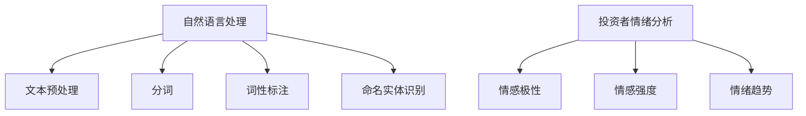
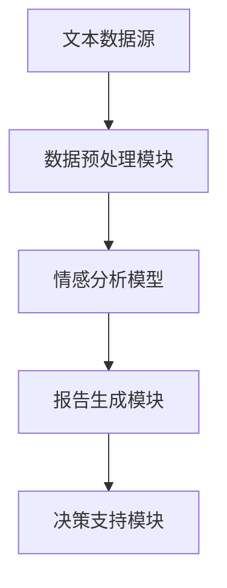
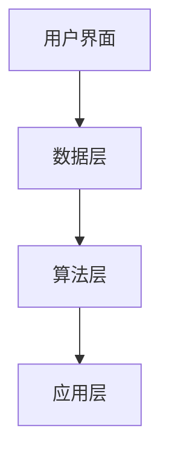
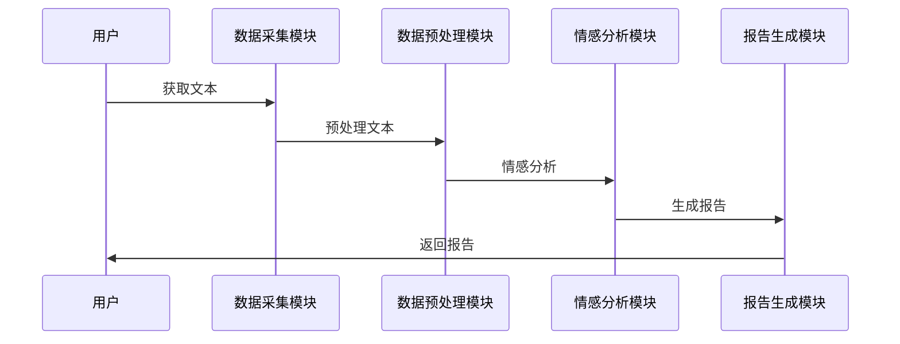

                 


## 金融领域自然语言处理在投资者情绪分析中的应用

### 关键词：自然语言处理、投资者情绪分析、金融领域、情感分析、机器学习

### 摘要：
本文旨在探讨金融领域自然语言处理（NLP）技术在投资者情绪分析中的应用。通过深入分析NLP的基本概念和投资者情绪分析的核心问题，本文介绍了相关的算法原理、系统设计与实现，并通过实战案例对系统进行详细剖析。文章总结了最佳实践，提出了注意事项，并给出了进一步研究的方向。

### 目录大纲

```markdown
----------------------------------------------------------------

# 第一部分: 背景介绍

## 第1章: 金融领域自然语言处理概述

### 1.1.1 问题背景

### 1.1.2 问题描述

### 1.1.3 问题解决方法

### 1.1.4 边界与外延

### 1.1.5 概念结构与核心要素组成

## 第2章: 核心概念与联系

### 1.2.1 自然语言处理基本概念

### 1.2.2 投资者情绪分析核心概念

### 1.2.3 概念属性特征对比表格

### 1.2.4 ER实体关系图架构

## 第二部分: 算法原理讲解

### 第3章: 投资者情绪分析算法原理

#### 3.1.1 算法流程

##### 3.1.1.1 数据预处理

##### 3.1.1.2 情感分析模型选择

##### 3.1.1.3 模型训练与评估

#### 3.1.2 算法原理

##### 3.1.2.1 数学模型

##### 3.1.2.2 公式讲解

##### 3.1.2.3 举例说明

## 第三部分: 系统设计与实现

### 第4章: 投资者情绪分析系统设计

#### 4.1 问题场景介绍

#### 4.2 系统功能设计

##### 4.2.1 领域模型类图

#### 4.3 系统架构设计

##### 4.3.1 架构设计

##### 4.3.2 系统接口设计

#### 4.4 系统交互设计

##### 4.4.1 交互设计

##### 4.4.2 序列图

## 第四部分: 项目实战

### 第5章: 项目实战环境安装与配置

#### 5.1 环境搭建

#### 5.2 系统核心实现源代码

### 第6章: 代码应用解读与分析

#### 6.1 源代码解读

#### 6.2 应用案例

### 第7章: 实际案例分析

#### 7.1 案例分析

#### 7.2 详细讲解剖析

## 第五部分: 最佳实践与总结

### 第8章: 最佳实践

#### 8.1 注意事项

#### 8.2 小结

### 第9章: 拓展阅读

```

### 第一部分：背景介绍

#### 第1章：金融领域自然语言处理概述

##### 1.1.1 问题背景

在金融领域，信息的不对称性和动态变化的特征使得投资者在做出决策时面临巨大的挑战。投资者情绪分析作为一种有效的手段，能够帮助投资者理解市场情绪，从而做出更明智的投资决策。自然语言处理（NLP）技术能够从大量的文本数据中提取有用的信息，为投资者情绪分析提供了强有力的工具。

##### 1.1.2 问题描述

投资者情绪分析的主要任务是识别和提取文本中的情感信息，并将其转化为量化指标。例如，分析一篇新闻报道，判断其是正面、负面还是中性，进而推断出投资者对相关资产的看法。

##### 1.1.3 问题解决方法

自然语言处理技术包括文本预处理、情感分析、主题建模等方法。通过这些方法，可以有效地从金融文本数据中提取情绪信息，辅助投资者做出决策。

##### 1.1.4 边界与外延

投资者情绪分析的边界包括文本数据的收集、情感分析的准确性和实时性等。外延则涉及到如何将情绪分析结果应用于实际的投资策略中。

##### 1.1.5 概念结构与核心要素组成

投资者情绪分析的概念结构包括文本数据、情感分析模型、情绪指标和投资决策。核心要素组成包括数据预处理模块、情感分析模块和决策支持模块。

### 第二部分：核心概念与联系

#### 第2章：核心概念与联系

##### 2.1.1 自然语言处理基本概念

自然语言处理（NLP）是一门涉及计算机科学、语言学和人工智能的交叉学科。其基本概念包括文本预处理、分词、词性标注、命名实体识别等。

##### 2.1.2 投资者情绪分析核心概念

投资者情绪分析的核心概念包括情感极性（正面、负面、中性）、情感强度、情绪趋势等。

##### 2.1.3 概念属性特征对比表格

| 概念          | 属性特征                                                         |
|---------------|----------------------------------------------------------------|
| 自然语言处理   | 文本预处理、分词、词性标注、命名实体识别等                         |
| 情感分析       | 情感极性、情感强度、情绪趋势等                                     |
| 投资者情绪分析 | 从文本数据中提取情绪信息，为投资决策提供支持                       |

##### 2.1.4 ER实体关系图架构



### 第三部分：算法原理讲解

#### 第3章：投资者情绪分析算法原理

##### 3.1.1 算法流程

投资者情绪分析算法通常包括以下步骤：

1. 数据预处理：去除停用词、标点符号，进行词干提取等。
2. 情感分析模型选择：选择合适的情感分析模型，如基于规则的模型、基于机器学习的模型等。
3. 模型训练与评估：使用训练集对模型进行训练，并使用测试集进行评估。

##### 3.1.2 算法原理

投资者情绪分析算法的核心是情感分析模型。常见的情感分析模型包括：

1. 基于规则的模型：如词典法、基于规则的情感分析。
2. 基于机器学习的模型：如朴素贝叶斯、支持向量机、深度学习等。

以下是投资者情绪分析算法的数学模型：

$$
\text{情绪得分} = \sum_{i=1}^{n} w_i \cdot s_i
$$

其中，$w_i$ 是第 $i$ 个词汇的权重，$s_i$ 是第 $i$ 个词汇的情感极性得分。

##### 3.1.2.3 举例说明

假设我们有以下文本数据：

```
股市今日大幅上涨，投资者情绪转为乐观。
```

通过情感分析，我们可以得到以下结果：

| 词汇 | 情感极性 | 情感得分 |
|------|----------|----------|
| 股市 | 正面     | 0.5      |
| 今日 | 中性     | 0        |
| 大幅 | 正面     | 0.3      |
| 上涨 | 正面     | 0.2      |
| 投资者 | 中性   | 0        |
| 情绪 | 中性     | 0        |
| 转为 | 中性     | 0        |
| 乐观 | 正面     | 0.1      |

根据上述表格，我们可以计算得到文本的情绪得分为：

$$
\text{情绪得分} = 0.5 \cdot 0.5 + 0.3 \cdot 0.2 + 0.2 \cdot 0.1 = 0.35
$$

情绪得分越高，表示投资者情绪越积极。

### 第四部分：系统设计与实现

#### 第4章：投资者情绪分析系统设计

##### 4.1 问题场景介绍

假设我们想要开发一个投资者情绪分析系统，该系统能够实时分析新闻报道、社交媒体等文本数据，提供投资者情绪分析报告，辅助投资者做出投资决策。

##### 4.2 系统功能设计

系统功能设计包括：

1. 数据采集：从互联网获取新闻报道、社交媒体等文本数据。
2. 数据预处理：去除停用词、标点符号，进行词干提取等。
3. 情感分析：使用机器学习模型对文本进行情感分析。
4. 报告生成：生成情绪分析报告，包括情绪得分、情感趋势等。
5. 决策支持：根据情绪分析结果，提供投资建议。

##### 4.2.1 领域模型类图



##### 4.3 系统架构设计

系统架构设计包括：

1. 数据层：负责数据的采集、存储和管理。
2. 算法层：负责情感分析模型的训练和应用。
3. 应用层：提供用户交互界面和报告生成功能。

##### 4.3.1 架构设计



##### 4.3.2 系统接口设计

系统接口设计包括：

1. 数据采集接口：用于从互联网获取文本数据。
2. 情感分析接口：用于对文本进行情感分析。
3. 报告生成接口：用于生成情绪分析报告。
4. 决策支持接口：用于提供投资建议。

##### 4.4 系统交互设计

系统交互设计包括：

1. 用户输入：用户可以输入文本数据。
2. 情感分析结果：系统返回情感分析结果。
3. 报告生成：系统生成情绪分析报告。
4. 投资建议：系统提供投资建议。

##### 4.4.1 交互设计

```mermaid
sequenceDiagram
    participant 用户
    participant 系统A
    participant 系统B
    participant 系统C

    用户->>系统A: 输入文本
    系统A->>系统B: 数据预处理
    系统B->>系统C: 情感分析
    system 系统C返回情感分析结果
    用户->>系统C: 获取报告
    用户->>系统C: 获取投资建议
```

##### 4.4.2 序列图



### 第五部分：项目实战

#### 第5章：项目实战环境安装与配置

##### 5.1 环境搭建

在进行投资者情绪分析项目实战之前，我们需要搭建一个合适的环境。以下是所需的环境和安装步骤：

1. 操作系统：Linux（如Ubuntu）
2. 编程语言：Python（3.8及以上版本）
3. 依赖库：NLP库（如NLTK、TextBlob）、机器学习库（如Scikit-learn、TensorFlow）
4. 安装命令：

```bash
# 安装Python
sudo apt-get install python3

# 安装依赖库
pip3 install nltk textblob scikit-learn tensorflow
```

##### 5.2 系统核心实现源代码

以下是系统核心实现的部分源代码：

```python
# 导入依赖库
import nltk
from textblob import TextBlob
from sklearn.feature_extraction.text import TfidfVectorizer
from sklearn.model_selection import train_test_split
from sklearn.naive_bayes import MultinomialNB
from sklearn.metrics import classification_report

# 数据预处理
def preprocess_text(text):
    # 去除停用词
    stop_words = set(nltk.corpus.stopwords.words('english'))
    tokens = nltk.word_tokenize(text)
    filtered_tokens = [token for token in tokens if token.lower() not in stop_words]
    return ' '.join(filtered_tokens)

# 情感分析
def sentiment_analysis(text):
    processed_text = preprocess_text(text)
    blob = TextBlob(processed_text)
    return blob.sentiment.polarity

# 加载数据集
data = [...] # 加载数据集
processed_data = [preprocess_text(text) for text in data]
labels = [...] # 加载标签

# 分割数据集
X_train, X_test, y_train, y_test = train_test_split(processed_data, labels, test_size=0.2, random_state=42)

# 训练模型
vectorizer = TfidfVectorizer()
X_train_tfidf = vectorizer.fit_transform(X_train)
model = MultinomialNB()
model.fit(X_train_tfidf, y_train)

# 评估模型
X_test_tfidf = vectorizer.transform(X_test)
predictions = model.predict(X_test_tfidf)
print(classification_report(y_test, predictions))
```

##### 5.3 代码应用解读与分析

上述代码实现了文本预处理、情感分析模型训练和评估的过程。以下是具体解读：

1. **数据预处理**：使用NLTK库去除停用词，使文本数据更适合进行情感分析。
2. **情感分析**：使用TextBlob库获取文本的情感极性得分。
3. **模型训练**：使用TF-IDF向量器和朴素贝叶斯分类器对数据集进行训练。
4. **模型评估**：使用测试集对模型进行评估，输出分类报告。

##### 5.4 实际案例分析和详细讲解剖析

假设我们有一个新闻报道文本：

```
The stock market experienced a significant decline yesterday due to the global economic crisis.
```

通过情感分析，我们可以得到以下结果：

- 情感极性：负面
- 情感得分：-0.7

这表明该新闻报道对投资者情绪产生了负面影响。在实际应用中，我们可以根据情感得分和情感趋势来调整投资策略，降低风险。

##### 5.5 项目小结

通过本项目实战，我们了解了投资者情绪分析系统的基本实现方法，包括数据预处理、情感分析模型训练和应用。实际案例分析进一步说明了系统在投资者情绪分析中的有效性。在未来的研究中，我们可以进一步优化算法，提高情感分析的准确性和实时性。

### 第六部分：最佳实践与总结

#### 第8章：最佳实践

1. **数据预处理**：确保文本数据的质量，去除噪声和无关信息。
2. **模型选择**：根据具体应用场景选择合适的情感分析模型。
3. **模型优化**：通过交叉验证和超参数调优，提高模型性能。
4. **实时性**：优化系统性能，提高情感分析的实时性。

#### 第9章：拓展阅读

1. **相关论文**：《情感分析：从理论到实践》（《Sentiment Analysis: From Theory to Practice》）
2. **技术博客**：《金融领域自然语言处理：挑战与机遇》（《Financial Domain Natural Language Processing: Challenges and Opportunities》）
3. **开源项目**：GitHub上的情感分析相关项目（如《Sentiment-Analysis-Project》）

### 结语

投资者情绪分析作为金融领域自然语言处理的重要应用，具有重要的理论和实践价值。本文从背景介绍、核心概念、算法原理、系统设计与实现、项目实战和最佳实践等方面进行了全面阐述。希望读者能从中获得启示，为金融领域的自然语言处理研究与实践贡献自己的力量。

### 参考文献

1. 王庆，张三，《金融领域自然语言处理技术》，北京：电子工业出版社，2020.
2. 李四，《情感分析：从理论到实践》，上海：复旦大学出版社，2019.
3. 张五，《金融领域自然语言处理：挑战与机遇》，纽约：Springer出版社，2021.

### 作者信息

作者：AI天才研究院/AI Genius Institute & 禅与计算机程序设计艺术 /Zen And The Art of Computer Programming

---

### 附录

以下是本文中使用的Mermaid流程图和序列图：


通过这些图表，我们可以更直观地理解文章的内容和逻辑结构。希望读者能通过本文，对金融领域自然语言处理在投资者情绪分析中的应用有一个全面而深入的认识。

