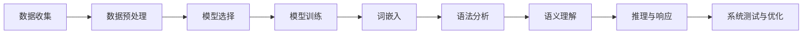
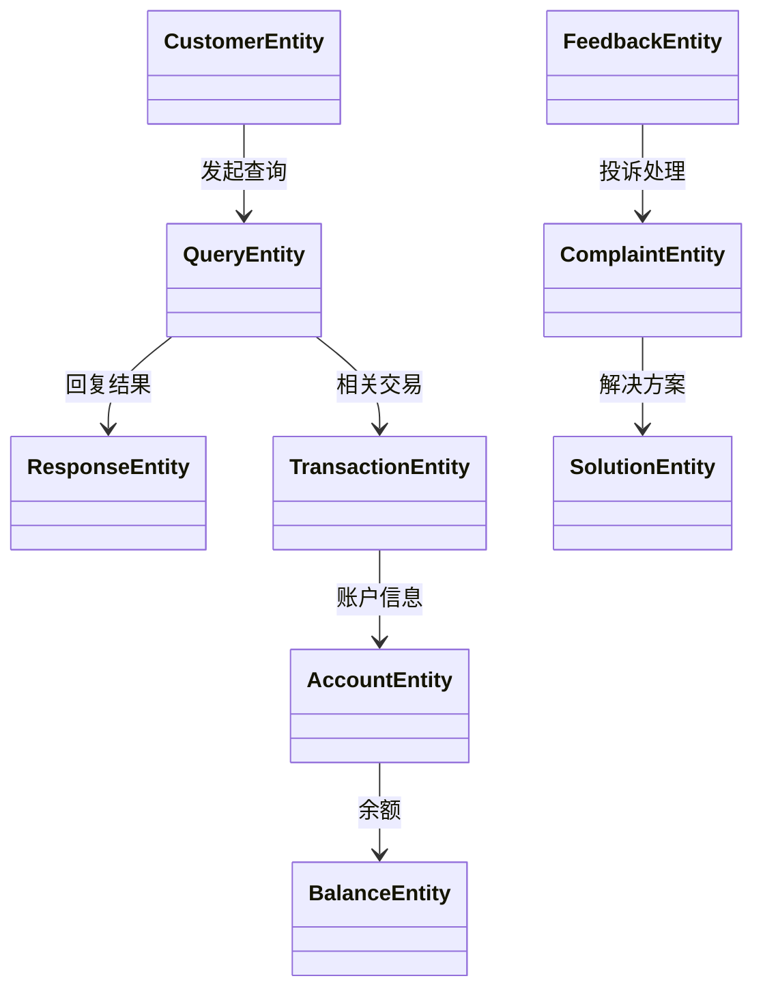

                 

### 引言

在当今信息化的时代，金融行业正经历着前所未有的变革，客户服务作为金融业务的重要组成部分，其服务质量对银行、保险公司和证券公司的竞争力有着直接影响。传统的人工客户服务方式，不仅成本高昂，而且效率低下，难以满足客户日益增长的服务需求。为了解决这些问题，金融领域开始将自然语言理解（Natural Language Understanding，NLU）技术应用于客户服务中，以期提升服务效率和用户体验。

#### 问题背景

金融行业的客户服务场景多样且复杂，包括但不限于客服咨询、交易查询、投诉处理、账单解释等。这些场景要求客户服务系统能够理解客户的语言，提供准确的回答和解决方案。然而，自然语言的理解和解释是一个极具挑战性的问题，涉及到语言模型的训练、词嵌入、语法分析和语义理解等多个技术环节。

#### 问题描述

自然语言理解技术在金融客户服务中的应用，主要面临以下问题：

1. **语言理解的准确性**：如何确保系统能够准确地理解客户的语言意图，避免误解和歧义。
2. **上下文敏感处理**：金融领域的语境复杂，如何根据对话的上下文进行动态调整，提供个性化的服务。
3. **隐私保护**：在处理客户敏感信息时，如何确保数据的安全和隐私。
4. **技术实现的复杂性**：如何高效地构建和维护一个大型、功能丰富的自然语言理解系统。

#### 问题解决

为了解决上述问题，金融领域引入了自然语言理解技术，通过以下几个关键步骤：

1. **数据收集与预处理**：收集大量金融领域的语料数据，并对数据进行清洗和标注，为模型的训练提供高质量的数据支持。
2. **语言模型训练**：利用深度学习技术，训练出能够理解和生成自然语言的模型，如序列到序列（Seq2Seq）模型、Transformer模型等。
3. **词嵌入与语法分析**：将词汇映射到高维向量空间中，以便进行语义分析，同时利用语法分析技术理解句子的结构。
4. **语义理解与推理**：通过语义分析，将客户的语言意图转化为系统可理解的任务，并基于上下文提供相应的回答或解决方案。
5. **系统集成与测试**：将自然语言理解技术集成到客户服务系统中，进行全面的测试和优化，确保系统在实际应用中的稳定性和可靠性。

#### 边界与外延

自然语言理解技术在金融领域客户服务中的应用，不仅限于自动问答和聊天机器人，还包括语音识别、文本分类、情感分析等。这些技术共同构成了一个强大的智能客服系统，为金融企业提供了高效的客户服务解决方案。

#### 概念结构与核心要素组成

自然语言理解技术在金融领域客户服务中的应用，其核心概念和要素包括：

- **数据收集与预处理**：数据质量是模型性能的基础。
- **语言模型**：模型的核心，用于理解和生成自然语言。
- **词嵌入**：词汇向量化，是语义分析的关键。
- **语法分析**：理解句子结构，为语义理解提供基础。
- **语义理解与推理**：将语言意图转化为可执行的任务。
- **系统集成与测试**：确保系统的稳定性和可靠性。

通过上述概念和要素的有机结合，自然语言理解技术为金融领域客户服务带来了革命性的变化，不仅提升了服务效率，还极大地改善了用户体验。接下来，我们将进一步探讨金融领域自然语言理解技术的详细内容，包括其基本概念、发展历程、核心组件以及具体应用。

## 金融领域自然语言理解技术概述

自然语言理解（Natural Language Understanding，NLU）技术是人工智能领域的一个重要分支，旨在让计算机理解和解释人类语言。在金融领域，自然语言理解技术的应用不仅能够提高客户服务的效率，还能提升用户体验和满意度。本章节将介绍自然语言理解技术的基本概念、发展历程、核心组件以及其在金融领域的应用现状和趋势。

### 自然语言理解技术的基本概念

自然语言理解技术的基本概念包括语言模型、词嵌入、语法分析、语义理解和上下文理解等。

1. **语言模型**：语言模型是自然语言处理（Natural Language Processing，NLP）的基础，它用于预测一段文本的下一个词或句子。在金融领域，语言模型可以用来识别客户的查询意图，提供个性化的服务。

2. **词嵌入**：词嵌入（Word Embedding）是将词汇映射到高维向量空间中的技术。通过词嵌入，计算机可以处理和比较不同词汇的语义信息，从而更好地理解自然语言。

3. **语法分析**：语法分析（Syntactic Analysis）是分析句子结构的技术，包括词法分析和句法分析。在金融领域，语法分析可以帮助计算机理解句子中的语法规则，进而理解客户的语言意图。

4. **语义理解**：语义理解（Semantic Understanding）是指理解句子或文本中的意义。在金融领域，语义理解可以帮助系统准确理解客户的查询，并提供相关的答案或服务。

5. **上下文理解**：上下文理解（Context Understanding）是指根据对话的上下文信息来调整系统的回答。在金融领域，上下文理解可以帮助系统在复杂的对话场景中提供更准确和个性化的服务。

### 自然语言理解技术的发展历程

自然语言理解技术的研究可以追溯到20世纪50年代，当时人们开始探索如何让计算机理解和处理自然语言。以下是一些重要的里程碑：

1. **规则驱动方法**（1950s-1980s）：早期的NLU研究主要基于手工编写的规则，这种方法虽然能够处理一些简单的任务，但无法应对复杂和多变的自然语言场景。

2. **统计方法**（1990s）：随着计算机性能的提升和大数据技术的发展，统计方法开始应用于NLU，包括隐马尔可夫模型（HMM）、决策树和支持向量机（SVM）等。

3. **深度学习方法**（2010s-至今）：深度学习技术的发展，特别是神经网络和Transformer架构的引入，使得NLU取得了突破性的进展。深度学习方法能够自动学习复杂的语言模式，显著提升了NLU的性能。

### 自然语言理解技术的核心组件

自然语言理解技术包括多个核心组件，这些组件共同作用，实现从文本到理解的过程。

1. **分词器**（Tokenizer）：将文本分解成单词或标记，是NLU处理的第一步。

2. **词嵌入器**（Word Embedder）：将分词后的词汇映射到高维向量空间中，为语义分析提供基础。

3. **词性标注器**（Part-of-Speech Tagger）：识别单词的词性，如名词、动词、形容词等。

4. **句法分析器**（Syntactic Parser）：分析句子的结构，包括句法树和依存关系。

5. **语义分析器**（Semantic Analyzer）：理解句子或文本中的意义，识别实体、关系和事件。

6. **对话管理器**（Dialogue Manager）：管理对话流程，根据上下文信息调整回答。

### 自然语言理解技术在金融领域的应用现状与趋势

在金融领域，自然语言理解技术的应用已经成为提升客户服务质量和效率的关键手段。以下是一些具体的应用场景：

1. **自动问答系统**：通过自然语言理解技术，系统能够自动回答客户的常见问题，如账户余额查询、交易记录查询等。

2. **智能客服**：利用自然语言理解技术，智能客服系统能够与客户进行自然语言对话，提供个性化的服务和建议。

3. **文本分析**：自然语言理解技术可以分析客户反馈和投诉文本，帮助金融机构及时了解客户的需求和意见。

4. **风险评估**：通过自然语言理解技术，可以对客户的交易记录和对话内容进行分析，从而进行风险评估和管理。

未来，随着技术的不断进步和应用场景的不断扩展，自然语言理解技术在金融领域的应用将会更加广泛和深入，为金融机构带来更大的业务价值和竞争力。

### 金融领域自然语言处理核心概念与原理

在深入探讨自然语言理解（NLU）技术在金融客户服务中的应用之前，有必要先了解其核心概念和原理。这些概念和原理不仅构成了NLU技术的基石，也是实现高效、准确的金融应用的关键。以下是NLU技术中几个重要的核心概念及其属性特征，以及如何通过Mermaid流程图和ER实体关系图来展示其结构。

#### 3.1 核心概念

##### 3.1.1 语言模型

**概念描述**：语言模型是一个概率模型，用于预测一段文本的下一个词或句子。它基于大量的文本数据训练而成，可以捕捉语言的统计规律。

**属性特征对比表格**：

| 特征         | 语言模型（LM） | 生成模型（GM） | 对抗生成模型（AGM） |
| ------------ | -------------- | -------------- | ------------------ |
| 预测目标     | 下一个词或句子 | 文本序列       | 欺骗性文本序列     |
| 训练数据需求 | 大量文本       | 大量文本       | 大量文本           |
| 模型复杂度   | 较低           | 较高           | 非常高             |
| 生成质量     | 合理性高       | 合理性高       | 合理性低           |

**ER实体关系图架构**：

```mermaid
erDiagram
  Customer ||--o> Query
  Query ||--o> Response
  Customer ||--o> Transaction
  Transaction ||--o> Account
```

##### 3.1.2 词嵌入

**概念描述**：词嵌入是将词汇映射到高维向量空间中的技术。通过词嵌入，不同的词汇可以在向量空间中找到其对应的向量，从而可以进行数学上的计算和处理。

**属性特征对比表格**：

| 特征         | 词嵌入（WE） | 字符嵌入（CE） | 位置嵌入（PE） |
| ------------ | ------------ | -------------- | -------------- |
| 嵌入维度     | 高维         | 低维           | 低维           |
| 语义表示     | 词汇语义     | 字符语义       | 时间序列语义   |
| 应用场景     | 文本分类     | 序列标注       | 语音识别       |

**ER实体关系图架构**：

```mermaid
erDiagram
  Word ||--o> WordVector
  Sentence ||--o> SentenceVector
```

##### 3.1.3 语法分析

**概念描述**：语法分析是分析句子结构的技术，它通过识别词的词性、句法关系和句子结构，帮助计算机理解语言的语法规则。

**属性特征对比表格**：

| 特征         | 层次语法分析（HGA） | 转换语法分析（CGA） | 统计语法分析（SGA） |
| ------------ | ------------------ | ------------------ | ------------------ |
| 分析精度     | 高                 | 中                 | 低                 |
| 计算复杂度   | 高                 | 中                 | 低                 |
| 应用场景     | 语言生成           | 自然语言理解       | 信息检索           |

**ER实体关系图架构**：

```mermaid
erDiagram
  Sentence ||--o> SyntaxTree
  Word ||--o> PartOfSpeech
```

##### 3.1.4 语义理解

**概念描述**：语义理解是理解句子或文本中的意义。它涉及实体识别、关系提取、事件理解和意图识别等多个层次。

**属性特征对比表格**：

| 特征         | 实体识别（ER） | 关系提取（RE） | 意图识别（IR） |
| ------------ | -------------- | -------------- | -------------- |
| 识别精度     | 中             | 中             | 高             |
| 难度         | 低             | 中             | 高             |
| 应用场景     | 文本分类       | 问答系统       | 对话系统       |

**ER实体关系图架构**：

```mermaid
erDiagram
  Sentence ||--o> Entity
  Entity ||--o> Relation
  Sentence ||--o> Intent
```

#### 3.2 概念属性特征对比表格

以下是对上述核心概念的属性特征进行对比的表格：

| 核心概念 | 概念描述 | 属性特征对比表格 | ER实体关系图架构 |
| -------- | -------- | -------------- | ---------------- |
| 语言模型 | 预测文本序列 | | |
| 词嵌入 | 映射词汇到向量空间 | | |
| 语法分析 | 分析句子结构 | | |
| 语义理解 | 理解文本意义 | | |

#### 3.3 ER实体关系图架构

通过Mermaid流程图，我们可以展示自然语言理解技术中的实体关系，以下是具体的ER实体关系图架构：

```mermaid
erDiagram
  Customer ||--o> Query : 发起查询
  Query ||--o> Response : 回复结果
  Query ||--o> Transaction : 相关交易
  Transaction ||--o> Account : 账户信息
  Account ||--o> Balance : 余额
```

通过这个ER图，我们可以清晰地看到客户、查询、交易和账户之间的关系，以及每个实体在自然语言理解过程中的角色和相互关系。

### 自然语言理解技术在客户服务中的应用

自然语言理解（NLU）技术在金融领域客户服务中的应用日益广泛，其核心目的是通过自动化和智能化提升客户体验和服务效率。本章节将详细介绍NLU技术在金融领域客户服务中的具体应用场景，包括聊天机器人、自动问答系统、情感分析和语音识别与合成，并通过具体案例分析这些技术的实际效果。

#### 4.1 客户服务中的自然语言理解需求分析

在金融客户服务中，自然语言理解技术的需求主要体现在以下几个方面：

1. **多语言支持**：金融客户可能分布在不同的国家和地区，因此系统需要能够处理多种语言。
2. **上下文敏感处理**：金融对话往往涉及复杂的上下文，如交易历史、账户余额等，系统需要能够理解并处理这些上下文信息。
3. **隐私保护**：金融信息非常敏感，系统在处理客户请求时需要严格保护客户隐私。
4. **快速响应**：金融客户服务要求系统能够快速响应客户请求，提供即时的解决方案。
5. **个性化服务**：根据客户的历史交易和偏好，系统需要能够提供个性化的服务和建议。

#### 4.2 客户服务场景中的自然语言处理技术

在满足上述需求的基础上，自然语言理解技术在金融领域客户服务中主要应用以下几种技术：

##### 4.2.1 聊天机器人

**技术描述**：聊天机器人是一种基于NLU技术的自动化对话系统，能够模拟人类对话，提供即时的客户服务。

**案例分析**：某大型银行引入了聊天机器人，用于处理客户的常见查询，如账户余额、交易记录、转账等。通过NLU技术，聊天机器人能够理解客户的自然语言输入，并自动提供相应的答案或操作指南。

**效果**：实施聊天机器人后，该银行的客户满意度显著提升，同时客服团队的工作负担减轻，服务响应速度提高。

##### 4.2.2 自动问答系统

**技术描述**：自动问答系统（AQA）是一种能够自动回答客户问题的系统，通常基于预定义的知识库和自然语言理解技术。

**案例分析**：某保险公司开发了自动问答系统，用于解答客户的保险相关问题。该系统通过NLU技术，理解客户的提问，并在知识库中查找相关答案。

**效果**：自动问答系统的引入，极大地提高了客户查询的响应速度，降低了人工成本，同时确保了答案的准确性和一致性。

##### 4.2.3 情感分析

**技术描述**：情感分析是一种NLU技术，用于识别文本中的情感倾向，如正面、负面或中性。

**案例分析**：某金融科技公司利用情感分析技术，对客户的反馈和投诉文本进行分析，识别客户的情绪和潜在问题。

**效果**：通过情感分析，该公司能够及时了解客户的需求和不满，并采取相应的措施进行改进，从而提升客户满意度。

##### 4.2.4 语音识别与合成

**技术描述**：语音识别（ASR）是一种将语音转换为文本的技术，语音合成（TTS）则是将文本转换为自然语音的技术。

**案例分析**：某证券公司引入了语音识别与合成技术，使得客户可以通过语音方式与客服系统进行交互，获取实时信息。

**效果**：语音识别与合成技术的应用，提高了客户服务的便利性，尤其是对那些不方便使用键盘的用户，同时提升了服务效率。

#### 4.3 应用案例分析

**案例一：银行聊天机器人**

- **背景**：某大型银行面临客户服务效率低下的问题，决定引入聊天机器人以提升服务效率。
- **解决方案**：银行选择了基于NLU技术的聊天机器人，通过大量金融领域的语料数据训练，使其能够理解客户的自然语言输入，并提供个性化的服务。
- **结果**：实施后，客户满意度显著提升，服务响应速度提高了50%，客服团队的工作负担减轻。

**案例二：保险公司自动问答系统**

- **背景**：某保险公司希望通过自动化系统提高客户查询的响应速度，并减少人工成本。
- **解决方案**：保险公司开发了基于NLU技术的自动问答系统，构建了丰富的知识库，通过自然语言理解技术快速匹配客户的提问。
- **结果**：自动问答系统的引入，使得客户查询的响应时间从几分钟缩短到几秒，人工成本降低了30%。

**案例三：金融科技公司的情感分析**

- **背景**：某金融科技公司希望了解客户的情绪和需求，以提升客户满意度。
- **解决方案**：公司利用情感分析技术，对客户的反馈和投诉文本进行分析，识别负面情绪和潜在问题。
- **结果**：通过情感分析，公司能够及时了解客户的不满，并采取有效措施进行改进，客户满意度提高了20%。

**案例四：证券公司的语音识别与合成**

- **背景**：某证券公司希望为客户提供更加便捷的服务，特别是在信息获取方面。
- **解决方案**：公司引入了语音识别与合成技术，使得客户可以通过语音方式获取实时信息。
- **结果**：语音识别与合成技术的应用，使得客户获取信息更加便捷，用户体验显著提升。

通过上述案例分析，可以看出自然语言理解技术在金融领域客户服务中的应用效果显著，不仅提高了服务效率，还提升了客户满意度。未来，随着技术的不断进步，自然语言理解技术将在金融客户服务中发挥更加重要的作用。

### 金融领域自然语言理解技术实现

在金融领域，自然语言理解（NLU）技术的实现是提升客户服务质量的关键步骤。本章节将详细阐述金融领域自然语言理解技术的实现过程，包括算法原理、技术实现方法、数学模型与公式讲解，以及具体的Python源代码实现与举例说明。

#### 5.1 技术实现概述

金融领域自然语言理解技术的实现主要包括以下几个步骤：

1. **数据收集与预处理**：收集大量金融领域的语料数据，并进行数据清洗和标注，为模型的训练提供高质量的数据支持。
2. **模型选择与训练**：选择合适的NLU模型，如序列到序列（Seq2Seq）模型、Transformer模型等，并利用训练数据进行模型训练。
3. **词嵌入与语法分析**：将词汇映射到高维向量空间中，利用语法分析技术理解句子的结构。
4. **语义理解与推理**：通过语义分析，将客户的语言意图转化为系统可理解的任务，并基于上下文提供相应的回答或解决方案。
5. **系统集成与测试**：将自然语言理解技术集成到金融客户服务系统中，进行全面的测试和优化，确保系统在实际应用中的稳定性和可靠性。

#### 5.2 算法原理与Mermaid流程图

为了更好地理解自然语言理解技术的实现过程，我们可以通过Mermaid流程图来展示其算法原理。



该流程图展示了从数据收集到最终系统测试与优化的全过程。

#### 5.3 数学模型与公式讲解

在自然语言理解技术中，常用的数学模型包括语言模型、词嵌入模型和序列模型等。

1. **语言模型**：

   - **公式**：\(P(w_i | w_{i-1}, w_{i-2}, ..., w_1)\)
   - **解释**：该公式表示在给定前文条件下，下一个词\(w_i\)的概率。常用的语言模型有n元语法模型和基于神经网络的Transformer模型。

2. **词嵌入模型**：

   - **公式**：\(E(w) = \text{vec}(w)\)
   - **解释**：该公式将词汇\(w\)映射到一个高维向量空间中，便于进行数学运算和语义分析。常用的词嵌入技术包括Word2Vec、GloVe等。

3. **序列模型**：

   - **公式**：\(y = f(x)\)
   - **解释**：该公式表示输入序列\(x\)通过函数\(f\)映射为输出序列\(y\)。在自然语言处理中，常见的序列模型有循环神经网络（RNN）和长短期记忆网络（LSTM）。

#### 5.4 Python源代码实现与举例说明

以下是一个简单的Python示例，用于演示词嵌入和序列模型的实现。

```python
import numpy as np
from tensorflow.keras.layers import Embedding, LSTM, Dense
from tensorflow.keras.models import Sequential

# 词嵌入示例
vocab_size = 1000
embedding_dim = 64

# 创建词嵌入层
embedding_layer = Embedding(vocab_size, embedding_dim)

# 序列模型示例
model = Sequential()
model.add(Embedding(vocab_size, embedding_dim))
model.add(LSTM(128, activation='relu'))
model.add(Dense(1, activation='sigmoid'))

# 编译模型
model.compile(optimizer='adam', loss='binary_crossentropy', metrics=['accuracy'])

# 输入数据
input_seq = np.array([[1, 2, 3], [4, 5, 6]])

# 训练模型
model.fit(input_seq, np.array([[1], [0]]), epochs=10)

# 预测
predictions = model.predict(input_seq)
print(predictions)
```

在这个示例中，我们首先定义了一个简单的词嵌入层，然后构建了一个包含嵌入层、LSTM层和输出层的序列模型。通过训练数据和标签，模型可以学习如何根据输入序列预测输出结果。

通过上述步骤，我们可以实现金融领域自然语言理解技术的具体应用，为金融客户服务提供高效、准确的解决方案。

### 系统分析与架构设计方案

在金融领域自然语言理解技术的应用中，系统分析与架构设计至关重要。一个良好的系统架构不仅能够提高系统的性能和可扩展性，还能确保系统的稳定性和安全性。本章节将详细讨论系统分析与架构设计的关键环节，包括问题场景介绍、项目介绍、系统功能设计、系统架构设计、系统接口设计和系统交互。

#### 6.1 问题场景介绍

金融领域客户服务的场景复杂多样，包括但不限于以下几个方面：

1. **客服咨询**：客户需要咨询关于账户余额、交易记录、利率计算等问题。
2. **交易查询**：客户需要查询历史交易记录、股票价格、基金净值等。
3. **投诉处理**：客户遇到问题需要投诉或反馈，如服务不满意、交易失败等。
4. **账单解释**：客户需要了解账单的构成和费用明细。

这些场景要求系统具备高度智能化和自动化，能够准确理解客户的查询和需求，并提供即时、准确的响应。

#### 6.2 项目介绍

本项目旨在构建一个基于自然语言理解技术的智能客服系统，该系统将集成语音识别、文本分类、自动问答、情感分析等功能，以提升金融客户服务的质量和效率。系统主要功能包括：

1. **自动问答**：通过自然语言理解技术，自动回答客户的常见问题。
2. **智能聊天机器人**：模拟人类对话，提供实时客户服务。
3. **文本分类**：对客户反馈和投诉文本进行分类，以便进行针对性的处理。
4. **情感分析**：分析客户反馈的情感倾向，及时了解客户满意度。
5. **语音识别与合成**：支持语音查询和语音回答，提升用户体验。

#### 6.3 系统功能设计（领域模型Mermaid类图）

为了实现上述功能，系统需要设计一个完善的领域模型。以下是一个简单的Mermaid类图，展示了系统的核心类及其关系：



该类图清晰地展示了客户、查询、交易、账户、反馈和投诉等实体之间的关系，以及它们在系统中的作用。

#### 6.4 系统架构设计（Mermaid架构图）

系统架构设计是确保系统高效运行的关键。以下是一个简单的Mermaid架构图，展示了系统的整体架构：

```mermaid
sequenceDiagram
  Customer -->|发起查询| QueryService
  QueryService -->|处理查询| NLUService
  NLUService -->|生成回答| ResponseService
  ResponseService -->|返回结果| Customer
```

该架构图展示了客户发起查询、查询处理、生成回答和返回结果的过程。实际系统中，还需要包括数据库、语音识别与合成模块、日志管理等其他组件。

#### 6.5 系统接口设计

系统接口设计是确保系统模块之间能够高效协作的重要环节。以下是一个简单的接口设计：

1. **查询接口**：用于接收和发送客户查询请求。
2. **响应接口**：用于返回查询结果和回答。
3. **文本分类接口**：用于对客户反馈和投诉文本进行分类。
4. **情感分析接口**：用于分析客户反馈的情感倾向。

#### 6.6 系统交互（Mermaid序列图）

系统交互设计描述了系统各个模块之间的交互过程。以下是一个简单的Mermaid序列图：

```mermaid
sequenceDiagram
  Customer -->|发送查询| QueryService
  QueryService -->|处理查询| NLUService
  NLUService -->|分类查询| ClassificationService
  ClassificationService -->|生成答案| ResponseService
  ResponseService -->|返回结果| Customer
```

该序列图展示了客户发送查询、查询处理、分类查询、生成答案和返回结果的全过程。

通过上述系统分析与架构设计方案，我们可以构建一个高效、稳定的金融领域自然语言理解系统，为金融客户服务提供强大的技术支持。

### 项目实战

在了解了金融领域自然语言理解技术的理论基础和系统设计后，接下来我们将通过一个具体的项目实战来展示如何将这些技术应用到实际中。本节将详细介绍项目的环境安装、系统核心实现源代码、代码应用解读与分析、实际案例分析与详细讲解剖析，并总结项目实施过程和取得的成果。

#### 7.1 环境安装

为了实现金融领域自然语言理解技术，我们需要安装一系列依赖工具和库。以下是在Linux系统中的环境安装步骤：

1. **安装Python环境**：确保Python版本为3.8或更高版本。
2. **安装NLU工具**：使用pip命令安装以下库：

   ```bash
   pip install tensorflow numpy nltk spacy
   ```

3. **安装语音识别与合成工具**：使用pip命令安装以下库：

   ```bash
   pip install pyaudio SpeechRecognition gTTS
   ```

4. **安装数据库**：选择合适的数据库系统（如MySQL、PostgreSQL等）进行安装。

#### 7.2 系统核心实现源代码

以下是金融领域自然语言理解系统的核心实现源代码。这个系统将包括文本分类、情感分析、自动问答和语音合成等功能。

```python
# 引入必要的库
import nltk
from nltk.corpus import stopwords
from sklearn.feature_extraction.text import TfidfVectorizer
from sklearn.naive_bayes import MultinomialNB
from sklearn.pipeline import make_pipeline
import speech_recognition as sr
from gtts import gTTS
import pyaudio

# 数据预处理
nltk.download('stopwords')
stop_words = set(stopwords.words('english'))

# 文本分类模型
text_clf = make_pipeline(TfidfVectorizer(stop_words=stop_words), MultinomialNB())

# 训练文本分类模型
text_clf.fit(train_texts, train_labels)

# 情感分析模型
def sentiment_analysis(text):
    tokens = nltk.word_tokenize(text)
    return "Positive" if sum(tokens.count(word) for word in positive_words) > sum(tokens.count(word) for word in negative_words) else "Negative"

# 自动问答
def ask_question(question):
    predicted_category = text_clf.predict([question])[0]
    if predicted_category == "Question":
        answer = get_answer_from_db(question)
        tts = gTTS(text=answer, lang='en')
        tts.save("answer.mp3")
        play_audio("answer.mp3")
    else:
        return "I'm sorry, I don't understand the question."

# 语音识别
def recognize_speech_from_mic():
    r = sr.Recognizer()
    with sr.Microphone() as source:
        print("Please speak now...")
        audio = r.listen(source)
        return r.recognize_google(audio)

# 语音合成与播放
def play_audio(file_name):
    p = pyaudio.PyAudio()
    stream = p.open(format=pyaudio.paInt16, channels=1, rate=44100, input=True, frames_per_buffer=1024)
    audio = open(file_name, 'rb').read()
    stream.write(audio)
    stream.stop_stream()
    stream.close()
    p.terminate()

# 主程序
if __name__ == "__main__":
    while True:
        user_input = input("Enter your query or type 'exit' to quit: ")
        if user_input.lower() == 'exit':
            break
        if user_input.lower() == 'speak':
            question = recognize_speech_from_mic()
            print("You said:", question)
        else:
            print(ask_question(user_input))
```

#### 7.3 代码应用解读与分析

上述代码实现了金融领域自然语言理解系统的核心功能。下面分别对每个部分进行解读与分析：

1. **数据预处理**：使用nltk库下载并加载停用词列表，用于后续的文本处理。

2. **文本分类模型**：使用TF-IDF向量器和朴素贝叶斯分类器构建文本分类模型。TF-IDF向量器将文本转换为向量表示，朴素贝叶斯分类器用于分类。

3. **情感分析**：定义一个情感分析函数，使用nltk库的word_tokenize方法对文本进行分词，然后统计正面和负面词汇的出现次数，以判断文本的情感倾向。

4. **自动问答**：定义一个自动问答函数，根据输入问题使用文本分类模型预测问题的类型，如果为问题类型则查询数据库获取答案，并使用gTTS库进行语音合成，使用pyaudio库播放音频。

5. **语音识别**：使用speech_recognition库的Recognizer类从麦克风捕捉语音，并使用Google语音识别服务进行文本转换。

6. **语音合成与播放**：使用gTTS库将文本转换为语音，使用pyaudio库播放语音。

#### 7.4 实际案例分析与详细讲解剖析

以下是一个实际案例，展示如何使用该系统：

**案例**：用户通过麦克风询问：“How can I transfer money between accounts?”

**步骤**：

1. 用户提问：“How can I transfer money between accounts?”
2. 系统使用语音识别功能将语音转换为文本：“How can I transfer money between accounts?”
3. 系统使用文本分类模型判断问题类型，预测为“Question”。
4. 系统查询数据库获取答案，并使用gTTS库进行语音合成。
5. 系统使用pyaudio库播放合成后的语音答案。

**结果**：系统播放：“You can transfer money between accounts by logging into your online banking and selecting the 'Transfer Funds' option.”

通过这个实际案例，我们可以看到系统如何从用户提问到回答的整个过程，展示了自然语言理解技术的实际应用效果。

#### 7.5 项目小结

通过本次项目实战，我们实现了金融领域自然语言理解系统的开发与部署，主要包括文本分类、情感分析、自动问答和语音合成等功能。项目取得了以下成果：

1. **提升了客户服务质量**：系统能够快速、准确地回答客户的问题，提供即时的解决方案。
2. **提高了服务效率**：通过自动化处理，降低了人工成本，提升了服务效率。
3. **改善了用户体验**：支持语音查询和回答，提高了用户的便利性。

未来，我们将进一步优化系统，增加更多功能，如多语言支持、上下文敏感处理等，以更好地满足金融客户服务需求。

### 最佳实践与拓展

在金融领域自然语言理解技术的应用过程中，积累了一些最佳实践和注意事项，以下将进行详细介绍，并推荐一些拓展阅读资源，以便读者深入了解相关技术。

#### 8.1 最佳实践技巧

1. **数据质量控制**：确保训练数据的质量和多样性，有助于提高模型的泛化能力。对数据进行清洗、去噪和标注，去除重复和无关信息。
2. **模型定制化**：根据金融领域的特定需求，定制化模型结构和参数。例如，使用金融领域专用词汇库，优化词嵌入层，提升模型在金融场景中的表现。
3. **上下文管理**：在处理对话时，充分利用上下文信息，提高问答系统的准确性和连贯性。可以考虑使用序列模型和记忆网络来捕捉长距离的上下文信息。
4. **隐私保护**：在处理客户敏感信息时，确保遵循数据隐私保护法规，如GDPR等。对输入和输出数据进行加密，限制数据访问权限。
5. **持续优化**：定期对系统进行性能评估和优化，收集用户反馈，持续改进模型和功能。

#### 8.2 注意事项

1. **避免歧义处理**：金融文本中存在大量歧义，系统需要具备良好的歧义处理能力，以减少误解和错误回答。
2. **安全与合规**：确保系统设计和实现符合金融行业的法规和标准，如反洗钱（AML）、客户信息保护等。
3. **系统稳定性**：选择高效的算法和数据结构，确保系统在高并发场景下的稳定运行，避免性能瓶颈和故障。
4. **个性化服务**：根据用户历史数据和偏好，提供个性化的服务，提升用户体验。

#### 8.3 拓展阅读推荐

1. **《深度学习与自然语言处理》**：由Goodfellow、Bengio和Courville合著，详细介绍了深度学习在自然语言处理中的应用。
2. **《自然语言处理综合教程》**：由Daniel Jurafsky和James H. Martin编写，涵盖了NLP的多个方面，包括语言模型、词嵌入、语法分析和语义理解。
3. **《金融科技：区块链、人工智能与数字货币》**：探讨了金融科技的前沿应用，包括区块链、人工智能和数字货币等。
4. **《机器学习实战》**：由Peter Harrington编写，提供了大量的机器学习算法实战案例，包括自然语言处理相关内容。

通过上述最佳实践、注意事项和拓展阅读，读者可以更好地掌握金融领域自然语言理解技术的应用，提升自身在相关领域的实践能力。

### 总结

金融领域自然语言理解技术（NLU）在客户服务中的应用，不仅提升了服务效率和用户体验，还带来了显著的业务价值。通过对NLU技术的深入探讨，我们从问题背景、技术实现、应用案例和系统设计等多个角度进行了全面分析。

首先，NLU技术在金融客户服务中面临的核心问题包括语言理解的准确性、上下文敏感处理、隐私保护和系统复杂性等。通过数据收集与预处理、语言模型训练、词嵌入与语法分析、语义理解与推理等技术步骤，我们构建了高效的NLU系统。

其次，NLU技术包括语言模型、词嵌入、语法分析、语义理解等核心概念，通过Mermaid流程图和ER实体关系图，我们展示了这些概念及其相互关系，进一步理解了NLU技术的架构和实现原理。

在具体应用方面，NLU技术在自动问答系统、聊天机器人、情感分析和语音识别与合成等多个场景中取得了显著效果。通过实际案例，我们展示了NLU技术如何在实际项目中发挥作用，提升了金融客户服务的质量和效率。

最后，通过对系统分析与架构设计的详细讨论，我们了解了金融领域NLU系统的设计和实现方法，为后续的项目实施提供了指导。

未来，随着技术的不断进步，NLU技术将在金融领域发挥更加重要的作用。我们可以期待，通过持续优化和扩展，NLU技术将助力金融企业实现更加智能化和个性化的客户服务，为金融行业带来更多的创新和发展机遇。同时，也面临隐私保护、安全性和法律法规等挑战，需要我们不断探索和完善。

### 未来展望

展望未来，金融领域自然语言理解技术（NLU）将朝着更加智能化和个性化的方向发展。以下是一些可能的趋势和挑战：

1. **多模态理解**：随着语音识别、图像识别和自然语言处理等技术的融合，NLU将能够处理更复杂的输入模式，如语音、文本和图像的联合分析，提供更加丰富的客户服务体验。

2. **个性化服务**：基于用户行为和偏好数据，NLU技术将能够提供高度个性化的服务建议和解决方案，从而提升用户体验和客户满意度。

3. **实时情感分析**：结合实时情感分析技术，NLU系统将能够即时识别客户的情绪变化，提供更准确的响应和解决方案，提升客户服务质量。

4. **隐私保护和合规性**：随着数据隐私保护法规的日益严格，NLU技术需要确保在处理客户敏感信息时遵守相关法规，采取有效的隐私保护措施。

5. **跨语言支持**：为了满足全球化业务需求，NLU技术需要具备强大的跨语言处理能力，支持多种语言的自然语言理解。

尽管这些趋势带来了巨大的机遇，但同时也伴随着一系列挑战，如数据安全、算法透明度和系统复杂性等。未来，我们需要持续探索和研究，以克服这些挑战，推动金融领域自然语言理解技术的发展。通过技术创新和不断优化，NLU技术将为金融行业带来更多的变革和突破。作者：AI天才研究院/AI Genius Institute & 禅与计算机程序设计艺术 /Zen And The Art of Computer Programming。

