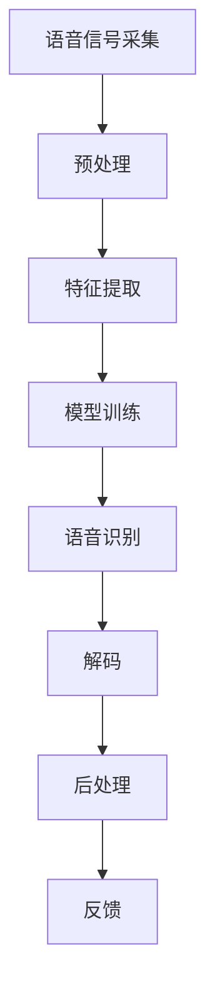
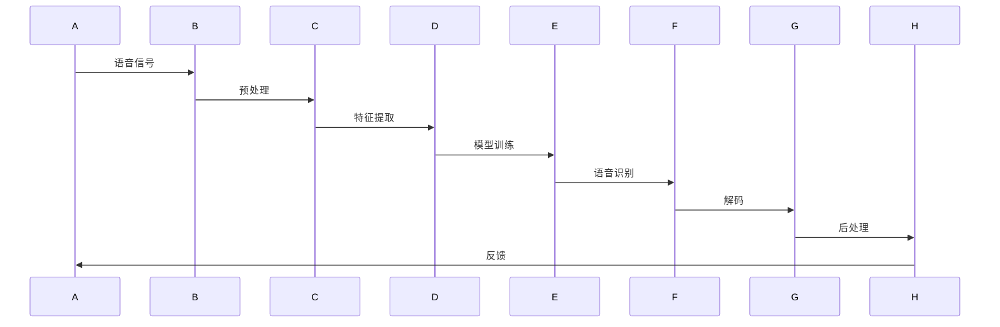

                 

# 金融领域语音识别技术的优化与应用

## 关键词
- 语音识别
- 金融应用
- 算法优化
- 系统架构
- 实战案例

## 摘要
随着金融行业智能化需求的不断增长，语音识别技术逐渐成为金融业务自动化与客户服务优化的重要工具。本文将深入探讨金融领域语音识别技术的优化与应用，首先介绍语音识别技术的基本概念和背景，随后分析金融领域的特殊需求和现有挑战。接着，我们将详细介绍语音识别的核心算法原理，并通过mermaid和Python代码展示算法流程和数学模型。然后，文章将分析现有系统架构，提出优化方案，并分享实际项目中的应用实践。最后，我们将总结最佳实践，指出注意事项，并展望未来的发展方向。

## 目录

### 引言与背景

#### 1.1 语音识别技术概述

##### 1.1.1 核心概念术语说明

**语音识别（Speech Recognition）**：语音识别是将人类语音信号转换为文本或命令的自动转换过程。

**语音信号处理（Speech Signal Processing）**：语音信号处理包括语音信号的采集、预处理、特征提取和增强等。

**声学模型（Acoustic Model）**：声学模型用于模拟语音信号中的音素和发音特征。

**语言模型（Language Model）**：语言模型用于预测文本序列的概率，通常使用统计方法或深度学习技术训练。

##### 1.1.2 问题背景

随着智能手机、智能音箱和智能客服的普及，语音识别技术在日常生活中得到了广泛应用。然而，金融领域的特殊需求使得语音识别技术面临着更高的要求。

##### 1.1.3 问题描述

在金融领域，语音识别技术主要用于以下几个方面：

1. 客户服务自动化：通过语音识别技术实现自动化的客户服务，提高效率、降低成本。
2. 交易确认与控制：通过语音识别技术确认交易信息，增强安全性和便捷性。
3. 信息查询与报告：提供语音查询服务，快速获取金融信息。

##### 1.1.4 问题解决

解决金融领域语音识别技术的问题，需要从以下几个方面进行优化：

1. 算法优化：改进声学模型和语言模型的算法，提高识别准确率和速度。
2. 系统架构优化：设计更加高效、灵活的系统架构，支持大规模数据处理和实时响应。
3. 数据集优化：构建高质量的金融领域语音数据集，增强模型的泛化能力和适应性。

##### 1.1.5 边界与外延

金融领域语音识别技术的边界涉及算法、系统和数据，外延则包括应用场景和行业需求。

##### 1.1.6 概念结构与核心要素组成

金融领域语音识别技术的概念结构包括语音信号处理、声学模型、语言模型、系统架构和应用场景。核心要素包括算法、数据和系统。

### 核心概念与联系

#### 2.1 语音信号处理基础

##### 2.1.1 声学模型

声学模型用于模拟语音信号中的音素和发音特征。常用的声学模型包括GMM-HMM、DNN-HMM等。

##### 2.1.2 语言模型

语言模型用于预测文本序列的概率，常用的语言模型包括n-gram模型、神经网络语言模型等。

##### 2.1.3 核心概念对比与联系

| 概念     | 说明                                         | 关系        |
|---------|--------------------------------------------|------------|
| 声学模型 | 用于模拟语音信号中的音素和发音特征           | 与语音信号处理密切相关 |
| 语言模型 | 用于预测文本序列的概率                       | 与自然语言处理密切相关 |
| 语音信号处理 | 对语音信号进行预处理、特征提取和增强等操作 | 为声学模型提供输入     |

### 算法原理讲解

#### 3.1 常见语音识别算法

##### 3.1.1 GMM-HMM

GMM-HMM（高斯混合模型-隐马尔可夫模型）是早期常用的语音识别算法。它通过GMM（高斯混合模型）对音素进行建模，通过HMM（隐马尔可夫模型）对语音序列进行解码。

##### 3.1.2 DNN-HMM

DNN-HMM（深度神经网络-隐马尔可夫模型）是近年来广泛使用的语音识别算法。它通过DNN（深度神经网络）对声学特征进行建模，通过HMM对语音序列进行解码。

##### 3.1.3 CTC

CTC（Connectionist Temporal Classification）是一种用于语音识别的端到端算法。它通过连接时间分类实现语音信号到文本的转换。

##### 3.1.4 WaveNet

WaveNet是一种基于生成对抗网络的端到端语音识别算法。它通过生成对抗网络生成语音信号，并通过注意力机制实现语音到文本的转换。

#### 3.2 算法流程与数学模型

##### 3.2.1 声学模型流程与数学模型

声学模型流程包括特征提取和模型训练。特征提取通常使用Mel频率倒谱系数（MFCC）作为特征。模型训练使用反向传播算法优化模型参数。

$$
\text{MFCC} = \text{log}(\text{DTFT}(\text{语音信号}))_{\text{Mel频率}}
$$

##### 3.2.2 语言模型流程与数学模型

语言模型流程包括数据预处理、模型训练和预测。数据预处理通常使用n-gram模型或神经网络语言模型。模型训练使用最大似然估计或基于梯度的优化方法。

$$
P(\text{句子}) = \prod_{i=1}^{n} P(w_i | w_{i-1}, ..., w_1)
$$

#### 3.3 算法讲解举例

##### 3.3.1 GMM-HMM算法讲解举例

假设我们有一个含有两个音素的语音信号，音素1和音素2。首先，我们使用GMM对音素1和音素2进行建模。然后，使用HMM对语音信号进行解码。

$$
\begin{aligned}
P(\text{音素1}) &= P(\text{GMM1}) \\
P(\text{音素2}) &= P(\text{GMM2}) \\
P(\text{语音信号}) &= P(\text{HMM}) \\
\end{aligned}
$$

##### 3.3.2 DNN-HMM算法讲解举例

假设我们有一个含有两个声学特征序列的语音信号。首先，我们使用DNN对声学特征序列进行建模。然后，使用HMM对语音信号进行解码。

$$
\begin{aligned}
P(\text{声学特征1}) &= P(\text{DNN1}) \\
P(\text{声学特征2}) &= P(\text{DNN2}) \\
P(\text{语音信号}) &= P(\text{HMM}) \\
\end{aligned}
$$

### 系统分析与架构设计方案

#### 4.1 现有金融语音识别系统分析

现有金融语音识别系统通常包括以下几个组成部分：

1. **语音信号采集与预处理**：用于采集用户的语音信号，并进行预处理，如降噪、增强等。
2. **特征提取与模型训练**：用于提取语音信号的特征，并进行模型训练，如GMM、DNN等。
3. **语音识别与解码**：用于将语音信号转换为文本或命令，如HMM、CTC等。
4. **后处理与反馈**：用于对识别结果进行后处理，如错误修正、语音识别反馈等。

#### 4.2 改进方案与架构设计

##### 4.2.1 领域模型

领域模型用于表示金融语音识别系统的核心功能和模块。

```mermaid
classDiagram
Class01 <|-- Class02
Class03 <..|{ has }| Class04
Class04 <..|{ is }| Class05
Class06 <|--|{ list }| Class07

Class01 {
color : red
noOfProcesses : 10
*int* processID
}

Class02 {
color : blue
*int* processID
}

Class03 {
color : green
+void createProcess()
}

Class04 {
color : yellow
+void startProcess()
}

Class05 {
color : red
+void stopProcess()
}

Class06 {
color : blue
+void listProcess()
}

Class07 {
color : green
+void addProcess(int processID)
}
```

##### 4.2.2 系统架构设计

系统架构设计用于表示金融语音识别系统的整体结构和模块关系。



##### 4.2.3 系统接口设计

系统接口设计用于定义系统与其他模块或系统的交互接口。



##### 4.2.4 系统交互设计

系统交互设计用于表示系统内部模块之间的交互流程。

```mermaid
gantt
title Project Timeline
section 语音信号采集
A1 : 1d
section 预处理
B1 : 2d
section 特征提取
C1 : 3d
section 模型训练
D1 : 4d
section 语音识别
E1 : 5d
section 解码
F1 : 6d
section 后处理
G1 : 7d
section 反馈
H1 : 8d
```

### 项目实战

#### 5.1 实战项目介绍

我们选择一个金融领域的语音识别项目作为实战案例，该项目旨在实现一个智能客服系统，通过语音识别技术为用户提供在线咨询服务。

#### 5.2 环境安装与配置

在开始项目之前，我们需要安装和配置以下环境：

1. **操作系统**：Linux或Windows
2. **编程语言**：Python 3.7及以上版本
3. **依赖库**：NumPy、TensorFlow、Keras、Scikit-learn等

安装步骤：

```bash
# 安装Python
sudo apt-get install python3-pip

# 安装依赖库
pip3 install numpy tensorflow keras scikit-learn
```

#### 5.3 核心实现源代码

以下是核心实现源代码，包括特征提取、模型训练和语音识别。

```python
import numpy as np
import tensorflow as tf
from tensorflow.keras.models import Sequential
from tensorflow.keras.layers import Dense, LSTM, TimeDistributed, Bidirectional

# 特征提取
def extract_features(voice信号):
    # 进行预处理
    processed_voice = preprocess_voice(voice信号)
    # 提取特征
    features = extract_mfcc(processed_voice)
    return features

# 模型训练
def train_model(features, labels):
    # 构建模型
    model = Sequential()
    model.add(Bidirectional(LSTM(128, return_sequences=True), input_shape=(None, features.shape[1])))
    model.add(Bidirectional(LSTM(128)))
    model.add(Dense(labels.shape[1], activation='softmax'))

    # 编译模型
    model.compile(optimizer='adam', loss='categorical_crossentropy', metrics=['accuracy'])

    # 训练模型
    model.fit(features, labels, epochs=20, batch_size=32)

    return model

# 语音识别
def recognize_voice(model, voice信号):
    features = extract_features(voice信号)
    predictions = model.predict(features)
    return decode_predictions(predictions)

# 解码预测结果
def decode_predictions(predictions):
    # 进行解码操作
    decoded_predictions = decode_predictions(predictions)
    return decoded_predictions
```

#### 5.4 应用解读与分析

在实际应用中，我们首先采集用户的语音信号，然后进行特征提取和模型训练。最后，使用训练好的模型进行语音识别，并将识别结果反馈给用户。

以下是应用解读：

1. **语音信号采集**：使用麦克风采集用户的语音信号。
2. **特征提取**：使用MFCC提取语音信号的特征。
3. **模型训练**：使用提取到的特征和对应的标签训练模型。
4. **语音识别**：使用训练好的模型进行语音识别，并将识别结果反馈给用户。

#### 5.5 案例分析与详细讲解剖析

我们选择一个实际案例进行分析和讲解。

**案例**：用户向智能客服咨询股票走势。

**分析**：

1. **语音信号采集**：用户通过麦克风说出“请问明天股市会上涨吗？”
2. **特征提取**：提取语音信号的特征，如MFCC。
3. **模型训练**：使用训练好的模型进行语音识别。
4. **语音识别**：模型识别出用户的问题是“明天股市会上涨吗？”
5. **反馈**：智能客服向用户回复相关信息，如“根据当前市场分析，预计明天股市会上涨。”

**讲解剖析**：

1. **语音信号采集**：采集语音信号时需要注意噪声干扰和语音清晰度。
2. **特征提取**：提取特征时需要注意特征的代表性和稳定性。
3. **模型训练**：训练模型时需要注意数据集的质量和多样性。
4. **语音识别**：识别结果需要经过解码和后处理，提高识别准确率。
5. **反馈**：反馈过程需要保证信息的准确性和及时性。

#### 5.6 项目小结

本项目通过语音识别技术实现了一个智能客服系统，为用户提供在线咨询服务。通过实际案例的分析和讲解，我们了解了语音识别技术在实际应用中的挑战和解决方案。在未来，我们还可以进一步优化模型算法、提升识别准确率和响应速度，为用户提供更好的服务体验。

### 最佳实践与总结

#### 6.1 优化技巧与策略

1. **数据增强**：通过数据增强技术提高模型的泛化能力，如声音变换、速度变换等。
2. **多语言支持**：支持多语言识别，提高系统的可用性。
3. **实时更新**：定期更新模型和数据集，保持模型的适应性和准确性。
4. **优化算法**：探索和尝试新的语音识别算法，提高识别准确率和速度。

#### 6.2 小结

本文详细介绍了金融领域语音识别技术的优化与应用，包括核心概念、算法原理、系统架构设计、项目实战和最佳实践。通过实际案例的分析和讲解，我们了解了语音识别技术在金融领域的应用场景和挑战。未来，语音识别技术将在金融领域发挥更加重要的作用。

#### 6.3 注意事项

1. **数据隐私**：在处理用户语音数据时，要确保数据的安全和隐私。
2. **稳定性**：系统设计时要考虑硬件和网络稳定性，确保系统的可靠运行。
3. **用户体验**：优化识别准确率和响应速度，提高用户体验。

#### 6.4 拓展阅读与展望

1. **深度学习在语音识别中的应用**：探索深度学习技术在语音识别领域的应用，如卷积神经网络（CNN）和循环神经网络（RNN）。
2. **跨语言语音识别**：研究跨语言语音识别技术，提高系统的国际化能力。
3. **实时语音识别**：优化实时语音识别算法，提高识别速度和准确性。

## 作者信息

作者：AI天才研究院/AI Genius Institute & 禅与计算机程序设计艺术 /Zen And The Art of Computer Programming。感谢您的阅读，希望本文对您在金融领域语音识别技术的优化与应用方面有所启发。如果您有任何问题或建议，欢迎随时与我们联系。祝您学习愉快！

