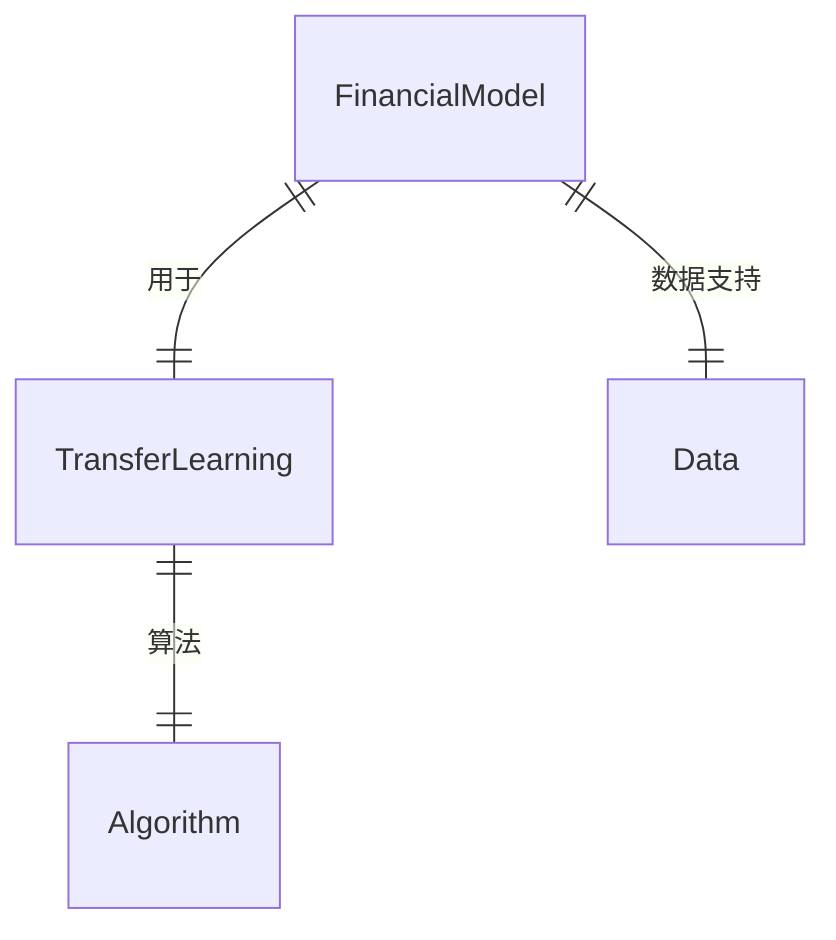

                 

### 第3章：迁移学习基本原理

#### 3.1.1 迁移学习基础

迁移学习是一种机器学习技术，其核心思想是将一个任务领域（源领域）中学习到的知识转移到另一个任务领域（目标领域）。在迁移学习中，我们通常希望利用源领域中的先验知识，以提高目标领域模型的性能。

**迁移学习定义**：
迁移学习可以定义为一种学习方法，它通过利用在某个任务上学习的知识来提高另一个不同但相关的任务的学习性能。简单来说，就是“用已知解决未知”。

**迁移学习类型**：

1. **同领域迁移学习**（Same-Domain Transfer Learning）：源领域和目标领域具有很高的相似性。
2. **跨领域迁移学习**（Cross-Domain Transfer Learning）：源领域和目标领域之间的差异较大。
3. **零样本迁移学习**（Zero-Shot Transfer Learning）：目标领域中的样本从未在训练阶段见过。
4. **多任务迁移学习**（Multi-Task Transfer Learning）：在一个模型中同时训练多个相关任务。

**迁移学习目标**：

- **提高模型适应性**：通过迁移学习，模型能够更好地适应新的任务。
- **降低数据需求**：在某些任务中，迁移学习可以减少对训练数据的需求。
- **降低成本**：通过复用模型和知识，减少训练新模型的时间和资源。

#### 3.1.2 主要方法

迁移学习的主要方法包括知识蒸馏（Knowledge Distillation）、多任务学习（Multi-Task Learning）和自适应方法（Adaptive Methods）等。

**知识蒸馏**：

知识蒸馏是一种迁移学习方法，它将一个复杂模型（教师模型）的知识传递给一个较小的模型（学生模型）。教师模型通常是一个预训练模型，学生模型则是一个经过微调的模型。

知识蒸馏的过程可以分为两个阶段：

1. **训练阶段**：教师模型在源领域上训练，学生模型在目标领域上训练。
2. **蒸馏阶段**：教师模型生成软标签，并将其传递给学生模型，学生模型根据这些软标签进行微调。

**多任务学习**：

多任务学习是一种同时训练多个相关任务的方法。这种方法的主要优点是可以利用不同任务之间的相关性来提高模型性能。

多任务学习可以分为以下几种类型：

1. **共享网络**（Shared Network）：所有任务共享同一部分网络。
2. **任务网络**（Task-Specific Networks）：每个任务都有自己的网络，但部分网络是共享的。
3. **无共享网络**（No-Shared Network）：每个任务都有自己的网络，没有任何共享部分。

**自适应方法**：

自适应方法是一种通过不断调整模型来适应新任务的方法。这种方法的主要目标是提高模型对目标域的适应能力。

自适应方法可以分为以下几种类型：

1. **线性自适应方法**：通过线性变换来调整模型。
2. **非线性自适应方法**：通过非线性变换来调整模型。
3. **元学习**（Meta-Learning）：通过学习如何学习来提高模型的自适应能力。

#### 3.1.3 迁移学习优缺点

**优点**：

- **提高模型适应性**：迁移学习可以使得模型更好地适应新的任务，从而提高模型的泛化能力。
- **降低数据需求**：在某些任务中，迁移学习可以减少对训练数据的需求，从而降低数据采集和标注的成本。
- **降低成本**：通过复用模型和知识，减少训练新模型的时间和资源。

**缺点**：

- **模型复杂度**：迁移学习往往需要复杂的模型和算法，这可能会导致模型的复杂度增加。
- **计算资源需求**：迁移学习需要大量的计算资源，特别是在进行跨领域迁移学习时。
- **模型理解困难**：由于迁移学习涉及多个领域，模型的解释和理解变得更加困难。

通过以上分析，我们可以看到迁移学习在提高模型适应性和降低成本方面具有显著的优势，但同时也面临着模型复杂度和计算资源需求等挑战。

### 3.1.4 迁移学习的应用

迁移学习在金融领域的应用十分广泛，以下是一些典型的应用场景：

- **信用评分**：通过将一个领域的信用评分模型迁移到另一个领域，可以快速建立新的信用评分系统，降低数据需求和开发成本。
- **市场预测**：迁移学习可以帮助预测股票、外汇等金融市场的价格波动，提高预测的准确性。
- **风险管理**：通过迁移学习，可以建立更加精准的风险评估模型，从而优化风险管理策略。

在实际应用中，迁移学习不仅提高了模型的适应性，还大大降低了数据需求和开发成本，从而为金融领域带来了巨大的价值。

#### 迁移学习算法流程

迁移学习的算法流程主要包括以下步骤：

1. **数据预处理**：对源领域和目标领域的数据进行清洗、归一化等预处理操作，确保数据的质量和一致性。
2. **模型训练**：在源领域上训练教师模型，并利用教师模型生成软标签。
3. **模型微调**：在目标领域上训练学生模型，并根据软标签进行微调。
4. **模型评估**：对迁移后的模型进行评估，以确定其在目标领域上的性能。

通过以上步骤，我们可以构建一个迁移学习模型，并将其应用于金融领域。在实际应用中，我们需要根据具体的任务需求进行调整和优化，以获得最佳的性能。

### 概念属性特征对比表格

| 概念       | 定义                                                         | 属性特征                               |
|------------|--------------------------------------------------------------|----------------------------------------|
| 迁移学习   | 将知识从一个领域转移到另一个领域的学习过程                     | 类型、目标、算法、优势、挑战           |
| 金融模型   | 用于金融领域，通过数据分析和预测金融产品行为的方法            | 类型、用途、建模方法、优势、挑战       |

通过上述对比表格，我们可以清晰地看到迁移学习和金融模型之间的区别和联系。这有助于我们更好地理解迁移学习在金融领域的应用。

#### ER实体关系图架构

上述ER实体关系图展示了金融模型与迁移学习之间的关系。金融模型使用迁移学习算法进行处理，同时依赖于数据支持。这种架构有助于我们理解迁移学习在金融领域中的实际应用。

### 迁移学习在金融领域的应用案例

为了更好地理解迁移学习在金融领域的应用，我们来看几个实际案例。

#### 案例一：信用评分模型的迁移

在某银行，信用评分模型需要针对不同地区和行业进行调整。通过迁移学习，银行将全国范围内的信用评分模型迁移到某一特定地区，从而快速建立适应该地区需求的信用评分系统。这种方法大大降低了数据采集和模型训练的成本。

#### 案例二：市场预测

某投资公司希望预测股票市场的价格波动。通过迁移学习，该公司将过去某个领域的市场预测模型迁移到当前市场，从而提高了预测的准确性。这种方法有助于投资公司制定更有效的投资策略。

#### 案例三：风险管理

某保险公司希望优化其风险管理策略。通过迁移学习，保险公司将过去某个领域的风险评估模型迁移到当前领域，从而建立了更精准的风险评估模型。这种方法有助于保险公司更好地管理风险。

通过这些案例，我们可以看到迁移学习在金融领域的广泛应用和巨大价值。

### 总结

在本章中，我们详细介绍了迁移学习的基本原理、主要方法、优缺点以及在金融领域的应用。通过对比表格和ER实体关系图，我们更好地理解了迁移学习和金融模型之间的关系。此外，通过实际案例，我们看到了迁移学习在金融领域的广泛应用。接下来，我们将进一步探讨迁移学习在金融领域中的具体应用和挑战。

