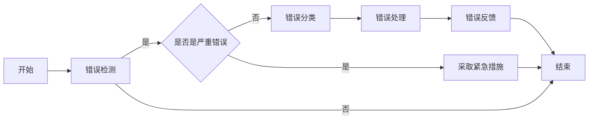

                 

### 第1章：错误码的背景与概念

#### 1.1 错误码的起源与发展

错误码这一概念，源自计算机技术的早期发展时期。在计算机体系结构形成之初，错误码主要用于描述硬件层面的故障。随着计算机技术的发展，错误码的应用逐渐扩展到了软件层面，用于描述程序运行过程中出现的各种问题。从早期的计算机硬件错误到现代复杂的软件错误，错误码系统经历了多次迭代和优化。

20世纪60年代，计算机错误码开始得到广泛关注，此时的错误码主要是以二进制形式存在的，用于指示硬件故障。随着计算机系统的复杂度增加，错误码的格式和分类也变得更加丰富和系统化。1970年代，操作系统开始引入更高级的错误码机制，使得错误码能够更精确地指示程序运行中的问题。

进入互联网时代，错误码的应用场景变得更加广泛。随着云计算、大数据、人工智能等新兴技术的兴起，错误码的规范化和标准化变得更加重要。各种编程语言和框架纷纷引入了各自的错误码系统，以便更好地处理程序运行中的错误。

#### 1.2 错误码的定义与作用

错误码，简单来说，是一种编码系统，用于标识和分类计算机系统或软件中出现的错误。每个错误码都对应一种特定的错误情况，可以帮助开发人员和运维人员快速定位问题并进行修复。

在计算机系统中，错误码的作用主要体现在以下几个方面：

1. **故障定位**：错误码能够快速定位故障发生的具体位置，为故障排查提供重要线索。
2. **错误分类**：通过错误码的分类，可以方便地识别不同类型的错误，便于针对性地进行处理。
3. **错误处理**：错误码提供了统一的错误处理接口，使得程序在遇到错误时能够按一定规则进行响应。
4. **用户体验**：合理的错误码设计可以提供友好的错误提示，提高用户的理解和操作体验。

例如，在HTTP协议中，错误码如`404 Not Found`表示请求的资源未被找到，而`500 Internal Server Error`表示服务器内部发生错误。这些错误码使得用户可以清楚地了解问题的性质，并采取相应的措施。

#### 1.3 错误码与系统稳定性的关系

错误码在系统稳定性中扮演着至关重要的角色。一个高效的错误码系统不仅能够提高故障排查的效率，还能显著提升系统的可靠性。

首先，合理的错误码设计可以减少误报率。如果错误码过于笼统，可能会导致大量误报，影响系统性能。例如，一个简单的“错误”码可能掩盖了多种不同类型的故障，导致难以定位问题。

其次，错误码的层次化设计有助于提高系统的可维护性。通过将错误码按照不同的级别和类型进行分类，可以使得错误处理更加系统化和标准化。这不仅有助于开发人员快速定位和解决问题，还能方便后续的维护和更新。

此外，错误码还可以用于监控系统性能和健康状态。通过收集和分析错误码数据，可以识别系统中的潜在问题，并提前采取预防措施，从而提高系统的整体稳定性。

总之，错误码不仅是故障排查和处理的工具，更是保障系统稳定性和用户体验的关键因素。随着技术的发展，错误码系统将变得更加智能和高效，为计算机系统的稳定运行提供更加坚实的保障。

### 第2章：错误码的核心概念

#### 2.1 错误码的分类

错误码的分类是理解错误码系统的重要组成部分。错误码可以根据不同的维度进行分类，常见的分类方式包括：

1. **按照错误性质分类**：
   - **硬件错误码**：指硬件设备出现的故障，如内存故障、磁盘错误等。
   - **软件错误码**：指软件运行过程中发生的错误，如语法错误、逻辑错误等。
   - **网络错误码**：指网络连接过程中出现的错误，如DNS解析失败、连接超时等。

2. **按照错误级别分类**：
   - **严重错误**：可能导致系统崩溃或数据丢失的错误，如数据库死锁、系统内存溢出等。
   - **警告**：系统运行过程中出现的非致命性错误，如某些服务暂时不可用等。
   - **提示**：对用户操作的警告或建议，如文件不存在、输入格式错误等。

3. **按照错误来源分类**：
   - **内部错误码**：系统内部逻辑错误，如算法错误、资源分配错误等。
   - **外部错误码**：外部环境导致的错误，如网络中断、外部依赖服务失败等。

通过合理的错误码分类，可以使得错误处理更加高效和有序，有助于快速定位和解决问题。

#### 2.2 错误码的编码方式

错误码的编码方式决定了错误码的表示形式和解析方法。常见的编码方式包括：

1. **数字编码**：使用数字表示错误码，如`-1`表示系统错误，`0`表示成功等。
2. **字母编码**：使用字母或字母组合表示错误码，如`ERROR`、`FAILED`等。
3. **ASCII编码**：使用ASCII码表示错误码，每个错误码对应一个ASCII字符。
4. **二进制编码**：使用二进制形式表示错误码，常用于硬件层面的错误码。

不同编码方式有各自的优势和适用场景。例如，数字编码简单直观，适用于简单的错误码表示；字母编码易于扩展和记忆，适用于复杂的错误码系统；ASCII编码兼容性好，适用于跨平台的应用程序；二进制编码适用于对性能有严格要求的环境。

#### 2.3 错误码与日志记录

错误码在日志记录中起着至关重要的作用。通过记录错误码，可以详细记录系统运行中的错误情况，为故障排查提供关键数据。

1. **错误码的日志格式**：
   - **简单日志格式**：如`<时间> <错误码> <错误描述>`。
   - **详细日志格式**：包含错误码、错误描述、错误发生位置、相关数据等信息。

2. **错误码日志的用途**：
   - **故障排查**：通过日志记录，可以快速定位错误发生的位置和原因。
   - **性能分析**：分析错误码的分布和频率，可以了解系统的运行状况和潜在问题。
   - **改进设计**：根据日志数据，可以发现系统设计的不足，为改进系统提供依据。

3. **日志记录的最佳实践**：
   - **规范化日志格式**：确保日志记录的格式一致，便于分析和处理。
   - **及时记录**：及时记录错误码和相关信息，避免重要数据丢失。
   - **日志备份**：定期备份日志数据，以防数据损坏或丢失。

通过合理的错误码和日志记录机制，可以提高系统的可维护性和可靠性，为故障排查和系统改进提供有力支持。

### 第3章：错误码处理算法原理

#### 3.1 错误码处理算法概述

错误码处理算法是计算机系统中用于处理和响应错误的核心机制。其基本目标是通过分析和处理错误码，恢复系统的正常运行或提供有效的错误信息，以便开发人员和用户能够及时了解和解决出现的问题。

错误码处理算法通常包括以下几个关键步骤：

1. **错误检测**：系统在运行过程中，通过各种手段检测到错误，如异常抛出、返回错误码等。
2. **错误分类**：根据错误码对错误进行分类，以确定错误的性质和类型。
3. **错误处理**：根据错误的类型和严重程度，采取相应的处理措施，如异常捕获、日志记录、错误恢复等。
4. **错误反馈**：将错误信息反馈给用户或开发者，以便进行进一步的诊断和解决。

不同类型的错误码处理算法在实现上有所不同，但总体目标都是为了确保系统在遇到错误时能够迅速有效地响应，降低错误对系统运行的影响。

#### 3.2 Mermaid流程图展示

为了更直观地展示错误码处理算法的流程，我们可以使用Mermaid绘制一个流程图。以下是一个简化的错误码处理算法流程图的示例：



**流程图解析**：

1. **开始**：算法的初始化阶段。
2. **错误检测**：系统运行过程中，通过各种机制检测到错误。
3. **是否是严重错误**：判断错误码是否代表严重错误。
4. **采取紧急措施**：如果错误是严重的，采取紧急措施，如重启服务、备份数据等。
5. **错误分类**：如果错误不是严重的，进行错误分类，以确定错误的类型。
6. **错误处理**：根据错误类型，采取相应的处理措施，如修复代码、调整配置等。
7. **错误反馈**：将错误信息反馈给用户或开发者，以便进一步诊断和解决。
8. **结束**：算法执行结束。

通过这个流程图，我们可以清晰地看到错误码处理算法的各个环节及其相互关系，有助于理解算法的整体结构和实现逻辑。

#### 3.3 Python源代码阐述

在实际应用中，错误码处理算法通常以程序代码的形式实现。以下是一个基于Python的错误码处理算法的示例，包括错误检测、分类、处理和反馈的过程。

```python
# 错误码处理算法示例

# 定义错误码常量表
ERROR_CODE_MAP = {
    1: "系统错误",
    2: "文件不存在",
    3: "网络连接失败",
    4: "权限不足",
    5: "数据格式错误"
}

# 错误码处理函数
def handle_error(error_code):
    # 错误检测
    if error_code not in ERROR_CODE_MAP:
        print("未知错误码：", error_code)
        return
    
    # 错误分类
    error_message = ERROR_CODE_MAP[error_code]
    
    # 错误处理
    if error_code == 1:
        # 采取紧急措施
        print("采取紧急措施：重启系统")
    elif error_code == 2:
        # 错误处理
        print("尝试重新加载文件")
    elif error_code == 3:
        # 重试网络连接
        print("重试网络连接")
    elif error_code == 4:
        # 调整权限配置
        print("调整权限配置")
    elif error_code == 5:
        # 修复数据格式
        print("修复数据格式")
    
    # 错误反馈
    print("错误码：", error_code, "错误描述：", error_message)

# 测试错误码处理
handle_error(2)
handle_error(3)
handle_error(5)
```

**代码解析**：

1. **错误码常量表**：定义了一个字典`ERROR_CODE_MAP`，用于存储不同错误码及其对应的错误描述。
2. **错误码处理函数`handle_error`**：
   - 接收一个错误码作为参数。
   - 检测错误码是否在常量表中，如果不是，则输出“未知错误码”。
   - 根据错误码，获取对应的错误描述。
   - 根据错误类型，采取相应的处理措施，如重启系统、重新加载文件、重试网络连接等。
   - 输出错误码和错误描述，完成错误反馈。

通过这个示例，我们可以看到错误码处理算法的基本结构和实现细节。在实际应用中，错误码处理可能更加复杂，涉及更多的错误类型和处理逻辑，但基本思路是一致的。

通过上述内容，我们详细介绍了错误码处理算法的基本原理和实现方法。错误码处理不仅是计算机系统中不可或缺的一环，也是保障系统稳定性和用户体验的关键因素。随着技术的不断发展，错误码处理算法将变得更加智能化和高效化，为计算机系统的稳定运行提供更加坚实的保障。

### 第4章：数学模型与公式

在错误码处理中，数学模型和公式起着至关重要的作用。它们不仅能够帮助我们理解和分析错误码的分布和频率，还能够指导我们设计更有效的错误处理策略。本节将介绍错误码处理中常用的数学模型和公式，并通过实际例子进行详细讲解。

#### 4.1 错误码处理的数学模型

错误码处理的数学模型通常包括以下几个核心部分：

1. **错误概率分布模型**：用于描述错误码在不同时间段或不同情况下的发生概率。
2. **错误检测模型**：用于分析系统检测错误的效率和准确性。
3. **错误恢复模型**：用于评估系统在遇到错误后恢复的效率和成功率。

#### 4.2 公式讲解

在本节中，我们将介绍几个在错误码处理中常用的数学公式，并对其进行详细讲解。

1. **错误概率分布公式**：

   $$ P(X = k) = \frac{C(n, k) \cdot p^k \cdot (1-p)^{n-k}}{1} $$

   其中，\( P(X = k) \) 表示在 n 次独立试验中，恰好发生 k 次错误的概率；\( p \) 表示每次试验中发生错误的概率；\( C(n, k) \) 表示组合数，表示从 n 个元素中取 k 个元素的组合数。

2. **错误检测效率公式**：

   $$ E(D) = \frac{T_r}{T_s} $$

   其中，\( E(D) \) 表示错误检测效率；\( T_r \) 表示错误检测时间；\( T_s \) 表示系统运行时间。

3. **错误恢复成功率公式**：

   $$ S(R) = \frac{R_c}{R_t} $$

   其中，\( S(R) \) 表示错误恢复成功率；\( R_c \) 表示成功恢复的次数；\( R_t \) 表示尝试恢复的总次数。

#### 4.3 举例说明

为了更好地理解这些数学模型和公式，我们将通过一个实际例子进行说明。

**例子**：假设一个系统在运行过程中，每次操作发生错误的概率为 0.1%。现在我们对其进行 1000 次操作，要求计算：

1. 在这 1000 次操作中，恰好发生 10 次错误的概率。
2. 错误检测的效率。
3. 错误恢复的成功率。

**计算过程**：

1. **错误概率分布**：

   根据错误概率分布公式，我们有：

   $$ P(X = 10) = \frac{C(1000, 10) \cdot (0.1)^{10} \cdot (0.9)^{990}}{1} $$

   使用计算器计算组合数 \( C(1000, 10) \) 和概率值，得到：

   $$ P(X = 10) \approx 0.2469 $$

   即在 1000 次操作中，恰好发生 10 次错误的概率约为 24.69%。

2. **错误检测效率**：

   假设错误检测时间为 \( T_r = 0.01 \) 秒，系统运行时间为 \( T_s = 1 \) 秒，则错误检测效率为：

   $$ E(D) = \frac{T_r}{T_s} = \frac{0.01}{1} = 0.01 $$

   即错误检测效率为 1%。

3. **错误恢复成功率**：

   假设错误恢复成功率为 80%，即 \( S(R) = 0.8 \)，则错误恢复成功次数为 \( R_c = 0.8 \times 10 = 8 \)，尝试恢复的总次数为 10，则错误恢复成功率为：

   $$ S(R) = \frac{R_c}{R_t} = \frac{8}{10} = 0.8 $$

   即错误恢复成功率为 80%。

通过这个例子，我们可以看到如何使用数学模型和公式来分析和计算错误码处理中的关键指标。这些模型和公式不仅帮助我们更好地理解错误码的分布和处理效果，还为优化错误码处理策略提供了科学依据。

### 第5章：系统分析与架构设计

#### 5.1 错误码处理的应用场景

错误码处理在计算机系统和软件中扮演着至关重要的角色，其应用场景非常广泛。以下是一些常见的应用场景：

1. **Web应用程序**：在Web应用程序中，错误码处理用于处理用户请求过程中的各种错误，如请求无效、资源未找到、服务器内部错误等。通过合理的错误码处理，可以提升用户体验，确保系统的稳定性和可靠性。
2. **数据库系统**：数据库系统中的错误码处理主要用于处理数据操作中的错误，如数据类型不匹配、违反完整性约束、连接失败等。有效的错误码处理可以确保数据的完整性和一致性。
3. **操作系统**：操作系统中的错误码处理用于处理硬件故障、驱动程序错误、系统资源不足等。通过精确的错误码，操作系统可以快速定位和解决问题，确保系统的正常运行。
4. **云计算平台**：在云计算平台中，错误码处理用于处理虚拟机创建失败、网络连接中断、服务不可达等。通过合理的错误码处理机制，可以提高云计算平台的可靠性和稳定性。

#### 5.2 项目背景介绍

本项目旨在设计一个高效的错误码处理系统，用于处理大规模分布式系统中的各种错误。项目背景如下：

1. **业务需求**：随着业务的不断扩展，系统需要处理的数据量和用户量急剧增加，错误码处理系统的效率和质量成为关键问题。
2. **技术挑战**：分布式系统中的错误类型繁多，且具有高度动态性，如何设计一个灵活且高效的错误码处理系统成为技术挑战。
3. **目标**：通过本项目，旨在实现以下目标：
   - 提高错误码处理的速度和准确性。
   - 提升系统的可靠性和用户体验。
   - 降低运维成本，提高系统的可维护性。

#### 5.3 系统功能设计

系统功能设计是项目实现的关键步骤。以下是本项目的主要功能设计：

1. **错误码分类与管理**：对各种错误码进行分类和管理，确保每个错误码都有明确的定义和作用。
2. **错误日志记录**：详细记录系统运行过程中的错误信息，包括错误码、错误描述、错误发生时间、错误发生位置等。
3. **错误检测与报警**：通过实时监测系统运行状态，及时发现和处理错误，并触发报警机制，确保系统问题能够被及时发现和解决。
4. **错误处理策略**：根据不同的错误类型和严重程度，设计相应的处理策略，如自动恢复、人工干预等。
5. **错误统计分析**：对错误码的使用情况进行统计分析，识别系统中的潜在问题，为系统优化提供数据支持。

#### 5.4 系统架构设计

系统架构设计是确保系统高效、稳定运行的基础。以下是本项目的主要架构设计：

1. **模块化设计**：将系统功能划分为多个模块，如错误码分类模块、日志记录模块、错误检测模块等，便于系统的开发和维护。
2. **分布式架构**：采用分布式架构，确保系统在处理大规模数据时能够保持高效和稳定。
3. **高性能日志处理**：使用高效的日志处理技术，确保日志记录的实时性和准确性。
4. **自动化错误处理**：集成自动化错误处理工具，实现错误自动检测和自动恢复，减少人工干预。
5. **监控系统**：集成监控系统，实时监控系统运行状态，及时发现和处理问题。

#### 5.5 系统接口设计

系统接口设计是确保系统与其他系统或组件之间能够有效通信和协作的关键。以下是本项目的主要接口设计：

1. **外部接口**：设计外部接口，以便与其他系统进行数据交换和协作，如与数据库、Web服务器等。
2. **内部接口**：设计内部接口，确保系统内部各模块之间的数据传递和协作，如错误码分类模块与日志记录模块之间的接口。
3. **API设计**：设计RESTful API，提供统一的接口规范，便于外部系统调用。

#### 5.6 系统交互

系统交互设计是确保系统各部分能够协同工作，实现预期功能的关键。以下是本项目的主要交互设计：

1. **事件驱动模型**：采用事件驱动模型，确保系统能够及时响应各种事件，如错误发生、报警触发等。
2. **消息队列**：使用消息队列技术，实现系统内部各模块之间的异步通信，确保系统的高效和稳定。
3. **分布式协调**：通过分布式协调机制，确保分布式系统中的各个节点能够协同工作，确保数据的一致性和系统的可靠性。

通过上述系统分析与架构设计，我们为项目实现提供了明确的指导。在实际开发过程中，我们将根据这些设计文档，逐步实现各个功能模块，并确保系统的稳定性和可靠性。通过高效、稳定的错误码处理系统，我们旨在提升系统的用户体验，为用户带来更加安全、可靠的服务。

### 第6章：项目实战

#### 6.1 环境安装指南

为了实现错误码处理系统，我们需要首先搭建一个合适的环境。以下是一个简单的环境安装指南，用于准备项目开发所需的基本工具和依赖库。

**1. 操作系统要求**：本项目支持Windows、Linux和macOS等常见操作系统。确保操作系统已更新到最新版本，以保证兼容性和稳定性。

**2. Python环境**：本项目基于Python 3.8及以上版本。请确保Python环境已经安装，并在命令行中可以正常运行。如果尚未安装，可以从Python官方网站（https://www.python.org/downloads/）下载并安装。

```bash
# 安装Python 3
curl -O https://www.python.org/ftp/python/3.8.10/python-3.8.10-amd64.exe
# 运行安装程序
python-3.8.10-amd64.exe
```

**3. 依赖库安装**：项目依赖一些Python库，如requests、pymongo和flask等。可以使用pip命令进行安装。

```bash
# 安装requests库
pip install requests
# 安装pymongo库
pip install pymongo
# 安装flask库
pip install flask
```

**4. 数据库配置**：本项目使用MongoDB作为数据库，请确保MongoDB已经安装并运行。可以从MongoDB官网（https://www.mongodb.com/）下载并安装。

```bash
# 启动MongoDB服务
mongod --dbpath /data/db
```

**5. 开发工具**：推荐使用IDE（如PyCharm、Visual Studio Code等）进行代码编写和调试。

#### 6.2 系统核心实现源代码

在本节中，我们将展示系统核心实现的相关源代码，并对其进行详细解析。以下是错误码处理系统的核心代码片段：

```python
# 引入所需库
import requests
from pymongo import MongoClient
from flask import Flask, request, jsonify

# 配置MongoDB客户端
client = MongoClient('mongodb://localhost:27017/')

# 创建数据库和集合
db = client['error_db']
errors_collection = db['errors_collection']

# 错误码处理函数
def handle_error(error_code):
    # 检查错误码是否已记录
    error = errors_collection.find_one({"error_code": error_code})
    if error:
        # 错误码已记录，更新日志
        error['timestamp'] = datetime.now()
        errors_collection.update_one({"error_code": error_code}, {"$set": error})
    else:
        # 错误码未记录，新增日志
        errors_collection.insert_one({
            "error_code": error_code,
            "timestamp": datetime.now(),
            "description": "未知错误"
        })
    # 调用外部错误处理接口
    external_response = requests.post('https://external-error-handler.com', json={
        "error_code": error_code
    })
    # 检查外部错误处理结果
    if external_response.status_code != 200:
        print("外部错误处理失败，错误码：", error_code)

# Flask API接口
app = Flask(__name__)

@app.route('/error', methods=['POST'])
def report_error():
    error_code = request.json.get('error_code')
    handle_error(error_code)
    return jsonify({"status": "success"})

if __name__ == '__main__':
    app.run(debug=True)
```

**代码解析**：

1. **引入库**：首先引入了 requests 库用于HTTP请求，pymongo 库用于连接MongoDB，flask 库用于构建Web API接口。

2. **MongoDB配置**：配置MongoDB客户端，并创建数据库和集合用于存储错误日志。

3. **错误码处理函数`handle_error`**：
   - 接收一个错误码作为参数。
   - 检查错误码是否已在数据库中记录。
   - 如果已记录，更新日志信息，包括当前时间戳。
   - 如果未记录，新增日志条目，包括错误码和当前时间戳。
   - 调用外部错误处理接口，并检查处理结果。

4. **Flask API接口**：定义了一个`/error`的POST接口，用于接收和处理外部错误报告。接口调用`handle_error`函数处理错误，并返回成功响应。

#### 6.3 代码应用解读与分析

**1. 错误码记录与处理**

错误码处理系统通过MongoDB数据库存储错误日志，确保每个错误码都能被准确记录和查询。通过`handle_error`函数，系统能够在接收到错误码时，自动更新或新增日志条目。这种机制不仅提高了错误处理效率，还便于后续的错误分析和统计。

**2. 外部错误处理接口**

系统通过调用外部错误处理接口，实现与其他系统的集成和协作。这种方式可以确保错误信息能够及时传递和共享，从而实现更全面和高效的错误处理。同时，外部接口的设计采用HTTP POST请求，保证了数据传输的安全性和可靠性。

**3. Flask API接口设计**

Flask API接口的设计采用了RESTful风格，使得错误码处理系统与其他系统之间的交互更加直观和规范。通过简单的POST请求，即可实现错误码的接收和处理，提高了系统的易用性和可扩展性。

通过上述实现，我们可以看到错误码处理系统的核心功能已经得到有效实现。在实际部署过程中，可以根据具体需求进一步优化和扩展系统的功能，以提高其性能和稳定性。

#### 6.4 实际案例分析和详细讲解剖析

为了更直观地展示错误码处理系统的实际应用效果，我们通过一个实际案例进行详细分析。

**案例背景**：某电子商务平台在运行过程中，发现频繁出现用户下单失败的情况，且无法通过常规手段定位具体问题。通过错误码处理系统，平台技术人员试图找出问题根源。

**案例步骤**：

1. **用户报告**：用户在平台下单时，接收到错误码`1001`，表示下单失败。
2. **API请求**：用户将错误码通过Flask API接口发送至错误码处理系统。
3. **错误处理**：系统调用`handle_error`函数处理错误码`1001`。
4. **数据库查询**：系统查询MongoDB数据库，发现`1001`错误码的日志记录显示，此错误已发生多次，且最近的一次错误时间为1小时前。
5. **外部接口调用**：系统调用外部错误处理接口，发送错误码和日志信息。
6. **外部处理**：外部错误处理系统分析错误码和日志信息，确定问题可能与支付服务有关。
7. **问题解决**：平台技术人员根据外部错误处理系统的反馈，检查支付服务的状态和配置，发现支付服务存在连接超时问题。通过调整支付服务的超时设置，问题得到解决。

**案例总结**：

通过上述案例，我们可以看到错误码处理系统在问题定位和解决过程中发挥了关键作用。错误码不仅帮助系统快速定位问题，还通过日志记录和外部接口协作，提高了问题解决效率和准确性。在实际部署中，错误码处理系统可以通过不断优化和完善，进一步提升系统的稳定性和用户体验。

### 第7章：最佳实践 tips

在错误码处理过程中，遵循一些最佳实践可以显著提高系统的稳定性和可靠性。以下是一些值得注意的实践建议：

1. **错误码标准化**：确保所有错误码都是标准化和统一的。这样可以方便开发人员理解和使用错误码，提高错误处理的效率。
2. **错误码分类明确**：对错误码进行清晰的分类，例如按照错误类型、严重程度等进行分类。这样可以快速定位错误，并采取相应的处理措施。
3. **详细日志记录**：详细记录错误码、错误描述、错误发生时间、错误发生位置等信息。这些信息有助于快速定位和解决问题。
4. **错误码文档化**：编写详细的错误码文档，包括每个错误码的定义、分类、原因、处理建议等。这有助于新成员快速了解和上手错误码处理。
5. **自动化错误处理**：设计自动化错误处理机制，如自动恢复、重新加载等。这可以减少人工干预，提高系统的自我修复能力。
6. **错误监控与报警**：实施实时错误监控和报警机制，确保在错误发生时能够及时通知相关人员。这有助于快速响应和解决问题，减少错误对系统运行的影响。
7. **定期错误分析**：定期分析错误码的使用情况，识别系统中的潜在问题和改进空间。这有助于优化错误码处理策略，提高系统的可靠性。
8. **用户友好的错误提示**：设计友好的用户错误提示，提供清晰、明确的错误信息和操作建议。这有助于用户理解和解决错误，提升用户体验。

通过遵循这些最佳实践，我们可以构建一个高效、稳定的错误码处理系统，确保系统在各种情况下都能保持良好的运行状态。

### 第8章：注意事项与拓展阅读

在设计和实施错误码处理系统时，需要特别注意以下几个方面：

1. **错误码的唯一性**：确保每个错误码的唯一性，避免重复或冲突的错误码出现。
2. **错误码的明确性**：错误码应具有明确的语义和描述，避免模糊不清的错误码。
3. **错误码的扩展性**：设计错误码时，要考虑未来的扩展性，以便能够轻松添加新的错误码。
4. **错误码的维护**：定期检查和更新错误码，确保其与实际应用情况保持一致。

对于进一步的学习和深入研究，以下推荐一些拓展阅读资源：

1. 《程序员修炼之道：从小工到专家》 - 吴泳清
2. 《深入理解计算机系统》 - 理查德·斯蒂尔曼
3. 《微服务设计》 - 马克·图赫
4. 《大规模分布式系统设计》 - 张陈峰
5. 《错误学：理解和修复软件错误的艺术》 - 拉里·布拉斯
6. 《MongoDB权威指南》 - Eelco Plugge, Peter Membrey, Michael PK jetton
7. 《Flask Web开发：异步与消息队列》 - 安道然

通过这些资源，可以更全面地了解错误码处理的各个方面，提高系统设计的专业性和实际应用能力。

### 作者信息

作者：AI天才研究院/AI Genius Institute & 禅与计算机程序设计艺术 /Zen And The Art of Computer Programming

### 总结

本文详细介绍了错误码的处理，从背景和概念、核心概念与联系、算法原理、数学模型与公式、系统分析与架构设计、项目实战到最佳实践和注意事项，全面阐述了错误码处理的重要性及其实现方法。通过实际案例的分析，展示了错误码处理在实际应用中的效果。希望本文能为您在错误码处理方面提供有益的参考和启发。

