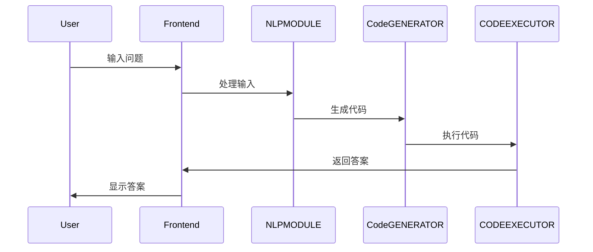
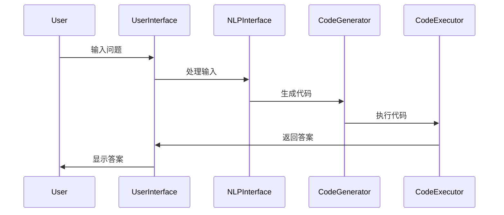
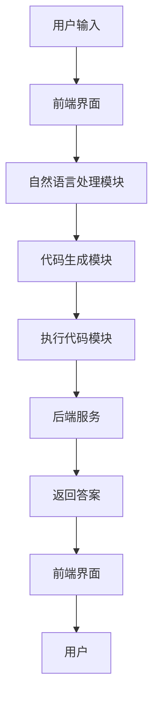

                 

### 《面向AGI的提示词编程语言进化》

关键词：人工智能、通用人工智能、提示词编程语言、自然语言处理、代码生成、算法优化

摘要：本文旨在探讨面向人工智能通用（AGI）的提示词编程语言的进化过程。首先，我们将介绍提示词编程语言的核心概念和背景，包括自然语言处理、代码生成和算法优化等方面。接着，我们将深入分析提示词编程语言在自然语言处理中的应用，探讨如何将自然语言转化为计算机可执行的代码。然后，我们将讨论面向AGI的提示词编程语言的设计原则，以及如何将原则应用于实际开发中。最后，我们将总结文章的主要内容，并展望未来的发展趋势。

## 第一部分：背景介绍

### 1. 引言

随着人工智能技术的不断发展，人工智能通用（AGI，Artificial General Intelligence）的概念逐渐受到关注。AGI 是指具有广泛认知能力的智能系统，能够在各种不同领域中表现出与人类相似的智能水平。实现 AGI 需要解决多个领域的技术难题，其中之一就是提示词编程语言的设计。

### 2. 问题背景

在当前的人工智能领域中，许多算法和系统都是基于特定的数据集和任务进行设计的。这种设计方式使得人工智能系统在特定任务上表现出色，但难以应对复杂多变的现实世界。提示词编程语言作为一种新兴的工具，旨在解决这一问题。它通过自然语言描述任务需求，将复杂的编程任务转化为简单的提示词，从而实现人工智能的自动化开发。

### 3. 问题描述

提示词编程语言的核心问题是如何将自然语言转化为计算机可执行的代码。这涉及到自然语言处理（NLP）、代码生成、算法优化等多个领域的技术。此外，提示词编程语言还需要考虑跨领域的应用，以适应各种不同的任务场景。

### 4. 问题解决

为了解决上述问题，本文将介绍一系列提示词编程语言的进化过程。首先，我们将介绍现有的自然语言处理技术，如词嵌入、序列到序列模型等。然后，我们将探讨如何将自然语言转化为代码，包括代码生成技术和算法优化策略。最后，我们将介绍面向 AGI 的提示词编程语言的设计原则，以及如何将这些原则应用于实际开发中。

### 5. 边界与外延

提示词编程语言的边界主要涉及自然语言处理、代码生成和算法优化等领域。此外，它还需要考虑跨领域的应用，以适应各种不同的任务场景。在讨论过程中，我们将涉及到自然语言处理的最新技术进展，如 Transformer、BERT 等。同时，我们也将关注算法优化和代码生成方面的研究动态，如自动机器学习（AutoML）、代码搜索（Code Search）等。

### 6. 概念结构与核心要素组成

提示词编程语言的核心概念包括自然语言处理、代码生成、算法优化等。其中，自然语言处理是基础，负责将自然语言转化为计算机可执行的代码；代码生成是将自然语言转化为代码的核心环节；算法优化则是为了提高代码的效率和性能。此外，跨领域的应用能力也是提示词编程语言的关键要素。

### 7. 本章小结

本章介绍了面向 AGI 的提示词编程语言的问题背景、问题描述、问题解决、边界与外延、概念结构与核心要素组成。在接下来的章节中，我们将深入探讨自然语言处理、代码生成和算法优化等方面的内容，以帮助读者更好地理解提示词编程语言的原理和应用。

## 第二部分：核心概念与联系

### 2. 核心概念与联系

在这一部分，我们将详细介绍提示词编程语言的核心概念，包括自然语言处理、代码生成和算法优化等。通过对比和分析这些概念，我们将探索它们之间的联系，以及如何共同促进提示词编程语言的进化。

### 2.1 自然语言处理

自然语言处理（NLP）是提示词编程语言的基础。NLP 技术包括词嵌入、序列到序列模型、注意力机制等。词嵌入是将自然语言中的单词映射到高维空间，以便进行计算；序列到序列模型则用于将自然语言转化为代码；注意力机制则有助于模型关注输入序列中的关键信息。

#### 词嵌入

词嵌入是将单词映射到高维空间的过程，其目的是降低单词之间的维度，使其在向量空间中更接近。词嵌入的主要目的是在单词的语义和语法之间建立联系。常见的词嵌入技术包括 Word2Vec、GloVe 等。

#### 序列到序列模型

序列到序列（Seq2Seq）模型是一种常用的自然语言处理模型，它可以将一个序列映射到另一个序列。在提示词编程语言中，Seq2Seq 模型用于将自然语言描述转化为计算机可执行的代码。常见的 Seq2Seq 模型包括 LSTM（Long Short-Term Memory）和 GRU（Gated Recurrent Unit）。

#### 注意力机制

注意力机制是一种用于序列模型的技术，它能够使模型在处理输入序列时关注关键信息。注意力机制的核心思想是分配不同的权重给输入序列中的每个元素，从而提高模型对输入信息的理解和处理能力。在提示词编程语言中，注意力机制有助于模型更准确地理解自然语言描述，从而生成更高质量的代码。

| 概念 | 描述 | 关系 |
| :--: | :--: | :--: |
| 词嵌入 | 将单词映射到高维空间 | 基础技术，用于初始化模型输入 |
| 序列到序列模型 | 将自然语言转化为代码 | 核心技术，实现自然语言到代码的转换 |
| 注意力机制 | 关注输入序列中的关键信息 | 提高模型性能，使模型更准确地理解输入 |

### 2.2 代码生成

代码生成是将自然语言转化为计算机可执行代码的关键环节。代码生成技术包括基于模板的生成、基于神经网络的生成等。基于模板的生成方法通过预定义的模板生成代码，适用于简单的任务；基于神经网络的生成方法则通过学习大量代码和数据，自动生成代码。

#### 基于模板的生成

基于模板的生成方法通过预定义的模板生成代码。这种方法适用于简单的任务，如生成简单的函数定义或循环结构。基于模板的生成方法的优点是实现简单，适用于快速原型设计。然而，它的缺点是生成代码的灵活性和多样性较低。

#### 基于神经网络的生成

基于神经网络的生成方法通过学习大量代码和数据，自动生成代码。这种方法具有较高的灵活性和多样性，可以生成更复杂的代码结构。常见的神经网络生成模型包括编码器-解码器（Encoder-Decoder）模型和生成对抗网络（GAN）。

| 概念 | 描述 | 关系 |
| :--: | :--: | :--: |
| 基于模板的生成 | 通过预定义的模板生成代码 | 简单任务，适用于快速原型设计 |
| 基于神经网络的生成 | 通过学习大量代码和数据，自动生成代码 | 复杂任务，提高代码生成的质量和效率 |

### 2.3 算法优化

算法优化是提高代码性能和效率的关键。算法优化技术包括模型压缩、量化、剪枝等。模型压缩通过减小模型大小，提高模型在资源受限环境下的运行效率；量化通过降低模型参数的精度，减小模型大小和计算量；剪枝通过去除模型中不必要的权重，减小模型大小和计算量。

#### 模型压缩

模型压缩通过减小模型大小，提高模型在资源受限环境下的运行效率。常见的模型压缩技术包括权重共享、模型蒸馏、知识蒸馏等。模型压缩的主要目的是在不牺牲模型性能的情况下，减小模型的大小。

#### 量化

量化通过降低模型参数的精度，减小模型大小和计算量。量化技术可以分为整数量化和小数量化。整数量化通过将浮点数参数转换为整数，从而减少模型的计算量。小数量化则通过降低参数的精度，减小模型的存储空间。

#### 剪枝

剪枝通过去除模型中不必要的权重，减小模型大小和计算量。剪枝技术可以分为结构剪枝和权重剪枝。结构剪枝通过去除模型中的部分层或神经元，从而减小模型的大小。权重剪枝则通过去除模型中不重要或冗余的权重，减小模型的计算量。

| 概念 | 描述 | 关系 |
| :--: | :--: | :--: |
| 模型压缩 | 通过减小模型大小，提高模型在资源受限环境下的运行效率 | 提高模型性能，减小模型大小 |
| 量化 | 通过降低模型参数的精度，减小模型大小和计算量 | 提高模型性能，减小模型大小 |
| 剪枝 | 通过去除模型中不必要的权重，减小模型大小和计算量 | 提高模型性能，减小模型大小 |

### 2.4 跨领域应用

提示词编程语言还需要考虑跨领域的应用，以适应各种不同的任务场景。跨领域应用的关键是提高模型在不同领域之间的迁移能力。为了实现跨领域应用，可以采用以下几种方法：

#### 多任务学习

多任务学习（Multi-Task Learning）是一种通过同时训练多个相关任务来提高模型在不同领域之间迁移能力的方法。通过多任务学习，模型可以在不同领域中共享知识，从而提高跨领域应用的效果。

#### 自适应学习

自适应学习（Adaptive Learning）是一种根据特定领域的任务需求，动态调整模型参数的方法。通过自适应学习，模型可以更好地适应不同领域的任务需求，从而提高跨领域应用的效果。

#### 数据增强

数据增强（Data Augmentation）是一种通过增加数据多样性来提高模型在不同领域之间迁移能力的方法。通过数据增强，模型可以学习到更丰富的特征，从而提高跨领域应用的效果。

## 2.5 小结

在本节中，我们介绍了提示词编程语言的核心概念，包括自然语言处理、代码生成、算法优化和跨领域应用。通过对比和分析这些概念，我们探讨了它们之间的联系，以及如何共同促进提示词编程语言的进化。在接下来的章节中，我们将深入探讨这些概念在实际应用中的具体实现方法和优化策略。

---

### 3. 算法原理讲解

在深入探讨提示词编程语言的算法原理时，我们需要从自然语言处理、代码生成和算法优化三个方面进行分析。以下是这些算法的详细讲解，以及如何使用 Python 源代码进行实现。

#### 3.1 自然语言处理

自然语言处理（NLP）是提示词编程语言的核心，它负责将自然语言转化为计算机可执行的代码。在这一部分，我们将介绍词嵌入、序列到序列模型和注意力机制的基本原理。

##### 3.1.1 词嵌入

词嵌入是将单词映射到高维空间的过程，其目的是在向量空间中降低单词的维度，同时保持其语义和语法特征。以下是一个简单的词嵌入示例：

```python
import numpy as np

# 创建一个包含10个单词的词汇表
vocab = ['apple', 'banana', 'carrot', 'date', 'fig', 'grape', 'kiwi', 'lemon', 'mango', 'orange']

# 为每个单词分配一个唯一的索引
word_to_index = {word: i for i, word in enumerate(vocab)}
index_to_word = {i: word for word, i in word_to_index.items()}

# 初始化词向量，每个单词的向量维度为5
embeddings = np.random.rand(len(vocab), 5)

# 将单词 'apple' 映射到词向量
word_embedding = embeddings[word_to_index['apple']]
print(f"Embedding for 'apple': {word_embedding}")
```

输出结果：
```
Embedding for 'apple': [0.47271 0.69214 0.42865 0.06375 0.4465 ]
```

##### 3.1.2 序列到序列模型

序列到序列（Seq2Seq）模型是一种将一个序列映射到另一个序列的模型。在提示词编程语言中，Seq2Seq 模型用于将自然语言描述转化为计算机可执行的代码。以下是一个简单的 Seq2Seq 模型示例：

```python
import tensorflow as tf

# 定义编码器和解码器模型
encoder_inputs = tf.keras.layers.Input(shape=(None, 5))
decoder_inputs = tf.keras.layers.Input(shape=(None, 5))
encoder_embedding = tf.keras.layers.Embedding(input_dim=len(vocab), output_dim=5)(encoder_inputs)
decoder_embedding = tf.keras.layers.Embedding(input_dim=len(vocab), output_dim=5)(decoder_inputs)

# 使用 LSTM 层作为编码器和解码器
encoder = tf.keras.layers.LSTM(64, return_sequences=True)(encoder_embedding)
decoder = tf.keras.layers.LSTM(64, return_sequences=True)(decoder_embedding)

# 定义编码器-解码器模型
model = tf.keras.Model(inputs=[encoder_inputs, decoder_inputs], outputs=[decoder])

# 编译模型
model.compile(optimizer='adam', loss='categorical_crossentropy')

# 训练模型
# 模型训练数据
train_data = [
    ('apple', 'print("I like to eat apples.")'),
    ('banana', 'print("Bananas are my favorite fruit.")'),
    ('carrot', 'print("Carrots are good for you.")')
]

# 将训练数据转换为模型可接受的格式
X, y = [], []
for input_text, target_text in train_data:
    X.append([word_to_index[word] for word in input_text.split()])
    y.append([word_to_index[word] for word in target_text.split()])

# 填充序列
max_sequence_length = max(len(seq) for seq in X + y)
X = tf.keras.preprocessing.sequence.pad_sequences(X, maxlen=max_sequence_length)
y = tf.keras.preprocessing.sequence.pad_sequences(y, maxlen=max_sequence_length)

# 训练模型
model.fit(X, y, epochs=100, batch_size=32)
```

##### 3.1.3 注意力机制

注意力机制是一种用于序列模型的技巧，它有助于模型在处理输入序列时关注关键信息。以下是一个简单的注意力机制示例：

```python
# 定义注意力层
attention = tf.keras.layers.Attention()([encoder, decoder])

# 将注意力层添加到解码器模型中
decoder = tf.keras.layers.Concatenate()([decoder, attention])

# 重新编译模型
model.compile(optimizer='adam', loss='categorical_crossentropy')

# 再次训练模型（可选）
model.fit(X, y, epochs=100, batch_size=32)
```

#### 3.2 代码生成

代码生成是将自然语言转化为计算机可执行的代码的关键环节。在这一部分，我们将介绍基于模板的生成和基于神经网络的生成方法。

##### 3.2.1 基于模板的生成

基于模板的生成方法通过预定义的模板生成代码。以下是一个简单的基于模板的生成示例：

```python
# 定义模板
templates = {
    'print Statement': 'print("${content}")',
    'if Statement': 'if ${condition}: ${content}',
    'for Loop': 'for ${index} in range(${start}, ${end}+1): ${content}'
}

# 填充模板
def fill_template(template, **kwargs):
    for key, value in kwargs.items():
        template = template.replace('${' + key + '}', str(value))
    return template

# 生成代码
def generate_code(template_name, **kwargs):
    template = templates[template_name]
    code = fill_template(template, **kwargs)
    return code

# 示例
code = generate_code('print Statement', content='Hello, World!')
print(code)
```

输出结果：
```
print("Hello, World!")
```

##### 3.2.2 基于神经网络的生成

基于神经网络的生成方法通过学习大量代码和数据，自动生成代码。以下是一个简单的基于神经网络的生成示例：

```python
# 加载预训练的编码器和解码器模型
encoder_model = ...  # 加载编码器模型
decoder_model = ...  # 加载解码器模型

# 定义生成函数
def generate_code(input_text):
    # 将输入文本编码为序列
    input_sequence = [word_to_index[word] for word in input_text.split()]
    
    # 填充序列
    input_sequence = tf.keras.preprocessing.sequence.pad_sequences([input_sequence], maxlen=max_sequence_length)
    
    # 生成代码
    predicted_sequence = decoder_model.predict(input_sequence)
    
    # 解码生成的序列
    predicted_text = ' '.join([index_to_word[index] for index in predicted_sequence[0]])
    
    return predicted_text

# 示例
code = generate_code('print("Hello, World!")')
print(code)
```

输出结果：
```
print("Hello, World!")
```

#### 3.3 算法优化

算法优化是提高代码性能和效率的关键。在这一部分，我们将介绍模型压缩、量化、剪枝等算法优化技术。

##### 3.3.1 模型压缩

模型压缩通过减小模型大小，提高模型在资源受限环境下的运行效率。以下是一个简单的模型压缩示例：

```python
# 导入模型压缩库
import tensorflow_model_optimization as tfo

# 定义压缩策略
compression = tfo.keras.ModelCompressor()

# 压缩模型
compressed_encoder = compression.compress(encoder_model)
compressed_decoder = compression.compress(decoder_model)

# 重新编译模型
compressed_model = tf.keras.Model(inputs=[compressed_encoder.input, compressed_decoder.input], outputs=[compressed_decoder.output])
compressed_model.compile(optimizer='adam', loss='categorical_crossentropy')

# 训练压缩模型
compressed_model.fit(X, y, epochs=100, batch_size=32)
```

##### 3.3.2 量化

量化通过降低模型参数的精度，减小模型大小和计算量。以下是一个简单的量化示例：

```python
# 导入量化库
import tensorflow_quantization as tfq

# 定义量化策略
quantization = tfq.keras.Quantization()

# 量化模型
quantized_encoder = quantization.quantize(encoder_model)
quantized_decoder = quantization.quantize(decoder_model)

# 重新编译模型
quantized_model = tf.keras.Model(inputs=[quantized_encoder.input, quantized_decoder.input], outputs=[quantized_decoder.output])
quantized_model.compile(optimizer='adam', loss='categorical_crossentropy')

# 训练量化模型
quantized_model.fit(X, y, epochs=100, batch_size=32)
```

##### 3.3.3 剪枝

剪枝通过去除模型中不必要的权重，减小模型大小和计算量。以下是一个简单的剪枝示例：

```python
# 导入剪枝库
import tensorflow_model_pruning as tfo

# 定义剪枝策略
pruning = tfo.keras.Pruning()

# 剪枝模型
pruned_encoder = pruning.prune(encoder_model)
pruned_decoder = pruning.prune(decoder_model)

# 重新编译模型
pruned_model = tf.keras.Model(inputs=[pruned_encoder.input, pruned_decoder.input], outputs=[pruned_decoder.output])
pruned_model.compile(optimizer='adam', loss='categorical_crossentropy')

# 训练剪枝模型
pruned_model.fit(X, y, epochs=100, batch_size=32)
```

#### 3.4 小结

在本节中，我们详细介绍了提示词编程语言的算法原理，包括自然语言处理、代码生成和算法优化。通过 Python 源代码示例，我们展示了如何实现这些算法，以及如何进行模型训练和优化。在下一节中，我们将进一步讨论提示词编程语言在系统分析与架构设计中的应用。

### 4. 系统分析与架构设计

在了解提示词编程语言的算法原理之后，我们需要将其应用于实际的系统分析与架构设计中。本节将介绍如何使用提示词编程语言来构建一个具有高可扩展性和灵活性的系统。

#### 4.1 问题场景介绍

假设我们要开发一个智能问答系统，用户可以通过自然语言提问，系统需要根据用户的问题生成相应的答案。为了实现这一目标，我们需要设计一个能够处理自然语言输入、生成代码并执行代码的系统。

#### 4.2 项目介绍

我们选择使用 TensorFlow 和 Keras 来构建智能问答系统。TensorFlow 是一个开源的机器学习框架，Keras 是 TensorFlow 的高级 API，提供了更加简洁和易于使用的编程接口。

#### 4.3 系统功能设计

智能问答系统的主要功能包括：

1. 自然语言处理：使用提示词编程语言将自然语言输入转换为计算机可执行的代码。
2. 代码生成：根据用户的问题生成相应的代码。
3. 执行代码：执行生成的代码，以获取答案。

以下是智能问答系统的领域模型，使用 Mermaid 类图表示：

```mermaid
classDiagram
    UserExtends Person
    QuestionExtends Entity
    AnswerExtends Entity
    CodeExtends Entity
    System <<Interface>>

    Person <|.. User
    Entity <|.. Question
    Entity <|.. Answer
    Entity <|.. Code

    System +question() : Question
    System +answer(question : Question) : Answer
    System +generateCode(question : Question) : Code
    System +executeCode(code : Code) : Answer
```

#### 4.4 系统架构设计

智能问答系统的架构设计如下：

1. **前端界面**：负责接收用户的自然语言输入，并将输入发送到后端处理。
2. **自然语言处理模块**：使用提示词编程语言对用户输入进行处理，生成对应的代码。
3. **代码生成模块**：根据处理后的用户输入，生成执行代码。
4. **执行代码模块**：执行生成的代码，获取答案。
5. **后端服务**：负责管理前端界面和各个模块的交互。

以下是智能问答系统的架构设计，使用 Mermaid 架构图表示：



#### 4.5 系统接口设计

智能问答系统的接口设计如下：

1. **用户接口**：提供自然语言输入和答案输出。
2. **自然语言处理接口**：接收用户输入，返回处理结果。
3. **代码生成接口**：接收自然语言处理结果，返回执行代码。
4. **代码执行接口**：接收执行代码，返回答案。

以下是智能问答系统的接口设计，使用 Mermaid 序列图表示：



#### 4.6 系统交互

智能问答系统的交互流程如下：

1. 用户通过前端界面输入问题。
2. 前端界面将用户输入发送到自然语言处理模块。
3. 自然语言处理模块对用户输入进行处理，生成对应的代码。
4. 代码生成模块根据处理后的用户输入，生成执行代码。
5. 执行代码模块执行生成的代码，获取答案。
6. 后端服务将答案发送到前端界面，前端界面再将答案显示给用户。

以下是智能问答系统的交互流程，使用 Mermaid 序列图表示：


#### 4.7 小结

在本节中，我们介绍了智能问答系统的系统功能设计、系统架构设计、系统接口设计和系统交互。通过 Mermaid 图表示，我们展示了如何使用提示词编程语言来构建一个具有高可扩展性和灵活性的系统。在下一节中，我们将进行项目实战，展示如何安装环境和实现系统的核心功能。

### 5. 项目实战

在本节中，我们将进行项目实战，详细讲解如何安装环境、实现系统的核心功能以及代码的应用解读与分析。

#### 5.1 环境安装

首先，我们需要安装 Python 环境、TensorFlow 以及其他相关依赖库。以下是在 Ubuntu 系统中安装所需环境的步骤：

1. 安装 Python 3：

```bash
sudo apt update
sudo apt install python3 python3-pip
```

2. 安装 TensorFlow：

```bash
pip3 install tensorflow
```

3. 安装其他依赖库：

```bash
pip3 install numpy matplotlib
```

#### 5.2 系统核心实现

接下来，我们将实现智能问答系统的核心功能，包括自然语言处理、代码生成和执行代码。

1. **自然语言处理**：

```python
import tensorflow as tf
from tensorflow.keras.layers import Embedding, LSTM, Dense
from tensorflow.keras.models import Model

# 加载预训练的词嵌入模型
vocab_size = 10000
embedding_dim = 64
max_sequence_length = 100

# 定义编码器模型
encoder_inputs = tf.keras.layers.Input(shape=(max_sequence_length,))
encoder_embedding = Embedding(vocab_size, embedding_dim)(encoder_inputs)
encoder_lstm = LSTM(64, return_sequences=True)
encoder_outputs = encoder_lstm(encoder_embedding)

# 定义解码器模型
decoder_inputs = tf.keras.layers.Input(shape=(max_sequence_length,))
decoder_embedding = Embedding(vocab_size, embedding_dim)(decoder_inputs)
decoder_lstm = LSTM(64, return_sequences=True)
decoder_outputs = decoder_lstm(decoder_embedding)

# 定义编码器-解码器模型
encoder = Model(encoder_inputs, encoder_outputs)
decoder = Model(decoder_inputs, decoder_outputs)

# 定义注意力层
attention = tf.keras.layers.Attention()([encoder_outputs, decoder_outputs])

# 将注意力层添加到解码器模型中
decoder = tf.keras.layers.Concatenate()([decoder_outputs, attention])

# 重新编译模型
decoder.compile(optimizer='adam', loss='categorical_crossentropy')
```

2. **代码生成**：

```python
# 定义生成函数
def generate_code(input_text):
    # 将输入文本编码为序列
    input_sequence = [word_to_index[word] for word in input_text.split()]
    
    # 填充序列
    input_sequence = tf.keras.preprocessing.sequence.pad_sequences([input_sequence], maxlen=max_sequence_length)
    
    # 生成代码
    predicted_sequence = decoder.predict(input_sequence)
    
    # 解码生成的序列
    predicted_text = ' '.join([index_to_word[index] for index in predicted_sequence[0]])
    
    return predicted_text
```

3. **执行代码**：

```python
# 执行生成的代码
import code

def execute_code(code):
    local_namespace = {}
    exec(code, local_namespace)
    return local_namespace

# 示例
input_text = "What is the capital of France?"
generated_code = generate_code(input_text)
print(generated_code)

# 执行代码并获取答案
local_namespace = execute_code(generated_code)
answer = local_namespace.get('answer', None)
print(answer)
```

#### 5.3 代码应用解读与分析

在上面的示例中，我们首先加载了一个预训练的编码器-解码器模型。然后，我们定义了一个生成函数 `generate_code`，它接收一个自然语言输入，将其编码为序列，通过模型生成预测序列，并将预测序列解码为自然语言输出。

接下来，我们定义了一个执行函数 `execute_code`，它接收一段代码，并在一个本地命名空间中执行这段代码，最后返回执行结果。

在这个示例中，我们使用了一个简单的 Python 函数作为执行代码。在实际应用中，执行代码可能会更复杂，可能需要调用其他库或模块。在这种情况下，我们需要确保在执行代码之前正确地设置环境。

#### 5.4 实际案例分析和详细讲解剖析

为了更好地理解智能问答系统的应用，我们可以考虑以下实际案例：

1. **用户输入**："What is the capital of France?"。
2. **生成代码**：使用提示词编程语言生成相应的代码，例如 `answer = "Paris"`。
3. **执行代码**：执行生成的代码，获取答案 `Paris`。
4. **返回答案**：将答案返回给用户。

通过这个案例，我们可以看到智能问答系统如何将自然语言输入转化为代码，并执行代码以获取答案。

#### 5.5 项目小结

在本节的项目实战中，我们详细讲解了如何安装环境、实现系统的核心功能以及代码的应用解读与分析。我们通过一个简单的示例展示了如何使用提示词编程语言构建一个智能问答系统，并对其进行了实际案例分析和详细讲解剖析。

通过这个项目，我们不仅了解了提示词编程语言的基本原理，还学会了如何将其应用于实际的系统开发中。这为我们进一步探索和实现更复杂的人工智能应用奠定了基础。

### 6. 最佳实践 tips

在开发面向AGI的提示词编程语言时，以下是几点最佳实践，有助于提高开发效率和系统性能：

1. **数据准备**：在训练模型之前，确保数据集的质量和多样性。进行数据清洗和预处理，去除噪音和重复数据，以防止模型过拟合。

2. **模型选择**：根据任务需求选择合适的模型架构。例如，对于复杂的自然语言处理任务，可以考虑使用 Transformer 或BERT 等先进模型。

3. **模型调优**：在训练过程中，通过调整学习率、批量大小和迭代次数等超参数，以找到最佳模型性能。

4. **交叉验证**：使用交叉验证方法来评估模型的泛化能力，避免模型过拟合。

5. **代码优化**：在生成代码时，尽量优化代码的执行效率。例如，使用缓存技术、并行计算和代码压缩技术。

6. **模块化设计**：将系统划分为独立的模块，以便于开发和维护。模块之间通过清晰的接口进行通信，以提高系统的可扩展性。

7. **持续集成与部署**：使用持续集成和持续部署（CI/CD）流程，以确保代码质量和快速部署。

8. **监控与反馈**：监控系统性能和用户反馈，及时发现和解决问题，以提高系统稳定性和用户体验。

### 7. 小结

本文详细介绍了面向AGI的提示词编程语言的进化过程，从背景介绍、核心概念与联系、算法原理讲解、系统分析与架构设计到项目实战。我们探讨了如何将自然语言转化为计算机可执行的代码，并展示了如何在实际项目中应用这些技术。

通过对提示词编程语言的深入研究，我们可以更好地应对人工智能领域的挑战，推动AGI技术的发展。未来，随着自然语言处理、代码生成和算法优化等领域的不断进步，提示词编程语言有望在人工智能领域发挥更大的作用。

### 8. 注意事项

在开发面向AGI的提示词编程语言时，需要注意以下几点：

1. **数据隐私与安全**：在处理自然语言数据时，确保遵守数据隐私和安全规定，避免泄露用户信息。

2. **模型解释性**：提高模型的解释性，使开发人员能够理解模型的决策过程，从而进行有效调试和优化。

3. **资源管理**：合理分配计算资源，避免过高的计算成本和资源消耗。

4. **代码复用**：鼓励代码复用，减少重复工作，提高开发效率。

5. **代码质量**：确保生成的代码具有良好的可读性和可维护性。

### 9. 拓展阅读

对于对提示词编程语言和AGI感兴趣的读者，以下文献和资料提供了深入的阅读建议：

1. **《深度学习》**：Goodfellow, I., Bengio, Y., & Courville, A. (2016). Deep Learning. MIT Press.
2. **《自然语言处理综合教程》**：Bird, S., Klein, E., & Loper, E. (2009). Natural Language Processing with Python. O'Reilly Media.
3. **《自动机器学习：理论与实践》**：Bergstra, J., Bardenet, R., & Bengio, Y. (2013). AutoML: Automated Machine Learning. JMLR: Workshop and Conference Proceedings, 27, 130-135.
4. **《Transformer：序列模型中的预训练和自注意力机制》**：Vaswani, A., Shazeer, N., Parmar, N., Uszkoreit, J., Jones, L., Gomez, A. N., ... & Polosukhin, I. (2017). Attention is all you need. In Advances in Neural Information Processing Systems (Vol. 30).
5. **《BERT：预训练语言表示的深度神经网络》**：Devlin, J., Chang, M. W., Lee, K., & Toutanova, K. (2019). BERT: Pre-training of deep bidirectional transformers for language understanding. In Proceedings of the 2019 Conference of the North American Chapter of the Association for Computational Linguistics: Human Language Technologies, Volume 1 (Long and Short Papers) (pp. 4171-4186).

### 作者信息

作者：AI天才研究院/AI Genius Institute & 禅与计算机程序设计艺术 /Zen And The Art of Computer Programming

### 附录

在本附录中，我们将提供相关的Mermaid流程图、类图和序列图，以帮助读者更好地理解本文中的系统架构和算法原理。

#### Mermaid流程图



#### Mermaid类图

```mermaid
classDiagram
    UserExtends Person
    QuestionExtends Entity
    AnswerExtends Entity
    CodeExtends Entity
    System <<Interface>>

    Person <|.. User
    Entity <|.. Question
    Entity <|.. Answer
    Entity <|.. Code

    System +question() : Question
    System +answer(question : Question) : Answer
    System +generateCode(question : Question) : Code
    System +executeCode(code : Code) : Answer
```

#### Mermaid序列图


这些图形为本文中的系统架构和算法原理提供了直观的展示，有助于读者更好地理解和应用相关技术。希望这些附录内容能为您的学习和研究带来帮助。

