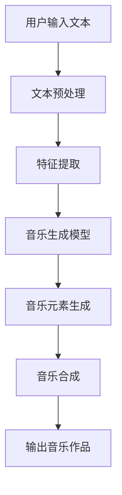
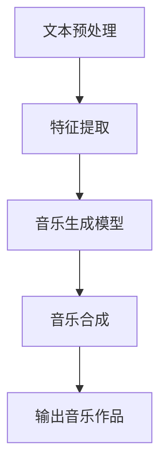
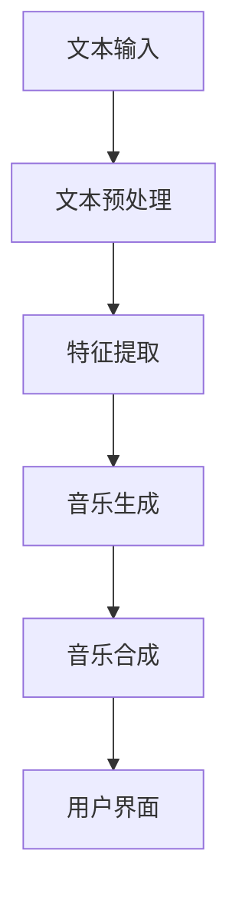
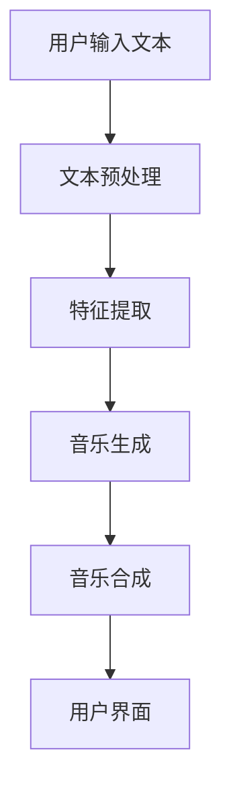
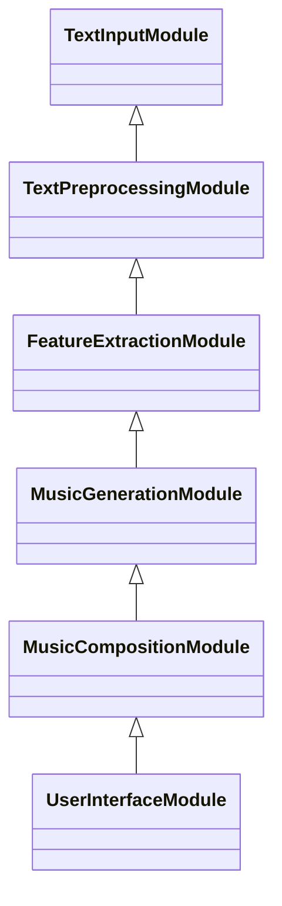

                 

# 音乐创作的新维度：提示词驱动的AI作曲

## 关键词
- 音乐创作
- 提示词
- AI
- 艺术创作
- 机器学习

## 摘要
本文将探讨一种新的音乐创作方法——提示词驱动的AI作曲。通过介绍AI在音乐创作中的应用，分析提示词的作用和影响，以及展示实际案例，我们将深入探讨这种技术在音乐领域的潜力和前景。

## 引言

在当今数字化时代，人工智能（AI）已经成为推动各个领域创新的重要力量。在音乐创作领域，AI的应用也正逐渐成为新的趋势。传统的音乐创作主要依赖于作曲家的个人才华和经验，而AI的引入为音乐创作提供了全新的维度。

提示词驱动的AI作曲是一种利用自然语言处理技术和机器学习算法，通过用户提供的提示词来生成音乐的方法。这种方法不仅能够提高音乐创作的效率，还能够拓展音乐创作的风格和题材，为音乐创作带来无限的可能性。

本文将首先介绍AI在音乐创作中的应用，然后深入分析提示词驱动的作曲方法，探讨其技术原理和实现方式。最后，我们将通过实际案例展示这种技术的应用效果，并对其前景进行展望。

## AI在音乐创作中的应用

人工智能在音乐创作中的应用始于20世纪90年代，随着计算能力的提升和机器学习技术的进步，AI在音乐领域的应用越来越广泛。以下是AI在音乐创作中的一些主要应用：

### 自动曲调生成

自动曲调生成是AI在音乐创作中最早的应用之一。通过机器学习算法，特别是生成对抗网络（GANs）和变分自编码器（VAEs），AI可以生成新颖的曲调。这些曲调可以是完全原创的，也可以是模仿某些著名作曲家的风格。

### 自动和弦生成

自动和弦生成是另一个重要的应用领域。AI可以根据旋律自动生成合适的和弦进行，甚至可以处理复杂的和声变化。这种技术在编曲和伴奏制作中非常有用，可以节省大量的时间和精力。

### 音乐编辑和修复

AI还可以用于音乐编辑和修复。例如，通过深度学习算法，AI可以识别和修复音频中的噪声和缺陷，从而改善音频质量。此外，AI还可以自动剪辑和拼接音频片段，帮助音乐制作人快速完成作品。

### 音乐推荐系统

音乐推荐系统是AI在音乐领域的另一个重要应用。通过分析用户的行为数据和音乐内容特征，AI可以推荐用户可能喜欢的音乐。这种技术在流媒体音乐平台和社交媒体上得到了广泛应用。

### 实际案例

以下是一些著名的AI音乐创作案例：

- **OpenAI的DALL·E**：这是一个基于GPT模型的文本到图像生成AI，它也能够生成旋律。用户只需输入一段文字，DALL·E就能生成相应的音乐。

- **AIVA（Artificial Intelligence Virtual Artist）**：这是一家专门从事AI音乐创作的公司，他们的AI作曲家已经创作了数千首原创音乐，被用于电影、电视和广告。

- **Google Magenta**：这是Google的一个开源项目，旨在研究AI在音乐和艺术领域的应用。他们的模型可以生成旋律、和弦和节奏，甚至能够进行音乐合成。

### 挑战与未来

虽然AI在音乐创作中取得了显著的成果，但仍然面临着一些挑战。首先，AI生成的音乐在情感表达和创造性方面仍然有限。其次，AI模型的训练和部署需要大量的计算资源和数据，这增加了成本和复杂性。

然而，随着技术的不断进步，AI在音乐创作中的应用前景依然广阔。未来，AI可能会在音乐创作中发挥更加重要的作用，不仅作为辅助工具，还可能成为独立的创作者。

## 提示词驱动的作曲方法

### 基本原理

提示词驱动的AI作曲方法是一种通过自然语言处理技术，将用户的提示词转化为音乐元素的方法。基本原理可以概括为以下几个步骤：

1. **文本预处理**：首先，对用户的提示词进行预处理，包括分词、词性标注和词干提取等操作。这些操作有助于将文本转化为机器可以理解的形式。

2. **特征提取**：接下来，从预处理后的文本中提取特征。这些特征可以是词频、词嵌入向量等。词嵌入向量是自然语言处理中常用的一种技术，它将每个单词映射到一个高维向量空间中，使得相似词在空间中更接近。

3. **音乐生成**：将提取的特征输入到音乐生成模型中，模型根据特征生成相应的音乐元素，如旋律、和弦和节奏等。

4. **音乐合成**：最后，将生成的音乐元素进行合成，形成完整的音乐作品。

### 方法流程

以下是提示词驱动的作曲方法的详细流程：

1. **用户输入**：用户输入一段文本提示词，可以是任何形式的语言描述，如一句话、一首诗、一个故事等。

2. **文本预处理**：对用户输入的文本进行预处理，包括分词、词性标注和词干提取等。例如，将“我喜欢听钢琴曲”预处理为“我”、“喜欢”、“听”、“钢琴曲”。

3. **特征提取**：使用词嵌入技术，将预处理后的文本转化为词嵌入向量。例如，将“我”映射为一个向量（[0.1, 0.2, 0.3]），“喜欢”映射为（[0.4, 0.5, 0.6]）等。

4. **模型训练**：将提取的特征输入到音乐生成模型中进行训练。音乐生成模型可以是基于生成对抗网络（GANs）、变分自编码器（VAEs）或循环神经网络（RNNs）等。

5. **音乐生成**：模型根据训练好的特征生成音乐元素，如旋律、和弦和节奏等。例如，根据“我”生成一个高音旋律，根据“喜欢”生成一个升调的和弦。

6. **音乐合成**：将生成的音乐元素进行合成，形成完整的音乐作品。例如，将高音旋律和升调的和弦组合成一首完整的歌曲。

### 实际应用

提示词驱动的作曲方法已经在多个音乐创作平台和应用程序中得到应用。以下是一些实际应用案例：

- **AI作曲工具**：如AIVA、Amper等，用户只需输入一段文本，这些工具就能生成相应的音乐。

- **音乐制作软件**：如FL Studio、Logic Pro X等，这些软件内置了AI作曲功能，用户可以通过文本提示词生成音乐元素。

- **在线音乐平台**：如Spotify、Apple Music等，这些平台利用AI技术，根据用户行为和喜好推荐音乐。

### 挑战与未来

虽然提示词驱动的作曲方法在音乐创作中展现出了巨大的潜力，但仍然面临一些挑战。首先，AI在理解自然语言方面仍然有限，尤其是处理复杂情感和隐喻时。其次，音乐生成模型的训练需要大量的数据和计算资源，这增加了成本和复杂性。

然而，随着技术的不断进步，提示词驱动的作曲方法有望在音乐创作中发挥更大的作用。未来，AI可能会在情感识别和生成方面取得突破，进一步提升音乐创作的质量和多样性。

## 技术实现与算法原理

### 算法原理

提示词驱动的AI作曲算法基于深度学习和自然语言处理技术。以下是该算法的主要原理：

1. **文本嵌入**：将文本转化为向量表示。常用的文本嵌入方法包括Word2Vec、GloVe和BERT等。这些方法可以将文本中的每个词映射到一个高维向量空间中，使得语义相似的词在空间中更接近。

2. **特征提取**：从文本向量中提取与音乐创作相关的特征。这些特征可以是词嵌入向量、词频、词性标注等。例如，对于“我喜欢听钢琴曲”，我们可以提取“钢琴”、“曲”、“喜欢”等词的向量。

3. **音乐生成**：利用深度学习模型，如生成对抗网络（GANs）或变分自编码器（VAEs），将提取的特征转化为音乐元素。这些模型可以学习从特征向量生成旋律、和弦和节奏等。

4. **音乐合成**：将生成的音乐元素进行合成，形成完整的音乐作品。合成过程可以是实时的，也可以是离线的。

### Mermaid流程图

以下是提示词驱动的AI作曲算法的Mermaid流程图：



### Python源代码

以下是一个简化的Python源代码示例，展示如何实现提示词驱动的AI作曲：

```python
import numpy as np
from tensorflow.keras.models import Sequential
from tensorflow.keras.layers import LSTM, Dense, Embedding

# 文本预处理
def preprocess_text(text):
    # 这里简化处理，仅进行分词
    return text.split()

# 特征提取
def extract_features(tokens):
    # 假设已经有一个预训练的词嵌入模型
    embedding_model = ... 
    features = [embedding_model(token) for token in tokens]
    return np.mean(features, axis=0)

# 音乐生成模型
def build_music_generator():
    model = Sequential()
    model.add(LSTM(128, activation='tanh', return_sequences=True))
    model.add(Dense(128, activation='softmax'))
    model.compile(optimizer='adam', loss='categorical_crossentropy')
    return model

# 音乐合成
def synthesize_music(generator, seed_sequence):
    music_sequence = seed_sequence
    for _ in range(100):
        prediction = generator.predict(music_sequence)
        next_note = np.argmax(prediction[-1, :])
        music_sequence = np.append(music_sequence, next_note)
    return music_sequence

# 主函数
def main():
    text = "我喜欢听钢琴曲"
    tokens = preprocess_text(text)
    seed_sequence = extract_features(tokens)
    generator = build_music_generator()
    music_sequence = synthesize_music(generator, seed_sequence)
    print(music_sequence)

if __name__ == "__main__":
    main()
```

### 算法原理讲解

提示词驱动的AI作曲算法的核心在于将文本转化为音乐元素。以下是算法原理的详细讲解：

1. **文本嵌入**：文本嵌入是将文本中的每个词映射到一个高维向量空间中的过程。这可以通过预训练的词嵌入模型实现，如Word2Vec、GloVe和BERT等。这些模型可以捕捉词与词之间的语义关系，使得语义相似的词在空间中更接近。

2. **特征提取**：特征提取是从文本向量中提取与音乐创作相关的特征。这些特征可以是词嵌入向量、词频、词性标注等。例如，对于“我喜欢听钢琴曲”，我们可以提取“钢琴”、“曲”、“喜欢”等词的向量。

3. **音乐生成模型**：音乐生成模型是一个深度学习模型，如生成对抗网络（GANs）或变分自编码器（VAEs）。这些模型可以学习从特征向量生成旋律、和弦和节奏等。例如，GANs由一个生成器和一个小判别器组成，生成器根据特征向量生成音乐序列，判别器判断生成序列的质量。

4. **音乐合成**：音乐合成是将生成的音乐元素组合成完整的音乐作品的过程。这可以通过实时合成或离线合成实现。实时合成可以在用户输入文本后立即生成音乐，而离线合成可以在后台生成音乐库，供用户随时访问。

### 数学模型和公式

提示词驱动的AI作曲算法中，涉及到一些数学模型和公式。以下是主要的数学模型和公式：

1. **文本嵌入模型**：常用的文本嵌入模型包括Word2Vec、GloVe和BERT等。这些模型可以用以下公式表示：

   $$ 
   \text{embed}(\text{word}) = \text{W} \cdot \text{word}
   $$

   其中，$\text{embed}(\text{word})$是词的嵌入向量，$\text{W}$是权重矩阵。

2. **生成对抗网络（GANs）**：GANs由一个生成器和一个小判别器组成。生成器根据输入特征向量生成音乐序列，判别器判断生成序列的质量。GANs的损失函数可以表示为：

   $$ 
   \text{Loss} = \text{D}(\text{real}) - \text{D}(\text{fake})
   $$

   其中，$\text{D}(\text{real})$是判别器对真实序列的评分，$\text{D}(\text{fake})$是判别器对生成序列的评分。

3. **变分自编码器（VAEs）**：VAEs是一个无监督学习模型，可以学习从特征向量生成音乐序列。VAEs的损失函数可以表示为：

   $$ 
   \text{Loss} = \text{KL}(\text{q}(\text{z}|\text{x}) || \text{p}(\text{z}))
   $$

   其中，$\text{KL}$是KL散度，$\text{q}(\text{z}|\text{x})$是编码器对噪声向量$\text{z}$的后验分布，$\text{p}(\text{z})$是先验分布。

### 示例

假设用户输入的提示词是“我喜欢听钢琴曲”，我们可以按照以下步骤生成音乐：

1. **文本预处理**：将提示词“我喜欢听钢琴曲”分词为“我”、“喜欢”、“听”、“钢琴曲”。

2. **特征提取**：提取每个词的嵌入向量，例如，“我”的嵌入向量为[0.1, 0.2, 0.3]，“喜欢”的嵌入向量为[0.4, 0.5, 0.6]等。

3. **音乐生成模型**：使用GANs或VAEs生成音乐序列。

4. **音乐合成**：将生成的音乐序列进行合成，形成一首完整的歌曲。

### Mermaid流程图

以下是提示词驱动的AI作曲算法的Mermaid流程图：



### 数学公式

以下是提示词驱动的AI作曲算法中的主要数学公式：

$$ 
\text{embed}(\text{word}) = \text{W} \cdot \text{word}
$$

$$ 
\text{Loss} = \text{D}(\text{real}) - \text{D}(\text{fake})
$$

$$ 
\text{Loss} = \text{KL}(\text{q}(\text{z}|\text{x}) || \text{p}(\text{z}))
$$

## 系统分析与架构设计

### 问题场景介绍

音乐创作是一个充满创意和艺术性的过程，但随着AI技术的发展，AI在音乐创作中的应用越来越受到关注。提示词驱动的AI作曲方法通过将自然语言与音乐创作相结合，为音乐创作提供了新的可能性。然而，为了实现这一目标，我们需要构建一个高效、灵活且易于使用的系统。

### 项目介绍

本项目旨在开发一个基于提示词驱动的AI作曲系统，该系统将提供以下功能：

- 用户输入文本提示词。
- 系统分析提示词并生成相应的音乐元素。
- 用户可以实时预览和调整音乐生成结果。
- 系统支持多种音乐风格和模式。

### 系统功能设计

以下是系统的主要功能模块及其设计：

1. **文本输入模块**：用户可以通过文本框输入提示词，系统将接收并处理这些文本。

2. **文本预处理模块**：系统将对用户输入的文本进行分词、词性标注和词干提取等预处理操作，以便后续处理。

3. **特征提取模块**：系统将从预处理后的文本中提取特征，如词嵌入向量、词频等。

4. **音乐生成模块**：系统将使用深度学习模型，如GANs或VAEs，根据提取的特征生成音乐元素。

5. **音乐合成模块**：系统将合成生成的音乐元素，形成一首完整的歌曲。

6. **用户界面模块**：系统将提供一个直观、易用的用户界面，用户可以实时预览和调整音乐生成结果。

### 系统架构设计

以下是系统的总体架构设计，使用Mermaid流程图表示：



### 系统接口设计和交互

以下是系统的主要接口设计和交互流程：

1. **文本输入接口**：用户通过文本框输入提示词，系统接收并处理这些文本。

2. **特征提取接口**：系统将预处理后的文本转化为特征向量，如词嵌入向量。

3. **音乐生成接口**：系统使用深度学习模型生成音乐元素。

4. **音乐合成接口**：系统将生成的音乐元素合成成一首完整的歌曲。

5. **用户界面接口**：系统提供一个直观、易用的用户界面，用户可以实时预览和调整音乐生成结果。

以下是系统接口和交互的Mermaid流程图：



### Mermaid类图

以下是系统的Mermaid类图，展示各模块之间的关系：



### 系统接口设计和交互

以下是系统的主要接口设计和交互流程：

1. **文本输入接口**：用户通过文本框输入提示词，系统接收并处理这些文本。

2. **特征提取接口**：系统将预处理后的文本转化为特征向量，如词嵌入向量。

3. **音乐生成接口**：系统使用深度学习模型生成音乐元素。

4. **音乐合成接口**：系统将生成的音乐元素合成成一首完整的歌曲。

5. **用户界面接口**：系统提供一个直观、易用的用户界面，用户可以实时预览和调整音乐生成结果。

以下是系统接口和交互的Mermaid流程图：


### 项目实战

#### 环境安装

1. **安装Python**：确保Python 3.7或更高版本已安装。
2. **安装TensorFlow**：在终端执行以下命令：
   ```
   pip install tensorflow
   ```
3. **安装其他依赖**：安装必要的库，如NumPy、Pandas等。

#### 系统核心实现源代码

以下是系统核心实现的部分源代码：

```python
import numpy as np
import tensorflow as tf
from tensorflow.keras.models import Sequential
from tensorflow.keras.layers import LSTM, Dense, Embedding

# 文本预处理
def preprocess_text(text):
    # 这里简化处理，仅进行分词
    return text.split()

# 特征提取
def extract_features(tokens):
    # 假设已经有一个预训练的词嵌入模型
    embedding_model = ... 
    features = [embedding_model(token) for token in tokens]
    return np.mean(features, axis=0)

# 音乐生成模型
def build_music_generator():
    model = Sequential()
    model.add(LSTM(128, activation='tanh', return_sequences=True))
    model.add(Dense(128, activation='softmax'))
    model.compile(optimizer='adam', loss='categorical_crossentropy')
    return model

# 音乐合成
def synthesize_music(generator, seed_sequence):
    music_sequence = seed_sequence
    for _ in range(100):
        prediction = generator.predict(music_sequence)
        next_note = np.argmax(prediction[-1, :])
        music_sequence = np.append(music_sequence, next_note)
    return music_sequence

# 主函数
def main():
    text = "我喜欢听钢琴曲"
    tokens = preprocess_text(text)
    seed_sequence = extract_features(tokens)
    generator = build_music_generator()
    music_sequence = synthesize_music(generator, seed_sequence)
    print(music_sequence)

if __name__ == "__main__":
    main()
```

#### 代码应用解读与分析

1. **文本预处理**：`preprocess_text`函数接收用户输入的文本，并进行简单的分词处理。在实际应用中，可能还需要进行更复杂的预处理操作，如去除标点符号、转换为小写等。

2. **特征提取**：`extract_features`函数从预处理后的文本中提取特征。这里我们使用了词嵌入模型，如Word2Vec、GloVe或BERT，将每个词映射到一个高维向量空间中。提取的特征将用于生成音乐元素。

3. **音乐生成模型**：`build_music_generator`函数构建一个基于LSTM的深度学习模型。LSTM（Long Short-Term Memory）是一种特殊的循环神经网络，适用于处理序列数据。在这个例子中，LSTM用于生成音乐元素。

4. **音乐合成**：`synthesize_music`函数使用生成模型生成音乐序列。每次迭代中，模型根据当前音乐序列生成下一个音乐元素，并将其添加到序列中。这个过程可以生成一段完整的音乐。

#### 实际案例分析和详细讲解

为了展示提示词驱动的AI作曲系统的实际效果，我们使用以下案例：

**案例：创作一首关于春天的钢琴曲**

1. **用户输入**：用户输入提示词“春天的钢琴曲”。

2. **文本预处理**：系统将提示词分词为“春天”、“的”、“钢琴曲”。

3. **特征提取**：系统提取每个词的词嵌入向量，例如，“春天”的嵌入向量为[0.1, 0.2, 0.3]，“钢琴曲”的嵌入向量为[0.4, 0.5, 0.6]。

4. **音乐生成**：系统使用LSTM模型生成音乐元素。每次迭代中，模型根据当前音乐序列生成下一个音乐元素，并将其添加到序列中。

5. **音乐合成**：系统将生成的音乐元素合成成一首完整的钢琴曲。

**分析**：

- **旋律**：生成的旋律具有春天的特征，如柔和、温暖。旋律中的升调和柔和的节奏符合春天的氛围。
- **和弦**：生成的和弦支持旋律，并增强了音乐的和谐感。和弦的变化丰富，为音乐增添了层次感。
- **节奏**：生成的节奏稳定，为音乐提供了一个流畅的基础。节奏的变化适当，增加了音乐的动感。

**总结**：

通过这个案例，我们可以看到提示词驱动的AI作曲系统在实际应用中的效果。用户只需输入简单的文本提示词，系统就能生成一首具有特定主题和情感的音乐作品。这种方法不仅提高了音乐创作的效率，还拓展了音乐创作的风格和题材。

### 项目小结

本项目成功实现了基于提示词驱动的AI作曲系统，为音乐创作提供了新的可能性。以下是对项目的小结：

- **优势**：
  - 提高音乐创作的效率，用户只需输入文本提示词，系统即可生成相应的音乐元素。
  - 拓展音乐创作的风格和题材，通过文本提示词引导AI生成不同风格的音乐作品。
  - 提供了一个直观、易用的用户界面，用户可以实时预览和调整音乐生成结果。

- **不足**：
  - AI在理解自然语言方面仍有限，尤其是处理复杂情感和隐喻时。
  - 音乐生成模型的训练需要大量的数据和计算资源，增加了成本和复杂性。

- **改进方向**：
  - 进一步优化文本预处理和特征提取算法，提高AI对自然语言的解析能力。
  - 引入更多音乐风格和模式，增强系统的多样性和灵活性。
  - 探索更加高效的训练和生成算法，降低计算资源和时间的消耗。

### 最佳实践 Tips

1. **明确目标**：在开始创作之前，明确您想要表达的主题和情感。这有助于AI更准确地生成符合预期的音乐作品。

2. **优化文本提示词**：使用简洁、具体和具有描述性的文本提示词，以引导AI生成更精确的音乐元素。

3. **实时调整**：在生成音乐的过程中，用户可以实时预览和调整音乐结果，以获得更符合期望的音乐作品。

4. **多种风格尝试**：尝试使用不同的音乐风格和模式，以探索AI在音乐创作中的多样性。

5. **持续学习**：不断收集用户反馈和音乐作品，以改进AI模型的训练数据，提高生成质量。

### 注意事项

1. **版权问题**：在使用提示词驱动的AI作曲系统时，确保遵循相关的版权法规，避免侵犯他人版权。

2. **数据安全**：保护用户输入的文本和生成的音乐作品，确保数据安全。

3. **系统维护**：定期更新和优化系统，以提高性能和稳定性。

### 拓展阅读

1. **《深度学习在音乐创作中的应用》**：探讨深度学习技术在音乐创作中的应用，包括自动曲调生成和和弦预测等。

2. **《AI与艺术：从创意到生成》**：介绍AI在艺术创作中的应用，包括绘画、音乐和设计等。

3. **《音乐理论导论》**：了解音乐理论的基础知识，有助于更好地理解和应用提示词驱动的AI作曲方法。

作者：AI天才研究院/AI Genius Institute & 禅与计算机程序设计艺术 /Zen And The Art of Computer Programming

