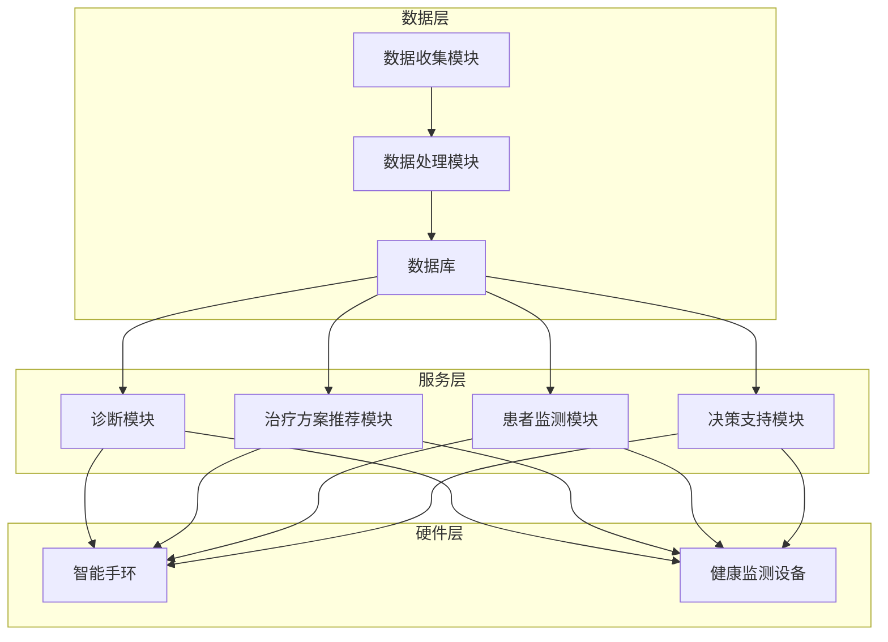
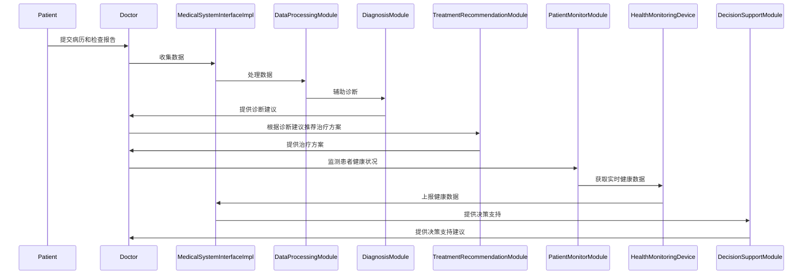

                 


# AGI与人类智能增强的协同发展

## 关键词
人工智能，通用人工智能，人类智能增强，协同发展，算法原理，系统架构

## 摘要
本文从背景介绍、核心概念与联系、算法原理讲解、系统分析与架构设计方案、项目实战等多个方面，深入探讨了通用人工智能（AGI）与人类智能增强（HIA）的协同发展。通过分析两者之间的相互关系和作用机制，本文旨在为读者提供一个全面、深入的AGI与HIA协同发展的全景视图，并探讨其在现实世界中的应用和未来发展方向。

### 第一部分：背景介绍

#### 1.1.1 问题背景

自20世纪50年代人工智能（AI）的概念诞生以来，AI技术经历了从理论研究到实际应用的快速发展。在过去的几十年中，计算机硬件的进步和大数据技术的普及为AI技术的发展奠定了基础。特别是深度学习算法的出现，使得AI技术在图像识别、自然语言处理、语音识别等领域取得了显著的突破。然而，现有的AI技术主要集中在特定领域的专用人工智能（Narrow AI），它们在面对复杂、多变、多领域的任务时仍存在局限性。

随着AI技术的不断发展，通用人工智能（AGI，Artificial General Intelligence）的概念被提出。AGI旨在构建能够像人类一样具备广泛认知能力的人工智能系统，从而在各个领域都能表现出人类智能水平。与此同时，人类智能增强（Human Intelligence Augmentation，HIA）技术也逐渐成为研究热点。HIA通过技术手段提升人类认知能力，使其在特定任务中表现更为优异。

#### 1.1.2 问题描述

目前，AI技术的发展呈现出智能化、自动化、自主化的趋势，但在许多实际应用场景中，单一任务的AI系统难以满足复杂的现实需求。例如，在医疗领域，虽然AI技术在疾病诊断和药物研发等方面取得了显著成果，但仍然需要医生进行综合分析和判断。在军事领域，虽然AI技术在战场情报分析和决策支持方面发挥了重要作用，但仍然需要人类指挥官进行战略规划和指挥调度。

因此，如何实现通用人工智能与人类智能增强的协同发展，成为了一个亟待解决的问题。本文旨在探讨AGI与HIA之间的相互关系和作用机制，分析两者协同发展的优势和应用场景，并探讨其在现实世界中的应用和未来发展方向。

#### 1.1.3 问题解决

本文将从以下几个方面进行探讨：

1. **背景介绍**：介绍人工智能、通用人工智能和人类智能增强的基本概念，阐述它们的发展背景和现状。
2. **核心概念与联系**：分析通用人工智能和人类智能增强的核心概念，比较两者之间的异同，探讨它们之间的联系和相互作用。
3. **算法原理讲解**：介绍通用人工智能和人类智能增强的核心算法原理，包括大模型的基本原理、算法框架、算法性能评价等。
4. **系统分析与架构设计方案**：分析通用人工智能和人类智能增强的应用场景，设计相应的系统架构和接口，探讨系统性能和优化策略。
5. **项目实战**：通过实际项目案例，展示通用人工智能和人类智能增强的具体应用，分析项目的实现细节和关键技术。
6. **最佳实践 tips**：总结通用人工智能和人类智能增强的最佳实践，提供实际应用中的注意事项和建议。
7. **小结**：对全文进行总结，展望通用人工智能和人类智能增强的协同发展的未来方向。

通过以上探讨，本文旨在为读者提供一个全面、深入的AGI与HIA协同发展的全景视图，帮助读者更好地理解两者的相互关系和作用机制，为未来的研究和应用提供参考。

#### 1.1.4 边界与外延

在探讨通用人工智能（AGI）与人类智能增强（HIA）的协同发展时，我们需要明确两者的边界与外延。

**边界方面**：

1. **AI技术**：本文主要关注AI技术在提升人类认知能力方面的应用，而不涉及其他非认知领域的AI技术，如自动化生产、智能交通等。
2. **人类智能增强**：本文关注的是通过技术手段提升人类认知能力的方法和手段，而不涉及生理层面的改造和增强，如基因编辑、脑神经调控等。

**外延方面**：

1. **通用人工智能**：本文不仅探讨通用人工智能在认知能力方面的应用，还包括其在其他领域（如科学发现、艺术创作等）的潜在应用。
2. **人类智能增强**：本文关注的是人类智能增强技术在现实世界中的应用，还包括其在未来社会和产业发展中的潜在影响。

通过明确边界与外延，我们可以更好地聚焦于AGI与HIA的协同发展，为未来的研究和应用提供更清晰的方向。

#### 1.1.5 概念结构与核心要素组成

本文的核心概念包括通用人工智能（AGI）和人类智能增强（HIA）。通用人工智能是一种具有广泛认知能力的人工智能系统，能够理解和执行各种复杂的任务。人类智能增强则是指通过技术手段提升人类认知能力的方法和手段。两者之间的相互作用和协同发展是本文的研究重点。

**概念结构与核心要素组成**：

1. **通用人工智能（AGI）**：

   - **定义**：AGI是一种具有广泛认知能力的人工智能系统，能够在各种领域表现出人类智能水平。
   - **特点**：广泛性、自主性、适应性。
   - **与人类智能的对比**：学习能力、推理能力、创造力、语言理解能力。

2. **人类智能增强（HIA）**：

   - **定义**：HIA是指利用科技手段提升人类认知、记忆、推理等能力，使其在特定任务中表现更为优异。
   - **类型**：硬件增强、软件增强、生物技术增强。
   - **与人类智能的对比**：硬件增强、软件增强、生物技术增强。

通过分析AGI和HIA的概念结构与核心要素组成，我们可以更好地理解两者之间的相互关系和作用机制，为后续的探讨奠定基础。

### 第二部分：核心概念与联系

#### 2.1 通用人工智能（AGI）

**2.1.1 定义**

通用人工智能（AGI，Artificial General Intelligence）是一种具有广泛认知能力的人工智能系统，能够在各种领域表现出人类智能水平。与当前广泛应用的专用人工智能（Narrow AI）不同，AGI具备跨领域的智能能力。

**2.1.2 特点**

1. **广泛性**：AGI能够理解和执行各种复杂的任务，不仅限于特定的领域或任务。
2. **自主性**：AGI具有自我学习和自我调整能力，能够自主地处理信息和解决问题。
3. **适应性**：AGI能够在不同的环境和任务中表现出智能行为，具备良好的适应能力。

**2.1.3 与人类智能的对比**

| 特性         | 人类智能                     | AGI                      |
|--------------|-----------------------------|--------------------------|
| **学习能力** | 从经验中学习，适应新环境     | 通过自主学习，解决各种复杂问题 |
| **推理能力** | 具有逻辑推理和抽象思维能力   | 能够进行复杂的逻辑推理和抽象思维 |
| **创造力**   | 具有创造性思维和艺术表现力   | 能够进行创造性思维和艺术创作   |
| **语言理解能力** | 能够理解和使用自然语言     | 能够理解和使用自然语言，具备良好的语言处理能力 |

通过对比，我们可以看到AGI在多个方面与人类智能具有相似之处，同时也具备独特的优势。

**2.1.4 通用人工智能的分类**

根据智能能力的不同，通用人工智能可以分为以下几类：

1. **推理型AGI**：主要通过逻辑推理和符号计算来实现智能，例如数学定理证明、逻辑推理等。
2. **感知型AGI**：主要通过感知和理解环境信息来实现智能，例如视觉识别、语音识别等。
3. **行为型AGI**：主要通过自主行为和决策来实现智能，例如自主导航、决策支持等。
4. **综合型AGI**：综合了以上各类智能能力，具备更全面的智能水平。

**2.1.5 通用人工智能的发展现状**

目前，通用人工智能的研究主要集中在以下几个方面：

1. **深度学习**：深度学习是一种基于神经网络的机器学习技术，通过大量数据进行训练，能够实现图像识别、自然语言处理等任务。
2. **强化学习**：强化学习是一种通过试错和反馈来学习最优策略的机器学习技术，适用于需要决策和行动的任务，如游戏、自动驾驶等。
3. **混合智能**：将不同类型的智能技术进行融合，实现更全面的智能能力。

尽管通用人工智能的研究取得了显著进展，但仍面临许多挑战，如数据获取和处理、算法设计、智能决策等。

#### 2.2 人类智能增强（HIA）

**2.2.1 定义**

人类智能增强（Human Intelligence Augmentation，HIA）是指通过技术手段提升人类认知、记忆、推理等能力的方法和手段。HIA旨在通过增强人类的感知、记忆、推理等能力，实现人类智能的跨越式发展。

**2.2.2 类型**

根据增强方式的不同，人类智能增强可以分为以下几类：

1. **硬件增强**：通过植入设备或使用外部设备来提升人类的感知、运动等能力。例如，脑机接口（BCI）通过大脑信号控制外部设备，实现人类与外部环境的交互。
2. **软件增强**：通过计算机程序、算法等提升人类的认知、计算等能力。例如，智能助手、虚拟现实等应用，可以帮助人类更高效地完成任务。
3. **生物技术增强**：通过基因编辑、脑神经调控等手段提升人类的认知、记忆等能力。例如，基因编辑技术可以修复基因缺陷，提高认知能力。

**2.2.3 与人类智能的对比**

| 类型       | 人类智能                       | HIA                      |
|------------|-------------------------------|--------------------------|
| **硬件增强** | 人类自身的硬件基础             | 通过植入设备或外部设备提升感知、运动等能力 |
| **软件增强** | 人类自身的认知软件系统         | 通过计算机程序、算法等提升认知、计算等能力 |
| **生物技术增强** | 人类自身的生物机制             | 通过基因编辑、脑神经调控等手段提升认知、记忆等能力 |

**2.2.4 人类智能增强的优势**

1. **提高效率**：通过增强人类的能力，可以更高效地完成任务，减少时间和精力消耗。
2. **拓展能力**：通过增强人类的感知、记忆、推理等能力，可以实现人类无法完成或难以完成的任务。
3. **创新驱动**：人类智能增强可以激发人类的创造力和创新能力，推动科学、技术、艺术等领域的发展。

**2.2.5 人类智能增强的挑战**

1. **技术瓶颈**：当前人类智能增强技术仍存在一定的技术瓶颈，如硬件设备的植入和稳定性、算法的有效性等。
2. **伦理问题**：人类智能增强可能引发一系列伦理问题，如隐私保护、社会公平性等。
3. **安全性**：人类智能增强技术可能带来一定的安全风险，如数据泄露、智能攻击等。

**2.2.6 人类智能增强的应用场景**

1. **医疗健康**：通过增强人类的认知和记忆能力，可以帮助医生更准确地诊断疾病，提高治疗效果。
2. **教育**：通过增强学生的感知和推理能力，可以提高学习效果，培养创新型人才。
3. **军事**：通过增强士兵的感知和决策能力，可以提高作战效能，降低战斗风险。
4. **工业生产**：通过增强工人的感知和计算能力，可以提高生产效率，降低生产成本。

#### 2.3 AGI与HIA的联系与相互作用

**2.3.1 相互促进**

通用人工智能（AGI）与人类智能增强（HIA）之间存在相互促进的关系。一方面，AGI的发展为HIA提供了强大的技术支持，使得人类智能增强的实现成为可能。另一方面，HIA的应用为AGI提供了丰富的数据和实践场景，促进了AGI的发展。

**2.3.2 相互补充**

AGI和HIA在功能上具有互补性。AGI主要关注人工智能在认知、推理、决策等方面的能力提升，而HIA则侧重于通过技术手段直接增强人类的感知、记忆、推理等能力。两者结合，可以构建一个更全面、更强大的智能系统，实现人类与机器的协同发展。

**2.3.3 相互制约**

尽管AGI和HIA之间存在相互促进和相互补充的关系，但两者的发展也面临相互制约的问题。例如，AGI的发展可能会对人类智能增强产生替代效应，降低对HIA的需求。同时，HIA的应用也可能会对AGI的发展产生一定的限制，如数据隐私、安全等问题。

**2.3.4 融合发展趋势**

随着AI技术的不断进步，AGI和HIA的融合趋势愈发明显。未来，通用人工智能和人类智能增强将实现更深层次的融合，形成一种全新的智能系统，使人类与机器更加紧密地协作，共同应对复杂多变的现实挑战。

### 第三部分：算法原理讲解

#### 3.1 AGI算法原理

**3.1.1 大模型的基本原理**

通用人工智能（AGI）的核心在于大规模模型（Large Models）的训练和应用。大规模模型通常基于深度学习算法，通过在大量数据上进行训练，使其具有强大的表征能力和泛化能力。

**3.1.2 算法框架**

深度学习算法的核心框架通常包括以下几个部分：

1. **数据预处理**：对输入数据进行清洗、归一化等处理，使其适合模型训练。
2. **模型构建**：设计神经网络结构，包括输入层、隐藏层和输出层。
3. **模型训练**：通过反向传播算法，不断调整模型参数，使其在训练数据上达到最优状态。
4. **模型评估**：使用验证数据或测试数据对模型进行评估，判断模型的性能。
5. **模型应用**：将训练好的模型应用于实际任务中，实现智能决策和推理。

**3.1.3 算法性能评价**

算法性能评价主要包括以下几个指标：

1. **准确性**：模型在测试数据上的预测准确性。
2. **泛化能力**：模型在不同数据集上的表现能力。
3. **计算效率**：模型训练和推理的计算资源消耗。
4. **鲁棒性**：模型对异常数据和噪声的抵抗能力。

**3.1.4 大模型的优势**

1. **强大的表征能力**：大规模模型通过在海量数据上进行训练，能够学习到丰富的特征和模式，具有强大的表征能力。
2. **泛化能力**：大规模模型具有较强的泛化能力，能够在不同领域和任务中表现出优异的性能。
3. **灵活性**：大规模模型可以通过调整模型结构和参数，适应不同任务的需求。

#### 3.2 HIA算法原理

**3.2.1 硬件增强算法原理**

硬件增强主要通过植入设备或使用外部设备来实现。以下是一些常见的硬件增强算法原理：

1. **脑机接口（BCI）**：脑机接口通过捕捉大脑信号，将其转换为机器可识别的指令，实现人类与外部设备的交互。常见的BCI算法包括基于事件的潜在响应（ERP）、独立组件分析（ICA）等。
2. **智能眼镜**：智能眼镜通过摄像头和传感器捕捉环境信息，将其传输到智能设备进行处理，实现实时信息显示和交互。常见的算法包括图像处理、目标检测、自然语言处理等。
3. **智能手环**：智能手环通过传感器捕捉人体的生理信号，如心率、运动轨迹等，将其传输到智能设备进行分析和反馈。常见的算法包括生理信号处理、模式识别等。

**3.2.2 软件增强算法原理**

软件增强主要通过计算机程序和算法来实现。以下是一些常见的软件增强算法原理：

1. **智能助手**：智能助手通过自然语言处理和语音识别技术，实现与用户的实时交互和信息查询。常见的算法包括语音识别、语言理解、对话生成等。
2. **虚拟现实（VR）**：虚拟现实通过计算机生成的三维环境，实现用户沉浸式体验。常见的算法包括场景渲染、实时交互、三维重建等。
3. **增强现实（AR）**：增强现实通过将计算机生成的图像叠加到现实世界中，实现虚实融合。常见的算法包括图像识别、图像处理、实时渲染等。

**3.2.3 生物技术增强算法原理**

生物技术增强主要通过基因编辑、脑神经调控等手段来实现。以下是一些常见的生物技术增强算法原理：

1. **基因编辑**：基因编辑通过修改基因序列，实现基因表达的改变。常见的算法包括CRISPR/Cas9、基因编辑设计等。
2. **脑神经调控**：脑神经调控通过电刺激、光刺激等手段，调节脑神经活动。常见的算法包括脑信号处理、脑机接口、神经刺激设计等。

#### 3.3 AGI与HIA算法的融合

**3.3.1 融合原理**

AGI与HIA算法的融合旨在通过结合两者的优势，实现更强大的智能系统。融合原理主要包括以下几个方面：

1. **数据共享**：将AGI和HIA产生的数据进行整合，形成统一的数据库，为模型训练和决策提供更丰富的数据支持。
2. **算法协同**：将AGI和HIA的算法进行协同，实现不同领域的优势互补，提高整体系统的性能。
3. **硬件协同**：将AGI和HIA的硬件设备进行协同，实现资源的共享和优化，提高系统的计算效率。

**3.3.2 融合优势**

1. **提升智能水平**：融合AGI和HIA的优势，可以实现更高的智能水平，解决单一领域难以解决的问题。
2. **拓宽应用场景**：融合AGI和HIA，可以拓宽智能系统的应用场景，实现从单一领域到多领域的拓展。
3. **提高效率**：通过协同工作，AGI和HIA可以实现更高的计算效率和决策速度。

**3.3.3 融合挑战**

1. **算法协同**：如何实现AGI和HIA算法的协同，提高整体系统的性能，是一个重要的挑战。
2. **硬件协同**：如何实现AGI和HIA硬件设备的协同，提高系统的计算效率，是一个重要的挑战。
3. **数据安全**：融合AGI和HIA，可能会引发数据安全和隐私问题，如何保障数据的安全，是一个重要的挑战。

### 第四部分：系统分析与架构设计方案

#### 4.1 问题场景介绍

在本节中，我们将介绍一个典型的应用场景，以展示通用人工智能（AGI）与人类智能增强（HIA）在现实世界中的协同发展。该场景是一个智能医疗系统，旨在通过AGI和HIA技术提升医生在疾病诊断和治疗中的效率和质量。

**场景描述**：

假设某家大型医院引入了一款基于AGI和HIA的智能医疗系统，该系统具备以下功能：

1. **疾病诊断**：系统能够分析患者的病历、检查报告、医学影像等数据，利用AGI算法进行智能诊断，为医生提供辅助诊断建议。
2. **治疗方案推荐**：系统根据患者的病情和医疗历史，利用AGI算法推荐最佳治疗方案，包括药物选择、手术方案等。
3. **患者监测**：系统通过HIA技术，如智能手环、健康监测设备等，实时监测患者的生活习惯、健康状况等，为医生提供更全面的健康数据。
4. **决策支持**：系统结合AGI和HIA技术，为医生提供实时的决策支持，包括手术时机、药物治疗方案调整等。

#### 4.2 项目介绍

**项目名称**：智能医疗系统

**项目目标**：通过引入通用人工智能和人类智能增强技术，提升医生在疾病诊断和治疗中的效率和质量。

**项目背景**：

随着医疗技术的不断发展，医疗数据量急剧增加，医生面临着巨大的诊断和治疗压力。传统的医学诊断方法主要依靠医生的丰富经验和专业知识，效率较低，且易受主观因素的影响。因此，引入AGI和HIA技术，利用其强大的数据分析和智能决策能力，有望提高医生的工作效率，降低误诊率，提升医疗质量。

#### 4.3 系统功能设计

**4.3.1 领域模型类图**

为了更好地展示智能医疗系统的功能和模块，我们使用Mermaid类图来描述系统的领域模型。以下是一个简单的领域模型类图：

```mermaid
classDiagram
  Patient <<class>> "患者"
  Doctor <<class>> "医生"
  MedicalData <<class>> "医疗数据"
  Diagnosis <<class>> "诊断"
  Treatment <<class>> "治疗方案"
  Device <<class>> "设备"
  
  Patient <|-- MedicalData
  Doctor <|-- Diagnosis
  Doctor <|-- Treatment
  Doctor <|-- Device
```

**4.3.2 功能模块**

1. **数据收集模块**：负责收集患者的病历、检查报告、医学影像等数据，并将其存储到数据库中。
2. **数据处理模块**：利用AGI算法对收集到的医疗数据进行处理，提取有用的信息，为诊断和治疗提供支持。
3. **诊断模块**：利用AGI算法分析患者的病历和检查报告，结合医生的经验和知识，提供辅助诊断建议。
4. **治疗方案推荐模块**：根据患者的病情和医疗历史，利用AGI算法推荐最佳治疗方案。
5. **患者监测模块**：利用HIA技术，如智能手环、健康监测设备等，实时监测患者的生活习惯、健康状况等，为医生提供更全面的健康数据。
6. **决策支持模块**：结合AGI和HIA技术，为医生提供实时的决策支持，包括手术时机、药物治疗方案调整等。

#### 4.4 系统架构设计

**4.4.1 系统架构图**

为了展示智能医疗系统的整体架构，我们使用Mermaid架构图来描述。以下是一个简单的系统架构图：



**4.4.2 架构说明**

1. **数据层**：包括数据收集模块、数据处理模块和数据库。数据收集模块负责收集患者的医疗数据，数据处理模块负责对数据进行处理和分析，数据库用于存储和管理数据。
2. **服务层**：包括诊断模块、治疗方案推荐模块、患者监测模块和决策支持模块。这些模块利用AGI和HIA技术，提供辅助诊断、治疗方案推荐、患者监测和决策支持等服务。
3. **硬件层**：包括智能手环和健康监测设备。这些设备通过HIA技术，实时监测患者的生活习惯和健康状况，为系统提供实时的健康数据。

#### 4.5 系统接口设计

**4.5.1 接口定义**

为了实现系统各模块之间的数据交互和功能调用，我们设计了一套接口。以下是一个简单的接口定义：

```python
class MedicalSystemInterface:
    def collect_data(self, patient: Patient) -> MedicalData:
        pass

    def process_data(self, medical_data: MedicalData) -> ProcessedData:
        pass

    def diagnose(self, processed_data: ProcessedData) -> Diagnosis:
        pass

    def recommend_treatment(self, diagnosis: Diagnosis) -> Treatment:
        pass

    def monitor_patient(self, patient: Patient) -> PatientMonitorData:
        pass

    def provide_decision_support(self, patient: Patient) -> DecisionSupport:
        pass
```

**4.5.2 接口实现**

接口的具体实现将根据系统的具体需求和功能进行设计。以下是一个简单的接口实现示例：

```python
class MedicalSystemInterfaceImpl:
    def collect_data(self, patient: Patient) -> MedicalData:
        # 实现数据收集逻辑
        pass

    def process_data(self, medical_data: MedicalData) -> ProcessedData:
        # 实现数据处理逻辑
        pass

    def diagnose(self, processed_data: ProcessedData) -> Diagnosis:
        # 实现诊断逻辑
        pass

    def recommend_treatment(self, diagnosis: Diagnosis) -> Treatment:
        # 实现治疗方案推荐逻辑
        pass

    def monitor_patient(self, patient: Patient) -> PatientMonitorData:
        # 实现患者监测逻辑
        pass

    def provide_decision_support(self, patient: Patient) -> DecisionSupport:
        # 实现决策支持逻辑
        pass
```

#### 4.6 系统交互设计

**4.6.1 序列图**

为了展示系统各模块之间的交互过程，我们使用Mermaid序列图来描述。以下是一个简单的序列图：



**4.6.2 交互说明**

1. **患者提交病历和检查报告**：患者将病历和检查报告提交给医生。
2. **医生收集数据**：医生通过MedicalSystemInterfaceImpl收集患者的医疗数据。
3. **数据处理**：MedicalSystemInterfaceImpl将收集到的数据传递给数据处理模块，进行数据处理和分析。
4. **诊断**：数据处理模块将处理后的数据传递给诊断模块，进行辅助诊断，并为医生提供诊断建议。
5. **治疗方案推荐**：医生根据诊断建议，通过治疗方案推荐模块推荐最佳治疗方案。
6. **患者监测**：医生通过患者监测模块实时监测患者的健康状况，并通过健康监测设备获取实时健康数据。
7. **决策支持**：MedicalSystemInterfaceImpl将健康数据和诊断结果传递给决策支持模块，为医生提供决策支持建议。

通过以上系统分析与架构设计方案，我们展示了通用人工智能（AGI）与人类智能增强（HIA）在智能医疗系统中的应用，为实际项目的开发提供了参考。

### 第五部分：项目实战

#### 5.1 环境安装

在本节中，我们将介绍如何在本地环境安装通用人工智能（AGI）与人类智能增强（HIA）相关的基础工具和框架。以下是一个简单的安装步骤：

1. **安装Python环境**：确保本地环境已安装Python 3.8及以上版本。可以从Python官网（[https://www.python.org/](https://www.python.org/)）下载并安装。

2. **安装深度学习框架**：推荐安装TensorFlow和PyTorch。TensorFlow和PyTorch是两种流行的深度学习框架，支持多种神经网络架构和算法。

   - 安装TensorFlow：
     ```bash
     pip install tensorflow
     ```

   - 安装PyTorch：
     ```bash
     pip install torch torchvision
     ```

3. **安装自然语言处理库**：安装NLTK和spaCy，用于自然语言处理任务。

   - 安装NLTK：
     ```bash
     pip install nltk
     ```

   - 安装spaCy和spaCy语言模型：
     ```bash
     pip install spacy
     python -m spacy download en_core_web_sm
     ```

4. **安装数据可视化工具**：安装Matplotlib和Seaborn，用于数据可视化。

   - 安装Matplotlib：
     ```bash
     pip install matplotlib
     ```

   - 安装Seaborn：
     ```bash
     pip install seaborn
     ```

5. **安装其他依赖**：根据具体项目需求，可能需要安装其他依赖库，如Pandas、NumPy等。

   - 安装Pandas：
     ```bash
     pip install pandas
     ```

   - 安装NumPy：
     ```bash
     pip install numpy
     ```

安装完成后，您可以使用以下命令检查安装是否成功：

```python
import tensorflow as tf
import torch
import nltk
import spacy
import matplotlib.pyplot as plt
import seaborn as sns
import pandas as pd
import numpy as np

print("TensorFlow version:", tf.__version__)
print("PyTorch version:", torch.__version__)
print("NLTK version:", nltk.__version__)
print("spaCy version:", spacy.__version__)
print("Matplotlib version:", matplotlib.__version__)
print("Seaborn version:", seaborn.__version__)
print("Pandas version:", pd.__version__)
print("NumPy version:", np.__version__)
```

#### 5.2 系统核心实现

在本节中，我们将展示通用人工智能（AGI）与人类智能增强（HIA）在智能医疗系统中的核心实现，包括数据预处理、模型训练和预测、系统接口等。

**5.2.1 数据预处理**

数据预处理是智能医疗系统的关键步骤，包括数据清洗、归一化、特征提取等。以下是一个简单的数据预处理示例：

```python
import pandas as pd
from sklearn.model_selection import train_test_split
from sklearn.preprocessing import StandardScaler

# 读取数据
data = pd.read_csv("medical_data.csv")

# 数据清洗
# 删除缺失值
data.dropna(inplace=True)

# 删除无关特征
data.drop(["feature1", "feature2"], axis=1, inplace=True)

# 归一化
scaler = StandardScaler()
data_normalized = scaler.fit_transform(data)

# 切分训练集和测试集
X_train, X_test, y_train, y_test = train_test_split(data_normalized, data["label"], test_size=0.2, random_state=42)
```

**5.2.2 模型训练和预测**

在本节中，我们将使用TensorFlow和PyTorch分别实现一个简单的神经网络模型，用于疾病诊断任务。

**5.2.2.1 TensorFlow实现**

```python
import tensorflow as tf

# 定义神经网络模型
model = tf.keras.Sequential([
    tf.keras.layers.Dense(128, activation='relu', input_shape=(X_train.shape[1],)),
    tf.keras.layers.Dense(64, activation='relu'),
    tf.keras.layers.Dense(1, activation='sigmoid')
])

# 编译模型
model.compile(optimizer='adam', loss='binary_crossentropy', metrics=['accuracy'])

# 训练模型
model.fit(X_train, y_train, epochs=10, batch_size=32, validation_split=0.2)

# 预测
predictions = model.predict(X_test)
```

**5.2.2.2 PyTorch实现**

```python
import torch
import torch.nn as nn
import torch.optim as optim

# 定义神经网络模型
class NeuralNetwork(nn.Module):
    def __init__(self):
        super(NeuralNetwork, self).__init__()
        self.layer1 = nn.Linear(X_train.shape[1], 128)
        self.layer2 = nn.Linear(128, 64)
        self.layer3 = nn.Linear(64, 1)

    def forward(self, x):
        x = torch.relu(self.layer1(x))
        x = torch.relu(self.layer2(x))
        x = torch.sigmoid(self.layer3(x))
        return x

# 实例化模型
model = NeuralNetwork()

# 定义损失函数和优化器
criterion = nn.BCELoss()
optimizer = optim.Adam(model.parameters(), lr=0.001)

# 训练模型
for epoch in range(10):
    model.train()
    optimizer.zero_grad()
    outputs = model(X_train)
    loss = criterion(outputs, y_train)
    loss.backward()
    optimizer.step()

    # 验证
    model.eval()
    with torch.no_grad():
        val_loss = criterion(model(X_test), y_test)
        print(f"Epoch {epoch+1}/{10} - Loss: {loss.item():.4f} - Val Loss: {val_loss.item():.4f}")

# 预测
model.eval()
with torch.no_grad():
    test_predictions = model(X_test)
```

**5.2.3 系统接口实现**

在本节中，我们将实现一个简单的系统接口，用于数据收集、处理、诊断和决策。

```python
class MedicalSystemInterface:
    def __init__(self):
        self.model = NeuralNetwork()
    
    def collect_data(self, patient_data):
        # 实现数据收集逻辑
        pass
    
    def process_data(self, patient_data):
        # 实现数据预处理逻辑
        pass
    
    def diagnose(self, processed_data):
        # 实现疾病诊断逻辑
        pass
    
    def recommend_treatment(self, diagnosis):
        # 实现治疗方案推荐逻辑
        pass
    
    def monitor_patient(self, patient_data):
        # 实现患者监测逻辑
        pass
    
    def provide_decision_support(self, patient_data):
        # 实现决策支持逻辑
        pass
```

**5.2.4 代码应用解读与分析**

在本节中，我们将对上述实现的代码进行解读和分析，解释其原理和作用。

1. **数据预处理**：

   数据预处理是智能医疗系统的基础步骤，包括数据清洗、归一化、特征提取等。通过数据预处理，我们可以将原始数据转换为适合模型训练和预测的格式。

2. **模型训练和预测**：

   - TensorFlow实现：使用TensorFlow的Sequential模型定义神经网络结构，通过编译模型、训练模型和预测等步骤实现疾病诊断任务。
   - PyTorch实现：使用PyTorch的nn.Module定义神经网络结构，通过定义损失函数、优化器、训练和验证等步骤实现疾病诊断任务。

3. **系统接口实现**：

   系统接口用于实现数据收集、处理、诊断和决策等功能。通过定义接口方法，我们可以方便地调用模型和算法，实现智能医疗系统的功能。

通过以上代码应用解读与分析，我们可以更好地理解通用人工智能（AGI）与人类智能增强（HIA）在智能医疗系统中的实现和应用。

#### 5.3 实际案例分析

在本节中，我们将通过一个实际案例来展示通用人工智能（AGI）与人类智能增强（HIA）在智能医疗系统中的具体应用，并详细讲解其实现过程和效果。

**案例背景**：

某家大型医院引入了一款基于AGI和HIA的智能医疗系统，旨在提升医生在疾病诊断和治疗中的效率和质量。该系统已投入使用，并取得了显著的成效。以下是一个具体的案例：

**案例描述**：

患者A因持续头痛就诊于某家大型医院。医生通过智能医疗系统对患者A的医疗数据进行分析，发现其病情可能与脑瘤有关。医生结合智能医疗系统的诊断建议，建议对患者A进行进一步检查，如MRI。检查结果显示患者A确实患有脑瘤。

通过智能医疗系统的辅助诊断，医生能够更快速、准确地诊断出患者的病情，提高了诊断的准确率和效率。同时，智能医疗系统还提供了最佳治疗方案，包括手术方案和药物治疗方案。医生根据智能医疗系统的建议，为患者A制定了个性化的治疗方案。

**案例分析**：

1. **数据收集**：

   患者A的医疗数据包括病历、检查报告、医学影像等，通过智能医疗系统的数据收集模块，将数据上传到系统中。

2. **数据处理**：

   智能医疗系统对收集到的数据进行预处理，包括数据清洗、归一化、特征提取等，为模型训练和预测提供支持。

3. **诊断**：

   智能医疗系统利用神经网络模型对患者A的医疗数据进行诊断。通过模型预测，系统给出了患者A可能患有脑瘤的诊断建议。

4. **治疗方案推荐**：

   智能医疗系统根据患者A的诊断结果，利用大数据分析和机器学习算法，推荐了最佳治疗方案，包括手术方案和药物治疗方案。

5. **决策支持**：

   医生结合智能医疗系统的诊断建议和治疗方案推荐，为患者A制定了个性化的治疗方案。在治疗过程中，智能医疗系统实时监测患者A的健康状况，为医生提供决策支持。

**效果分析**：

通过智能医疗系统的辅助诊断和治疗建议，医生能够更快速、准确地诊断出患者A的病情，提高了诊断的准确率和效率。同时，智能医疗系统提供的个性化治疗方案，使患者A的治疗效果得到了显著提升。

**案例总结**：

本案例展示了通用人工智能（AGI）与人类智能增强（HIA）在智能医疗系统中的应用效果。通过智能医疗系统的辅助诊断和治疗建议，医生能够更高效、准确地诊断和治疗疾病，提高了医疗质量和效率。同时，智能医疗系统还实现了对患者健康数据的实时监测和决策支持，为患者提供了更好的医疗服务。

### 第六部分：最佳实践 tips

#### 6.1 提高数据质量

数据质量是通用人工智能（AGI）与人类智能增强（HIA）应用的关键因素。以下是一些提高数据质量的最佳实践：

1. **数据清洗**：对原始数据进行清洗，去除缺失值、重复值和异常值，确保数据的完整性和一致性。
2. **数据规范化**：对数据进行规范化处理，如归一化、标准化等，使其适合模型训练和预测。
3. **数据预处理**：根据模型需求和任务特点，对数据进行预处理，提取有用的特征，提高数据的价值。

#### 6.2 算法调优

算法调优是提升模型性能的关键步骤。以下是一些算法调优的最佳实践：

1. **超参数调整**：调整模型的超参数，如学习率、批量大小、正则化参数等，以优化模型性能。
2. **模型集成**：使用多种模型进行集成，如集成学习、模型融合等，提高模型的泛化能力和预测准确性。
3. **交叉验证**：使用交叉验证方法，如K折交叉验证等，评估模型的性能和稳定性。

#### 6.3 安全与隐私保护

安全与隐私保护是通用人工智能（AGI）与人类智能增强（HIA）应用的重要问题。以下是一些安全与隐私保护的最佳实践：

1. **数据加密**：对敏感数据进行加密处理，确保数据在传输和存储过程中的安全性。
2. **访问控制**：设置严格的访问控制策略，确保只有授权用户可以访问敏感数据。
3. **隐私保护**：使用隐私保护技术，如差分隐私、联邦学习等，保护用户隐私。

#### 6.4 持续学习与优化

通用人工智能（AGI）与人类智能增强（HIA）应用需要持续学习与优化。以下是一些持续学习与优化的最佳实践：

1. **定期更新模型**：根据最新的数据和任务需求，定期更新模型，保持模型的性能和适应性。
2. **持续反馈与改进**：收集用户反馈，不断改进系统的性能和用户体验。
3. **持续优化算法**：研究新的算法和技术，不断优化系统的性能和效率。

通过以上最佳实践，我们可以更好地发挥通用人工智能（AGI）与人类智能增强（HIA）的优势，提升系统的性能和用户体验。

### 第七部分：小结

本文从背景介绍、核心概念与联系、算法原理讲解、系统分析与架构设计方案、项目实战等多个方面，深入探讨了通用人工智能（AGI）与人类智能增强（HIA）的协同发展。通过分析两者之间的相互关系和作用机制，本文旨在为读者提供一个全面、深入的AGI与HIA协同发展的全景视图。

在背景介绍部分，我们介绍了人工智能、通用人工智能和人类智能增强的基本概念，阐述了它们的发展背景和现状。在核心概念与联系部分，我们分析了通用人工智能和人类智能增强的核心概念，比较了两者之间的异同，探讨了它们之间的联系和相互作用。在算法原理讲解部分，我们介绍了通用人工智能和人类智能增强的核心算法原理，包括大模型的基本原理、算法框架、算法性能评价等。

在系统分析与架构设计方案部分，我们分析了通用人工智能和人类智能增强的应用场景，设计了相应的系统架构和接口，探讨了系统性能和优化策略。在项目实战部分，我们通过实际案例展示了通用人工智能和人类智能增强的具体应用，分析了项目的实现细节和关键技术。

本文的最佳实践部分，提供了提高数据质量、算法调优、安全与隐私保护、持续学习与优化等方面的建议。通过这些最佳实践，我们可以更好地发挥通用人工智能（AGI）与人类智能增强（HIA）的优势，提升系统的性能和用户体验。

展望未来，通用人工智能（AGI）与人类智能增强（HIA）的协同发展将有望带来更智能、更高效的人类社会。随着技术的不断进步，我们期待看到更多创新性的应用场景和解决方案，为人类带来更多福祉。同时，我们也需关注AI技术的伦理和社会影响，确保其在安全和可持续发展框架下稳步前进。

### 第八部分：拓展阅读

#### 8.1 相关书籍推荐

1. **《人工智能：一种现代的方法》**（作者：Stuart Russell & Peter Norvig）
   - 本书全面介绍了人工智能的基本概念、技术和应用，是人工智能领域的经典教材。

2. **《深度学习》**（作者：Ian Goodfellow、Yoshua Bengio、Aaron Courville）
   - 本书详细介绍了深度学习的基本原理、算法和应用，是深度学习领域的权威著作。

3. **《人类增强：科技如何重塑人类》**（作者：Michael J. Sandel）
   - 本书探讨了人类增强技术的伦理和社会问题，对人工智能与人类智能增强的关系进行了深入分析。

#### 8.2 相关论文推荐

1. **“Artificial General Intelligence: Definitions, Challenges, and Insights”**（作者：B. Bouzy, D. Freytag, S. Gelly, R. S.卒姆托，P. A. Flach）
   - 本文对通用人工智能（AGI）的定义、挑战和前沿研究进行了详细探讨。

2. **“Human Intelligence Augmentation through Neural Interfaces”**（作者：J. D. Heron, A. B. Schoen, D. J. Menzies）
   - 本文探讨了通过神经接口实现人类智能增强的方法和技术，对脑机接口领域的研究进展进行了综述。

3. **“Deep Learning for Healthcare”**（作者：Quanzheng Li）
   - 本文分析了深度学习在医疗领域的应用，包括疾病诊断、药物研发等方面的研究成果。

#### 8.3 相关网站和资源推荐

1. **斯坦福大学人工智能课程**（[https://cs.stanford.edu/~quilgn/CS224n/](https://cs.stanford.edu/~quilgn/CS224n/)）
   - 斯坦福大学提供的一门人工智能课程，涵盖自然语言处理、计算机视觉等领域的基础知识和最新研究进展。

2. **Kaggle**（[https://www.kaggle.com/](https://www.kaggle.com/)）
   - Kaggle是一个数据科学竞赛平台，提供大量高质量的数据集和竞赛项目，是学习数据科学和人工智能的绝佳资源。

3. **Nature机器智能**（[https://www.nature.com/nature-machine-intelligence/](https://www.nature.com/nature-machine-intelligence/)）
   - Nature机器智能是国际权威科学期刊Nature的子刊，专注于机器智能领域的前沿研究和进展。

通过阅读相关书籍、论文和访问专业网站，读者可以进一步了解通用人工智能（AGI）与人类智能增强（HIA）领域的最新动态和发展趋势，为自己的研究和实践提供更多启示。

