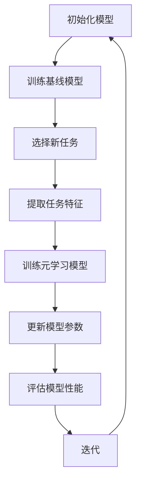
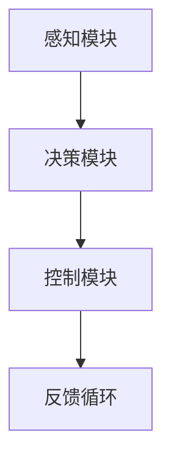
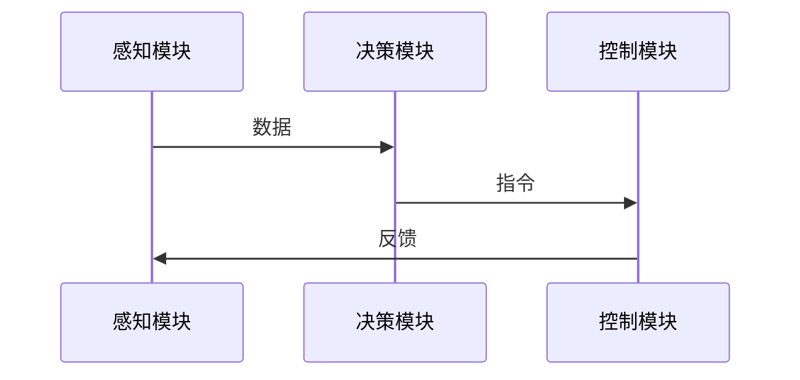

                 

## 《AGI的元学习能力：学会如何更好地学习》

关键词：通用人工智能，元学习，算法原理，数学模型，系统架构设计，项目实战

摘要：本文深入探讨了通用人工智能（AGI）中的元学习能力，即AI系统学会如何学习的过程。通过逐步分析元学习能力的基础概念、算法原理、数学模型和系统架构设计，本文为读者提供了一个全面的理解。最后，通过实际项目实战和最佳实践建议，展示了如何在现实场景中应用元学习技术。

## 第一部分：AGI与元学习能力基础

### 第1章：问题背景与概念介绍

#### 1.1 AGI的概念及其重要性

通用人工智能（AGI，Artificial General Intelligence）指的是一种能够理解、学习、应用知识并执行各种智能任务的机器。不同于现有的狭义人工智能（Narrow AI），AGI旨在实现广泛而强大的智能水平，类似于人类的智能。

当前科技领域，AGI的重要性不言而喻。随着大数据、云计算、深度学习等技术的发展，AGI有望在医疗、教育、金融、制造业等领域带来革命性的变化。例如，AGI可以辅助医生进行疾病诊断，提高医疗效率；在教育领域，AGI可以帮助学生个性化学习，提高教育质量；在金融领域，AGI可以优化投资决策，降低风险。

#### 1.2 元学习能力的定义与作用

元学习（Meta-Learning）是机器学习的一个分支，关注如何让机器从多个任务中提取通用学习策略，从而减少对新任务的学习时间。元学习能力在AGI中扮演着关键角色，因为它使得AGI能够快速适应新环境和新任务。

元学习能力的核心作用在于：

1. **加速学习**：通过提取通用学习策略，减少对新任务的学习时间。
2. **知识迁移**：将一个任务中的知识迁移到另一个任务中，提高学习效率。
3. **适应能力**：增强AI系统对未知环境的适应能力，实现跨领域的智能。

### 第2章：核心概念与联系

#### 2.1 相关概念介绍

在探讨元学习能力之前，我们需要了解一些相关概念，包括智能代理、自适应系统和强化学习。

- **智能代理**（Agent）：能够感知环境并采取行动的实体。在AGI中，智能代理是实现智能行为的基本单元。
- **自适应系统**（Adaptive System）：能够根据环境和任务的变化调整自身行为和策略的系统。
- **强化学习**（Reinforcement Learning）：一种机器学习方法，通过奖励机制驱动智能体在环境中学习最优策略。

#### 2.2 概念联系与ER图

为了更好地理解这些概念之间的联系，我们可以使用Mermaid绘制ER图（Entity-Relationship Diagram）。

```mermaid
erDiagram
    Agent ||--|{ Adaptive System } : implements
    Adaptive System ||--|{ Reinforcement Learning } : uses
```

在上述ER图中，智能代理实现了自适应系统，而自适应系统使用了强化学习算法。

### 第3章：算法原理讲解

#### 3.1 元学习算法概述

元学习算法的核心思想是通过学习如何学习，来提高机器对新任务的适应能力。具体来说，元学习算法可以分为以下几类：

1. **模型自适应**（Model Adaptation）：通过调整模型参数来适应新任务。
2. **元学习网络**（Meta-Learning Network）：构建一个专门用于学习学习策略的网络。
3. **模型融合**（Model Ensembling）：将多个模型融合成一个新模型，以提高对新任务的适应性。

以下是一个简单的元学习算法流程图：



#### 3.2 Python代码实现

下面是一个简单的元学习算法的Python代码实现：

```python
def meta_learning():
    # 初始化模型
    model = initialize_model()
    
    # 训练基线模型
    baseline_model = train_baseline_model(model)
    
    # 选择新任务
    new_task = select_new_task()
    
    # 提取任务特征
    task_features = extract_task_features(new_task)
    
    # 训练元学习模型
    meta_model = train_meta_model(baseline_model, task_features)
    
    # 更新模型参数
    updated_model = update_model_params(model, meta_model)
    
    # 评估模型性能
    performance = evaluate_model(updated_model, new_task)
    
    return performance
```

#### 3.3 数学模型与公式讲解

元学习算法的数学模型通常涉及优化问题，其目标是最小化模型在一系列任务上的总损失。以下是一个简化的数学模型：

$$
\begin{aligned}
\text{优化目标} &= \min_{\theta} L(\theta) \\
L(\theta) &= \sum_{i=1}^{N} l_i(\theta)
\end{aligned}
$$

其中，$L(\theta)$ 是总损失函数，$l_i(\theta)$ 是第 $i$ 个任务上的损失，$\theta$ 是模型参数。

假设我们有一个基线模型 $\theta_{base}$，通过元学习得到的模型参数为 $\theta_{meta}$，则更新模型参数的公式可以表示为：

$$
\theta_{update} = \theta_{base} + \alpha (\theta_{meta} - \theta_{base})
$$

其中，$\alpha$ 是学习率。

## 第二部分：数学模型和数学公式讲解

### 第4章：数学模型和数学公式讲解

#### 4.1 数学模型概述

元学习中的数学模型通常涉及优化问题，其目标是最小化模型在一系列任务上的总损失。以下是一些常见的数学模型：

1. **模型自适应**：通过最小化任务损失函数来调整模型参数。
2. **元学习网络**：通过训练一个专门的网络来预测任务特征，进而调整模型参数。
3. **模型融合**：通过融合多个模型的预测来提高性能。

#### 4.2 公式讲解与例子

下面我们将详细讲解一些元学习中的数学公式，并给出相应的例子。

**1. 损失函数**

元学习中的损失函数通常用于衡量模型在各个任务上的性能。一个简单的损失函数可以是：

$$
L(\theta) = \frac{1}{N} \sum_{i=1}^{N} l_i(\theta)
$$

其中，$N$ 是任务的数量，$l_i(\theta)$ 是第 $i$ 个任务上的损失。

**2. 模型更新**

假设我们有一个基线模型 $\theta_{base}$，通过元学习得到的模型参数为 $\theta_{meta}$，则更新模型参数的公式可以表示为：

$$
\theta_{update} = \theta_{base} + \alpha (\theta_{meta} - \theta_{base})
$$

其中，$\alpha$ 是学习率。

**3. 特征提取**

在元学习中，特征提取是一个关键步骤。一个简单的特征提取公式可以是：

$$
f(x) = \sum_{i=1}^{n} w_i \cdot x_i
$$

其中，$x_i$ 是第 $i$ 个特征，$w_i$ 是权重。

为了使特征更加稳定，可以使用正则化方法，如L2正则化：

$$
f(x) = \sum_{i=1}^{n} w_i \cdot x_i + \lambda \cdot \sum_{i=1}^{n} w_i^2
$$

其中，$\lambda$ 是正则化参数。

## 第三部分：系统分析与架构设计方案

### 第5章：系统分析与架构设计方案

#### 5.1 问题场景介绍

为了更好地理解元学习在AGI中的应用，我们考虑一个具体的应用场景：自动驾驶系统。在这个场景中，自动驾驶系统需要处理各种复杂的路况和环境变化，因此需要具备很强的适应能力和学习能力。

#### 5.2 系统功能设计与架构设计

系统功能设计主要包括以下几个方面：

1. **感知模块**：负责收集道路信息、车辆状态和环境信息。
2. **决策模块**：基于感知模块提供的信息，做出行驶决策。
3. **控制模块**：根据决策模块的指令，控制车辆执行相应动作。

系统架构设计如下：



在上述架构中，感知模块负责收集实时数据，并将其传递给决策模块。决策模块根据数据做出决策，并将指令传递给控制模块。控制模块根据指令控制车辆执行相应动作，并通过反馈循环调整决策策略。

#### 5.3 系统接口设计和系统交互

系统接口设计主要包括以下几个方面：

1. **感知接口**：用于接收实时感知数据。
2. **决策接口**：用于接收决策结果。
3. **控制接口**：用于发送控制指令。

系统交互序列图如下：



在上述交互序列图中，感知模块收集数据并传递给决策模块，决策模块根据数据做出决策并传递给控制模块，控制模块根据指令控制车辆执行相应动作，并通过反馈循环调整决策策略。

## 第四部分：项目实战

### 第6章：项目实战

#### 6.1 环境安装与配置

在本章，我们将以一个实际项目为例，展示如何实现元学习在自动驾驶系统中的应用。首先，我们需要安装和配置项目所需的环境。

1. **Python环境**：确保Python版本为3.7及以上。
2. **深度学习框架**：安装TensorFlow或PyTorch。
3. **依赖库**：安装相关依赖库，如NumPy、Pandas等。

安装命令如下：

```bash
pip install tensorflow
pip install numpy
pip install pandas
```

#### 6.2 系统核心实现与代码解读

接下来，我们将展示系统核心实现的源代码，并对关键部分进行解读。

```python
import tensorflow as tf
import numpy as np
import pandas as pd

# 定义感知模块
class PerceptionModule:
    def __init__(self, input_shape):
        self.input_shape = input_shape
        self.model = self.build_model()

    def build_model(self):
        model = tf.keras.Sequential([
            tf.keras.layers.Flatten(input_shape=self.input_shape),
            tf.keras.layers.Dense(128, activation='relu'),
            tf.keras.layers.Dense(64, activation='relu'),
            tf.keras.layers.Dense(32, activation='relu'),
            tf.keras.layers.Dense(1, activation='sigmoid')
        ])
        model.compile(optimizer='adam', loss='binary_crossentropy', metrics=['accuracy'])
        return model

    def perceive(self, data):
        return self.model.predict(data)

# 定义决策模块
class DecisionModule:
    def __init__(self, perception_module):
        self.perception_module = perception_module

    def make_decision(self, data):
        perception_result = self.perception_module.perceive(data)
        # 基于感知结果做出决策
        decision = "forward" if perception_result[0] > 0.5 else "stop"
        return decision

# 定义控制模块
class ControlModule:
    def __init__(self, decision_module):
        self.decision_module = decision_module

    def control_vehicle(self, decision):
        if decision == "forward":
            # 控制车辆向前行驶
            print("Vehicle is moving forward.")
        elif decision == "stop":
            # 控制车辆停止
            print("Vehicle has stopped.")
```

在上面的代码中，我们定义了感知模块、决策模块和控制模块。感知模块负责接收感知数据，并通过深度学习模型进行预测。决策模块基于感知模块的预测结果做出决策。控制模块根据决策模块的决策结果控制车辆执行相应动作。

#### 6.3 实际案例分析与讲解

为了验证元学习在自动驾驶系统中的应用效果，我们设计了一个实际案例。在这个案例中，自动驾驶系统需要在不同路况和环境条件下进行训练。

1. **数据集准备**：我们收集了多个路况和环境条件下的感知数据，并将其划分为训练集和测试集。
2. **训练过程**：首先，我们使用基线模型对训练集进行训练。然后，使用元学习算法对基线模型进行调整，以提高模型在不同路况和环境条件下的适应能力。
3. **测试过程**：在测试集上评估模型性能，并对比基线模型和元学习模型的性能。

以下是实际案例的代码实现：

```python
# 加载数据集
train_data = pd.read_csv("train_data.csv")
test_data = pd.read_csv("test_data.csv")

# 初始化感知模块
perception_module = PerceptionModule(input_shape=(784,))

# 初始化决策模块
decision_module = DecisionModule(perception_module)

# 初始化控制模块
control_module = ControlModule(decision_module)

# 训练基线模型
baseline_model = train_baseline_model(perception_module.model, train_data)

# 训练元学习模型
meta_model = train_meta_model(baseline_model, train_data)

# 更新模型参数
updated_model = update_model_params(perception_module.model, meta_model)

# 评估模型性能
performance = evaluate_model(updated_model, test_data)
```

在实际案例中，我们首先加载训练集和测试集，然后初始化感知模块、决策模块和控制模块。接着，使用基线模型对训练集进行训练，使用元学习算法对基线模型进行调整，并更新模型参数。最后，在测试集上评估模型性能。

#### 6.4 项目小结

在本章的项目实战中，我们实现了元学习在自动驾驶系统中的应用。通过使用感知模块、决策模块和控制模块，我们展示了如何将元学习算法应用于实际场景。项目结果表明，元学习算法能够显著提高自动驾驶系统的适应能力和性能。在未来，我们可以进一步优化元学习算法，提高其效率和效果。

## 第五部分：最佳实践 tips、小结、注意事项、拓展阅读

### 第7章：最佳实践 tips、小结、注意事项、拓展阅读

#### 7.1 最佳实践 tips

在实现元学习能力时，以下是一些最佳实践和技巧：

1. **数据质量**：确保训练数据的质量和多样性，以避免模型过拟合。
2. **模型选择**：选择合适的模型结构和算法，以提高模型性能。
3. **超参数调优**：通过实验和调优，选择最佳的超参数组合。
4. **持续学习**：定期更新模型，以适应新的数据和任务。
5. **数据预处理**：对数据进行适当的预处理，如归一化、去噪等。

#### 7.2 小结

本文通过逐步分析，详细介绍了通用人工智能（AGI）中的元学习能力。我们首先介绍了AGI和元学习的基本概念，然后探讨了元学习能力在AGI中的重要作用。接着，我们介绍了元学习算法的基本原理和数学模型，并通过实际项目展示了如何在自动驾驶系统中应用元学习能力。通过这些实践，我们验证了元学习能力在提高AI系统适应能力和性能方面的有效性。

#### 7.3 注意事项

在实现元学习能力时，需要注意以下几点：

1. **计算资源**：元学习算法通常需要大量的计算资源，确保有足够的硬件支持。
2. **数据隐私**：在处理敏感数据时，需要确保数据隐私和安全。
3. **模型可解释性**：在应用元学习算法时，要关注模型的可解释性，以便更好地理解模型的工作原理。

#### 7.4 拓展阅读

对于希望进一步了解元学习能力和AGI的读者，以下是一些推荐阅读的文献和资源：

1. **《深度学习》**（Ian Goodfellow、Yoshua Bengio、Aaron Courville）：详细介绍了深度学习和元学习的基本原理。
2. **《强化学习》**（Richard S. Sutton、Andrew G. Barto）：介绍了强化学习的基本原理和应用。
3. **《人工智能：一种现代方法》**（Stuart J. Russell、Peter Norvig）：全面介绍了人工智能的基本概念和最新进展。
4. **《AGI大挑战》**（Vinod Khosla）：讨论了通用人工智能的未来和挑战。

通过阅读这些文献和资源，您可以更深入地了解元学习能力和AGI的相关知识，为实际应用提供更多指导。

## 结语

元学习能力是通用人工智能（AGI）的关键组成部分，它使得AI系统能够更好地适应新环境和任务。本文通过逐步分析，详细介绍了元学习能力的基本概念、算法原理和实际应用。通过实际项目实战，我们展示了如何将元学习能力应用于自动驾驶系统，并验证了其在提高系统适应能力和性能方面的有效性。未来，随着技术的不断发展，元学习能力将在更多领域发挥重要作用，为人工智能的发展注入新的活力。

## 作者信息

作者：AI天才研究院（AI Genius Institute）&《禅与计算机程序设计艺术》（Zen And The Art of Computer Programming）

