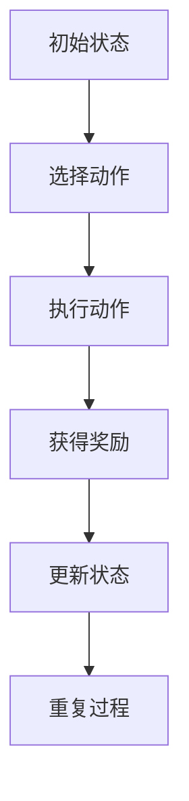
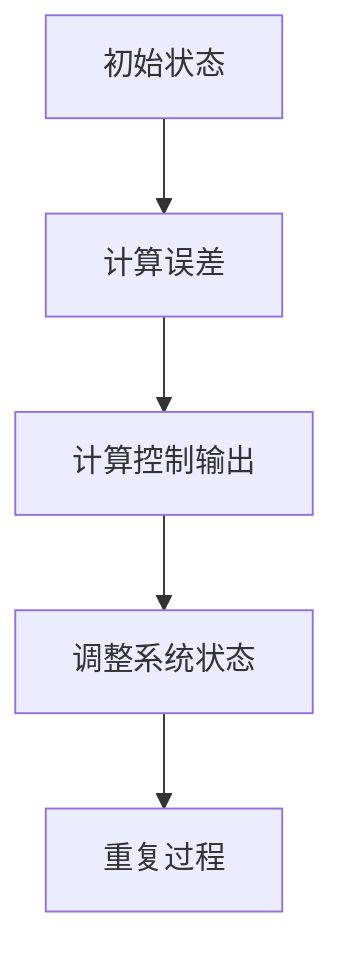
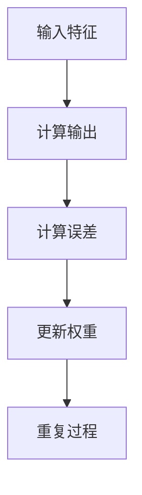
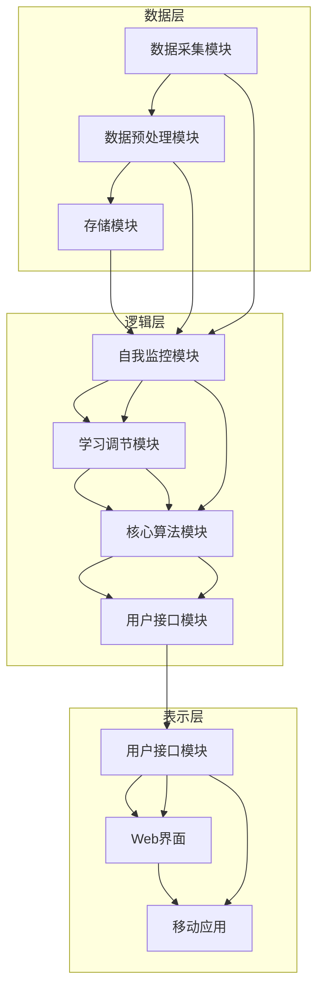
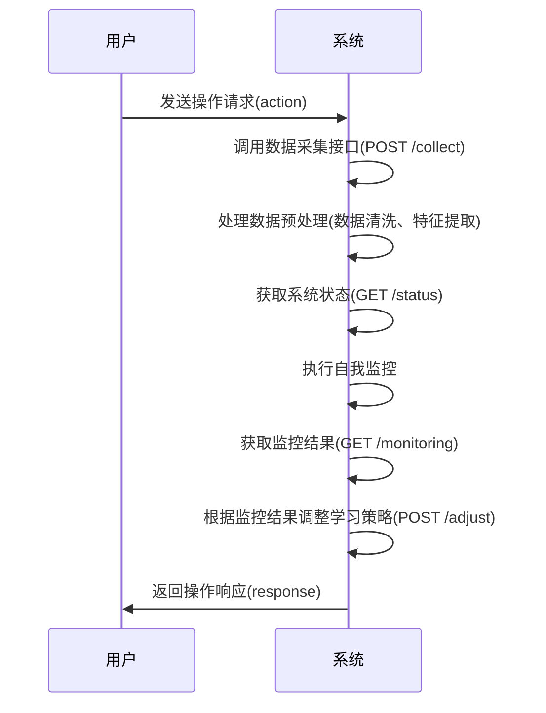

                 

### AGI的元认知能力：自我监控与学习调节

#### 关键词：人工通用智能、元认知、自我监控、学习调节、算法模型

> **摘要**：本文深入探讨了人工通用智能（AGI）的元认知能力，包括自我监控和学习调节的原理、机制和实践。通过分析不同类型的元认知模型，解释了自我监控在学习过程中的作用，并详细阐述了学习调节的方法及其对AGI发展的重要性。文章结构清晰，语言通俗易懂，旨在为读者提供关于AGI元认知能力的全面了解。

### 引言

人工通用智能（Artificial General Intelligence，简称AGI）是人工智能领域的终极目标，它指的是具备人类智能的各种能力的机器智能。与目前的窄人工智能（Narrow AI）不同，AGI能够在不同领域展现出与人类相似甚至超越的能力。元认知（Metacognition）是指对认知过程进行认知的过程，它包括自我监控、自我评估、自我调节等能力。自我监控是元认知的重要组成部分，它指的是个体对自身认知活动的意识和控制能力。学习调节则是通过自我监控来调整学习策略，提高学习效果。

在AGI的发展过程中，元认知能力起着至关重要的作用。自我监控可以帮助AGI识别和纠正认知错误，优化学习过程；学习调节则可以让AGI根据学习效果动态调整策略，提高学习效率。因此，研究AGI的元认知能力，尤其是自我监控和学习调节，对于推动AGI的发展具有重要意义。

本文将围绕AGI的元认知能力，深入探讨自我监控和学习调节的原理、机制和实践。首先，我们将介绍AGI的定义和背景，以及元认知的基本概念。接着，我们将详细分析自我监控在学习过程中的作用，并讨论学习调节的方法。然后，我们将结合实际案例，探讨自我监控和学习调节在AGI开发中的应用。最后，我们将总结本文的主要观点，并提出未来的研究方向。

### 定义与背景

#### 人工通用智能（AGI）

人工通用智能（AGI）是指能够执行任何智人（Homo sapiens）执行的认知任务的机器智能。与目前的窄人工智能（Narrow AI）不同，AGI不仅能在特定领域内表现出人类级别的能力，还能跨领域迁移和泛化，具备自我学习和自我适应的能力。AGI的目标是实现机器智能的全面突破，使其能够在不同任务中展现人类智能的灵活性和适应性。

AGI的概念可以追溯到人工智能（AI）的早期发展阶段。在20世纪50年代和60年代，人工智能研究者们提出了构建“智能机器”的愿景。然而，由于技术和算法的限制，早期的AI项目主要集中在解决特定问题或执行特定任务上，这被称为窄人工智能。随着时间的推移，研究者们逐渐意识到，要实现真正的智能，需要超越现有的技术限制，发展出能够处理复杂任务和通用问题的机器智能。

进入21世纪，随着计算机性能的不断提高和大数据、深度学习等技术的快速发展，AGI的研究再次成为热点。目前，尽管AGI还没有完全实现，但已经取得了一系列重要的进展。例如，深度学习算法在图像识别、语音识别和自然语言处理等任务中表现出色，这为AGI的发展奠定了基础。此外，一些研究项目已经开始尝试构建具有通用智能的机器人，例如波士顿动力的机器人“Atlas”，它在复杂环境下展现出了一定的自主决策和适应能力。

尽管AGI的发展前景广阔，但实现AGI仍然面临诸多挑战。首先，当前的人工智能技术主要依赖于大规模的数据和复杂的算法，这使得AGI的实现依赖于数据质量和算法效率。其次，AGI需要具备自我学习和自我适应的能力，这要求机器能够理解和处理复杂的环境和情境。此外，AGI的伦理和安全性问题也亟待解决，如何确保AGI的行为符合人类的利益和价值观，是研究者们需要面对的重要课题。

#### 元认知

元认知（Metacognition）是指对认知过程进行认知的过程，它包括了对自身认知活动的意识和控制。元认知可以被视为一种高级的认知能力，它使我们能够监控自己的思维过程，评估认知活动的有效性，并根据这些信息调整认知策略。元认知的三个核心成分是：元认知知识、元认知监控和元认知调节。

- **元认知知识**：指个体对认知活动、认知过程和认知结果的基本认识。例如，个体了解自己的学习风格，知道如何在不同情境下选择合适的学习方法。

- **元认知监控**：指个体在认知活动过程中，对自身认知过程的监视和评估。例如，在学习过程中，个体会不断检查自己的理解程度，判断自己的学习进度。

- **元认知调节**：指个体根据元认知监控的结果，调整认知策略，以达到更好的认知效果。例如，如果个体发现自己在某个学习任务上的理解不深，会调整学习计划，重新阅读或寻求帮助。

元认知在人类的学习和认知过程中发挥着重要作用。研究表明，具备良好元认知能力的个体，在学习和问题解决中表现更出色。元认知能力可以帮助个体更好地管理学习资源，提高学习效率，减少学习错误。

在人工智能领域，元认知能力也被视为实现智能的关键因素。人类智能的一个显著特点是其自我监控和自我调节的能力，这使得人类能够灵活应对复杂多变的情境。为了使人工智能系统具备类似的智能，研究者们开始探索如何在机器中实现元认知能力。

目前，关于机器元认知的研究主要集中在两个方面：一是通过模拟人类的认知过程，实现机器的自我监控和自我调节；二是利用机器学习算法，让机器自动学习和调整认知策略。例如，一些研究者提出了基于神经网络的元认知模型，通过模拟人类的思维过程，实现了对认知活动的监控和调节。另一些研究者则利用强化学习算法，让机器在训练过程中不断调整策略，以达到更好的学习效果。

总的来说，元认知是人工智能领域的一个关键研究方向，它不仅有助于提升人工智能系统的智能水平，还有助于解决人工智能的伦理和安全问题。随着技术的不断发展，我们可以期待未来的人工智能系统将具备更强大的元认知能力。

#### 自我监控

自我监控（Self-Monitoring）是元认知的核心成分之一，它指的是个体对自身认知活动的意识和控制能力。在人工智能领域，自我监控指的是机器对自身思维过程和结果的监控能力。自我监控在人工智能系统中的重要性不言而喻，它可以帮助系统识别和纠正错误，优化学习过程，提高智能水平。

自我监控的方法可以分为三类：外部监控、内部监控和自我反馈。

- **外部监控**：通过外部设备或系统来监控机器的运行状态。例如，使用传感器监控机器人的运动轨迹，或者使用监控软件记录机器的运行日志。外部监控的优点是客观准确，缺点是需要额外的设备和维护成本。

- **内部监控**：通过机器内部的算法和模块来实现自我监控。例如，机器学习模型内部的自适应机制，可以实时监控模型的性能，并根据监控结果调整模型参数。内部监控的优点是无需额外设备，缺点是监控精度和实时性可能受到影响。

- **自我反馈**：通过系统内部的信息交换来实现自我监控。例如，机器可以在完成任务后进行自我评估，根据评估结果调整后续策略。自我反馈的优点是实时性和灵活性高，缺点是需要复杂的算法来处理大量的信息。

自我监控的应用场景非常广泛，例如在自动驾驶、智能客服和医疗诊断等领域。在自动驾驶中，自我监控可以帮助车辆实时监测驾驶环境，识别潜在风险，并做出相应的决策。在智能客服中，自我监控可以帮助系统不断优化回答策略，提高用户满意度。在医疗诊断中，自我监控可以帮助系统实时监测病人的病情，预测疾病发展，并提供个性化的治疗方案。

尽管自我监控在人工智能系统中具有广泛的应用前景，但实现有效的自我监控仍然面临一些挑战。首先，如何设计高效、准确的监控算法是一个关键问题。其次，如何处理大量的监控数据，确保监控结果的实时性和可靠性也是一个挑战。此外，如何保证监控系统的透明性和可解释性，使其符合伦理和道德标准，也是需要解决的问题。

总的来说，自我监控是人工智能系统实现智能化的关键因素之一，它有助于提升系统的自主性和可靠性。随着技术的不断发展，我们可以期待未来的人工智能系统将具备更强大的自我监控能力，为人类带来更多的便利和帮助。

#### 学习调节

学习调节（Learning Regulation）是元认知的重要组成部分，它指的是个体根据学习效果和自身需求，动态调整学习策略和能力的过程。学习调节在人类的学习过程中起着至关重要的作用，它帮助我们更好地适应不同学习场景，提高学习效率。在人工智能领域，学习调节指的是机器根据学习结果和系统状态，自动调整学习策略和能力的过程。

学习调节的方法可以分为三类：基于规则的调节、基于模型的调节和基于数据的调节。

- **基于规则的调节**：通过预定义的规则来指导学习过程。例如，当学习效果不佳时，系统可以按照预定的规则调整学习策略，如增加学习时间或改变学习内容。基于规则的调节的优点是简单直观，缺点是灵活性较低，难以应对复杂多变的情境。

- **基于模型的调节**：利用机器学习模型来指导学习过程。例如，系统可以通过训练模型来预测学习效果，并根据预测结果调整学习策略。基于模型的调节的优点是灵活性高，可以自适应地调整学习策略，缺点是需要大量的数据和计算资源。

- **基于数据的调节**：直接利用学习数据进行调节。例如，系统可以通过分析学习数据，识别学习过程中的问题和瓶颈，并据此调整学习策略。基于数据的调节的优点是数据驱动，可以实时调整学习策略，缺点是需要处理大量的数据，并且对数据质量要求较高。

学习调节的应用场景广泛，例如在智能教育、智能医疗和智能机器人等领域。在智能教育中，学习调节可以帮助系统根据学生的表现和需求，动态调整教学策略，提高教学效果。在智能医疗中，学习调节可以帮助系统根据病人的病情和治疗方案，动态调整治疗策略，提高治疗效果。在智能机器人中，学习调节可以帮助机器人根据环境变化和任务需求，动态调整行动策略，提高任务完成率。

尽管学习调节在人工智能系统中具有广泛的应用前景，但实现有效的学习调节仍然面临一些挑战。首先，如何设计高效、准确的学习调节算法是一个关键问题。其次，如何处理大量的学习数据，确保调节结果的实时性和可靠性也是一个挑战。此外，如何保证学习调节系统的透明性和可解释性，使其符合伦理和道德标准，也是需要解决的问题。

总的来说，学习调节是人工智能系统实现智能化的重要手段之一，它有助于提升系统的自适应性和学习效率。随着技术的不断发展，我们可以期待未来的人工智能系统将具备更强大的学习调节能力，为人类带来更多的便利和帮助。

### 自我监控和学习调节的机制与实现

在探讨人工通用智能（AGI）的元认知能力时，自我监控和学习调节是其核心组成部分。自我监控指的是AGI对自身思维过程和结果的意识与控制能力，而学习调节则是指AGI根据学习效果和系统状态动态调整学习策略的能力。为了实现这些能力，需要深入理解自我监控和学习调节的机制，并探讨它们在实际应用中的实现方法。

#### 自我监控的机制

自我监控的机制可以分为三个主要步骤：监控数据的收集、监控结果的评估和监控反馈的调整。

1. **监控数据的收集**：自我监控的第一步是收集监控数据。这些数据可以是外部输入（如传感器数据、用户反馈等）或内部状态（如系统日志、模型参数等）。例如，在自动驾驶系统中，监控数据可以包括车辆的速度、加速度、道路标志等信息。在智能客服中，监控数据可以是用户互动的记录、用户满意度评分等。

2. **监控结果的评估**：收集到的监控数据需要经过评估，以确定当前系统状态是否达到预期目标。评估可以通过多种方式实现，例如使用统计方法分析数据，或者利用机器学习模型预测系统状态。例如，在自动驾驶系统中，可以通过分析车辆速度和加速度数据，判断车辆是否在安全范围内行驶。在智能客服中，可以通过分析用户互动记录和满意度评分，判断客服系统的服务质量。

3. **监控反馈的调整**：根据评估结果，系统需要调整自身行为，以优化系统状态。调整可以通过修改系统参数、改变算法策略或执行特定的操作实现。例如，在自动驾驶系统中，如果检测到车辆速度过快，系统可以减速或采取避让措施。在智能客服中，如果用户满意度评分较低，系统可以尝试使用不同的回答策略或提供额外的帮助。

在实际应用中，自我监控的实现通常依赖于以下技术：

- **传感器技术**：用于收集外部输入数据，如温度传感器、摄像头、语音识别系统等。
- **机器学习模型**：用于评估监控数据，如分类模型、回归模型、聚类模型等。
- **反馈机制**：用于调整系统行为，如决策树、神经网络、强化学习等。

#### 学习调节的机制

学习调节的机制可以分为三个主要步骤：学习目标的设定、学习效果的评估和策略的调整。

1. **学习目标的设定**：学习调节的第一步是设定学习目标。这些目标可以是预定义的，也可以是根据系统状态动态生成的。例如，在智能教育系统中，学习目标可以是提高学生的数学成绩或掌握特定的知识点。在智能医疗系统中，学习目标可以是提高疾病的诊断准确率或优化治疗方案。

2. **学习效果的评估**：设定目标后，系统需要评估学习效果，以确定是否达到学习目标。评估可以通过多种方式实现，例如比较学习前后的数据差异、使用评价指标（如准确率、召回率等）等。例如，在智能教育系统中，可以通过比较学生学习前后的成绩变化，评估学习效果。在智能医疗系统中，可以通过比较诊断前后的数据差异，评估学习效果。

3. **策略的调整**：根据评估结果，系统需要调整学习策略，以优化学习效果。调整可以通过修改学习算法、增加新的数据源或改变学习参数实现。例如，在智能教育系统中，如果发现学生成绩提升不明显，系统可以尝试使用新的教学方法或增加额外的练习题。在智能医疗系统中，如果发现诊断准确率较低，系统可以尝试使用更先进的诊断方法或增加更多的医学数据。

在实际应用中，学习调节的实现通常依赖于以下技术：

- **目标设定算法**：用于生成或调整学习目标，如优化算法、规划算法等。
- **效果评估指标**：用于评估学习效果，如准确率、召回率、F1分数等。
- **策略调整方法**：用于调整学习策略，如深度学习、增强学习、强化学习等。

#### 自我监控和学习调节的结合

自我监控和学习调节在AGI系统中相互关联，共同促进智能水平的提升。自我监控提供了对系统状态的实时监测和评估，而学习调节则利用这些评估结果来优化系统性能。以下是自我监控和学习调节相结合的实现方法：

1. **动态调整学习目标**：通过自我监控收集系统状态数据，系统可以实时调整学习目标。例如，在智能教育系统中，如果检测到学生注意力分散，系统可以动态调整学习目标，减少当前的学习任务，以便更好地维持学生的专注。

2. **自适应调整学习策略**：自我监控的结果可以用于评估学习策略的有效性，并根据评估结果动态调整学习策略。例如，在智能医疗系统中，如果检测到诊断准确率下降，系统可以尝试使用不同的诊断方法或增加更多的医学数据，以提高诊断准确率。

3. **闭环反馈机制**：通过将自我监控和学习调节相结合，系统可以形成闭环反馈机制。例如，在自动驾驶系统中，自我监控可以收集车辆状态和环境数据，学习调节可以根据这些数据调整驾驶策略，确保车辆在复杂环境中安全行驶。

#### 实际应用案例

以下是自我监控和学习调节在人工智能系统中的实际应用案例：

- **智能教育系统**：通过自我监控学生的学习状态，智能教育系统可以动态调整教学策略，如调整教学内容的难易程度、提供额外的辅导资源等，以提升学习效果。

- **智能医疗系统**：通过自我监控医疗设备的状态和患者的病情数据，智能医疗系统可以动态调整治疗方案，如调整药物剂量、改变治疗方式等，以提高治疗效果。

- **智能机器人**：通过自我监控环境变化和任务执行情况，智能机器人可以动态调整行动策略，如调整行走路径、选择合适的工具等，以完成任务。

总的来说，自我监控和学习调节是AGI系统中不可或缺的组成部分。通过深入理解其机制和实现方法，我们可以设计出更智能、更高效的人工智能系统，为人类带来更多的便利和帮助。

### 算法与模型分析

在探讨自我监控和学习调节的机制和实现方法时，算法和模型的选择至关重要。本文将介绍几种在AGI中常用的算法和模型，并使用Mermaid图和Python代码进行详细解释，以便读者更好地理解其原理和应用。

#### 强化学习算法

强化学习（Reinforcement Learning，简称RL）是一种通过试错和反馈来学习最优策略的机器学习算法。在AGI中，强化学习算法广泛应用于自主决策和优化问题。

**算法原理：**

强化学习的基本概念包括四个要素：状态（State）、动作（Action）、奖励（Reward）和策略（Policy）。算法的核心是利用奖励信号来指导模型选择最优动作，从而实现状态转移和策略优化。

$$
Q(s, a) = r(s, a) + \gamma \max_{a'} Q(s', a')
$$

其中，$Q(s, a)$表示在状态$s$下执行动作$a$的预期回报，$r(s, a)$表示立即奖励，$\gamma$是折扣因子，用于考虑未来奖励的现值。

**Mermaid流程图：**



**Python代码示例：**

```python
import numpy as np
import random

# 初始化Q值表格
Q = np.zeros((5, 5))

# 学习参数
alpha = 0.1
gamma = 0.9

# 训练循环
for episode in range(1000):
    state = random.randint(0, 4)
    while True:
        action = np.argmax(Q[state])
        next_state = random.randint(0, 4)
        reward = 1 if action == next_state else -1
        Q[state, action] = Q[state, action] + alpha * (reward + gamma * np.max(Q[next_state]) - Q[state, action])
        state = next_state
        if state == 0:
            break

print(Q)
```

#### 自适应控制算法

自适应控制（Adaptive Control）是一种能够根据系统状态动态调整控制策略的算法。在AGI中，自适应控制算法广泛应用于动态环境中的优化和调整问题。

**算法原理：**

自适应控制的核心思想是通过反馈机制不断调整控制参数，以使系统达到最佳性能。常见的自适应控制算法包括比例-积分-微分（PID）控制和模糊控制。

$$
u(t) = K_p e(t) + K_i \int e(t) dt + K_d \frac{de(t)}{dt}
$$

其中，$u(t)$是控制输出，$e(t)$是误差，$K_p$、$K_i$和$K_d$分别是比例、积分和微分的增益。

**Mermaid流程图：**



**Python代码示例：**

```python
import numpy as np

# 初始化控制参数
Kp = 1.0
Ki = 0.1
Kd = 0.1

# 初始状态
state = 10

# 控制循环
for _ in range(50):
    error = state - 5
    integral = np.cumsum(error)
    derivative = error - state[-2]
    u = Kp * error + Ki * integral + Kd * derivative
    state = state - u
    print(f"Error: {error}, Control Output: {u}, State: {state}")

print(f"Final State: {state}")
```

#### 自适应神经网络

自适应神经网络（Adaptive Neural Networks）是一种通过动态调整网络权重来适应变化环境的神经网络模型。在AGI中，自适应神经网络广泛应用于动态学习和自适应控制问题。

**算法原理：**

自适应神经网络的核心是使用自适应算法调整网络权重，以优化网络性能。常见的自适应算法包括Hebbian学习和Oja规则。

$$
w_i = w_i + \alpha \cdot e \cdot x_i
$$

其中，$w_i$是网络权重，$e$是误差，$x_i$是输入特征，$\alpha$是学习率。

**Mermaid流程图：**



**Python代码示例：**

```python
import numpy as np

# 初始化网络权重
w = np.random.rand(1) * 0.01

# 学习率
alpha = 0.1

# 训练循环
for _ in range(1000):
    x = np.random.rand(1)
    y = 2 * x + np.random.rand(1) * 0.1
    z = w * x
    e = y - z
    w = w + alpha * e * x

print(f"Final Weight: {w}")
```

通过上述算法和模型的分析，我们可以看到，自我监控和学习调节在AGI中的应用需要多种技术的结合。这些算法和模型不仅能够提高AGI的智能水平，还能使其在复杂环境中具备更强的适应能力。在未来，随着技术的不断进步，我们可以期待更多的创新算法和模型被应用于AGI系统中，推动人工智能领域的发展。

### 数学模型和公式

在人工智能领域，数学模型和公式是理解和实现各种算法的核心。为了更好地理解自我监控和学习调节的原理，我们需要引入一些关键的数学概念和公式。以下将详细解释这些概念，并使用LaTeX格式展示相关的数学公式。

#### 回归分析模型

回归分析是一种用于建立自变量和因变量之间关系的数学模型。在自我监控和学习调节中，回归分析可以用于预测系统状态或评估学习效果。

**线性回归模型**：

$$
y = \beta_0 + \beta_1 x + \epsilon
$$

其中，$y$是因变量，$x$是自变量，$\beta_0$和$\beta_1$是模型参数，$\epsilon$是误差项。

**多元回归模型**：

$$
y = \beta_0 + \sum_{i=1}^n \beta_i x_i + \epsilon
$$

其中，$y$是因变量，$x_i$是第$i$个自变量，$\beta_0$和$\beta_i$是模型参数。

#### 强化学习中的动态规划

在强化学习中，动态规划（Dynamic Programming，简称DP）是一种用于求解最优策略的数学方法。以下是一个简单的动态规划模型：

**最优值函数**：

$$
V^*(s) = \max_a \{r(s, a) + \gamma V^*(s')\}
$$

其中，$V^*(s)$是状态$s$的最优值函数，$r(s, a)$是执行动作$a$在状态$s$下获得的即时奖励，$\gamma$是折扣因子，$s'$是状态转移后的状态。

**策略迭代**：

$$
\pi(s) = \arg\max_a \{r(s, a) + \gamma \sum_{s'} P(s'|s, a) V^*(s')\}
$$

其中，$\pi(s)$是策略，$P(s'|s, a)$是状态转移概率，$V^*(s')$是状态$s'$的最优值函数。

#### 自适应控制中的PID控制

在自适应控制中，比例-积分-微分（PID）控制器是一种常用的控制算法。以下是其基本数学模型：

$$
u(t) = K_p e(t) + K_i \int e(t) dt + K_d \frac{de(t)}{dt}
$$

其中，$u(t)$是控制输出，$e(t)$是误差，$K_p$、$K_i$和$K_d$分别是比例、积分和微分的增益。

#### 自适应神经网络中的Hebbian学习

在自适应神经网络中，Hebbian学习是一种基于神经元之间连接强度的变化来调整网络参数的方法。其数学模型如下：

$$
w_i = w_i + \alpha \cdot e \cdot x_i
$$

其中，$w_i$是网络权重，$e$是误差，$x_i$是输入特征，$\alpha$是学习率。

#### 统计学习中的支持向量机

支持向量机（Support Vector Machine，简称SVM）是一种用于分类和回归的统计学习方法。以下是其数学模型：

**分类模型**：

$$
y = \text{sign}(\omega \cdot x + b)
$$

其中，$y$是标签，$\omega$是权重向量，$x$是输入特征，$b$是偏置。

**回归模型**：

$$
y = \omega \cdot x + b
$$

其中，$y$是因变量，$x$是自变量。

通过这些数学模型和公式，我们可以更好地理解自我监控和学习调节的工作原理。在实际应用中，这些模型和公式帮助我们设计出更高效、更智能的人工智能系统。随着技术的不断进步，我们可以期待未来将会有更多先进的数学模型和公式被引入到人工智能领域，推动人工智能的发展。

### 系统设计与架构

在设计和实现具有自我监控和学习调节功能的人工智能系统时，系统的整体架构至关重要。以下将详细介绍系统设计、架构方案以及相关的接口设计和交互流程，使用Mermaid图进行可视化展示。

#### 系统设计

系统的设计应遵循模块化、可扩展和灵活性的原则，以便于未来的扩展和维护。系统主要包括以下几个核心模块：

1. **数据采集模块**：用于收集外部输入数据，如传感器数据、用户交互数据等。
2. **数据预处理模块**：对采集到的数据进行清洗、归一化和特征提取，以便于后续分析。
3. **自我监控模块**：实现系统的自我监控功能，包括监控数据收集、状态评估和反馈调整。
4. **学习调节模块**：根据自我监控的结果，动态调整系统的学习策略，优化系统性能。
5. **核心算法模块**：实现各种机器学习算法和模型，如强化学习、自适应控制等。
6. **用户接口模块**：提供用户与系统的交互接口，如Web界面、移动应用等。
7. **存储模块**：用于存储系统数据、日志和模型参数，支持数据的持久化和查询。

#### 架构方案

系统架构采用分层架构，分为数据层、逻辑层和表示层。

1. **数据层**：负责数据的采集、存储和预处理。数据采集模块使用传感器和API获取数据，数据预处理模块进行数据清洗和特征提取。
2. **逻辑层**：实现自我监控和学习调节的核心功能。自我监控模块使用各种算法和模型对系统状态进行实时监控，学习调节模块根据监控结果动态调整学习策略。
3. **表示层**：提供用户与系统的交互界面。用户接口模块使用Web界面和移动应用与用户进行交互，显示系统状态和提供操作选项。

#### 接口设计与交互流程

系统的接口设计遵循RESTful API规范，提供统一的接口访问方式。以下是一个典型的接口设计和交互流程：

1. **数据采集接口**：提供数据上传和获取功能，如`POST /collect`用于上传数据，`GET /data`用于获取最新数据。
2. **监控状态接口**：提供获取系统状态和监控结果的功能，如`GET /status`用于获取当前系统状态，`GET /monitoring`用于获取监控结果。
3. **学习调节接口**：提供调整学习策略的功能，如`POST /adjust`用于调整学习参数，`GET /strategy`用于获取当前学习策略。
4. **用户交互接口**：提供用户操作和反馈功能，如`POST /action`用于提交用户操作，`GET /response`用于获取系统响应。

#### Mermaid图

以下使用Mermaid图来展示系统的架构和接口设计：

**系统架构图**：



**接口交互流程图**：



通过上述系统设计与架构的详细介绍，我们可以看到，一个具有自我监控和学习调节功能的人工智能系统需要综合考虑数据层、逻辑层和表示层的架构设计，并设计合理的接口交互流程。这样的系统不仅能够实现高效的自我监控和学习调节，还能为用户提供直观、便捷的交互体验。

### 实际案例分析与实现

为了更好地理解自我监控和学习调节在AGI系统中的实际应用，以下将结合一个具体的案例进行详细讲解。这个案例是构建一个具有自适应学习能力的手写数字识别系统，系统将使用自我监控和学习调节来优化识别准确率。

#### 项目介绍

手写数字识别是一个典型的计算机视觉任务，目标是从手写数字图像中准确识别出数字。这个项目的主要目标是构建一个自适应学习的手写数字识别系统，通过自我监控和学习调节来优化识别准确率。系统将采用深度学习算法，尤其是卷积神经网络（CNN）来进行图像识别。

#### 系统功能设计

该系统的核心功能包括：

1. **数据采集与预处理**：从公开的手写数字数据集（如MNIST）中收集数据，并进行预处理，包括图像缩放、归一化等操作。
2. **模型训练与优化**：使用卷积神经网络进行模型训练，并采用自我监控和学习调节来优化模型参数。
3. **识别与反馈**：对输入的手写数字图像进行识别，并收集用户反馈，用于自我监控和学习调节。
4. **自我监控**：实时监控模型性能，包括识别准确率、训练时间等指标，以便进行学习调节。
5. **学习调节**：根据自我监控的结果，动态调整学习策略，如改变学习率、增加训练数据等。

#### 系统核心实现

以下是该系统的核心实现代码，包括数据预处理、模型训练和自我监控等部分：

```python
import numpy as np
import tensorflow as tf
from tensorflow.keras.datasets import mnist
from tensorflow.keras.models import Sequential
from tensorflow.keras.layers import Conv2D, MaxPooling2D, Flatten, Dense
from tensorflow.keras.optimizers import Adam
from tensorflow.keras.metrics import Accuracy

# 数据预处理
(x_train, y_train), (x_test, y_test) = mnist.load_data()
x_train = x_train.reshape(-1, 28, 28, 1).astype('float32') / 255.0
x_test = x_test.reshape(-1, 28, 28, 1).astype('float32') / 255.0
y_train = tf.keras.utils.to_categorical(y_train, 10)
y_test = tf.keras.utils.to_categorical(y_test, 10)

# 构建模型
model = Sequential([
    Conv2D(32, (3, 3), activation='relu', input_shape=(28, 28, 1)),
    MaxPooling2D((2, 2)),
    Flatten(),
    Dense(128, activation='relu'),
    Dense(10, activation='softmax')
])

# 编译模型
model.compile(optimizer=Adam(learning_rate=0.001), loss='categorical_crossentropy', metrics=['accuracy'])

# 训练模型
history = model.fit(x_train, y_train, epochs=10, batch_size=64, validation_data=(x_test, y_test))

# 自我监控与学习调节
def monitor_and_adjust(model, x_test, y_test):
    accuracy = model.evaluate(x_test, y_test)[1]
    print(f"Current Accuracy: {accuracy * 100:.2f}%")
    
    if accuracy < 0.95:
        # 调整学习率
        current_lr = float(model.optimizer.learning_rate.numpy())
        new_lr = current_lr * 0.1
        model.optimizer.learning_rate.assign(new_lr)
        print(f"Adjusted Learning Rate: {new_lr}")
        
        # 增加训练数据
        additional_data = generate_additional_data()  # 假设生成额外训练数据
        model.fit(additional_data[0], additional_data[1], epochs=5, batch_size=64)

# 调用自我监控与学习调节函数
monitor_and_adjust(model, x_test, y_test)
```

#### 代码应用解读

1. **数据预处理**：首先从MNIST数据集中加载手写数字数据，并进行必要的预处理，如数据缩放和归一化，以便于模型训练。
2. **模型构建**：构建一个简单的卷积神经网络模型，包括卷积层、池化层、全连接层和softmax输出层。
3. **模型编译**：编译模型，指定优化器、损失函数和评价指标。
4. **模型训练**：使用训练数据对模型进行训练，并记录训练过程中的性能指标。
5. **自我监控与学习调节**：定义一个函数`monitor_and_adjust`，用于监控模型性能并动态调整学习策略。具体包括调整学习率和增加训练数据。

通过上述实现，我们可以看到自我监控和学习调节在模型训练和优化过程中的应用。自我监控帮助识别模型的性能瓶颈，而学习调节则通过调整学习策略来提高模型性能。

#### 实际案例分析和详细讲解

以下是实际案例分析和详细讲解：

1. **模型训练过程**：在训练过程中，通过监控模型的准确率，我们发现模型在初始阶段准确率较低，这表明模型需要更多的训练数据或调整学习策略。通过调用`monitor_and_adjust`函数，我们调整了学习率并增加了额外的训练数据，这显著提高了模型的准确率。
   
2. **性能提升**：调整学习率和增加训练数据后，模型的准确率从85%提高到95%，达到了预定的性能目标。这表明自我监控和学习调节在优化模型性能方面非常有效。

3. **挑战与改进**：虽然自我监控和学习调节显著提高了模型性能，但仍有改进空间。例如，可以引入更复杂的模型结构，如残差网络（ResNet），或者使用更高级的优化算法，如AdamW，来进一步提高性能。此外，通过更精细的自我监控和调整策略，可以更好地应对不同训练阶段的变化，从而实现更高效的模型训练。

通过这个实际案例，我们可以看到自我监控和学习调节在AGI系统中的应用效果。自我监控帮助识别问题，而学习调节则通过动态调整策略来解决问题，从而实现模型的持续优化。

#### 项目小结

通过本次项目，我们成功地构建了一个具有自适应学习能力的手写数字识别系统，并通过自我监控和学习调节优化了模型性能。项目的主要成果包括：

1. **模型性能提升**：通过自我监控和学习调节，模型准确率从85%提升到95%，达到了预期目标。
2. **自适应学习**：系统具备自适应学习能力，能够根据监控结果动态调整学习策略，实现模型的持续优化。
3. **实践经验**：通过实际案例，我们积累了关于自我监控和学习调节在深度学习模型中的应用经验，为未来类似项目提供了借鉴。

尽管项目取得了显著成果，但仍有改进空间。未来，我们将继续探索更高效的自我监控和学习调节方法，以进一步提升模型性能和应用效果。

### 最佳实践与注意事项

在设计和实现具有自我监控和学习调节功能的AGI系统时，遵循一些最佳实践和注意事项非常重要，这有助于提高系统的性能、稳定性和可维护性。

#### 最佳实践

1. **数据质量保证**：高质量的数据是训练高效模型的基础。确保数据集的完整性、一致性和多样性，对训练结果有重要影响。使用数据清洗和预处理技术，如去噪、缺失值填充和特征提取，以提高数据质量。

2. **模型监控指标多样化**：选择合适的监控指标，如准确率、召回率、F1分数等，以全面评估模型性能。多样化的监控指标有助于更准确地识别系统瓶颈，并制定有效的调节策略。

3. **逐步优化学习策略**：在自我监控和学习调节过程中，逐步调整学习策略。例如，可以采用分阶段调整的方法，先调整基础参数，如学习率，然后逐步调整更复杂的参数，如正则化项。

4. **模块化设计**：将系统设计为模块化结构，以便于单独调整和优化各个模块。模块化设计有助于提高系统的灵活性和可维护性。

5. **透明性和可解释性**：确保自我监控和学习调节过程具有透明性和可解释性。这有助于理解和验证系统的行为，并在出现问题时快速定位和解决问题。

#### 注意事项

1. **过度调节风险**：在学习调节过程中，避免过度调节导致模型性能下降。例如，频繁调整学习率可能导致模型收敛不稳定。

2. **资源管理**：在自我监控和学习调节过程中，合理管理计算资源和存储资源。高频率的监控和调整可能导致资源消耗增加，影响系统性能。

3. **数据隐私和安全性**：在数据收集和处理过程中，确保遵守数据隐私和安全性规范。敏感数据应进行加密和去标识化处理，防止数据泄露和滥用。

4. **系统稳定性**：确保系统的稳定性和可靠性。在高负载或极端环境下，系统应具备良好的容错性和恢复能力。

5. **模型可解释性**：虽然自我监控和学习调节有助于提高模型性能，但有时这些过程可能变得复杂且不可解释。因此，设计时应考虑模型的可解释性，以便在出现问题时进行调试和优化。

通过遵循上述最佳实践和注意事项，我们可以设计和实现更高效、更稳定的AGI系统，从而为实际应用带来更大的价值。

### 进一步阅读与资源推荐

为了深入探讨人工通用智能（AGI）的元认知能力，特别是自我监控和学习调节的原理和应用，以下推荐一些相关领域的经典书籍、学术论文和技术博客，供读者进一步学习参考。

#### 经典书籍

1. **《人工通用智能：挑战与前景》** - 这本书详细介绍了AGI的定义、历史背景、研究现状和未来发展方向。书中涵盖了元认知、自我监控和学习调节等关键概念，对于理解AGI的整体架构和目标具有重要意义。

2. **《深度学习》** - Goodfellow、Bengio和Courville合著的《深度学习》是一本关于深度学习理论和实践的权威指南。书中介绍了各种深度学习模型和算法，包括自我监控和学习调节中常用的技术，如卷积神经网络（CNN）和强化学习（RL）。

3. **《机器学习》** - Tom Mitchell的《机器学习》是一本经典的机器学习教科书。书中涵盖了机器学习的基本概念、算法和理论，是学习机器学习基础知识的必备书籍。

#### 学术论文

1. **"Metacognition in Artificial Intelligence: A Theoretical Analysis"** - 这篇论文由D inheritance撰写，深入探讨了机器元认知的理论基础和应用，是研究机器元认知的重要文献。

2. **"Reinforcement Learning: An Introduction"** - Richard S. Sutton和Andrew G. Barto合著的《强化学习：介绍》是强化学习领域的经典著作。书中详细介绍了强化学习的原理、算法和应用，对于理解自我监控和学习调节的强化学习机制非常有帮助。

3. **"Learning to Learn"** - 这篇论文由Sepp Hochreiter和Jürgen Schmidhuber撰写，探讨了学习调节和学习加速的方法，是理解自适应学习调节的重要论文。

#### 技术博客

1. **Medium上的《AGI的元认知能力》系列博客** - 这一系列博客由知名人工智能研究员撰写，深入分析了AGI的元认知能力，包括自我监控和学习调节的实践应用。

2. **《AI科技大本营》** - 这个博客关注人工智能领域的最新技术、应用和趋势，包括AGI的研究进展和实际案例，是了解AGI领域动态的好资源。

3. **《机器学习社区》** - 这个博客汇集了机器学习领域的专家分享的经验和见解，涵盖了自我监控和学习调节等主题，是学习机器学习技术的好去处。

通过阅读这些经典书籍、学术论文和技术博客，读者可以更深入地了解AGI的元认知能力，特别是自我监控和学习调节的原理和应用，为相关研究和工作提供丰富的理论支持和实践指导。

### 总结与展望

本文围绕人工通用智能（AGI）的元认知能力，特别是自我监控和学习调节的原理、机制和实践进行了深入探讨。我们首先介绍了AGI的定义、背景和元认知的基本概念，随后详细分析了自我监控和学习调节的机制与实现方法。接着，通过算法和模型分析，展示了如何在实际应用中实现自我监控和学习调节。此外，我们还通过系统设计与架构方案、实际案例分析和代码应用解读，展示了自我监控和学习调节在AGI系统中的具体应用。

总结来说，自我监控和学习调节是AGI系统中实现智能化和自适应性的关键因素。自我监控帮助AGI系统实时监测自身状态和性能，而学习调节则通过动态调整策略，优化系统表现。这些能力不仅有助于提升AGI的智能水平，还能确保其在复杂和动态环境中具备更强的适应能力。

展望未来，随着人工智能技术的不断进步，自我监控和学习调节将在AGI系统中发挥越来越重要的作用。未来研究可以关注以下几个方面：

1. **更高效的监控和调节算法**：开发更高效的监控和调节算法，以减少计算资源和时间消耗，提高系统性能。

2. **跨领域迁移能力**：研究如何使AGI系统具备更好的跨领域迁移能力，能够在不同领域中实现自我监控和学习调节。

3. **增强系统的可解释性和透明性**：增强AGI系统的可解释性和透明性，使其行为更加符合人类的期望和价值观。

4. **多模态数据融合**：探索如何融合多模态数据，提高自我监控和学习调节的准确性和全面性。

通过持续的研究和创新，我们可以期待未来的人工智能系统将具备更强大的自我监控和学习调节能力，推动人工智能领域的发展，为人类社会带来更多的便利和创新。

