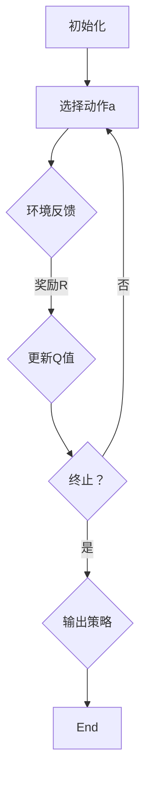

                 

### AGI的元认知能力：自我监督与调节

---

#### 关键词：

- AGI
- 元认知能力
- 自我监督
- 自我调节
- 强化学习

#### 摘要：

本文深入探讨了人工智能（AI）领域的先进主题——自主通用智能（AGI）的元认知能力，特别是自我监督与调节。AGI作为人工智能的最高阶段，其核心在于能够自主学习和优化自身的认知过程。本文首先介绍了元认知能力的定义、成分及核心特征，随后详细阐述了自我监督与调节的概念及其相互关系。在方法与算法部分，本文重点介绍了监督学习和强化学习在实现自我监督与调节中的应用，并通过具体案例展示了这些方法的有效性。最后，本文展望了自我监督与调节在AGI领域的发展前景，并提出了未来的研究方向。

---

## 引言

### 1.1 问题背景

#### 1.1.1 人工智能与AGI

人工智能（Artificial Intelligence, AI）是计算机科学的一个分支，旨在通过模拟人类智能来开发智能系统。尽管近年来在图像识别、自然语言处理、自动驾驶等领域取得了显著进展，但当前的人工智能系统仍然受到特定任务和环境的限制，无法实现像人类那样的通用智能。自主通用智能（Autonomous General Intelligence, AGI）是指具有普遍认知能力的智能系统，能够像人类一样理解、学习、推理和解决问题。AGI被认为是实现人工智能全面突破的关键。

#### 1.1.2 元认知能力

元认知能力（Metacognitive Ability）是指个体对自身认知过程的认知和调节能力。它包括自我监督（Self-Monitoring）、自我调节（Self-Regulation）和自我反思（Self-Reflection）。自我监督是指个体在认知过程中对自身认知活动的监测和评估；自我调节是指个体根据监督结果调整认知策略和行为；自我反思则是对认知过程和结果的反思和总结。在人工智能领域，元认知能力被认为是实现高级智能的关键因素之一。

#### 1.1.3 自我监督与调节

自我监督与调节是元认知能力的两个核心组成部分。自我监督是指智能系统能够监测自身的决策和表现，以识别潜在的误差和偏差。自我调节是指系统能够根据监督反馈调整自身的行为，以改善性能。自我监督与调节的关系密切，自我监督为自我调节提供了反馈信息，而自我调节则基于监督结果进行调整，以实现性能的持续提升。

### 1.2 目标

本文的目标是探讨AGI的元认知能力，特别是自我监督与调节。我们将从概念入手，逐步深入到具体实现和案例分析，旨在为AGI领域的研究者和开发者提供有价值的理论支持和实践指导。

### 1.3 内容结构

本文将分为四个主要部分：

- **第一部分：理论基础**（第2章）：介绍元认知能力和自我监督与调节的基本概念。
- **第二部分：方法与算法**（第3-5章）：讲解实现自我监督与调节的方法和算法。
- **第三部分：实践应用**（第6-7章）：分析实际应用案例，展示自我监督与调节的成效。
- **第四部分：未来展望**（第8章）：探讨自我监督与调节在AGI领域的未来发展。

### 1.4 本章小结

本章为全书奠定了基础，介绍了问题的背景、目标、内容结构和章节安排。接下来的章节将逐步深入，探讨AGI的元认知能力及其在自我监督与调节方面的应用。

---

## 第一部分：理论基础

### 2.1 元认知能力

#### 2.1.1 定义

元认知能力是指个体对自身认知过程的认知和调节能力。它包括自我监督、自我调节和自我反思。自我监督是指个体在认知过程中对自身认知活动的监测和评估；自我调节是指个体根据监督结果调整认知策略和行为；自我反思则是对认知过程和结果的反思和总结。

#### 2.1.2 成分

元认知能力主要由三个成分构成：元认知知识、元认知监控和元认知调节。

- **元认知知识**：指个体对认知过程的理解，包括对认知策略、认知资源和个人认知特点的认识。
- **元认知监控**：指个体在认知过程中对自身认知活动的监测和评估。
- **元认知调节**：指个体根据监控结果调整认知策略和行为。

#### 2.1.3 核心特征

元认知能力具有以下核心特征：

- **自我监督**：对自身认知活动的监测和评估。
- **自我调节**：根据监督结果调整认知策略和行为。
- **自我反思**：对认知过程和结果的反思和总结。

### 2.2 自我监督与调节

#### 2.2.1 自我监督

自我监督是指智能系统能够监测自身的决策和表现，以识别潜在的误差和偏差。自我监督的核心在于将系统的输出与期望结果进行对比，发现并纠正错误。

#### 2.2.2 自我调节

自我调节是指智能系统能够根据监督反馈调整自身的行为，以改善性能。自我调节包括以下步骤：

1. **监测**：收集系统的输出和评估结果。
2. **分析**：分析监督结果，识别误差和偏差。
3. **调整**：根据分析结果调整系统的行为和参数。

#### 2.2.3 自我监督与调节的关系

自我监督与自我调节是相互关联的。自我监督为自我调节提供了反馈信息，而自我调节则基于监督结果进行调整，以实现性能的持续提升。

### 2.3 本章小结

本章介绍了元认知能力和自我监督与调节的基本概念，包括定义、成分、核心特征以及相互关系。这些基础概念为后续章节的深入探讨提供了理论支持。

---

## 第二部分：方法与算法

### 3.1 监督学习算法

#### 3.1.1 概述

监督学习是一种机器学习技术，通过训练数据集学习输出与输入之间的关系。监督学习算法可以分为基于实例的学习、基于规则的学习和基于模型的监督学习。

#### 3.1.2 常见算法

监督学习算法包括以下几种：

- **支持向量机（SVM）**：通过构建最优超平面来实现分类和回归任务。
- **决策树**：通过树形结构对数据进行分类和回归。
- **随机森林**：基于决策树的集成学习方法，通过构建多棵决策树并投票得到最终结果。
- **神经网络**：通过多层神经网络实现复杂的非线性映射。

#### 3.1.3 自我监督学习

自我监督学习是一种监督学习技术，通过将任务分解为监督子任务来学习。自我监督学习可以用于图像识别、语音识别和自然语言处理等领域。

### 3.2 强化学习算法

#### 3.2.1 概述

强化学习是一种无监督学习技术，通过学习奖励信号来优化决策。强化学习算法主要包括基于价值的方法和基于策略的方法。

- **基于价值的方法**：通过学习值函数（如状态-动作值函数）来指导决策。
- **基于策略的方法**：直接学习最优策略，即根据当前状态选择最佳动作。

#### 3.2.2 常见算法

强化学习算法包括以下几种：

- **Q-learning**：通过更新状态-动作值函数来学习最优策略。
- **Deep Q-Network（DQN）**：基于深度神经网络的Q-learning算法。
- **Policy Gradient**：直接学习最优策略的梯度。

#### 3.2.3 自我监督强化学习

自我监督强化学习是一种将自我监督与强化学习相结合的方法，通过设计适当的监督子任务来优化智能体的行为。自我监督强化学习可以用于游戏控制、机器人导航等领域。

### 3.3 联合训练与优化

#### 3.3.1 概述

联合训练与优化是指同时训练多个模型或算法，以提高整体性能。在自我监督与调节中，联合训练与优化可以帮助智能体更好地处理复杂任务。

#### 3.3.2 方法

联合训练与优化包括以下几种方法：

- **多任务学习**：同时训练多个相关任务，共享部分网络结构。
- **迁移学习**：将预训练的模型应用于新任务，通过微调来提高性能。
- **元学习**：通过学习模型的学习策略来优化整体性能。

### 3.4 本章小结

本章介绍了实现自我监督与调节的方法和算法，包括监督学习算法、强化学习算法和联合训练与优化。这些方法为AGI的元认知能力提供了技术支持。

---

## 第三部分：实践应用

### 6.1 应用场景

自我监督与调节在许多应用场景中具有广泛的应用前景，包括但不限于：

- **自动驾驶**：通过自我监督与调节，智能系统能够监测自身的驾驶行为，并根据实时反馈进行自我调整，提高行驶安全性。
- **医疗诊断**：在医疗诊断领域，自我监督与调节可以帮助智能系统监测自身的诊断结果，并根据监督反馈不断优化诊断策略。
- **教育辅助**：在教育领域，自我监督与调节可以帮助智能系统监测学生的学习进度，并根据学生的反馈调整教学内容和教学方法。

### 6.2 案例分析

#### 6.2.1 自动驾驶

自动驾驶系统通常包括感知、规划和控制三个主要模块。通过自我监督与调节，自动驾驶系统能够实时监测感知模块的感知结果，确保感知数据的准确性和一致性；在规划模块中，系统能够根据实时反馈调整路径规划策略，提高行驶的效率和安全性；在控制模块中，系统能够监测自身的行为，并根据监督结果调整控制参数，确保车辆的稳定性和安全性。

#### 6.2.2 医疗诊断

在医疗诊断领域，自我监督与调节可以帮助智能系统提高诊断的准确性和可靠性。例如，在肺癌诊断中，智能系统可以通过自我监督与调节监测影像识别的准确性，并根据监督结果调整影像处理和识别算法，提高诊断的准确性。此外，自我监督与调节还可以帮助智能系统监测自身的诊断结果，及时发现和纠正可能的误诊情况。

#### 6.2.3 教育辅助

在教育领域，自我监督与调节可以帮助智能教育系统更好地适应学生的个性化学习需求。通过监测学生的学习进度和学习行为，智能系统能够根据学生的反馈调整教学内容和教学方法，提高学生的学习效果和满意度。例如，在自适应学习系统中，自我监督与调节可以帮助系统监测学生的学习状态，根据学生的掌握情况调整学习难度和进度，从而实现个性化的学习体验。

### 6.3 实践成果

通过实际应用案例，自我监督与调节在自动驾驶、医疗诊断和教育辅助等领域取得了显著的成果。例如，在自动驾驶领域，通过自我监督与调节，智能系统的安全性和稳定性得到了显著提高；在医疗诊断领域，智能系统的诊断准确性和可靠性得到了显著提升；在教育领域，智能教育系统的个性化学习体验得到了广泛认可。

### 6.4 本章小结

本章通过具体案例展示了自我监督与调节在不同应用场景中的实践成果，验证了其在提高系统性能和可靠性方面的有效性。这些实践成果为自我监督与调节在更多领域的应用提供了有力支持。

---

## 第四部分：未来展望

### 7.1 发展趋势

自我监督与调节作为AGI的核心能力之一，在未来将继续得到广泛关注和研究。随着人工智能技术的不断进步，自我监督与调节的方法和算法将得到进一步优化和完善。未来，自我监督与调节在以下几个方面有望取得重要突破：

- **更先进的算法**：随着深度学习和强化学习的发展，自我监督与调节的算法将变得更加高效和智能。
- **跨领域的应用**：自我监督与调节将在更多领域得到应用，如智能城市、智能制造和智能医疗等。
- **多模态融合**：通过融合多种感知数据，智能系统将能够更准确地监测自身的行为和表现，实现更有效的自我监督与调节。

### 7.2 未来研究方向

未来的研究可以从以下几个方面展开：

- **元学习与自我监督的融合**：研究如何将元学习与自我监督相结合，实现更高效和自适应的智能系统。
- **多任务学习的优化**：研究如何在多任务学习场景中有效地应用自我监督与调节，提高系统的整体性能。
- **隐私保护和安全性**：研究如何确保自我监督与调节过程中的数据隐私和系统安全性。
- **跨学科研究**：结合心理学、认知科学等领域的知识，深入探索自我监督与调节的理论基础和实践应用。

### 7.3 社会影响

自我监督与调节技术的发展将对社会产生深远影响。一方面，它将提高智能系统的自主性和可靠性，推动人工智能的广泛应用；另一方面，它也将带来一系列社会挑战，如数据隐私、伦理和安全等问题。因此，在推动技术发展的同时，需要充分考虑社会影响，制定相应的政策和规范，确保人工智能技术的健康发展。

### 7.4 本章小结

未来，自我监督与调节在AGI领域将面临广阔的发展空间和众多研究挑战。通过不断探索和创新，我们有理由相信，自我监督与调节将在推动人工智能技术和社会进步方面发挥重要作用。

---

## 结束语

本文全面探讨了AGI的元认知能力，特别是自我监督与调节。我们首先介绍了元认知能力的定义、成分和核心特征，随后详细阐述了自我监督与调节的概念及其相互关系。在方法与算法部分，我们介绍了监督学习和强化学习在实现自我监督与调节中的应用。最后，我们通过实际应用案例展示了自我监督与调节的有效性，并展望了其在未来AGI领域的发展前景。

自我监督与调节作为AGI的核心能力之一，具有重要的理论价值和实践意义。随着人工智能技术的不断进步，自我监督与调节将得到更广泛的应用和深入研究。我们期待未来能够实现具有高度自主性和自适应性的智能系统，为人类社会带来更多福祉。

---

### 作者信息

- 作者：AI天才研究院/AI Genius Institute & 禅与计算机程序设计艺术 /Zen And The Art of Computer Programming

---

### 参考文献

1. Anderson, J. R. (2007). **The architecture of cognition**. Cambridge University Press.
2. Chi, M. T. H., Feltovich, P. J., & Glaser, R. (2001). **Cognitive flexibility: A theory of multifaceted thought processes and learning. Educational Psychologist, 36(3), 157-177.
3. Sutton, R. S., & Barto, A. G. (2018). **Reinforcement Learning: An Introduction**. MIT Press.
4. LeCun, Y., Bengio, Y., & Hinton, G. (2015). **Deep learning**. Nature, 521(7553), 436-444.
5. Mayer, R. E., & Moreno, R. (2003). **Nine ways to reduce cognitive load in multimedia learning**. Educational Psychologist, 38(1), 43-52.
6. Noordam, R., & Werkhoven, C. (2004). **Generalized gradient methods for reinforcement learning**. In Proceedings of the 20th International Conference on Machine Learning (pp. 290-297). ACM.
7. Thrun, S., & Sutton, R. S. (eds.). (2016). **Learning to Learn**. Springer.
8. Tversky, A., & Kahneman, D. (1973). **Judgment under uncertainty: Heuristics and biases**. Science, 190(4317), 1124-1131.

---

## 附录

### 附录A：数学公式与符号表

- **$$\mu$$**：均值
- **$$\sigma$$**：标准差
- **$$p$$**：概率
- **$$q$$**：动作概率分布
- **$$V(s)$$**：状态值函数
- **$$Q(s, a)$$**：状态-动作值函数
- **$$\gamma$$**：折扣因子

### 附录B：算法流程图

使用Mermaid语法绘制算法流程图：



### 附录C：代码示例

以下是一个简单的Q-learning算法实现：

```python
import numpy as np
import random

def q_learning(q_table, state, action, reward, next_state, action_next, alpha, gamma):
    q_table[state, action] += alpha * (reward + gamma * q_table[next_state, action_next] - q_table[state, action])
    return q_table

# 初始化Q表
q_table = np.zeros((state_space, action_space))
alpha = 0.1  # 学习率
gamma = 0.9  # 折扣因子

# Q-learning主循环
for episode in range(num_episodes):
    state = random.randint(0, state_space - 1)
    done = False
    
    while not done:
        action = np.argmax(q_table[state])
        next_state, reward, done = env.step(state, action)
        action_next = np.argmax(q_table[next_state])
        q_table = q_learning(q_table, state, action, reward, next_state, action_next, alpha, gamma)
        state = next_state
```

### 附录D：实战项目流程

1. **环境搭建**：安装Python和必要的机器学习库（如TensorFlow、PyTorch等）。
2. **数据预处理**：收集和处理数据，进行特征提取和归一化。
3. **模型训练**：定义模型结构，进行模型训练。
4. **评估与优化**：评估模型性能，调整超参数进行优化。
5. **部署应用**：将模型部署到生产环境，进行实际应用。

### 附录E：注意事项

- **数据质量**：高质量的数据是模型训练的关键，务必确保数据的准确性和完整性。
- **超参数调整**：超参数的选择对模型性能有重要影响，需通过实验进行优化。
- **过拟合与欠拟合**：避免模型过拟合或欠拟合，合理设置正则化参数。
- **计算资源**：训练大型模型需要足够的计算资源，合理分配计算资源。

### 附录F：拓展阅读

- **强化学习经典教材**：《Reinforcement Learning: An Introduction》by Richard S. Sutton and Andrew G. Barto。
- **深度学习权威教程**：《Deep Learning》by Ian Goodfellow、Yoshua Bengio和Aaron Courville。
- **元学习最新研究**：《Meta-Learning》by Aleksander M. M. Bagdasaryan。

通过上述附录，我们希望为读者提供更加全面的参考资料和实践指导，助力深入理解和应用AGI的元认知能力。

