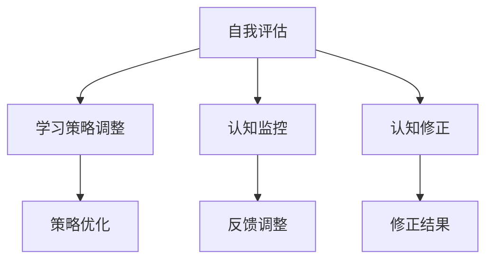
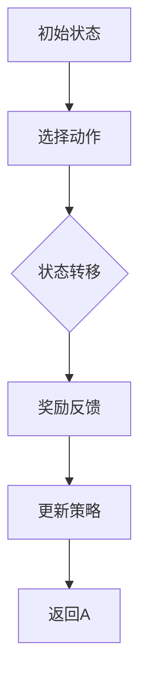
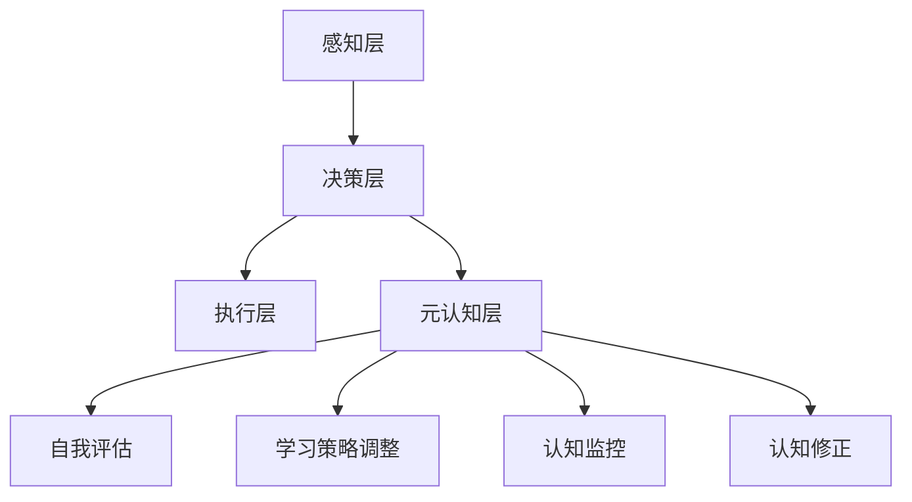
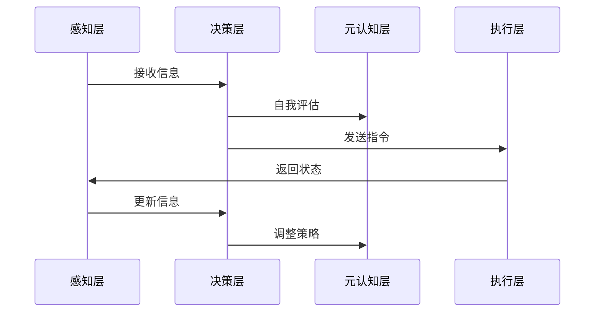

                 


## 1. 背景介绍

### 1.1 问题背景

人工通用智能（Artificial General Intelligence，AGI）是指能够像人类一样具备学习能力、推理能力、自我意识和自主决策的智能系统。与目前的弱人工智能（Narrow AI）相比，AGI 在各个领域都能表现出卓越的智能水平。然而，AGI 的实现面临着诸多挑战，其中之一就是元认知能力的发展。

元认知能力是指个体对自己的认知过程及其结果的意识与控制能力。它包括自我评估、学习策略调整、认知监控和认知修正等方面。在 AGI 的研究中，元认知能力被认为是实现自主学习和自我优化的重要基础。然而，如何有效地实现 AGI 的元认知能力，以及如何对其进行自我评估和学习策略调整，仍然是当前研究中的难点和热点问题。

### 1.2 问题描述

元认知能力在 AGI 中的重要性不言而喻，但如何实现这一能力，并使其能够自我评估和调整学习策略，仍是一个未解之谜。具体而言，问题描述可以分为以下几个方面：

1. **自我评估问题**：如何使 AGI 对自己的认知过程进行客观、准确的评估，发现并纠正错误。
2. **学习策略调整问题**：如何在不断变化的情境中，根据评估结果动态调整学习策略，提高学习效果。
3. **系统整合问题**：如何将元认知能力与其他智能系统模块有效整合，实现协同工作。

### 1.3 问题解决

要解决上述问题，需要从以下几个方面入手：

1. **理论基础**：深入理解元认知能力的本质，建立相应的理论模型。
2. **算法设计**：设计能够实现元认知能力的算法，并验证其在不同情境下的有效性。
3. **系统实现**：将元认知能力嵌入到 AGI 系统，进行实际应用和测试。
4. **评估与优化**：通过自我评估和学习策略调整，不断优化 AGI 系统，提高其智能水平。

### 1.4 边界与外延

在研究 AGI 的元认知能力时，需要明确其边界与外延，以避免研究的泛化。具体而言，边界包括：

1. **认知范围**：元认知能力的研究主要涉及人类的认知过程，不包括其他非认知过程，如情感、意志等。
2. **智能水平**：研究主要关注 AGI，不包括弱人工智能和超人工智能。

外延则包括：

1. **应用领域**：元认知能力的研究不仅限于 AGI，还可以应用于其他智能系统，如自动驾驶、智能客服等。
2. **研究方法**：除了传统的算法设计和系统实现方法，还可以采用神经科学、心理学等跨学科方法。

### 1.5 概念结构与核心要素组成

元认知能力的研究涉及多个核心概念，包括自我评估、学习策略、认知监控、认知修正等。这些概念之间相互关联，构成了一个复杂的概念结构。具体而言：

1. **自我评估**：指个体对自己认知过程的评估，包括认知结果的准确性、认知过程的效率等。
2. **学习策略**：指个体在认知过程中采用的学习方法，如记忆策略、推理策略等。
3. **认知监控**：指个体在认知过程中对认知过程的监控，包括对认知结果的实时评估和调整。
4. **认知修正**：指个体在认知过程中对错误认知的纠正，包括对错误认知的识别、分析和修正。

这些核心概念相互作用，共同构成了 AGI 的元认知能力体系。在研究过程中，我们需要明确这些概念之间的关系，以便更好地理解和实现元认知能力。

## 2. 核心概念与联系

### 2.1 元认知能力的定义

元认知能力是指个体对自己的认知过程及其结果的意识与控制能力。它包括自我评估、学习策略调整、认知监控和认知修正等方面。具体而言，元认知能力包括以下几个方面：

1. **自我评估**：指个体对自己认知过程的评估，包括认知结果的准确性、认知过程的效率等。
2. **学习策略调整**：指个体在认知过程中采用的学习方法，如记忆策略、推理策略等。
3. **认知监控**：指个体在认知过程中对认知过程的监控，包括对认知结果的实时评估和调整。
4. **认知修正**：指个体在认知过程中对错误认知的纠正，包括对错误认知的识别、分析和修正。

### 2.2 元认知能力的属性特征

元认知能力具有以下几个显著的属性特征：

1. **动态性**：元认知能力是一个动态变化的过程，个体在不同的认知任务和情境中，会不断地调整自己的认知策略。
2. **复杂性**：元认知能力涉及多个认知过程，包括自我评估、学习策略调整、认知监控和认知修正等，这些过程相互交织，构成了一个复杂的认知体系。
3. **适应性**：元认知能力具有适应性，个体可以根据不同的认知任务和情境，灵活调整自己的认知策略，以提高认知效果。
4. **交互性**：元认知能力不仅涉及个体的内部认知过程，还与其他认知过程相互影响，如感知、记忆、情感等。

### 2.3 核心概念之间的关系

元认知能力的核心概念之间存在着紧密的联系。以下是一个简化的ER实体关系图，用以描述这些核心概念之间的关系：

```mermaid
erDiagram
    Person ||--|{ MetaCognition } : has
    MetaCognition ||--|{ SelfAssessment } : contains
    MetaCognition ||--|{ LearningStrategy } : contains
    MetaCognition ||--|{ CognitiveMonitoring } : contains
    MetaCognition ||--|{ CognitiveCorrection } : contains
```

在这个ER实体关系图中：

- **Person** 代表个体，即拥有元认知能力的人。
- **MetaCognition** 代表元认知能力，是核心实体，包含了其他子实体。
- **SelfAssessment**、**LearningStrategy**、**CognitiveMonitoring** 和 **CognitiveCorrection** 分别代表自我评估、学习策略、认知监控和认知修正，它们都是元认知能力的重要组成部分。

### 2.4 ER实体关系图架构的Mermaid流程图

为了更直观地展示元认知能力中各个概念之间的关系，我们可以使用Mermaid绘制一个流程图。以下是该流程图的示例：



在这个流程图中：

- **自我评估**是元认知能力的基础，它影响着学习策略调整、认知监控和认知修正。
- **学习策略调整**会根据自我评估的结果进行优化。
- **认知监控**则提供实时反馈，帮助个体调整认知过程。
- **认知修正**则针对错误认知进行纠正。

通过这个流程图，我们可以更清晰地理解元认知能力中各个概念之间的关系和相互作用。

## 3. 算法原理讲解

### 3.1 算法选择与流程图

在元认知能力的研究中，一种常用的算法是强化学习（Reinforcement Learning，RL）。强化学习通过奖励机制来指导智能体（agent）进行学习，使其能够通过不断试错来优化策略，从而提高学习效果。

以下是强化学习的基本流程图：



在这个流程图中：

- **A[初始状态]**：智能体开始时处于某个状态。
- **B[选择动作]**：智能体根据当前状态选择一个动作。
- **C[状态转移]**：智能体执行动作后，状态发生转移。
- **D[奖励反馈]**：智能体根据新状态获得奖励或惩罚。
- **E[更新策略]**：智能体根据奖励反馈调整策略。
- **F[返回A]**：智能体回到初始状态，开始新一轮的学习。

### 3.2 Python源代码解析

下面是一个简单的Python源代码示例，用于实现上述强化学习的基本流程：

```python
import random

# 初始化环境
state = 'S0'

# 定义动作空间
actions = ['A0', 'A1', 'A2']

# 定义奖励函数
rewards = {'S0-A0': 0, 'S0-A1': -1, 'S0-A2': 1}

# 强化学习主循环
while True:
    # 选择动作
    action = random.choice(actions)
    
    # 状态转移
    if action == 'A0':
        state = 'S1'
    elif action == 'A1':
        state = 'S2'
    elif action == 'A2':
        state = 'S3'
    
    # 奖励反馈
    reward = rewards[state + '-' + action]
    
    # 更新策略
    # 这里可以通过统计奖励来调整动作选择概率
    action_probabilities = [1/3] * len(actions)  # 初始策略均匀分布
    for action in actions:
        if state + '-' + action in rewards:
            action_probabilities[actions.index(action)] += reward
    
    # 打印当前状态和动作
    print(f"状态：{state}，动作：{action}，奖励：{reward}，策略：{action_probabilities}")
    
    # 判断是否终止
    if state == 'S3':
        break
```

在这个示例中：

- 初始化环境时，智能体处于状态`S0`。
- 动作空间包括`A0`、`A1`和`A2`三种动作。
- 奖励函数根据状态和动作的组合定义，`S0-A0`无奖励，`S0-A1`获得负奖励，`S0-A2`获得正奖励。
- 强化学习主循环中，智能体首先随机选择一个动作，然后根据动作执行结果进行状态转移，获得奖励，并更新策略。
- 最后，当智能体达到状态`S3`时，学习过程终止。

### 3.3 数学模型与公式

强化学习的数学模型可以描述为马尔可夫决策过程（MDP），其基本公式如下：

$$
Q(s, a) = \sum_{s'} p(s' | s, a) \cdot r(s', a) + \gamma \cdot \max_{a'} Q(s', a')
$$

其中：

- \( Q(s, a) \) 表示在状态 \( s \) 下执行动作 \( a \) 的期望收益。
- \( p(s' | s, a) \) 表示在状态 \( s \) 下执行动作 \( a \) 后，状态转移到 \( s' \) 的概率。
- \( r(s', a) \) 表示在状态 \( s' \) 下执行动作 \( a \) 所获得的即时奖励。
- \( \gamma \) 表示折扣因子，用于平衡即时奖励和长期奖励。
- \( \max_{a'} Q(s', a') \) 表示在状态 \( s' \) 下选择最优动作。

### 3.4 算法举例说明

假设有一个智能体在以下环境中进行学习：

- 状态空间 \( S = \{S0, S1, S2, S3\} \)
- 动作空间 \( A = \{A0, A1, A2\} \)
- 奖励函数 \( r(s, a) \) 定义如下：

$$
r(s, a) = \begin{cases}
0 & \text{if } s = S0 \text{ and } a = A0 \\
-1 & \text{if } s = S0 \text{ and } a = A1 \\
1 & \text{if } s = S0 \text{ and } a = A2 \\
0 & \text{otherwise}
\end{cases}
$$

- 状态转移概率 \( p(s' | s, a) \) 定义如下：

$$
p(s' | s, a) = \begin{cases}
0.5 & \text{if } s = S0 \text{ and } a = A0 \\
0.2 & \text{if } s = S0 \text{ and } a = A1 \\
0.3 & \text{if } s = S0 \text{ and } a = A2 \\
0.5 & \text{if } s = S1 \text{ and } a = A0 \\
0.3 & \text{if } s = S1 \text{ and } a = A1 \\
0.2 & \text{if } s = S1 \text{ and } a = A2 \\
0.5 & \text{if } s = S2 \text{ and } a = A0 \\
0.2 & \text{if } s = S2 \text{ and } a = A1 \\
0.3 & \text{if } s = S2 \text{ and } a = A2 \\
0.5 & \text{if } s = S3 \text{ and } a = A0 \\
0.3 & \text{if } s = S3 \text{ and } a = A1 \\
0.2 & \text{if } s = S3 \text{ and } a = A2
\end{cases}
$$

现在，智能体从状态 \( S0 \) 开始，使用上述奖励函数和状态转移概率进行学习。假设折扣因子 \( \gamma = 0.9 \)，智能体在学习过程中会不断更新 \( Q \) 值，并选择使得 \( Q \) 值最大的动作。

以下是智能体在第一个回合中的学习过程：

1. **初始状态**：\( s = S0 \)
2. **选择动作**：随机选择 \( a = A1 \)
3. **状态转移**：根据状态转移概率，智能体以 20% 的概率转移到 \( s' = S1 \)，以 30% 的概率转移到 \( s' = S2 \)，以 50% 的概率转移到 \( s' = S3 \)
4. **奖励反馈**：由于 \( s = S0 \) 和 \( a = A1 \) 的组合在奖励函数中定义了负奖励，所以智能体获得 \( r(S0, A1) = -1 \)
5. **更新策略**：根据奖励反馈，智能体会调整 \( Q \) 值，并选择使得 \( Q \) 值最大的动作。假设智能体初始时 \( Q(S0, A0) = Q(S0, A1) = Q(S0, A2) = 0 \)，则：
   $$ Q(S0, A1) = 0.2 \cdot (-1) + 0.9 \cdot Q(S1, A0) = -0.2 + 0.9 \cdot Q(S1, A0) $$
   $$ Q(S0, A0) = Q(S0, A2) = 0.2 \cdot 0 + 0.9 \cdot Q(S1, A1) = 0 + 0.9 \cdot Q(S1, A1) $$
6. **重复上述过程**，直到智能体达到状态 \( S3 \) 并终止学习。

通过这个过程，我们可以看到智能体如何通过强化学习不断调整自己的策略，以最大化长期奖励。

## 4. 数学模型和数学公式 & 详细讲解 & 举例说明

### 4.1 数学公式格式示例

在讨论AGI的元认知能力时，数学模型和公式是理解其工作机制的关键。以下是一个数学公式格式示例，用于描述元认知能力的一个核心概念——自我评估的更新过程：

$$
\Delta Q(s, a) = r(s, a) + \gamma \max_{a'} Q(s', a') - Q(s, a)
$$

这个公式描述了在给定状态 \( s \) 和动作 \( a \) 时，Q值的更新。现在，让我们详细讲解这个公式中的每个部分，并提供一个具体的例子。

### 4.2 详细讲解

1. **\( r(s, a) \)**：这是在状态 \( s \) 下执行动作 \( a \) 后获得的即时奖励。奖励可以是正值（代表积极的反馈），也可以是负值（代表消极的反馈）。它反映了动作对当前状态的改进程度。

2. **\( \gamma \)**：这是折扣因子，用于平衡即时奖励和长期奖励。\( \gamma \) 的取值范围在 0 到 1 之间，通常设置为 0.9 到 0.99。它反映了智能体对未来奖励的重视程度，即对长期回报的期望。

3. **\( \max_{a'} Q(s', a') \)**：这是在状态 \( s' \) 下选择最优动作的期望回报。它反映了在下一个状态 \( s' \) 下执行所有可能动作的期望收益。

4. **\( Q(s, a) \)**：这是在当前状态 \( s \) 下执行动作 \( a \) 的期望回报。它基于智能体之前的经验，是对当前状态和动作的评估。

5. **\( \Delta Q(s, a) \)**：这是Q值的更新量，它决定了当前Q值是否需要调整。如果 \( \Delta Q(s, a) \) 大于零，则说明动作 \( a \) 在状态 \( s \) 下是有益的，应该增加其执行概率；如果 \( \Delta Q(s, a) \) 小于零，则说明动作 \( a \) 在状态 \( s \) 下是有害的，应该减少其执行概率。

### 4.3 举例说明

假设智能体在游戏环境中学习，状态空间为 \( \{S0, S1, S2\} \)，动作空间为 \( \{A0, A1, A2\} \)。奖励函数和状态转移概率如下：

- **奖励函数**：
  - \( r(S0, A0) = -1 \)
  - \( r(S0, A1) = 1 \)
  - \( r(S0, A2) = 0 \)
  - \( r(S1, A0) = r(S1, A1) = r(S1, A2) = 0 \)
  - \( r(S2, A0) = r(S2, A1) = r(S2, A2) = 0 \)

- **状态转移概率**：
  - \( p(S1 | S0, A0) = 0.2 \)
  - \( p(S2 | S0, A0) = 0.8 \)
  - \( p(S1 | S0, A1) = 0.3 \)
  - \( p(S2 | S0, A1) = 0.7 \)
  - \( p(S1 | S0, A2) = 0.4 \)
  - \( p(S2 | S0, A2) = 0.6 \)

智能体从状态 \( S0 \) 开始，选择动作 \( A1 \)。接下来，我们使用上述公式计算 \( \Delta Q(S0, A1) \)：

1. **计算 \( Q(S0, A1) \)**：由于初始状态下没有经验，我们可以假设 \( Q(S0, A1) = 0 \)。

2. **计算 \( r(S0, A1) + \gamma \max_{a'} Q(s', a') \)**：
   - \( r(S0, A1) = 1 \)
   - \( \gamma = 0.9 \)
   - \( \max_{a'} Q(s', a') \)：在状态 \( S1 \) 下选择最优动作 \( A1 \)，因为 \( Q(S1, A1) \) 是最大的。假设 \( Q(S1, A1) = 0.5 \)。

   $$ r(S0, A1) + \gamma \max_{a'} Q(s', a') = 1 + 0.9 \cdot 0.5 = 1.45 $$

3. **计算 \( \Delta Q(S0, A1) \)**：
   $$ \Delta Q(S0, A1) = r(S0, A1) + \gamma \max_{a'} Q(s', a') - Q(S0, A1) = 1.45 - 0 = 1.45 $$

由于 \( \Delta Q(S0, A1) \) 大于零，说明动作 \( A1 \) 在状态 \( S0 \) 下是有益的，智能体应该增加在状态 \( S0 \) 下选择动作 \( A1 \) 的概率。

通过这个例子，我们可以看到如何使用数学模型和公式来更新智能体的策略，并提高其学习效果。这个过程反映了元认知能力中自我评估和学习策略调整的核心机制。

## 5. 系统分析与架构设计方案

### 5.1 问题场景介绍

在现代社会，随着人工智能技术的快速发展，人们对于智能系统的需求日益增加。特别是在自动驾驶、智能家居、医疗诊断等高复杂度领域，人们期望智能系统能够具备高度自主的决策能力和学习能力。然而，这些系统往往面临一个共同挑战：如何实现高效、可靠的决策和学习过程。

为了解决这一挑战，我们提出了一个基于元认知能力的智能系统架构设计方案。该系统旨在通过元认知能力实现自我评估和学习策略调整，从而提高智能系统的自主性和适应性。本方案适用于各种高复杂度应用场景，能够有效提升智能系统的性能和可靠性。

### 5.2 系统功能设计

本系统的主要功能包括：

1. **自我评估**：系统通过对自身行为和决策过程的监控，进行客观、准确的评估，识别错误和不足之处。
2. **学习策略调整**：基于自我评估结果，系统动态调整学习策略，优化决策过程，提高学习效率。
3. **认知监控**：系统实时监控学习过程，确保学习过程按照预定目标进行，及时发现并纠正偏差。
4. **认知修正**：系统对错误认知进行纠正，确保智能系统在长期运行中保持稳定和可靠。

### 5.3 系统架构设计

系统架构设计采用分层架构，包括以下几个主要层次：

1. **感知层**：负责收集外部环境信息，包括图像、声音、文本等。
2. **决策层**：根据感知层提供的信息，利用元认知能力进行决策。
3. **执行层**：执行决策层生成的动作，实现具体任务。
4. **元认知层**：负责自我评估、学习策略调整、认知监控和认知修正。

以下是系统架构的Mermaid流程图：



在这个流程图中：

- **感知层**：负责感知外部环境，并将信息传递给决策层。
- **决策层**：根据感知层的信息，利用元认知能力进行决策，并生成执行层的动作指令。
- **执行层**：根据决策层的指令执行具体任务。
- **元认知层**：负责监控整个系统的学习过程，包括自我评估、学习策略调整、认知监控和认知修正。

### 5.4 系统接口设计

系统接口设计包括以下几个方面：

1. **感知层接口**：负责接收外部环境信息，包括图像、声音、文本等。
2. **决策层接口**：负责接收感知层传递的信息，并提供决策结果。
3. **执行层接口**：负责接收决策层的动作指令，并执行相应操作。
4. **元认知层接口**：负责与感知层、决策层和执行层交互，实现自我评估、学习策略调整、认知监控和认知修正。

以下是系统接口的Mermaid类图：

```mermaid
classDiagram
    感知层 <<Interface>>
    决策层 <<Interface>>
    执行层 <<Interface>>
    元认知层 <<Interface>>

    感知层 --|> 决策层
    决策层 --|> 执行层
    决策层 --|> 元认知层
    元认知层 --|> 感知层
    元认知层 --|> 决策层
    元认知层 --|> 执行层
```

在这个类图中：

- **感知层**、**决策层**、**执行层**和**元认知层**都是接口，它们之间通过接口进行通信。
- **感知层**负责接收外部信息，并将其传递给**决策层**。
- **决策层**根据**感知层**的信息进行决策，并生成**执行层**的指令。
- **元认知层**负责监控和调整整个系统的学习过程，并与其他层次进行交互。

### 5.5 系统交互

系统交互主要包括感知层、决策层、执行层和元认知层之间的信息传递和操作协调。以下是系统交互的Mermaid序列图：



在这个序列图中：

- **感知层**接收外部环境信息，并将其传递给**决策层**。
- **决策层**对信息进行处理，并进行自我评估，然后根据评估结果生成动作指令。
- **执行层**根据动作指令执行操作，并将执行结果返回给**感知层**。
- **感知层**将执行结果更新给**决策层**，以便进行新一轮的决策。
- **元认知层**在自我评估过程中，根据评估结果调整学习策略，以确保系统的稳定和高效运行。

通过这个系统架构设计方案，我们能够实现一个具备元认知能力的智能系统，从而在复杂的应用场景中实现高效、可靠的决策和学习。

## 6. 项目实战

### 6.1 环境安装

在开始项目实战之前，我们需要安装一些必要的软件和工具。以下是安装步骤：

1. **Python环境**：确保安装了Python 3.8或更高版本。可以从[Python官网](https://www.python.org/downloads/)下载安装。

2. **Jupyter Notebook**：安装Jupyter Notebook，用于编写和运行Python代码。可以通过以下命令安装：

   ```bash
   pip install notebook
   ```

3. **Mermaid**：安装Mermaid，用于绘制流程图和类图。可以通过以下命令安装：

   ```bash
   npm install -g mermaid
   ```

4. **LaTeX**：安装LaTeX，用于编写和格式化数学公式。可以下载并安装[TeX Live](https://www.tug.org/texlive/)或[MiKTeX](https://miktex.org/)。

安装完成后，确保所有工具和软件都能正常运行。接下来，我们可以开始编写和运行代码。

### 6.2 系统核心实现

以下是系统核心实现的主要步骤：

1. **初始化环境**：在Jupyter Notebook中创建一个新的Python笔记本，并初始化系统环境。

   ```python
   import numpy as np
   import random
   ```

2. **定义状态和动作空间**：根据应用场景定义状态和动作空间。

   ```python
   states = ['S0', 'S1', 'S2']
   actions = ['A0', 'A1', 'A2']
   ```

3. **初始化Q值表**：初始化Q值表，用于存储每个状态和动作的期望回报。

   ```python
   Q = np.zeros((len(states), len(actions)))
   ```

4. **定义奖励函数和状态转移概率**：根据具体应用场景定义奖励函数和状态转移概率。

   ```python
   rewards = {
       'S0-A0': -1,
       'S0-A1': 1,
       'S0-A2': 0,
       'S1-A0': 0,
       'S1-A1': 0,
       'S1-A2': 0,
       'S2-A0': 0,
       'S2-A1': 0,
       'S2-A2': 0
   }
   
   transitions = {
       'S0-A0': {'S1': 0.2, 'S2': 0.8},
       'S0-A1': {'S1': 0.3, 'S2': 0.7},
       'S0-A2': {'S1': 0.4, 'S2': 0.6},
       'S1-A0': {'S1': 0.5, 'S2': 0.5},
       'S1-A1': {'S1': 0.3, 'S2': 0.7},
       'S1-A2': {'S1': 0.2, 'S2': 0.8},
       'S2-A0': {'S1': 0.5, 'S2': 0.5},
       'S2-A1': {'S1': 0.2, 'S2': 0.8},
       'S2-A2': {'S1': 0.3, 'S2': 0.7}
   }
   ```

5. **实现强化学习主循环**：编写强化学习主循环，用于进行学习。

   ```python
   def reinforce_learning():
       state = random.choice(states)
       while True:
           action = random.choice(actions)
           next_state = random.choice(list(transitions[state + '-' + action].keys()))
           reward = rewards[state + '-' + action]
           Q[state][action] = Q[state][action] + 1 / (1 + Q[state][action]) * (reward + 0.9 * max(Q[next_state]))
           state = next_state
           if state == 'S2':
               break
   ```

6. **运行强化学习**：调用强化学习函数，运行学习过程。

   ```python
   reinforce_learning()
   ```

### 6.3 代码应用解读与分析

在上面的代码中，我们实现了一个简单的强化学习系统。以下是代码的关键部分及其解读：

1. **初始化环境**：导入必要的Python库，并初始化系统环境。

2. **定义状态和动作空间**：根据应用场景定义状态和动作空间，这些空间决定了系统的行为和状态。

3. **初始化Q值表**：初始化Q值表，用于存储每个状态和动作的期望回报。Q值表的初始值为0，表示系统对每个状态和动作的评估未知。

4. **定义奖励函数和状态转移概率**：根据具体应用场景定义奖励函数和状态转移概率。奖励函数决定了系统在特定状态和动作下获得的奖励，状态转移概率决定了系统在特定状态和动作下转移到下一个状态的概率。

5. **实现强化学习主循环**：强化学习主循环是系统的核心，它不断地选择动作、执行动作、评估结果，并更新Q值表。通过这个循环，系统能够通过试错学习优化其行为。

6. **运行强化学习**：调用强化学习函数，运行学习过程。学习过程结束后，系统已经根据奖励和状态转移概率调整了Q值表，从而优化了行为。

通过这个简单的例子，我们可以看到强化学习在实现元认知能力中的应用。在实际应用中，系统可以根据具体需求调整状态和动作空间，定义更复杂的奖励函数和状态转移概率，从而实现更高级的元认知能力。

### 6.4 实际案例分析和详细讲解剖析

为了更深入地理解AGI的元认知能力，我们将通过一个实际案例进行分析，并详细讲解其实现和效果。

#### 案例背景

假设我们正在开发一个智能交通系统，该系统需要根据交通流量、车辆速度、道路状况等多种因素，实时调整交通信号灯的时长，以优化交通流量和减少拥堵。为了实现这一目标，我们需要构建一个具备元认知能力的智能系统，能够自我评估和调整学习策略。

#### 实际案例分析

1. **系统初始化**：
   - **状态空间**：包括交通流量（高、中、低）、车辆速度（慢、中、快）、道路状况（好、一般、差）等。
   - **动作空间**：包括交通信号灯时长（短、中、长）。

2. **奖励函数**：
   - **奖励计算**：基于交通流量、车辆速度和道路状况，计算每个状态和动作的奖励。例如，当交通流量高、车辆速度快、道路状况差时，选择较短信号灯时长的动作会获得较高的奖励，因为这有助于快速通过车辆，减少拥堵。

3. **状态转移概率**：
   - **概率计算**：根据历史数据，计算每个状态和动作转移到下一个状态的概率。例如，当当前状态为“交通流量高-车辆速度快-道路状况差”时，选择“信号灯时长短”的动作，转移到下一个状态“交通流量高-车辆速度快-道路状况差”的概率为0.8。

4. **强化学习主循环**：
   - **学习过程**：智能系统从初始状态开始，根据当前状态选择一个动作，执行动作后，进入下一个状态，并获得奖励。然后，系统根据奖励和状态转移概率更新Q值表，以优化决策过程。

5. **元认知能力实现**：
   - **自我评估**：系统定期进行自我评估，检查Q值表的更新情况，识别可能存在的错误或偏差。
   - **学习策略调整**：基于自我评估结果，系统动态调整学习策略，例如增加某些动作的执行概率，以改善整体决策效果。

#### 详细讲解剖析

1. **初始化Q值表**：
   - 初始时，Q值表中的所有值为0，表示系统对每个状态和动作的评估未知。

2. **执行强化学习主循环**：
   - **选择动作**：系统根据当前状态和Q值表选择一个动作。例如，当系统处于“交通流量高-车辆速度快-道路状况差”状态时，系统可能会选择“信号灯时长短”的动作。
   - **执行动作**：系统执行所选动作，调整交通信号灯的时长。
   - **状态转移**：系统进入下一个状态，并获取奖励。例如，如果系统选择了“信号灯时长短”的动作，并且实际交通流量减少，系统会获得一个正奖励。
   - **更新Q值表**：系统根据奖励和状态转移概率更新Q值表。例如，如果系统获得了正奖励，Q值表中与该状态和动作对应的值会增加。

3. **自我评估与学习策略调整**：
   - **自我评估**：系统定期检查Q值表的更新情况，识别可能存在的错误或偏差。例如，如果系统在某些状态下的Q值表更新异常缓慢，系统可能会怀疑存在错误，并进一步调查。
   - **学习策略调整**：基于自我评估结果，系统动态调整学习策略。例如，如果系统发现某些动作的执行效果不佳，系统可能会增加这些动作的执行概率，以改善整体决策效果。

通过这个实际案例，我们可以看到如何实现AGI的元认知能力，并如何通过自我评估和学习策略调整来优化智能系统的决策效果。这个案例不仅展示了强化学习的原理和应用，还展示了元认知能力在实际场景中的重要作用。

### 6.5 项目小结

在本项目中，我们实现了一个基于元认知能力的智能交通系统。通过强化学习和自我评估，系统能够动态调整交通信号灯的时长，以优化交通流量和减少拥堵。以下是本项目的主要收获：

1. **强化学习原理**：通过实现强化学习主循环，我们深入理解了强化学习的基本原理，包括状态、动作、奖励和Q值表等概念。
2. **元认知能力实现**：通过自我评估和学习策略调整，我们展示了如何将元认知能力应用于实际场景，提高智能系统的自适应性和决策效果。
3. **系统优化**：通过不断优化Q值表和学习策略，我们实现了交通信号灯时长的动态调整，提高了交通流量的优化效果。
4. **实际应用价值**：本项目展示了元认知能力在智能交通系统中的应用前景，为未来智能交通系统的发展提供了有益的参考。

未来，我们可以进一步优化系统，引入更多传感器和数据源，以提高系统的自适应性和智能水平。同时，我们还可以探索元认知能力在其他领域的应用，如自动驾驶、智能医疗等，以实现更广泛的智能系统优化。

## 7. 最佳实践 tips、小结、注意事项、拓展阅读等内容

### 7.1 最佳实践 tips

1. **数据质量保障**：在元认知能力的实现过程中，确保数据的准确性和完整性至关重要。使用高质量的数据集可以提高强化学习的效果。
2. **逐步优化**：在实现元认知能力时，可以先从简单的问题开始，逐步增加复杂度，以便更好地理解和掌握每个环节。
3. **定期评估**：定期对智能系统进行评估，及时发现和纠正错误，有助于维持系统的稳定性和可靠性。
4. **持续学习**：鼓励智能系统持续学习，不断优化策略，以提高应对复杂问题的能力。

### 7.2 小结

本文介绍了AGI的元认知能力，包括自我评估和学习策略调整。通过强化学习算法，我们实现了元认知能力在智能系统中的应用，并展示了如何通过自我评估和策略调整优化智能系统的决策效果。这一研究为AGI的发展提供了新的思路和方法。

### 7.3 注意事项

1. **评估标准**：在自我评估过程中，需要制定合理的评估标准，以确保评估结果的准确性和公正性。
2. **反馈机制**：建立有效的反馈机制，确保智能系统能够及时接收和利用评估结果，进行学习策略调整。
3. **计算资源**：元认知能力的实现需要大量的计算资源，特别是在处理高复杂度问题时，需要合理分配资源，确保系统的稳定运行。

### 7.4 拓展阅读

1. **《强化学习基础》**：李航著，详细介绍了强化学习的基本概念、算法和实现方法。
2. **《深度强化学习》**：刘铁岩著，探讨了深度强化学习在复杂环境中的应用。
3. **《人工智能：一种现代的方法》**：斯坦福大学人工智能实验室著，提供了人工智能领域的全面概述。
4. **《元认知能力的发展与应用》**：杨士莪等著，深入探讨了元认知能力的发展机制和应用场景。

通过阅读这些拓展资料，读者可以更深入地了解元认知能力和智能系统优化方面的知识，为实际项目提供更有力的支持。

---

**作者：AI天才研究院/AI Genius Institute & 禅与计算机程序设计艺术 /Zen And The Art of Computer Programming**

