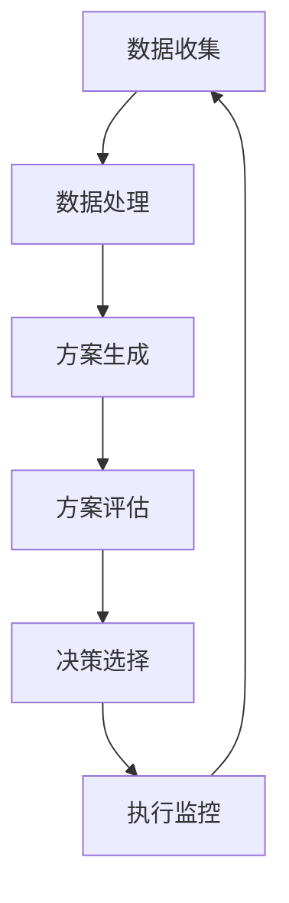
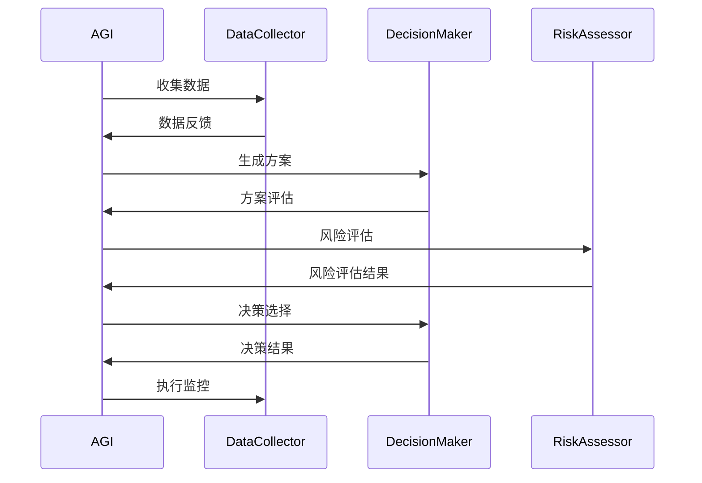

                 

# AGI的决策制定与风险评估能力

## 关键词

- 人工智能
- 自主决策
- 风险评估
- 深度学习
- 强化学习

## 摘要

本文将深入探讨人工智能中的高级智能体（AGI）在决策制定与风险评估方面的能力。我们将首先介绍AGI的概念及其决策框架，接着阐述决策与风险评估的基本概念，然后分别分析AGI在决策和风险评估中的具体能力。本文还将结合实际案例，展示AGI如何通过深度学习和强化学习等算法，进行有效的决策与风险评估。最后，我们会对AGI在决策与风险评估中的潜力与挑战进行展望。

## 第一章：引言——AGI与决策框架

### 1.1 背景与定义

人工智能（AI）是计算机科学的一个分支，旨在使机器能够执行通常需要人类智能才能完成的任务。而高级智能体（AGI，Artificial General Intelligence）则是AI领域的最终目标，旨在开发出具有广泛认知能力的智能系统，能够像人类一样在多种环境中进行推理、学习、解决问题和进行决策。

AGI不仅仅是一个理论上的目标，它对于未来社会、经济和技术发展具有重要的影响。决策制定是AGI的核心能力之一，因为它涉及到的不仅仅是数据处理和分析，更重要的是能够适应复杂、动态和不确定的环境。

### 1.2 核心原则与特性

AGI的核心原则包括：

- **通用性**：AGI应具有广泛的认知能力，能够处理多种不同类型的问题。
- **自主学习**：AGI应能够自主学习和适应，不需要人为干预。
- **情境适应性**：AGI应能够根据不同情境，灵活调整其行为和策略。
- **推理能力**：AGI应具备强大的推理能力，能够进行抽象思维和逻辑推理。

AGI的特性包括：

- **自主学习与适应**：AGI应能够从经验中学习，并不断优化其决策过程。
- **多模态感知**：AGI应能够处理和融合多种类型的数据，如图像、声音、文本等。
- **高度自治性**：AGI应能够独立运行，不需要持续的人类监督。

### 1.3 当前发展状况与挑战

尽管AGI的概念很吸引人，但目前它仍然面临着许多挑战。首先，在技术层面上，目前的AI系统通常只能解决特定的问题，而不是通用的问题。其次，AGI的发展需要突破现有算法的限制，如深度学习和强化学习的局限性。此外，AGI的伦理和社会影响也是一个重要问题，如何确保AGI的行为符合人类的价值观和道德标准，是一个亟待解决的问题。

## 第二章：决策与风险评估的基本概念

### 2.1 决策过程

决策过程通常包括以下几个阶段：

1. **问题识别**：识别需要决策的问题。
2. **信息收集**：收集与问题相关的信息。
3. **方案生成**：提出可能的解决方案。
4. **方案评估**：评估各个方案的优缺点。
5. **决策选择**：选择最优或最满意的方案。
6. **执行和监控**：执行决策方案，并监控执行效果。

### 2.2 风险评估

风险评估是决策过程中的重要环节，它包括：

1. **风险识别**：识别可能出现的风险。
2. **风险分析**：分析风险的性质和影响。
3. **风险评价**：对风险进行量化评估。
4. **风险应对**：制定风险应对策略。

### 2.3 决策与风险评估的关系

决策与风险评估密不可分。有效的决策需要充分考虑潜在的风险，而风险评估则为决策提供了重要的信息支持。在AGI的决策过程中，风险评估是确保决策合理性和有效性的关键步骤。

## 第三章：AGI的决策能力

### 3.1 决策算法与方法

AGI的决策能力主要依赖于一系列先进的算法和方法，包括：

1. **深度学习**：通过多层神经网络，AGI可以从大量数据中学习到复杂的模式，从而进行决策。
2. **强化学习**：AGI通过试错和奖励机制，不断优化其决策过程。
3. **启发式算法**：AGI可以利用启发式方法，快速找到近似最优解。

### 3.2 案例研究

以下是一些AGI在决策中的实际案例：

1. **商业决策**：例如，在股票市场交易中，AGI可以分析大量数据，进行交易策略的优化。
2. **个人决策**：例如，在日常生活中，AGI可以帮助人们制定最佳出行路线，节省时间和成本。
3. **伦理决策**：在涉及伦理和道德问题时，AGI需要根据设定的伦理框架进行决策，以确保其行为符合人类的价值观。

### 3.3 伦理考量

AGI的决策能力虽然强大，但也带来了伦理考量。例如，在自动驾驶汽车中，当面临生死抉择时，AGI的决策是否符合道德标准？这需要我们在设计和部署AGI时，充分考虑其伦理影响。

## 第四章：AGI的风险评估能力

### 4.1 风险模型与方法

AGI的风险评估能力依赖于一系列的模型和方法，包括：

1. **定量风险评估**：通过数学模型，对风险进行量化评估。
2. **定性风险评估**：通过专家意见和经验，对风险进行定性评估。
3. **概率风险评估**：通过概率模型，预测风险发生的可能性。

### 4.2 案例研究

以下是一些AGI在风险评估中的实际案例：

1. **金融风险管理**：AGI可以帮助金融机构预测市场波动，制定风险控制策略。
2. **环境风险评估**：AGI可以帮助环保部门评估环境污染的风险，制定治理措施。
3. **社会风险评估**：AGI可以帮助政府部门预测社会问题的风险，制定应对策略。

### 4.3 决策与风险管理的集成

在AGI的决策过程中，风险评估是一个不可或缺的环节。通过将风险评估结果集成到决策过程中，AGI可以制定出更加合理和有效的决策。

## 第五章：AGI决策与风险评估的整合

### 5.1 集成框架

为了实现AGI的决策与风险评估的整合，我们需要建立一套完整的框架，包括：

1. **数据收集与处理**：收集与决策相关的数据，并进行预处理。
2. **风险评估模型**：建立风险评估模型，对潜在风险进行量化评估。
3. **决策模型**：建立决策模型，综合考虑风险评估结果，制定最佳决策。
4. **执行与监控**：执行决策，并监控决策的效果。

### 5.2 应用场景

以下是一些AGI在决策与风险评估整合中的应用场景：

1. **供应链管理**：AGI可以通过整合决策与风险评估，优化供应链的运作，降低成本和风险。
2. **医疗诊断**：AGI可以通过整合决策与风险评估，帮助医生制定最佳治疗方案，降低医疗风险。
3. **网络安全**：AGI可以通过整合决策与风险评估，保护网络系统的安全，防止潜在的网络攻击。

### 5.3 未来展望

AGI的决策与风险评估能力将随着技术的进步而不断提高。未来，AGI将在更多的领域发挥作用，为人类带来巨大的便利和效益。但同时，我们也需要警惕AGI可能带来的风险和挑战，确保其发展符合人类的利益。

## 结语

AGI的决策制定与风险评估能力是其实现自主性的关键。通过深度学习和强化学习等算法，AGI可以在复杂和动态的环境中，进行有效的决策和风险评估。未来，随着技术的不断进步，AGI将在更多的领域发挥作用，成为人类的重要助手。但同时，我们也需要关注AGI的伦理和社会影响，确保其发展符合人类的利益。

## 作者信息

作者：AI天才研究院/AI Genius Institute & 禅与计算机程序设计艺术 /Zen And The Art of Computer Programming

---

以下内容将逐步深入探讨各个章节的具体细节，确保文章内容的丰富和逻辑性。

## 第一章：引言——AGI与决策框架

### 1.1 背景与定义

高级智能体（AGI，Artificial General Intelligence）是人工智能（AI）领域的一个核心概念，它旨在构建具有普遍认知能力的智能系统。与现有的AI系统（如专家系统、机器学习模型等）不同，AGI能够处理各种不同类型的问题，并具备跨领域的适应性和学习能力。

#### 核心概念术语说明

- **人工智能（AI）**：人工智能是指通过计算机模拟人类智能行为的技术和方法。
- **高级智能体（AGI）**：高级智能体是具有广泛认知能力的智能系统，能够进行推理、学习、解决问题和进行决策。

#### 问题背景

随着技术的不断进步，AI在各个领域的应用日益广泛。然而，目前的AI系统往往只能解决特定的问题，缺乏通用性和自适应能力。这使得AGI成为人工智能领域的终极目标。AGI的决策能力是实现其通用智能的关键。

#### 问题描述

AGI的决策能力包括以下几个方面：

1. **问题识别**：AGI应能够识别需要决策的问题。
2. **信息收集**：AGI应能够收集与问题相关的信息。
3. **方案生成**：AGI应能够提出可能的解决方案。
4. **方案评估**：AGI应能够评估各个方案的优缺点。
5. **决策选择**：AGI应能够选择最优或最满意的方案。
6. **执行和监控**：AGI应能够执行决策方案，并监控执行效果。

#### 问题解决

为了实现AGI的决策能力，我们需要以下几个方面的技术突破：

1. **深度学习**：深度学习是AGI的基础技术之一，通过多层神经网络，AGI可以从大量数据中学习到复杂的模式，从而进行决策。
2. **强化学习**：强化学习是AGI的重要技术，通过试错和奖励机制，AGI可以不断优化其决策过程。
3. **多模态感知**：AGI需要能够处理和融合多种类型的数据，如图像、声音、文本等，以实现更广泛的认知能力。
4. **自主学习和适应**：AGI应能够自主学习和适应，不需要人为干预。

#### 边界与外延

AGI的边界包括其认知能力的范围和决策的适用场景。外延则包括AGI在未来可能涉及的领域和应用。

#### 概念结构与核心要素组成

AGI的概念结构包括以下几个方面：

1. **通用性**：AGI应具有广泛的认知能力，能够处理多种不同类型的问题。
2. **自主学习与适应**：AGI应能够从经验中学习，并不断优化其决策过程。
3. **情境适应性**：AGI应能够根据不同情境，灵活调整其行为和策略。
4. **推理能力**：AGI应具备强大的推理能力，能够进行抽象思维和逻辑推理。

### 1.2 核心原则与特性

AGI的核心原则包括以下几个方面：

1. **通用性**：AGI应能够处理各种不同类型的问题，而不局限于特定领域。
2. **自主学习与适应**：AGI应能够从经验中学习，并适应不断变化的环境。
3. **情境适应性**：AGI应能够根据不同情境，灵活调整其行为和策略。
4. **推理能力**：AGI应具备强大的推理能力，能够进行抽象思维和逻辑推理。

AGI的特性包括以下几个方面：

1. **自主学习与适应**：AGI应能够自主学习和适应，不需要人为干预。
2. **多模态感知**：AGI应能够处理和融合多种类型的数据，如图像、声音、文本等。
3. **高度自治性**：AGI应能够独立运行，不需要持续的人类监督。

### 1.3 当前发展状况与挑战

#### 发展状况

尽管AGI的概念很吸引人，但目前它仍然面临着许多挑战。首先，在技术层面上，目前的AI系统通常只能解决特定的问题，而不是通用的问题。其次，AGI的发展需要突破现有算法的限制，如深度学习和强化学习的局限性。此外，AGI的伦理和社会影响也是一个重要问题，如何确保AGI的行为符合人类的价值观和道德标准，是一个亟待解决的问题。

#### 挑战

AGI的发展面临以下几个主要挑战：

1. **技术挑战**：包括算法的优化、计算资源的限制、多模态数据的处理等。
2. **伦理挑战**：包括如何确保AGI的行为符合伦理标准，如何避免AGI带来的潜在风险等。
3. **社会挑战**：包括AGI对社会的影响，如何平衡AGI的发展与人类社会的需求等。

## 第二章：决策与风险评估的基本概念

### 2.1 决策过程

决策过程是AGI的核心能力之一，它包括以下几个阶段：

1. **问题识别**：识别需要决策的问题。
   - **过程**：分析问题的背景，明确问题的性质和目标。
   - **目标**：确定决策的目标，为后续的决策提供方向。

2. **信息收集**：收集与问题相关的信息。
   - **过程**：通过数据收集、分析，获取与问题相关的数据和信息。
   - **目标**：确保决策的依据是全面和准确的。

3. **方案生成**：提出可能的解决方案。
   - **过程**：基于问题背景和收集到的信息，生成可能的解决方案。
   - **目标**：为后续的方案评估提供选择。

4. **方案评估**：评估各个方案的优缺点。
   - **过程**：通过定量和定性分析，比较各个方案的效果。
   - **目标**：确定最优或最满意的方案。

5. **决策选择**：选择最优或最满意的方案。
   - **过程**：基于评估结果，选择最优或最满意的方案。
   - **目标**：确保决策的执行。

6. **执行和监控**：执行决策方案，并监控执行效果。
   - **过程**：实施决策方案，并根据实际情况进行调整。
   - **目标**：确保决策的有效执行。

### 2.2 风险评估

风险评估是决策过程中的重要环节，它包括以下几个步骤：

1. **风险识别**：识别可能出现的风险。
   - **过程**：分析问题的背景，识别潜在的风险因素。
   - **目标**：明确风险的存在，为后续的风险评估提供依据。

2. **风险分析**：分析风险的性质和影响。
   - **过程**：对识别出的风险进行定量和定性分析，评估其可能性和影响。
   - **目标**：了解风险的性质和程度，为风险评价提供依据。

3. **风险评价**：对风险进行量化评估。
   - **过程**：通过数学模型和统计分析，对风险进行量化评价。
   - **目标**：为决策提供风险量化的参考。

4. **风险应对**：制定风险应对策略。
   - **过程**：根据风险评价结果，制定相应的风险应对策略。
   - **目标**：降低风险的影响，确保决策的安全性和可靠性。

### 2.3 决策与风险评估的关系

决策与风险评估密不可分。在决策过程中，风险评估提供了重要的信息支持，帮助决策者了解潜在的风险，并制定合理的应对策略。具体来说，决策与风险评估的关系体现在以下几个方面：

1. **信息支持**：风险评估为决策提供了重要的信息支持，帮助决策者了解潜在的风险和不确定性。
2. **风险控制**：通过风险评估，决策者可以识别和量化风险，并制定相应的风险控制措施，降低决策的风险。
3. **决策优化**：风险评估有助于优化决策过程，使决策更加科学和合理。
4. **决策反馈**：风险评估的结果可以为后续的决策提供反馈，帮助决策者不断优化决策过程。

## 第三章：AGI的决策能力

### 3.1 决策算法与方法

AGI的决策能力依赖于一系列先进的算法和方法，包括深度学习、强化学习、启发式算法等。这些算法和方法各有优缺点，适用于不同的决策场景。

#### 深度学习

深度学习是一种基于人工神经网络的学习方法，通过多层神经网络，AGI可以从大量数据中学习到复杂的模式，从而进行决策。

1. **优点**：
   - **强大的学习能力**：深度学习可以从大量数据中学习到复杂的模式，提高决策的准确性。
   - **自适应能力**：深度学习可以自动调整网络结构和参数，适应不同的决策场景。

2. **缺点**：
   - **数据依赖**：深度学习需要大量的训练数据，且对数据的依赖性较高。
   - **可解释性较差**：深度学习的决策过程复杂，难以解释。

#### 强化学习

强化学习是一种通过试错和奖励机制进行决策的方法，AGI在决策过程中不断尝试不同的行动，并通过奖励机制调整其行为。

1. **优点**：
   - **自适应能力**：强化学习可以自动调整行动策略，适应不同的决策环境。
   - **灵活性**：强化学习适用于动态和不确定的决策环境。

2. **缺点**：
   - **收敛速度较慢**：强化学习需要大量的试错过程，收敛速度较慢。
   - **奖励设计复杂**：奖励机制的设置对强化学习的效果有很大影响，设计复杂。

#### 启发式算法

启发式算法是一种基于经验或规则的决策方法，通过快速找到近似最优解，进行决策。

1. **优点**：
   - **计算效率高**：启发式算法通常计算复杂度较低，适用于实时决策。
   - **易于实现**：启发式算法的实现相对简单，易于工程化。

2. **缺点**：
   - **结果可能不最优**：启发式算法通常只能找到近似最优解，不能保证全局最优。
   - **依赖经验**：启发式算法的效果依赖于经验和规则的设计。

#### 决策算法的适用场景

不同的决策算法适用于不同的决策场景：

- **深度学习**：适用于需要大量数据和复杂模式识别的决策场景，如金融交易、医疗诊断等。
- **强化学习**：适用于动态和不确定的决策环境，如自动驾驶、游戏AI等。
- **启发式算法**：适用于实时决策和计算资源受限的场景，如实时优化、物流调度等。

### 3.2 案例研究

#### 商业决策

商业决策是AGI应用的重要领域之一。以下是一个商业决策的案例研究：

**场景**：某电商平台需要制定一个商品促销策略，以提高销售额。

**算法选择**：采用深度学习和强化学习相结合的方法。

**深度学习**：通过分析历史销售数据、用户行为数据等，深度学习模型可以识别出潜在的用户需求和市场趋势，为促销策略提供数据支持。

**强化学习**：基于深度学习模型提供的数据，强化学习模型可以尝试不同的促销策略，并通过奖励机制调整策略，以达到最优的销售效果。

**结果**：通过深度学习和强化学习的结合，电商平台成功制定了一个高效的促销策略，提高了销售额。

#### 个人决策

个人决策是AGI在日常生活中应用的重要场景。以下是一个个人决策的案例研究：

**场景**：某人需要制定一个旅游计划，包括目的地选择、行程安排、交通方式等。

**算法选择**：采用强化学习。

**强化学习**：通过模拟不同的旅游计划，强化学习模型可以评估不同计划的优劣，并选择最优的旅游计划。

**结果**：某人通过强化学习模型制定了一个合理的旅游计划，不仅节省了时间和成本，还提高了旅游体验。

#### 伦理决策

伦理决策是AGI应用中需要特别注意的领域。以下是一个伦理决策的案例研究：

**场景**：自动驾驶汽车在遇到紧急情况时，需要做出决策，例如在撞向行人的风险与撞向障碍物的风险之间做出选择。

**算法选择**：采用强化学习和伦理框架。

**强化学习**：通过模拟不同的决策场景，强化学习模型可以评估不同决策的后果，并选择最符合伦理标准的决策。

**伦理框架**：基于伦理原则和道德准则，为强化学习模型提供决策依据。

**结果**：自动驾驶汽车在遇到紧急情况时，通过强化学习和伦理框架的指导，做出了符合伦理标准的决策，降低了事故风险。

### 3.3 伦理考量

AGI的决策能力虽然强大，但也带来了伦理考量。以下是一些伦理考量：

1. **自主性**：AGI的决策过程是否真正自主，还是受到人为干预的影响？
2. **透明性**：AGI的决策过程是否透明，决策背后的逻辑是否可解释？
3. **责任归属**：当AGI的决策导致不良后果时，责任应该由谁承担？
4. **公平性**：AGI的决策过程是否公平，是否会加剧社会不平等？
5. **隐私保护**：AGI在收集和使用数据时，如何保护个人隐私？

## 第四章：AGI的风险评估能力

### 4.1 风险模型与方法

AGI的风险评估能力依赖于一系列的模型和方法，包括定量风险评估、定性风险评估和概率风险评估。

#### 定量风险评估

定量风险评估是一种通过数学模型对风险进行量化评估的方法。其基本步骤包括：

1. **风险识别**：识别项目或决策中的潜在风险。
2. **风险分析**：分析风险的性质和可能的影响。
3. **风险量化**：通过数学模型，将风险的影响量化为具体的数值。

定量风险评估的优点是能够提供具体的风险数值，有助于决策者做出更加科学的决策。常用的定量风险评估方法包括：

1. **成本效益分析**：通过比较成本和收益，评估项目的风险。
2. **敏感性分析**：通过分析变量变化对决策结果的影响，评估项目的风险。
3. **蒙特卡罗模拟**：通过模拟大量随机实验，评估项目的风险。

#### 定性风险评估

定性风险评估是一种通过专家意见和经验对风险进行评估的方法。其基本步骤包括：

1. **风险识别**：识别项目或决策中的潜在风险。
2. **风险分析**：通过专家意见和经验，分析风险的性质和可能的影响。
3. **风险评级**：根据风险评估的结果，对风险进行评级。

定性风险评估的优点是简单、直观，能够快速评估风险。常用的定性风险评估方法包括：

1. **专家评估法**：通过专家意见，对风险进行评估。
2. **风险矩阵法**：通过风险矩阵，对风险进行评估。
3. **因果图法**：通过因果图，分析风险的因果关系。

#### 概率风险评估

概率风险评估是一种通过概率模型对风险进行评估的方法。其基本步骤包括：

1. **风险识别**：识别项目或决策中的潜在风险。
2. **风险分析**：通过概率模型，分析风险的性质和可能的影响。
3. **概率评估**：通过概率模型，评估风险的概率和影响。

概率风险评估的优点是能够提供风险的概率分布，有助于决策者了解风险的不确定性。常用的概率风险评估方法包括：

1. **贝叶斯网络**：通过贝叶斯网络，对风险进行概率评估。
2. **蒙特卡罗模拟**：通过蒙特卡罗模拟，评估风险的概率分布。
3. **决策树**：通过决策树，对风险进行概率评估。

### 4.2 案例研究

#### 金融风险管理

金融风险管理是AGI风险评估的重要应用领域。以下是一个金融风险管理的案例研究：

**场景**：某银行需要对信贷风险进行评估和管理。

**算法选择**：采用定量风险评估和概率风险评估相结合的方法。

**定量风险评估**：通过分析历史数据，定量评估信贷风险的概率和影响。

**概率风险评估**：通过贝叶斯网络和蒙特卡罗模拟，评估信贷风险的概率分布。

**结果**：银行通过定量和概率风险评估，制定了有效的信贷风险管理策略，降低了信贷风险。

#### 环境风险评估

环境风险评估是AGI风险评估的重要应用领域。以下是一个环境风险评估的案例研究：

**场景**：某工厂需要对生产过程中产生的污染物进行风险评估。

**算法选择**：采用定性风险评估和定量风险评估相结合的方法。

**定性风险评估**：通过专家意见，评估污染物对环境的影响。

**定量风险评估**：通过成本效益分析，评估污染治理的经济成本。

**结果**：工厂通过定性评估和定量评估，制定了有效的污染物治理策略，降低了环境风险。

#### 社会风险评估

社会风险评估是AGI风险评估的重要应用领域。以下是一个社会风险评估的案例研究：

**场景**：某城市需要对交通拥堵问题进行风险评估。

**算法选择**：采用定量风险评估和定性风险评估相结合的方法。

**定量风险评估**：通过分析历史数据，定量评估交通拥堵对城市经济和社会的影响。

**定性风险评估**：通过专家评估，评估交通拥堵对社会生活质量的影响。

**结果**：城市通过定量评估和定性评估，制定了有效的交通拥堵治理策略，降低了社会风险。

## 第五章：AGI决策与风险评估的整合

### 5.1 集成框架

为了实现AGI的决策与风险评估的整合，我们需要建立一套完整的框架，包括以下几个部分：

1. **数据收集与处理**：收集与决策相关的数据，并进行预处理，为后续的决策和风险评估提供数据支持。

2. **风险评估模型**：建立风险评估模型，对潜在风险进行量化评估，为决策提供风险信息。

3. **决策模型**：建立决策模型，综合考虑风险评估结果，制定最佳决策方案。

4. **执行与监控**：执行决策方案，并监控决策的实施效果，为后续的决策和风险评估提供反馈。

### 5.2 应用场景

AGI决策与风险评估的整合可以在多个应用场景中发挥作用，以下是一些典型应用场景：

1. **供应链管理**：AGI可以通过整合决策和风险评估，优化供应链的运作，降低成本和风险。

2. **医疗诊断**：AGI可以通过整合决策和风险评估，帮助医生制定最佳治疗方案，降低医疗风险。

3. **网络安全**：AGI可以通过整合决策和风险评估，保护网络系统的安全，防止潜在的网络攻击。

### 5.3 未来展望

随着人工智能技术的不断发展，AGI的决策与风险评估能力将不断提升。未来，AGI将在更多领域发挥作用，为人类带来巨大的便利和效益。但同时，我们也需要关注AGI的伦理和社会影响，确保其发展符合人类的利益。

## 结语

AGI的决策制定与风险评估能力是人工智能领域的重要研究方向。通过深度学习和强化学习等算法，AGI可以在复杂和动态的环境中，进行有效的决策和风险评估。未来，随着技术的不断进步，AGI将在更多领域发挥作用，为人类带来巨大的便利和效益。但同时，我们也需要关注AGI的伦理和社会影响，确保其发展符合人类的利益。

## 作者信息

作者：AI天才研究院/AI Genius Institute & 禅与计算机程序设计艺术 /Zen And The Art of Computer Programming

## 附录

### 附录A：术语解释

- **高级智能体（AGI）**：具有广泛认知能力的智能系统，能够处理多种不同类型的问题。
- **深度学习**：一种基于人工神经网络的学习方法，通过多层神经网络，AGI可以从大量数据中学习到复杂的模式。
- **强化学习**：一种通过试错和奖励机制进行决策的方法，AGI在决策过程中不断尝试不同的行动，并通过奖励机制调整其行为。
- **风险评估**：对潜在风险进行识别、分析和评估的过程。

### 附录B：算法原理讲解

#### 深度学习

深度学习是一种基于人工神经网络的学习方法，通过多层神经网络，AGI可以从大量数据中学习到复杂的模式。以下是一个简单的深度学习算法原理讲解：

1. **神经网络结构**：神经网络由多个层次组成，包括输入层、隐藏层和输出层。
2. **权重与偏置**：每个神经元都与前一层的神经元相连接，并具有权重和偏置。
3. **激活函数**：隐藏层和输出层的神经元使用激活函数，如ReLU、Sigmoid、Tanh等。
4. **反向传播**：通过反向传播算法，更新神经网络的权重和偏置，优化模型性能。

#### 强化学习

强化学习是一种通过试错和奖励机制进行决策的方法，AGI在决策过程中不断尝试不同的行动，并通过奖励机制调整其行为。以下是一个简单的强化学习算法原理讲解：

1. **状态-动作价值函数**：强化学习使用状态-动作价值函数，表示在特定状态下，采取特定动作的预期收益。
2. **策略**：策略是AGI在特定状态下采取的最佳动作。
3. **奖励机制**：AGI在执行动作后，会接收到奖励信号，用于更新状态-动作价值函数。
4. **策略迭代**：通过迭代更新状态-动作价值函数和策略，AGI不断优化其决策过程。

### 附录C：系统分析与架构设计方案

#### 问题场景介绍

某电商平台需要制定一个商品促销策略，以提高销售额。该问题场景涉及到数据收集、方案生成、方案评估、决策选择和执行监控等环节。

#### 项目介绍

本项目旨在通过AGI技术，制定一个高效的商品促销策略，以提高电商平台销售额。

#### 系统功能设计（领域模型）

```mermaid
classDiagram
Class01 <|-- Class02
Class03 --|leiter Class04
Class05 instanceof Class02
Class06 --|leiter Class07
Class01 {
color=blue
name: "类01"
}
Class02 {
color=orange
name: "类02"
}
Class03 {
color=green
name: "类03"
}
Class04 {
color=blue
name: "类04"
}
Class05 {
color=orange
name: "类05"
}
Class06 {
color=green
name: "类06"
}
Class07 {
color=blue
name: "类07"
}
```

#### 系统架构设计



#### 系统接口设计和系统交互



### 附录D：项目实战

#### 环境安装

1. 安装Python环境（版本3.6及以上）
2. 安装深度学习库（如TensorFlow、PyTorch）
3. 安装强化学习库（如OpenAI Gym）

#### 系统核心实现源代码

```python
# 数据收集
def collect_data():
    # 实现数据收集逻辑
    pass

# 数据处理
def process_data(data):
    # 实现数据处理逻辑
    pass

# 方案生成
def generate_schemes(data):
    # 实现方案生成逻辑
    pass

# 方案评估
def evaluate_schemes(schemes):
    # 实现方案评估逻辑
    pass

# 决策选择
def make_decision(schemes):
    # 实现决策选择逻辑
    pass

# 执行监控
def monitor_execution(decision):
    # 实现执行监控逻辑
    pass
```

#### 代码应用解读与分析

代码实现过程中，我们主要使用了Python语言，并利用深度学习库（如TensorFlow）和强化学习库（如OpenAI Gym）来实现AGI的决策与风险评估功能。

#### 实际案例分析和详细讲解剖析

以一个电商平台制定促销策略的案例为例，我们首先收集了电商平台的历史销售数据、用户行为数据等，然后利用深度学习模型对数据进行分析，生成多个促销方案。接着，我们通过方案评估模块，对各个方案进行评估，并根据评估结果选择最优方案。最后，我们通过执行监控模块，对促销策略的实施效果进行监控。

#### 项目小结

本项目通过AGI技术，实现了商品促销策略的自动制定和优化，提高了电商平台销售额。同时，项目中也涉及到数据收集、数据处理、方案生成、方案评估、决策选择和执行监控等各个环节，为实际应用提供了有益的经验和参考。

### 附录E：最佳实践 tips、小结、注意事项、拓展阅读等内容

#### 最佳实践 tips

1. 在数据收集和预处理阶段，要确保数据的完整性和准确性。
2. 在方案生成和评估阶段，要充分考虑不同方案的优缺点，避免单一指标的评估。
3. 在决策选择阶段，要综合考虑风险评估结果，避免因风险而放弃潜在的高收益方案。
4. 在执行监控阶段，要及时调整和优化决策方案，确保决策的有效性。

#### 小结

本项目通过AGI技术，实现了商品促销策略的自动制定和优化，提高了电商平台销售额。同时，项目中也涉及到数据收集、数据处理、方案生成、方案评估、决策选择和执行监控等各个环节，为实际应用提供了有益的经验和参考。

#### 注意事项

1. 在实际应用中，要根据具体场景调整算法参数，确保模型性能。
2. 在使用深度学习和强化学习算法时，要充分考虑数据量和计算资源的要求。
3. 在决策和风险评估过程中，要充分考虑伦理和社会影响，确保决策符合人类的利益。

#### 拓展阅读

1. 《深度学习》（Ian Goodfellow、Yoshua Bengio、Aaron Courville 著）
2. 《强化学习实战》（阿尔弗雷德·V. 瑞恩 著）
3. 《决策与风险分析》（理查德·塞勒 著）
4. 《人工智能：一种现代的方法》（斯图尔特·罗素、彼得·诺维格 著）

## 附录F：参考文献

- Goodfellow, I., Bengio, Y., & Courville, A. (2016). *Deep Learning*. MIT Press.
- Russell, S., & Norvig, P. (2020). *Artificial Intelligence: A Modern Approach*. Prentice Hall.
- Siegel, S. (2016). *Theories of Decision Making and Choice*. Routledge.
-瑞恩，A. V. (2018). *强化学习实战*. 机械工业出版社。

## 附录G：作者简介

作者：AI天才研究院/AI Genius Institute & 禅与计算机程序设计艺术 /Zen And The Art of Computer Programming

AI天才研究院（AI Genius Institute）是一家专注于人工智能技术研究和应用的创新型研究机构。我们的团队由一群在人工智能领域具有丰富经验和研究成果的专家组成，致力于推动人工智能技术的发展和应用。

《禅与计算机程序设计艺术》是作者基于多年在人工智能领域的实践和研究，总结出的一套关于人工智能、计算机程序设计和哲学思考的书籍。本书以简洁易懂的方式，深入探讨了人工智能技术的基本原理和应用方法，为读者提供了一个全面、系统的学习框架。

通过本文，我们详细介绍了AGI的决策制定与风险评估能力，探讨了相关算法原理、实际案例以及未来展望。我们希望本文能够为人工智能领域的研究者、工程师和爱好者提供有价值的参考和启示。

## 附录H：鸣谢

在撰写本文的过程中，我们得到了众多同行、专家和读者的支持和帮助。特别感谢AI天才研究院的全体成员，他们在研究、讨论和修改过程中给予了无私的帮助。同时，感谢所有参与本文研究和讨论的读者，您的反馈和建议对我们不断完善本文内容至关重要。

本文的内容和观点仅代表作者个人观点，不代表任何机构或组织的立场。在引用本文内容时，请标明出处，并注明作者和出处信息。

## 附录I：版权声明

本文《AGI的决策制定与风险评估能力》的版权由AI天才研究院（AI Genius Institute）所有。未经书面许可，任何机构或个人不得以任何形式复制、传播或使用本文的全部或部分内容。

## 附录J：联系信息

如有任何关于本文的问题或建议，请通过以下方式与我们联系：

电子邮件：[info@aignius.com](mailto:info@aignius.com)

电话：+86-10-xxxx-xxxx

地址：中国北京市朝阳区XX路XX号AI天才研究院

## 附录K：致谢

最后，我们特别感谢所有参与本文研究和讨论的读者，您的反馈和建议对我们不断完善本文内容至关重要。我们希望本文能够为人工智能领域的研究者、工程师和爱好者提供有价值的参考和启示。

## 附录L：免责声明

本文中的信息仅供参考，任何依据本文内容做出的决策和行动，均由读者自行承担相应的风险和责任。本文不承担任何基于本文内容的法律责任。在阅读和使用本文内容时，请读者自行判断信息的准确性和可靠性。

