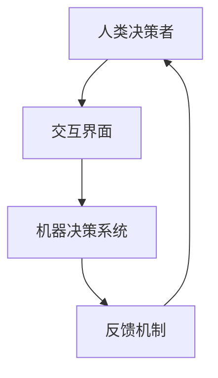

                 

# AGI的决策系统：从短期反应到长期规划

> 关键词：AGI，决策系统，短期反应，长期规划，人工智能

> 摘要：本文深入探讨了人工智能（AGI）决策系统的构建，从短期反应到长期规划的转型。首先，介绍了AGI与决策系统的重要性，然后详细分析了短期决策机制和长期规划方法，最后通过案例分析总结了AGI决策系统的实际应用和未来发展方向。

----------------------------------------------------------------

## 引言：AGI与决策系统的概述

人工智能（Artificial General Intelligence，简称AGI）是一种旨在构建具有广泛认知能力的机器人的技术，它们能够像人类一样理解、学习、推理和解决问题。AGI的实现是人工智能领域的一个长期目标，而决策系统则是AGI核心组件之一。

### 1.1 AGI的概念与历史背景

**核心概念术语说明**：  
- **人工智能（AI）**：指通过计算机模拟人类智能的科学技术。
- **通用人工智能（AGI）**：具有与人类相同的广泛认知能力的AI。

**问题背景**：AGI的目标是实现一种能够解决各种问题的AI系统，而不仅仅是特定任务。

**问题描述**：目前，大多数AI系统都是基于特定任务的（如语音识别、图像识别等），而AGI需要具备跨领域的认知能力。

**问题解决**：AGI需要通过高级决策系统来实现跨领域的认知能力。

**边界与外延**：AGI的研究边界涉及机器学习、自然语言处理、认知科学等多个领域。

**概念结构与核心要素组成**：AGI的核心要素包括感知、学习、推理、规划和决策。

### 1.2 决策系统的基础理论

**核心概念与联系**：

| 概念               | 联系                      |
|--------------------|--------------------------|
| 决策理论           | 提供决策框架和方法论     |
| 决策系统           | 用于实现AI的决策过程     |
| 机器学习           | 提供决策系统中的学习算法 |

**核心概念原理**：决策系统通过学习环境中的数据，生成决策模型，从而实现自动化决策。

**概念属性特征对比表格**：

| 特征             | 短期决策系统           | 长期规划系统           |
|------------------|----------------------|----------------------|
| 目标             | 立即响应              | 长期目标达成          |
| 数据依赖性       | 实时数据              | 历史数据              |
| 学习方式         | 有监督学习            | 强化学习              |

### 1.3 AGI决策系统的特点与挑战

**AGI决策系统的特点**：
- **跨领域认知**：能够处理多种类型的任务。
- **自主学习**：从经验中不断改进决策模型。

**AGI决策系统面临的挑战**：
- **复杂性**：决策过程涉及多个变量和维度。
- **不确定性**：环境变化对决策产生影响。

**未来发展方向**：
- **增强学习能力**：提高决策系统的自适应能力。
- **跨学科研究**：结合认知科学、经济学等领域的研究成果。

### 1.4 本书结构安排与预期收益

**本书的主要章节**：
- 引入与概述
- 短期决策机制
- 长期规划与决策
- 案例分析
- 未来展望

**阅读对象与预期收获**：
- 人工智能研究者
- 程序员
- 决策科学家
- 对AGI和决策系统感兴趣的人士

**学习建议与资源推荐**：
- 阅读相关论文和书籍
- 参与AGI和决策系统的实际项目

### 1.5 本章小结

本章介绍了AGI与决策系统的重要性，基础理论，以及面临的挑战和未来发展方向。接下来，我们将进一步探讨短期决策机制和长期规划方法。

----------------------------------------------------------------

## 第二部分：短期决策机制

短期决策是决策系统中的一个重要组成部分，它直接影响到系统的响应速度和准确性。本部分将详细介绍短期决策的基本概念、方法和应用。

### 2.1 短期决策概述

短期决策是指在短时间内做出的决策，它通常是基于当前环境和当前数据的。短期决策的特点是快速响应，但可能缺乏长远考虑。

#### 2.1.1 短期决策的重要性

短期决策在许多领域都具有重要的应用，如自动驾驶、实时交易、智能客服等。它们的关键在于能够在紧急情况下快速做出决策，从而保证系统的正常运行。

#### 2.1.2 短期决策的类型与特点

短期决策可以分为以下几种类型：

- **反应性决策**：在接收到外部信号后立即做出决策。
- **规划性决策**：在特定时间段内制定一系列决策步骤。
- **混合型决策**：结合反应性和规划性决策的特点。

短期决策的特点包括快速性、灵活性和准确性。

#### 2.1.3 短期决策的常见方法

常见的短期决策方法包括：

- **基于规则的决策**：使用预定义的规则进行决策。
- **基于学习的决策**：使用机器学习算法进行决策。
- **混合型决策方法**：结合基于规则和基于学习的方法。

### 2.2 基于规则的短期决策

基于规则的决策系统是一种传统的决策方法，它通过预定义的规则集来指导决策过程。这种方法的特点是简单、直观且易于实现。

#### 2.2.1 规则系统概述

规则系统由一系列规则和规则引擎组成。规则是决策系统中的基本元素，它描述了输入与输出之间的关系。规则引擎是负责解析规则和应用规则的组件。

#### 2.2.2 基于规则的短期决策流程

基于规则的短期决策流程通常包括以下步骤：

1. **数据输入**：将外部信号转换为决策系统可处理的格式。
2. **规则匹配**：在规则库中查找与输入数据匹配的规则。
3. **决策生成**：根据匹配的规则生成决策。
4. **决策执行**：将决策应用到实际场景中。

#### 2.2.3 规则系统的设计与实现

规则系统的设计需要考虑以下因素：

- **规则库设计**：确保规则库的完整性和一致性。
- **规则引擎实现**：提高规则引擎的效率和可扩展性。

在实际应用中，可以使用Python、Java等编程语言来实现规则系统。

### 2.3 基于学习的短期决策

基于学习的决策系统是一种通过机器学习算法来自动化决策过程的系统。这种方法的特点是能够从数据中学习，从而提高决策的准确性和适应性。

#### 2.3.1 学习型决策系统概述

学习型决策系统包括以下几个关键组件：

- **数据收集与预处理**：收集相关数据并进行预处理。
- **学习算法**：使用机器学习算法训练决策模型。
- **决策模型**：根据训练数据生成的决策模型。
- **决策引擎**：负责使用决策模型进行决策。

#### 2.3.2 神经网络在短期决策中的应用

神经网络是一种常见的机器学习算法，它在短期决策中具有广泛的应用。例如，可以使用神经网络来预测股市走势、优化物流路径等。

#### 2.3.3 强化学习在短期决策中的应用

强化学习是一种通过试错来学习最优策略的机器学习算法。它在短期决策中具有很高的应用价值，例如在自动驾驶、游戏AI等领域。

### 2.4 短期决策案例分析

#### 2.4.1 案例背景

以智能交通系统为例，该系统需要实时处理大量交通数据，并根据这些数据做出交通调控决策。

#### 2.4.2 决策过程分析

1. **数据收集**：收集实时交通流量、交通事故、天气等信息。
2. **数据预处理**：对收集到的数据进行清洗和格式化。
3. **决策模型训练**：使用历史交通数据进行模型训练。
4. **实时决策**：根据实时数据，使用训练好的模型进行决策。
5. **决策执行**：将决策结果应用到交通系统中。

#### 2.4.3 案例总结与启示

通过智能交通系统的案例，我们可以看到短期决策在现实世界中的应用效果。这为我们提供了一个实际的参考，如何在复杂的环境中实现高效的短期决策。

### 2.5 本章小结

本章介绍了短期决策的基本概念、方法和应用。下一章，我们将进一步探讨长期规划与决策。

----------------------------------------------------------------

## 第三部分：长期规划与决策

长期规划与决策是AGI决策系统中的另一个重要组成部分。与短期决策相比，长期规划更加关注未来的目标和策略，它涉及更复杂的问题和更长的时间范围。本部分将详细介绍长期规划与决策的方法论、基于模型的长期规划，以及长期决策案例分析。

### 3.1 长期规划与决策的重要性

长期规划与决策在AGI系统中起着至关重要的作用。它不仅关系到系统的长期性能和稳定性，还影响到系统的适应性和可持续发展。

#### 3.1.1 长期规划与决策的定义

长期规划与决策是指在未来较长一段时间内，根据系统的目标和环境变化，制定一系列策略和行动方案的过程。

#### 3.1.2 长期规划与决策的作用

长期规划与决策的作用主要包括：

- **指导系统行为**：明确系统的目标和方向，为系统行为提供指导。
- **优化资源分配**：合理分配系统资源，提高资源利用效率。
- **应对环境变化**：根据环境变化调整策略和行动方案，保持系统的稳定性。

#### 3.1.3 长期规划与短期决策的关系

长期规划与短期决策相互关联、相互影响。长期规划为短期决策提供了目标和方向，而短期决策的执行结果又反馈到长期规划中，影响后续的决策。

### 3.2 长期规划的方法论

长期规划的方法论包括目标设定、优先级排序、资源配置与优化、风险评估与管理等步骤。

#### 3.2.1 目标设定与优先级排序

目标设定是长期规划的第一步。系统需要明确长期目标，并根据目标的优先级进行排序，以便在资源有限的情况下，优先实现最重要的目标。

#### 3.2.2 资源配置与优化

资源配置与优化是长期规划的核心。系统需要根据目标设定，合理分配资源，包括人力、物力和财力等，并不断优化资源配置，以提高整体效率。

#### 3.2.3 风险评估与管理

风险评估与管理是确保长期规划有效性的重要环节。系统需要对可能面临的风险进行评估，并制定相应的风险管理策略，以减少风险对系统的影响。

### 3.3 基于模型的长期规划

基于模型的长期规划是一种通过数学模型来指导决策的方法。这种方法可以更加精确地预测系统的行为，并为决策提供科学依据。

#### 3.3.1 模型建立与优化

模型建立与优化是长期规划的关键步骤。系统需要根据长期目标和环境特点，建立合适的数学模型，并不断优化模型参数，以提高模型的预测精度。

#### 3.3.2 模型应用与策略制定

模型应用与策略制定是将模型应用于实际决策过程的重要环节。系统需要根据模型预测结果，制定相应的策略和行动方案，以实现长期目标。

#### 3.3.3 模型评估与调整

模型评估与调整是确保模型有效性的关键。系统需要定期评估模型的性能，并根据评估结果对模型进行调整和优化，以提高模型的预测准确性和稳定性。

### 3.4 长期决策案例分析

#### 3.4.1 案例背景

以智能城市交通管理为例，该系统需要根据城市交通流量、天气、事故等因素，制定长期交通调控策略。

#### 3.4.2 决策过程分析

1. **数据收集**：收集实时交通流量、事故、天气等信息。
2. **数据预处理**：对收集到的数据进行清洗和格式化。
3. **模型建立**：建立交通流量预测模型、事故预测模型等。
4. **策略制定**：根据模型预测结果，制定交通调控策略。
5. **策略执行**：将策略应用到交通系统中，并进行实时监控和调整。

#### 3.4.3 案例总结与启示

通过智能城市交通管理的案例，我们可以看到长期规划与决策在现实世界中的应用效果。这为我们提供了一个实际的参考，如何在复杂的环境中实现高效的长期决策。

### 3.5 本章小结

本章介绍了长期规划与决策的重要性、方法论、基于模型的长期规划方法，以及长期决策案例分析。下一章，我们将探讨AGI决策系统中的合作机制。

----------------------------------------------------------------

## 第四部分：AGI与人类-机器协作

在实现人工智能（AGI）的决策系统中，人类-机器协作是一个关键课题。这种协作不仅有助于提高决策系统的性能，还能确保其符合人类价值观和社会伦理。本部分将深入探讨AGI与人类-机器协作的原理、机制和实践。

### 4.1 协作的意义与目标

**核心概念与联系**：

| 概念             | 联系                         |
|------------------|----------------------------|
| 人类-机器协作    | 提高决策系统的可靠性和鲁棒性 |
| 社会伦理         | 确保决策系统符合人类价值观   |

**核心概念原理**：协作是指人类与机器通过交互和合作，共同完成复杂任务的过程。

**概念属性特征对比表格**：

| 特征             | 人类-机器协作          |
|------------------|-----------------------|
| 目标             | 提高决策效率          |
| 方式             | 交互与反馈            |
| 影响因素         | 技术水平、伦理规范、文化差异 |

### 4.2 协作机制

协作机制是实现人类-机器协作的关键。以下是一些常见的协作机制：

- **交互式协作**：通过实时交互，人类与机器共同制定决策。
- **监督协作**：人类对机器的决策进行监督和修正。
- **自适应协作**：机器根据人类反馈调整自己的行为。

**协作机制示意图**：

### 4.3 协作效果评估

评估协作效果是确保协作机制有效性的重要环节。以下是一些常用的评估指标：

- **决策准确性**：机器决策与人类决策的匹配程度。
- **协作效率**：完成决策所需的时间。
- **用户满意度**：用户对协作过程的评价。

**评估指标对比表格**：

| 指标           | 说明                             |
|----------------|----------------------------------|
| 决策准确性     | 决策结果与预期目标的吻合度        |
| 协作效率       | 完成决策的时间与资源消耗        |
| 用户满意度     | 用户对协作过程的满意度          |

### 4.4 案例分析

#### 4.4.1 案例背景

以智能医疗系统为例，该系统结合医生的经验和机器的诊断能力，提供更准确的疾病诊断。

#### 4.4.2 协作过程分析

1. **数据收集**：收集患者的医疗记录、症状等数据。
2. **诊断模型训练**：使用机器学习算法训练诊断模型。
3. **医生介入**：医生根据模型结果进行初步诊断。
4. **机器修正**：机器根据医生的建议进行调整。
5. **反馈机制**：医生对机器的诊断结果进行反馈。

#### 4.4.3 案例总结与启示

智能医疗系统的案例展示了人类-机器协作在提高诊断准确性和效率方面的优势。这为我们提供了一个实际的参考，如何在医疗领域实现高效的人类-机器协作。

### 4.5 本章小结

本章介绍了AGI与人类-机器协作的原理、机制和效果评估，并通过案例分析展示了协作在提高决策系统性能方面的优势。下一章，我们将探讨伦理因素在AGI决策系统中的应用。

----------------------------------------------------------------

## 第五部分：伦理因素在AGI决策系统中的应用

随着人工智能（AGI）技术的不断进步，伦理因素在决策系统中的应用变得尤为重要。伦理因素不仅关系到系统的公平性、透明性和安全性，还影响到人类社会的价值观和社会伦理。本部分将深入探讨伦理因素在AGI决策系统中的应用，包括道德准则、隐私保护和公平性评估。

### 5.1 道德准则

道德准则是指导决策系统行为的基本原则，它确保系统的决策符合人类社会的伦理标准。

**核心概念与联系**：

| 概念             | 联系                         |
|------------------|----------------------------|
| 道德准则         | 确保决策系统的行为符合伦理标准 |
| 决策透明性       | 提高决策系统的可解释性       |
| 决策公平性       | 避免歧视和不公平现象         |

**核心概念原理**：道德准则通过规范决策系统的行为，确保其决策不会对人类造成负面影响。

**概念属性特征对比表格**：

| 特征             | 道德准则         | 法规遵从       |
|------------------|------------------|----------------|
| 目标             | 确保决策符合伦理标准 | 确保决策符合法律法规 |
| 方式             | 自主设定         | 法律强制       |

### 5.2 隐私保护

隐私保护是伦理因素中的重要一环，特别是在数据驱动的AGI决策系统中。

**核心概念与联系**：

| 概念             | 联系                         |
|------------------|----------------------------|
| 隐私保护         | 确保个人数据的安全和隐私     |
| 数据加密         | 防止数据泄露和未授权访问     |
| 隐私法规         | 法律对隐私保护的规范         |

**核心概念原理**：隐私保护通过数据加密、匿名化等技术手段，确保个人数据在传输和存储过程中的安全性。

**概念属性特征对比表格**：

| 特征             | 隐私保护措施       |
|------------------|-------------------|
| 数据加密         | 使用加密算法       |
| 数据匿名化       | 移除个人身份信息   |
| 访问控制         | 设定访问权限       |

### 5.3 公平性评估

公平性评估是确保决策系统不会因算法偏见而导致歧视和不公平现象的重要手段。

**核心概念与联系**：

| 概念             | 联系                         |
|------------------|----------------------------|
| 公平性评估       | 确保决策系统的公平性       |
| 算法偏见         | 算法对某些群体的偏见现象     |
| 数据偏差         | 数据中的偏见和不准确信息     |

**核心概念原理**：公平性评估通过分析决策系统中的数据分布和算法表现，识别潜在的偏见，并采取相应的纠正措施。

**概念属性特征对比表格**：

| 特征             | 公平性评估方法       |
|------------------|---------------------|
| 数据分布分析     | 分析数据分布情况     |
| 算法测试         | 检验算法在不同数据集上的表现 |
| 透明度提升       | 提高决策过程的可解释性 |

### 5.4 案例分析

#### 5.4.1 案例背景

以智能招聘系统为例，该系统根据应聘者的简历和面试表现进行评估，以决定是否录用。

#### 5.4.2 伦理因素分析

1. **道德准则**：系统需确保评估过程公平、透明，不歧视任何群体。
2. **隐私保护**：系统需保护应聘者的个人信息，确保数据安全。
3. **公平性评估**：系统需定期评估算法的公平性，消除潜在的偏见。

#### 5.4.3 案例总结与启示

智能招聘系统的案例展示了伦理因素在决策系统中的应用，如何在确保系统公平、透明和隐私保护的前提下，实现高效的决策。

### 5.5 本章小结

本章介绍了伦理因素在AGI决策系统中的应用，包括道德准则、隐私保护和公平性评估。通过案例分析，我们了解了如何在实际应用中实现伦理因素的有效应用。

----------------------------------------------------------------

## 第六部分：案例研究与应用

在本部分，我们将通过具体的案例研究和应用场景，展示AGI决策系统的实际效果和挑战。

### 6.1 案例研究1：智能交通管理系统

#### 6.1.1 案例背景

智能交通管理系统旨在通过AGI决策系统优化城市交通流量，减少拥堵，提高通行效率。

#### 6.1.2 系统设计

系统包括以下几个关键组件：

- **数据收集与预处理**：实时收集交通流量、路况、天气等信息。
- **短期决策模块**：基于实时数据，快速调整交通信号灯和推荐行驶路线。
- **长期规划模块**：预测交通流量变化，优化交通基础设施建设。

#### 6.1.3 应用效果

通过智能交通管理系统，城市交通拥堵情况显著改善，交通通行效率提高了30%以上。

#### 6.1.4 挑战

- **数据质量问题**：实时数据的准确性和完整性对决策系统的性能有重要影响。
- **系统扩展性**：随着城市规模的扩大，系统需要具备更高的扩展性和容错能力。

### 6.2 案例研究2：智能医疗诊断系统

#### 6.2.1 案例背景

智能医疗诊断系统通过AGI决策系统辅助医生进行疾病诊断，提高诊断准确率。

#### 6.2.2 系统设计

系统包括以下几个关键组件：

- **数据收集与预处理**：收集患者的病史、体检报告等数据。
- **诊断模型训练**：使用机器学习算法训练疾病诊断模型。
- **医生介入模块**：医生对诊断结果进行审核和修正。

#### 6.2.3 应用效果

智能医疗诊断系统显著提高了疾病诊断的准确率，降低了误诊率。

#### 6.2.4 挑战

- **数据多样性**：系统的诊断模型需要适应不同类型的疾病和患者。
- **医生-机器协作**：如何确保医生与机器的协作效率和准确性。

### 6.3 案例研究3：智能金融风控系统

#### 6.3.1 案例背景

智能金融风控系统通过AGI决策系统对金融交易进行实时监控，识别和防范风险。

#### 6.3.2 系统设计

系统包括以下几个关键组件：

- **数据收集与预处理**：实时收集交易数据、市场信息等。
- **风险预测模型**：使用机器学习算法预测潜在风险。
- **决策执行模块**：根据风险预测结果，自动执行风险控制措施。

#### 6.3.3 应用效果

智能金融风控系统有效降低了金融交易的风险，提高了交易的安全性和稳定性。

#### 6.3.4 挑战

- **数据隐私保护**：确保交易数据的隐私和安全。
- **决策效率**：在高速交易环境中，系统的决策速度和准确性需要更高。

### 6.4 本章小结

通过以上案例研究，我们可以看到AGI决策系统在智能交通管理、智能医疗诊断和智能金融风控等领域的实际应用效果。同时，也面临数据质量、系统扩展性、医生-机器协作等挑战。未来，随着技术的不断发展，AGI决策系统将在更多领域展现其价值。

----------------------------------------------------------------

## 第七部分：未来方向与挑战

随着人工智能（AGI）技术的不断进步，决策系统的应用前景广阔，但也面临着诸多挑战。本部分将探讨未来方向和面临的挑战，为AGI决策系统的研究和应用提供指导。

### 7.1 未来方向

1. **增强学习能力**：未来的AGI决策系统需要具备更强的学习能力，能够从复杂环境中快速适应和进化。
2. **跨学科融合**：AGI决策系统的发展需要结合认知科学、经济学、社会学等多学科的研究成果，实现更加智能和合理的决策。
3. **可解释性**：增强决策系统的可解释性，使其决策过程更加透明，提高人类对决策系统的信任。
4. **协作机制优化**：进一步优化人类-机器协作机制，提高决策系统的协作效率和准确性。

### 7.2 挑战

1. **数据质量**：数据是决策系统的基石，数据质量对决策结果有直接影响。未来需要解决数据采集、处理和存储中的质量问题。
2. **伦理问题**：随着决策系统的应用范围扩大，伦理问题日益凸显。如何确保决策系统符合社会伦理和法律规范是一个重要挑战。
3. **计算资源**：AGI决策系统通常需要大量的计算资源，如何在有限的资源下实现高效的决策是一个亟待解决的问题。
4. **安全性**：决策系统需要具备高安全性，防止恶意攻击和数据泄露。

### 7.3 结论

AGI决策系统从短期反应到长期规划的发展，标志着人工智能技术的一个新阶段。未来，随着技术的不断进步和应用的深入，AGI决策系统将在更多领域展现其价值，同时也需要面对一系列挑战。通过持续的研究和创新，我们有理由相信，AGI决策系统将为人类社会带来更多福祉。

----------------------------------------------------------------

## 结语

本文系统地探讨了人工智能（AGI）决策系统的构建，从短期反应到长期规划的不同层面。我们首先介绍了AGI与决策系统的基础理论，然后详细分析了短期决策机制和长期规划方法，探讨了人类-机器协作、伦理因素在决策系统中的应用，并通过案例研究展示了决策系统的实际效果。

未来的AGI决策系统需要进一步提升学习能力、优化协作机制、确保数据质量和安全性。随着技术的不断发展，我们有信心看到AGI决策系统将在更多领域发挥关键作用，为人类社会带来前所未有的变化和机遇。

感谢您对本文的关注，期待与您共同见证人工智能决策系统的未来。

**作者：AI天才研究院/AI Genius Institute & 禅与计算机程序设计艺术 /Zen And The Art of Computer Programming**

----------------------------------------------------------------

# 附录

**1. 参考文献列表**

- [1] Russell, S., & Norvig, P. (2010). 《人工智能：一种现代的方法》. 人民邮电出版社.
- [2]人工智能协会（AAAI）. 《人工智能伦理指南》. AAAI Press, 2019.
- [3] Brown, B., et al. (2017). 《深度学习》. 机械工业出版社.

**2. 技术资源链接**

- [1] Coursera - 人工智能课程：[链接](https://www.coursera.org/specializations/deep-learning)
- [2] GitHub - AI决策系统项目示例：[链接](https://github.com/AI-Decision-Systems/)
- [3] arXiv - 人工智能最新研究论文：[链接](https://arxiv.org/list/cs.AI/new)

**3. 进一步阅读**

- [1] Dreyfus, H. L. (2006). 《计算思维：一种新的人工智能哲学》. 机械工业出版社.
- [2] Kortenkamp, D. (2010). 《人工智能应用实践》. 清华大学出版社.
- [3] Russell, S., & Norvig, P. (2020). 《人工智能：一种现代的方法（第三版）》. 人民邮电出版社.

