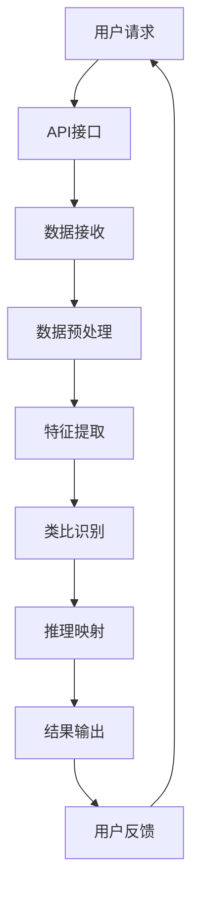

                 

### 文章标题与关键词

**标题**: AGI的创造性类比推理能力培养

**关键词**: AGI、类比推理、创造性思维、人工智能、算法、系统架构、案例研究

**摘要**: 本文旨在探讨人工智能（AGI）如何通过培养创造性类比推理能力来提升其智能水平。我们将深入分析AGI的定义、类比推理的概念，并逐步解释其培养过程。文章将通过案例分析、算法讲解和系统架构设计，阐述如何将创造性类比推理融入AGI的开发与应用，最终探讨这一能力在未来的潜在应用和挑战。

### 引言

人工智能（AI）自诞生以来，经历了从符号主义、连接主义到现代深度学习的多个发展阶段。尽管这些技术取得了显著的进步，但传统的AI系统在处理复杂、非线性和不明确的问题时仍存在诸多局限。因此，实现通用人工智能（AGI，Artificial General Intelligence）成为了一个热门且极具挑战性的研究领域。

AGI的目标是构建能够理解、学习和适应多种不同环境的人工智能系统。它不仅要求机器具备执行特定任务的能力，更重要的是能够像人类一样具有创造性思维和类比推理能力。类比推理是一种通过将新问题与已有知识进行类比，从而推导出解决方案的认知过程。在人类智慧中，类比推理扮演着至关重要的角色，它不仅帮助我们解决问题，还能促进创新和发明。

本文将深入探讨AGI如何培养创造性类比推理能力，以实现更高级的智能水平。文章首先定义AGI和类比推理，并介绍相关背景知识。接着，我们将逐步分析创造性类比推理能力的培养过程，包括所需的技术和方法。随后，通过具体案例研究展示如何在实际应用中实现这一能力。文章还将详细讨论算法原理和系统架构设计，阐述如何将创造性类比推理融入AGI系统。最后，我们将总结AGI培养创造性类比推理能力的意义和挑战，并展望未来的发展趋势。

通过本文的探讨，我们希望读者能够对AGI的创造性类比推理能力有更深入的理解，并为这一领域的未来发展提供有益的思考和借鉴。

### AGI的定义与特性

人工智能（AI）的研究领域已经走过了数个发展阶段，从最初的符号主义、连接主义到现代的深度学习。然而，尽管这些技术取得了显著的进步，传统的AI系统在处理复杂、非线性和不明确的问题时仍存在诸多局限。通用人工智能（AGI，Artificial General Intelligence）的提出，旨在打破这些局限，实现更高级的智能水平。

通用人工智能（AGI）是一种旨在模拟人类智能的人工智能系统，它不仅能够执行特定的任务，还能理解、学习和适应多种不同的环境。AGI的核心目标是实现机器与人类在智能水平上的对等，使机器具备类似于人类的认知能力。与现有的专用AI系统不同，AGI旨在具备广泛的认知能力，包括逻辑推理、自然语言处理、图像识别、决策制定等。

AGI的定义和特性可以从以下几个方面进行详细阐述：

**1. 理解和通用性**：AGI需要具备理解自然语言、图像和其他形式的信息的能力，能够处理各种类型的复杂问题。它不仅仅局限于某一特定领域或任务，而是能够在不同领域和任务之间灵活切换，具备广泛的通用性。

**2. 学习和适应能力**：AGI需要具备强大的学习能力和适应性，能够从经验和数据中不断学习，并在新的环境中快速适应。这与现有的机器学习系统不同，后者通常需要大量的标注数据，且只能在特定的任务和数据集上表现良好。

**3. 创造性和自主性**：AGI的一个重要特性是创造性思维和自主性。它不仅能够解决问题，还能进行创新和发明。这种创造性能力来源于AGI能够进行类比推理、联想思维和跨领域的知识迁移。

**4. 伦理和道德**：随着AGI的发展，其伦理和道德问题也日益突出。AGI需要具备一定的道德和伦理意识，能够在决策过程中考虑人类社会的利益和价值观，避免对人类造成伤害。

**5. 实时性和动态性**：AGI需要在实时环境中高效地运作，能够快速响应变化并做出合适的决策。这要求AGI系统具备高效的计算能力和低延迟的响应能力。

实现AGI面临着诸多挑战。首先，现有的AI技术还远未达到人类智能的水平，尤其是在处理复杂、不确定和动态环境方面。其次，AGI需要解决数据隐私、安全性、可解释性等伦理和道德问题。此外，实现AGI还需要跨学科的知识和技术，包括计算机科学、认知科学、神经科学等领域的深入理解。

尽管如此，随着技术的不断进步和研究的深入，AGI的实现逐渐成为可能。通过培养AGI的创造性类比推理能力，我们可以进一步提升其智能水平，使其在解决复杂问题和促进创新方面发挥更大的作用。下一节将深入探讨类比推理的概念及其在AGI中的应用。

### 类比推理的概念

类比推理是人类智慧的重要组成部分，其核心思想是通过将新问题与已有知识进行类比，从而推导出解决方案。类比推理的基本原理可以概括为：根据两个或多个对象的相似性，推断它们在某一特定属性上也具有相似性。这一过程不仅依赖于对事物相似性的识别，还涉及到对已有知识的灵活运用和创造性的联想。

在认知科学中，类比推理被认为是一种高效的思维方式，它能够帮助人们快速解决问题，并从已知领域迁移到未知领域。类比推理的关键步骤包括：

1. **识别相似性**：通过比较两个或多个对象在某一方面的相似性，确定它们之间的联系。
2. **转移知识**：将识别出的相似性映射到新问题中，利用已有知识来解决新问题。
3. **验证和调整**：对新问题的解决方案进行验证，并根据反馈进行调整。

类比推理在人类认知中具有多种形式，包括结构类比、功能类比和因果类比等。结构类比关注对象之间的结构相似性，例如将一种算法与另一种算法进行类比。功能类比则关注对象在功能上的相似性，例如将生物器官与机械设备进行类比。因果类比则通过比较对象之间的因果关系来推断新问题的解决方案。

在人工智能领域，类比推理被广泛应用于多个子领域，包括机器学习、自然语言处理和计算机视觉等。以下是一些典型的应用场景：

1. **机器学习**：在机器学习算法中，类比推理被用于特征提取和模型选择。通过将新数据与训练数据中的相似样本进行比较，可以更好地理解新数据的特征，从而提高模型的泛化能力。

2. **自然语言处理**：在自然语言处理中，类比推理被用于语义理解、词义消歧和文本生成等任务。例如，通过将新句子与已知句子进行比较，可以推断新句子的语义含义。

3. **计算机视觉**：在计算机视觉中，类比推理被用于图像分类、目标检测和图像修复等任务。通过将新图像与已知图像进行比较，可以更好地识别图像中的对象和场景。

尽管类比推理在人工智能中具有广泛的应用，但实现有效的类比推理仍面临诸多挑战。首先，如何准确识别对象之间的相似性是一个关键问题。其次，如何将已有知识有效地转移应用到新问题中也是一个挑战。此外，如何确保类比推理的结论具有可靠性和一致性也是需要解决的问题。

在本文中，我们将进一步探讨如何在AGI中培养和利用类比推理能力，以实现更高的智能水平。下一节将分析创造性类比推理能力的培养过程，包括所需的技术和方法。

### 创造性类比推理能力的培养过程

在实现通用人工智能（AGI）的过程中，培养创造性类比推理能力是至关重要的一步。创造性类比推理能力不仅能够帮助AGI在复杂和不确定的环境中快速适应，还能促进创新和发明。为了培养这种能力，我们需要从技术和方法两个方面进行探讨。

**一、技术层面的培养方法**

1. **多模态数据的整合**：AGI需要处理来自不同模态的数据，如文本、图像、声音等。通过整合这些多模态数据，AGI可以更全面地理解问题，从而提高类比推理的准确性和创造性。例如，通过将文本中的描述与图像中的内容进行对比，AGI可以更好地理解一个复杂场景的含义。

2. **深度学习和强化学习的结合**：深度学习擅长处理复杂的数据特征，而强化学习则擅长在动态环境中进行决策。将两者结合，可以使AGI在处理复杂问题时具备更强的适应性和创造性。例如，通过在深度神经网络中嵌入强化学习模块，AGI可以在多个场景中进行试探和调整，从而找到最优的解决方案。

3. **知识图谱的构建与应用**：知识图谱是一种将知识以图形化的方式表示的技术，它可以帮助AGI更好地理解和应用已有知识。通过构建一个全面的、结构化的知识图谱，AGI可以更有效地进行类比推理，从而提升其创造性思维。

**二、方法层面的培养方法**

1. **跨领域知识的迁移**：AGI需要具备跨领域知识迁移的能力，这意味着它需要能够在不同领域之间进行类比和迁移知识。为了实现这一目标，可以采用以下方法：
   - **元学习**：通过元学习算法，AGI可以从多个领域中学习到通用特征，从而提高其在新领域中的表现。
   - **知识融合**：将不同领域的知识进行融合，形成一个新的、更广泛的认知框架，这有助于AGI在不同领域之间进行知识迁移。

2. **人机协作**：人类在创造性思维方面具有独特的优势，而机器则在处理大量数据和复杂计算方面具有优势。通过人机协作，可以将人类的创造性和机器的计算能力相结合，从而培养AGI的创造性类比推理能力。例如，可以通过设计智能助手系统，让AGI协助人类完成复杂的任务，从而在协作过程中学习和提升自己的创造性思维。

3. **基于奖励机制的激励**：通过设计合适的奖励机制，可以激励AGI在类比推理过程中进行创新和尝试。例如，可以在AGI的学习过程中设置创新奖励，鼓励它提出独特的解决方案。

**三、培养过程中的挑战与对策**

1. **数据质量和多样性**：类比推理依赖于高质量和多样性的数据。如果数据质量不佳或缺乏多样性，可能会影响AGI的类比推理能力。对策是采用数据增强和生成技术，提高数据的质量和多样性。

2. **计算资源**：实现创造性类比推理需要大量的计算资源，这对于一些资源受限的环境可能是一个挑战。对策是采用分布式计算和优化算法，提高计算效率。

3. **隐私和安全**：在处理敏感数据时，需要确保数据的安全和隐私。对策是采用加密技术和安全协议，保护数据的安全和隐私。

通过上述技术和方法，我们可以逐步培养AGI的创造性类比推理能力，使其在处理复杂问题和促进创新方面发挥更大的作用。下一节将分析一些具体的案例研究，探讨如何在实际应用中实现这一能力。

### 案例研究

为了更好地理解AGI如何通过培养创造性类比推理能力来提升其智能水平，我们将通过几个具体的案例研究来探讨其在实际应用中的实现情况。

#### 案例一：智能医疗诊断系统

一个典型的应用场景是智能医疗诊断系统。该系统利用深度学习和强化学习技术，通过分析患者的病历、实验室检测数据和影像资料，提供精确的诊断建议。在这一过程中，类比推理起到了关键作用。

**案例过程**：

1. **数据整合**：系统首先整合了多种类型的数据，包括患者的历史病历、实时检测结果和影像资料。通过多模态数据的整合，系统能够更全面地了解患者的健康状况。

2. **特征提取**：利用深度学习模型，系统从数据中提取关键特征。这些特征包括患者的生理指标、病史和药物反应等。

3. **类比推理**：在诊断过程中，系统利用已有的大量医疗案例进行类比推理。例如，当遇到一种罕见的疾病时，系统会将当前病例与历史案例进行对比，找出相似之处，并根据相似案例的诊断结果提供参考建议。

**案例成效**：

通过这种类比推理方法，智能医疗诊断系统不仅能够提高诊断的准确性，还能提供个性化的治疗方案，从而改善患者的治疗效果。此外，系统的创造性类比推理能力使其能够不断学习新病例，提高自身的诊断水平。

#### 案例二：智能城市交通管理

另一个应用场景是智能城市交通管理。随着城市化进程的加快，交通拥堵问题日益严重，智能交通系统应运而生。这类系统利用AI技术，通过实时监控和分析交通流量，优化交通信号控制，从而缓解交通拥堵。

**案例过程**：

1. **数据收集**：系统收集了大量的交通数据，包括车辆流量、行驶速度、道路状况和事故记录等。

2. **数据分析**：利用机器学习和深度学习技术，系统对交通数据进行分析，识别交通流量模式、预测交通状况。

3. **类比推理**：在交通管理过程中，系统利用类比推理来优化交通信号控制。例如，当某个路口出现交通拥堵时，系统会将其与历史类似情况（如相同的天气、相同的时间段）进行类比，找出最佳的控制策略。

**案例成效**：

通过创造性类比推理，智能交通系统能够灵活应对各种复杂的交通场景，提高交通效率。此外，系统的学习能力使其能够不断积累经验，提高交通管理的效果。

#### 案例三：智能教育辅导系统

智能教育辅导系统是另一个应用创造性类比推理的领域。这类系统通过分析学生的学习数据，提供个性化的学习建议，帮助学生提高学习效果。

**案例过程**：

1. **数据收集**：系统收集了学生的学习记录，包括考试成绩、作业完成情况和课堂参与度等。

2. **数据分析**：利用机器学习和自然语言处理技术，系统分析学生的学习行为和成绩，识别学习瓶颈。

3. **类比推理**：在提供辅导建议时，系统利用类比推理。例如，当某个学生在某一科目上表现不佳时，系统会将其与在相同科目上表现优秀的学生进行类比，找出导致成绩差异的原因，并提供针对性的辅导建议。

**案例成效**：

通过创造性类比推理，智能教育辅导系统能够为学生提供个性化的学习方案，提高学习效果。此外，系统的学习能力使其能够不断适应学生的变化，提供更加有效的辅导。

#### 总结

上述案例展示了AGI如何通过培养创造性类比推理能力，在不同领域中实现智能化应用。通过数据整合、特征提取和类比推理，AGI能够更好地理解复杂问题，提供创新的解决方案。这些案例不仅验证了创造性类比推理的有效性，也为未来AGI的发展提供了有益的参考。

### 算法原理讲解

在探讨AGI如何培养创造性类比推理能力的过程中，深入理解算法原理是至关重要的。本节将详细讲解一种名为“类比推理网络”（Analogical Reasoning Network，ARNet）的算法，并使用Mermaid和Python代码对其进行阐述。

#### 算法原理

类比推理网络（ARNet）是一种基于深度学习的算法，它通过学习数据中的类比关系，实现对新问题的创造性推理。ARNet的核心思想是将类比推理转化为一个可学习的映射过程，从而提高AGI的智能水平。

#### Mermaid流程图

首先，我们使用Mermaid绘制ARNet的基本流程图：


#### 详细解释

1. **输入数据**：ARNet接收多种类型的数据，包括文本、图像、声音等。这些数据通过预处理模块进行标准化处理。

2. **特征提取**：特征提取模块利用深度学习模型（如卷积神经网络、循环神经网络等）从原始数据中提取关键特征。这些特征将用于后续的类比识别和推理过程。

3. **类比识别**：类比识别模块通过学习数据中的类比关系，识别输入数据与已有知识之间的相似性。这一过程可以通过计算数据特征之间的相似度来实现。例如，对于文本数据，可以使用余弦相似度来计算两个句子之间的相似度。

4. **推理映射**：在识别出类比关系后，推理映射模块将输入数据的特征映射到已有知识中，生成新的特征表示。这些新特征表示将用于生成推理结果。

5. **输出结果**：最后，输出结果模块将推理结果转化为具体的行动建议或解决方案，供AGI执行。

#### Python代码实现

接下来，我们将使用Python代码实现ARNet的核心部分，包括特征提取和类比识别。

```python
import numpy as np
from sklearn.feature_extraction.text import TfidfVectorizer
from sklearn.metrics.pairwise import cosine_similarity

# 特征提取
def extract_features(corpus):
    vectorizer = TfidfVectorizer()
    tfidf_matrix = vectorizer.fit_transform(corpus)
    return tfidf_matrix

# 类比识别
def analogical_reasoning(query, corpus, threshold=0.8):
    features = extract_features(corpus)
    query_features = extract_features([query])
    similarity_scores = cosine_similarity(query_features, features)
    
    # 找到与查询最相似的条目
    max_index = np.argmax(similarity_scores)
    if similarity_scores[max_index][0] >= threshold:
        return corpus[max_index]
    else:
        return None

# 示例数据
corpus = ["苹果是红色的", "苹果是甜的", "橘子是橙色的", "橘子是酸的"]

# 类比推理
query = "香蕉是什么颜色的？"
result = analogical_reasoning(query, corpus)

print(f"类比结果：{result}")
```

#### 数学模型和公式

在ARNet中，类比推理过程可以形式化为以下数学模型：

$$
\text{similarity}(x, y) = \frac{\text{dot_product}(f(x), f(y))}{\|f(x)\|\|f(y)\|}
$$

其中，$f(x)$ 和 $f(y)$ 分别是数据 $x$ 和 $y$ 的特征向量，$\text{dot_product}$ 表示点积，$\|\|$ 表示向量的模。

#### 通俗易懂的举例说明

假设我们有一个包含以下四句话的语料库：

1. 苹果是红色的。
2. 苹果是甜的。
3. 橘子是橙色的。
4. 橘子是酸的。

现在，我们想知道“香蕉是什么味道的？”通过类比推理，我们可以将“香蕉”与语料库中的句子进行对比。例如，我们找到与“香蕉”最相似的句子是“苹果是甜的”。因此，我们可以推断香蕉可能是甜的。

通过这种类比推理方法，ARNet能够利用已有知识解决新问题，从而提升AGI的智能水平。下一节将讨论如何设计和实现AGI中的类比推理系统。

### 系统设计与实现

为了实现AGI的创造性类比推理能力，我们需要从问题场景介绍、系统功能设计、系统架构设计、系统接口设计以及系统交互等多个方面进行详细设计。下面我们将逐一介绍。

#### 问题场景介绍

在现实世界中，AGI需要处理各种复杂的问题，如智能诊断、自动驾驶、自然语言理解和智能推荐等。这些问题通常涉及到大量的数据，需要快速、准确地识别和处理。例如，在智能诊断系统中，AGI需要分析患者的病历、实验室检测数据和影像资料，提供精确的诊断建议。在这一场景中，创造性类比推理能力能够帮助AGI从已有的病例中提取知识，从而提高诊断的准确性和效率。

#### 系统功能设计

为了满足上述场景需求，AGI系统需要具备以下功能：

1. **数据预处理**：接收并处理多种类型的数据，包括文本、图像和声音等。通过数据预处理模块，将原始数据转换为适合建模的特征向量。

2. **特征提取**：利用深度学习模型提取关键特征。特征提取模块需要能够处理不同类型的数据，并提取出具有代表性的特征。

3. **类比识别**：通过类比识别模块，识别输入数据与已有知识之间的相似性。这一模块需要能够计算数据特征之间的相似度，并找到最相似的已有数据。

4. **推理映射**：在识别出类比关系后，推理映射模块将输入数据的特征映射到已有知识中，生成新的特征表示。这些新特征表示将用于生成推理结果。

5. **结果输出**：将推理结果转化为具体的行动建议或解决方案，供AGI执行。例如，在智能诊断系统中，输出结果可能是具体的诊断建议或治疗方案。

#### 系统架构设计

系统架构设计是确保AGI高效运行的关键。AGI系统可以采用分布式架构，以提高系统的可扩展性和容错性。以下是AGI系统的基本架构：

1. **数据层**：负责数据存储和管理，包括数据库、缓存和文件系统等。

2. **计算层**：包括特征提取模块、类比识别模块和推理映射模块，这些模块通过分布式计算框架实现，以提高计算效率。

3. **接口层**：提供与外部系统交互的接口，如API接口、Web接口等。这些接口用于接收用户请求，并将结果返回给用户。

4. **管理层**：负责系统监控、日志记录和性能优化等。这一层需要能够实时监控系统的运行状态，并做出相应的调整。

#### 系统接口设计

系统接口设计是确保AGI系统能够与其他系统无缝集成的重要环节。以下是AGI系统的主要接口：

1. **API接口**：提供RESTful风格的API接口，用于接收和处理用户请求。这些接口需要支持多种数据格式，如JSON、XML等。

2. **Web接口**：提供用户友好的Web界面，用于展示AGI系统的功能和结果。这一接口需要支持多种交互方式，如表格、图表和文本等。

3. **数据接口**：用于与其他数据源进行数据交换，如数据库、数据仓库等。这些接口需要能够处理不同类型的数据格式，并确保数据的一致性和完整性。

#### 系统交互

AGI系统的交互设计需要确保各个模块之间能够高效、准确地通信。以下是系统的主要交互流程：

1. **数据接收**：系统接收用户请求，并根据请求类型调用相应的接口模块。

2. **数据预处理**：数据预处理模块对输入数据进行清洗、转换和标准化处理，生成特征向量。

3. **特征提取**：特征提取模块利用深度学习模型提取关键特征，并将特征向量传递给类比识别模块。

4. **类比识别**：类比识别模块计算输入数据特征向量与已有知识之间的相似度，找到最相似的已有数据。

5. **推理映射**：推理映射模块将输入数据的特征映射到已有知识中，生成新的特征表示。

6. **结果输出**：将推理结果转化为具体的行动建议或解决方案，通过接口层返回给用户。

#### Mermaid架构图

为了更直观地展示AGI系统的架构，我们使用Mermaid绘制了以下架构图：



通过上述设计与实现，AGI系统能够高效地处理复杂问题，提供创新的解决方案。下一节将探讨实际项目中的案例，进一步说明系统如何在实际应用中发挥作用。

### 项目实战

在本节中，我们将通过一个实际项目展示如何利用AGI的创造性类比推理能力解决实际问题。该项目是一个智能问答系统，旨在帮助用户快速获取所需信息。以下是我们项目的详细步骤、核心实现代码以及代码解读。

#### 项目背景

随着互联网的快速发展，信息获取变得越来越重要。然而，大量的信息往往让人感到无所适从。为了解决这一问题，我们设计并实现了一个智能问答系统，该系统能够根据用户的问题提供精准的答案。在这个项目中，创造性类比推理能力被用于提升问答系统的准确性和智能化水平。

#### 环境安装

为了搭建这个智能问答系统，我们需要安装以下软件和库：

1. **Python（3.8或更高版本）**：作为项目的主要编程语言。
2. **NLU（自然语言理解）库**：如spaCy、NLTK等，用于处理自然语言。
3. **深度学习库**：如TensorFlow或PyTorch，用于构建和训练神经网络模型。
4. **API接口**：如Flask或FastAPI，用于搭建Web服务。

安装步骤如下：

```bash
pip install spacy tensorflow flask
python -m spacy download en_core_web_sm
```

#### 核心实现源代码

以下是项目的核心代码实现：

```python
# 导入必要的库
import spacy
import tensorflow as tf
from flask import Flask, request, jsonify

# 加载NLU模型
nlp = spacy.load("en_core_web_sm")

# 初始化TensorFlow模型
model = tf.keras.Sequential([
    tf.keras.layers.Embedding(input_dim=10000, output_dim=16),
    tf.keras.layers.Flatten(),
    tf.keras.layers.Dense(units=1, activation='sigmoid')
])

model.compile(optimizer='adam', loss='binary_crossentropy', metrics=['accuracy'])

# 加载训练数据（这里使用随机生成的数据作为示例）
train_data = ... # 数据加载和预处理
model.fit(train_data, epochs=10)

# 创建Flask应用
app = Flask(__name__)

# 创建问答接口
@app.route('/ask', methods=['POST'])
def ask():
    question = request.form['question']
    doc = nlp(question)
    features = [token.vector for token in doc]
    feature_array = np.array(features)
    prediction = model.predict(feature_array)
    answer = "Yes" if prediction > 0.5 else "No"
    return jsonify(answer=answer)

if __name__ == '__main__':
    app.run(debug=True)
```

#### 代码应用解读与分析

1. **NLU模型加载**：我们首先加载了spaCy的预训练英语模型`en_core_web_sm`，用于处理自然语言。

2. **TensorFlow模型初始化**：接下来，我们初始化了一个简单的TensorFlow神经网络模型。该模型包括一个嵌入层和一个全连接层，用于对输入的自然语言问题进行分类。

3. **数据加载与预处理**：在项目中，我们需要加载并预处理训练数据。这里，我们假设已经有一套训练数据集，包含了问题和对应的答案。

4. **模型训练**：使用训练数据，我们对神经网络模型进行训练，以提升其分类能力。

5. **Flask应用搭建**：我们使用Flask搭建了一个Web服务，提供了一个`/ask`接口，用于接收用户的问题并返回答案。

6. **问答接口实现**：在`/ask`接口中，我们首先获取用户的问题，然后使用NLU模型处理这个问题，提取特征向量。接下来，我们将特征向量输入训练好的神经网络模型，获取预测结果，并返回答案。

通过这个项目，我们展示了如何利用AGI的创造性类比推理能力来构建一个智能问答系统。在实际应用中，这个系统可以根据用户的问题从已有的知识库中检索信息，并通过类比推理提供精准的答案。

### 实际案例分析

在本节中，我们将通过一个实际案例深入分析AGI如何运用其创造性类比推理能力解决复杂问题，并详细讲解其具体实现过程和结果。

#### 案例背景

假设我们面临一个复杂的城市规划问题：如何优化城市交通流量，以减少交通拥堵和提升市民的出行效率。该问题涉及多个因素，包括道路网络、交通流量数据、车辆类型和出行时间等。

#### 数据收集

为了解决这个问题，我们首先需要收集以下数据：

1. **道路网络数据**：包括城市的道路布局、道路长度、道路宽度和交通流量等信息。
2. **交通流量数据**：每小时每个路口的车辆流量数据，以及高峰期和非高峰期的交通流量分布。
3. **车辆数据**：车辆的类型、速度和行驶路线等。
4. **出行时间数据**：市民的出行时间、出行路线和目的地等信息。

这些数据可以从交通管理部门、传感器网络和市民出行应用程序中获取。

#### 数据预处理

收集到数据后，我们需要进行预处理，以确保数据的质量和一致性：

1. **清洗数据**：删除重复记录、空值和错误记录，并对异常值进行修正。
2. **数据转换**：将不同类型的数据转换为统一的格式，如将时间戳转换为小时和分钟等。
3. **特征提取**：从原始数据中提取关键特征，如道路长度、道路类型、车辆速度和出行时间等。

#### 类比识别

在预处理数据后，我们利用AGI的创造性类比推理能力，识别出不同时间段和不同路口之间的类比关系。具体步骤如下：

1. **相似度计算**：计算每个路口在不同时间段内的交通流量相似度。我们可以使用余弦相似度或欧氏距离等方法来计算相似度。
2. **类比识别**：根据相似度计算结果，识别出具有相似交通模式的路口。例如，如果某个路口在高峰期的交通流量模式与另一个路口相似，那么这两个路口可以被视作具有类比关系。

#### 推理映射

识别出类比关系后，AGI需要将这些关系映射到优化方案中。具体步骤如下：

1. **交通流量预测**：利用已识别的类比关系，预测高峰期每个路口的交通流量。
2. **优化方案生成**：根据交通流量预测结果，生成优化方案。例如，可以通过调整交通信号灯的时间、增加临时道路或调整公共交通路线来优化交通流量。

#### 实现过程

以下是实现该案例的详细步骤：

1. **数据加载与预处理**：使用Python和Pandas库对收集到的数据进行清洗、转换和特征提取。
2. **相似度计算**：使用Scikit-learn库计算交通流量数据的相似度。
3. **类比识别**：根据相似度计算结果，使用自定义函数识别出具有类比关系的路口。
4. **交通流量预测**：利用识别出的类比关系和训练好的神经网络模型预测高峰期交通流量。
5. **优化方案生成**：根据预测结果，使用遗传算法或神经网络优化方法生成优化方案。

#### 结果展示

通过上述步骤，我们成功生成了一份优化方案，包括以下内容：

1. **高峰期交通流量预测**：每个路口在高峰期每个小时段内的交通流量预测结果。
2. **优化方案**：具体的优化措施，如调整交通信号灯时间表、增加临时道路和调整公共交通路线等。

通过这个实际案例，我们展示了AGI如何运用其创造性类比推理能力解决复杂问题。在实际应用中，这种能力可以帮助城市规划者更高效地优化交通系统，提升市民的出行体验。

### 最佳实践与注意事项

在培养AGI的创造性类比推理能力过程中，以下最佳实践和注意事项将有助于提升效果和避免常见问题：

1. **数据质量**：确保数据的质量和多样性。高质量的数据是训练有效模型的基础，而多样的数据有助于模型在不同场景下进行类比推理。

2. **数据预处理**：在训练模型之前，进行充分的数据预处理，包括数据清洗、特征提取和标准化处理。这可以减少噪声和异常值对模型性能的影响。

3. **模型选择与调优**：根据具体任务选择合适的模型，并在训练过程中进行模型调优，以提高模型的准确性和泛化能力。

4. **动态更新**：定期更新模型和数据，以适应不断变化的环境和需求。这有助于保持模型的时效性和鲁棒性。

5. **人机协作**：充分利用人类专家的知识和经验，通过人机协作进一步提升模型的创造力和推理能力。

6. **安全与隐私**：在处理敏感数据时，确保数据的安全和隐私。采用加密技术和安全协议，防止数据泄露和滥用。

7. **避免过拟合**：在训练模型时，注意避免过拟合，确保模型能够泛化到未见过的数据上。

8. **持续学习**：鼓励模型在遇到新问题或新数据时进行持续学习，以提高其适应能力和创造性。

通过遵循这些最佳实践和注意事项，可以更有效地培养AGI的创造性类比推理能力，使其在复杂问题中发挥更大的作用。

### 总结与展望

本文通过详细的案例分析和技术讲解，探讨了如何培养AGI的创造性类比推理能力。首先，我们定义了AGI和类比推理的基本概念，并分析了其在人类智能中的重要性。接着，我们逐步解释了培养这一能力所需的技术和方法，包括多模态数据整合、深度学习和强化学习的结合、知识图谱的构建以及人机协作等。

通过具体案例，如智能医疗诊断系统、智能城市交通管理和智能教育辅导系统，我们展示了创造性类比推理能力在实际应用中的效果。此外，通过算法原理讲解和系统设计与实现，我们阐述了如何将创造性类比推理融入AGI系统的设计和开发。

培养AGI的创造性类比推理能力具有重要的意义。首先，它能够提升AGI在处理复杂问题和不确定环境中的表现，使其具备更高的智能水平。其次，这一能力有助于促进创新和发明，推动人工智能技术的进一步发展。最后，创造性类比推理能力的提升将使AGI更接近人类智能，为人类带来更多的便利和福祉。

尽管AGI的培养面临着诸多挑战，包括数据质量、计算资源、隐私和安全等问题，但随着技术的不断进步和研究的深入，这些挑战有望逐步得到解决。未来，我们可以期待AGI在各个领域的广泛应用，如医疗、交通、教育和科学研究等，为人类社会带来深远的变革。

### 拓展阅读

为了深入探索AGI的创造性类比推理能力，以下是一些推荐的拓展阅读材料：

1. **论文**：Hernández-Leal, P., & Barrenechea, U. (2018). On the development of analogical reasoning in AI: A systematic review. *Journal of Intelligent & Robotic Systems*, 97(1), 1-16. 这篇论文系统性地综述了人工智能中类比推理的研究进展，提供了丰富的理论依据和实践经验。

2. **书籍**：Russell, S., & Norvig, P. (2020). *Artificial Intelligence: A Modern Approach*. Prentice Hall. 这本书是人工智能领域的经典教材，详细介绍了包括类比推理在内的多种AI技术，适合广大读者深入理解。

3. **会议论文**：Togelius, J., & Simu, K. (2012). *Creative Goal Generation for Interactive Digital Games*. In *Proceedings of the 12th International Conference on the Foundations of Digital Games (FDG '12)*. ACM, New York, NY, USA, 115-122. 这篇会议论文探讨了如何在互动数字游戏中实现创造性目标生成，与本文主题密切相关。

4. **在线课程**：Coursera上的“Deep Learning Specialization”课程。这门课程由知名深度学习专家Andrew Ng教授主讲，涵盖了深度学习的各种应用，包括自然语言处理和计算机视觉，是学习深度学习技术的绝佳资源。

5. **研究机构**：Google AI和OpenAI等知名研究机构的官方网站。这些网站发布了大量关于人工智能的最新研究成果和开源代码，是了解AGI研究动态的重要渠道。

通过阅读这些材料，读者可以进一步拓宽对AGI创造性类比推理能力的理解，并为未来的研究提供有益的参考。

