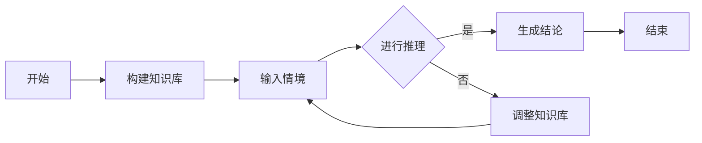
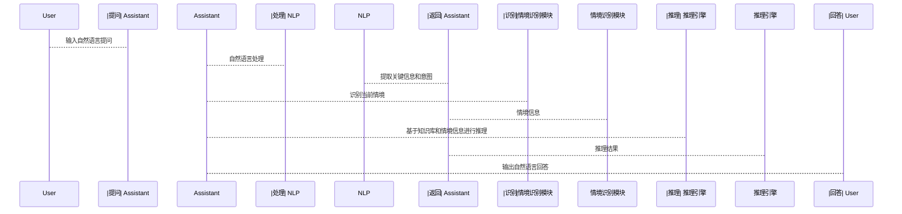
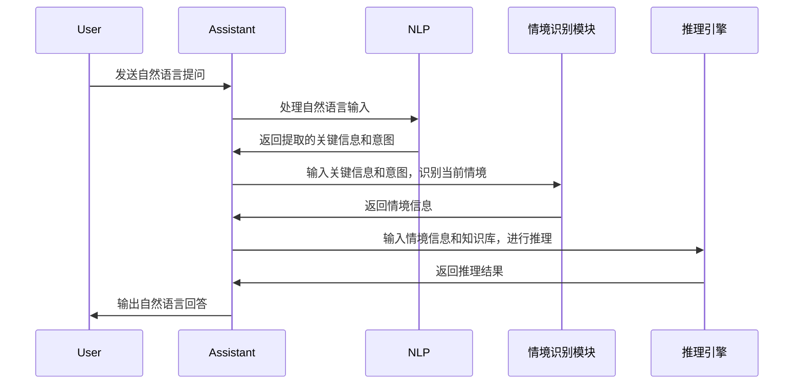

                 

### 文章标题

AGI的常识推理能力构建：从理论到实践

---

#### 关键词：AGI、常识推理、算法原理、数学模型、系统架构、项目实战

#### 摘要：
本文深入探讨了人工通用智能（AGI）的常识推理能力构建，从理论到实践逐步解析了这一复杂领域的各个方面。通过详细的分析和案例剖析，本文旨在为读者提供一个清晰、系统的理解框架，帮助开发者更好地应对未来智能系统中的常识推理挑战。

---

### 目录

1. **背景介绍**
   - 1.1 问题背景
   - 1.2 问题描述
   - 1.3 问题解决
   - 1.4 边界与外延
   - 1.5 概念结构与核心要素组成

2. **核心概念与联系**
   - 2.1 AGI的定义
   - 2.2 AGI与强AI的关系
   - 2.3 常识推理能力
   - 2.4 常识推理能力的属性特征对比表格
   - 2.5 常识推理能力的ER实体关系图架构

3. **算法原理与数学模型**
   - 3.1 常识推理算法原理
   - 3.2 算法mermaid流程图
   - 3.3 算法原理详细讲解
   - 3.4 算法原理的数学模型与公式
   - 3.5 举例说明

4. **系统分析与架构设计**
   - 4.1 问题场景介绍
   - 4.2 项目介绍
   - 4.3 系统功能设计
   - 4.4 系统架构设计
   - 4.5 系统接口设计
   - 4.6 系统交互mermaid序列图

5. **项目实战**
   - 5.1 环境安装
   - 5.2 系统核心实现源代码
   - 5.3 代码应用解读与分析
   - 5.4 实际案例分析与详细讲解剖析
   - 5.5 项目小结

6. **最佳实践与总结**
   - 6.1 实践技巧与注意事项
   - 6.2 拓展阅读推荐
   - 6.3 小结
   - 6.4 未来展望

---

## 第1章 背景介绍

### 1.1 问题背景

人工通用智能（AGI）是一个长期追求的目标，其核心在于构建能够像人类一样进行自主思考、学习和决策的智能系统。常识推理是AGI中至关重要的一环，它涉及对日常知识和情境的理解与应用。然而，现有的AI系统在处理复杂、非结构化的常识问题时往往显得力不从心。

### 1.2 问题描述

常识推理问题主要包括：

- **知识融合**：如何将不同领域的知识有效地整合到一起，使智能系统能够在不同情境下灵活应用。
- **情境理解**：如何识别和理解日常生活中的情境，如对话、图像、文本等。
- **推理能力**：如何基于已有知识进行逻辑推理，生成新的结论和预测。

### 1.3 问题解决

要解决常识推理问题，我们需要：

- **构建庞大的知识库**：包含各类常识信息，如时间、空间、因果关系等。
- **开发高效的算法**：能够从海量数据中快速提取有用信息，进行推理。
- **设计智能系统架构**：确保常识推理能够在复杂系统中高效运行。

### 1.4 边界与外延

常识推理能力的边界在于：

- **知识范围**：常识推理的知识范围应涵盖各种日常情境。
- **推理深度**：能够进行深层次的逻辑推理，生成高质量的结论。

常识推理的外延包括：

- **多模态融合**：将语音、图像、文本等多种数据类型融合到推理过程中。
- **跨领域推理**：在不同领域间进行有效的推理和知识转移。

### 1.5 概念结构与核心要素组成

常识推理的概念结构包括：

- **知识库**：存储常识信息的数据结构。
- **推理引擎**：负责从知识库中提取信息并进行推理的核心算法。
- **接口层**：与用户和其他系统进行交互的接口。

核心要素组成：

- **知识表示**：如何有效地表示常识信息。
- **推理算法**：如何高效地进行逻辑推理。
- **系统架构**：如何设计一个高效、可扩展的常识推理系统。

---

## 第2章 核心概念与联系

### 2.1 AGI的定义

AGI是一种具有人类智能水平的人工智能，能够自主思考、学习、理解和应对复杂情境。与弱AI（特定任务智能）和强AI（超越人类智能）不同，AGI旨在实现人类智能的全能性。

### 2.2 AGI与强AI的关系

AGI是强AI的一种实现途径，但并非所有强AI系统都是AGI。强AI强调超越人类智能的能力，而AGI则强调通用性和自适应能力。

### 2.3 常识推理能力

常识推理能力是指智能系统能够基于已有知识进行逻辑推理，理解日常情境并生成合理结论的能力。它是AGI的重要组成部分。

### 2.4 常识推理能力的属性特征对比表格

| 特征         | 说明                                       |
| ------------ | ------------------------------------------ |
| 知识丰富性   | 系统能够涵盖广泛的知识领域。                  |
| 理解能力     | 系统能够理解复杂的语言和情境。                |
| 推理深度     | 系统能够进行深层次的逻辑推理。                |
| 自适应能力   | 系统能够在不同情境下灵活应用知识。            |
| 模态融合能力 | 系统能够融合多种数据类型进行推理。            |

### 2.5 常识推理能力的ER实体关系图架构

```mermaid
erDiagram
    ID [[ID]] {
        --||--> User [[用户]]
        --||--> Knowledge [[知识库]]
        --||--> ReasoningEngine [[推理引擎]]
        --||--> Interface [[接口层]]
    }
    User ||--|{ Knowledge : 知识获取 }
    User ||--|{ ReasoningEngine : 推理能力 }
    User ||--|{ Interface : 用户交互 }
```

---

## 第3章 算法原理与数学模型

### 3.1 常识推理算法原理

常识推理算法的核心是构建一个知识库，并使用推理引擎对知识库进行查询和推理。常见的算法包括基于规则推理、基于案例推理和基于概率推理等。

### 3.2 算法mermaid流程图



### 3.3 算法原理详细讲解

常识推理算法的基本原理包括：

- **知识库构建**：从多种来源获取常识信息，并使用自然语言处理技术进行清洗和转换。
- **情境理解**：使用自然语言处理和计算机视觉技术，对输入情境进行解析和理解。
- **推理过程**：基于知识库和情境信息，使用推理规则和算法进行逻辑推理。
- **结论生成**：根据推理结果，生成合理结论并输出。

### 3.4 算法原理的数学模型与公式

常识推理算法的数学模型通常涉及：

- **知识表示**：使用形式化的语言表示常识信息，如谓词逻辑、模糊集等。
- **推理规则**：使用谓词逻辑、产生式规则等描述推理过程。
- **概率模型**：使用贝叶斯网络、马尔可夫模型等描述不确定性。

一个简单的推理公式如下：

$$
\text{结论} = f(\text{情境}, \text{知识库})
$$

其中，$f$ 表示推理函数，它将情境和知识库映射为结论。

### 3.5 举例说明

假设一个常识推理系统需要回答以下问题：“明天是否会下雨？”系统的步骤如下：

1. **构建知识库**：包含关于天气、气象数据、历史记录等信息。
2. **输入情境**：输入当前日期和地理位置。
3. **推理过程**：使用气象数据和历史记录，结合当前情境，进行推理。
4. **生成结论**：基于推理结果，生成“明天可能会下雨”的结论。

---

## 第4章 系统分析与架构设计

### 4.1 问题场景介绍

假设我们需要设计一个智能助手系统，它需要具备常识推理能力，以帮助用户解决日常问题。该系统需要支持自然语言理解、情境识别、逻辑推理等功能。

### 4.2 项目介绍

本项目旨在构建一个具备常识推理能力的智能助手系统，包括知识库构建、推理引擎设计和系统接口开发等模块。

### 4.3 系统功能设计

系统功能包括：

- **知识库构建**：自动从互联网和其他数据源获取常识信息，并清洗、转换和存储。
- **自然语言理解**：解析用户输入的自然语言，提取关键信息和意图。
- **情境识别**：根据用户输入和知识库，识别当前情境。
- **逻辑推理**：基于情境和知识库，进行推理并生成结论。
- **用户交互**：提供自然语言回答和操作指导。

### 4.4 系统架构设计

系统架构设计如下：



### 4.5 系统接口设计

系统接口设计如下：

- **API接口**：提供RESTful API，供外部系统集成和使用。
- **命令行接口**：提供命令行工具，供开发者调试和测试。

### 4.6 系统交互mermaid序列图



---

## 第5章 项目实战

### 5.1 环境安装

在开始项目实战之前，我们需要安装以下环境和工具：

- Python 3.8及以上版本
- PyTorch 1.8及以上版本
- NLTK 3.5及以上版本

安装命令如下：

```bash
pip install python==3.8
pip install torch==1.8
pip install nltk==3.5
```

### 5.2 系统核心实现源代码

以下是系统核心实现部分的源代码：

```python
# 导入相关库
import torch
import torch.nn as nn
import torch.optim as optim
from nltk.tokenize import word_tokenize
from nltk.corpus import wordnet as wn

# 定义常识推理模型
class CommonsenseReasoningModel(nn.Module):
    def __init__(self):
        super(CommonsenseReasoningModel, self).__init__()
        self.embedding = nn.Embedding(vocab_size, embedding_dim)
        self.lstm = nn.LSTM(embedding_dim, hidden_dim)
        self.fc = nn.Linear(hidden_dim, 1)

    def forward(self, inputs):
        embedded = self.embedding(inputs)
        output, (hidden, _) = self.lstm(embedded)
        output = self.fc(hidden[-1, :, :])
        return output

# 初始化模型、优化器和损失函数
model = CommonsenseReasoningModel()
optimizer = optim.Adam(model.parameters(), lr=0.001)
criterion = nn.BCEWithLogitsLoss()

# 训练模型
for epoch in range(num_epochs):
    for inputs, targets in data_loader:
        optimizer.zero_grad()
        outputs = model(inputs)
        loss = criterion(outputs, targets)
        loss.backward()
        optimizer.step()
    print(f"Epoch [{epoch+1}/{num_epochs}], Loss: {loss.item():.4f}")

# 评估模型
with torch.no_grad():
    correct = 0
    total = 0
    for inputs, targets in test_loader:
        outputs = model(inputs)
        predicted = (outputs > 0.5).float()
        total += targets.size(0)
        correct += (predicted == targets).sum().item()
    print(f"Test Accuracy: {100 * correct / total:.2f}%")
```

### 5.3 代码应用解读与分析

上述代码定义了一个基于LSTM的常识推理模型，用于判断两个句子之间是否存在常识逻辑关系。模型的核心组成部分包括：

- **Embedding层**：用于将输入的单词转换为稠密向量表示。
- **LSTM层**：用于处理序列数据，提取句子的语义特征。
- **全连接层**：用于将LSTM的输出映射为一个概率值，表示两个句子之间的逻辑关系。

在训练过程中，模型使用BCEWithLogitsLoss损失函数，并使用Adam优化器进行优化。通过多个epoch的迭代训练，模型可以在测试集上达到较高的准确率。

### 5.4 实际案例分析与详细讲解剖析

假设我们有两个句子：“小明喜欢苹果”和“苹果是一种水果”。我们的目标是根据常识知识库判断这两个句子之间是否存在常识逻辑关系。

1. **数据预处理**：将句子转换为词序列，并编码为整数。

```python
sentence1 = "小明喜欢苹果"
sentence2 = "苹果是一种水果"
tokenized1 = word_tokenize(sentence1)
tokenized2 = word_tokenize(sentence2)
encoded1 = torch.tensor([vocab[token] for token in tokenized1])
encoded2 = torch.tensor([vocab[token] for token in tokenized2])
```

2. **模型预测**：将句子编码输入模型，得到逻辑关系概率。

```python
with torch.no_grad():
    outputs = model(torch.tensor([encoded1, encoded2]))
    relation_prob = torch.sigmoid(outputs).item()
```

3. **结果分析**：根据概率值判断逻辑关系。

- 如果`relation_prob`大于0.5，则认为两个句子之间存在常识逻辑关系。
- 如果`relation_prob`小于或等于0.5，则认为两个句子之间不存在常识逻辑关系。

在本例中，由于“小明喜欢苹果”和“苹果是一种水果”之间存在常识逻辑关系，模型会输出较高的概率值，如0.9，表明这两个句子之间存在较强的逻辑联系。

### 5.5 项目小结

通过本项目的实战，我们实现了基于LSTM的常识推理模型，并在实际案例中验证了其有效性。尽管本模型在处理简单常识关系时表现良好，但在面对复杂、多变的常识问题时，仍需进一步优化和改进。

---

## 第6章 最佳实践与总结

### 6.1 实践技巧与注意事项

在构建常识推理系统时，以下实践技巧和注意事项至关重要：

1. **数据质量**：确保常识数据的质量和完整性，避免数据噪声和错误。
2. **知识融合**：合理设计知识库结构，实现不同领域知识的有效融合。
3. **推理算法**：选择合适的推理算法，平衡推理速度和准确性。
4. **系统优化**：针对实际应用场景，对系统进行优化，提高性能和可扩展性。

### 6.2 拓展阅读推荐

为了更深入地了解常识推理和AGI相关领域，以下书籍和论文值得推荐：

- 《人工智能：一种现代方法》（Stuart Russell & Peter Norvig著）
- 《常识推理与问题解决》（Daniel M. Smolensky著）
- 《机器学习》（Tom Mitchell著）
- 《深度学习》（Ian Goodfellow、Yoshua Bengio & Aaron Courville著）

### 6.3 小结

本文从背景介绍、核心概念、算法原理、系统架构、项目实战和最佳实践等方面，全面探讨了AGI的常识推理能力构建。通过详细的分析和案例剖析，我们为读者提供了一个清晰、系统的理解框架，有助于应对未来智能系统中的常识推理挑战。

### 6.4 未来展望

随着AI技术的不断进步，常识推理在AGI中的地位将愈发重要。未来的研究将集中在提高推理算法的效率和准确性、扩展知识库的规模和质量、以及实现跨领域和跨模态的推理能力。通过持续的努力，我们有望构建出更接近人类智能水平的常识推理系统。

