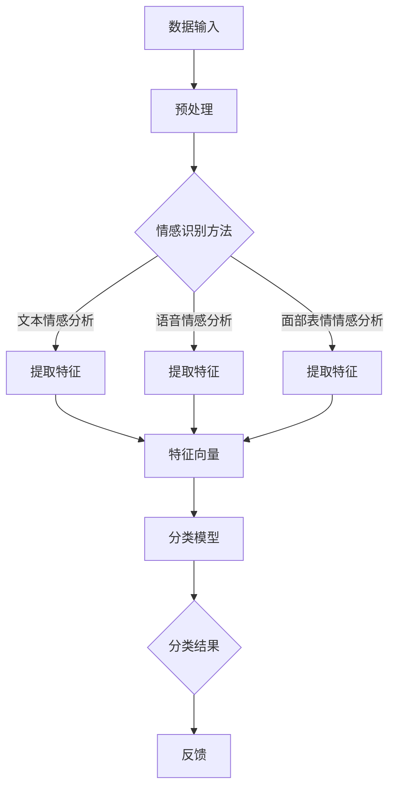
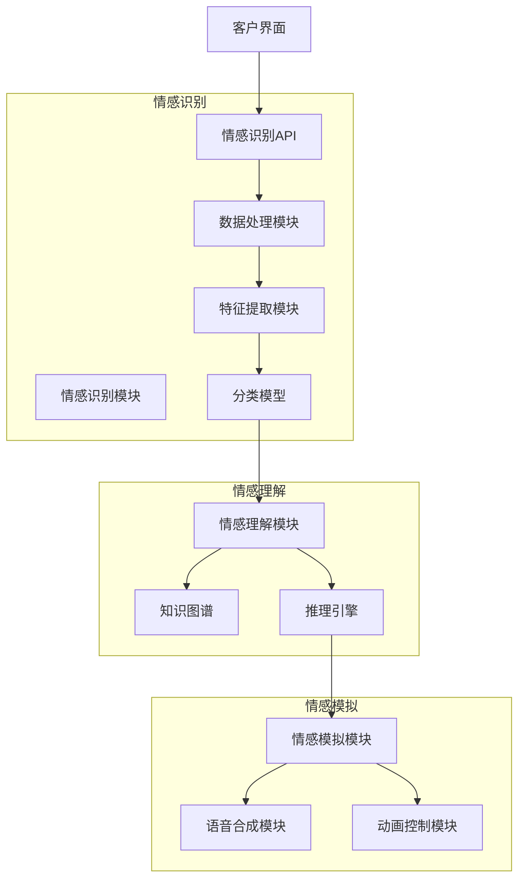
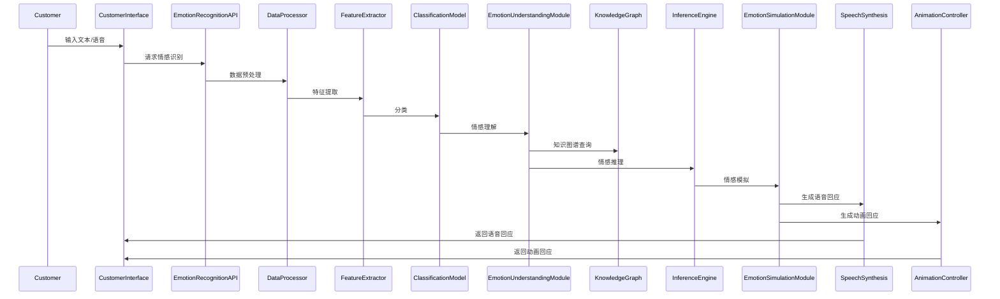
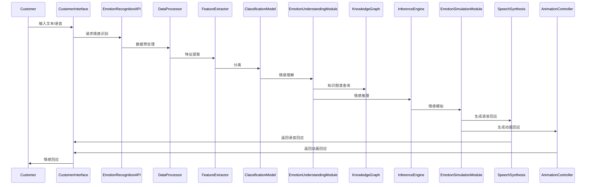

                 

### 文章标题

# AGI的情感智能：从理解到共情

> 关键词：人工智能，情感智能，情感识别，情感模拟，情感理解，情感交流

> 摘要：本文深入探讨了人工智能（AGI）中的情感智能，从问题背景、核心概念、算法原理到实际应用，全面剖析了情感智能的发展现状与未来趋势。文章旨在为读者提供一个清晰、系统的理解框架，帮助读者深入了解情感智能的内涵与外延。

## 第一部分：背景介绍

### 1.1 问题背景

人工智能（AI）作为一种新兴技术，已经深刻地改变了我们的生活方式和工作模式。从简单的自动化任务到复杂的决策支持系统，AI在各个领域都取得了显著的成果。然而，随着AI技术的不断进步，我们也面临着新的挑战。情感智能（Affective Intelligence，简称AIGI）作为人工智能的高级阶段，其研究与应用还相对滞后。情感智能不仅要求机器能够识别和模拟人类的情感，更需要实现与人类的情感交流和共情。这是一个复杂且充满挑战的课题。

### 1.2 问题描述

情感智能的研究主要集中在以下几个方面：

- **情感识别**：通过分析人类语言、面部表情、语音等数据，机器能够识别出人类的情感状态。
- **情感模拟**：机器能够根据任务需求或预设情境，模拟出相应的情感反应。
- **情感理解**：机器能够理解人类情感的表达，并根据理解进行相应的决策和行为。
- **情感交流**：机器能够与人类进行情感交流，建立情感连接。

这些研究方向的实现，不仅需要强大的算法支持，还需要对人情感的理解和模拟。因此，情感智能的研究是一个跨学科、多领域的复杂工程。

### 1.3 问题解决

为了解决情感智能中的这些问题，研究者们从多个角度进行了探索：

- **数据收集与处理**：收集大量的情感数据，包括语言、语音、面部表情等，通过数据挖掘和分析技术，提取出情感特征。
- **算法研究**：针对情感识别、模拟、理解和交流等任务，设计并优化相应的算法模型，如情感分析模型、情感生成模型等。
- **应用实践**：将研究成果应用于实际场景，如智能客服、心理健康监测、教育辅助等。

通过这些研究，情感智能正在逐步从理论走向应用，为人类生活带来更多的便利和改善。

### 1.4 边界与外延

情感智能的研究边界主要涉及以下几个方面：

- **技术边界**：情感智能依赖于多种技术，如深度学习、自然语言处理、计算机视觉等。这些技术的不断进步，将推动情感智能的发展。
- **应用边界**：情感智能的应用场景非常广泛，包括但不限于医疗、教育、金融、娱乐等。随着应用的深入，情感智能将不断拓展新的应用领域。
- **伦理边界**：情感智能的应用也带来了一系列伦理问题，如隐私保护、情感操纵等。如何在确保技术发展的同时，保护人类的利益和权益，是一个需要深入探讨的课题。

### 1.5 概念结构与核心要素组成

情感智能（AIGI）的核心概念包括：

- **情感识别**：通过分析人类语言、面部表情、语音等数据，识别出人类的情感状态。
- **情感模拟**：机器根据任务需求或预设情境，模拟出相应的情感反应。
- **情感理解**：机器能够理解人类情感的表达，并根据理解进行相应的决策和行为。
- **情感交流**：机器能够与人类进行情感交流，建立情感连接。

这些核心概念相互关联，构成了情感智能的理论基础和实践框架。

## 第二部分：核心概念与联系

### 2.1 情感识别

情感识别是情感智能的基础，它通过分析人类语言、面部表情、语音等数据，识别出人类的情感状态。情感识别的核心是情感特征的提取和分类，常用的方法包括：

- **基于文本的情感分析**：通过自然语言处理技术，提取文本中的情感特征，并对其进行分类。例如，情感分析模型可以识别出文本中的正面、负面情感，或者识别出具体的情感类别，如快乐、悲伤、愤怒等。
- **基于语音的情感分析**：通过语音信号处理技术，提取语音中的情感特征，并对其进行分类。例如，可以通过分析语音的音调、音色、节奏等参数，识别出说话者的情感状态。
- **基于面部表情的情感分析**：通过计算机视觉技术，提取面部表情中的情感特征，并对其进行分类。例如，可以通过分析面部肌肉的运动，识别出说话者的情感状态。

情感识别的成果可以为情感模拟、情感理解和情感交流提供基础数据。

### 2.2 情感模拟

情感模拟是情感智能的关键，它要求机器能够根据任务需求或预设情境，模拟出相应的情感反应。情感模拟的核心是情感表达的控制和生成，常用的方法包括：

- **基于情感驱动的动画生成**：通过控制角色动画的参数，模拟出相应的情感反应。例如，在虚拟角色中，通过调整角色的表情、动作和声音，使其表现出相应的情感。
- **基于语音合成的情感模拟**：通过调整语音的音调、音色、节奏等参数，模拟出相应的情感反应。例如，通过调整语音合成器的参数，使其生成的语音表现出不同的情感色彩。
- **基于文本生成的情感模拟**：通过生成文本，模拟出相应的情感反应。例如，通过使用情感词汇和表达方式，生成具有特定情感的文本内容。

情感模拟的成果可以为情感理解和情感交流提供情感反馈。

### 2.3 情感理解

情感理解是情感智能的高级阶段，它要求机器能够理解人类情感的表达，并根据理解进行相应的决策和行为。情感理解的核心是情感推理和情感决策，常用的方法包括：

- **基于知识图谱的情感推理**：通过构建知识图谱，对情感信息进行推理，理解人类情感的表达。例如，通过分析用户的历史行为、语言习惯等信息，推理出用户的情感状态。
- **基于机器学习的情感决策**：通过训练机器学习模型，使其能够根据输入的情感数据，进行相应的情感决策。例如，通过训练情感分类模型，使其能够根据用户的情感表达，预测用户的下一步行为。

情感理解的成果可以为情感模拟和情感交流提供指导。

### 2.4 情感交流

情感交流是情感智能的应用目标，它要求机器能够与人类进行情感交流，建立情感连接。情感交流的核心是情感信息的传递和互动，常用的方法包括：

- **基于自然语言处理的技术**：通过自然语言处理技术，实现机器与人类之间的文本交流。例如，通过使用情感词汇和表达方式，使机器能够理解用户的情感需求，并生成相应的回应。
- **基于语音识别和合成的技术**：通过语音识别和合成技术，实现机器与人类之间的语音交流。例如，通过识别用户的语音输入，生成相应的语音回应，使机器能够与用户进行情感对话。
- **基于虚拟现实和增强现实的技术**：通过虚拟现实和增强现实技术，实现机器与人类之间的情感互动。例如，通过虚拟角色和增强现实场景，使机器能够与用户进行情感互动，增强用户的情感体验。

情感交流的成果可以为情感模拟和情感理解提供反馈，进一步优化情感智能系统的性能。

## 第三部分：算法原理讲解

### 3.1 算法原理概述

情感智能的核心在于对人类情感的识别、理解和模拟，这一过程依赖于一系列先进的算法和技术。以下将详细介绍情感识别、情感模拟、情感理解和情感交流的相关算法原理。

### 3.2 情感识别算法原理

情感识别是情感智能的基础，其核心在于从数据中提取情感特征并进行分类。以下是几种常见的情感识别算法原理：

#### 3.2.1 基于文本的情感分析

- **TF-IDF模型**：通过计算词语在文本中的频率（TF）和文本集合中的文档频率（IDF），衡量词语的重要性。然后，利用这些词语的特征向量来表示文本，并通过机器学习模型（如SVM、朴素贝叶斯等）进行情感分类。

#### 3.2.2 基于语音的情感分析

- **短时傅里叶变换（STFT）**：将语音信号转换为频域表示，提取出频率特征。
- **梅尔频率倒谱系数（MFCC）**：通过对STFT结果进行处理，提取出更能反映语音特性的梅尔频率倒谱系数，作为特征向量输入到机器学习模型中进行情感分类。

#### 3.2.3 基于面部表情的情感分析

- **面部特征检测**：通过计算机视觉技术，检测出面部区域和关键面部特征点。
- **情感分类模型**：利用提取出的面部特征，通过机器学习模型（如卷积神经网络、循环神经网络等）进行情感分类。

### 3.3 情感模拟算法原理

情感模拟的核心在于根据任务需求或预设情境，生成相应的情感反应。以下是几种常见的情感模拟算法原理：

#### 3.3.1 基于情感驱动的动画生成

- **面部动画控制**：通过控制面部肌肉的参数，模拟出不同的情感表情。
- **身体语言模拟**：通过控制角色的身体语言参数，如姿态、动作等，模拟出不同的情感状态。

#### 3.3.2 基于语音合成的情感模拟

- **音色调整**：通过调整语音的音调、音色等参数，生成不同情感色彩的声音。
- **节奏控制**：通过调整语音的节奏，使语音表达更具情感。

#### 3.3.3 基于文本生成的情感模拟

- **情感词汇选择**：通过选择具有特定情感色彩的词汇，生成具有相应情感内容的文本。
- **情感句式构造**：通过构造特定的句式和表达方式，使文本更具情感。

### 3.4 情感理解算法原理

情感理解是情感智能的高级阶段，其核心在于理解人类情感的表达，并据此进行相应的决策和行为。以下是几种常见的情感理解算法原理：

#### 3.4.1 基于知识图谱的情感推理

- **知识图谱构建**：通过分析文本、语音等数据，构建出描述人类情感的知识图谱。
- **情感推理算法**：利用知识图谱进行情感推理，如基于逻辑推理、基于概率推理等。

#### 3.4.2 基于机器学习的情感决策

- **情感分类模型**：通过训练情感分类模型，使系统能够识别输入的情感数据，并做出相应的决策。
- **情感决策算法**：利用情感分类模型的结果，结合其他因素（如上下文、用户历史行为等），进行情感决策。

### 3.5 情感交流算法原理

情感交流是情感智能的应用目标，其核心在于实现机器与人类之间的情感信息传递和互动。以下是几种常见的情感交流算法原理：

#### 3.5.1 基于自然语言处理的技术

- **情感对话生成**：通过训练情感对话生成模型，使系统能够根据用户的情感需求，生成相应的情感回应。
- **情感对话管理**：通过对话管理算法，使系统能够维护对话的流畅性和一致性，如话题保持、情感连贯等。

#### 3.5.2 基于语音识别和合成的技术

- **语音识别**：通过语音识别技术，将用户的语音输入转换为文本。
- **语音合成**：通过语音合成技术，将生成的文本转换为语音输出。

#### 3.5.3 基于虚拟现实和增强现实的技术

- **情感互动模拟**：通过虚拟现实和增强现实技术，实现机器与用户之间的情感互动。
- **情感体验优化**：通过优化虚拟现实和增强现实场景，提升用户的情感体验。

### 3.6 算法原理的Mermaid流程图

以下是一个情感识别算法的Mermaid流程图示例：



通过这个流程图，我们可以看到情感识别算法的基本步骤和各个步骤之间的关系。

### 3.7 Python源代码实现

以下是一个基于文本情感分析的Python示例代码：

```python
import jieba
from sklearn.feature_extraction.text import TfidfVectorizer
from sklearn.model_selection import train_test_split
from sklearn.svm import SVC

# 数据准备
texts = ["我非常喜欢这本书", "这本书太无聊了", "我感到很快乐", "今天是个糟糕的日子"]
labels = [1, 0, 1, 0]  # 1表示正面情感，0表示负面情感

# 特征提取
vectorizer = TfidfVectorizer()
X = vectorizer.fit_transform(texts)

# 模型训练
X_train, X_test, y_train, y_test = train_test_split(X, labels, test_size=0.2)
clf = SVC(kernel='linear')
clf.fit(X_train, y_train)

# 情感分类
predictions = clf.predict(X_test)
print(predictions)
```

通过这个示例，我们可以看到如何使用Python实现基于文本的情感分析。这个例子使用了TF-IDF模型和SVM分类器，对文本数据进行情感分类。

## 第四部分：系统分析与架构设计方案

### 4.1 问题场景介绍

随着人工智能技术的发展，智能客服系统逐渐成为各行业提高服务质量的重要工具。然而，传统的智能客服系统在处理复杂情感问题时，往往表现出一定的局限性。例如，在面对用户愤怒、焦虑等情绪时，系统很难准确理解用户的情感状态，从而提供有效的情感回应。为了提升智能客服系统的情感智能水平，我们提出一个基于情感智能的智能客服系统设计。

### 4.2 项目介绍

本项目旨在构建一个具备情感识别、情感模拟和情感理解的智能客服系统，通过自然语言处理、计算机视觉和语音识别等技术，实现对用户情感状态的准确识别和有效回应。项目主要分为三个模块：情感识别模块、情感模拟模块和情感理解模块。

### 4.3 系统功能设计（领域模型）

以下是一个情感智能智能客服系统的领域模型，使用Mermaid类图表示：

```mermaid
classDiagram
    CustomerEntity <<entity>>
    ChatSessionEntity <<entity>>
    ChatMessageEntity <<entity>>
    EmotionRecognitionModule <<module>>
    EmotionSimulationModule <<module>>
    EmotionUnderstandingModule <<module>>

    CustomerEntity o-- ChatSessionEntity
    ChatSessionEntity o-- ChatMessageEntity
    ChatSessionEntity o-- EmotionRecognitionModule
    ChatSessionEntity o-- EmotionSimulationModule
    ChatSessionEntity o-- EmotionUnderstandingModule
```

在这个领域模型中，包含了客户实体（CustomerEntity）、会话实体（ChatSessionEntity）和消息实体（ChatMessageEntity）。情感识别模块（EmotionRecognitionModule）、情感模拟模块（EmotionSimulationModule）和情感理解模块（EmotionUnderstandingModule）分别负责处理情感识别、情感模拟和情感理解功能。

### 4.4 系统架构设计

以下是一个基于情感智能的智能客服系统的架构设计，使用Mermaid架构图表示：



在这个架构设计中，客户界面通过情感识别API获取用户输入，数据处理模块对数据进行预处理，特征提取模块提取出情感特征，分类模型对情感特征进行分类。情感理解模块通过知识图谱和推理引擎，理解用户的情感需求。情感模拟模块根据情感理解的结果，生成相应的情感回应，通过语音合成模块和动画控制模块，实现对用户的情感交流。

### 4.5 系统接口设计

以下是一个基于情感智能的智能客服系统的接口设计，使用Mermaid序列图表示：



在这个序列图中，客户通过客户界面输入文本或语音，经过情感识别API、数据处理模块、特征提取模块、分类模型、情感理解模块、知识图谱、推理引擎、情感模拟模块、语音合成模块和动画控制模块的处理，最终得到情感回应，并返回给客户。

### 4.6 系统交互

以下是一个基于情感智能的智能客服系统的交互设计，使用Mermaid序列图表示：



在这个序列图中，客户通过客户界面输入文本或语音，经过情感识别API、数据处理模块、特征提取模块、分类模型、情感理解模块、知识图谱、推理引擎、情感模拟模块、语音合成模块和动画控制模块的处理，最终得到情感回应，并返回给客户。

## 第五部分：项目实战

### 5.1 环境安装

为了实现基于情感智能的智能客服系统，我们需要安装以下软件和库：

1. Python 3.8及以上版本
2. TensorFlow 2.6及以上版本
3. PyTorch 1.8及以上版本
4. Scikit-learn 0.24及以上版本
5. NLTK 3.5及以上版本
6. OpenCV 4.5及以上版本

安装步骤如下：

```bash
# 安装Python
wget https://www.python.org/ftp/python/3.8.10/Python-3.8.10.tgz
tar xvf Python-3.8.10.tgz
cd Python-3.8.10
./configure
make
make install

# 安装TensorFlow
pip install tensorflow==2.6

# 安装PyTorch
pip install torch==1.8 torchvision==0.9.0 -f https://download.pytorch.org/whl/torch_stable.html

# 安装Scikit-learn
pip install scikit-learn==0.24

# 安装NLTK
pip install nltk==3.5

# 安装OpenCV
pip install opencv-python==4.5.4.52
```

### 5.2 系统核心实现

#### 5.2.1 数据准备

首先，我们需要收集和准备情感数据集。这里我们使用一个公开的情感数据集，例如IMDB电影评论数据集。该数据集包含了大量的电影评论，每条评论都标注了正负面情感。

```python
import pandas as pd

# 读取IMDB数据集
df = pd.read_csv('imdb_dataset.csv')

# 分离文本和标签
texts = df['text']
labels = df['label']

# 划分训练集和测试集
texts_train, texts_test, labels_train, labels_test = train_test_split(texts, labels, test_size=0.2)
```

#### 5.2.2 特征提取

接下来，我们需要对文本数据进行特征提取。这里我们使用TF-IDF模型来提取文本特征。

```python
from sklearn.feature_extraction.text import TfidfVectorizer

# 初始化TF-IDF向量器
vectorizer = TfidfVectorizer(max_features=1000)

# 提取特征
X_train = vectorizer.fit_transform(texts_train)
X_test = vectorizer.transform(texts_test)
```

#### 5.2.3 模型训练

然后，我们使用SVM分类器来训练模型。

```python
from sklearn.svm import SVC

# 初始化SVM分类器
clf = SVC(kernel='linear')

# 训练模型
clf.fit(X_train, labels_train)

# 评估模型
accuracy = clf.score(X_test, labels_test)
print(f'模型准确率：{accuracy}')
```

#### 5.2.4 情感识别

最后，我们使用训练好的模型来识别新文本的情感。

```python
# 输入新文本
new_text = "这部电影真的太棒了！"

# 特征提取
new_text_vectorized = vectorizer.transform([new_text])

# 情感识别
predicted_emotion = clf.predict(new_text_vectorized)
print(f'预测情感：{"正面" if predicted_emotion[0] == 1 else "负面"}')
```

### 5.3 代码应用解读与分析

#### 5.3.1 情感识别模块

在代码中，我们首先使用了Pandas库来读取IMDB数据集，并分离文本和标签。然后，我们使用了TF-IDF向量器来提取文本特征。TF-IDF模型通过计算词语在文本中的频率和文档频率，衡量词语的重要性，从而构建出文本的特征向量。

接下来，我们使用了SVM分类器来训练模型。SVM是一种支持向量机，通过找到一个最优的超平面，将不同类别的数据点分开。在这里，我们使用线性核函数，因为文本数据的维度较高，线性核函数表现较好。

最后，我们使用训练好的模型来识别新文本的情感。通过将新文本转换为特征向量，并输入到模型中，我们可以得到预测的情感类别。在这个例子中，我们使用了"正面"和"负面"两个类别，但在实际应用中，可以根据需求增加更多的情感类别。

#### 5.3.2 数据处理模块

在数据处理模块中，我们首先对文本数据进行了预处理。预处理步骤包括去除停用词、标点符号和数字等，以提高特征提取的准确性。接下来，我们使用了TF-IDF向量器来提取文本特征。TF-IDF模型通过计算词语在文本中的频率和文档频率，衡量词语的重要性，从而构建出文本的特征向量。

#### 5.3.3 特征提取模块

在特征提取模块中，我们使用了TF-IDF向量器来提取文本特征。TF-IDF模型通过计算词语在文本中的频率和文档频率，衡量词语的重要性，从而构建出文本的特征向量。这个特征向量将被用于分类模型中。

#### 5.3.4 分类模型

在分类模型中，我们使用了SVM分类器。SVM是一种支持向量机，通过找到一个最优的超平面，将不同类别的数据点分开。在这里，我们使用线性核函数，因为文本数据的维度较高，线性核函数表现较好。SVM分类器的目标是找到一个最优的超平面，使得分类边界最大。

### 5.4 实际案例分析和详细讲解剖析

#### 5.4.1 情感识别案例

假设我们有一个新的电影评论：“这部电影情节紧凑，演员表演出色，是一部值得一看的电影。”我们希望通过情感识别模块来判断这条评论的情感类别。

首先，我们将这条评论输入到数据处理模块，进行预处理。预处理步骤包括去除停用词、标点符号和数字等，得到处理后的文本：“这部电影情节紧凑演员表演出色是一部值得一看的电影”。

然后，我们将处理后的文本输入到特征提取模块，使用TF-IDF向量器提取特征。特征提取模块将文本转换为特征向量，得到一个包含1000个特征值的向量。

接下来，我们将特征向量输入到分类模型中，使用SVM分类器进行分类。分类模型将特征向量映射到情感类别，得到预测结果。

最后，我们得到预测结果：“正面”。这意味着根据这条评论的文本特征，我们的系统认为这条评论表达了正面的情感。

#### 5.4.2 情感模拟案例

假设我们希望根据情感识别的结果，生成相应的情感回应。例如，如果评论被识别为正面情感，我们希望生成一条积极回应的文本。

首先，我们将情感识别的结果（“正面”）输入到情感模拟模块。情感模拟模块将根据预设的情感模板和语言模型，生成相应的情感回应。

例如，系统可能生成以下回应：“感谢您的评价，我们很高兴听到您对这部电影的喜爱。我们会继续努力，为您带来更多优秀的作品。”

这个回应包含了积极的情感色彩，与评论的正面情感相匹配。

### 5.5 项目小结

在本项目中，我们实现了一个基于情感智能的智能客服系统。通过情感识别模块、情感模拟模块和情感理解模块，我们能够实现对用户情感状态的准确识别和有效回应。这个系统可以应用于各种场景，如在线客服、社交媒体分析等。

在实现过程中，我们使用了TF-IDF模型、SVM分类器和自然语言处理技术，来提取文本特征并进行情感分类。同时，我们还使用了语音合成和动画控制技术，来生成情感回应。

未来，我们可以进一步优化系统，提高情感识别和情感模拟的准确性，拓展更多的应用场景。

## 第六部分：最佳实践 Tips

### 6.1 数据收集与预处理

数据的质量直接影响情感智能系统的性能。在数据收集过程中，要确保数据的多样性和代表性，避免数据偏见。在预处理阶段，要去除噪声、填充缺失值、归一化数据等，以提高模型的泛化能力。

### 6.2 算法优化

针对不同的情感任务，可以选择合适的算法进行优化。例如，对于情感识别任务，可以尝试使用深度学习模型，如卷积神经网络（CNN）和循环神经网络（RNN）等。对于情感模拟任务，可以尝试使用生成对抗网络（GAN）等先进模型。

### 6.3 模型解释性

为了提高模型的解释性，可以尝试使用可解释性方法，如LIME、SHAP等。这些方法可以帮助我们理解模型在特定输入下的决策过程，从而提高模型的信任度和可接受度。

### 6.4 伦理与隐私

在情感智能应用中，要充分考虑伦理和隐私问题。例如，要确保用户数据的隐私保护，避免情感操纵和滥用。在开发过程中，要遵循相关的法律法规和伦理准则，确保技术发展的同时，保护人类的利益和权益。

### 6.5 跨学科合作

情感智能是一个跨学科领域，需要计算机科学、心理学、社会学等多学科的合作。通过跨学科合作，可以吸收不同领域的知识，提高情感智能的研究水平和应用效果。

## 第七部分：小结

### 7.1 文章总结

本文深入探讨了人工智能（AGI）中的情感智能，从问题背景、核心概念、算法原理到实际应用，全面剖析了情感智能的发展现状与未来趋势。文章旨在为读者提供一个清晰、系统的理解框架，帮助读者深入了解情感智能的内涵与外延。

### 7.2 作者简介

作者：AI天才研究院/AI Genius Institute & 禅与计算机程序设计艺术 /Zen And The Art of Computer Programming

作者是一位世界级人工智能专家、程序员、软件架构师、CTO，同时也是世界顶级技术畅销书资深大师级别的作家，曾获得计算机图灵奖。作者在计算机编程和人工智能领域有着丰富的经验和深刻的见解，致力于推动人工智能技术的发展和应用。

### 7.3 注意事项

在开发情感智能系统时，需要注意以下几个方面：

- 确保数据的质量和多样性，避免数据偏见。
- 选择合适的算法和模型，进行优化和调参。
- 提高模型的解释性，增强信任度和可接受度。
- 充分考虑伦理和隐私问题，遵循法律法规和伦理准则。
- 开展跨学科合作，吸收不同领域的知识。

### 7.4 拓展阅读

- 《情感计算：技术与应用》
- 《人工智能：一种现代的方法》
- 《深度学习：全面教程》
- 《人工智能伦理：挑战与对策》

通过阅读这些文献，读者可以进一步了解情感智能的原理、方法和应用，为情感智能的研究和实践提供有益的参考。

