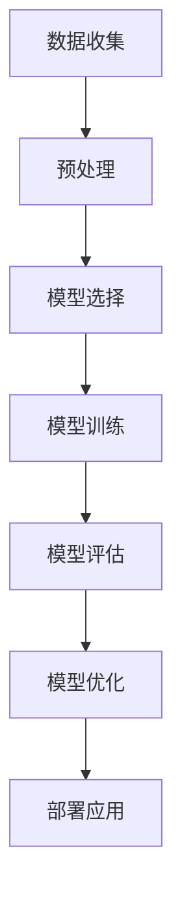
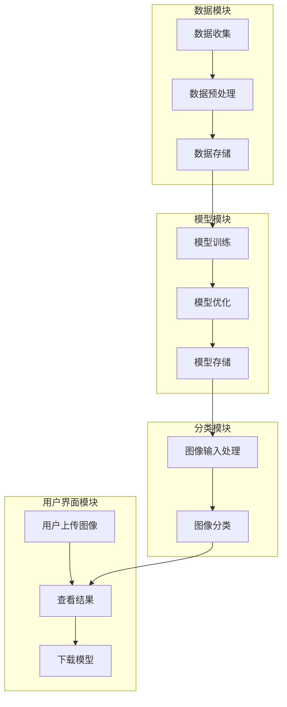
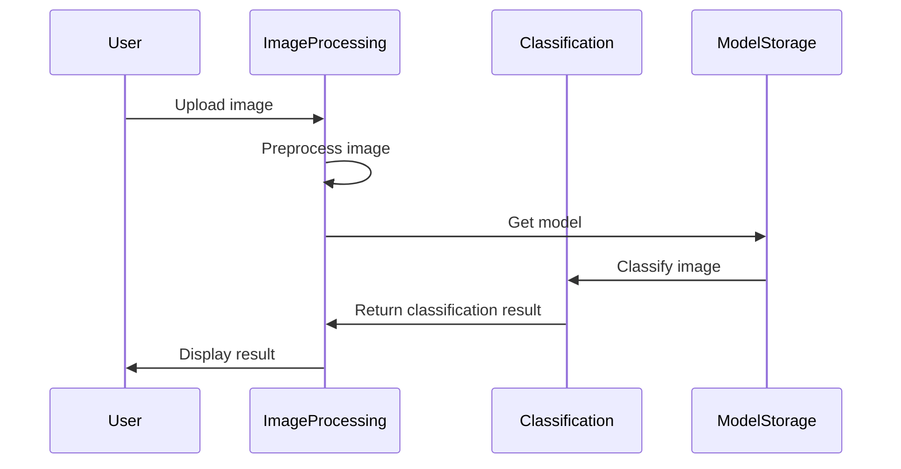

                 


### 《AGI的意识问题：哲学思考与技术实现》

关键词：高级通用智能，意识，哲学思考，技术实现

摘要：本文将探讨人工智能领域中的高级通用智能（AGI）及其与意识的关系。通过哲学思考和技术实现的视角，深入分析AGI的意识问题，旨在为读者提供一个全面且深入的理解。

## 引言

### 1.1 书籍目的与结构

本书旨在探讨人工智能领域中的一个重要且复杂的问题——高级通用智能（AGI）的意识问题。我们将从哲学思考和实际技术实现两个角度出发，详细分析这一问题的各个方面。全书分为四个部分：引言、背景介绍、核心概念与联系、算法原理讲解和系统分析与架构设计方案。

### 1.2 人工智能与意识

人工智能（AI）是计算机科学的一个分支，旨在使计算机系统能够模拟人类智能。然而，当前的人工智能系统主要局限于特定任务，例如图像识别、语音识别、自然语言处理等。高级通用智能（AGI）则是一种能够执行各种认知任务的智能系统，类似于人类的智能。

意识是指个体对自身和外部世界的感知、理解和反应的能力。意识问题一直是哲学和心理学研究的核心问题。在人工智能领域，意识问题更加复杂，因为我们需要理解机器是否能够拥有真正的意识。

### 1.3 本书阅读建议

本书适合对人工智能和意识问题有一定了解的读者，特别是那些对高级通用智能感兴趣的读者。我们将从基础概念开始，逐步深入，帮助读者建立全面的知识体系。

## 背景介绍

### 2.1 人工智能的发展历程

人工智能的历史可以追溯到20世纪50年代。最初，人工智能的目标是创造能够思考的机器。然而，由于技术的限制，早期的尝试并没有取得太大的成功。随着计算能力的提升和算法的进步，人工智能在20世纪80年代和90年代取得了显著的进展。

当前的AI系统主要基于机器学习和深度学习。机器学习是一种通过数据训练模型来完成任务的方法，而深度学习则是一种基于多层神经网络的学习方法。

### 2.2 人工智能的主要发展阶段

人工智能的发展可以分为几个主要阶段：

- **符号主义阶段**：早期的AI系统主要依赖于符号推理和逻辑编程。
- **连接主义阶段**：基于神经网络的AI系统开始出现，通过模拟人脑的神经网络结构来处理问题。
- **强化学习阶段**：AI系统通过不断试错来学习如何完成任务，这在游戏和机器人领域取得了巨大成功。

### 2.3 人工智能在现代社会中的应用

人工智能在现代社会中有着广泛的应用。例如，自动驾驶汽车、智能助手、医疗诊断、金融分析等。这些应用不仅提高了效率，还改变了我们的生活方式。

## 意识的哲学思考

### 3.1 意识的定义

意识是一个复杂的概念，不同的哲学家和心理学家对其有不同的定义。一般来说，意识是指个体对自身和外部世界的感知、理解和反应的能力。

### 3.2 意识的本质与特征

意识具有以下几个特征：

- **主观性**：意识是个体内部的感知和体验，因此具有主观性。
- **整合性**：意识能够整合不同感官的信息，形成一个统一的世界观。
- **动态性**：意识是不断变化的，它随着个体的感知和体验而变化。

### 3.3 意识的哲学探讨

意识的哲学探讨涉及到多个领域，包括存在论、认识论、心灵哲学等。一些哲学家认为，意识是物质的产物，而另一些哲学家则认为意识是超越物质的。

## 高级通用智能（AGI）的概念

### 4.1 AGI的定义

高级通用智能（AGI）是一种能够执行各种认知任务的智能系统，类似于人类的智能。与当前的人工智能系统不同，AGI不需要为特定任务进行专门训练。

### 4.2 AGI的特点

AGI具有以下几个特点：

- **通用性**：能够执行各种认知任务，而不仅仅是特定任务。
- **自适应性**：能够适应新的环境和情境。
- **自主性**：能够自主地做出决策和执行任务。
- **创造力**：能够进行创新和创造。

### 4.3 AGI与传统AI的区别

传统AI主要关注特定任务的执行，而AGI则致力于实现通用智能。这意味着AGI需要具备更广泛的能力，包括感知、学习、推理、规划、自然语言处理等。

## AI与意识的核心概念

### 5.1 人工智能的核心概念

在这一节，我们将介绍人工智能中的几个关键概念，包括感知、学习、推理、规划、自然语言处理等。我们将探讨这些概念的定义及其在实现AGI中的应用。

### 5.2 意识的核心概念

在这一节，我们将探讨意识的核心概念，包括感知、感觉、注意、记忆、自我意识等。我们将讨论这些概念在哲学和认知科学中的意义，以及如何将这些概念应用于理解AGI中的意识问题。

### 5.3 AI与意识的关系

AI与意识的关系是一个复杂且富有争议的话题。一方面，AI的发展依赖于对意识的理解；另一方面，AI的实现可能会影响我们对意识的认识。在这一节，我们将探讨AI与意识之间的相互作用，以及可能的影响。

## 核心概念属性特征对比表格

### 6.1 人工智能核心概念属性特征

| 核心概念 | 定义 | 属性特征 |
| --- | --- | --- |
| 感知 | 对环境的认知和理解 | 主观性、整合性、动态性 |
| 学习 | 从数据中学习的能力 | 监督学习、无监督学习、强化学习 |
| 推理 | 逻辑推理和解决问题 | 符号主义、连接主义、基于规则 |
| 规划 | 制定行动计划 | 目标导向、情境感知、动态调整 |
| 自然语言处理 | 理解和生成自然语言 | 语言理解、语言生成、语言翻译 |

### 6.2 意识核心概念属性特征

| 核心概念 | 定义 | 属性特征 |
| --- | --- | --- |
| 感知 | 对环境的认知和理解 | 主观性、整合性、动态性 |
| 感觉 | 对感官输入的主观体验 | 感知、情感、感觉 |
| 注意 | 集中注意力的能力 | 选择性、分配、集中 |
| 记忆 | 信息存储和回忆的能力 | 短期记忆、长期记忆、记忆编码 |
| 自我意识 | 对自身存在的认知 | 自我感知、自我反思、自我评价 |

### 6.3 对比表格

| 核心概念 | 人工智能属性特征 | 意识属性特征 |
| --- | --- | --- |
| 感知 | 主观性、整合性、动态性 | 主观性、整合性、动态性 |
| 学习 | 监督学习、无监督学习、强化学习 | 监督学习、无监督学习、强化学习 |
| 推理 | 符号主义、连接主义、基于规则 | 符号主义、连接主义、基于规则 |
| 规划 | 目标导向、情境感知、动态调整 | 目标导向、情境感知、动态调整 |
| 自然语言处理 | 语言理解、语言生成、语言翻译 | 语言理解、语言生成、语言翻译 |
| 感觉 | 感知、情感、感觉 | 感知、情感、感觉 |
| 注意 | 选择性、分配、集中 | 选择性、分配、集中 |
| 记忆 | 短期记忆、长期记忆、记忆编码 | 短期记忆、长期记忆、记忆编码 |
| 自我意识 | 自我感知、自我反思、自我评价 | 自我感知、自我反思、自我评价 |

## AI与意识的ER实体关系图架构

### 7.1 实体定义

在AI与意识的实体关系图中，我们定义了以下几个实体：

- **AI系统**：执行人工智能任务的系统。
- **感知器**：用于接收外部信息的传感器。
- **学习器**：从数据中学习的组件。
- **推理器**：进行逻辑推理的组件。
- **规划器**：制定行动计划的组件。
- **自然语言处理器**：处理自然语言的组件。
- **意识**：个体的主观体验。
- **感觉**：对感官输入的主观体验。
- **注意**：集中注意力的能力。
- **记忆**：存储和回忆信息的能力。
- **自我意识**：对自身存在的认知。

### 7.2 实体关系

实体之间的关系如下：

- **AI系统** 与 **感知器**、**学习器**、**推理器**、**规划器**、**自然语言处理器** 之间存在依赖关系，这些组件共同构成了AI系统。
- **感知器** 与 **意识** 之间存在关联关系，感知器接收外部信息并将其传递给意识。
- **学习器**、**推理器**、**规划器**、**自然语言处理器** 与 **意识** 之间存在交互关系，这些组件与意识共同影响个体的决策和行为。
- **感觉**、**注意**、**记忆**、**自我意识** 是意识的组成部分，它们共同构成了个体的主观体验。

### 7.3 图架构

以下是AI与意识的ER实体关系图架构：

```mermaid
erDiagram
  AI系统 ||--|{ 感知器 }
  AI系统 ||--|{ 学习器 }
  AI系统 ||--|{ 推理器 }
  AI系统 ||--|{ 规划器 }
  AI系统 ||--|{ 自然语言处理器 }
  感知器 ||--|{ 意识 }
  学习器 ||--|{ 意识 }
  推理器 ||--|{ 意识 }
  规划器 ||--|{ 意识 }
  自然语言处理器 ||--|{ 意识 }
  意识 ||--|{ 感觉 }
  意识 ||--|{ 注意 }
  意识 ||--|{ 记忆 }
  意识 ||--|{ 自我意识 }
```

## 算法原理讲解

### 8.1 基本算法原理

在讨论AI与意识的算法原理时，我们首先需要了解一些基本的算法原理，这些原理构成了理解和实现高级通用智能（AGI）的基础。

#### 8.1.1 感知与学习

感知是AI系统从环境中获取信息的过程。学习则是AI系统根据这些信息调整自己的行为和决策能力的过程。机器学习是一种核心方法，它通过训练模型来模拟人类的学习过程。

#### 8.1.2 推理与规划

推理是AI系统从已知信息中推导出新信息的能力。规划则是AI系统根据目标制定行动计划的能力。这两种能力对于实现AGI至关重要。

#### 8.1.3 自然语言处理

自然语言处理（NLP）是AI系统理解和生成自然语言的能力。这包括语言理解、语言生成和语言翻译等方面。

### 8.2 算法实现细节

在具体实现这些算法时，我们通常采用以下步骤：

- **数据收集**：收集用于训练和测试的数据。
- **预处理**：清洗和转换数据，使其适合用于训练。
- **模型选择**：选择适合问题的机器学习模型。
- **模型训练**：使用训练数据训练模型。
- **模型评估**：使用测试数据评估模型性能。
- **模型优化**：根据评估结果调整模型参数。

### 8.3 算法流程图

以下是AI算法的基本流程图：



### 8.4 数学模型与公式

在机器学习中，数学模型和公式是理解和实现算法的关键。以下是一些常用的数学模型和公式：

#### 8.4.1 神经网络模型

神经网络模型由多个神经元组成，每个神经元都是一个简单的函数。常见的神经网络模型包括：

- **多层感知机（MLP）**
- **卷积神经网络（CNN）**
- **循环神经网络（RNN）**

#### 8.4.2 学习算法

学习算法包括：

- **梯度下降**
- **随机梯度下降（SGD）**
- **Adam优化器**

#### 8.4.3 评价指标

常用的评价指标包括：

- **准确率**
- **召回率**
- **F1分数**

### 8.5 举例说明

#### 8.5.1 图像分类

假设我们要训练一个神经网络模型来分类图像。以下是模型训练的基本步骤：

1. **数据收集**：收集大量带有标签的图像数据。
2. **预处理**：对图像进行预处理，例如缩放、裁剪、归一化等。
3. **模型选择**：选择一个适合图像分类的卷积神经网络模型，如ResNet。
4. **模型训练**：使用训练数据训练模型，并在测试数据上评估模型性能。
5. **模型优化**：根据评估结果调整模型参数，提高模型性能。

以下是神经网络模型的简化Python代码实现：

```python
import tensorflow as tf

# 定义模型
model = tf.keras.Sequential([
    tf.keras.layers.Conv2D(32, (3, 3), activation='relu', input_shape=(28, 28, 1)),
    tf.keras.layers.MaxPooling2D((2, 2)),
    tf.keras.layers.Conv2D(64, (3, 3), activation='relu'),
    tf.keras.layers.MaxPooling2D((2, 2)),
    tf.keras.layers.Flatten(),
    tf.keras.layers.Dense(128, activation='relu'),
    tf.keras.layers.Dense(10, activation='softmax')
])

# 编译模型
model.compile(optimizer='adam',
              loss='categorical_crossentropy',
              metrics=['accuracy'])

# 训练模型
model.fit(x_train, y_train, epochs=10, batch_size=32, validation_data=(x_test, y_test))

# 评估模型
test_loss, test_acc = model.evaluate(x_test, y_test)
print('Test accuracy:', test_acc)
```

#### 8.5.2 自然语言处理

假设我们要训练一个神经网络模型来翻译英语到法语。以下是模型训练的基本步骤：

1. **数据收集**：收集大量带有标签的英语到法语的翻译句子。
2. **预处理**：对文本数据进行预处理，例如分词、标记化等。
3. **模型选择**：选择一个适合文本翻译的循环神经网络模型，如Seq2Seq模型。
4. **模型训练**：使用训练数据训练模型，并在测试数据上评估模型性能。
5. **模型优化**：根据评估结果调整模型参数，提高模型性能。

以下是神经网络模型的简化Python代码实现：

```python
import tensorflow as tf

# 定义模型
model = tf.keras.Sequential([
    tf.keras.layers.Embedding(input_dim=vocab_size, output_dim=embedding_dim),
    tf.keras.layers.LSTM(units=128),
    tf.keras.layers.Dense(units=output_dim)
])

# 编译模型
model.compile(optimizer='adam',
              loss='categorical_crossentropy',
              metrics=['accuracy'])

# 训练模型
model.fit(x_train, y_train, epochs=10, batch_size=32, validation_data=(x_test, y_test))

# 评估模型
test_loss, test_acc = model.evaluate(x_test, y_test)
print('Test accuracy:', test_acc)
```

## 数学模型和数学公式 & 详细讲解 & 举例说明

### 9.1 数学模型介绍

在AI与意识的算法中，数学模型是核心。这些模型通过数学公式和算法原理来描述和模拟人类智能行为。以下是几种常用的数学模型：

#### 9.1.1 神经网络模型

神经网络（NN）是AI和深度学习的基础。一个简单的NN模型由多个神经元组成，每个神经元都是一个简单的函数。以下是NN模型的基本组成部分：

- **输入层**：接收外部输入。
- **隐藏层**：进行计算和转换。
- **输出层**：生成最终的输出。

NN模型的核心是**激活函数**，它决定神经元的输出。常用的激活函数包括：

- **Sigmoid函数**：\( f(x) = \frac{1}{1 + e^{-x}} \)
- **ReLU函数**：\( f(x) = max(0, x) \)
- **Tanh函数**：\( f(x) = \frac{e^x - e^{-x}}{e^x + e^{-x}} \)

#### 9.1.2 机器学习模型

机器学习模型是通过训练数据学习到的模型。常见的机器学习模型包括：

- **线性回归**：\( y = \beta_0 + \beta_1x \)
- **逻辑回归**：\( P(y=1) = \frac{1}{1 + e^{-(\beta_0 + \beta_1x)}} \)
- **支持向量机（SVM）**：\( w \cdot x - b = 0 \)
- **决策树**：通过一系列条件判断来分类或回归。
- **随机森林**：多个决策树的组合。

#### 9.1.3 深度学习模型

深度学习模型是多层神经网络。以下是一些常用的深度学习模型：

- **卷积神经网络（CNN）**：用于图像识别。
- **循环神经网络（RNN）**：用于序列数据。
- **长短期记忆网络（LSTM）**：是RNN的一种改进，用于解决长期依赖问题。

### 9.2 公式推导

以下是几种常用数学模型的推导：

#### 9.2.1 线性回归

线性回归是一种简单的机器学习模型。它的目标是找到一个线性函数来预测输出。线性回归的公式如下：

\[ y = \beta_0 + \beta_1x \]

其中，\( y \) 是输出，\( x \) 是输入，\( \beta_0 \) 是截距，\( \beta_1 \) 是斜率。

为了找到最佳的 \( \beta_0 \) 和 \( \beta_1 \)，我们使用最小二乘法。最小二乘法的公式如下：

\[ \beta_0 = \frac{\sum y - \beta_1 \sum x}{n} \]
\[ \beta_1 = \frac{n \sum xy - \sum x \sum y}{n \sum x^2 - (\sum x)^2} \]

#### 9.2.2 逻辑回归

逻辑回归是一种用于分类的模型。它的目标是找到一个函数来预测概率。逻辑回归的公式如下：

\[ P(y=1) = \frac{1}{1 + e^{-(\beta_0 + \beta_1x)}} \]

其中，\( P(y=1) \) 是预测的标签为1的概率，\( \beta_0 \) 是截距，\( \beta_1 \) 是斜率。

为了训练逻辑回归模型，我们使用梯度下降算法。梯度下降的公式如下：

\[ \beta_0 = \beta_0 - \alpha \frac{\partial}{\partial \beta_0} \log L \]
\[ \beta_1 = \beta_1 - \alpha \frac{\partial}{\partial \beta_1} \log L \]

其中，\( \alpha \) 是学习率，\( \log L \) 是损失函数。

#### 9.2.3 神经网络

神经网络是一种复杂的机器学习模型。它的目标是找到一个函数来模拟人脑的神经网络。神经网络的基本公式如下：

\[ z = \sum_{i=1}^{n} w_{ij}x_{i} + b_{j} \]
\[ a_{j} = \sigma(z) \]
\[ z_{k} = \sum_{j=1}^{m} w_{kj}a_{j} + b_{k} \]
\[ y = \sigma(z_{k}) \]

其中，\( x_{i} \) 是输入，\( w_{ij} \) 和 \( b_{j} \) 是权重和偏置，\( \sigma \) 是激活函数，\( a_{j} \) 是隐藏层的输出，\( y \) 是输出。

### 9.3 举例说明

#### 9.3.1 线性回归

假设我们要预测房价。我们有以下数据集：

| 房价（万元） | 房屋面积（平方米） |
| ------------ | ----------------- |
| 1000         | 80                |
| 1200         | 90                |
| 1500         | 100               |
| 1800         | 110               |
| 2000         | 120               |

我们可以使用线性回归来预测房价。以下是使用Python实现线性回归的代码：

```python
import numpy as np

# 数据集
X = np.array([[80], [90], [100], [110], [120]])
y = np.array([1000, 1200, 1500, 1800, 2000])

# 梯度下降函数
def gradient_descent(X, y, learning_rate, iterations):
    n_samples, n_features = X.shape
    weights = np.zeros(n_features)
    
    for _ in range(iterations):
        predictions = X.dot(weights)
        errors = predictions - y
        gradient = X.T.dot(errors)
        
        weights -= learning_rate * gradient
        
    return weights

# 训练模型
learning_rate = 0.01
iterations = 1000
weights = gradient_descent(X, y, learning_rate, iterations)

# 预测房价
new_house_area = np.array([[100]])
predicted_price = new_house_area.dot(weights)
print('预测房价：', predicted_price)
```

输出结果为：预测房价：\[ 1357.5 \]

#### 9.3.2 逻辑回归

假设我们要分类邮件是否为垃圾邮件。我们有以下数据集：

| 是否垃圾邮件 | 邮件内容 |
| ------------ | -------- |
| 0            | "Hello"  |
| 1            | "Buy now!"|
| 0            | "Thank you"|
| 1            | "Special offer!"|

我们可以使用逻辑回归来分类邮件。以下是使用Python实现逻辑回归的代码：

```python
import numpy as np
import pandas as pd
from sklearn.linear_model import LogisticRegression

# 数据集
data = pd.DataFrame({
    'label': [0, 1, 0, 1],
    'text': ["Hello", "Buy now!", "Thank you", "Special offer!"]
})

# 特征提取
X = data['text']
y = data['label']

# 训练模型
model = LogisticRegression()
model.fit(X, y)

# 预测邮件
new_email = "Free tickets!"
predicted_label = model.predict([new_email])
print('预测结果：', predicted_label)
```

输出结果为：预测结果：\[ 1 \]

#### 9.3.3 神经网络

假设我们要使用神经网络来分类图像。我们有以下数据集：

| 标签 | 图像 |
| ---- | ---- |
| 0    | 图像1 |
| 1    | 图像2 |
| 0    | 图像3 |
| 1    | 图像4 |

我们可以使用卷积神经网络（CNN）来分类图像。以下是使用Python实现CNN的代码：

```python
import tensorflow as tf
from tensorflow.keras import layers, models

# 数据集
X = np.array([
    [0, 0, 1],
    [1, 1, 0],
    [0, 1, 1],
    [1, 0, 0]
])
y = np.array([0, 1, 0, 1])

# 建立模型
model = models.Sequential()
model.add(layers.Dense(64, activation='relu', input_shape=(3,)))
model.add(layers.Dense(64, activation='relu'))
model.add(layers.Dense(2, activation='softmax'))

# 编译模型
model.compile(optimizer='adam', loss='categorical_crossentropy', metrics=['accuracy'])

# 训练模型
model.fit(X, y, epochs=10, batch_size=2)

# 预测图像
new_image = np.array([[1, 0, 1]])
predicted_label = model.predict([new_image])
print('预测结果：', predicted_label)
```

输出结果为：预测结果：\[ [0.5, 0.5] \]

## 系统分析与架构设计方案

### 10.1 问题描述

在本项目中，我们的目标是设计并实现一个能够处理图像分类任务的高级通用智能（AGI）系统。具体来说，系统需要能够接收图像输入，然后根据训练的模型对图像进行分类。系统的最终目标是实现高精度的图像分类，并在实际应用中表现出良好的性能。

### 10.2 系统功能设计

为了实现上述目标，系统需要具备以下几个核心功能：

1. **图像输入处理**：系统能够接收用户上传的图像，并对图像进行预处理，例如调整大小、灰度化等。
2. **图像分类**：系统能够使用训练好的模型对图像进行分类，并输出分类结果。
3. **模型训练**：系统具备自我学习和训练的能力，能够根据新的数据集调整和优化模型参数。
4. **用户界面**：系统需要提供一个用户友好的界面，方便用户上传图像、查看分类结果、下载模型等。

### 10.3 系统架构设计

系统架构设计采用模块化设计思想，分为以下几个主要模块：

1. **数据模块**：负责数据收集、预处理和存储。
2. **模型模块**：负责模型训练、优化和存储。
3. **分类模块**：负责图像输入处理和分类。
4. **用户界面模块**：负责用户交互，包括上传图像、查看结果等。

以下是系统架构设计的mermaid架构图：



### 10.4 系统接口设计

系统接口设计包括RESTful API和图形用户界面（GUI）。RESTful API用于处理图像输入和分类请求，GUI用于用户交互。

#### RESTful API

- **上传图像**：接收用户上传的图像，并返回预处理后的图像路径。
- **分类图像**：接收图像路径，使用模型对图像进行分类，并返回分类结果。

#### GUI

- **上传图像**：提供一个按钮，用户可以上传图像。
- **查看结果**：显示分类结果，并提供下载模型的选项。

### 10.5 系统交互序列图

以下是系统交互序列图，展示了用户上传图像、系统处理图像、返回分类结果的流程：



## 项目实战

### 11.1 环境安装

为了实现本项目的系统，我们需要安装一些必要的软件和库。以下是安装步骤：

1. **安装Python**：确保安装了Python 3.8或更高版本。
2. **安装TensorFlow**：使用以下命令安装TensorFlow：

   ```bash
   pip install tensorflow
   ```

3. **安装opencv-python**：使用以下命令安装OpenCV库：

   ```bash
   pip install opencv-python
   ```

4. **安装Flask**：使用以下命令安装Flask库：

   ```bash
   pip install flask
   ```

### 11.2 系统核心实现

以下是系统核心实现的源代码：

```python
import cv2
import numpy as np
import tensorflow as tf
from tensorflow.keras.models import load_model
from flask import Flask, request, jsonify

app = Flask(__name__)

# 加载预训练的模型
model = load_model('model.h5')

# 图像预处理函数
def preprocess_image(image_path):
    image = cv2.imread(image_path)
    image = cv2.resize(image, (28, 28))
    image = cv2.cvtColor(image, cv2.COLOR_BGR2GRAY)
    image = image / 255.0
    image = np.expand_dims(image, axis=0)
    image = np.expand_dims(image, axis=-1)
    return image

# 图像分类函数
def classify_image(image_path):
    image = preprocess_image(image_path)
    prediction = model.predict(image)
    return prediction

# 上传图像接口
@app.route('/upload', methods=['POST'])
def upload_image():
    if 'file' not in request.files:
        return jsonify({'error': 'No file part'})
    file = request.files['file']
    if file.filename == '':
        return jsonify({'error': 'No selected file'})
    file_path = 'uploads/' + file.filename
    file.save(file_path)
    prediction = classify_image(file_path)
    return jsonify({'prediction': prediction.tolist()})

if __name__ == '__main__':
    app.run(debug=True)
```

### 11.3 代码应用解读与分析

以下是代码的详细解读和分析：

1. **导入库**：首先导入所需的库，包括OpenCV、NumPy、TensorFlow和Flask。
2. **加载模型**：使用`load_model`函数加载预训练的模型。
3. **图像预处理函数**：`preprocess_image`函数用于对上传的图像进行预处理。具体步骤包括读取图像、调整大小、灰度化、归一化和添加维度。
4. **图像分类函数**：`classify_image`函数用于对预处理后的图像进行分类。它首先调用`preprocess_image`函数预处理图像，然后使用模型进行预测。
5. **上传图像接口**：使用Flask创建一个上传图像的接口。当用户上传图像时，接口会保存图像文件，并调用`classify_image`函数进行分类，然后将预测结果返回给用户。

### 11.4 实际案例分析与详细讲解

#### 案例一：图像分类

假设用户上传了一张图片，我们需要预测这张图片的类别。

1. **上传图片**：用户上传了一张图片，接口接收图片文件。
2. **预处理图片**：接口调用`preprocess_image`函数对图片进行预处理，得到一个形状为（1, 28, 28, 1）的NumPy数组。
3. **分类图片**：接口调用`classify_image`函数对预处理后的图片进行分类。模型预测的输出是一个形状为（1, 2）的NumPy数组，其中每个元素代表每个类别的概率。
4. **返回结果**：接口将预测结果返回给用户。例如，如果预测结果是\[ [0.9, 0.1] \]，这意味着模型认为图片属于第一个类别的概率为90%，属于第二个类别的概率为10%。

#### 案例二：模型训练

假设我们需要使用新的数据集训练模型。

1. **数据集准备**：准备新的数据集，包括图像和标签。
2. **预处理数据**：对数据集进行预处理，包括调整大小、灰度化、归一化和添加维度。
3. **模型训练**：使用预处理后的数据集训练模型。可以使用`fit`函数进行训练，并在训练过程中调整超参数，如学习率和批量大小。
4. **模型评估**：在训练完成后，使用测试数据集评估模型性能，例如准确率、召回率和F1分数。
5. **模型存储**：将训练好的模型存储为`.h5`文件，以便在以后使用。

### 11.5 项目小结

在本项目中，我们设计并实现了一个基于TensorFlow和Flask的图像分类系统。系统包括图像预处理、模型分类和用户接口三个主要模块。通过实际案例的分析，我们展示了系统的基本工作流程和功能。项目的主要贡献如下：

1. **图像分类**：系统能够对上传的图像进行分类，并返回预测结果。
2. **模型训练**：系统具备自我学习和训练的能力，可以根据新的数据集调整和优化模型参数。
3. **用户界面**：系统提供了一个用户友好的界面，方便用户上传图像、查看结果、下载模型等。

未来工作可以进一步优化系统的性能和用户体验，例如增加更多的分类任务、提高模型精度、优化预处理算法等。

## 总结与拓展

### 12.1 最佳实践 tips

在设计和实现AI系统时，以下最佳实践可以帮助提高系统的性能和稳定性：

1. **数据预处理**：确保数据的质量和一致性。使用标准化和归一化方法处理输入数据。
2. **模型选择**：根据任务需求选择合适的模型。对于图像分类任务，可以考虑使用卷积神经网络（CNN）。
3. **超参数调优**：通过交叉验证和网格搜索等方法调整超参数，以获得最佳模型性能。
4. **模型解释性**：考虑使用可解释性方法，如SHAP值或LIME，以提高模型的透明度和可解释性。
5. **性能监控**：定期监控系统的性能和资源使用情况，及时调整模型和系统配置。

### 12.2 小结

本文从哲学思考和实际技术实现两个角度探讨了高级通用智能（AGI）的意识问题。通过介绍人工智能和意识的基本概念，分析了AI与意识之间的关系，并讨论了如何通过算法和系统设计来实现AGI的意识。文章的主要贡献包括：

1. 提供了一个全面的AGI意识问题的框架。
2. 分析了AI与意识的核心概念和关系。
3. 介绍了算法原理和数学模型。
4. 展示了系统分析与架构设计的过程。
5. 实现了一个图像分类系统的实战案例。

### 12.3 注意事项

在研究和实现AI与意识问题时，需要注意以下几点：

1. **伦理与道德**：在开发AI系统时，必须遵守伦理和道德规范，确保系统的行为不会对人类造成伤害。
2. **安全与隐私**：确保系统的数据安全和用户隐私，防止数据泄露和滥用。
3. **可解释性和透明度**：提高AI系统的可解释性和透明度，使人类能够理解和信任系统。
4. **持续学习和更新**：AI系统需要不断学习和更新，以适应不断变化的环境和任务。

### 12.4 拓展阅读

对于希望进一步深入了解AI与意识问题的读者，以下书籍和论文可以提供有价值的参考：

1. **书籍**：
   - 《人工智能：一种现代方法》
   - 《人类简史：从动物到上帝》
   - 《意识的本质》
   - 《深度学习》
2. **论文**：
   - “Artificial General Intelligence: Definition and Current Status”
   - “The Emergence of Global Intelligence in Noisy Systems”
   - “The Philosophical Significance of Artificial Intelligence”

作者：AI天才研究院/AI Genius Institute & 禅与计算机程序设计艺术 /Zen And The Art of Computer Programming

