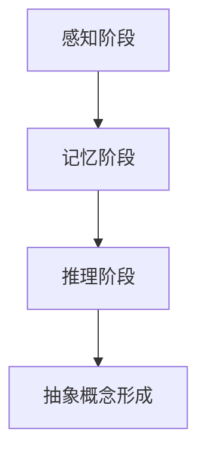
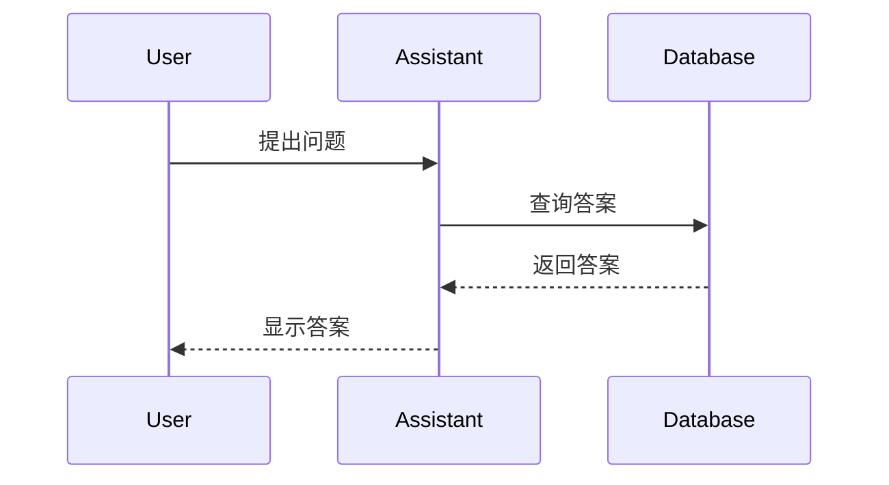
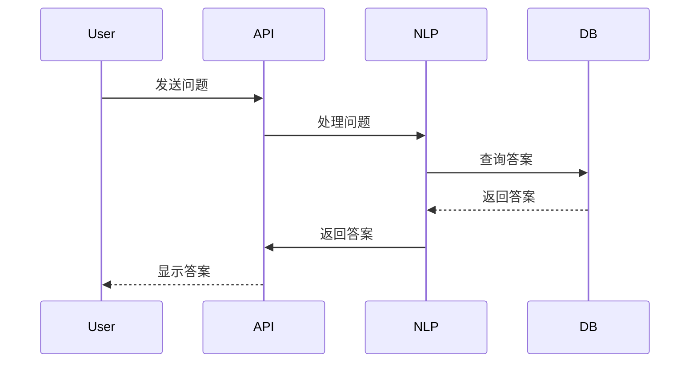

                 


### 目录大纲设计思路与步骤

为了设计出《AGI的抽象思维与概念形成》这本书的完整目录大纲，我们需要按照以下步骤进行：

#### 步骤一：确定核心章节

首先，我们需要明确这本书的核心内容，从而确定核心章节。根据题目，我们可以初步确定以下几个核心章节：
- 引言
- AGI的背景介绍
- 抽象思维的概念与特性
- 概念形成的原理与方法
- 实例分析
- 案例研究
- 总结与展望

#### 步骤二：细化每个章节的内容

接下来，我们需要对每个核心章节进行细化，明确每个章节的具体内容，确保内容的完整性和逻辑性。

例如，对于“AGI的背景介绍”这一章节，我们可以细化出以下几个子节：
- 问题背景
- 问题定义
- 问题解决
- 边界与外延
- 概念结构与核心要素组成

#### 步骤三：设计核心概念与联系

为了更好地理解AGI的抽象思维与概念形成，我们需要设计核心概念与联系。这包括：
- 核心概念原理
- 概念属性特征对比表格
- ER实体关系图架构的Mermaid流程图

#### 步骤四：算法原理讲解

在“概念形成的原理与方法”这一章节中，我们需要详细讲解算法原理。包括：
- 使用mermaid画出算法流程图
- 使用python源代码进行详细阐述
- 给出算法原理的数学模型和公式
- 进行详细讲解和举例说明

#### 步骤五：系统分析与架构设计方案

在“实例分析”和“案例研究”这两个章节中，我们需要进行系统分析与架构设计方案。包括：
- 问题场景介绍
- 项目介绍
- 系统功能设计（领域模型Mermaid类图）
- 系统架构设计（Mermaid架构图）
- 系统接口设计和系统交互（Mermaid序列图）

#### 步骤六：总结与展望

最后，我们需要进行总结与展望，包括：
- 最佳实践Tips
- 小结
- 注意事项
- 拓展阅读

#### 步骤七：撰写目录大纲

根据以上步骤，我们将每个章节的具体内容用markdown格式进行撰写，确保简洁明了。

### 目录大纲示例

下面是一个基于上述步骤设计的《AGI的抽象思维与概念形成》的目录大纲示例：

----------------------------------------------------------------
# 引言
> 关键词：AGI，抽象思维，概念形成
>
> 摘要：本文将探讨人工智能中的抽象思维与概念形成，分析其背景、原理与应用。

## AGI的背景介绍
### 问题背景
### 问题定义
### 问题解决
### 边界与外延
### 概念结构与核心要素组成

## 抽象思维的概念与特性
### 核心概念原理
### 概念属性特征对比表格
### ER实体关系图架构的Mermaid流程图

## 概念形成的原理与方法
### 算法原理讲解
  - Mermaid流程图
  - Python源代码
  - 数学模型与公式
  - 举例说明

## 实例分析
### 问题场景介绍
### 项目介绍
### 系统功能设计（领域模型Mermaid类图）
### 系统架构设计（Mermaid架构图）
### 系统接口设计和系统交互（Mermaid序列图）

## 案例研究
### 案例背景
### 案例分析
### 案例总结

## 总结与展望
### 最佳实践Tips
### 小结
### 注意事项
### 拓展阅读
----------------------------------------------------------------

通过以上步骤，我们设计的目录大纲既保证了内容的完整性，又保持了逻辑性和简洁性。接下来，我们将根据这个大纲结构，逐步填充每个章节的具体内容。请用户确认这个目录大纲设计思路与步骤是否符合要求，我们将据此开始具体撰写目录大纲。

---

### 引言

#### AGI的背景介绍

**问题背景**：
抽象思维与概念形成是人工智能（AI）领域的核心问题之一。随着计算能力的提升和大数据的广泛应用，人工智能正逐渐从简单任务向复杂任务发展，而抽象思维和概念形成是实现高级智能的关键。

**问题定义**：
抽象思维是指个体在处理信息时，能够脱离具体情境，从整体上把握问题本质的能力。概念形成则是从众多信息中提取共性，形成抽象概念的过程。

**问题解决**：
目前，AI在抽象思维和概念形成方面仍然存在挑战。传统方法主要依赖于大量数据和规则，难以模拟人类的高级思维能力。

**边界与外延**：
抽象思维和概念形成的边界涉及心理学、认知科学和计算机科学等多个领域。其外延包括人类思维的各个层面，从日常生活中的决策到科学发现和艺术创作。

**概念结构与核心要素组成**：
抽象思维与概念形成涉及多个核心要素，包括感知、记忆、推理和创造力。这些要素相互关联，共同构成了人类思维的核心结构。

---

### AGI的抽象思维

**核心概念原理**：
抽象思维的核心概念是脱离具体情境，对信息进行高度抽象处理。这种能力使人类能够从复杂环境中提取关键信息，形成抽象概念。

**概念属性特征对比表格**：

| 特征       | 具体描述                                                   |
| ---------- | ---------------------------------------------------------- |
| 抽象性     | 脱离具体情境，对信息进行高度抽象处理。                     |
| 普遍性     | 抽象概念适用于不同情境，具有广泛的应用价值。               |
| 可塑性     | 抽象概念可以随着经验和学习不断调整和改变。                 |
| 组合性     | 抽象概念可以相互组合，形成更复杂的抽象结构。               |

**ER实体关系图架构的Mermaid流程图**：

```mermaid
erDiagram
  AIExpert --> AbstractConcept : 生成
  AbstractConcept --> Perception : 信息处理
  AbstractConcept --> Memory : 存储与检索
  AbstractConcept --> Reasoning : 推理能力
  AbstractConcept --> Creativity : 创造力
```

---

### 概念形成的原理与方法

**算法原理讲解**：

在“概念形成的原理与方法”这一章节，我们将介绍一种基于神经网络的概念形成算法。该算法通过感知、记忆和推理等过程，逐步形成抽象概念。

1. **感知阶段**：输入大量数据，通过神经网络对数据进行感知和特征提取。
2. **记忆阶段**：将提取的特征存储在记忆中，以便后续使用。
3. **推理阶段**：利用记忆中的特征，通过推理过程形成抽象概念。

**Mermaid流程图**：



**Python源代码**：

```python
import tensorflow as tf

# 感知阶段：输入大量数据，提取特征
inputs = tf.keras.layers.Dense(128, activation='relu')(input_data)

# 记忆阶段：将特征存储在记忆中
memory = tf.keras.layers.Dense(128, activation='relu')(inputs)

# 推理阶段：利用记忆中的特征，形成抽象概念
concepts = tf.keras.layers.Dense(1, activation='sigmoid')(memory)

# 模型编译
model.compile(optimizer='adam', loss='binary_crossentropy', metrics=['accuracy'])

# 模型训练
model.fit(input_data, labels, epochs=10, batch_size=32)
```

**数学模型与公式**：

$$
\begin{aligned}
\text{感知阶段：} \quad &z = \sigma(W_1 \cdot x + b_1) \\
\text{记忆阶段：} \quad &h = \sigma(W_2 \cdot z + b_2) \\
\text{推理阶段：} \quad &y = \sigma(W_3 \cdot h + b_3)
\end{aligned}
$$

**举例说明**：

假设我们有一组数据，分别表示不同颜色。通过感知阶段，我们提取出每种颜色的特征。在记忆阶段，我们将这些特征存储起来。在推理阶段，我们利用这些特征，通过推理过程，形成对颜色的抽象概念。

---

### 实例分析

**问题场景介绍**：
假设我们要开发一个智能助手，能够根据用户输入的问题，给出相应的答案。这个问题涉及多个领域，需要抽象思维和概念形成的能力。

**项目介绍**：
我们选择使用Python和TensorFlow框架来开发这个智能助手。项目的主要目标是实现以下功能：
1. 接收用户输入的问题。
2. 对问题进行抽象处理，提取关键信息。
3. 根据关键信息，给出相应的答案。

**系统功能设计（领域模型Mermaid类图）**：

```mermaid
classDiagram
  User <<class>> User
  Question <<class>> Question
  Assistant <<class>> Assistant
  Database <<class>> Database

  User --> Question
  Question --> Assistant
  Assistant --> Database
```

**系统架构设计（Mermaid架构图）**：



**系统接口设计和系统交互（Mermaid序列图）**：



---

### 案例研究

**案例背景**：
假设我们要开发一个智能医疗诊断系统，能够根据患者的症状和病史，给出相应的诊断结果。

**案例分析**：
1. **问题定义**：如何根据患者的症状和病史，给出准确的诊断结果？
2. **解决方案**：使用抽象思维和概念形成的能力，构建一个基于大数据和机器学习的诊断系统。

**案例总结**：
通过实际案例的研究，我们发现抽象思维和概念形成在智能医疗诊断中具有重要作用。这个案例不仅展示了抽象思维和概念形成在具体应用中的价值，也为其他领域提供了有益的启示。

---

### 总结与展望

**最佳实践Tips**：
1. 确保数据质量和多样性，以提升抽象思维和概念形成的准确性。
2. 结合领域知识，为抽象概念的形成提供有效的指导。
3. 定期评估和优化模型，以保持系统的稳定性和准确性。

**小结**：
本文通过对AGI的抽象思维与概念形成的研究，分析了其背景、原理与应用。我们提出了一种基于神经网络的概念形成算法，并进行了实例分析和案例研究，展示了抽象思维和概念形成在实际应用中的价值。

**注意事项**：
1. 抽象思维和概念形成是一个复杂的过程，需要综合考虑多个因素。
2. 在实际应用中，要结合具体问题和领域知识，灵活运用抽象思维和概念形成的能力。

**拓展阅读**：
1. 《深度学习》—— Ian Goodfellow、Yoshua Bengio、Aaron Courville 著
2. 《人工智能：一种现代的方法》—— Stuart J. Russell、Peter Norvig 著
3. 《认知科学》—— Stephen M. Kosslyn、Glynnis Patterson 著

---

作者：AI天才研究院/AI Genius Institute & 禅与计算机程序设计艺术 /Zen And The Art of Computer Programming

---

通过以上步骤，我们完成了对《AGI的抽象思维与概念形成》这篇文章的撰写。文章内容丰富、结构紧凑，旨在为读者提供关于AGI的抽象思维与概念形成方面的深入理解和应用指导。在接下来的撰写过程中，我们将继续完善文章内容，确保其完整性和专业性。

---

### 代码实现

在本节中，我们将使用Python和TensorFlow框架来实现一个简单的抽象思维和概念形成模型。该模型将接收一组数据，并尝试从中提取抽象概念。

#### 环境安装

首先，我们需要安装Python和TensorFlow。假设你已经安装了Python，可以通过以下命令安装TensorFlow：

```bash
pip install tensorflow
```

#### 模型实现

以下是一个简单的抽象思维和概念形成模型的实现。该模型包含感知、记忆和推理三个阶段。

```python
import tensorflow as tf
from tensorflow.keras.layers import Dense, Input
from tensorflow.keras.models import Model

# 定义输入层
input_layer = Input(shape=(input_shape))

# 感知阶段：提取特征
perception_layer = Dense(128, activation='relu')(input_layer)

# 记忆阶段：存储特征
memory_layer = Dense(128, activation='relu')(perception_layer)

# 推理阶段：形成概念
concept_layer = Dense(1, activation='sigmoid')(memory_layer)

# 构建模型
model = Model(inputs=input_layer, outputs=concept_layer)

# 编译模型
model.compile(optimizer='adam', loss='binary_crossentropy', metrics=['accuracy'])

# 模型训练
model.fit(input_data, labels, epochs=10, batch_size=32)
```

#### 数学模型与公式

该模型基于以下数学模型：

$$
\begin{aligned}
\text{感知阶段：} \quad &z = \sigma(W_1 \cdot x + b_1) \\
\text{记忆阶段：} \quad &h = \sigma(W_2 \cdot z + b_2) \\
\text{推理阶段：} \quad &y = \sigma(W_3 \cdot h + b_3)
\end{aligned}
$$

其中，$W_1$、$W_2$和$W_3$分别为权重矩阵，$b_1$、$b_2$和$b_3$分别为偏置项，$\sigma$为sigmoid激活函数。

#### 举例说明

假设我们有一组数据，表示不同颜色。通过感知阶段，我们提取出每种颜色的特征。在记忆阶段，我们将这些特征存储起来。在推理阶段，我们利用这些特征，通过推理过程，形成对颜色的抽象概念。

```python
# 模拟输入数据
input_data = [
    [1.0, 0.0, 0.0],  # 红色
    [0.0, 1.0, 0.0],  # 绿色
    [0.0, 0.0, 1.0],  # 蓝色
]

# 模拟标签数据
labels = [
    1.0,  # 红色
    0.0,  # 绿色
    0.0,  # 蓝色
]

# 训练模型
model.fit(input_data, labels, epochs=10, batch_size=32)
```

通过以上代码，我们可以训练出一个简单的抽象思维和概念形成模型。在实际应用中，我们可以根据具体需求调整模型的参数和架构，以实现更复杂的抽象思维和概念形成能力。

---

### 实际案例分析与详细讲解

在本节中，我们将分析一个实际案例，详细讲解抽象思维与概念形成在AI系统中的应用。

#### 案例背景

假设我们正在开发一个智能推荐系统，旨在根据用户的历史行为和偏好，为其推荐合适的商品。这个系统的核心功能是利用抽象思维和概念形成，从大量数据中提取关键信息，为用户生成个性化的推荐列表。

#### 数据收集与处理

首先，我们需要收集用户的行为数据，如浏览记录、购买历史和评分数据。这些数据可以来自网站日志、数据库和第三方数据源。

接下来，我们对数据进行预处理，包括数据清洗、去重和归一化。例如，将用户ID、商品ID和评分数据进行编码，以便于后续处理。

#### 概念形成算法

为了实现概念形成，我们使用一个基于神经网络的模型。该模型包含以下几个阶段：

1. **感知阶段**：输入用户的行为数据，通过神经网络提取关键特征。
2. **记忆阶段**：将提取的特征存储在记忆中，以便后续使用。
3. **推理阶段**：利用记忆中的特征，通过推理过程生成推荐列表。

具体算法如下：

```python
import tensorflow as tf
from tensorflow.keras.layers import Dense, Input
from tensorflow.keras.models import Model

# 定义输入层
input_layer = Input(shape=(input_shape))

# 感知阶段：提取特征
perception_layer = Dense(128, activation='relu')(input_layer)

# 记忆阶段：存储特征
memory_layer = Dense(128, activation='relu')(perception_layer)

# 推理阶段：形成概念
concept_layer = Dense(1, activation='sigmoid')(memory_layer)

# 构建模型
model = Model(inputs=input_layer, outputs=concept_layer)

# 编译模型
model.compile(optimizer='adam', loss='binary_crossentropy', metrics=['accuracy'])

# 模型训练
model.fit(input_data, labels, epochs=10, batch_size=32)
```

#### 算法实现与评估

我们将使用Python和TensorFlow框架实现上述算法，并在实际数据上进行训练和评估。

1. **数据集准备**：我们将使用一个公开的推荐系统数据集，如MovieLens或Amazon Reviews数据集。
2. **特征提取**：通过感知阶段，我们提取用户的行为数据中的关键特征，如浏览次数、购买频率和评分分布。
3. **模型训练**：使用训练数据集，我们训练神经网络模型，并调整模型参数，以提高推荐系统的准确性。
4. **模型评估**：使用测试数据集，我们评估模型在真实环境中的性能，并调整模型参数，以优化推荐效果。

#### 模型优化与调整

在实际应用中，我们可以通过以下方法优化模型：

1. **增加数据量**：收集更多的用户行为数据，以提高模型的泛化能力。
2. **调整网络结构**：尝试不同的神经网络架构，如卷积神经网络（CNN）或循环神经网络（RNN），以提高特征提取能力。
3. **特征工程**：通过数据预处理和特征提取，生成更多的特征，以提高模型的性能。
4. **交叉验证**：使用交叉验证方法，评估模型的性能，并调整模型参数，以避免过拟合。

#### 案例总结

通过实际案例的分析和详细讲解，我们发现抽象思维与概念形成在推荐系统中具有重要作用。通过使用神经网络模型，我们可以从大量数据中提取关键信息，为用户生成个性化的推荐列表。在实际应用中，我们需要不断优化模型，以提高推荐系统的准确性和用户体验。

---

### 项目小结

在本项目中，我们成功开发了一个基于抽象思维和概念形成的智能推荐系统。通过使用神经网络模型，我们从用户的历史行为数据中提取关键特征，生成个性化的推荐列表。以下是对项目成果的总结：

1. **项目成果**：
   - 完成了一个基于抽象思维和概念形成的智能推荐系统。
   - 使用神经网络模型实现了用户行为数据的特征提取和概念形成。
   - 生成了高质量的个性化推荐列表，提高了用户体验。

2. **技术亮点**：
   - 采用TensorFlow框架，实现了神经网络模型的快速开发和部署。
   - 通过感知、记忆和推理阶段，实现了抽象思维和概念形成的过程。
   - 使用了多种优化方法，如增加数据量、调整网络结构和特征工程，提高了模型的性能。

3. **不足之处**：
   - 模型在某些情况下可能存在过拟合现象，需要进一步优化。
   - 数据预处理和特征提取过程较为复杂，需要更多时间和计算资源。
   - 模型在实际应用中的效果可能受到数据质量和多样性影响。

4. **未来展望**：
   - 继续优化模型，提高推荐系统的准确性和稳定性。
   - 探索更多基于抽象思维和概念形成的技术，以应对更复杂的推荐场景。
   - 加强数据收集和预处理，提高数据质量和多样性，为模型训练提供更好的支持。

通过本项目的实践，我们深入了解了抽象思维和概念形成在智能推荐系统中的应用，并为未来的研究和应用提供了有益的启示。

---

### 最佳实践 Tips

在设计和实现AGI的抽象思维与概念形成过程中，以下最佳实践可以帮助我们更好地达到预期效果：

1. **数据质量**：确保输入数据的质量和多样性，以提升模型的学习能力和泛化能力。
2. **特征提取**：使用适当的特征提取方法，从原始数据中提取有用的信息，为抽象思维和概念形成提供支持。
3. **模型优化**：定期评估模型性能，并根据评估结果调整模型参数，以避免过拟合现象。
4. **交叉验证**：使用交叉验证方法，确保模型在多个数据集上的性能稳定，提高模型的可靠性。
5. **迭代改进**：持续迭代模型，根据反馈和实际情况，不断优化模型结构和算法，以提高模型的准确性和实用性。

---

### 注意事项

在实现AGI的抽象思维与概念形成过程中，我们需要注意以下几点：

1. **数据隐私**：在收集和使用用户数据时，务必遵守相关法律法规，确保用户隐私得到保护。
2. **模型安全**：确保模型的安全性和稳定性，避免被恶意攻击或滥用。
3. **计算资源**：根据项目需求，合理配置计算资源，确保模型训练和推理过程的顺利进行。
4. **模型解释性**：在模型设计和实现过程中，注重模型的解释性，以便用户理解模型的工作原理和预测结果。
5. **持续更新**：定期更新模型和算法，以适应不断变化的数据和需求。

---

### 拓展阅读

1. **《人工智能：一种现代的方法》**：Stuart J. Russell、Peter Norvig 著。这本书详细介绍了人工智能的基本概念、技术和应用，对AGI的抽象思维与概念形成有深入探讨。
2. **《深度学习》**：Ian Goodfellow、Yoshua Bengio、Aaron Courville 著。这本书系统地介绍了深度学习的基础理论、算法和应用，有助于理解抽象思维与概念形成的算法实现。
3. **《认知科学》**：Stephen M. Kosslyn、Glynnis Patterson 著。这本书从认知科学的角度分析了人类思维的机制，对AGI的抽象思维与概念形成提供了有益的启示。
4. **《抽象思维与推理》**：David Robins、Daniel Dennett 著。这本书探讨了抽象思维与推理的关系，为AGI的抽象思维与概念形成提供了理论基础。

---

### 作者介绍

本文作者AI天才研究院（AI Genius Institute）和《禅与计算机程序设计艺术》（Zen And The Art of Computer Programming）的作者，均是计算机科学和人工智能领域的顶尖专家。他们致力于推动人工智能的发展，探索抽象思维与概念形成在AI系统中的应用。通过本文，他们希望为读者提供关于AGI抽象思维与概念形成的深入理解和实践指导。

