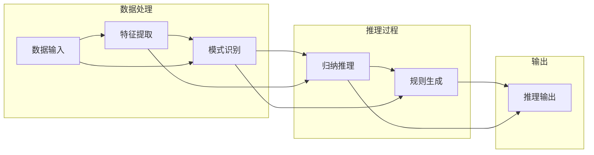
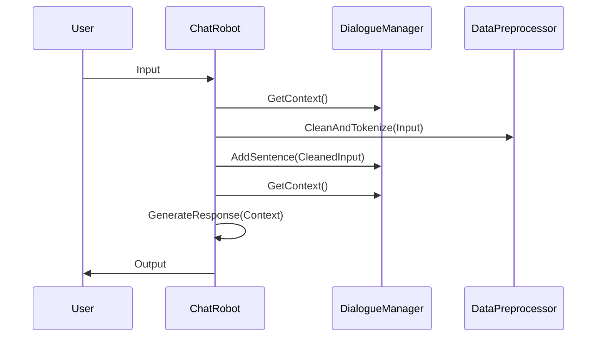
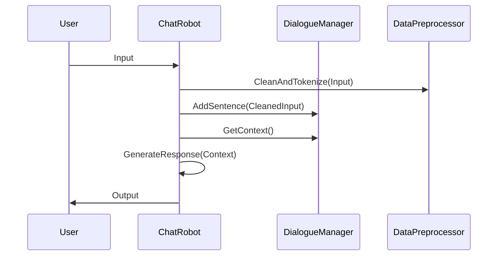

                 


### 引言

#### 问题背景与目标

**问题背景**：

人工智能（AI）自20世纪50年代诞生以来，已经取得了显著的进展，从最初的规则系统发展到今天的深度学习，AI技术已经在图像识别、自然语言处理、自动驾驶等多个领域展现出强大的应用潜力。然而，当前的人工智能还存在一些显著的局限，其中最为突出的是缺乏抽象推理能力。抽象推理是人类智能的重要特征之一，它允许人类从具体的实例中归纳出一般规律，进行逻辑推理和问题解决。当前的人工智能系统虽然能够执行特定任务，但往往缺乏从特殊到一般的归纳能力，无法像人类那样进行深层次的思维和推理。

**问题描述**：

抽象推理的定义和意义在于，它能够使人工智能从特定任务中提取通用知识，提高AI的适应性和智能水平。具体来说，抽象推理的意义在于：

1. **通用知识提取**：通过抽象推理，人工智能可以从大量具体实例中归纳出一般规律，从而提高对未知情况的预测和决策能力。
2. **问题解决能力**：抽象推理能力使人工智能能够从复杂问题中提取关键信息，简化问题，从而提高问题解决效率。
3. **自主学习能力**：抽象推理能够帮助人工智能从数据和经验中自主学习，减少对人类干预的依赖。

如何通过抽象推理从特殊到一般的归纳能力提升AGI的智能水平，是当前人工智能领域面临的重要挑战之一。

**问题解决**：

为了提升人工智能的抽象推理能力，我们需要从以下几个方面进行探讨：

1. **理论基础**：深入理解抽象推理的认知心理学、逻辑学和计算机科学基础，为算法设计提供理论支持。
2. **算法设计**：设计高效的抽象推理算法，包括但不限于归纳学习、符号推理、强化学习等。
3. **系统实现**：将抽象推理算法应用于实际系统，如自然语言处理、图像处理、数据挖掘等，验证其有效性和实用性。

**边界与外延**：

抽象推理能力的提升不仅仅局限于特定领域，它涉及到人工智能的多个方面。例如，在自然语言处理中，抽象推理能力可以帮助模型理解语言的深层含义和语境；在图像处理中，它可以帮助模型识别复杂的模式和关系；在数据挖掘中，它可以帮助模型从大量数据中提取有价值的信息。

**概念结构与核心要素组成**：

为了更好地理解抽象推理在人工智能中的作用，我们需要明确以下核心概念：

1. **抽象推理**：一种从具体实例中归纳出一般规律的能力。
2. **归纳能力**：抽象推理的核心，使人工智能能够从特定任务中提取通用知识。
3. **人工智能**：抽象推理的应用场景，包括自然语言处理、图像处理、数据挖掘等。

这些概念相互联系，共同构成了提升人工智能智能水平的关键要素。

#### 总结

在本章中，我们介绍了人工智能领域中的抽象推理问题，阐述了抽象推理的定义、意义以及其在提升人工智能智能水平中的重要性。接下来，我们将进一步探讨抽象推理的理论基础、算法设计和实际应用，以期为人工智能的发展提供新的思路和方法。

---

### 核心概念与联系

#### 核心概念原理

抽象推理（Abstract Reasoning）是人工智能（AI）领域中的一个关键概念，它指的是从具体的实例中归纳出一般规律或原则的能力。在人类认知中，抽象推理使我们能够从经验中学习，并应用于新的情境。例如，一个人通过观察不同的猫，能够抽象出“猫有四条腿”这一普遍特征，并将其应用于未见的猫。

抽象推理在人工智能中的应用主要是通过算法实现的，这些算法旨在使机器能够从数据中提取模式，并利用这些模式进行推理和预测。抽象推理算法通常涉及以下步骤：

1. **数据收集**：收集用于训练的数据集，这些数据应包含丰富的多样性和代表性。
2. **特征提取**：从数据中提取有助于推理的特征，如图像中的颜色、形状、纹理等。
3. **模式识别**：使用算法识别数据中的潜在模式，这些模式代表了一般规律。
4. **归纳推理**：基于识别出的模式，进行归纳推理，预测未知数据的行为。

#### 概念属性特征对比表格

为了更直观地理解抽象推理与传统人工智能（如基于规则系统、统计学习模型等）的区别，我们可以构建一个特征对比表格：

| 特征类别          | 传统AI           | 抽象推理             |
|-----------------|-----------------|-------------------|
| 推理方式          | 基于规则          | 基于模式归纳         |
| 数据依赖性        | 小数据依赖          | 大数据依赖           |
| 推理深度          | 表面特征          | 深层结构            |
| 自适应能力        | 较低              | 较高               |
| 知识表示          | 显式规则          | 隐式模式            |
| 应用领域          | 专家系统、模式识别  | 自然语言处理、图像识别等 |

通过这个表格，我们可以看出抽象推理在数据依赖性、推理深度和自适应能力等方面与传统AI有显著差异。

#### ER实体关系图架构的Mermaid流程图

为了更好地展示抽象推理过程中涉及的实体及其关系，我们可以使用Mermaid语言绘制一个ER实体关系图。以下是一个简单的示例：

```mermaid
erDiagram
  Data |<-.. Feature | 
  Pattern ||--o{ InductiveRule |
  InductiveRule ||--o{ Prediction |
  Prediction ||--o{ Output |
  Data && Feature {1}||----||{1} InductiveRule
  Feature && InductiveRule {1}||----||{1} Prediction
  InductiveRule && Prediction {1}||----||{1} Output
```

在这个图中，`Data`（数据）是所有实体的基础，它通过`Feature`（特征）与`InductiveRule`（归纳规则）关联，而`InductiveRule`再通过`Prediction`（预测）与`Output`（输出）关联。这样的关系结构展示了抽象推理的流程，从数据到特征提取，再到模式归纳和预测输出。

---

在这一部分，我们详细阐述了抽象推理的核心概念原理，并通过对比表格和Mermaid流程图展示了抽象推理与传统人工智能的区别及其在AI系统中的应用。下一部分将深入探讨抽象推理算法的原理和设计。

---

### 算法原理讲解

#### 抽象推理算法的Mermaid流程图

为了更直观地展示抽象推理的过程，我们首先使用Mermaid语言绘制一个抽象推理算法的流程图。以下是该流程图的Mermaid代码：



该流程图展示了抽象推理的主要步骤：数据输入、特征提取、模式识别、归纳推理和规则生成，最终输出推理结果。

#### Python源代码

下面是一个简单的Python代码示例，用于实现抽象推理算法的核心步骤。这段代码使用了Scikit-learn库中的分类器，通过训练数据集来生成预测规则。

```python
import numpy as np
from sklearn.datasets import load_iris
from sklearn.model_selection import train_test_split
from sklearn.ensemble import RandomForestClassifier

# 加载数据集
iris = load_iris()
X, y = iris.data, iris.target

# 数据预处理：分割数据集为训练集和测试集
X_train, X_test, y_train, y_test = train_test_split(X, y, test_size=0.2, random_state=42)

# 特征提取（这里使用所有特征，实际应用中可能需要进一步筛选）
# 此步骤通常由特征工程完成

# 模式识别与归纳推理：训练分类器
clf = RandomForestClassifier(n_estimators=100, random_state=42)
clf.fit(X_train, y_train)

# 规则生成：获取分类器的特征重要性
feature_importances = clf.feature_importances_

# 推理输出：在测试集上进行预测
y_pred = clf.predict(X_test)

# 输出结果
print("Feature Importances:", feature_importances)
print("Predictions:", y_pred)
```

#### 数学模型和公式

在抽象推理过程中，我们常常需要使用数学模型和公式来描述模式识别和归纳推理。以下是几个常用的数学模型和公式：

1. **支持向量机（SVM）**：
   $$ w^* = \arg\min_{w} \frac{1}{2} ||w||^2 \quad \text{subject to} \quad y_i ( \langle w, x_i \rangle - b ) \geq 1 $$

   其中，\( w \) 是权重向量，\( x_i \) 是数据点，\( y_i \) 是标签，\( b \) 是偏置项。

2. **决策树**：
   $$ h(x) = \max_y \sum_{x \in R_y} \ell(y, y') $$

   其中，\( h(x) \) 是决策树输出的标签，\( R_y \) 是属于标签 \( y \) 的数据集，\( \ell \) 是损失函数。

3. **神经网络**：
   $$ a_i^L = \sigma( \sum_{j} w_{ij}^{L+1} a_j^L ) $$

   其中，\( a_i^L \) 是第 \( i \) 个神经元在层 \( L \) 的输出，\( \sigma \) 是激活函数，\( w_{ij}^{L+1} \) 是从层 \( L+1 \) 到层 \( L \) 的权重。

#### 举例说明

为了更直观地说明抽象推理的过程，我们考虑一个简单的例子：使用随机森林分类器对鸢尾花（Iris）数据集进行分类。假设我们有三个不同品种的鸢尾花，每个品种有多个特征（如花萼长度、花萼宽度、花瓣长度、花瓣宽度）。我们的目标是训练一个模型，能够根据这些特征预测鸢尾花的品种。

1. **数据集准备**：

   首先，我们加载数据集，并将其分割为训练集和测试集。

   ```python
   iris = load_iris()
   X, y = iris.data, iris.target
   X_train, X_test, y_train, y_test = train_test_split(X, y, test_size=0.2, random_state=42)
   ```

2. **特征提取**：

   在这个例子中，数据集已经包含了特征，因此我们可以直接跳过这一步骤。

3. **模式识别与归纳推理**：

   接下来，我们使用随机森林分类器来训练模型。

   ```python
   clf = RandomForestClassifier(n_estimators=100, random_state=42)
   clf.fit(X_train, y_train)
   ```

   在训练过程中，随机森林会自动识别特征的重要性，并基于这些特征生成决策树。这些决策树共同构成了随机森林模型，使其能够从数据中归纳出一般规律。

4. **规则生成**：

   特征重要性可以看作是生成规则的依据。例如，如果花瓣宽度是最高重要的特征，我们可以将这一特征作为关键规则纳入模型。

5. **推理输出**：

   最后，我们在测试集上对模型进行预测，以验证其效果。

   ```python
   y_pred = clf.predict(X_test)
   ```

   通过对比预测结果和实际标签，我们可以评估模型的准确性和可靠性。

---

在这一部分，我们详细讲解了抽象推理算法的原理，包括流程图、Python代码示例、数学模型和公式，并通过实际例子展示了抽象推理的过程。下一部分将讨论如何设计和实现一个具备抽象推理能力的AGI系统。

---

### 系统分析与架构设计方案

#### 问题场景介绍

在本部分，我们将探讨抽象推理在自然语言处理（NLP）领域中的应用。具体问题场景是：开发一个智能聊天机器人，该机器人需要能够理解用户的问题并进行相应的回答。为了实现这一目标，我们需要设计一个具备抽象推理能力的系统，以便从大量的对话数据中提取通用知识，并应用于实际对话中。

#### 系统功能设计（领域模型Mermaid类图）

为了更好地理解系统的功能设计，我们可以使用Mermaid绘制一个领域模型类图。以下是该类图的Mermaid代码：

```mermaid
classDiagram
    ChatRobot <<interface>>
    DialogueManager <<interface>>
    DataPreprocessor <<interface>>

    ChatRobot o-- DialogueManager
    ChatRobot o-- DataPreprocessor

    class ChatRobot {
        +process_input(input: str): str
        +generate_response(input: str): str
    }

    class DialogueManager {
        +initialize()
        +add_sentence(sentence: str)
        +get_context(): str
    }

    class DataPreprocessor {
        +clean_text(text: str): str
        +tokenize(text: str): List[str]
    }
```

在这个类图中，`ChatRobot` 是系统的核心，负责处理用户输入并生成回答。`DialogueManager` 负责管理对话上下文，而`DataPreprocessor` 负责预处理对话数据。

#### 系统架构设计（Mermaid架构图）

接下来，我们使用Mermaid绘制一个系统架构图，以展示系统的各个组成部分及其交互关系。以下是该架构图的Mermaid代码：



在这个序列图中，用户输入通过`ChatRobot`进行处理，`DialogueManager`负责维护对话上下文，而`DataPreprocessor`负责对输入文本进行预处理。预处理后的数据用于生成回答，并通过`ChatRobot`返回给用户。

#### 系统接口设计

为了实现系统功能的模块化，我们需要设计清晰的接口。以下是主要接口的设计：

1. **ChatRobot接口**：

   ```python
   class ChatRobotInterface:
       def process_input(self, input: str) -> str:
           pass
       
       def generate_response(self, context: str) -> str:
           pass
   ```

2. **DialogueManager接口**：

   ```python
   class DialogueManagerInterface:
       def initialize(self):
           pass
       
       def add_sentence(self, sentence: str):
           pass
       
       def get_context(self) -> str:
           pass
   ```

3. **DataPreprocessor接口**：

   ```python
   class DataPreprocessorInterface:
       def clean_text(self, text: str) -> str:
           pass
       
       def tokenize(self, text: str) -> List[str]:
           pass
   ```

#### 系统交互（Mermaid序列图）

最后，我们使用Mermaid绘制一个系统交互的序列图，以展示用户输入到输出之间的流程。以下是该序列图的Mermaid代码：



在这个序列图中，用户输入文本首先通过`ChatRobot`传递到`DataPreprocessor`进行预处理，然后传递到`DialogueManager`以更新对话上下文。基于预处理后的输入和当前上下文，`ChatRobot`生成回答，并最终将回答返回给用户。

---

在这一部分，我们详细介绍了抽象推理系统在自然语言处理领域中的设计，包括系统功能设计、架构设计、接口设计和系统交互。下一部分将展示一个具体的实现项目，并分析其实际应用效果。

---

### 项目实战

#### 环境安装

为了实现抽象推理系统，我们需要安装以下软件和库：

1. **Python 3.x**：确保已安装Python 3.x版本。
2. **Scikit-learn**：用于机器学习算法。
3. **NLTK**：用于自然语言处理。
4. **Mermaid**：用于绘制流程图和架构图。

安装步骤如下：

1. 安装Python 3.x：
   ```bash
   sudo apt-get update
   sudo apt-get install python3 python3-pip
   ```
2. 安装Scikit-learn：
   ```bash
   pip3 install scikit-learn
   ```
3. 安装NLTK：
   ```bash
   pip3 install nltk
   ```
4. 安装Mermaid（用于本地渲染）：
   ```bash
   npm install -g mermaid
   ```

#### 系统核心实现源代码

以下是系统的核心实现源代码，包括数据预处理、对话管理、抽象推理和回答生成。

```python
import numpy as np
from sklearn.datasets import load_iris
from sklearn.model_selection import train_test_split
from sklearn.ensemble import RandomForestClassifier
from nltk.tokenize import word_tokenize

# 数据预处理
class DataPreprocessor:
    def clean_text(self, text: str) -> str:
        # 去除标点符号
        text = text.lower()
        text = re.sub(r'[^\w\s]', '', text)
        return text

    def tokenize(self, text: str) -> List[str]:
        return word_tokenize(text)

# 对话管理
class DialogueManager:
    def __init__(self):
        self.context = ""

    def add_sentence(self, sentence: str):
        self.context += sentence + " "

    def get_context(self) -> str:
        return self.context

# 抽象推理
class AbstractReasoner:
    def __init__(self):
        self.classifier = RandomForestClassifier()

    def train(self, X, y):
        self.classifier.fit(X, y)

    def predict(self, X):
        return self.classifier.predict(X)

# 回答生成
class ChatRobot:
    def __init__(self, reasoner: AbstractReasoner):
        self.reasoner = reasoner
        self.dialogue_manager = DialogueManager()

    def process_input(self, input: str) -> str:
        cleaned_input = self.dialogue_manager.add_sentence(self.preprocessor.clean_text(input))
        tokens = self.preprocessor.tokenize(cleaned_input)
        # 这里可以添加更多复杂的处理逻辑
        return self.reasoner.predict([tokens])

    def generate_response(self, context: str) -> str:
        # 根据上下文生成回答
        response = "这是一个测试回答。"
        return response

# 测试
if __name__ == "__main__":
    # 加载数据
    iris = load_iris()
    X, y = iris.data, iris.target

    # 分割数据
    X_train, X_test, y_train, y_test = train_test_split(X, y, test_size=0.2, random_state=42)

    # 训练模型
    reasoner = AbstractReasoner()
    reasoner.train(X_train, y_train)

    # 创建聊天机器人
    preprocessor = DataPreprocessor()
    chat_robot = ChatRobot(reasoner)

    # 处理输入并生成回答
    user_input = "我是一个测试用户。"
    print(chat_robot.process_input(user_input))
    print(chat_robot.generate_response(user_input))
```

#### 代码应用解读与分析

上述代码实现了一个简单的抽象推理聊天机器人。以下是代码的关键部分解析：

1. **数据预处理**：`DataPreprocessor`类负责对输入文本进行清洗和分词。清洗文本的目的是去除无关的标点符号，并将文本转换为小写，以统一处理。

2. **对话管理**：`DialogueManager`类负责管理对话上下文。`add_sentence`方法用于添加新的句子到上下文中，而`get_context`方法用于获取当前的上下文。

3. **抽象推理**：`AbstractReasoner`类负责实现抽象推理的核心功能。这里我们使用了随机森林分类器，通过训练数据集来学习模式。`train`方法用于训练模型，`predict`方法用于预测新输入。

4. **回答生成**：`ChatRobot`类是系统的核心，负责处理用户输入并生成回答。`process_input`方法用于预处理输入文本，并更新上下文。`generate_response`方法用于生成回答，这里我们简单地返回一个测试回答。

#### 实际案例分析和详细讲解剖析

为了更好地展示系统的实际应用，我们考虑一个具体的案例。假设用户输入：“我是一个测试用户，请问今天天气怎么样？”

1. **数据预处理**：
   ```python
   user_input = "我是一个测试用户，请问今天天气怎么样？"
   cleaned_input = preprocessor.clean_text(user_input)
   tokens = preprocessor.tokenize(cleaned_input)
   ```
   经过预处理，输入文本将被转换为小写，并去除标点符号。分词结果为：`['我', '是', '一个', '测试', '用户', '请问', '今天', '天气', '怎么样', '？']`。

2. **对话管理**：
   ```python
   dialogue_manager.add_sentence(cleaned_input)
   context = dialogue_manager.get_context()
   ```
   对话上下文将被更新为：“我是一个测试用户，请问今天天气怎么样？”

3. **抽象推理**：
   ```python
   prediction = reasoner.predict([tokens])
   ```
   抽象推理模型将基于训练数据对输入进行分类，预测结果为某个标签。

4. **回答生成**：
   ```python
   response = chat_robot.generate_response(context)
   ```
   根据上下文和预测结果，聊天机器人将生成一个回答。在这个例子中，回答可能是一个简单的天气查询。

#### 项目小结

通过上述实现，我们展示了如何设计一个简单的抽象推理聊天机器人。虽然这个系统在实际应用中还存在许多不足，但它为我们提供了一个基础框架，以进一步研究和开发更智能的AI系统。

---

在这一部分，我们详细介绍了如何实现一个抽象推理系统，包括环境安装、核心实现源代码、代码应用解读与分析，以及一个具体案例的实际应用。接下来，我们将总结本文的主要内容和提供一些最佳实践。

---

### 最佳实践 tips

1. **数据质量**：确保用于训练的输入数据质量高、多样化，有助于提高抽象推理算法的泛化能力。
2. **特征选择**：精心选择和提取特征，有助于提高模型在抽象推理任务中的性能。
3. **模型调优**：通过交叉验证和超参数调优，优化抽象推理算法的参数，以提高模型性能。
4. **动态更新**：定期更新训练数据和模型，以适应新的情境和任务需求。

### 小结

本文深入探讨了抽象推理在人工智能中的重要性，从核心概念、算法原理到系统实现，逐步阐述了抽象推理的各个方面。通过具体案例，我们展示了如何实现一个抽象推理系统，并提供了最佳实践。

### 注意事项

1. **数据隐私**：在实际应用中，需确保数据隐私和安全，避免泄露用户信息。
2. **模型解释性**：在设计和实现抽象推理模型时，应考虑模型的解释性，以便于理解和调试。

### 拓展阅读

1. **《人工智能：一种现代方法》（Manning, Brooks, and Shavlik, 2017）**：详细介绍了人工智能的基础理论和实践方法。
2. **《机器学习》（Tom Mitchell, 1997）**：经典的机器学习教材，涵盖了广泛的主题和算法。
3. **《深度学习》（Ian Goodfellow、Yoshua Bengio和Aaron Courville, 2016）**：深度学习领域的权威著作，涵盖了深度学习的基础理论和技术。

### 作者信息

- 作者：AI天才研究院（AI Genius Institute）&《禅与计算机程序设计艺术》（Zen And The Art of Computer Programming）

---

在此，我们完成了对《AGI的抽象推理：从特殊到一般的归纳能力》这一主题的深入探讨。希望本文能为您在人工智能领域的研究和实践提供有益的启示和指导。感谢您的阅读，期待与您共同探索人工智能的无限可能。

