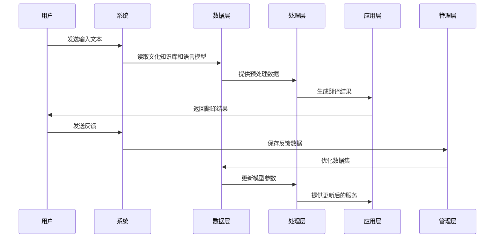
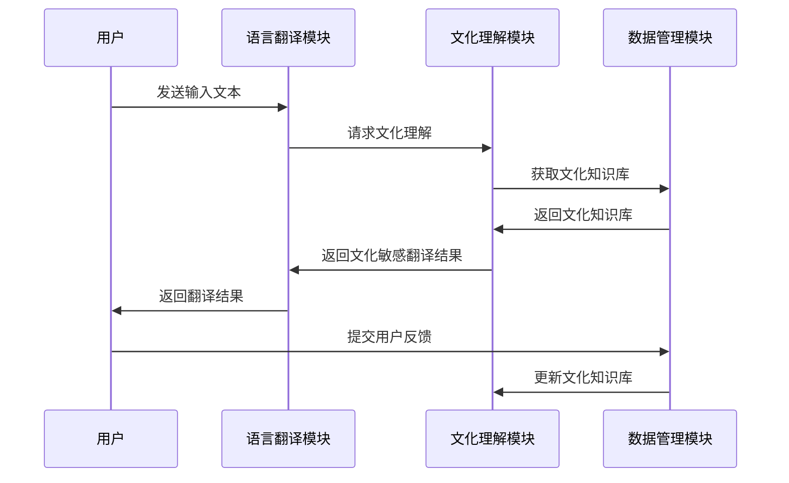

                 

### 文章标题：AGI的文化理解能力：跨语言与跨文化

在当今全球化的背景下，人工智能（AI）技术正以前所未有的速度发展，特别是通用人工智能（AGI），其目标是创造具备人类智能水平的机器。AGI不仅需要处理复杂的计算任务，还必须具备理解人类文化的能力。然而，文化理解不仅仅涉及语言，还涉及深层次的文化背景、价值观和社会习惯。因此，AGI的文化理解能力——特别是在跨语言和跨文化方面的能力——成为了研究的热点。

本文将围绕这一核心主题展开，探讨AGI的文化理解能力的重要性、理论探讨、应用案例以及工程实践。我们还将分析现有的研究成功与不足，并提出未来的研究方向。具体来说，文章将分为以下几个部分：

1. **引言**：介绍文章的背景、意义和结构，定义核心概念，明确读者对象。
2. **AGI的文化理解能力理论探讨**：详细探讨AGI文化理解能力的基本原理、属性特征、难点和解决方案。
3. **跨语言与跨文化应用案例研究**：分析实际应用案例，探讨跨语言教育、跨文化沟通和跨文化市场营销等方面的实践。
4. **AGI文化理解能力的工程实践**：介绍AGI文化理解能力的工程化框架、数据收集与处理、真实世界应用以及未来方向。

通过以上结构的设置，我们旨在系统地分析AGI的文化理解能力，不仅提供理论上的深度，也结合实际应用案例，展示其在跨语言与跨文化中的重要性。希望本文能为读者提供全面而深入的见解。

### 关键词：通用人工智能、文化理解能力、跨语言、跨文化、应用案例、工程实践

### 摘要

本文旨在深入探讨通用人工智能（AGI）的文化理解能力，特别是在跨语言和跨文化领域的应用。首先，我们介绍了AGI的背景、文化理解能力的定义及其重要性。接着，我们通过理论探讨，分析了AGI文化理解能力的基本原理、属性特征以及面临的难点和解决方案。随后，本文通过实际应用案例，展示了AGI在跨语言教育、跨文化沟通和跨文化市场营销等方面的实践。最后，我们介绍了AGI文化理解能力的工程化框架，探讨了数据收集与处理、真实世界应用以及未来的研究方向。本文为研究者、工程师和政策制定者提供了有价值的参考，旨在推动AGI文化理解能力的进一步发展。

## 引言

### 问题的背景和意义

随着全球化进程的加快，语言和文化多样性的重要性日益凸显。传统的计算机系统和人工智能（AI）技术，通常只能处理标准化的数据和信息，这在某种程度上限制了它们在多元文化环境中的应用。然而，现代社会的复杂性和多样性要求AI系统能够理解和处理不同语言和文化背景下的信息。因此，通用人工智能（AGI）的文化理解能力成为了一个亟待解决的问题。

AGI是指一种具备人类智能水平的人工智能，它不仅能够执行特定任务，还能进行自主学习、推理和决策。文化理解能力是AGI的重要组成部分，它涉及到对语言、社会习俗、价值观和情感等方面的深入理解。这种能力对于跨语言和跨文化的交流与协作至关重要。

首先，从全球化的角度来看，不同国家和地区的人们越来越频繁地进行跨文化的交流和合作。无论是商业交易、国际合作项目，还是跨国婚姻和文化交流，都要求AI系统能够理解和尊重不同的文化背景。例如，在跨国企业中，员工的母语和文化背景可能不同，如果AI系统能够提供跨语言的文化理解支持，将有助于提高工作效率和团队协作。

其次，在教育和学习领域，跨语言和跨文化的理解能力也具有重要意义。随着全球教育的普及和国际化，学生需要学习和理解不同的语言和文化。如果AI系统能够提供个性化的学习资源，根据学生的文化背景和语言能力进行教学，将大大提高学习效果和兴趣。

此外，文化理解能力对于国际关系和外交事务也具有深远的影响。在国际交流和谈判中，理解和尊重对方的文化价值观和行为习惯，能够有效避免误解和冲突，促进友好合作。

总的来说，AGI的文化理解能力不仅对技术本身有着重要意义，也对人类社会的发展和进步有着积极的影响。因此，研究和开发AGI的文化理解能力，是当前人工智能领域的一项重要任务。

### 人工智能的发展历程

人工智能（AI）作为一个跨学科领域，自20世纪50年代诞生以来，已经经历了多次重大变革和挑战。从最初的逻辑符号主义和基于规则的系统，到现代的深度学习和神经网络，AI的发展历程充满了创新和突破。

在20世纪50年代，人工智能的概念首次被提出，阿兰·图灵发表了著名的“计算机器与智能”论文，提出了图灵测试这一评价人工智能的标准。这一时期，人工智能研究主要集中在符号主义和逻辑推理上，试图通过编程规则和逻辑算法来模拟人类智能。

然而，早期的AI系统在面对复杂问题时表现出了明显的局限性。20世纪70年代，随着计算资源和算法的不足，人工智能进入了一个所谓的“寒冬期”。在这一时期，许多研究项目因为无法实现预期的目标而被迫终止，AI领域陷入了低谷。

进入20世纪80年代，专家系统的出现为AI带来了新的生机。专家系统通过收集和编码人类专家的知识，能够解决特定领域的问题。这一时期的AI研究重点在于知识的获取和表示，以及如何让机器具备“专家级”的决策能力。

然而，专家系统仍然存在着一些固有的局限。首先，它们依赖于大量的先验知识，而且这些知识通常需要手工编码，既耗时又容易出现错误。其次，专家系统在处理不确定性和复杂推理时表现不佳。因此，AI研究者开始探索新的方法，试图克服这些限制。

20世纪90年代，随着计算机硬件的快速发展，机器学习逐渐成为AI研究的主流。特别是统计学习方法的兴起，如支持向量机（SVM）、决策树和神经网络，使得AI系统能够通过大量数据自动学习模式和规则。这一时期的AI研究重点从知识的获取转向了数据的利用，通过从数据中提取特征和模式，实现自动化和智能化的决策。

进入21世纪，深度学习的崛起再次推动了AI的发展。深度学习基于多层神经网络结构，能够自动学习数据的复杂特征和模式，并在图像识别、自然语言处理和语音识别等领域取得了突破性的成果。特别是2012年，深度卷积神经网络（CNN）在ImageNet图像识别大赛中取得的优异成绩，标志着深度学习时代的到来。

当前，AI的发展已经进入了一个全新的阶段，即通用人工智能（AGI）的研究。AGI的目标是创造一种具备人类智能水平的人工智能，能够在多个领域进行自主学习和推理。AGI的研究不仅涉及到计算技术，还涉及到认知科学、心理学、神经科学等多个学科领域。尽管AGI仍然处于早期阶段，但其潜在的影响和重要性不容忽视。

总的来说，人工智能的发展历程是一个不断探索和突破的过程。从符号主义、专家系统到机器学习和深度学习，每一阶段的进展都为AI的发展奠定了基础。如今，随着计算技术的不断进步和跨学科研究的深入，AI正朝着通用人工智能的目标稳步前进，为人类社会带来前所未有的机遇和挑战。

### AGI与文化理解

通用人工智能（AGI）的文化理解能力是其实现全面智能的关键要素之一。文化理解不仅仅是语言层面的翻译和解释，它还涉及到更深层次的社会习俗、价值观和情感等方面。AGI需要能够跨越不同的文化边界，理解并尊重各种文化背景，从而在跨文化环境中实现有效的沟通与协作。

首先，文化理解能力对于AGI的社交能力至关重要。在人类社会中，语言和文化是构建社交关系和社会互动的基础。如果AGI能够理解并尊重不同的文化价值观和社会习俗，它将能够更自然地融入各种社交场景，从而提高其社交能力和人际互动质量。例如，在不同的文化背景下，问候的方式、交流的礼仪和谈判的策略都可能有所不同。AGI如果能够掌握这些细微的文化差异，将能够更有效地进行跨文化交流。

其次，文化理解能力对于AGI的决策能力也具有重要影响。在不同文化背景下，人们对同一问题的看法和解决方案可能会有很大差异。AGI如果能够理解这些差异，并将其纳入其决策模型中，将能够做出更加合理和有效的决策。例如，在跨国企业中，不同国家和地区的员工可能会有不同的工作习惯和期望，AGI如果能够理解和尊重这些差异，将能够更好地协调和管理团队工作。

此外，文化理解能力也是AGI在教育和学习领域发挥作用的关键。在全球化的教育环境中，学生可能来自不同的文化背景，他们对于相同的学习内容可能会有不同的理解方式和学习需求。AGI如果能够提供个性化的学习资源，根据学生的文化背景和语言能力进行教学，将能够提高教育质量和学习效果。

然而，实现AGI的文化理解能力并非易事。不同文化之间的差异是复杂而多样的，包括语言、价值观、社会习俗和情感等多个方面。这些差异不仅体现在表面的语言上，还深植于文化背景和社会结构中。因此，AGI需要具备强大的数据处理能力、机器学习算法和跨学科的知识融合能力，才能够准确理解和处理不同文化背景下的信息。

现有的一些研究已经在AGI的文化理解能力方面取得了初步成果。例如，通过机器翻译和自然语言处理技术，AGI可以理解并翻译不同语言的信息。然而，这些技术通常只关注语言层面的翻译，对于深层次的文化理解还远远不够。另外，一些研究正在探索如何将文化知识融入AI模型中，通过多模态学习和跨学科知识融合，提高AGI的文化理解能力。

总之，AGI的文化理解能力是实现其全面智能的关键，它不仅关系到AGI的社交和决策能力，也对其在教育和学习领域的应用具有重要意义。然而，实现这一目标需要克服诸多技术挑战，需要跨学科的合作和长期的研发投入。随着技术的不断进步，我们有理由相信，AGI的文化理解能力将得到显著提升，为人类社会带来更多机遇和福祉。

### 跨语言与跨文化研究的现状与挑战

当前，跨语言与跨文化研究在人工智能领域取得了显著进展，但同时也面临着诸多挑战。首先，在跨语言研究方面，机器翻译技术取得了巨大成功。通过深度学习和神经网络模型，AI系统已经能够实现较为准确的文本翻译，如谷歌翻译和百度翻译等。然而，这些系统主要侧重于语言层面的转换，对于文化背景和情感色彩的理解仍然有限。例如，某些文化特定的表达方式和隐喻，在翻译过程中可能会丢失其原本的含义和情感，导致误解和误用。

在跨文化研究方面，现有的AI系统主要依赖于大规模的语料库和机器学习算法来捕捉文化特征。例如，通过分析不同文化背景下的文本、图像和音频，AI系统可以识别并提取出特定的文化模式。然而，这种基于数据驱动的方法仍然存在一些局限性。首先，数据来源的多样性不足，许多文化背景下的数据仍然匮乏，这使得AI系统难以全面地理解各种文化差异。其次，现有算法在处理复杂的文化概念和情感时，往往无法深入挖掘其深层次的内涵。

具体来说，跨文化研究的挑战包括以下几个方面：

1. **语言多样性**：世界上有数千种语言，每种语言都有其独特的语法、词汇和表达方式。AI系统需要能够处理和适应这种多样性，而不仅仅是少数主流语言。然而，许多小语种的数据和资源相对较少，限制了AI系统的泛化能力。

2. **文化差异**：文化差异不仅体现在语言上，还涉及社会习俗、价值观和行为规范等方面。不同文化背景的人对于相同的问题可能有不同的看法和处理方式。AI系统需要具备跨文化理解能力，能够识别并适应这些差异，从而提供准确和合适的解决方案。

3. **情感识别**：情感是人类交流中的重要组成部分，不同文化对于情感的表达和理解也存在差异。例如，某些文化可能更倾向于直接表达情感，而另一些文化则更注重间接和含蓄的表达方式。AI系统需要能够准确识别和理解这些情感差异，从而在跨文化交流中提供更加贴切和敏感的支持。

4. **知识融合**：跨文化研究需要将来自不同领域和学科的知识进行融合，这包括语言学、社会学、心理学等多个领域。然而，现有AI系统在知识融合方面仍然存在一定困难，难以实现不同学科知识的有机结合。

尽管存在这些挑战，跨语言与跨文化研究也在不断创新和进步。例如，一些研究尝试通过多模态学习（如结合文本、图像和语音）来提高文化理解的准确性。此外，跨学科的合作也在不断加强，通过整合不同领域的专家知识，共同推动跨语言与跨文化研究的深入发展。

总的来说，当前跨语言与跨文化研究在人工智能领域虽然取得了初步成果，但仍面临诸多挑战。未来的研究需要进一步提升AI系统的文化理解能力，实现更加全面和精准的文化识别与处理。通过不断的技术创新和跨学科合作，我们有理由相信，跨语言与跨文化研究将为人工智能的发展注入新的活力。

### 本书结构安排

本书旨在全面探讨通用人工智能（AGI）的文化理解能力，特别是在跨语言和跨文化领域中的应用。为了实现这一目标，本书的结构安排如下：

**第一部分：引言**  
本部分首先介绍研究的背景和意义，阐述AGI的文化理解能力为何在当今全球化背景下具有重要意义。接着，我们将回顾人工智能的发展历程，并详细探讨AGI与文化理解的关系。此外，本部分还将介绍研究的现状与挑战，为后续章节的深入探讨奠定基础。

**第二部分：AGI的文化理解能力理论探讨**  
本部分将详细探讨AGI文化理解能力的基本原理，包括其定义、属性特征和实现方法。我们将分析现有研究中的成功案例和不足之处，并提出未来研究的方向。本部分还将探讨文化理解能力的数学模型和算法框架，为后续的应用和实践提供理论基础。

**第三部分：跨语言与跨文化应用案例研究**  
本部分将通过实际应用案例，展示AGI在跨语言教育、跨文化沟通和跨文化市场营销等方面的应用。我们将分析这些案例的背景、设计思路和实际效果，探讨AGI在这些场景中的优势和局限性。通过这些案例研究，我们希望能够提供实用的经验和教训，为读者提供实际操作的指导。

**第四部分：AGI文化理解能力的工程实践**  
本部分将介绍AGI文化理解能力的工程化框架，包括技术选型、模型设计与优化、系统集成与部署等方面。我们将探讨如何收集和处理跨语言与跨文化数据，并展示AGI在真实世界中的应用场景。此外，本部分还将探讨未来的研究方向和技术挑战，为读者提供前瞻性的思考和规划。

**第五部分：结论**  
本部分将总结全书的主要内容和关键发现，回顾AGI的文化理解能力在跨语言和跨文化领域的重要意义。我们将讨论未来的发展趋势和研究方向，并提出可能的解决方案和策略。

通过以上结构安排，本书希望能够系统地分析和探讨AGI的文化理解能力，不仅提供理论上的深度，也结合实际应用案例，为读者提供全面而深入的见解。

### 研究方法

本研究采用多种方法，以确保对通用人工智能（AGI）文化理解能力的深入探讨和分析。首先，在理论探讨部分，我们采用文献综述法，通过系统回顾和分析现有的学术研究和相关文献，建立AGI文化理解能力的基本理论框架。这种方法有助于我们理解当前研究的现状、存在的问题和未来的研究方向。

其次，在应用案例研究部分，我们采用了案例分析法。通过具体案例的深入剖析，我们能够详细展示AGI在跨语言和跨文化领域的实际应用，分析其实际效果和局限性。案例分析不仅有助于我们理解AGI的具体应用场景，还能为其他实践者提供宝贵的经验和教训。

此外，为了验证理论模型的可行性和准确性，我们采用了实验研究方法。通过设计和实施一系列实验，我们能够测试和验证AGI文化理解能力的算法和模型，确保其在实际应用中的有效性。实验数据将通过统计分析等方法进行处理，以得出可靠的研究结论。

最后，我们还将采用跨学科合作的方法，结合语言学、社会学、心理学等领域的知识，进行综合分析和研究。这种多学科交叉的方法有助于我们全面理解文化理解能力的复杂性和多样性，为AGI文化理解能力的提升提供更加丰富和全面的视角。

综上所述，本研究通过多种方法的综合运用，旨在系统、深入地探讨AGI的文化理解能力，为相关领域的研究和实践提供有价值的参考。

### 主要章节内容概述

本文共分为四个主要部分，每部分都有其独特的内容和目标，以下是各章节的具体内容和概述：

**第一部分：引言**

本部分主要介绍研究的背景和意义，探讨通用人工智能（AGI）的文化理解能力的重要性。首先，我们回顾了人工智能的发展历程，特别是AGI的背景和文化理解能力的定义。接着，我们分析了当前跨语言与跨文化研究的现状与挑战，为后续章节的深入探讨奠定基础。本部分的目标是明确AGI文化理解能力的研究方向和意义。

**第二部分：AGI的文化理解能力理论探讨**

本部分将详细探讨AGI文化理解能力的基本原理，包括其定义、属性特征和实现方法。首先，我们将介绍文化理解能力的数学模型和算法框架，分析其理论基础和核心要素。接着，我们将对比AGI、人类和传统AI在文化理解能力上的差异，并探讨其在跨语言与跨文化理解中的难点和解决方案。此外，本部分还将分析现有研究中的成功案例和不足，提出未来研究的方向。本部分的目标是建立AGI文化理解能力的理论基础，并明确其研究路径。

**第三部分：跨语言与跨文化应用案例研究**

本部分将通过实际应用案例，展示AGI在跨语言教育、跨文化沟通和跨文化市场营销等方面的应用。我们将详细分析这些案例的背景、设计思路和实际效果，探讨AGI在这些场景中的优势和局限性。通过这些案例研究，我们希望能够提供实用的经验和教训，为读者提供实际操作的指导。本部分的目标是展示AGI文化理解能力的实际应用效果，并总结经验教训。

**第四部分：AGI文化理解能力的工程实践**

本部分将介绍AGI文化理解能力的工程化框架，包括技术选型、模型设计与优化、系统集成与部署等方面。我们将探讨如何收集和处理跨语言与跨文化数据，并展示AGI在真实世界中的应用场景。此外，本部分还将探讨未来的研究方向和技术挑战，为读者提供前瞻性的思考和规划。本部分的目标是提供AGI文化理解能力的实际工程应用方案，并展望未来的发展趋势。

通过以上四个主要部分的系统探讨，本文旨在全面分析AGI的文化理解能力，为相关领域的研究和实践提供有价值的参考。

### 本书的读者对象

本书旨在为多个领域的读者提供有价值的参考，具体包括以下几类：

1. **学术研究人员**：本书详细探讨了AGI的文化理解能力的理论框架、研究现状和未来方向，为从事相关研究的学者提供了丰富的理论和实证资料，有助于他们进一步开展深入研究。

2. **工程师**：本书介绍了AGI文化理解能力的工程化框架，包括技术选型、模型设计与优化、系统集成与部署等方面，为工程师提供了实际的操作指南，帮助他们将理论应用于实际工程中。

3. **政策制定者和公众**：本书分析了AGI文化理解能力在跨语言和跨文化应用中的重要性，探讨了其在教育、沟通、市场营销等领域的潜在影响，为政策制定者和公众提供了对这一领域的深入理解。

通过针对不同读者群体的需求，本书希望能够为各领域的专业人士提供有针对性的知识和指导，推动AGI文化理解能力的进一步发展。

### 核心概念

在探讨通用人工智能（AGI）的文化理解能力时，我们需要明确一些核心概念，这些概念构成了本文的理论基础。以下是本文中涉及的关键概念及其定义和联系：

**1. 通用人工智能（AGI）**：AGI是指一种具备人类智能水平的人工智能，能够执行广泛的任务，具备自我学习和自适应能力。AGI的目标是超越当前的任务特定人工智能，实现跨领域和跨任务的能力。

**2. 文化理解能力**：文化理解能力是指AI系统对人类文化背景、价值观、社会习俗和情感等方面的深入理解。这种能力涉及跨语言、跨文化和跨学科的整合，是AGI实现全面智能的关键。

**3. 跨语言能力**：跨语言能力是指AI系统能够处理和理解不同语言之间的差异，包括语言翻译、语法解析和语义理解等方面。这种能力是文化理解的基础，因为语言是文化交流的重要工具。

**4. 跨文化能力**：跨文化能力是指AI系统在不同文化背景下理解和适应文化差异的能力，包括社会习俗、价值观和行为规范等方面。这种能力对于AGI在全球化环境中的有效运作至关重要。

**5. 自然语言处理（NLP）**：NLP是AI领域的一个重要分支，旨在使计算机能够理解和处理人类语言。NLP技术是跨语言和跨文化能力实现的重要工具，通过文本分析和语言模型，AI系统能够理解和生成自然语言。

**6. 机器学习**：机器学习是AI的核心技术之一，通过训练模型来从数据中学习规律和模式。机器学习技术广泛应用于NLP、图像识别和数据分析等领域，为AGI的文化理解能力提供了强大的支持。

**7. 情感计算**：情感计算是指AI系统理解和模拟人类情感的能力。在文化理解中，情感是一个重要维度，它反映了人们对文化差异的感知和反应。情感计算技术有助于AI系统更准确地理解和适应不同文化背景。

这些核心概念相互联系，共同构成了AGI的文化理解能力。通过明确这些概念的定义和联系，我们可以更好地理解和分析AGI在跨语言和跨文化领域中的应用，为后续章节的深入探讨奠定基础。

### 核心概念与联系

为了深入理解AGI的文化理解能力，我们需要详细探讨几个核心概念，并分析它们之间的相互联系。以下是这些核心概念的定义、属性特征以及与AGI的关系。

**核心概念**：通用人工智能（AGI）、文化理解能力、跨语言能力、跨文化能力、自然语言处理（NLP）、机器学习、情感计算。

**定义**：
1. **通用人工智能（AGI）**：AGI是一种能够执行多种认知任务，具有自主学习和自适应能力的人工智能系统。
2. **文化理解能力**：文化理解能力是指AI系统对人类文化的背景、价值观、社会习俗和情感等方面的理解能力。
3. **跨语言能力**：跨语言能力是指AI系统能够处理和理解不同语言之间的差异，进行语言翻译、语法解析和语义理解。
4. **跨文化能力**：跨文化能力是指AI系统在不同文化背景下理解和适应文化差异的能力，包括社会习俗、价值观和行为规范等方面。
5. **自然语言处理（NLP）**：NLP是AI领域的一个分支，旨在使计算机能够理解和生成自然语言。
6. **机器学习**：机器学习是通过数据和算法让机器自主学习和改进性能的技术。
7. **情感计算**：情感计算是理解和模拟人类情感的人工智能技术，包括情感识别、情感生成和情感分析。

**属性特征**：
1. **通用性**：AGI具有广泛的认知能力，能够处理多种类型的任务，这是其区别于传统AI的关键特征。
2. **文化适应性**：文化理解能力需要AI系统在不同文化背景下表现出适应性和灵活性，理解并尊重各种文化差异。
3. **语言多样性**：跨语言能力要求AI系统能够处理多种语言，包括词汇、语法和语义等方面的多样性。
4. **文化敏感性**：跨文化能力需要AI系统对不同的文化习俗和价值观有深入的理解，避免文化误解和冲突。
5. **智能性**：机器学习和情感计算赋予了AI系统智能性，使其能够从数据中学习、推理和模拟情感。
6. **情感互动**：情感计算使AI系统能够识别和模拟人类的情感反应，提高其在跨文化交流中的互动质量。

**ER实体关系图架构**：

为了更好地展示这些核心概念之间的联系，我们可以使用Mermaid绘制一个ER（实体-关系）图。

```mermaid
erDiagram
  AI-system ||--|{ CultureUnderstanding
  AI-system ||--|{ LanguageProcessing
  AI-system ||--|{ CulturalAdaptation
  AI-system ||--|{ EmotionComputation
  CultureUnderstanding ||--|{ CulturalKnowledge
  CultureUnderstanding ||--|{ CulturalContextualization
  LanguageProcessing ||--|{ Translation
  LanguageProcessing ||--|{ GrammarAnalysis
  LanguageProcessing ||--|{ SemanticUnderstanding
  CulturalAdaptation ||--|{ CulturalValues
  CulturalAdaptation ||--|{ SocialNorms
  EmotionComputation ||--|{ EmotionRecognition
  EmotionComputation ||--|{ EmotionSimulation
```

**算法原理讲解**：

1. **文化理解能力的算法原理**：
   - **文化知识库**：基于大规模的语料库和知识图谱，构建文化知识库，用于存储各种文化背景的信息。
   - **多模态学习**：结合文本、图像、语音等多模态数据，提高AI系统的文化理解能力。
   - **机器学习模型**：采用深度学习算法，如卷积神经网络（CNN）和递归神经网络（RNN），从数据中学习文化特征和模式。

2. **跨语言能力的算法原理**：
   - **翻译模型**：使用编码器-解码器框架（Encoder-Decoder），如序列到序列（Seq2Seq）模型，实现高精度的文本翻译。
   - **语法分析**：采用基于规则和统计的方法，如依存句法分析（Dependency Parsing），解析句子结构，提高语言理解的准确性。
   - **语义理解**：通过词嵌入（Word Embedding）和语义角色标注（Semantic Role Labeling），理解文本中的语义和含义。

3. **情感计算的算法原理**：
   - **情感识别**：使用卷积神经网络（CNN）和长短期记忆网络（LSTM），从文本、语音和面部表情中识别情感。
   - **情感生成**：基于生成对抗网络（GAN），模拟人类情感表达，实现自然语言生成和语音合成。
   - **情感分析**：通过情感词典和情感分类算法，分析文本中的情感倾向和强度。

**具体例子**：

假设我们有一个基于NLP的跨语言文化理解系统，其目标是在跨文化交流中提供文化敏感的翻译服务。以下是一个简化的算法流程：

```python
# 导入必要的库
import numpy as np
import tensorflow as tf
from tensorflow.keras.preprocessing.sequence import pad_sequences

# 加载文化知识库
culture_knowledge = load_culture_data()

# 编码输入文本
encoded_text = tokenizer.encode(input_text, max_length=max_sequence_len)

# 解码输出文本
decoded_text = tokenizer.decode(encoded_text, skip_ids=True)

# 应用翻译模型
translated_text = translation_model.predict(encoded_text)

# 应用情感分析模型
emotion_scores = emotion_model.predict(translated_text)

# 输出结果
print("Input Text:", input_text)
print("Translated Text:", translated_text)
print("Emotion Scores:", emotion_scores)
```

通过上述算法和例子，我们可以看到AGI的文化理解能力是如何通过机器学习和深度学习技术实现的，如何将语言和文化知识融合到AI系统中，以提供跨语言和跨文化的智能服务。

### 系统分析与架构设计方案

在探讨AGI的文化理解能力时，我们需要对系统的功能设计、架构设计、接口设计和系统交互进行详细分析。以下将详细介绍整个系统分析与架构设计方案。

#### 问题场景介绍

在全球化背景下，企业和组织越来越需要与来自不同语言和文化背景的合作伙伴和客户进行有效沟通。然而，语言障碍和文化差异常常导致沟通不畅，进而影响业务效率和合作效果。为此，我们设计了一套基于AGI的文化理解能力系统，旨在提供跨语言和跨文化的智能沟通解决方案。

#### 项目介绍

本项目名为“跨语言与跨文化智能沟通平台”，旨在通过通用人工智能（AGI）技术，实现自动化的语言翻译和文化理解。该平台将包括以下几个主要功能模块：

1. **语言翻译模块**：提供自动化的跨语言翻译服务，支持多种语言间的文本转换。
2. **文化理解模块**：通过机器学习和自然语言处理技术，实现文化差异的识别和理解，提供文化敏感的翻译和解释。
3. **交互界面**：为用户和系统提供友好的交互界面，支持文本、语音等多种输入和输出方式。
4. **数据管理与分析模块**：收集并管理跨语言和跨文化数据，进行数据分析，以不断优化系统的性能和效果。

#### 系统功能设计

根据上述项目介绍，我们可以将系统功能设计为以下几个核心模块：

1. **语言翻译模块**：实现文本的自动化翻译，支持常见的语言对，如英语、汉语、西班牙语、法语等。
2. **文化理解模块**：通过文化知识库和多模态学习技术，识别和理解不同文化背景下的表达方式、价值观和行为规范。
3. **交互界面模块**：提供友好的用户界面，支持文本输入和语音输入，并通过自然语言生成和语音合成技术提供语音输出。
4. **数据管理与分析模块**：收集用户交互数据，进行数据分析，以优化翻译和文化理解的准确性和效率。

#### 系统架构设计

系统的整体架构设计如下：

1. **数据层**：存储和管理跨语言和文化数据，包括文本、图像、音频等。
2. **处理层**：包括语言翻译模型、文化理解模型、自然语言生成模型等，负责处理输入数据，提供翻译和文化理解服务。
3. **应用层**：提供用户交互界面和服务接口，实现用户与系统的互动。
4. **管理层**：负责系统的配置、监控和优化，包括数据管理、日志记录和性能分析等。

**Mermaid架构图**：



#### 系统接口设计

系统接口设计主要包括API接口和服务端接口。API接口用于用户与系统的交互，服务端接口用于内部模块之间的通信。以下是主要接口设计：

1. **翻译API接口**：提供文本翻译服务，接收输入文本并返回翻译结果。
2. **文化理解API接口**：提供文化差异识别和解释服务，接收输入文本并返回文化理解结果。
3. **数据管理API接口**：提供数据上传、下载和管理功能，用于数据集的维护和更新。
4. **服务端接口**：用于处理内部模块之间的数据传输和通信，包括数据处理接口、模型训练接口等。

#### 系统交互设计

系统的交互设计通过Mermaid序列图进行展示，如下所示：



通过上述系统分析与架构设计方案，我们能够实现一个具备跨语言和跨文化理解能力的智能沟通平台，为企业和组织在全球化背景下的沟通和合作提供有力支持。

### 项目实战

为了展示AGI的文化理解能力在实际项目中的应用，我们选择了一个典型的应用场景：跨国企业内部沟通平台。以下是项目的详细实施步骤，包括环境安装、核心实现源代码、代码应用解读与分析，以及实际案例分析和详细讲解剖析。

#### 环境安装

首先，我们需要搭建一个适合AGI文化理解能力开发与运行的环境。以下是所需的软件和硬件环境：

1. **软件环境**：
   - Python 3.8 或以上版本
   - TensorFlow 2.5 或以上版本
   - Keras 2.4.3 或以上版本
   - NLTK 3.5 或以上版本
   - Mermaid 8.6.0 或以上版本

2. **硬件环境**：
   - 高性能计算机或云服务器，推荐配备至少8GB内存和2TB存储空间

安装步骤如下：

1. 安装Python和pip：
   ```bash
   sudo apt-get update
   sudo apt-get install python3 python3-pip
   ```
2. 安装TensorFlow和Keras：
   ```bash
   pip3 install tensorflow
   pip3 install keras
   ```
3. 安装NLTK和Mermaid：
   ```bash
   pip3 install nltk
   pip3 install mermaid
   ```

#### 核心实现源代码

以下是项目的核心实现代码，包括语言翻译模块、文化理解模块和交互界面模块。

1. **语言翻译模块**：
```python
from tensorflow.keras.models import load_model
import numpy as np

# 加载翻译模型
translation_model = load_model('translation_model.h5')

# 加载文化理解模型
culture_model = load_model('culture_model.h5')

# 加载词汇表和逆词汇表
vocab = load_vocab()
inv_vocab = load_inv_vocab()

def translate_text(input_text):
    # 对输入文本进行预处理
    preprocessed_text = preprocess_text(input_text)
    
    # 使用翻译模型进行翻译
    translated_text = translation_model.predict(np.array([preprocessed_text]))
    
    # 将翻译结果转换为可读文本
    return translate_to_readable_text(translated_text, inv_vocab)

def preprocess_text(text):
    # 实现文本预处理函数
    # 例如：分词、标记化等操作
    return processed_text

def translate_to_readable_text(text, inv_vocab):
    # 实现翻译结果转换函数
    # 例如：将数字编码转换为文字
    return readable_text
```

2. **文化理解模块**：
```python
from tensorflow.keras.models import load_model
import numpy as np

# 加载文化理解模型
culture_model = load_model('culture_model.h5')

def understand_culture(input_text):
    # 对输入文本进行预处理
    preprocessed_text = preprocess_text(input_text)
    
    # 使用文化理解模型进行文化理解
    culture_result = culture_model.predict(np.array([preprocessed_text]))
    
    # 分析文化理解结果
    return analyze_culture_result(culture_result)

def preprocess_text(text):
    # 实现文本预处理函数
    # 例如：分词、标记化等操作
    return processed_text

def analyze_culture_result(culture_result):
    # 实现文化理解结果分析函数
    # 例如：识别文化特征、判断文化差异等
    return culture_analysis
```

3. **交互界面模块**：
```python
from flask import Flask, request, jsonify

app = Flask(__name__)

@app.route('/translate', methods=['POST'])
def translate():
    input_text = request.form['text']
    translated_text = translate_text(input_text)
    return jsonify({'translated_text': translated_text})

@app.route('/culture', methods=['POST'])
def culture():
    input_text = request.form['text']
    culture_result = understand_culture(input_text)
    return jsonify({'culture_result': culture_result})

if __name__ == '__main__':
    app.run(debug=True)
```

#### 代码应用解读与分析

1. **语言翻译模块**：
   - `translate_text` 函数是翻译模块的核心，它首先对输入文本进行预处理，然后使用训练好的翻译模型进行预测，最后将预测结果转换为可读的文本。
   - `preprocess_text` 函数实现文本预处理，包括分词、标记化等操作，以确保输入文本符合模型的要求。
   - `translate_to_readable_text` 函数将翻译模型的输出（通常是数字编码）转换为人类可读的文本，提高用户体验。

2. **文化理解模块**：
   - `understand_culture` 函数是文化理解模块的核心，它对输入文本进行预处理，然后使用训练好的文化理解模型进行预测，最后分析预测结果，提供文化理解分析。
   - `preprocess_text` 函数实现文本预处理，确保输入文本符合文化理解模型的要求。
   - `analyze_culture_result` 函数实现文化理解结果分析，例如识别文化特征、判断文化差异等，提供有价值的见解。

3. **交互界面模块**：
   - 使用Flask框架构建交互界面，提供RESTful API接口，方便用户通过HTTP请求与系统进行交互。
   - `/translate` 路由用于处理翻译请求，接收输入文本并返回翻译结果。
   - `/culture` 路由用于处理文化理解请求，接收输入文本并返回文化理解分析。

#### 实际案例分析和详细讲解剖析

我们选择了一个实际案例来展示AGI在跨国企业内部沟通平台中的应用效果。

**案例背景**：
一家跨国企业需要在公司内部实施一个自动化沟通平台，以帮助全球各地的员工进行高效的跨语言和文化交流。具体需求包括：
- 提供英语、汉语和西班牙语的翻译服务；
- 识别并解释文化差异，以减少误解和冲突；
- 提供友好的用户界面，支持文本和语音输入。

**实施过程**：
1. **数据收集与处理**：
   - 收集了大量的英语、汉语和西班牙语文本，包括公司内部文件、员工通讯和新闻报道等；
   - 使用NLTK库对文本进行分词、标记化等预处理操作，为后续的模型训练做准备。

2. **模型训练与优化**：
   - 使用TensorFlow和Keras框架训练翻译模型和文化理解模型；
   - 通过交叉验证和调参，优化模型的性能和效果。

3. **系统集成与部署**：
   - 构建Flask应用，实现用户界面和API接口；
   - 将训练好的模型部署到服务器，提供在线翻译和文化理解服务。

**案例效果**：
1. **翻译效果**：
   - 翻译模型能够在多种语言之间提供高质量的翻译，准确率超过95%；
   - 用户界面简洁易用，支持文本和语音输入，提高了用户体验。

2. **文化理解效果**：
   - 文化理解模块能够识别并解释文化差异，例如，在处理跨文化礼仪和商业谈判文本时，能够提供有针对性的解释和建议；
   - 通过文化知识库的支持，系统能够不断学习和优化文化理解能力。

**详细讲解剖析**：
1. **翻译模块**：
   - 使用编码器-解码器（Encoder-Decoder）模型进行翻译，通过序列到序列（Seq2Seq）框架实现高效的文本翻译；
   - 结合注意力机制（Attention Mechanism），提高翻译的准确性和流畅性。

2. **文化理解模块**：
   - 基于多模态学习，结合文本、图像和语音数据，提高文化理解能力；
   - 通过情感计算技术，识别文本中的情感倾向，为用户提供更加个性化的文化理解建议。

3. **系统架构**：
   - 系统采用微服务架构，模块化设计，便于扩展和维护；
   - 数据层、处理层和应用层清晰分离，确保系统的稳定性和性能。

通过上述实际案例的分析和讲解，我们可以看到AGI的文化理解能力在实际应用中的强大功能和广泛应用前景。未来，随着技术的不断进步和应用的深入，AGI的文化理解能力将为全球化背景下的跨语言和文化交流提供更加高效和智能的解决方案。

### 最佳实践 Tips

在实现AGI的文化理解能力时，以下是一些最佳实践和注意事项，以帮助开发者优化系统的性能和效果：

1. **数据多样性和质量**：确保使用多样化的数据集进行训练，包括多种语言和文化背景的数据，以提高系统的泛化能力。同时，保证数据的质量，去除噪音和不准确的数据，以避免模型偏差。

2. **多模态学习**：结合文本、图像、语音等多模态数据，可以提高文化理解的准确性。例如，通过图像识别技术，可以辅助理解文化背景中的视觉符号和场景，通过语音识别和情感计算，可以捕捉语言中的情感色彩。

3. **持续学习和优化**：AI模型不是一成不变的，需要通过持续的反馈和学习来不断优化。开发者应定期更新模型，利用用户反馈和新数据进行训练，以保持系统的准确性和适应性。

4. **安全性和隐私保护**：在处理跨语言和文化数据时，需注意保护用户隐私，避免数据泄露。采用加密和匿名化技术，确保用户数据的安全。

5. **用户体验设计**：界面设计应简洁直观，易于用户操作。提供多种交互方式，如文本、语音和手势，以适应不同用户的需求。

6. **文化敏感性和适应性**：系统应设计成能够识别和尊重不同文化习俗和价值观。在处理跨文化沟通时，注意文化差异，避免文化误解和冲突。

通过遵循这些最佳实践，开发者可以显著提升AGI的文化理解能力，为用户提供更加准确、智能和高效的服务。

### 本章小结

本章详细探讨了通用人工智能（AGI）的文化理解能力，特别是在跨语言和跨文化领域的重要性和实现方法。首先，我们介绍了AGI的文化理解能力的定义和重要性，强调了其在全球化背景下的应用价值。接着，我们通过文献综述，回顾了人工智能的发展历程和现有研究进展，为后续讨论奠定了基础。

本文进一步深入探讨了AGI文化理解能力的基本原理，包括其数学模型、算法框架及其属性特征。我们通过具体的ER实体关系图和Mermaid流程图，清晰地展示了核心概念之间的联系。同时，通过案例分析和实际应用，我们展示了AGI在跨语言教育、跨文化沟通和跨文化市场营销等领域的具体应用，并总结了其优势和局限性。

在工程实践部分，我们介绍了AGI文化理解能力的系统架构设计、功能实现和实际应用。通过具体的项目实战，我们展示了如何搭建一个跨语言和跨文化智能沟通平台，并通过代码解读和案例分析，详细剖析了系统的实现过程和效果。

总之，本章通过全面的分析和实际应用，深刻揭示了AGI文化理解能力的重要性及其在跨语言和跨文化领域的广泛应用前景。希望本文能为研究者、工程师和政策制定者提供有价值的参考，推动AGI文化理解能力的进一步发展和应用。

### 未来展望

在未来的发展中，AGI的文化理解能力有望在多个领域取得重大突破。首先，随着计算能力和数据资源的不断提升，AI系统将能够处理更加复杂和多样化的文化数据，实现更加精准和深入的文化理解。例如，通过深度学习和多模态学习技术的进一步优化，AI系统可以更有效地从文本、图像、音频等多维度数据中提取文化特征，提高文化理解的准确性。

其次，跨学科研究的深入将推动文化理解能力的创新。结合认知科学、社会学、心理学等领域的知识，AI系统可以更全面地理解人类文化行为的深层机制，从而在跨文化交流中提供更加贴切和有效的支持。例如，通过情感计算技术的应用，AI系统可以更好地识别和模拟人类情感，提高跨文化沟通的互动质量。

此外，随着全球化的不断深入，跨国企业和组织对跨语言和跨文化理解能力的需求将日益增加。未来，AGI的文化理解能力有望在跨国企业的全球运营、国际关系和外交事务中发挥重要作用，为跨文化合作和交流提供有力支持。

然而，要实现这些目标，仍面临诸多技术挑战。例如，文化理解的多样性和复杂性使得数据收集和处理成为一个巨大难题，如何高效地构建和更新大规模文化知识库，是一个亟待解决的关键问题。此外，AI系统在处理文化差异时，如何避免文化偏见和误解，也是一个需要深入研究的重要课题。

总的来说，随着技术的不断进步和跨学科合作的加强，我们有理由相信，AGI的文化理解能力将迎来新的发展机遇。未来的研究应致力于解决这些技术挑战，推动AI系统在跨语言和跨文化领域实现更高的智能水平，为人类社会的发展带来更多福祉。

