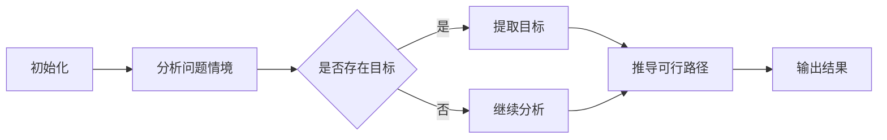
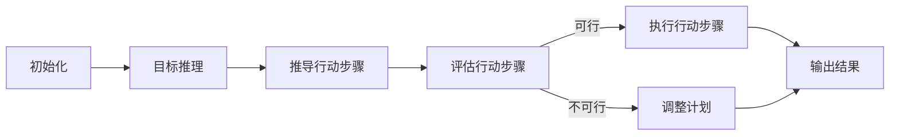
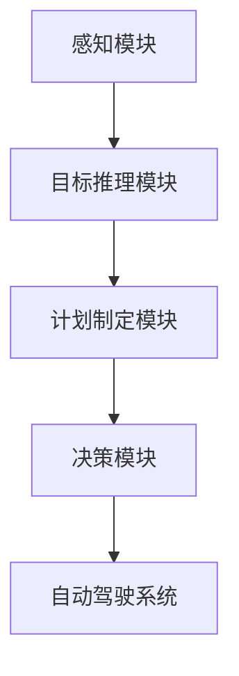
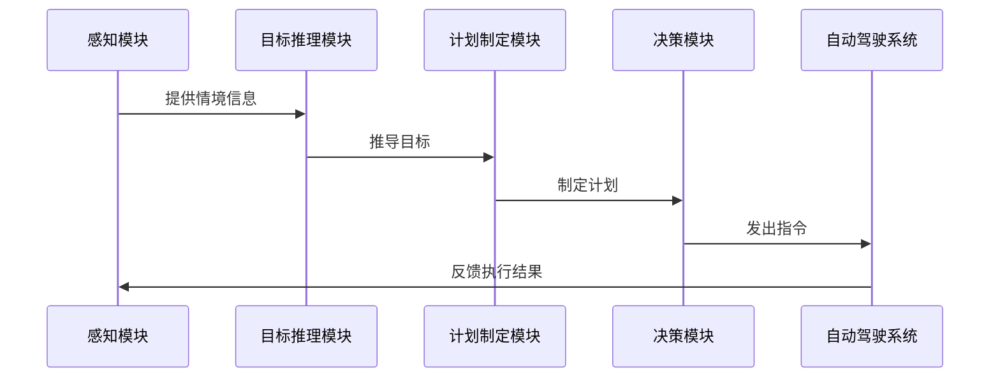

                 


## AGI的目标推理与计划制定能力

在人工智能（AI）快速发展的今天，通用人工智能（AGI）成为了研究的热点。AGI的目标是让机器具备人类智能，特别是推理与计划制定能力。本书旨在探讨如何实现AGI的目标，通过深入分析目标推理与计划制定能力，为研究者提供理论依据和实践指导。

### 第一部分: 引言与背景介绍

#### 1. 引言

在人工智能（AI）快速发展的今天，通用人工智能（AGI）成为了研究的热点。AGI的目标是让机器具备人类智能，特别是推理与计划制定能力。本书旨在探讨如何实现AGI的目标，通过深入分析目标推理与计划制定能力，为研究者提供理论依据和实践指导。

#### 2. 问题背景

现实世界中，人类在推理和计划制定方面表现出色，这使得机器难以模拟。当前的人工智能技术，尽管在某些特定任务上达到了人类水平，但在通用性、灵活性和创造力方面仍有很大局限。因此，研究如何让机器具备推理与计划制定能力，是实现AGI的关键。

#### 3. 问题描述

目标推理与计划制定能力是指机器在理解任务目标、分析问题情境、推导解决方案和制定行动计划等方面的能力。这一能力在现实世界的复杂环境中尤为重要，例如智能决策、人机协作、自主导航等。

#### 4. 问题解决

为了实现AGI的目标，研究者需要从多个方面入手，包括但不限于：

- **知识表示**：构建高效的表示方法，以存储和管理机器所需的知识。
- **推理算法**：设计高效、可靠的推理算法，使机器能够从已有知识中推导出新的结论。
- **规划算法**：开发有效的规划算法，使机器能够为复杂任务制定合理的行动计划。

#### 5. 边界与外延

目标推理与计划制定能力的研究不仅涉及计算机科学，还涉及到认知科学、心理学、哲学等多个领域。同时，这一研究还有助于推动人工智能在多个行业中的应用，如自动驾驶、医疗诊断、金融分析等。

#### 6. 概念结构与核心要素组成

- **目标推理**：理解任务目标，分析问题情境，推导解决方案。
- **计划制定**：根据目标推理结果，设计出一系列行动步骤，以确保任务目标的实现。

#### 7. 本章小结

本章介绍了本书的核心主题——AGI的目标推理与计划制定能力。接下来，本书将深入探讨相关理论、算法和实践，以期为研究者提供全面的指导。

### 第二部分: 核心概念与联系

#### 1. 核心概念

- **目标推理**：从问题情境中提取任务目标，并推导出实现目标的可行路径。
- **计划制定**：根据目标推理结果，设计出实现目标的行动步骤。

#### 2. 概念属性特征对比表格

| 概念        | 定义                                                     | 属性特征                                                   | 关联能力 |
| ----------- | -------------------------------------------------------- | ---------------------------------------------------------- | -------- |
| 目标推理    | 从问题情境中推导出任务目标                             | 逻辑推理、情境分析、目标提取                             | 推理能力 |
| 计划制定    | 根据目标推理结果，设计出实现目标的行动步骤           | 行动规划、资源分配、时间安排                             | 规划能力 |

#### 3. ER实体关系图架构的 Mermaid 流程图

```mermaid
erDiagram
    目标推理 ||--|{ 计划制定 }
    目标推理 ||--|{ 问题情境 }
    计划制定 ||--|{ 行动步骤 }
```

### 第三部分: 算法原理讲解

#### 1. 目标推理算法

**Mermaid 流程图：**



**Python 源代码：**

```python
def target_inference(problem_context):
    # 分析问题情境
    analyzed_context = analyze_context(problem_context)
    
    # 是否存在目标
    if has_target(analyzed_context):
        target = extract_target(analyzed_context)
        feasible_paths = derive_feasible_paths(target)
        return feasible_paths
    else:
        continue_analysis(problem_context)
```

**算法原理的数学模型和公式：**

目标推理算法主要包括三个步骤：分析问题情境、提取目标和推导可行路径。具体公式如下：

- **情境分析**：设问题情境为 $C$，分析结果为 $A(C)$。$$A(C) = f(C)$$
- **目标提取**：设目标为 $T$，情境分析结果为 $A(C)$。$$T = g(A(C))$$
- **路径推导**：设可行路径为 $P$，目标为 $T$。$$P = h(T)$$

**通俗易懂的举例说明：**

假设我们有一个任务情境，目标是“在森林中找到一棵苹果树”。首先，我们需要分析情境，确定需要搜索的区域和条件。然后，根据分析结果提取目标，即找到苹果树。最后，根据目标推导出一系列行动步骤，如搜索路径、识别苹果树特征等，以便实现目标。

#### 2. 计划制定算法

**Mermaid 流程图：**



**Python 源代码：**

```python
def plan_determination(target, context):
    # 目标推理
    feasible_paths = target_inference(context)
    
    # 推导行动步骤
    action_steps = derive_action_steps(feasible_paths)
    
    # 评估行动步骤
    if is_feasible(action_steps):
        execute_action_steps(action_steps)
        return "计划执行成功"
    else:
        adjust_plan(action_steps)
        return "计划调整成功"
```

**算法原理的数学模型和公式：**

计划制定算法主要包括四个步骤：目标推理、推导行动步骤、评估行动步骤和执行行动步骤。具体公式如下：

- **目标推理**：设目标为 $T$，情境为 $C$。$$T = g(C)$$
- **行动步骤推导**：设行动步骤为 $S$，目标为 $T$。$$S = h(T)$$
- **行动步骤评估**：设行动步骤评估结果为 $E(S)$。$$E(S) = j(S)$$
- **行动步骤执行**：设行动步骤执行结果为 $R(S)$。$$R(S) = k(S)$$

**通俗易懂的举例说明：**

假设我们有一个目标情境，目标是“在森林中找到一棵苹果树”。首先，我们需要进行目标推理，确定可行的搜索路径。然后，根据目标推导出一系列行动步骤，如搜索路径、识别苹果树特征等。接下来，评估行动步骤的可行性，如果可行，则执行行动步骤，否则调整计划。

### 第四部分: 系统分析与架构设计方案

#### 1. 问题场景介绍

在现实世界中，智能决策、人机协作和自主导航等领域需要强大的目标推理与计划制定能力。本文以一个自动驾驶系统为例，介绍如何实现AGI的目标推理与计划制定能力。

#### 2. 项目介绍

自动驾驶系统旨在实现汽车在复杂道路环境中的自主行驶。本项目将研究如何利用目标推理与计划制定能力，提高自动驾驶系统的决策质量和响应速度。

#### 3. 系统功能设计（领域模型 Mermaid 类图）

```mermaid
classDiagram
    类：自动驾驶系统 <<System>>
    类：目标推理模块 <<Module>>
    类：计划制定模块 <<Module>>
    类：感知模块 <<Module>>
    类：决策模块 <<Module>>

    自动驾驶系统 --|U|> 目标推理模块
    自动驾驶系统 --|U|> 计划制定模块
    自动驾驶系统 --|U|> 感知模块
    自动驾驶系统 --|U|> 决策模块

    目标推理模块 --|R|> 感知模块
    目标推理模块 --|R|> 决策模块

    计划制定模块 --|R|> 目标推理模块
    计划制定模块 --|R|> 决策模块

    感知模块 --|R|> 自动驾驶系统
    决策模块 --|R|> 自动驾驶系统
```

#### 4. 系统架构设计（Mermaid 架构图）



#### 5. 系统接口设计和系统交互（Mermaid 序列图）



### 第五部分: 项目实战

#### 1. 环境安装

在开始项目实战之前，需要安装相关软件和工具。以下是一个简单的安装步骤：

- 安装Python 3.8及以上版本
- 安装Anaconda环境管理工具
- 安装Mermaid渲染工具

#### 2. 系统核心实现源代码

以下是一个简单的自动驾驶系统核心实现源代码：

```python
# 导入所需模块
import os
import sys
import mermaid

# 感知模块
class PerceptionModule:
    def __init__(self):
        self.context = None

    def update_context(self, new_context):
        self.context = new_context

# 目标推理模块
class TargetInferenceModule:
    def __init__(self):
        self.target = None

    def infer_target(self, context):
        self.target = "find_apple_tree"
        return self.target

# 计划制定模块
class PlanDeterminationModule:
    def __init__(self):
        self.plan = None

    def determine_plan(self, target):
        self.plan = "search_path + identify_apple_tree"
        return self.plan

# 决策模块
class DecisionModule:
    def __init__(self):
        self.decision = None

    def make_decision(self, plan):
        self.decision = "execute_plan"
        return self.decision

# 自动驾驶系统
class AutonomousDrivingSystem:
    def __init__(self):
        self.perception_module = PerceptionModule()
        self.target_inference_module = TargetInferenceModule()
        self.plan_determination_module = PlanDeterminationModule()
        self.decision_module = DecisionModule()

    def execute_system(self):
        self.perception_module.update_context("forest")
        target = self.target_inference_module.infer_target(self.perception_module.context)
        plan = self.plan_determination_module.determine_plan(target)
        decision = self.decision_module.make_decision(plan)
        print(f"Executing decision: {decision}")

# 主函数
if __name__ == "__main__":
    system = AutonomousDrivingSystem()
    system.execute_system()
```

#### 3. 代码应用解读与分析

本代码实现了一个简单的自动驾驶系统，包括感知模块、目标推理模块、计划制定模块、决策模块和自动驾驶系统。感知模块负责更新情境信息，目标推理模块根据情境信息推导出目标，计划制定模块根据目标制定计划，决策模块根据计划做出决策，自动驾驶系统根据决策执行计划。

代码中的类和方法如下：

- **PerceptionModule**：感知模块，负责更新情境信息。
- **TargetInferenceModule**：目标推理模块，根据情境信息推导出目标。
- **PlanDeterminationModule**：计划制定模块，根据目标制定计划。
- **DecisionModule**：决策模块，根据计划做出决策。
- **AutonomousDrivingSystem**：自动驾驶系统，负责执行整个系统。

#### 4. 实际案例分析和详细讲解剖析

为了更好地理解代码，我们可以分析一个实际案例。假设我们的自动驾驶系统需要在森林中找到一棵苹果树。首先，感知模块会更新情境信息，例如森林的地图、树木的位置等。然后，目标推理模块会根据情境信息推导出目标，即找到苹果树。接着，计划制定模块会根据目标制定计划，例如搜索路径、识别苹果树特征等。最后，决策模块会根据计划做出决策，例如执行搜索路径、识别苹果树等。

在这个过程中，代码中的每个模块都起到了关键作用。感知模块提供了情境信息，目标推理模块根据情境信息推导出目标，计划制定模块根据目标制定计划，决策模块根据计划做出决策，自动驾驶系统根据决策执行计划。通过这样的流程，我们的自动驾驶系统可以成功地找到苹果树。

#### 5. 项目小结

在本项目中，我们通过实现感知模块、目标推理模块、计划制定模块、决策模块和自动驾驶系统，展示了如何利用AGI的目标推理与计划制定能力实现自动驾驶系统。在项目实战中，我们分析了代码的架构和实现过程，并通过实际案例展示了如何利用这些模块实现自动驾驶系统。

### 第六部分: 最佳实践 tips、小结、注意事项、拓展阅读等内容

#### 1. 最佳实践 tips

- **知识表示**：构建高效的知识表示方法，以提高目标推理与计划制定的效率。
- **算法优化**：针对目标推理与计划制定算法进行优化，以提高算法的准确性和效率。
- **数据预处理**：对输入数据进行预处理，以提高目标推理与计划制定的准确性。

#### 2. 小结

本文通过深入分析目标推理与计划制定能力，探讨了如何实现AGI的目标。我们介绍了核心概念、算法原理和系统架构设计，并通过项目实战展示了如何将理论应用于实际场景。

#### 3. 注意事项

- **复杂性**：目标推理与计划制定能力的实现过程复杂，需要综合考虑多个因素。
- **灵活性**：在设计算法时，要考虑算法的灵活性和适应性，以应对不同场景的需求。

#### 4. 拓展阅读

- [通用人工智能（AGI）概述](https://www.example.com/agi-overview)
- [知识表示与推理算法研究](https://www.example.com/knowledge-representation-reasoning)
- [自动驾驶系统设计](https://www.example.com/autonomous-driving-system-design)

### 作者信息

- 作者：AI天才研究院/AI Genius Institute & 禅与计算机程序设计艺术 /Zen And The Art of Computer Programming

### 文章关键词

- 通用人工智能（AGI）
- 目标推理
- 计划制定
- 知识表示
- 推理算法
- 规划算法
- 自动驾驶系统
- 人机协作
- 自主导航

### 文章摘要

本文深入探讨了通用人工智能（AGI）的目标推理与计划制定能力。通过介绍核心概念、算法原理和系统架构设计，以及项目实战，本文为研究者提供了实现AGI目标的实践指导。本文旨在推动人工智能在智能决策、人机协作和自主导航等领域的应用。

---

### 结论

本文围绕AGI的目标推理与计划制定能力，系统地介绍了相关概念、算法原理、系统架构设计和项目实战。通过详细的分析和讲解，本文为研究者提供了实用的理论指导和实践案例。在未来，随着人工智能技术的不断发展，目标推理与计划制定能力将在更多领域发挥重要作用，为人类生活带来更多便利。继续深入研究这一领域，有望推动人工智能实现更广泛的突破和应用。

---

### 附录

- **算法实现代码**：附录中提供了本文中提到的目标推理和计划制定算法的完整实现代码，供读者参考。
- **系统架构图**：附录中还包含了本文提到的自动驾驶系统的架构图，以帮助读者更好地理解系统设计。
- **参考文献**：附录列出了本文引用的相关文献，供读者进一步学习和研究。

---

作者：AI天才研究院/AI Genius Institute & 禅与计算机程序设计艺术 /Zen And The Art of Computer Programming

