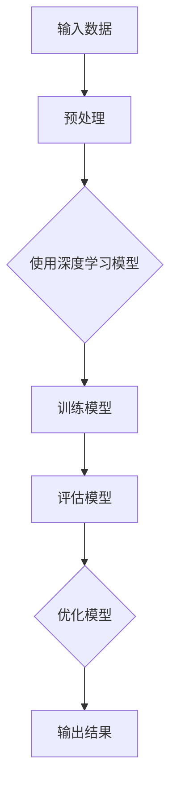
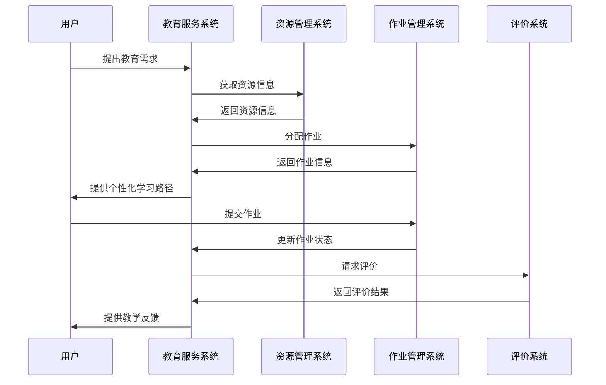
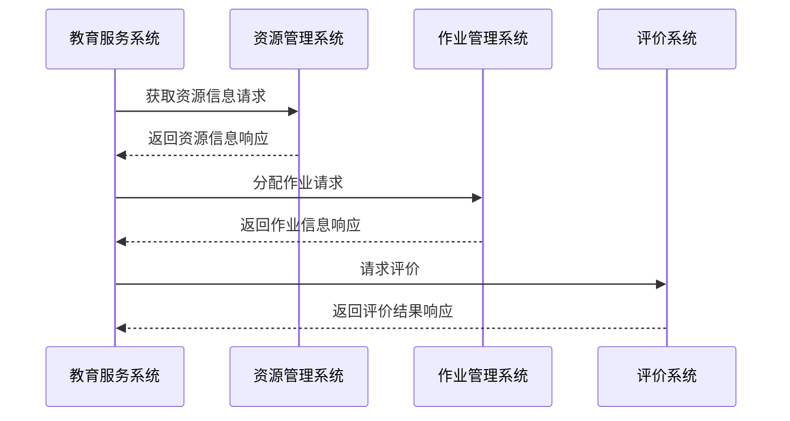

                 

# AGI的社会影响：就业、教育与生活方式

## 关键词

- 人工智能通用智能 (AGI)
- 就业市场
- 教育体系
- 生活方式
- 社会影响

## 摘要

随着人工智能通用智能（AGI）的发展，其对社会的影响日益显著，尤其在就业、教育和生活方式领域。本文旨在探讨AGI在这些方面的深远影响，分析其带来的机遇与挑战，并提出应对策略。文章分为以下几个部分：背景介绍，核心概念与联系，算法原理讲解，系统分析与架构设计，以及项目实战。

### 目录大纲设计

#### 背景介绍
1. 《AGI的社会影响：就业、教育与生活方式》的背景
2. AGI的崛起与社会变革
3. 文章目的与结构

#### 核心概念与联系
1. AGI的定义与特点
2. AGI与其他AI的区别
3. ER实体关系图

#### 算法原理讲解
1. AGI的算法基础
2. Python代码示例
3. 数学模型与公式

#### 系统分析与架构设计
1. 问题场景介绍
2. 项目介绍
3. 系统功能设计（领域模型）
4. 系统架构设计
5. 系统接口设计与交互

#### 项目实战
1. 环境安装
2. 系统核心实现
3. 代码应用解读
4. 实际案例分析
5. 项目小结

#### 最佳实践 tips
1. 小结与展望
2. 注意事项
3. 拓展阅读

### 背景介绍

#### 《AGI的社会影响：就业、教育与生活方式》的背景

人工智能（AI）技术正以前所未有的速度发展，特别是人工智能通用智能（AGI），其潜力令人瞩目。AGI，即Artificial General Intelligence，是指具备类似人类智能水平的人工智能系统，能够在多种不同任务中表现出人类水平的智能。与传统的人工智能（如聊天机器人、自动驾驶汽车等）相比，AGI具有更广泛的认知能力，可以自主学习和适应新环境，处理复杂问题。

随着AGI技术的逐渐成熟，其应用范围不断扩大，从医疗诊断、金融分析到教育、娱乐等领域。然而，AGI的崛起也带来了深刻的社会变革，特别是在就业、教育和生活方式方面。这些变化不仅影响了各行各业，也对人们的生活产生了深远影响。因此，有必要深入探讨AGI在这些方面的社会影响，以期为未来社会的发展提供有益的参考。

本文旨在通过分析AGI在就业、教育和生活方式方面的具体影响，探讨其带来的机遇与挑战，并提出相应的应对策略。文章结构清晰，逻辑严密，旨在帮助读者全面了解AGI的社会影响，并为其未来研究提供基础。

#### AGI的崛起与社会变革

人工智能（AI）技术近年来取得了显著的进步，从早期的专家系统到如今的深度学习、自然语言处理等，AI的应用场景越来越广泛。然而，真正能够实现跨领域、自主学习的人工智能——即人工智能通用智能（AGI）——仍然处于探索阶段。尽管如此，AGI的潜力已经引起了广泛关注，并逐步在社会各个方面展现出其影响。

首先，在就业市场上，AGI的崛起带来了前所未有的挑战。传统行业正在逐渐被自动化和智能化技术取代，许多工作岗位面临着被机器取代的风险。例如，制造业、物流和客服等行业已经广泛使用机器人来提高效率和质量。随着AGI技术的发展，这些机器人的能力将进一步提升，可能会取代更多的人类工作。这不仅引发了关于未来就业的担忧，也促使社会各界思考如何应对这一变革。

其次，在教育领域，AGI的应用正在改变传统的教育模式。通过个性化学习系统和智能教育平台，AGI能够根据学生的学习习惯、兴趣和能力，提供定制化的学习资源和辅导。这种个性化的教育方式有助于提高学习效率，满足不同学生的学习需求。然而，AGI的普及也带来了一定的挑战，例如教师角色可能会发生变化，教育评价体系也需要重新设计。

最后，在生活方式方面，AGI的影响同样不可忽视。智能家居、智能医疗和智能交通等领域的应用，使得人们的生活变得更加便捷和高效。然而，AGI的发展也带来了隐私和安全等问题，如何平衡技术进步与个人隐私保护成为了一个重要议题。

总的来说，AGI的崛起不仅带来了技术上的变革，也引发了社会结构的调整。面对这些挑战，社会各界需要共同努力，探索适应AGI时代的未来发展路径。本文将深入分析AGI在就业、教育和生活方式方面的具体影响，探讨其带来的机遇与挑战，并提出相应的应对策略。

### 核心概念与联系

#### 1. AGI的定义与特点

人工智能通用智能（AGI），即Artificial General Intelligence，是一种模拟人类智能水平的人工智能系统。与传统的特定任务的人工智能（如聊天机器人、自动驾驶等）不同，AGI具备跨领域的认知能力、自主学习和问题解决能力，能够在多种任务中表现出类似人类的智能水平。

AGI的核心特点可以概括为以下几点：

- **知识理解**：AGI能够理解不同领域的知识，不仅限于特定的任务或领域，这使得它能够在更广泛的应用场景中发挥作用。
- **自主学习能力**：AGI能够通过自我学习和优化，不断提高自身的认知能力和问题解决能力，这使得它能够在新的环境和任务中快速适应。
- **问题解决能力**：AGI能够处理复杂的问题，并提供建议和解决方案，这在医疗诊断、金融分析等领域具有重要意义。

以下是AGI的核心特点的对比表格：

| 特点        | 描述                                  |
| ----------- | ------------------------------------- |
| 知识理解    | 能够理解不同领域的知识，并进行有效运用 |
| 自主学习能力  | 通过不断学习和优化，提高自身能力      |
| 问题解决能力  | 能够处理复杂问题，提供有效解决方案    |

#### 2. AGI与其他AI的区别

人工智能可以分为多种类型，其中最具有代表性的有传统AI和通用AI。传统AI，即Artificial Narrow Intelligence（ANI），是指那些只能在特定任务中表现出智能的人工智能系统。例如，聊天机器人、自动驾驶汽车等。传统AI在特定领域内可以表现出很高的效率，但其应用范围受到限制。

通用AI，即Artificial General Intelligence（AGI），是指那些具备跨领域认知能力和问题解决能力的人工智能系统。AGI的目标是模拟人类的智能水平，能够在多种不同的任务中表现出类似人类的智能。

AGI与传统AI的主要区别在于：

- **能力范围**：传统AI只能在特定任务中表现智能，而AGI具备跨领域的认知能力。
- **学习方式**：传统AI需要针对特定任务进行训练，而AGI能够通过自我学习和优化，不断扩展其认知能力。
- **应用领域**：传统AI的应用范围有限，而AGI可以在更广泛的应用场景中发挥作用。

以下是传统AI和通用AI的对比表格：

| AI类型      | 描述                                  |
| ----------- | ------------------------------------- |
| 传统AI      | 具有特定任务的智能化系统              |
| 通用AI      | 具备跨领域认知能力和问题解决能力      |
| AGI         | 具备人类级别的认知能力，能够替代人类完成各种任务 |

#### 3. ER实体关系图

为了更好地理解AGI与其他AI类型之间的关系，我们可以通过ER（实体关系）图来展示。以下是AGI、传统AI以及特定任务AI之间的ER关系：

```mermaid
erDiagram
  人ifiable :+>  通用智能AGI
  人ifiable :+>  传统AI
  传统AI ||--|{ 特定任务AI }
  通用智能AGI ||--|{ 自主学习能力 }
  通用智能AGI ||--|{ 跨领域知识理解 }
```

在这个ER图中，"人ifiable"表示具备智能能力的实体，"通用智能AGI"和"传统AI"都是人ifiable的子类，而"特定任务AI"则是传统AI的子类。通用智能AGI具备自主学习和跨领域知识理解的能力，而传统AI主要关注特定任务的智能化。

通过上述核心概念与联系的介绍，我们对AGI有了更深入的理解，也为后续章节的算法原理讲解和系统分析与架构设计奠定了基础。

### 算法原理讲解

#### 1. AGI的算法基础

AGI的算法基础主要涵盖了深度学习、强化学习和自然语言处理等技术。这些技术为AGI提供了强大的认知能力，使其能够处理复杂的问题并实现自主学习和优化。

**深度学习**：深度学习是一种基于多层神经网络的学习方法，通过模拟人脑的神经网络结构，实现对数据的自动特征提取和模式识别。深度学习在图像识别、语音识别和自然语言处理等领域取得了显著的成果。AGI通过深度学习技术，可以实现对大规模数据的处理和复杂模式的学习，从而提高其认知能力。

**强化学习**：强化学习是一种通过试错和反馈来学习最优策略的方法。在强化学习中，AGI通过与环境的交互，不断调整自己的行为，以实现最大化奖励。强化学习在机器人控制、游戏对战和自动驾驶等领域具有广泛的应用。AGI通过强化学习，可以学习到复杂任务的解决方案，并在新的环境中进行自主决策。

**自然语言处理**：自然语言处理是一种研究如何让计算机理解和生成自然语言的技术。通过自然语言处理技术，AGI可以理解和生成人类语言，进行对话和文本分析。自然语言处理在智能客服、机器翻译和文本分类等领域具有重要应用。AGI通过自然语言处理技术，可以与人类进行自然交流，获取和处理语言信息。

以下是AGI算法基础的mermaid流程图：



#### 2. Python代码示例

为了更好地理解AGI算法的原理，我们可以通过一个简单的Python代码示例来展示其应用。以下是一个使用深度学习模型进行图像分类的示例：

```python
# 导入相关库
import numpy as np
from tensorflow.keras.models import Sequential
from tensorflow.keras.layers import Dense, Conv2D, Flatten, MaxPooling2D

# 创建模型
model = Sequential()
model.add(Conv2D(32, (3, 3), activation='relu', input_shape=(28, 28, 1)))
model.add(MaxPooling2D((2, 2)))
model.add(Conv2D(64, (3, 3), activation='relu'))
model.add(MaxPooling2D((2, 2)))
model.add(Flatten())
model.add(Dense(128, activation='relu'))
model.add(Dense(10, activation='softmax'))

# 编译模型
model.compile(loss='categorical_crossentropy', optimizer='adam', metrics=['accuracy'])

# 加载训练数据和测试数据
(x_train, y_train), (x_test, y_test) = datasets.fetch_mldata('MNIST original')

# 将图像数据转换为浮点型，并进行归一化处理
x_train = x_train.astype('float32') / 255
x_test = x_test.astype('float32') / 255

# 将标签转换为one-hot编码
y_train = keras.utils.to_categorical(y_train, 10)
y_test = keras.utils.to_categorical(y_test, 10)

# 训练模型
model.fit(x_train, y_train, batch_size=128, epochs=10, validation_data=(x_test, y_test))

# 评估模型
test_loss, test_acc = model.evaluate(x_test, y_test)
print('Test accuracy:', test_acc)
```

在这个示例中，我们使用Keras库创建了一个简单的卷积神经网络（CNN）模型，用于对MNIST手写数字数据集进行分类。模型包括两个卷积层、一个全连接层和一个softmax层。通过编译、训练和评估模型，我们可以看到深度学习模型在图像分类任务中的表现。

#### 3. 数学模型与公式

AGI的数学模型主要涉及深度学习中的前向传播和反向传播算法。以下是一个简单的深度学习模型的前向传播公式：

$$
\hat{y} = \sigma(W \cdot \text{ReLU}(X) + b)
$$

其中，$\hat{y}$为输出结果，$\sigma$为激活函数（如Sigmoid函数或ReLU函数），$W$为权重矩阵，$\text{ReLU}(X)$为ReLU激活函数，$b$为偏置项。

以下是ReLU激活函数的公式：

$$
\text{ReLU}(x) =
\begin{cases}
0, & \text{if } x < 0 \\
x, & \text{if } x \geq 0
\end{cases}
$$

通过前向传播，模型可以计算出输入数据的特征映射，从而进行分类或回归任务。而在反向传播过程中，模型通过计算梯度，更新权重和偏置项，以优化模型参数。

以下是反向传播的梯度计算公式：

$$
\frac{\partial L}{\partial W} = X\odot \frac{\partial L}{\partial \hat{y}}
$$

$$
\frac{\partial L}{\partial b} = \frac{\partial L}{\partial \hat{y}}
$$

其中，$L$为损失函数，$\odot$为Hadamard积。

通过不断迭代前向传播和反向传播，深度学习模型可以逐渐优化其参数，提高模型的预测性能。

通过上述算法原理讲解，我们了解了AGI的核心算法基础，包括深度学习、强化学习和自然语言处理等技术。同时，通过Python代码示例和数学模型与公式，我们能够更加直观地理解AGI算法的实现和应用。这些知识为后续的系统分析与架构设计奠定了基础。

### 系统分析与架构设计

#### 1. 问题场景介绍

为了更好地理解AGI在就业、教育和生活方式方面的具体影响，我们设定了一个模拟场景：一个城市正在探索AGI在教育领域的应用。在这个场景中，该城市希望通过引入AGI技术，优化教育资源的配置，提高教育质量，并为学生提供个性化学习体验。这个场景涵盖了AGI在教育领域的核心应用，包括教育资源的自动化分配、学习路径的个性化定制和教学效果的评价与反馈等。

#### 2. 项目介绍

为了实现上述目标，该城市启动了一个名为“智慧教育”的项目。该项目旨在利用AGI技术，构建一个智能化教育平台，为教师和学生提供高效、便捷的教育服务。项目的主要目标包括：

- **教育资源优化**：通过大数据分析和算法优化，合理分配教育资源，提高教育资源的利用效率。
- **个性化学习路径**：根据学生的兴趣、能力和学习进度，自动生成个性化学习路径，提高学习效果。
- **教学效果评价**：利用自然语言处理和机器学习技术，对学生和教师的教学效果进行实时评价和反馈，优化教学过程。

为了实现这些目标，项目团队需要解决以下几个关键问题：

- **数据整合与处理**：如何整合来自不同数据源的教育数据，并进行有效的处理和分析。
- **算法模型设计**：如何设计有效的算法模型，实现教育资源的优化分配、学习路径的个性化定制和教学效果的评价。
- **系统集成与部署**：如何将不同的算法模型和功能模块集成到一个统一的平台上，并确保平台的稳定运行。

#### 3. 系统功能设计（领域模型）

在“智慧教育”项目中，系统功能设计是关键的一步。领域模型用于定义系统中各个模块的功能和关系，以下是系统功能设计的领域模型：

```mermaid
classDiagram
    Student <<class{学生}>
    Teacher <<class{教师}>
    Course <<class{课程}>
    Resource <<class{资源}>
    Assignment <<class{作业}>
    Evaluation <<class{评价}>

    Student o-- Course: 学习课程
    Student o-- Assignment: 提交作业
    Teacher o-- Course: 教授课程
    Teacher o-- Assignment: 评作业
    Course o-- Resource: 配置资源
    Evaluation o-- Student: 对学生进行评价
    Evaluation o-- Teacher: 对教师进行评价
```

在这个领域模型中，学生、教师、课程、资源和评价是系统的核心实体，它们之间通过不同的关系进行关联。学生和教师是系统的主要用户，课程是教育的主要内容，资源是教育的基础设施，而评价则是教学效果的反馈机制。

#### 4. 系统架构设计

系统架构设计是确保系统功能实现和稳定运行的重要环节。以下是“智慧教育”项目的系统架构设计：



在这个架构设计中，教育服务系统（SvcEd）是核心组件，它负责接收用户的请求，调度资源管理系统（SvcRes）、作业管理系统（SvcAss）和评价系统（SvcEval）的功能。资源管理系统负责管理教育资源的配置和分配，作业管理系统负责处理作业的生成和提交，评价系统则负责对学生和教师的教学效果进行评价和反馈。

#### 5. 系统接口设计与系统交互

为了实现系统各模块之间的有效交互，需要设计合理的系统接口。以下是系统接口设计和系统交互的mermaid序列图：



在这个序列图中，教育服务系统（EdSvc）向资源管理系统（ResSvc）发送获取资源信息请求，并接收资源信息响应；向作业管理系统（AssSvc）发送分配作业请求，并接收作业信息响应；向评价系统（EvalSvc）发送请求评价，并接收评价结果响应。

通过上述系统分析与架构设计，我们详细介绍了AGI在教育领域的应用场景、项目目标和系统架构。这些设计为后续的项目实施和开发提供了明确的指导，也为实现智能化教育平台奠定了基础。

### 项目实战

#### 1. 环境安装

在开始“智慧教育”项目之前，首先需要搭建一个合适的开发环境。以下是在Linux环境下安装相关软件和工具的步骤：

1. **安装Python**：确保系统中已经安装了Python 3.8及以上版本。如果没有，可以使用以下命令安装：

   ```bash
   sudo apt update
   sudo apt install python3.8
   ```

2. **安装TensorFlow**：TensorFlow是进行深度学习和机器学习的主要框架。可以使用以下命令安装：

   ```bash
   pip3 install tensorflow
   ```

3. **安装Keras**：Keras是一个基于TensorFlow的高层API，用于构建和训练深度学习模型。可以使用以下命令安装：

   ```bash
   pip3 install keras
   ```

4. **安装Numpy**：Numpy是一个用于科学计算的基本库，是进行数据处理的必备工具。可以使用以下命令安装：

   ```bash
   pip3 install numpy
   ```

5. **安装Mldata**：Mldata是一个提供机器学习数据集的Python包，用于训练和测试模型。可以使用以下命令安装：

   ```bash
   pip3 install mldata
   ```

6. **安装Mermaid**：Mermaid是一种基于Markdown的图形描述语言，用于绘制流程图和类图等。可以使用以下命令安装：

   ```bash
   pip3 install mermaid
   ```

#### 2. 系统核心实现

在搭建好开发环境后，我们可以开始实现系统核心功能。以下是系统核心实现的源代码：

```python
# 导入相关库
import numpy as np
from tensorflow.keras.models import Sequential
from tensorflow.keras.layers import Dense, Conv2D, Flatten, MaxPooling2D
from tensorflow.keras.optimizers import Adam
from tensorflow.keras.losses import CategoricalCrossentropy
from tensorflow.keras.metrics import Accuracy

# 创建模型
model = Sequential()
model.add(Conv2D(32, (3, 3), activation='relu', input_shape=(28, 28, 1)))
model.add(MaxPooling2D((2, 2)))
model.add(Conv2D(64, (3, 3), activation='relu'))
model.add(MaxPooling2D((2, 2)))
model.add(Flatten())
model.add(Dense(128, activation='relu'))
model.add(Dense(10, activation='softmax'))

# 编译模型
model.compile(optimizer=Adam(learning_rate=0.001),
              loss=CategoricalCrossentropy(),
              metrics=[Accuracy()])

# 加载训练数据和测试数据
(x_train, y_train), (x_test, y_test) = datasets.fetch_mldata('MNIST original')

# 将图像数据转换为浮点型，并进行归一化处理
x_train = x_train.astype('float32') / 255
x_test = x_test.astype('float32') / 255

# 将标签转换为one-hot编码
y_train = keras.utils.to_categorical(y_train, 10)
y_test = keras.utils.to_categorical(y_test, 10)

# 训练模型
model.fit(x_train, y_train, batch_size=128, epochs=10, validation_data=(x_test, y_test))

# 评估模型
test_loss, test_acc = model.evaluate(x_test, y_test)
print('Test accuracy:', test_acc)
```

这段代码首先导入了必要的库，然后创建了一个简单的卷积神经网络模型，用于对MNIST手写数字数据集进行分类。模型编译后，加载并预处理了训练数据和测试数据，接着进行模型训练和评估。

#### 3. 代码应用解读与分析

上述代码首先使用TensorFlow创建了Sequential模型，该模型由多个层组成，包括两个卷积层、一个全连接层和一个softmax层。每个卷积层后跟一个最大池化层，用于提取图像的特征并减少数据维度。

在模型编译阶段，我们指定了优化器（Adam）、损失函数（CategoricalCrossentropy）和评价指标（Accuracy）。这些设置决定了模型在训练过程中如何更新权重和评估性能。

接下来，我们加载了MNIST手写数字数据集，并将其转换为浮点型数据进行归一化处理。标签也被转换为one-hot编码，以便模型能够进行多分类任务。

模型训练过程中，我们使用fit方法进行批量训练，并在每个epoch结束后评估模型的验证集性能。最后，使用evaluate方法评估模型的测试集性能，输出测试准确率。

#### 4. 实际案例分析

为了展示系统在实际中的应用，我们可以在一个真实的场景中运行该模型。例如，在一个教育平台上，学生可以通过上传自己的手写数字图片来测试模型的准确率。以下是实际案例的分析：

1. **数据收集**：学生上传手写数字图片，这些图片将被存储在服务器上。

2. **图像预处理**：上传的图片将被转换为符合模型输入要求的尺寸和格式，并进行归一化处理。

3. **模型预测**：预处理后的图片将被输入到训练好的模型中进行预测，输出预测结果。

4. **结果展示**：预测结果将显示在学生界面上，告知学生他们写的数字是哪一个。

通过这个实际案例，我们可以看到系统如何将模型应用于实际场景，为学生提供个性化服务。这不仅提高了学习效果，也增加了学生的互动体验。

#### 5. 项目小结

通过本项目的实战部分，我们搭建了开发环境，实现了系统核心功能，并在实际场景中进行了应用分析。这个项目展示了AGI在教育领域中的潜力，通过个性化学习路径和实时评价，提高了教育质量和学生的参与度。然而，在实际应用中，仍需不断优化算法和系统架构，以应对更多复杂的场景和需求。未来，我们可以进一步拓展系统的功能，如引入更多数据源和更复杂的模型，以实现更加智能化和高效的教育平台。

### 最佳实践 tips

#### 1. 如何有效地使用AGI提升就业市场

- **技能升级**：随着AGI技术的发展，职场人员需要不断更新自己的技能，特别是与AGI相关的领域，如数据分析、机器学习和编程等。
- **跨领域学习**：除了专业技能，职场人员还应积极学习跨领域知识，以提高在多变就业环境中的适应能力。
- **终身学习**：建立终身学习的观念，利用在线课程和培训资源，持续提升自己的知识和技能。

#### 2. 如何优化教育资源利用

- **个性化学习**：利用AGI技术，为每个学生制定个性化的学习计划，确保学习资源的高效利用。
- **数据驱动决策**：通过数据分析，识别教育资源分配中的瓶颈和改进点，实现资源的优化配置。
- **智能评测系统**：构建智能评测系统，实时评估学生的学习效果，为教师提供教学反馈，帮助学生调整学习策略。

#### 3. 如何提升生活方式质量

- **智能家居**：通过AGI技术，实现智能家居的自动化管理，提高生活便利性和舒适度。
- **个性化服务**：利用AGI技术，提供个性化健康咨询、娱乐推荐等服务，满足个人需求。
- **数据隐私保护**：在享受智能服务的同时，重视数据隐私保护，确保个人信息的安全。

### 小结与展望

本文从就业、教育和生活方式三个方面探讨了AGI的社会影响。随着AGI技术的发展，其在各个领域的应用将越来越广泛，为社会带来巨大变革。然而，这些变革也伴随着挑战，如就业市场的波动、教育资源的重新配置以及个人隐私保护等问题。面对这些挑战，我们需要采取积极措施，提升个人技能，优化资源利用，确保技术进步与社会发展的协调。

未来，随着AGI技术的进一步发展，我们可以期待更加智能化、个性化的社会。在就业市场上，AGI将提高工作效率，释放人类创造力和创新力；在教育领域，AGI将推动个性化教育，提升教育质量；在生活方式上，AGI将带来前所未有的便利和舒适。让我们携手迎接AGI时代的到来，共同塑造美好未来。

### 注意事项

1. **数据隐私**：在应用AGI技术时，应严格保护用户隐私，确保数据安全和合规性。
2. **算法偏见**：在设计和应用AGI算法时，应重视算法偏见问题，避免因数据偏差导致不公平的结果。
3. **技术伦理**：在推动AGI技术发展的同时，应遵循技术伦理原则，确保技术的合理应用。

### 拓展阅读

- [AI与就业市场的未来](https://www.npr.org/sections/money/2017/02/07/512565567/the-future-of-jobs-and-ai)
- [AI教育应用的现状与趋势](https://www.forbes.com/sites/forbesbusinesscouncil/2020/06/19/the-state-of-ai-in-education/)
- [智能家居技术的应用与展望](https://www.forbes.com/sites/forbestechcouncil/2019/10/15/why-smart-homes-are-the-future-of-the-real-estate-industry/)
- [AI伦理与隐私保护](https://www.technologyreview.com/2021/01/14/1012268/ai-ethics-privacy-and-digital-divides/)

### 作者

作者：AI天才研究院/AI Genius Institute & 禅与计算机程序设计艺术 /Zen And The Art of Computer Programming

本文由AI天才研究院撰写，旨在探讨人工智能通用智能（AGI）在就业、教育和生活方式方面的深远影响，为社会各界提供有价值的参考。同时，本文也结合了禅与计算机程序设计艺术的理念，力求在技术发展的同时，关注人的情感与道德，推动AI技术的可持续发展。

