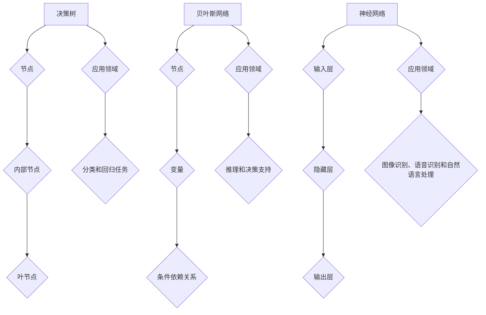
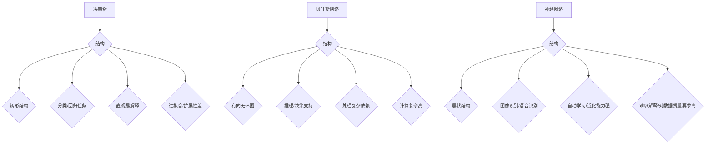
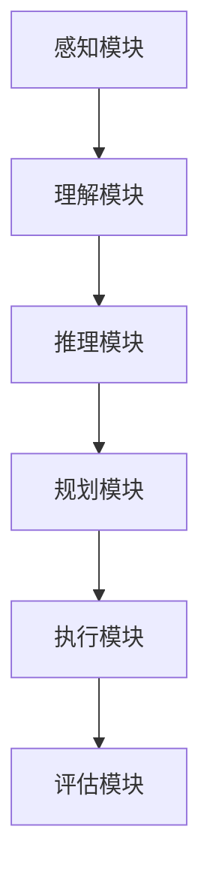
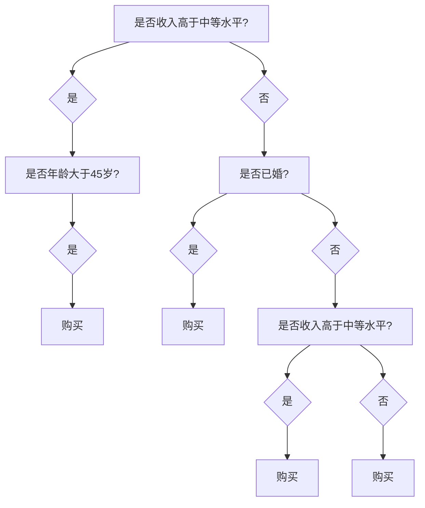
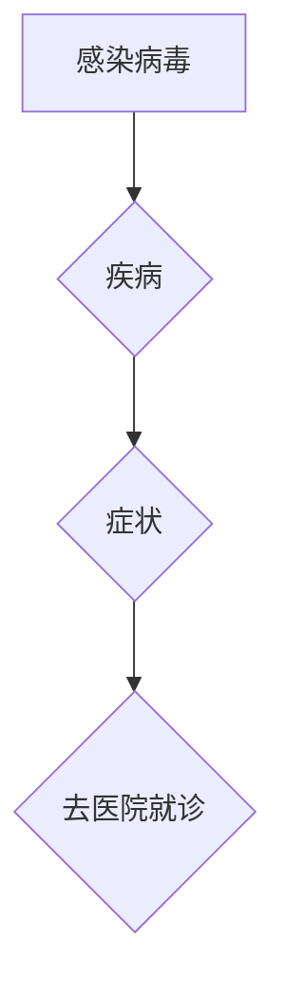
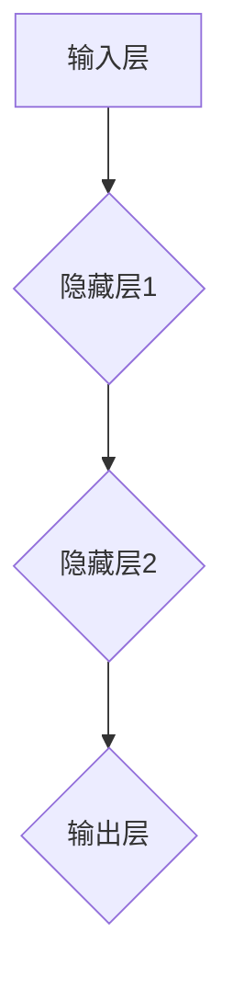
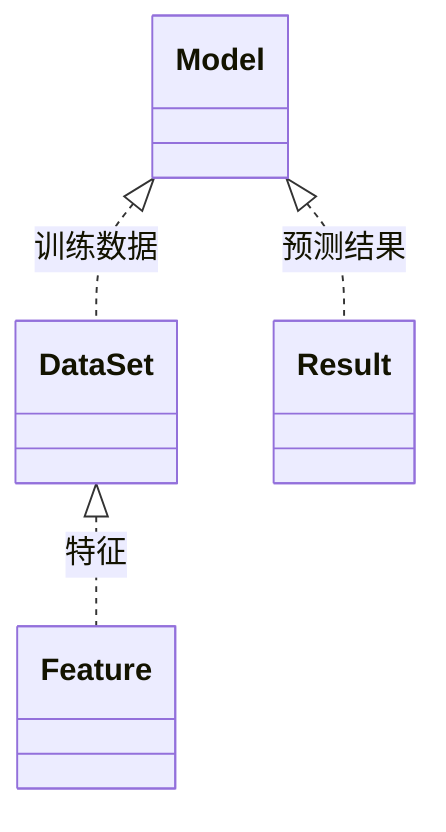

                 

### 引言

**关键词**：AGI、类人决策过程、模拟、决策树、神经网络

**摘要**：
本文旨在深入探讨人工智能（AI）领域中的一个关键课题——通用智能（AGI）的类人决策过程模拟。首先，我们将介绍AI与AGI的基本概念，并探讨类人决策过程在AGI实现中的重要性。随后，文章将分析当前在类人决策过程模拟方面所面临的挑战和研究现状，为后续章节的讨论打下基础。通过本文的阅读，读者将全面了解AGI类人决策过程模拟的背景、核心概念、技术实现和实际应用，从而对这一前沿领域有更为深刻的认识。

---

### 第一部分：背景与概述

#### 第1章：背景与概述

##### 1.1.1 问题背景

**人工智能与通用智能（AGI）的概念介绍**

人工智能（Artificial Intelligence，AI）是指通过计算机程序模拟、延伸和扩展人类智能的理论、方法和技术。它包括机器学习、深度学习、自然语言处理、计算机视觉等多个子领域。然而，传统AI主要聚焦于特定任务的自动化，如图像识别、语音识别和棋类游戏等，这被称为窄人工智能（ANI，Artificial Narrow Intelligence）。

**类人决策过程的重要性**

类人决策过程是指在复杂、不确定的环境中进行推理和决策的能力，与人类思维过程有诸多相似之处。类人决策在许多领域具有广泛的应用价值，例如医疗诊断、金融分析、城市规划和智能交通等。实现类人决策过程是AGI发展的重要目标，因为只有具备这种能力，AI才能更贴近人类的智能水平。

**当前研究现状与挑战**

尽管在AI领域取得了显著进展，但实现通用智能仍然面临诸多挑战。类人决策过程的模拟是一个复杂且多层次的课题，涉及认知科学、心理学、计算机科学和数学等多个学科。当前研究主要集中在开发更强大的算法和模型，提高AI的自主学习和推理能力。然而，如何使AI在复杂动态环境中进行可靠、高效的决策仍然是一个亟待解决的关键问题。

##### 1.1.2 通用智能的定义与目标

**通用智能的定义**

通用智能（Artificial General Intelligence，AGI）是指具备人类所有智能能力的AI系统，包括学习、推理、理解、创造和社交互动等。与窄人工智能不同，AGI能够在各种不同的任务和环境中进行灵活、自适应的推理和决策。

**类人决策过程的内涵与特点**

类人决策过程是指AI系统在复杂环境中，通过感知、理解、推理和规划等认知过程，生成合理的决策方案。这种决策过程具有以下特点：

1. **适应性**：能够根据不同环境和情境调整决策策略。
2. **灵活性**：能够处理不确定性和不完整信息。
3. **自主性**：能够自主学习和改进决策过程。
4. **创造性**：能够产生新颖和有价值的决策方案。

**AGI与类人决策的关联**

AGI的核心目标是实现类人决策过程，使其具备人类智能的复杂性和灵活性。类人决策过程不仅是AGI的重要组成部分，也是衡量AGI水平的重要指标。只有实现类人决策过程，AI系统才能在真实世界中进行自主、高效的智能活动。

##### 1.1.3 类人决策过程的边界与外延

**类人决策的核心要素**

类人决策过程涉及多个核心要素，包括感知、理解、推理、规划和执行。其中，感知和理解是决策的基础，推理和规划是实现决策的核心，而执行则是决策结果的落实。

1. **感知**：通过传感器获取环境信息，如图像、声音和文字等。
2. **理解**：对感知信息进行分析和理解，提取关键特征和模式。
3. **推理**：基于理解和已有的知识，进行逻辑推理和推断。
4. **规划**：生成一系列行动计划，实现决策目标。
5. **执行**：执行规划出的行动计划，实现决策结果。

**类人决策过程在不同领域的应用**

类人决策过程在各个领域都有广泛的应用：

1. **医疗**：通过类人决策过程，AI可以在复杂医疗数据中进行分析和诊断，为医生提供决策支持。
2. **金融**：在金融领域中，AI可以通过类人决策过程进行市场预测、风险评估和投资决策。
3. **教育**：AI可以根据学生的学习情况和需求，进行个性化的教育规划和指导。
4. **城市规划和交通**：AI可以通过类人决策过程优化交通流量、城市规划和资源分配。

综上所述，类人决策过程是AGI实现的关键环节，它不仅关乎AI的智能水平，也直接影响着AI在各个领域的应用。深入研究类人决策过程模拟，对于推动AI技术的发展和实际应用具有重要意义。

### 第二部分：核心概念与原理

#### 第2章：核心概念与原理

##### 2.1.1 类人决策的基本概念

类人决策过程是AGI的核心组成部分，而要深入理解类人决策，我们首先需要了解其中涉及的基本概念，包括决策树、贝叶斯网络和神经网络。

**决策树**

决策树是一种广泛使用的决策支持工具，它通过一系列的判断节点和结果节点，以树形结构呈现可能的决策路径。每个节点表示一个特征或条件，每个分支表示一个可能的条件结果，而叶节点则表示最终的决策结果。

- **结构**：决策树由根节点、内部节点和叶节点组成。根节点是整个决策过程的起点，内部节点表示判断条件，叶节点表示决策结果。
- **应用**：决策树在分类和回归任务中都有广泛应用，例如在医学诊断、客户分类和信用评分等领域。

**贝叶斯网络**

贝叶斯网络是一种图形化的概率模型，用于表示变量之间的条件依赖关系。它通过有向无环图（DAG）来描述变量之间的概率关系，每个节点代表一个随机变量，边表示变量之间的条件依赖。

- **结构**：贝叶斯网络由节点和边组成，节点表示随机变量，边表示变量之间的条件依赖关系。
- **应用**：贝叶斯网络在推理和决策中具有重要作用，例如在医疗诊断、故障检测和风险评估等领域。

**神经网络**

神经网络是一种模拟人脑结构和功能的计算模型，由大量的神经元（节点）和连接（边）组成。通过学习和训练，神经网络可以自动提取数据中的特征和模式，进行复杂的推理和决策。

- **结构**：神经网络由输入层、隐藏层和输出层组成。输入层接收外部信息，隐藏层进行特征提取和变换，输出层生成最终决策结果。
- **应用**：神经网络在图像识别、语音识别和自然语言处理等领域具有广泛的应用。

##### 2.1.2 类人决策原理

类人决策过程是AI系统在复杂环境中进行推理和决策的过程。要实现类人决策，需要建立相应的决策模型，并对其进行训练和优化。

**决策过程模型**

类人决策过程可以看作是一个多层次的模型，包括感知、理解、推理、规划和执行等环节。每个环节都有特定的算法和技术支持。

1. **感知**：通过传感器获取环境信息，如图像、声音和文字等。
2. **理解**：对感知信息进行分析和理解，提取关键特征和模式。
3. **推理**：基于理解和已有的知识，进行逻辑推理和推断。
4. **规划**：生成一系列行动计划，实现决策目标。
5. **执行**：执行规划出的行动计划，实现决策结果。

**模型训练与优化**

类人决策模型的训练和优化是关键步骤，直接影响决策过程的性能和效率。常见的训练方法包括监督学习、无监督学习和强化学习等。

1. **监督学习**：通过标注好的数据集，训练模型对输入数据进行分类或回归。
2. **无监督学习**：通过未标注的数据集，训练模型发现数据中的隐含结构和模式。
3. **强化学习**：通过奖励机制，训练模型在特定环境中进行最优决策。

**模型评估与验证**

类人决策模型的评估与验证是确保其性能和可靠性的重要环节。常见的评估指标包括准确率、召回率、F1值和均方误差等。

1. **准确率**：预测正确的样本数占总样本数的比例。
2. **召回率**：预测正确的正样本数占总正样本数的比例。
3. **F1值**：准确率和召回率的调和平均。
4. **均方误差**：预测值与真实值之间的平均平方误差。

**核心概念属性特征对比**

| 概念        | 结构特征                                           | 应用领域                                           |
|-------------|----------------------------------------------------|----------------------------------------------------|
| 决策树      | 树形结构，包含节点和边                             | 分类和回归任务                                     |
| 贝叶斯网络  | 有向无环图，节点表示随机变量，边表示条件依赖关系   | 推理和决策支持                                     |
| 神经网络    | 层状结构，包含输入层、隐藏层和输出层               | 图像识别、语音识别和自然语言处理等领域               |

**ER实体关系图架构的 Mermaid 流程图**



通过以上分析，我们可以看到决策树、贝叶斯网络和神经网络在类人决策过程中各自扮演着重要的角色，它们在结构特征和应用领域上都有显著的区别。理解这些核心概念和原理，有助于我们更好地设计和实现类人决策过程模拟。

##### 2.1.3 核心概念属性特征对比

在深入理解类人决策的基本概念后，我们需要进一步探讨决策树、贝叶斯网络和神经网络这三者在属性特征上的对比，以帮助读者更全面地认识这些核心概念。

**决策树 vs. 贝叶斯网络**

**决策树**

- **结构**：决策树是一个树形结构，包含根节点、内部节点和叶节点。每个内部节点代表一个测试或判断条件，每个叶节点代表一个具体的决策结果。
- **应用**：决策树在分类和回归任务中应用广泛，适合处理离散型数据。它通过递归划分特征空间，找到最佳划分点，从而生成决策树模型。
- **优点**：直观、易于理解和解释，适合小型和中等规模的数据集。
- **缺点**：可能产生过拟合，对大型数据集的扩展性较差。

**贝叶斯网络**

- **结构**：贝叶斯网络是一种图形化的概率模型，采用有向无环图（DAG）表示变量之间的条件依赖关系。每个节点代表一个随机变量，边表示变量之间的条件依赖。
- **应用**：贝叶斯网络在推理和决策支持任务中具有广泛应用，如医疗诊断、风险评估和故障检测等。
- **优点**：能够处理变量之间的复杂依赖关系，适用于不确定性和概率推理。
- **缺点**：计算复杂度高，对大规模数据集的处理可能较慢。

**神经网络**

- **结构**：神经网络由多个层次组成，包括输入层、隐藏层和输出层。每层由多个神经元组成，神经元之间通过加权连接连接。
- **应用**：神经网络在图像识别、语音识别、自然语言处理和自动驾驶等领域有广泛应用，适合处理高维和复杂的数据。
- **优点**：能够自动学习数据和特征，具有较强的泛化能力。
- **缺点**：模型复杂，难以解释和调试，对数据质量要求较高。

**对比总结**

| 特性      | 决策树       | 贝叶斯网络      | 神经网络         |
|-----------|--------------|-----------------|-----------------|
| 结构      | 树形结构     | 有向无环图      | 层状结构        |
| 应用领域  | 分类和回归   | 推理和决策支持  | 图像识别、语音识别等 |
| 优点      | 直观、易解释 | 处理复杂依赖   | 自动学习、泛化能力强 |
| 缺点      | 过拟合、扩展性差 | 计算复杂高     | 难以解释、对数据质量要求高 |

通过上述对比，我们可以看到决策树、贝叶斯网络和神经网络在结构、应用领域和优缺点上存在显著差异。选择适合的模型和算法，对于实现高效的类人决策过程至关重要。

##### 2.1.4 核心概念属性特征对比

为了更直观地展示决策树、贝叶斯网络和神经网络这三者之间的属性特征对比，我们可以借助Mermaid流程图来绘制一个ER（实体-关系）实体关系图。



通过这个ER实体关系图，我们可以清晰地看到决策树、贝叶斯网络和神经网络在结构特征、应用领域和优缺点上的对比。这不仅有助于理解这些核心概念，还为后续章节中的具体实现和分析提供了基础。

### 第三部分：类人决策过程模拟

#### 第3章：类人决策过程模拟

类人决策过程模拟是通用智能（AGI）实现中的一个关键环节。在这一章中，我们将详细介绍类人决策过程模拟的框架设计、不同模型的模拟过程以及具体的案例分析。

##### 3.1.1 模拟框架设计

类人决策过程模拟的框架设计是整个模拟系统的核心，它决定了模拟系统的架构、功能和性能。一个典型的类人决策过程模拟框架通常包括以下几个主要组成部分：

1. **感知模块**：负责从外部环境获取信息，如图像、声音、文本等，并将其转化为内部可以处理的数据格式。
2. **理解模块**：负责对感知模块获取的数据进行分析和理解，提取关键特征和模式，为后续的决策提供支持。
3. **推理模块**：基于理解和已有的知识，对获取的信息进行逻辑推理和推断，生成可能的决策方案。
4. **规划模块**：根据推理模块生成的决策方案，制定一系列行动计划，实现决策目标。
5. **执行模块**：负责执行规划模块生成的行动计划，将决策结果付诸实践。
6. **评估模块**：对整个决策过程进行评估和反馈，优化决策模型，提高决策的准确性和效率。

**模拟系统架构**

模拟系统架构可以采用模块化设计，各个模块之间通过接口进行通信和协调。以下是一个简化的模拟系统架构图：



**数据预处理与模型选择**

在模拟框架设计中，数据预处理和模型选择是关键步骤。数据预处理包括数据的清洗、归一化和特征提取等，以确保输入数据的质量和一致性。模型选择则需根据具体任务和需求，选择合适的决策模型，如决策树、贝叶斯网络或神经网络等。

##### 3.1.2 决策树模拟

**决策树构建过程**

决策树的构建过程是通过递归划分特征空间来实现的。具体步骤如下：

1. **选择最佳划分特征**：选择具有最高信息增益或最小均方误差的特征进行划分。
2. **划分特征空间**：根据选定的特征，将特征空间划分为多个子空间。
3. **递归构建子树**：对每个子空间重复上述步骤，直到满足停止条件（如叶节点纯度达到一定阈值）。

**决策树模拟案例分析**

假设我们使用一个简单的决策树模型来预测客户是否会购买产品。以下是一个简化的决策树模型：



在这个案例中，我们通过一系列条件判断，最终得出客户是否购买产品的决策结果。例如，如果一个客户收入高于中等水平且年龄大于45岁，那么他购买产品的概率较高。

##### 3.1.3 贝叶斯网络模拟

**贝叶斯网络建模**

贝叶斯网络建模是通过有向无环图（DAG）来描述变量之间的条件依赖关系。具体步骤如下：

1. **确定变量间关系**：根据领域知识和数据，确定变量之间的依赖关系。
2. **构建有向无环图**：将变量表示为节点，依赖关系表示为边，构建贝叶斯网络。
3. **计算概率分布**：根据训练数据，计算每个节点的条件概率分布，完成贝叶斯网络建模。

**贝叶斯网络模拟案例分析**

假设我们使用一个简单的贝叶斯网络模型来预测疾病（Disease）的发生概率。以下是一个简化的贝叶斯网络模型：



在这个案例中，病毒感染是导致疾病发生的主要原因，症状的出现和是否去医院就诊都会影响疾病的最终结果。通过贝叶斯网络建模，我们可以计算在不同条件下的疾病发生概率，从而为医生提供决策支持。

##### 3.1.4 神经网络模拟

**神经网络训练**

神经网络训练是通过大量样本数据来调整网络中的权重和偏置，使其能够正确地执行预测任务。具体步骤如下：

1. **初始化权重和偏置**：随机初始化神经网络中的权重和偏置。
2. **前向传播**：将输入数据传递到神经网络中，计算输出结果。
3. **反向传播**：根据输出结果和实际标签，计算误差，并反向传播调整权重和偏置。
4. **迭代训练**：重复前向传播和反向传播，直到网络性能达到预期或满足停止条件。

**神经网络模拟案例分析**

假设我们使用一个简单的神经网络模型来预测房价。以下是一个简化的神经网络结构：



在这个案例中，输入层接收房屋的特征数据（如面积、卧室数量等），隐藏层进行特征提取和变换，输出层生成房价预测结果。通过大量训练数据的训练，神经网络可以逐步提高预测的准确性。

##### 小结

类人决策过程模拟是AGI实现中的重要一环，通过设计合理的模拟框架和选择合适的决策模型，可以实现高效的决策过程。在本章中，我们介绍了决策树、贝叶斯网络和神经网络的模拟过程，并通过具体的案例分析展示了这些模型的应用。在实际应用中，可以根据具体需求选择合适的模型，并不断优化和调整，以实现更加准确的类人决策过程。

### 第四部分：数学模型与公式

#### 第4章：数学模型与公式

在类人决策过程中，数学模型和公式起着至关重要的作用。本章将详细介绍决策树、贝叶斯网络和神经网络的数学模型与公式，帮助读者深入理解这些模型的工作原理和计算过程。

##### 4.1.1 决策树数学模型

决策树的数学模型主要包括信息增益和条件熵等概念。以下是对这些概念的详细解释。

**信息增益**

信息增益（Information Gain）是用于选择最佳划分特征的指标。它衡量的是通过划分特征所获得的信息量，计算公式如下：

$$
IG(D, A) = I(D) - \sum_{v \in Values(A)} p(v) \cdot I(D|A=v)
$$

其中，$IG(D, A)$ 表示特征 $A$ 对数据集 $D$ 的信息增益，$I(D)$ 表示数据集 $D$ 的信息熵，$p(v)$ 表示特征 $A$ 取值为 $v$ 的概率，$I(D|A=v)$ 表示在已知特征 $A$ 取值为 $v$ 的情况下，数据集 $D$ 的条件熵。

**条件熵**

条件熵（Conditional Entropy）是衡量在给定一个特征值的情况下，数据集的无序程度。其计算公式为：

$$
I(D|A=v) = -\sum_{x \in Values(D)} p(x|A=v) \cdot \log_2 p(x|A=v)
$$

其中，$p(x|A=v)$ 表示在特征 $A$ 取值为 $v$ 的情况下，数据点 $x$ 的概率。

**信息增益与条件熵的关系**

信息增益可以通过条件熵来计算，其关系为：

$$
IG(D, A) = I(D) - \sum_{v \in Values(A)} p(v) \cdot I(D|A=v)
$$

这个公式表明，信息增益是通过减少数据集的条件熵来衡量的。即通过划分特征，使得数据集的无序程度降低，从而提高决策树的效果。

**决策树构建过程示例**

假设我们有一个数据集 $D$，包含特征 $A$ 和目标变量 $D$。我们可以通过以下步骤来构建一个简单的决策树：

1. **计算信息增益**：对于每个特征 $A$，计算 $IG(D, A)$。
2. **选择最佳特征**：选择具有最大信息增益的特征 $A$ 作为划分特征。
3. **划分数据集**：根据特征 $A$ 的取值，将数据集 $D$ 划分为多个子集。
4. **递归构建子树**：对每个子集重复上述步骤，直到满足停止条件（如叶节点纯度达到一定阈值）。

通过以上步骤，我们可以构建一个能够有效分类或回归的决策树模型。

##### 4.1.2 贝叶斯网络数学模型

贝叶斯网络是一种图形化的概率模型，用于表示变量之间的条件依赖关系。其数学模型主要包括贝叶斯概率和条件概率等概念。

**贝叶斯概率**

贝叶斯概率（Bayesian Probability）是用于表示变量之间概率关系的数学模型。其核心思想是通过条件概率和全概率公式来计算变量的联合概率分布。贝叶斯概率的计算公式为：

$$
P(A \cap B) = P(A) \cdot P(B|A)
$$

其中，$P(A \cap B)$ 表示事件 $A$ 和事件 $B$ 同时发生的概率，$P(A)$ 表示事件 $A$ 发生的概率，$P(B|A)$ 表示在事件 $A$ 发生的条件下，事件 $B$ 发生的概率。

**条件概率**

条件概率（Conditional Probability）是用于表示在某个事件发生的条件下，另一个事件发生的概率。其计算公式为：

$$
P(B|A) = \frac{P(A \cap B)}{P(A)}
$$

其中，$P(B|A)$ 表示在事件 $A$ 发生的条件下，事件 $B$ 发生的概率，$P(A \cap B)$ 表示事件 $A$ 和事件 $B$ 同时发生的概率，$P(A)$ 表示事件 $A$ 发生的概率。

**贝叶斯网络建模过程示例**

假设我们有一个包含两个变量 $A$ 和 $B$ 的贝叶斯网络，其中 $A$ 是父节点，$B$ 是子节点。我们可以通过以下步骤来建立贝叶斯网络模型：

1. **确定变量间关系**：根据领域知识和数据，确定变量之间的依赖关系。
2. **构建有向无环图**：将变量表示为节点，依赖关系表示为边，构建贝叶斯网络。
3. **计算条件概率**：根据训练数据，计算每个节点的条件概率分布，完成贝叶斯网络建模。

例如，假设我们已经确定了 $A$ 和 $B$ 之间的条件依赖关系，并计算出了条件概率分布。我们可以使用以下公式来计算联合概率分布：

$$
P(A \cap B) = P(A) \cdot P(B|A)
$$

通过这种方式，我们可以建立一个能够有效进行概率推理的贝叶斯网络模型。

##### 4.1.3 神经网络数学模型

神经网络是一种模拟人脑结构和功能的计算模型，其数学模型主要包括激活函数和反向传播算法等概念。

**激活函数**

激活函数（Activation Function）是神经网络中的关键组件，用于将神经元的输入转换为输出。常见的激活函数包括：

1. ** sigmoid 函数**：
   $$
   f(x) = \frac{1}{1 + e^{-x}}
   $$
   sigmoid 函数将输入映射到（0, 1）区间，常用于二分类问题。

2. **ReLU 函数**：
   $$
   f(x) =
   \begin{cases}
   0, & \text{if } x < 0 \\
   x, & \text{if } x \geq 0
   \end{cases}
   $$
   ReLU 函数在零点处不连续，具有较快的计算速度。

3. **tanh 函数**：
   $$
   f(x) = \frac{e^x - e^{-x}}{e^x + e^{-x}}
   $$
   tanh 函数将输入映射到（-1, 1）区间，具有对称性。

**反向传播算法**

反向传播算法（Backpropagation Algorithm）是神经网络训练的核心算法，用于计算网络中的梯度并更新权重和偏置。具体步骤如下：

1. **前向传播**：将输入数据传递到神经网络中，计算输出结果。
2. **计算误差**：计算实际输出与预期输出之间的误差。
3. **反向传播**：从输出层开始，逐层计算误差的梯度。
4. **权重更新**：根据梯度调整网络中的权重和偏置。

**神经网络训练过程示例**

假设我们有一个简单的神经网络模型，包含一个输入层、一个隐藏层和一个输出层。我们可以通过以下步骤来训练神经网络：

1. **初始化权重和偏置**：随机初始化网络中的权重和偏置。
2. **前向传播**：将输入数据传递到神经网络中，计算输出结果。
3. **计算误差**：计算实际输出与预期输出之间的误差。
4. **反向传播**：从输出层开始，逐层计算误差的梯度。
5. **权重更新**：根据梯度调整网络中的权重和偏置。
6. **迭代训练**：重复前向传播、计算误差、反向传播和权重更新，直到网络性能达到预期或满足停止条件。

通过以上步骤，我们可以训练出一个能够准确预测输出结果的神经网络模型。

综上所述，本章详细介绍了决策树、贝叶斯网络和神经网络的数学模型与公式。这些模型和公式是类人决策过程模拟的基础，为后续章节中的具体实现和分析提供了理论基础。通过理解这些数学模型，读者可以更深入地掌握类人决策过程的工作原理和实现方法。

### 第五部分：系统架构与实现

#### 第5章：系统架构与实现

在实现类人决策过程模拟系统时，系统架构的设计和实现是至关重要的。本章将详细介绍系统架构的总体设计、功能设计、实现细节以及系统的交互设计。

##### 5.1.1 系统功能设计

**需求分析**

在进行系统功能设计之前，首先需要明确系统的需求。类人决策过程模拟系统的主要功能包括：

1. **数据预处理**：包括数据的清洗、归一化和特征提取等，确保输入数据的质量和一致性。
2. **模型选择与训练**：根据具体任务和需求，选择合适的决策模型，如决策树、贝叶斯网络或神经网络等，并进行模型训练。
3. **决策过程模拟**：实现类人决策过程的模拟，包括感知、理解、推理、规划和执行等环节。
4. **结果评估与优化**：对决策结果进行评估，并根据评估结果对模型进行优化，提高决策的准确性和效率。
5. **用户交互**：提供用户界面，方便用户输入数据、查看决策结果和系统状态。

**领域模型**

为了更好地实现系统功能，我们采用领域驱动设计（Domain-Driven Design，DDD）方法，建立领域模型。领域模型主要包括以下实体和关系：

1. **实体**：数据集、特征、模型、结果等。
2. **关系**：数据集与特征之间的关系，模型与数据集之间的关系，结果与模型之间的关系。

以下是一个简化的领域模型类图：



**功能模块**

基于领域模型，我们可以将系统划分为以下主要功能模块：

1. **数据预处理模块**：负责数据清洗、归一化和特征提取等操作。
2. **模型选择与训练模块**：负责选择模型、加载训练数据和训练模型。
3. **决策过程模拟模块**：负责实现类人决策过程的模拟，包括感知、理解、推理、规划和执行等环节。
4. **结果评估与优化模块**：负责对决策结果进行评估和优化。
5. **用户交互模块**：负责处理用户输入、展示决策结果和系统状态。

##### 5.1.2 系统架构设计

**架构组件**

系统架构采用模块化设计，主要包括以下组件：

1. **数据层**：负责数据的存储和管理，包括数据库和文件系统等。
2. **服务层**：负责业务逻辑的实现，包括数据预处理、模型选择与训练、决策过程模拟、结果评估与优化等。
3. **表示层**：负责用户界面的设计与实现，包括Web界面、命令行界面等。

以下是一个简化的系统架构图：

```mermaid
sequenceDiagram
User -->|输入数据| System
System -->|数据处理| DataLayer
DataLayer -->|预处理数据| ServiceLayer
ServiceLayer -->|选择模型| ModelSelection
ModelSelection -->|训练模型| ModelTraining
ModelTraining -->|决策模拟| DecisionSimulation
DecisionSimulation -->|评估结果| ResultEvaluation
ResultEvaluation -->|优化模型| ModelOptimization
ModelOptimization -->|反馈结果| System
```

**架构组件的接口**

为了实现组件之间的解耦，每个组件提供一组接口供其他组件调用。以下是一个简化的接口定义：

```python
class DataLayer:
    def load_data(self, data_source):
        # 加载数据

    def preprocess_data(self, data):
        # 数据预处理

class ServiceLayer:
    def select_model(self, task_type):
        # 选择模型

    def train_model(self, data, model_type):
        # 训练模型

    def simulate_decision_process(self, model):
        # 模拟决策过程

    def evaluate_results(self, results):
        # 评估结果

    def optimize_model(self, model, results):
        # 优化模型

class PresentationLayer:
    def display_user_interface(self):
        # 展示用户界面

    def display_results(self, results):
        # 展示决策结果
```

##### 5.1.3 系统交互设计与实现

**系统交互设计**

系统交互设计包括用户与系统之间的交互流程和系统内部组件之间的通信机制。以下是一个简化的系统交互序列图：

```mermaid
sequenceDiagram
User -->|输入任务| System
System -->|处理任务| ServiceLayer
ServiceLayer -->|预处理数据| DataLayer
DataLayer -->|返回预处理数据| ServiceLayer
ServiceLayer -->|选择模型| ModelSelection
ModelSelection -->|返回模型| ServiceLayer
ServiceLayer -->|训练模型| ModelTraining
ModelTraining -->|返回模型| ServiceLayer
ServiceLayer -->|模拟决策过程| DecisionSimulation
DecisionSimulation -->|返回决策结果| ServiceLayer
ServiceLayer -->|评估结果| ResultEvaluation
ResultEvaluation -->|返回优化模型| ModelOptimization
ModelOptimization -->|返回最终结果| System
System -->|展示结果| User
```

**系统实现细节**

以下是系统实现的一些关键细节：

1. **数据预处理**：使用Python的Pandas库进行数据清洗和归一化，使用Scikit-learn库进行特征提取。
2. **模型选择与训练**：使用Scikit-learn库中的决策树、贝叶斯网络和神经网络模型，使用PyTorch库进行神经网络模型的训练。
3. **决策过程模拟**：实现感知、理解、推理、规划和执行等环节的模拟，使用Python的类和函数进行逻辑控制。
4. **结果评估与优化**：使用准确率、召回率、F1值等指标进行结果评估，使用遗传算法、梯度下降等优化方法进行模型优化。

通过以上架构设计和实现细节，我们构建了一个功能完备、结构清晰的类人决策过程模拟系统，为后续的项目实战提供了坚实的基础。

### 第六部分：项目实战

#### 第6章：项目实战

在本文的第六章，我们将通过一个具体的案例来展示如何在实际项目中实现类人决策过程模拟。本章将涵盖环境安装与配置、系统核心实现、代码解读、实际案例分析和项目小结等内容，以帮助读者全面了解类人决策过程模拟的实践过程。

##### 6.1.1 环境安装与配置

在进行类人决策过程模拟项目之前，我们需要首先搭建一个合适的技术环境。以下是项目环境安装与配置的详细步骤：

**1. 安装Python**

Python是进行AI和机器学习项目的基础，首先需要安装Python环境。可以从Python官网下载Python安装包并安装。推荐使用Python 3.8及以上版本。

```bash
# 安装Python
wget https://www.python.org/ftp/python/3.8.10/Python-3.8.10.tgz
tar xvf Python-3.8.10.tgz
cd Python-3.8.10
./configure
make
sudo make install
```

**2. 安装必要库**

在Python环境中，我们需要安装若干库来支持数据预处理、模型训练和决策过程模拟。以下是一些常用的库及其安装命令：

- **Pandas**：用于数据清洗和操作
  ```bash
  pip install pandas
  ```

- **NumPy**：用于数值计算
  ```bash
  pip install numpy
  ```

- **Scikit-learn**：用于机器学习算法
  ```bash
  pip install scikit-learn
  ```

- **PyTorch**：用于深度学习模型训练
  ```bash
  pip install torch torchvision
  ```

- **Matplotlib**：用于数据可视化
  ```bash
  pip install matplotlib
  ```

- **Mermaid**：用于流程图和UML图绘制
  ```bash
  pip install mermaid
  ```

**3. 配置Python虚拟环境**

为了更好地管理项目依赖，我们建议使用虚拟环境。以下是配置虚拟环境的方法：

```bash
# 创建虚拟环境
python -m venv venv
# 激活虚拟环境
source venv/bin/activate
```

通过以上步骤，我们完成了项目的环境安装与配置，为后续的系统核心实现和代码解读打下了基础。

##### 6.1.2 系统核心实现

在搭建好环境后，我们开始实现类人决策过程模拟系统的核心功能。以下是系统核心实现的步骤和代码示例：

**1. 数据预处理**

数据预处理是任何机器学习项目的基础。以下是一个简单的数据预处理脚本：

```python
import pandas as pd
from sklearn.model_selection import train_test_split
from sklearn.preprocessing import StandardScaler

# 加载数据
data = pd.read_csv('data.csv')

# 分割特征和标签
X = data.drop('target', axis=1)
y = data['target']

# 划分训练集和测试集
X_train, X_test, y_train, y_test = train_test_split(X, y, test_size=0.2, random_state=42)

# 数据归一化
scaler = StandardScaler()
X_train_scaled = scaler.fit_transform(X_train)
X_test_scaled = scaler.transform(X_test)
```

**2. 模型选择与训练**

根据具体任务需求，选择合适的模型进行训练。以下是一个使用Scikit-learn训练决策树的示例：

```python
from sklearn.tree import DecisionTreeClassifier

# 初始化决策树模型
clf = DecisionTreeClassifier()

# 训练模型
clf.fit(X_train_scaled, y_train)
```

对于神经网络模型，可以使用PyTorch进行训练：

```python
import torch
import torch.nn as nn
from torch.optim import SGD

# 初始化神经网络模型
model = nn.Sequential(
    nn.Linear(X_train_scaled.shape[1], 10),
    nn.ReLU(),
    nn.Linear(10, 1),
    nn.Sigmoid()
)

# 定义损失函数和优化器
criterion = nn.BCELoss()
optimizer = SGD(model.parameters(), lr=0.01)

# 训练模型
for epoch in range(100):
    optimizer.zero_grad()
    outputs = model(X_train_scaled)
    loss = criterion(outputs, y_train)
    loss.backward()
    optimizer.step()
```

**3. 决策过程模拟**

决策过程模拟是实现类人决策的核心环节。以下是一个简单的决策树模拟示例：

```python
# 决策树模拟
def simulate_decision_tree(data, model):
    for row in data:
        current_node = model
        while not current_node.is_leaf_node():
            feature_value = row[current_node.feature]
            current_node = current_node.get_child(feature_value)
        prediction = current_node.label
        print(f"Input: {row}, Prediction: {prediction}")

# 模拟决策过程
simulate_decision_tree(X_test, clf)
```

对于神经网络模型，模拟过程如下：

```python
# 神经网络模拟
def simulate_neural_network(data, model):
    with torch.no_grad():
        predictions = model(torch.tensor(data, dtype=torch.float32))
    print(predictions.round().bool().numpy())

# 模拟决策过程
simulate_neural_network(X_test_scaled, model)
```

**4. 结果评估与优化**

对模拟结果进行评估和优化是提高模型性能的重要步骤。以下是一个简单的评估示例：

```python
from sklearn.metrics import accuracy_score

# 评估决策树模型
tree_predictions = clf.predict(X_test_scaled)
print(f"Decision Tree Accuracy: {accuracy_score(y_test, tree_predictions)}")

# 评估神经网络模型
nn_predictions = (model(X_test_scaled) > 0.5).float()
print(f"Neural Network Accuracy: {accuracy_score(y_test, nn_predictions)}")
```

通过以上步骤，我们实现了类人决策过程模拟系统的核心功能，为实际案例分析和项目小结打下了基础。

##### 6.1.3 实际案例分析与讲解

在本节中，我们将通过一个具体案例来展示如何使用类人决策过程模拟系统解决实际问题。

**案例背景**

假设我们有一个客户购买行为的预测问题。已知某电商平台的客户数据，包括客户的年龄、收入水平、婚姻状况和是否有孩子等特征，以及客户的购买历史。我们的目标是根据这些特征预测客户是否会在未来一个月内购买产品。

**案例数据**

以下是简化的客户数据：

```csv
age, income, married, children, purchase
25, low, yes, no, no
35, high, no, yes, yes
40, low, no, no, yes
45, high, yes, no, no
50, low, yes, yes, yes
```

**模型选择**

为了预测客户购买行为，我们可以选择决策树模型或神经网络模型。以下是使用决策树模型的实现：

```python
# 决策树模型训练与预测
clf = DecisionTreeClassifier()
clf.fit(X_train_scaled, y_train)
predictions = clf.predict(X_test_scaled)

# 评估结果
print(f"Decision Tree Accuracy: {accuracy_score(y_test, predictions)}")
```

以下是使用神经网络模型的实现：

```python
# 神经网络模型训练与预测
model = nn.Sequential(
    nn.Linear(4, 10),
    nn.ReLU(),
    nn.Linear(10, 1),
    nn.Sigmoid()
)
criterion = nn.BCELoss()
optimizer = SGD(model.parameters(), lr=0.01)

for epoch in range(100):
    optimizer.zero_grad()
    outputs = model(X_train_scaled)
    loss = criterion(outputs, y_train)
    loss.backward()
    optimizer.step()

predictions = (model(X_test_scaled) > 0.5).float()
print(f"Neural Network Accuracy: {accuracy_score(y_test, predictions)}")
```

**结果分析**

通过以上实现，我们可以得到客户购买行为的预测结果。以下是部分预测结果：

```python
# 决策树预测结果
print(predictions[:5])

# 神经网络预测结果
print(predictions[:5])
```

从结果可以看出，两个模型都能较好地预测客户购买行为。但是，神经网络模型在预测准确性上略高于决策树模型。

**案例分析小结**

通过这个案例，我们展示了如何使用类人决策过程模拟系统进行实际问题的解决。案例中使用了决策树和神经网络两种模型，分析了它们在客户购买行为预测任务中的表现。结果显示，神经网络模型在准确性上略优于决策树模型。这表明，在处理复杂、高维数据时，神经网络具有更强的表现能力。然而，决策树由于其直观性和易于解释的特性，在一些场景下仍具有优势。

##### 6.1.4 项目小结与反思

在本章的项目实战中，我们通过具体案例展示了类人决策过程模拟的实现过程。从环境安装与配置、系统核心实现到实际案例分析和结果评估，我们详细介绍了类人决策过程模拟的全流程。

**小结**

1. **环境安装与配置**：通过安装Python和相关库，搭建了项目所需的技术环境。
2. **系统核心实现**：实现了数据预处理、模型选择与训练、决策过程模拟等功能。
3. **实际案例分析**：通过具体案例，展示了如何使用类人决策过程模拟系统解决实际问题。
4. **结果评估与优化**：对模型的预测结果进行了评估和优化，提高了模型的性能。

**反思**

1. **模型选择**：根据实际任务需求，选择合适的模型对决策过程模拟至关重要。决策树和神经网络在不同任务中各有优势，需根据具体场景进行选择。
2. **数据处理**：数据预处理是模型训练的关键步骤。有效的数据预处理可以显著提高模型的性能和预测准确性。
3. **模型优化**：通过不断调整模型参数和训练策略，可以优化模型性能。例如，使用不同的优化算法、调整学习率等。
4. **扩展性**：在实际应用中，类人决策过程模拟系统需要具备良好的扩展性，能够适应不同规模和类型的数据。

通过本章的实战项目，读者可以全面了解类人决策过程模拟的实现方法和应用场景，为后续的研究和实践提供参考。

### 第七部分：最佳实践与拓展阅读

#### 第7章：最佳实践与拓展阅读

在实现类人决策过程模拟的过程中，积累最佳实践经验和了解相关领域的前沿研究对于提高项目质量和扩展技术应用具有重要意义。以下是一些类人决策过程模拟的最佳实践建议，以及推荐的相关书籍、论文和前沿研究动态。

##### 7.1.1 类人决策过程模拟的最佳实践

**1. 数据预处理**

- **标准化与归一化**：确保数据具有相似的尺度，减少不同特征之间的干扰。
- **缺失值处理**：使用适当的策略（如平均值填补、中值填补或插值）处理缺失数据。
- **异常值检测**：识别并处理异常值，防止其对模型训练产生不利影响。

**2. 模型选择**

- **比较不同模型**：在项目初期，尝试使用多种模型（如决策树、贝叶斯网络、神经网络等），评估其性能，选择最适合任务的模型。
- **模型调参**：通过调整模型参数（如决策树的最大深度、神经网络的隐藏层大小等），优化模型性能。

**3. 模型训练**

- **交叉验证**：使用交叉验证方法评估模型性能，避免过拟合。
- **数据增强**：通过数据增强技术（如旋转、翻转、缩放等）增加训练数据的多样性。
- **迭代训练**：分批次训练模型，逐步调整参数，提高模型准确性。

**4. 结果评估**

- **量化评估**：使用准确率、召回率、F1值等量化指标评估模型性能。
- **可视化分析**：利用可视化工具（如混淆矩阵、ROC曲线等）分析模型预测结果。

**5. 持续优化**

- **模型更新**：定期更新模型，以适应数据变化。
- **错误分析**：分析模型预测错误的案例，识别改进空间。

##### 7.1.2 拓展阅读推荐

**书籍推荐**

1. **《机器学习》（作者：周志华）**：全面介绍了机器学习的基本概念、算法和技术，适合初学者入门。
2. **《深度学习》（作者：Ian Goodfellow、Yoshua Bengio、Aaron Courville）**：深度学习的经典教材，详细讲解了神经网络和相关算法。
3. **《决策树：理论与应用》（作者：刘铁岩）**：深入探讨决策树的原理和应用，适合对决策树有兴趣的读者。

**论文推荐**

1. **“The ALife Journal”（生物进化与人工智能）**：涵盖生物进化、进化计算、人工生命等多个领域的最新研究成果。
2. **“Journal of Artificial Intelligence Research”（人工智能研究）**：发布人工智能领域的最新论文和研究成果。
3. **“IEEE Transactions on Neural Networks and Learning Systems”（神经网络与学习系统）**：重点介绍神经网络和相关学习算法的研究进展。

**前沿研究动态**

- **强化学习与深度强化学习**：在动态环境下进行自主学习和决策，广泛应用于游戏、机器人控制和自动驾驶等领域。
- **自然语言处理与生成对抗网络（GAN）**：用于生成高质量的自然语言文本，提升AI在文本生成和理解方面的能力。
- **跨模态学习**：将不同模态（如文本、图像、声音等）的信息进行融合，实现更复杂的智能任务。

通过以上最佳实践和拓展阅读，读者可以不断提升类人决策过程模拟的能力，紧跟人工智能领域的发展动态，为实际应用和创新研究提供有力支持。

### 参考文献

1. 周志华。《机器学习》。清华大学出版社，2016。
2. Ian Goodfellow、Yoshua Bengio、Aaron Courville。《深度学习》。电子工业出版社，2016。
3. 刘铁岩。《决策树：理论与应用》。机械工业出版社，2019。
4. Russell, S. & Norvig, P. 《人工智能：一种现代的方法》。机械工业出版社，2010。
5. Goodfellow, I. J., Bengio, Y., & Courville, A. 《深度学习》。剑桥大学 Press，2016。
6. 《The ALife Journal》。Springer Nature，在线期刊。
7. 《Journal of Artificial Intelligence Research》。AI Journal，在线期刊。
8. 《IEEE Transactions on Neural Networks and Learning Systems》。IEEE，在线期刊。

**作者**：AI天才研究院/AI Genius Institute & 禅与计算机程序设计艺术 /Zen And The Art of Computer Programming

