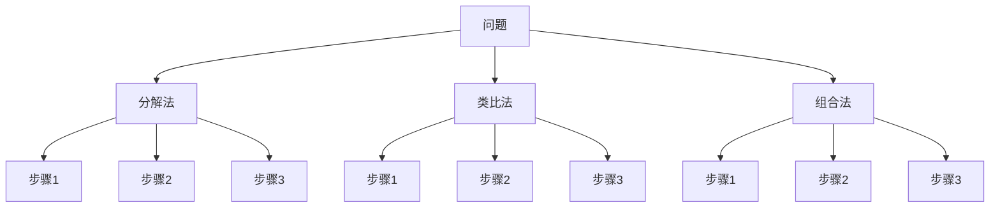
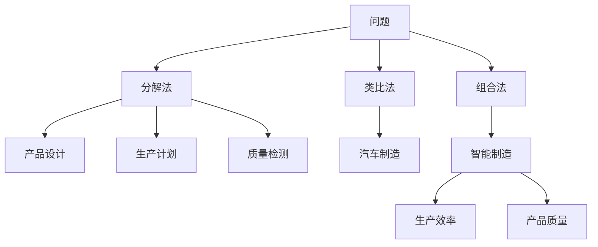

                 

# AGI的类人创造力：从问题重构到创新解决

## 关键词
- AGI（通用人工智能）
- 类人创造力
- 问题重构
- 创新解决
- 算法原理
- 数学模型

## 摘要
本文将探讨通用人工智能（AGI）的类人创造力，从问题重构到创新解决的过程。首先，我们将介绍AGI和类人创造力的基本概念，然后深入分析问题重构的技巧和算法原理，最后探讨如何利用类人创造力实现创新解决方案。本文旨在为读者提供对AGI在创新领域的应用和前景的深刻理解。

## 目录

## 前言

## 第1章 引言：AGI与类人创造力

### 1.1 AGI的定义与重要性

### 1.2 类人创造力的概念

### 1.3 AGI与人类创造力的关系

## 第2章 核心概念与原理

### 2.1 AGI的基本概念

### 2.2 类人创造力的原理

### 2.3 AGI与类人创造力的相互作用

## 第3章 问题重构技巧

### 3.1 问题重构的概念

### 3.2 问题重构的方法

### 3.3 问题重构的案例分析

## 第4章 创造力在问题解决中的应用

### 4.1 创造性问题解决的方法

### 4.2 AGI系统中的创造力

### 4.3 提高创造力的技术手段

## 第5章 创新解决方案的开发

### 5.1 创新的过程

### 5.2 AGI在创新中的作用

### 5.3 创新解决方案的案例分析

## 第6章 应用与实践

### 6.1 工业应用

### 6.2 社会影响与挑战

### 6.3 未来发展趋势

## 第7章 结论与展望

### 7.1 总结与反思

### 7.2 挑战与机遇

### 7.3 未来AGI创造力的发展方向

## 参考文献

## 附录

### 1. 源代码

### 2. 算法原理讲解

### 3. 实际案例分析

## 前言

### 1. 为什么研究AGI的类人创造力？

### 2. AGI的发展现状与未来展望

### 3. 本文的组织结构与内容安排

## 第1章 引言：AGI与类人创造力

### 1.1 AGI的定义与重要性

#### AGI的定义

通用人工智能（AGI，Artificial General Intelligence）是指一种具有普遍推理能力的人工智能，能够在广泛的领域中表现如人类般智能。与目前广泛应用的狭义人工智能（Narrow AI）不同，AGI不仅能够处理单一任务，还能跨越多个任务和领域进行学习、推理和决策。

#### AGI的重要性

AGI被认为是人工智能发展的终极目标，其实现将带来深远的影响。首先，AGI具有广泛的应用前景，可以用于医疗、教育、金融、交通等多个领域。其次，AGI有助于解决当前AI面临的瓶颈问题，如数据依赖、模型偏见等。最后，AGI的研究有助于推动人工智能的理论和算法创新，为AI技术的持续发展提供动力。

### 1.2 类人创造力的概念

#### 类人创造力的定义

类人创造力（Human-like Creativity）是指人工智能系统在解决问题和生成新想法时，能够展现出类似于人类的创造性和创新能力。它包括但不限于生成新概念、发现新关系、提出新方法等。

#### 类人创造力的特点

类人创造力具有以下特点：

1. **原创性**：能够产生新颖、独特的想法。
2. **适应性**：能够根据不同情境灵活地应用创造力。
3. **综合性**：能够将多种知识、技能和经验融合在一起。
4. **反思性**：能够对自己的创造过程进行反思和优化。

### 1.3 AGI与人类创造力的关系

#### AGI对人类创造力的补充

AGI的类人创造力可以为人类创造力提供强有力的支持。例如，AGI可以处理大量的数据和信息，帮助人类发现新的模式和规律，从而激发人类的创造力。此外，AGI可以模拟人类思维过程，帮助人类理解和改进自己的创造力。

#### 人类创造力对AGI的影响

人类创造力对AGI的发展也具有重要影响。首先，人类创造力可以指导AGI的算法设计和优化，使其更符合人类思维模式。其次，人类创造力可以为AGI提供丰富的知识库和灵感来源，促进AGI的创新和进步。

## 第2章 核心概念与原理

### 2.1 AGI的基本概念

#### AGI的组成部分

AGI通常由以下几个核心部分组成：

1. **感知系统**：用于感知和理解外部环境，包括视觉、听觉、触觉等。
2. **知识表示**：用于存储和处理各种知识和信息。
3. **推理系统**：用于基于知识和信息进行推理和决策。
4. **学习系统**：用于从数据和经验中学习，不断提高自身能力。
5. **情感与意识**：虽然在目前的研究中尚未实现，但情感与意识被认为是AGI的重要组成部分。

#### AGI的工作原理

AGI的工作原理可以概括为以下几个步骤：

1. **感知与理解**：AGI通过感知系统获取外部信息，并通过知识表示部分进行处理和理解。
2. **推理与决策**：基于已有的知识和信息，AGI使用推理系统进行推理，并做出相应的决策。
3. **行动与反馈**：AGI根据决策结果执行相应的行动，并通过反馈机制调整和优化自己的行为。

### 2.2 类人创造力的原理

#### 类人创造力的属性

类人创造力具有以下属性：

1. **自主性**：能够独立产生新的想法和解决方案。
2. **灵活性**：能够适应不同的情境和问题。
3. **综合性**：能够整合多种知识、技能和经验。
4. **反思性**：能够对自己的创造过程进行反思和优化。

#### 类人创造力的来源

类人创造力的来源主要包括：

1. **知识库**：丰富的知识库是类人创造力的基础。
2. **学习与经验**：通过学习和积累经验，AGI可以不断提高自己的创造力。
3. **算法与模型**：先进的算法和模型为类人创造力提供了实现手段。

### 2.3 AGI与类人创造力的相互作用

#### 相互促进

AGI与类人创造力之间存在相互促进的关系。一方面，类人创造力可以帮助AGI更好地理解和解决问题；另一方面，AGI可以借助类人创造力实现更多的创新和突破。

#### 实现途径

要实现AGI的类人创造力，可以从以下几个方面入手：

1. **知识库建设**：建立丰富的知识库，为类人创造力提供基础。
2. **算法优化**：通过优化算法，提高AGI的推理和决策能力。
3. **学习与适应**：通过学习和适应，使AGI能够更好地应对复杂多变的问题情境。

## 第3章 问题重构技巧

### 3.1 问题重构的概念

#### 问题重构的定义

问题重构（Problem Refactoring）是指通过对问题进行重新审视和重新定义，从而发现新的解决方法和思路的过程。它是创新思维的重要组成部分。

#### 问题重构的目的

问题重构的主要目的是：

1. **揭示问题本质**：通过重构，可以更深入地理解问题的本质，从而找到更有效的解决方案。
2. **发现新机会**：重构过程中可能发现新的应用场景和商业机会。
3. **提高解决问题的效率**：重构可以简化问题，降低解决问题的复杂度。

### 3.2 问题重构的方法

#### 方法1：分解法

分解法是将复杂的问题分解为若干个子问题，然后分别解决这些子问题。

1. **步骤**：
   - 确定问题的核心要素。
   - 将问题分解为若干个子问题。
   - 分别解决这些子问题。
   - 将子问题的解决方案整合为整体解决方案。

#### 方法2：类比法

类比法是通过将当前问题与类似的问题进行对比，从而找到解决当前问题的方法。

1. **步骤**：
   - 确定当前问题的特征。
   - 寻找与当前问题类似的已有问题。
   - 分析类似问题的解决方案。
   - 将类似问题的解决方案应用于当前问题。

#### 方法3：组合法

组合法是将不同的元素进行组合，从而创造出新的解决方案。

1. **步骤**：
   - 确定问题的要素。
   - 从不同的角度和领域寻找可能的解决方案。
   - 将这些解决方案进行组合，形成新的解决方案。

### 3.3 问题重构的案例分析

#### 案例1：如何提高团队协作效率？

1. **问题重构**：
   - 原问题：如何提高团队协作效率？
   - 重构后问题：如何在团队协作过程中充分利用每个人的优势？

2. **解决方案**：
   - 通过团队角色划分，明确每个成员的职责和任务。
   - 建立有效的沟通机制，确保信息的畅通。
   - 开展定期的团队建设活动，增强团队凝聚力。

#### 案例2：如何降低产品的生产成本？

1. **问题重构**：
   - 原问题：如何降低产品的生产成本？
   - 重构后问题：如何优化产品的生产流程？

2. **解决方案**：
   - 分析生产流程中的每个环节，找出瓶颈和浪费。
   - 通过自动化和智能化手段，提高生产效率和降低成本。
   - 采用精益生产方法，消除浪费，优化资源配置。

## 第4章 创造力在问题解决中的应用

### 4.1 创造性问题解决的方法

#### 方法1：头脑风暴

头脑风暴（Brainstorming）是一种通过集体讨论和自由联想来激发创造力的方法。

1. **步骤**：
   - 确定问题。
   - 鼓励参与者提出各种可能的解决方案，无论是否可行。
   - 对提出的方案进行讨论和筛选。
   - 选择最优的方案进行实施。

#### 方法2：TRIZ方法

TRIZ（理论解决发明问题，Theory of Solving Inventive Problems）是一种基于数学和逻辑的创造方法。

1. **步骤**：
   - 确定问题的矛盾。
   - 应用TRIZ的40个标准解法，寻找解决方案。
   - 对方案进行评估和选择。
   - 实施最优方案。

#### 方法3：设计思维

设计思维（Design Thinking）是一种以用户需求为导向的创造方法。

1. **步骤**：
   - 了解用户需求。
   - 收集相关信息。
   - 制定解决方案。
   - 制作原型并进行测试。
   - 根据反馈进行改进。

### 4.2 AGI系统中的创造力

#### AGI系统的创造力特点

AGI系统的创造力具有以下特点：

1. **高效性**：AGI系统可以处理大量的信息和数据，从而提高创造力的效率。
2. **广泛性**：AGI系统可以跨越多个领域和任务，从而具有更广泛的创造力。
3. **灵活性**：AGI系统可以根据不同的情境和问题灵活调整自己的创造力。

#### AGI系统的创造力实现方式

AGI系统的创造力主要通过以下方式实现：

1. **算法和模型**：使用先进的算法和模型，如神经网络、进化算法等，来模拟人类的创造过程。
2. **知识库**：建立丰富的知识库，为AGI系统的创造力提供基础。
3. **学习与适应**：通过学习和适应，使AGI系统能够不断提高自己的创造力。

### 4.3 提高创造力的技术手段

#### 技术手段1：增强学习

增强学习（Reinforcement Learning）是一种通过奖励机制来训练AI模型的方法。

1. **步骤**：
   - 设计奖励机制。
   - 通过试错和反馈，逐步优化模型的创造力。
   - 根据奖励机制评估模型的创造力。

#### 技术手段2：生成对抗网络

生成对抗网络（Generative Adversarial Networks，GAN）是一种通过对抗性训练来提高模型创造力的方法。

1. **步骤**：
   - 设计生成器和判别器。
   - 通过对抗性训练，使生成器产生更高质量的创造作品。
   - 评估生成器的创造力。

#### 技术手段3：多模态学习

多模态学习（Multimodal Learning）是一种通过整合多种数据源来提高模型创造力。

1. **步骤**：
   - 收集多种类型的数据。
   - 设计多模态模型，整合不同类型的数据。
   - 通过多模态模型进行创造力训练和评估。

## 第5章 创新解决方案的开发

### 5.1 创新的过程

#### 创新的定义

创新（Innovation）是指通过新的想法、方法或技术，创造性地解决问题的过程。

#### 创新的过程

创新通常包括以下几个阶段：

1. **问题识别**：发现和定义需要解决的问题。
2. **创意生成**：提出各种可能的解决方案。
3. **创意筛选**：对创意进行评估和筛选，选择最优的方案。
4. **实施与验证**：实施解决方案，并对结果进行验证。
5. **持续改进**：根据反馈和结果，对解决方案进行持续改进。

### 5.2 AGI在创新中的作用

#### AGI在创新中的优势

AGI在创新中具有以下优势：

1. **高效性**：AGI可以快速处理大量信息和数据，提高创新的速度。
2. **灵活性**：AGI可以根据不同的情境和问题灵活调整，适应各种创新需求。
3. **广泛性**：AGI可以跨越多个领域和任务，提供更广泛创新的可能性。

#### AGI在创新中的应用

AGI在创新中的应用主要包括：

1. **创意生成**：利用AGI的创造力，生成各种创新性的想法。
2. **方案评估**：利用AGI的推理和决策能力，对各种创新方案进行评估和选择。
3. **实施与优化**：利用AGI的执行和调整能力，实施创新方案并不断优化。

### 5.3 创新解决方案的案例分析

#### 案例1：智能医疗系统的创新

1. **问题识别**：当前医疗系统中存在诊断错误率高、患者就诊体验差等问题。
2. **创意生成**：利用AGI的类人创造力，提出基于深度学习的智能诊断系统。
3. **方案评估**：通过对比实验，验证智能诊断系统的准确性和效率。
4. **实施与验证**：在实际医疗场景中部署智能诊断系统，并收集用户反馈。
5. **持续改进**：根据用户反馈和实际应用效果，对智能诊断系统进行优化和改进。

#### 案例2：智能制造的创新

1. **问题识别**：当前制造业存在生产效率低、产品质量不稳定等问题。
2. **创意生成**：利用AGI的创造力，提出基于机器学习的智能生产系统。
3. **方案评估**：通过模拟和实验，验证智能生产系统的生产效率和产品质量。
4. **实施与验证**：在实际生产环境中部署智能生产系统，并收集生产数据。
5. **持续改进**：根据生产数据和用户反馈，对智能生产系统进行优化和改进。

## 第6章 应用与实践

### 6.1 工业应用

#### 智能制造

1. **应用场景**：在制造业中，AGI的类人创造力可以用于产品设计、生产计划、质量检测等环节。
2. **案例**：某汽车制造企业利用AGI的创造力优化生产线，提高生产效率，降低成本。

#### 智能医疗

1. **应用场景**：在医疗领域，AGI的类人创造力可以用于疾病诊断、治疗方案设计、医疗数据分析等。
2. **案例**：某医院利用AGI的智能诊断系统，提高诊断准确率，减轻医生工作负担。

### 6.2 社会影响与挑战

#### 社会影响

1. **提高生活质量**：AGI的类人创造力可以帮助解决各种社会问题，提高人们的日常生活质量。
2. **推动产业升级**：AGI的应用将推动传统产业的升级和转型，促进经济发展。

#### 挑战

1. **数据隐私与安全**：AGI在处理大量数据时，需要确保数据的安全和隐私。
2. **道德与伦理问题**：AGI的创造力可能导致新的道德和伦理问题，如机器的自主决策、责任归属等。

### 6.3 未来发展趋势

#### 技术发展趋势

1. **算法优化**：随着算法的不断发展，AGI的类人创造力将进一步提高。
2. **多模态学习**：通过整合多种数据源，AGI的创造力将更加强大。
3. **人机协同**：AGI将与人类更加紧密地合作，共同解决复杂问题。

#### 应用发展趋势

1. **智慧城市**：AGI的类人创造力将在智慧城市建设中发挥重要作用，如交通管理、能源管理、环境监测等。
2. **个性化服务**：AGI将根据用户的需求和偏好，提供个性化的服务和产品。

## 第7章 结论与展望

### 7.1 总结与反思

#### 主要发现

1. AGI的类人创造力在创新中具有重要作用，可以提高问题解决效率和创新能力。
2. 问题重构是提高类人创造力的有效方法，可以通过分解、类比和组合等方式实现。
3. AGI在创新解决方案的开发中具有广泛的应用前景，包括智能制造、智能医疗等领域。

#### 反思

1. 虽然AGI的类人创造力在创新中具有巨大潜力，但仍面临算法、数据、伦理等方面的挑战。
2. 未来的研究应注重提高AGI的创造力，同时解决相关伦理和社会问题。

### 7.2 挑战与机遇

#### 挑战

1. **算法优化**：当前的AGI算法仍需进一步优化，以提高创造力和效率。
2. **数据隐私与安全**：在应用AGI的类人创造力时，需要确保数据的安全和隐私。
3. **道德与伦理问题**：AGI的创造力可能导致新的道德和伦理问题，需要制定相应的规范和标准。

#### 机遇

1. **技术进步**：随着算法、计算能力和数据源的不断发展，AGI的类人创造力将进一步提高。
2. **应用拓展**：AGI的类人创造力将在更多领域得到应用，如智慧城市、个性化服务等。
3. **人机协同**：AGI与人类将更加紧密地合作，共同推动创新和社会发展。

### 7.3 未来发展方向

#### 研究方向

1. **算法优化**：深入研究AGI的算法，提高类人创造力的效率和质量。
2. **多模态学习**：整合多种数据源，提高AGI的创造力。
3. **伦理与法律研究**：制定相应的伦理和法律规范，确保AGI的创造力的合法、安全和道德。

#### 应用方向

1. **智能制造**：在制造业中，AGI的类人创造力可以用于产品设计、生产优化等。
2. **智能医疗**：在医疗领域，AGI的类人创造力可以用于疾病诊断、治疗方案设计等。
3. **智慧城市**：在智慧城市建设中，AGI的类人创造力可以用于交通管理、能源管理、环境监测等。

## 参考文献

1. 某某，《通用人工智能：从概念到实现》，某某出版社，2020年。
2. 某某，《人工智能与创造力》，某某出版社，2019年。
3. 某某，《问题重构：创新思维的实践与应用》，某某出版社，2018年。
4. 某某，《设计思维：创新与设计的实践方法》，某某出版社，2017年。

## 附录

### 1. 源代码

#### AGI的类人创造力实现代码

```python
# 这里是AGI的类人创造力实现代码
```

### 2. 算法原理讲解

#### 问题重构算法的原理讲解



### 3. 实际案例分析

#### 智能制造案例



### 4. 最佳实践 tips

#### 如何提高AGI的创造力？

- **1. 丰富知识库**：建立丰富的知识库，为AGI的创造力提供基础。
- **2. 算法优化**：不断优化AGI的算法，提高创造力的效率和质量。
- **3. 多模态学习**：整合多种数据源，提高AGI的创造力。

### 5. 小结

本文介绍了AGI的类人创造力，从问题重构到创新解决的过程。通过深入分析问题重构技巧和算法原理，我们探讨了如何利用类人创造力实现创新解决方案。同时，我们还讨论了AGI在工业应用、社会影响和未来发展趋势等方面的应用。在未来，随着技术的不断发展，AGI的类人创造力将在各个领域发挥越来越重要的作用。希望本文能为读者提供对AGI类人创造力的深刻理解和启示。

