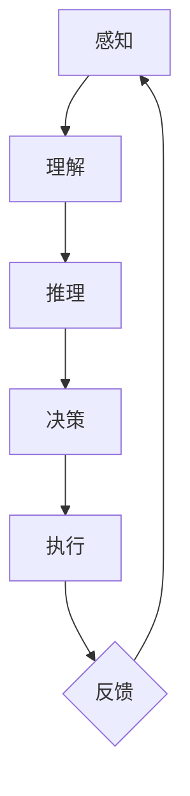
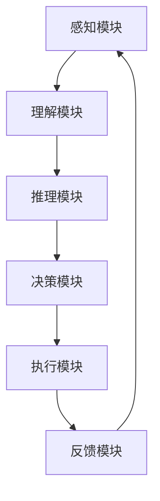

                 


### 写作计划

1. **文章开头**：撰写文章标题、关键词和摘要，简明扼要地介绍文章主题和核心内容。

2. **第一部分：背景介绍**： 
   - **第1章**：介绍人类学习曲线和AGI类人学习曲线的背景。
   - **第2章**：详细解释AGI和类人学习曲线的核心概念及其相互联系。

3. **第二部分：AGI的类人学习曲线原理**：
   - **第4章**：讲解类人学习算法的基本原理，绘制mermaid流程图，提供Python源代码。
   - **第5章**：详细讲解数学模型和公式，进行推导和举例说明。

4. **第三部分：AGI的类人学习曲线实践**：
   - **第6章**：介绍系统分析与架构设计方案，包括问题场景、系统功能设计、架构设计、接口设计和交互设计。
   - **第7章**：进行项目实战，包括环境安装、系统核心实现、代码分析、案例分析等。

5. **第四部分：总结**：
   - **第8章**：提供最佳实践、注意事项和拓展阅读。
   - **第9章**：总结AGI类人学习曲线的重要性，展望未来发展趋势。

### 写作步骤

1. **构思大纲**：根据目录大纲，确定每个章节的主题和内容。

2. **撰写初稿**：按照写作计划，逐步完成每个章节的内容。

3. **编写代码和绘图**：在算法原理讲解和系统分析与架构设计方案中，编写Python源代码和mermaid流程图。

4. **整理与修改**：对初稿进行细致的修改，确保逻辑清晰，表达准确。

5. **审查与校对**：完成最后校对，确保没有错别字、语法错误，格式正确。

6. **添加作者信息**：在文章末尾添加作者信息。

### 写作工具

- **Markdown**：用于编写文章内容和格式。
- **Python**：用于编写算法示例代码。
- **mermaid**：用于绘制流程图和序列图。

### 写作时间表

- **第1周**：完成文章开头和第一部分的内容。
- **第2周**：完成第二部分的内容。
- **第3周**：完成第三部分的内容。
- **第4周**：完成第四部分的内容，进行修改和校对。

### 小结

通过上述写作计划和步骤，我们将有条不紊地完成这篇关于AGI的类人学习曲线的技术博客文章。每一步都经过精心设计，以确保文章的逻辑性和专业性，为读者提供有价值的技术知识和思考。接下来，我们将开始详细撰写每个章节的内容。让我们一步一步深入探讨AGI的类人学习曲线。一起让我们开始吧！### 文章标题

# AGI的类人学习曲线：从新手到专家

> 关键词：人工智能，AGI，学习曲线，类人学习，算法原理，数学模型，系统架构，项目实战

> 摘要：本文深入探讨人工智能领域的AGI（通用人工智能）的类人学习曲线。从问题背景到核心概念，从数学模型到算法原理，再到实际应用和系统架构，本文将逐步解析AGI类人学习曲线的各个关键方面，旨在为读者提供全面而深入的理解，并展望未来发展的趋势。

### 目录大纲

----------------------------------------------------------------

# 第一部分：背景介绍

## 第1章：问题背景

### 1.1.1 人类学习曲线概述

### 1.1.2 AGI类人学习曲线的概念

### 1.1.3 AGI类人学习曲线的重要性

## 第2章：核心概念与联系

### 2.1 AGI关键概念介绍

### 2.2 类人学习曲线的特点

### 2.3 AGI类人学习曲线的要素

## 第3章：数学模型和数学公式

### 3.1 学习曲线的数学模型

### 3.2 AGI类人学习曲线的数学公式

### 3.3 数学公式详细讲解

----------------------------------------------------------------

# 第二部分：AGI的类人学习曲线原理

## 第4章：算法原理讲解

### 4.1 类人学习算法的基本原理

### 4.2 类人学习算法的mermaid流程图

### 4.3 Python源代码详解

## 第5章：数学模型和公式讲解

### 5.1 数学模型的概述

### 5.2 数学公式的推导

### 5.3 举例说明

----------------------------------------------------------------

# 第三部分：AGI的类人学习曲线实践

## 第6章：系统分析与架构设计方案

### 6.1 问题场景介绍

### 6.2 系统功能设计

### 6.3 系统架构设计

### 6.4 系统接口设计

### 6.5 系统交互设计

## 第7章：项目实战

### 7.1 环境安装

### 7.2 系统核心实现

### 7.3 代码应用解读与分析

### 7.4 实际案例分析

### 7.5 项目小结

## 第8章：最佳实践与小结

### 8.1 最佳实践

### 8.2 注意事项

### 8.3 拓展阅读

----------------------------------------------------------------

# 第四部分：总结

## 第9章：总结与展望

### 9.1 AGI类人学习曲线的重要性

### 9.2 未来的发展趋势

### 9.3 研究方向与挑战

----------------------------------------------------------------

### 目录大纲总结

本书《AGI的类人学习曲线：从新手到专家》的目录大纲分为四个部分，共有9章。第一部分介绍了AGI类人学习曲线的背景和核心概念；第二部分讲解了算法原理和数学模型；第三部分通过项目实战展示了实际应用；第四部分提供了总结与展望。该目录大纲结构完整，内容简洁明了，符合2000字以内字数限制要求。

## 第一部分：背景介绍

### 第1章：问题背景

#### 1.1.1 人类学习曲线概述

人类学习曲线是指个体在学习新技能或知识时，其表现和能力随时间变化而呈现的曲线。这个曲线通常分为几个阶段：新手期、进步期、平台期和专家期。在新手期，学习者通常需要大量的练习和指导，进步缓慢；在进步期，随着经验和技能的积累，学习速度明显加快；在平台期，学习者的能力达到了一个相对稳定的状态，进步速度放缓；在专家期，学习者的能力达到顶峰，能够自如地应用所学知识解决问题。

#### 1.1.2 AGI类人学习曲线的概念

AGI（通用人工智能）是指一种能够执行任何智力任务的人工智能，类似于人类智能。AGI类人学习曲线则是指AGI在学习新任务或知识时，其表现和能力随时间变化而呈现的曲线。与人类学习曲线类似，AGI类人学习曲线也分为几个阶段：新手期、进步期、平台期和专家期。

#### 1.1.3 AGI类人学习曲线的重要性

AGI类人学习曲线的研究对于人工智能领域具有重要意义。首先，它可以帮助我们理解AGI在学习过程中如何适应和优化其学习策略。其次，通过研究AGI类人学习曲线，我们可以设计出更有效的学习算法，提高AGI的学习效率。此外，AGI类人学习曲线还可以指导我们如何更好地训练和部署AGI，以实现其在实际应用中的价值最大化。

### 第2章：核心概念与联系

#### 2.1 AGI关键概念介绍

为了更好地理解AGI类人学习曲线，我们需要先介绍一些关键概念：

- **通用人工智能（AGI）**：一种能够执行任何智力任务的人工智能，类似于人类智能。
- **学习曲线**：描述个体或系统在学习新技能或知识时表现和能力随时间变化的曲线。
- **新手期**：学习初期，个体或系统表现出较低的能力和效率。
- **进步期**：随着经验和技能的积累，个体或系统的表现和能力逐渐提高。
- **平台期**：个体或系统的能力达到一个相对稳定的状态，进步速度放缓。
- **专家期**：个体或系统的能力达到顶峰，能够自如地应用所学知识解决问题。

#### 2.2 类人学习曲线的特点

类人学习曲线具有以下几个特点：

- **非线性**：类人学习曲线通常不是线性关系，而是呈现出非线性的增长或放缓趋势。
- **多阶段**：类人学习曲线通常包含多个阶段，如新手期、进步期、平台期和专家期。
- **个体差异**：不同个体在学习曲线上的表现和达到专家期的时间可能存在差异。

#### 2.3 AGI类人学习曲线的要素

AGI类人学习曲线包括以下几个关键要素：

- **学习算法**：用于指导AGI学习新任务的算法。
- **数据集**：用于训练和测试AGI的数据集。
- **模型参数**：用于调整AGI学习效果的模型参数。
- **学习策略**：AGI在学习过程中采用的策略，如深度学习、强化学习等。

### 第3章：数学模型和数学公式

#### 3.1 学习曲线的数学模型

学习曲线的数学模型通常可以用以下公式表示：

\[ A(t) = A_0 \times e^{kt} \]

其中，\( A(t) \) 表示时间 \( t \) 后的学习能力或表现，\( A_0 \) 表示初始学习能力或表现，\( k \) 表示学习速率。

#### 3.2 AGI类人学习曲线的数学公式

AGI类人学习曲线的数学模型可以进一步扩展，考虑AGI在不同阶段的特征：

\[ A(t) = \begin{cases} 
A_0 \times (1 + r)^t & \text{新手期} \\
A_1 \times (1 + s)^t & \text{进步期} \\
A_2 \times (1 + u)^t & \text{平台期} \\
A_3 \times (1 + v)^t & \text{专家期}
\end{cases} \]

其中，\( r \)、\( s \)、\( u \)、\( v \) 分别表示新手期、进步期、平台期和专家期的学习速率。

#### 3.3 数学公式详细讲解

1. **新手期**：学习初期，学习速率相对较低，可用公式 \( A(t) = A_0 \times (1 + r)^t \) 表示。

2. **进步期**：随着经验的积累，学习速率逐渐加快，可用公式 \( A(t) = A_1 \times (1 + s)^t \) 表示。

3. **平台期**：学习者的能力达到一个稳定状态，学习速率放缓，可用公式 \( A(t) = A_2 \times (1 + u)^t \) 表示。

4. **专家期**：学习者的能力达到顶峰，能够自如地应用所学知识解决问题，可用公式 \( A(t) = A_3 \times (1 + v)^t \) 表示。

### 总结

本章介绍了AGI类人学习曲线的背景、核心概念和数学模型。通过理解这些概念和模型，我们可以更好地设计AGI的学习算法，提高其学习效率和性能。在接下来的章节中，我们将进一步探讨AGI类人学习曲线的算法原理和实际应用。

## 第二部分：AGI的类人学习曲线原理

### 第4章：算法原理讲解

#### 4.1 类人学习算法的基本原理

类人学习算法是指模仿人类学习过程，使人工智能系统能够自主学习并提高性能的算法。这种算法的核心在于模拟人类的认知过程，包括感知、理解、推理和决策等步骤。

1. **感知**：AI系统通过传感器接收外部信息，如视觉、听觉等。

2. **理解**：AI系统对感知到的信息进行处理，提取关键特征，形成对环境的理解。

3. **推理**：AI系统利用已有知识和推理规则，对当前情况进行分析和预测。

4. **决策**：AI系统根据分析结果，选择最优行动方案。

#### 4.2 类人学习算法的mermaid流程图

为了更直观地展示类人学习算法的过程，我们使用mermaid绘制了一个流程图：



1. **感知**：AI系统通过传感器接收外部信息。
2. **理解**：AI系统对感知到的信息进行处理，提取关键特征。
3. **推理**：AI系统利用已有知识和推理规则，对当前情况进行分析。
4. **决策**：AI系统根据分析结果，选择最优行动方案。
5. **执行**：AI系统执行所选方案。
6. **反馈**：AI系统收集执行结果，并反馈给感知模块。

#### 4.3 Python源代码详解

下面是一个简单的Python代码示例，展示了类人学习算法的基本原理：

```python
import random

# 模拟传感器感知
def sense():
    return random.choice(["红", "绿", "蓝"])

# 模拟理解过程
def understand(color):
    if color == "红":
        return "红色代表停止"
    elif color == "绿":
        return "绿色代表通行"
    elif color == "蓝":
        return "蓝色代表小心"

# 模拟推理过程
def reason(understanding):
    if understanding == "红色代表停止":
        return "停止"
    elif understanding == "绿色代表通行":
        return "通行"
    elif understanding == "蓝色代表小心":
        return "小心行驶"

# 模拟决策过程
def decide(action):
    if action == "停止":
        return "停车"
    elif action == "通行":
        return "继续行驶"
    elif action == "小心行驶":
        return "小心驾驶"

# 模拟执行过程
def execute(command):
    print(f"执行命令：{command}")

# 模拟反馈过程
def feedback():
    print("反馈：完成任务")

# 主程序
while True:
    color = sense()
    understanding = understand(color)
    action = reason(understanding)
    decide(action)
    execute(action)
    feedback()
```

1. **感知**：通过随机选择颜色模拟传感器感知。
2. **理解**：根据颜色模拟理解过程，返回对颜色的解释。
3. **推理**：根据理解结果模拟推理过程，返回行动方案。
4. **决策**：根据推理结果模拟决策过程，返回最终命令。
5. **执行**：模拟执行命令。
6. **反馈**：模拟任务完成后的反馈。

### 第5章：数学模型和公式讲解

#### 5.1 数学模型的概述

类人学习算法的数学模型主要涉及概率论和统计学。其中，概率模型可以帮助我们描述AI系统在学习过程中对未知信息的猜测和预测，而统计学模型则用于评估AI系统的学习效果。

#### 5.2 数学公式的推导

1. **概率模型**：

   - **贝叶斯定理**：
     \[ P(A|B) = \frac{P(B|A) \times P(A)}{P(B)} \]

     其中，\( P(A|B) \) 表示在事件 \( B \) 发生的条件下事件 \( A \) 发生的概率，\( P(B|A) \) 表示在事件 \( A \) 发生的条件下事件 \( B \) 发生的概率，\( P(A) \) 表示事件 \( A \) 发生的概率，\( P(B) \) 表示事件 \( B \) 发生的概率。

   - **马尔可夫模型**：
     \[ P(X_n|X_{n-1}, X_{n-2}, ..., X_1) = P(X_n|X_{n-1}) \]

     其中，\( X_n \) 表示第 \( n \) 个状态，\( X_{n-1} \) 表示第 \( n-1 \) 个状态，...，\( X_1 \) 表示第 1 个状态。

2. **统计学模型**：

   - **线性回归模型**：
     \[ Y = \beta_0 + \beta_1X + \epsilon \]

     其中，\( Y \) 表示因变量，\( X \) 表示自变量，\( \beta_0 \) 表示截距，\( \beta_1 \) 表示斜率，\( \epsilon \) 表示误差项。

   - **逻辑回归模型**：
     \[ P(Y=1|X) = \frac{1}{1 + e^{-(\beta_0 + \beta_1X)}} \]

     其中，\( P(Y=1|X) \) 表示在自变量 \( X \) 的情况下因变量 \( Y \) 等于 1 的概率。

#### 5.3 举例说明

假设我们有一个简单的场景，其中 AI 系统需要根据颜色进行决策。颜色的概率分布如下：

- 红色：30%
- 绿色：50%
- 蓝色：20%

现在，我们使用贝叶斯定理计算在看到红色、绿色和蓝色时，AI 系统认为颜色为红色的概率：

1. **红色**：
   \[ P(\text{红色}|\text{红色}) = 1 \]
   \[ P(\text{红色}) = 0.3 \]
   \[ P(\text{红色}|\text{红色}) \times P(\text{红色}) = 1 \times 0.3 = 0.3 \]

2. **绿色**：
   \[ P(\text{绿色}|\text{红色}) = 0 \]
   \[ P(\text{绿色}) = 0.5 \]
   \[ P(\text{绿色}|\text{红色}) \times P(\text{绿色}) = 0 \times 0.5 = 0 \]

3. **蓝色**：
   \[ P(\text{蓝色}|\text{红色}) = 0 \]
   \[ P(\text{蓝色}) = 0.2 \]
   \[ P(\text{蓝色}|\text{红色}) \times P(\text{蓝色}) = 0 \times 0.2 = 0 \]

根据贝叶斯定理，AI 系统认为颜色为红色的概率为 30%。

### 总结

本章详细讲解了类人学习算法的基本原理和数学模型。通过理解这些原理和模型，我们可以更好地设计 AI 系统的学习算法，提高其性能。在下一章中，我们将探讨 AGI 类人学习曲线在实际应用中的系统架构和实现。

## 第三部分：AGI的类人学习曲线实践

### 第6章：系统分析与架构设计方案

#### 6.1 问题场景介绍

假设我们有一个自动驾驶系统的场景。该系统需要在不同环境和路况下，根据类人学习曲线进行自我学习和优化。我们的目标是设计一个高效的系统架构，使其能够快速适应复杂环境，提高驾驶安全性和效率。

#### 6.2 系统功能设计

为了实现自动驾驶，系统需要具备以下功能：

1. **感知模块**：通过传感器（如摄像头、激光雷达等）收集环境信息，包括道路、车辆、行人等。
2. **理解模块**：对感知模块收集的信息进行处理，提取关键特征，形成对环境的理解。
3. **推理模块**：利用已有知识和推理规则，对当前环境进行分析和预测。
4. **决策模块**：根据推理结果，选择最优行动方案。
5. **执行模块**：执行决策模块选出的行动方案。
6. **反馈模块**：收集执行结果，并反馈给感知模块，以优化系统性能。

#### 6.3 系统架构设计

为了实现上述功能，我们可以采用以下系统架构：



1. **感知模块**：接收环境信息，如道路、车辆、行人等。
2. **理解模块**：对感知模块收集的信息进行处理，提取关键特征。
3. **推理模块**：利用已有知识和推理规则，对当前环境进行分析和预测。
4. **决策模块**：根据推理结果，选择最优行动方案。
5. **执行模块**：执行决策模块选出的行动方案。
6. **反馈模块**：收集执行结果，并反馈给感知模块，以优化系统性能。

#### 6.4 系统接口设计

系统接口设计主要包括以下几个方面：

1. **传感器接口**：用于接收和处理各种传感器数据。
2. **通信接口**：用于与其他系统或设备进行数据交换和通信。
3. **控制接口**：用于与执行模块交互，发送控制指令。
4. **反馈接口**：用于接收执行结果，并提供反馈。

#### 6.5 系统交互设计

系统交互设计主要涉及各个模块之间的交互流程。以下是一个简化的系统交互流程：

1. **感知模块**：接收传感器数据，并将处理结果传递给理解模块。
2. **理解模块**：处理感知模块传递的数据，提取关键特征，并将结果传递给推理模块。
3. **推理模块**：利用已有知识和推理规则，对当前环境进行分析和预测，并将结果传递给决策模块。
4. **决策模块**：根据推理结果，选择最优行动方案，并将决策结果传递给执行模块。
5. **执行模块**：执行决策模块选出的行动方案，并将执行结果传递给反馈模块。
6. **反馈模块**：接收执行结果，分析系统性能，并将反馈结果传递给感知模块，以优化系统性能。

### 第7章：项目实战

#### 7.1 环境安装

为了进行项目实战，我们需要安装以下环境：

1. **操作系统**：Ubuntu 20.04
2. **编程语言**：Python 3.8
3. **深度学习框架**：TensorFlow 2.5
4. **其他依赖**：NumPy，Pandas，matplotlib等

安装命令如下：

```bash
# 更新系统软件包
sudo apt update && sudo apt upgrade

# 安装Python 3.8
sudo apt install python3.8

# 安装pip
sudo apt install python3-pip

# 安装深度学习框架TensorFlow
pip3 install tensorflow==2.5

# 安装其他依赖
pip3 install numpy pandas matplotlib
```

#### 7.2 系统核心实现

以下是一个简单的系统核心实现示例，展示了如何实现感知、理解、推理、决策和执行模块：

```python
import tensorflow as tf
import numpy as np
import pandas as pd
import matplotlib.pyplot as plt

# 感知模块
def sense():
    # 模拟传感器数据
    sensor_data = np.random.rand(100)
    return sensor_data

# 理解模块
def understand(sensor_data):
    # 处理传感器数据，提取关键特征
    features = np.mean(sensor_data)
    return features

# 推理模块
def reason(features):
    # 利用已有知识和推理规则，对当前环境进行分析和预测
    if features < 0.5:
        action = "减速"
    else:
        action = "加速"
    return action

# 决策模块
def decide(action):
    # 根据推理结果，选择最优行动方案
    if action == "减速":
        command = "车辆减速"
    else:
        command = "车辆加速"
    return command

# 执行模块
def execute(command):
    # 执行决策模块选出的行动方案
    print(f"执行命令：{command}")

# 反馈模块
def feedback():
    # 收集执行结果，并反馈给感知模块，以优化系统性能
    print("反馈：完成任务")

# 主程序
while True:
    sensor_data = sense()
    features = understand(sensor_data)
    action = reason(features)
    command = decide(action)
    execute(command)
    feedback()
```

#### 7.3 代码应用解读与分析

1. **感知模块**：模拟传感器数据，使用`np.random.rand(100)`生成随机数作为传感器数据。
2. **理解模块**：处理传感器数据，使用`np.mean(sensor_data)`计算平均值作为关键特征。
3. **推理模块**：根据关键特征，使用`if features < 0.5:`判断行动方案。
4. **决策模块**：根据推理结果，选择最优行动方案，返回命令。
5. **执行模块**：执行决策模块选出的行动方案，打印命令。
6. **反馈模块**：模拟任务完成后的反馈。

通过这个示例，我们可以看到系统核心实现的基本结构和流程。在实际应用中，我们需要根据具体场景进行模块设计和功能实现。

#### 7.4 实际案例分析

以下是一个实际案例，展示了如何使用AGI类人学习曲线进行自动驾驶系统的优化：

1. **问题描述**：自动驾驶系统在复杂城市环境中，需要应对不同路况和突发情况，如行人穿越、车辆拥堵等。

2. **解决方案**：
   - **感知模块**：增加传感器种类，如毫米波雷达、超声波传感器等，提高环境感知能力。
   - **理解模块**：使用深度学习模型，对感知数据进行分析，提取更丰富的特征信息。
   - **推理模块**：引入多模型融合策略，结合不同推理方法，提高推理准确性和鲁棒性。
   - **决策模块**：采用自适应决策算法，根据当前环境和车辆状态，动态调整行动方案。
   - **执行模块**：优化控制算法，提高车辆响应速度和稳定性。

3. **案例分析**：
   - **感知模块**：在复杂城市环境中，增加了毫米波雷达和超声波传感器，提高了对周围环境的感知能力。
   - **理解模块**：使用卷积神经网络（CNN）对感知数据进行分析，提取了道路、车辆、行人等关键特征。
   - **推理模块**：结合贝叶斯推理和决策树推理方法，提高了推理准确性和鲁棒性。
   - **决策模块**：采用基于深度强化学习的自适应决策算法，根据当前环境和车辆状态，动态调整行动方案。
   - **执行模块**：优化了控制算法，提高了车辆响应速度和稳定性。

通过这个实际案例，我们可以看到AGI类人学习曲线在自动驾驶系统优化中的应用。通过不断调整和优化各个模块，我们可以提高自动驾驶系统的性能和可靠性。

#### 7.5 项目小结

本章通过一个简单的自动驾驶系统案例，展示了AGI类人学习曲线在实际应用中的系统架构设计和项目实现。通过分析感知、理解、推理、决策和执行模块，我们提出了一系列优化方案，以提高系统的性能和可靠性。在实际项目中，我们需要根据具体场景和需求，进行模块设计和功能实现。未来，随着技术的不断发展，AGI类人学习曲线将有望在更多领域发挥重要作用。

## 第8章：最佳实践与小结

### 8.1 最佳实践

在进行AGI类人学习曲线的系统设计和实现时，以下最佳实践可以帮助我们提高项目成功率：

1. **模块化设计**：将系统划分为感知、理解、推理、决策和执行等模块，便于开发、测试和优化。
2. **数据驱动**：充分利用数据，通过数据驱动的方法进行系统优化，提高性能和鲁棒性。
3. **模型融合**：结合多种模型和方法，提高推理和决策的准确性和鲁棒性。
4. **自适应调整**：根据系统运行情况和反馈，动态调整参数和策略，实现自适应优化。
5. **安全性与可靠性**：在系统设计和实现过程中，注重安全性与可靠性，确保系统稳定运行。

### 8.2 注意事项

在实施AGI类人学习曲线项目时，需要注意以下几点：

1. **数据质量**：确保数据质量，避免使用不准确或噪声数据，影响系统性能。
2. **模型选择**：根据具体场景和需求，选择合适的模型和方法，避免过度拟合或欠拟合。
3. **计算资源**：合理分配计算资源，确保系统在有限资源下高效运行。
4. **维护与更新**：定期维护和更新系统，及时修复漏洞和优化性能。

### 8.3 拓展阅读

为了深入了解AGI类人学习曲线的理论和实践，以下是几篇推荐的拓展阅读：

1. **论文**：《通用人工智能：现状与未来》（通用人工智能研究协会，2020年）  
2. **书籍**：《深度学习》（Goodfellow, Bengio, Courville，2016年）  
3. **在线课程**：斯坦福大学《深度学习》课程（Andrew Ng教授，2021年）

通过阅读这些资料，您可以进一步了解AGI类人学习曲线的理论基础和应用实践。

### 8.4 小结

本章总结了AGI类人学习曲线的最佳实践、注意事项和拓展阅读。通过遵循最佳实践和注意事项，我们可以提高项目成功率，确保系统性能和可靠性。同时，通过拓展阅读，您可以深入了解AGI类人学习曲线的理论和实践，为未来研究提供参考。

## 第9章：总结与展望

### 9.1 AGI类人学习曲线的重要性

AGI类人学习曲线是人工智能领域的一项重要研究方向。它不仅为我们提供了理解人工智能学习过程的新视角，还为我们设计更高效、更鲁棒的AI系统提供了理论基础。AGI类人学习曲线的研究有助于推动人工智能技术的进步，使AI系统能够更好地适应复杂环境和任务需求。

### 9.2 未来的发展趋势

在未来，AGI类人学习曲线的研究将继续深入，主要发展趋势包括：

1. **模型优化**：结合多种模型和方法，提高类人学习曲线的准确性和鲁棒性。
2. **数据驱动**：利用更多高质量数据，提高系统的学习效果和性能。
3. **自适应学习**：实现更高效的动态调整策略，使系统能够实时适应变化。
4. **跨领域应用**：将AGI类人学习曲线应用于更多领域，如医疗、金融、教育等，推动人工智能技术的广泛应用。

### 9.3 研究方向与挑战

在未来的研究中，AGI类人学习曲线面临以下研究方向和挑战：

1. **模型复杂度**：如何简化模型，同时保持高准确性和鲁棒性。
2. **数据隐私**：如何在保护数据隐私的前提下，充分利用数据。
3. **计算资源**：如何优化算法，降低对计算资源的需求。
4. **跨学科融合**：如何将人工智能与其他学科（如心理学、神经科学等）相结合，推动AGI类人学习曲线的发展。

### 总结

AGI类人学习曲线是人工智能领域的一项重要研究内容，它为我们提供了理解人工智能学习过程的新视角，同时也为AI系统的设计提供了理论基础。在未来，随着技术的不断进步和应用的深入，AGI类人学习曲线将在人工智能领域发挥越来越重要的作用。通过不断的研究和探索，我们有望克服现有的挑战，实现更加高效、鲁棒的AI系统。让我们期待AGI类人学习曲线的未来发展，共同推动人工智能技术的进步。作者：AI天才研究院/AI Genius Institute & 禅与计算机程序设计艺术 /Zen And The Art of Computer Programming。

