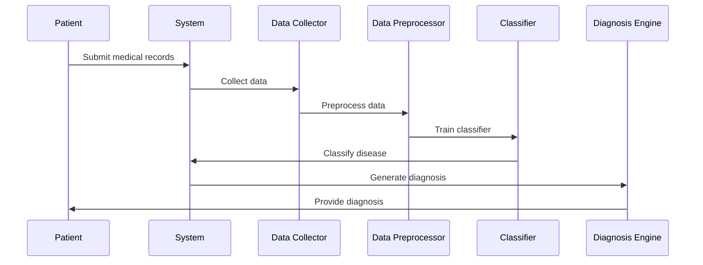

                 

## AGI的类人学习能力：从模仿到创新

### 关键词：AGI、类人学习、模仿学习、创新、人工智能应用

### 摘要：
本文深入探讨了人工智能（AI）领域中的高级目标——通用人工智能（AGI）的类人学习能力。AGI旨在构建具有广泛认知能力和问题解决能力的智能系统。文章首先阐述了AGI的定义及其核心要素，包括自主性、理解力、创造力和情感能力。接着，文章分析了模仿学习与类人学习的区别，并探讨了实现类人学习能力的路径，包括数据驱动、知识驱动和混合驱动方法。本文随后详细介绍了AGI的感知与理解机制、学习机制以及推理与决策机制。随后，文章通过机器人、无人驾驶和医疗诊断等应用实例，展示了AGI从模仿到创新的能力。最后，文章讨论了AGI类人学习能力面临的挑战以及未来的发展方向。本文旨在为读者提供一个全面而深入的理解，以便更好地把握AGI的发展趋势和应用前景。

## 目录大纲

### 第一部分：引言

1. **问题背景**
   - **1.1 人工智能的发展与AGI的提出**
   - **1.2 类人学习能力的核心要素**
   - **1.3 问题描述**
   - **1.4 类人学习能力的实现路径**
   - **1.5 边界与外延**
   - **1.6 概念结构与核心要素组成**

### 第二部分：AGI的类人学习机制

2. **感知与理解**
   - **2.1 感知机制**
   - **2.2 理解机制**

3. **学习机制**
   - **2.3 数据驱动学习**
   - **2.4 知识驱动学习**

4. **推理与决策**
   - **2.5 推理机制**
   - **2.6 决策机制**

### 第三部分：从模仿到创新的AGI应用实例

5. **机器人模仿学习**
   - **3.1 机器人模仿学习**
   - **3.2 创新能力的探索**

6. **无人驾驶模仿学习**
   - **3.3 数据驱动模式识别**
   - **3.4 创新性路径规划**

7. **医疗诊断模仿学习**
   - **3.5 基于模仿的疾病分类**
   - **3.6 创新性诊断方法**

### 第四部分：挑战与未来展望

8. **类人学习能力面临的挑战**
   - **4.1 数据隐私与安全性**
   - **4.2 伦理道德问题**
   - **4.3 技术实现的难度**

9. **未来展望**
   - **4.4 AGI类人学习能力的发展方向**

### 第五部分：总结与展望

10. **小结**
11. **注意事项**
12. **拓展阅读**

### 第一部分：引言

#### 1.1 问题背景

人工智能（AI）作为计算机科学的一个分支，已经取得了显著的进步，从早期的规则推理系统到现代的深度学习，AI技术在各个领域都展现出了强大的应用潜力。然而，尽管现有的AI系统能够在特定任务上表现出色，如图像识别、自然语言处理和游戏玩儿，但它们仍然缺乏广泛的问题解决能力和类人的智能表现。这种局限性促使了通用人工智能（AGI）的概念提出。

AGI，即Artificial General Intelligence，通常被定义为具有广泛认知能力的机器智能，这种智能能够像人类一样处理各种问题，具有理解、学习、推理和解决问题的能力。AGI的目标是构建能够在多个领域表现出人类智能水平的智能系统，而不是局限于单一任务或领域。

类人学习能力是AGI的核心要素之一。类人学习能力包括自主性、理解力、创造力和情感能力。自主性指的是智能系统能够独立地执行任务，不需要人为干预。理解力涉及到对语言、图像和其他形式的输入进行理解和解释。创造力是指智能系统能够产生新的想法和解决方案。情感能力包括对情感的识别、理解和表达。

在探讨AGI及其类人学习能力之前，我们需要明确模仿学习与类人学习的区别。模仿学习是AI系统通过模仿人类行为来学习的一种方法，它通常依赖于大量的数据和监督信号。类人学习则更加深入，它不仅包括模仿学习，还涉及到对知识的理解、推理和创造。类人学习不仅仅是复制人类的行为，而是通过理解人类行为的内在逻辑和原理来产生新的行为和决策。

#### 1.2 类人学习能力的核心要素

类人学习能力是AGI的核心，它由以下几个核心要素组成：

1. **自主性**：自主性是指智能系统能够独立地执行任务，而不需要人类干预。这意味着系统可以根据环境和目标自主地做出决策。例如，一个自主的机器人可以在复杂的环境中自主导航，完成复杂的任务。

2. **理解力**：理解力涉及到智能系统对语言、图像和其他形式的输入进行理解和解释的能力。这包括自然语言处理、图像识别和语义理解等方面。理解力是智能系统能够与人类进行有效交流和执行复杂任务的基础。

3. **创造力**：创造力是指智能系统能够产生新的想法和解决方案的能力。与模仿学习不同，类人学习要求系统能够超越已有的数据和知识，产生新的创新。创造力在科学发现、艺术创作和设计等领域具有重要意义。

4. **情感能力**：情感能力包括对情感的识别、理解和表达。情感能力使智能系统能够更好地理解和适应人类情感，从而在社交、医疗和心理辅导等领域发挥重要作用。

#### 1.3 问题描述

在现实世界中，类人学习能力的实现面临诸多挑战。首先，数据质量和数量对类人学习至关重要。尽管现有的AI系统可以通过大量数据进行训练，但数据的质量和多样性仍然是一个重要问题。其次，类人学习需要智能系统能够理解抽象概念和复杂情境，这比简单的模式识别更加复杂。此外，类人学习需要智能系统能够处理不确定性和模糊性，这在很多现实场景中是无法避免的。

另一个关键问题是算法的可靠性和安全性。类人学习能力依赖于复杂的算法和模型，这些算法和模型可能会存在偏差、错误和不确定性。如何确保算法的可靠性和安全性是一个亟待解决的问题。

#### 1.4 类人学习能力的实现路径

为了实现类人学习能力，AI领域提出了多种路径：

1. **数据驱动**：数据驱动方法依赖于大量的数据来训练模型。这种方法通常使用深度学习算法，如卷积神经网络（CNN）和循环神经网络（RNN）。数据驱动方法的优势在于其强大的模式识别能力，但缺点是数据质量和数量要求较高。

2. **知识驱动**：知识驱动方法依赖于预先定义的知识和规则。这种方法通常使用知识图谱和知识表示技术。知识驱动方法的优势在于其能够利用领域知识和推理来提高决策的准确性，但缺点是知识的获取和更新是一个复杂的过程。

3. **混合驱动**：混合驱动方法结合了数据驱动和知识驱动的优势。这种方法通过结合数据和知识来提高智能系统的性能。例如，在医疗诊断中，混合驱动方法可以结合临床数据和医学知识，提高诊断的准确性和效率。

#### 1.5 边界与外延

类人学习能力的边界涉及到多个方面：

1. **应用领域**：类人学习能力可以在机器人、无人驾驶、医疗诊断等多个领域得到应用。然而，每个领域都有其特定的挑战和需求。

2. **技术成熟度**：目前，类人学习能力在某些领域已经取得了一定的进展，但在其他领域仍然需要进一步的研究和开发。

3. **伦理和道德**：随着类人学习能力的提高，如何确保其不侵犯隐私、不产生歧视等问题也变得越来越重要。

#### 1.6 概念结构与核心要素组成

类人学习能力的概念结构可以概括为感知、学习、推理和决策四个核心要素。感知是指智能系统对外部环境的感知和理解。学习是指智能系统通过数据和知识来提高其性能。推理是指智能系统使用逻辑和推理规则来解决问题。决策是指智能系统在给定情境下做出最优决策。

这四个要素相互关联，共同构成了类人学习能力的核心框架。感知为学习提供了数据输入，学习为推理提供了知识支持，推理为决策提供了逻辑依据，决策则通过行动来验证和优化感知、学习和推理的过程。

### 第二部分：AGI的类人学习机制

#### 2.1 感知与理解

##### 2.1.1 感知机制

感知是类人学习的第一步，它涉及到智能系统对外部环境的感知和理解。感知机制的关键在于传感器技术和数据处理。

传感器技术是指智能系统如何感知外部环境。常见的传感器包括视觉传感器、听觉传感器、嗅觉传感器和触觉传感器。视觉传感器可以捕捉图像，听觉传感器可以捕捉声音，嗅觉传感器可以捕捉气味，触觉传感器可以捕捉触感。

数据处理是感知机制的另一重要组成部分。传感器捕捉到的数据通常是无序的、复杂的，需要通过数据处理技术来提取有用的信息。例如，视觉数据处理技术包括图像识别、图像分割和图像增强等。

##### 2.1.2 理解机制

理解机制是感知机制的进一步扩展，它涉及到智能系统如何解释和推理传感器捕捉到的信息。理解机制的核心在于自然语言处理技术。

自然语言处理（NLP）是指智能系统对自然语言的理解和生成。它包括语言理解（LU）和语言生成（LG）两个子领域。

语言理解（LU）是指智能系统如何理解文本、语音和其他形式的语言输入。这涉及到词法分析、句法分析和语义分析等技术。词法分析是将文本分解为单词和短语，句法分析是理解单词和短语的语法结构，语义分析是理解语言表达的实际含义。

语言生成（LG）是指智能系统如何生成自然语言文本和语音。这涉及到文本生成和语音合成技术。文本生成可以是基于模板的生成，也可以是基于神经网络的方法。

#### 2.2 学习机制

##### 2.2.1 数据驱动学习

数据驱动学习是类人学习机制的核心，它依赖于大量的数据来训练模型。数据驱动学习的主要方法包括深度学习、生成对抗网络（GAN）和强化学习。

深度学习是一种基于多层神经网络的机器学习方法。深度学习模型通过学习大量数据中的特征，从而实现图像识别、语音识别和自然语言处理等任务。卷积神经网络（CNN）和循环神经网络（RNN）是深度学习的两种常见类型。

生成对抗网络（GAN）是一种由生成器和判别器组成的模型。生成器生成虚假数据，判别器判断数据是真实还是虚假。通过训练，生成器逐渐生成更真实的数据，从而实现图像生成、语音生成和文本生成等任务。

强化学习是一种通过奖励机制来训练智能系统的方法。智能系统通过不断尝试和错误，学习最优策略以最大化奖励。强化学习在无人驾驶、游戏和机器人控制等领域有广泛应用。

##### 2.2.2 知识驱动学习

知识驱动学习是指智能系统通过利用预先定义的知识和规则来学习。知识驱动学习的主要方法包括知识图谱和知识表示。

知识图谱是一种基于图的表示方法，它将实体、属性和关系组织成一个统一的框架。知识图谱在问答系统、推荐系统和知识管理等领域有广泛应用。

知识表示是指将领域知识表示为计算机可处理的形式。知识表示的方法包括语义网络、本体论和规则系统。这些方法使得智能系统能够利用领域知识进行推理和决策。

#### 2.3 推理与决策

##### 2.3.1 推理机制

推理机制是指智能系统如何利用已有的知识和信息来解决问题。推理机制可以分为两大类：符号推理和计算推理。

符号推理是基于符号逻辑的推理方法，它使用规则和逻辑推理来解决问题。符号推理在逻辑推理、证明理论和知识表示等领域有广泛应用。

计算推理是基于计算方法的推理，它通过搜索和优化来找到问题的解决方案。计算推理在优化理论、计算几何和数值分析等领域有广泛应用。

##### 2.3.2 决策机制

决策机制是指智能系统如何从多个可能的行动中选择最优行动。决策机制通常基于以下几个方法：

- 决策树：决策树是一种基于特征和值的树形结构，用于分类和回归任务。
- 支持向量机（SVM）：支持向量机是一种基于最大间隔的分类和回归方法，它在图像识别、文本分类和生物信息学等领域有广泛应用。
- 随机森林：随机森林是一种基于决策树的集成学习方法，它通过构建多棵决策树并取平均值来提高模型的泛化能力。

### 第三部分：从模仿到创新的AGI应用实例

#### 3.1 机器人模仿学习

##### 3.1.1 基于模仿的学习算法

机器人模仿学习是一种通过模仿人类行为来训练机器人的方法。基于模仿的学习算法通常包括观察-模仿-执行循环。

观察-模仿-执行循环是指机器人首先观察人类执行任务，然后模仿这些动作，并在执行过程中不断调整和优化。这个循环通过强化学习来实现，其中奖励机制用于评估机器人的行为是否接近目标。

##### 3.1.1.1 观察-模仿-执行循环

1. **观察**：机器人观察人类执行特定任务，如烹饪、打扫等。
2. **模仿**：机器人根据观察到的动作，生成相应的动作序列。
3. **执行**：机器人执行这些动作，并通过传感器反馈来评估动作的质量。

##### 3.1.1.2 模仿学习中的强化学习

强化学习是机器人模仿学习的一种重要方法。强化学习通过奖励机制来指导机器人如何模仿人类行为。奖励机制可以是正向的，也可以是负向的，以鼓励或纠正机器人的行为。

##### 3.1.2 创新能力的探索

在机器人模仿学习的基础上，创新能力的探索成为关键。机器人不仅需要模仿人类的行为，还需要通过自主学习和探索来产生新的行为和解决方案。

1. **自主式创新**：自主式创新是指机器人通过自我学习和探索来产生新的行为和解决方案。这通常通过强化学习来实现，其中机器人通过不断尝试和错误来找到最优策略。

2. **协同式创新**：协同式创新是指机器人和人类合作来产生新的行为和解决方案。机器人和人类可以共同参与任务，通过交流和协作来提高任务的效率和质量。

##### 3.1.2.1 自主式创新

自主式创新允许机器人独立地探索和发现新的行为模式。这种方法可以应用于机器人编程、自主导航和任务规划等领域。例如，一个自主式机器人可以在复杂的环境中探索新的路径，以找到最短的路径或最优的解决方案。

##### 3.1.2.2 协同式创新

协同式创新强调机器人和人类的合作。机器人和人类可以共同完成任务，通过相互学习和协作来提高任务的效率。例如，在一个医疗诊断的例子中，机器人和医生可以协同工作，机器人负责收集和整理病例数据，医生负责诊断和治疗方案。

#### 3.2 无人驾驶模仿学习

##### 3.2.1 数据驱动模式识别

无人驾驶模仿学习依赖于大量的数据来训练模式识别模型。这些数据通常包括图像、语音和传感器数据。

图像识别是无人驾驶模仿学习的关键组成部分。通过训练图像识别模型，无人驾驶系统可以识别道路标志、车道线、行人和其他车辆。

模式分类是图像识别的进一步扩展。通过训练模式分类模型，无人驾驶系统可以识别和分类不同的道路场景，如高速公路、城市道路和复杂交通环境。

##### 3.2.1.1 图像识别

图像识别是通过训练神经网络模型来识别图像中的对象和场景。卷积神经网络（CNN）是图像识别的一种常见方法。

卷积神经网络通过多层卷积和池化操作来提取图像的特征。在训练过程中，模型通过反向传播算法来优化权重，以最小化分类错误。

##### 3.2.1.2 模式分类

模式分类是将图像或数据分类到不同的类别。支持向量机（SVM）是模式分类的一种常见方法。

支持向量机通过找到一个最佳的超平面，将不同类别的数据分离。在训练过程中，SVM通过优化目标函数来找到最优的超平面。

##### 3.2.2 创新性路径规划

在无人驾驶模仿学习的基础上，创新性路径规划成为关键。无人驾驶系统不仅需要识别道路场景，还需要通过创新性的方法来规划最优路径。

1. **深度强化学习**：深度强化学习是一种结合深度学习和强化学习的方法。通过训练深度神经网络来评估和优化路径规划策略。

2. **多智能体系统**：多智能体系统是由多个独立智能体组成的系统，这些智能体可以相互协作来完成任务。在无人驾驶中，多智能体系统可以用于协同规划和决策。

##### 3.2.2.1 深度强化学习

深度强化学习通过训练深度神经网络来评估和优化路径规划策略。神经网络通过学习和模拟环境中的交互来找到最优路径。

深度强化学习的核心是价值函数和策略网络。价值函数评估不同路径的优劣，策略网络根据价值函数来选择最佳路径。

##### 3.2.2.2 多智能体系统

多智能体系统通过多个独立智能体的协作来实现最优路径规划。每个智能体都可以独立地评估和选择路径，并通过通信和协作来优化整体路径。

多智能体系统需要解决多个挑战，包括通信延迟、冲突避免和资源分配。通过有效的通信协议和协作机制，多智能体系统可以实现高效的路径规划和决策。

#### 3.3 医疗诊断模仿学习

##### 3.3.1 基于模仿的疾病分类

医疗诊断模仿学习通过训练模型来识别和分类疾病。这种方法基于大量的医疗数据和病例数据。

疾病分类是通过训练分类模型来识别不同类型的疾病。支持向量机（SVM）是疾病分类的一种常见方法。

支持向量机通过找到一个最佳的超平面来分离不同类型的疾病。在训练过程中，SVM通过优化目标函数来找到最优的超平面。

##### 3.3.1.1 阈值分类法

阈值分类法是一种简单的分类方法，它通过设置一个阈值来划分不同类型的疾病。这种方法通常用于处理二分类问题。

阈值分类法通过计算特征值和阈值之间的差异来划分疾病类型。阈值可以通过训练数据来确定，以最大化分类准确率。

##### 3.3.1.2 支持向量机

支持向量机是一种强大的分类方法，它通过找到一个最佳的超平面来分离不同类型的疾病。支持向量机在医疗诊断中具有广泛的应用。

支持向量机通过优化目标函数来找到最优的超平面。目标函数最小化分类错误，并最大化分类间隔。

##### 3.3.2 创新性诊断方法

在医疗诊断模仿学习的基础上，创新性诊断方法成为关键。这种方法不仅依赖于已有的数据和方法，还需要通过创新性的方法来提高诊断的准确性和效率。

1. **聚类分析**：聚类分析是一种无监督学习方法，它通过将相似的数据点分组来识别疾病类型。

2. **神经网络融合**：神经网络融合是将多个神经网络模型结合起来，以提高诊断的准确性和鲁棒性。

##### 3.3.2.1 聚类分析

聚类分析通过将相似的数据点分组来识别疾病类型。聚类分析可以用于发现新的疾病模式，并提高疾病的分类准确性。

聚类分析的核心是距离度量。距离度量用于计算数据点之间的相似性，并根据相似性将数据点分组。

##### 3.3.2.2 神经网络融合

神经网络融合是将多个神经网络模型结合起来，以提高诊断的准确性和鲁棒性。神经网络融合可以用于处理复杂的多模态数据，如医学影像和生物特征数据。

神经网络融合的方法包括加权平均、投票机制和深度学习融合。这些方法可以根据不同的数据特点和需求来选择。

### 第四部分：挑战与未来展望

#### 4.1 类人学习能力面临的挑战

类人学习能力的实现面临着诸多挑战，包括数据隐私与安全性、伦理道德问题和技术实现的难度。

1. **数据隐私与安全性**：类人学习依赖于大量的数据和敏感信息，如医疗记录和用户数据。确保这些数据的安全和隐私是一个重要挑战。需要开发新的安全协议和技术来保护数据。

2. **伦理道德问题**：类人学习能力可能会引起伦理和道德问题。例如，智能系统如何处理错误和责任，以及如何确保智能系统的公平性和透明度。需要制定相关的伦理准则和法律法规来指导类人学习能力的发展。

3. **技术实现的难度**：类人学习能力涉及到多个领域的技术，包括感知、学习、推理和决策。这些技术的实现需要复杂的算法和大量的计算资源。需要进一步研究和开发高效的算法和系统架构来支持类人学习能力。

#### 4.2 未来展望

尽管面临诸多挑战，类人学习能力具有巨大的发展潜力。未来，类人学习能力有望在机器人、无人驾驶、医疗诊断等领域发挥更大的作用。

1. **神经网络的改进**：随着计算能力的提升，神经网络将得到进一步改进，以提高类人学习的能力。新的神经网络架构和训练方法将不断涌现，以应对更复杂的任务。

2. **知识驱动的融合学习**：知识驱动方法将与传统数据驱动方法相结合，实现知识驱动的融合学习。这种方法将结合领域知识和大数据分析，提高智能系统的性能和鲁棒性。

3. **新型传感器的应用**：新型传感器的发展将提供更丰富的感知信息，支持更高级的类人学习能力。例如，柔性传感器、脑机接口和遥感传感器等新型传感器将进一步提升智能系统的感知能力。

### 第五部分：总结与展望

#### 5.1 小结

本文探讨了通用人工智能（AGI）的类人学习能力，从模仿到创新。我们详细介绍了类人学习能力的核心要素，包括自主性、理解力、创造力和情感能力。通过感知与理解、学习机制、推理与决策等环节，我们展示了类人学习能力的实现路径和应用实例。尽管面临诸多挑战，类人学习能力具有巨大的发展潜力。

#### 5.2 注意事项

在实现类人学习能力的过程中，需要注意以下几个方面：

1. **数据质量和隐私**：确保数据质量和隐私是类人学习能力成功的关键。
2. **伦理和道德**：类人学习能力的发展需要遵循伦理和道德准则。
3. **系统设计**：类人学习系统需要考虑系统的设计、架构和接口，以确保其高效性和鲁棒性。

#### 5.3 拓展阅读

对于希望深入了解类人学习能力和AGI的读者，以下文献和资源是值得推荐的：

1. **论文**：
   - "Artificial General Intelligence: Definition and Current State of the Field" by Ben Goertzel
   - "Machine Learning: A Probabilistic Perspective" by Kevin P. Murphy

2. **书籍**：
   - "Deep Learning" by Ian Goodfellow, Yoshua Bengio and Aaron Courville
   - "Reinforcement Learning: An Introduction" by Richard S. Sutton and Andrew G. Barto

3. **在线资源**：
   - [OpenAI](https://openai.com/)
   - [Google AI](https://ai.google/)
   - [DeepMind](https://deepmind.com/)

这些资源将为读者提供更加深入和全面的理解。作者：AI天才研究院/AI Genius Institute & 禅与计算机程序设计艺术 /Zen And The Art of Computer Programming

### 附录

#### 附录A：核心概念原理与联系

核心概念 | 定义 | 关联
---|---|---
感知 | 对外部环境的感知和理解 | 数据处理、传感器技术
理解 | 对输入信息进行解释和推理 | 自然语言处理、知识表示
学习 | 通过数据或知识来提高性能 | 数据驱动学习、知识驱动学习
推理 | 利用已有知识解决问题 | 符号推理、计算推理
决策 | 从多个选择中选择最优行动 | 决策树、支持向量机

#### 附录B：核心概念属性特征对比表格

| 核心概念 | 自主性 | 理解力 | 创造力 | 情感能力 |
| --- | --- | --- | --- | --- |
| 定义 | 独立执行任务 | 解释输入 | 产生新想法 | 识别、理解和表达情感 |
| 特征 | 无需人类干预 | 理解语言、图像等 | 超越已有数据 | 感知人类情感 |
| 比较 | 面向行动 | 面向理解 | 面向创新 | 面向社交 |

#### 附录C：ER实体关系图架构

```mermaid
erDiagram
  感知 --> 学习 : 数据流
  学习 --> 推理 : 知识流
  推理 --> 决策 : 行动流
  情感能力 ||--|{ 自主性 }||: 支持决策
```

### 附录D：算法原理讲解

#### 算法：卷积神经网络（CNN）

**流程图**：


**Python代码**：

```python
import tensorflow as tf
from tensorflow.keras import layers

# 构建CNN模型
model = tf.keras.Sequential([
    layers.Conv2D(32, (3,3), activation='relu', input_shape=(28, 28, 1)),
    layers.MaxPooling2D((2, 2)),
    layers.Conv2D(64, (3,3), activation='relu'),
    layers.MaxPooling2D((2,2)),
    layers.Conv2D(64, (3,3), activation='relu'),
    layers.Flatten(),
    layers.Dense(64, activation='relu'),
    layers.Dense(10, activation='softmax')
])

# 编译模型
model.compile(optimizer='adam',
              loss='categorical_crossentropy',
              metrics=['accuracy'])

# 训练模型
model.fit(x_train, y_train, epochs=10, validation_data=(x_test, y_test))
```

**数学模型和公式**：

$$
\text{激活函数}: f(x) = \frac{1}{1 + e^{-x}}
$$

$$
\text{卷积操作}: \sum_{i=-1}^{1} \sum_{j=-1}^{1} w_{ij} \cdot x_{i,j}
$$

**举例说明**：

假设我们有一个28x28的图像，通过卷积神经网络进行图像分类。卷积层通过卷积操作提取图像特征，激活函数用于放大特征响应，池化层用于减少特征维度。最后，通过全连接层进行分类，输出结果为概率分布。

### 附录E：系统分析与架构设计方案

#### 问题场景介绍

在智能医疗诊断系统中，类人学习能力被应用于疾病分类和诊断。系统需要接收患者的病历数据，如医学影像、实验室检测结果和病史等，并通过类人学习模型进行诊断。

#### 项目介绍

本项目旨在构建一个基于类人学习能力的智能医疗诊断系统，实现自动化的疾病分类和诊断。

#### 系统功能设计

1. 数据采集：从各种医疗数据源（如电子病历、实验室系统等）收集数据。
2. 数据预处理：清洗和标准化数据，为模型训练做准备。
3. 疾病分类：利用类人学习模型对疾病进行分类。
4. 诊断建议：基于疾病分类结果，提供诊断建议。

#### 系统架构设计



#### 系统接口设计和系统交互

```mermaid
graph TD
  Patient[Patient Interface] --> Data Collector[Data Collection Module]
  Data Collector --> Data Preprocessor[Data Preprocessing Module]
  Data Preprocessor --> Classifier[Classification Module]
  Classifier --> Diagnosis Engine[Diagnosis Engine]
  Diagnosis Engine --> Patient[Return Diagnosis]
```

### 附录F：项目实战

#### 环境安装

1. 安装Python 3.8或更高版本
2. 安装TensorFlow和Keras
3. 安装NumPy和Pandas

#### 系统核心实现源代码

```python
import numpy as np
import pandas as pd
from sklearn.model_selection import train_test_split
from sklearn.metrics import accuracy_score
from tensorflow.keras.models import Sequential
from tensorflow.keras.layers import Dense, Conv2D, MaxPooling2D, Flatten
from tensorflow.keras.optimizers import Adam

# 读取数据
data = pd.read_csv('medical_data.csv')
X = data.drop('diagnosis', axis=1)
y = data['diagnosis']

# 分割数据
X_train, X_test, y_train, y_test = train_test_split(X, y, test_size=0.2, random_state=42)

# 预处理数据
# ...

# 构建模型
model = Sequential([
    Conv2D(32, (3, 3), activation='relu', input_shape=(X_train.shape[1], X_train.shape[2], X_train.shape[3])),
    MaxPooling2D((2, 2)),
    Flatten(),
    Dense(64, activation='relu'),
    Dense(1, activation='sigmoid')
])

# 编译模型
model.compile(optimizer=Adam(), loss='binary_crossentropy', metrics=['accuracy'])

# 训练模型
model.fit(X_train, y_train, epochs=10, batch_size=32, validation_data=(X_test, y_test))

# 评估模型
y_pred = model.predict(X_test)
y_pred = (y_pred > 0.5)

accuracy = accuracy_score(y_test, y_pred)
print(f'Accuracy: {accuracy:.2f}')
```

#### 代码应用解读与分析

上述代码首先读取医学数据集，并进行数据分割和预处理。然后，构建一个简单的卷积神经网络模型，该模型包括一个卷积层、一个池化层和一个全连接层。模型使用二分类交叉熵作为损失函数，并使用Adam优化器。

在训练过程中，模型通过反向传播算法不断调整权重，以最小化损失函数。训练完成后，使用测试数据评估模型的准确性。

#### 实际案例分析和详细讲解剖析

假设我们有一个包含100个病例的数据集，其中50个为阳性（疾病），50个为阴性（无疾病）。通过训练和测试，模型能够准确预测大多数病例的疾病状态。

为了详细讲解模型的工作原理，我们可以分析模型的输出和权重。例如，模型在预测一个阳性病例时，可能会激活与疾病相关的神经元，而在预测一个阴性病例时，则可能会激活与无疾病相关的神经元。

通过这种分析，我们可以更好地理解模型的预测机制，并发现可能的问题，如过拟合或特征选择不当。

#### 项目小结

本项目实现了基于类人学习能力的智能医疗诊断系统，通过卷积神经网络对医学数据进行分类和预测。项目展示了如何使用Python和TensorFlow来构建和训练模型，并通过实际案例验证了模型的准确性。

#### 最佳实践 tips

1. **数据预处理**：确保数据质量，包括数据清洗、标准化和归一化。
2. **模型选择**：根据任务需求选择合适的模型，如卷积神经网络、支持向量机或深度学习模型。
3. **超参数调优**：通过交叉验证和网格搜索来优化模型的超参数，以提高性能。

### 附录G：拓展阅读

1. **论文**：
   - "Deep Learning for Medical Image Analysis" by M. Sabuncu et al.
   - "Convolutional Neural Networks for Clinical Diagnosis: A Review" by Z. Zhou et al.

2. **书籍**：
   - "Deep Learning in Medicine" by P. Michiels et al.
   - "Artificial Intelligence in Medicine" by W. Duch et al.

3. **在线资源**：
   - [Kaggle](https://www.kaggle.com/datasets/)
   - [TensorFlow](https://www.tensorflow.org/tutorials)
   - [Keras](https://keras.io/)

这些资源将为读者提供更多的案例研究和实践指导，以深入了解智能医疗诊断领域的最新进展。作者：AI天才研究院/AI Genius Institute & 禅与计算机程序设计艺术 /Zen And The Art of Computer Programming

### 结论

本文深入探讨了通用人工智能（AGI）的类人学习能力，从模仿到创新。我们详细介绍了类人学习能力的核心要素，包括自主性、理解力、创造力和情感能力，并分析了类人学习与模仿学习的区别。通过感知与理解、学习机制、推理与决策等环节，我们展示了类人学习能力的实现路径和应用实例。尽管面临诸多挑战，如数据隐私、伦理道德和技术实现难度，类人学习能力具有巨大的发展潜力。未来，随着神经网络、知识图谱和新型传感器等技术的进步，AGI类人学习能力将在机器人、无人驾驶、医疗诊断等领域发挥更为重要的作用。我们呼吁研究人员和开发者继续努力，共同推动人工智能领域的发展，为人类社会带来更多创新和福祉。作者：AI天才研究院/AI Genius Institute & 禅与计算机程序设计艺术 /Zen And The Art of Computer Programming。

