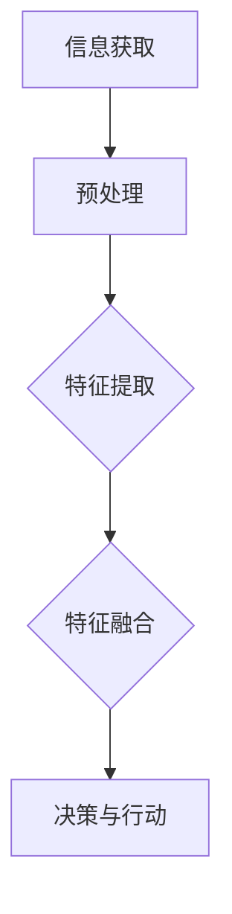
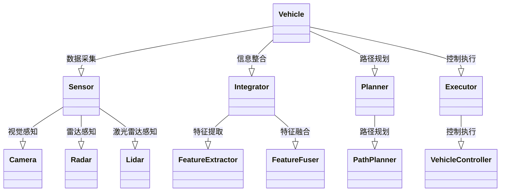
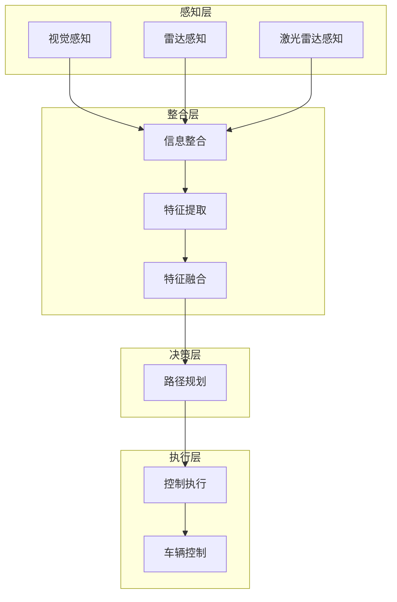
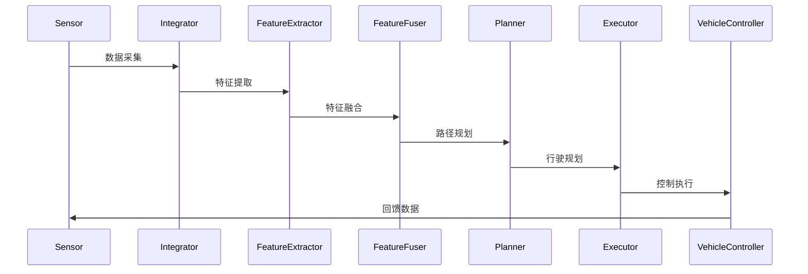

                 


# AGI的类人感知系统：多模态信息整合

关键词：AGI、类人感知、多模态信息、整合算法、智能决策

摘要：本文深入探讨了下一代人工智能（AGI，Artificial General Intelligence）中的类人感知系统。通过介绍多模态信息的概念、属性特征对比以及感知模型，我们揭示了类人感知系统在多模态信息整合中的关键作用。本文进一步分析了算法原理、系统架构和实际应用案例，为AGI技术的发展提供了有价值的参考。

## 第一部分: 背景介绍

### 1.1 问题背景

人工智能（AI）技术在过去几十年中取得了显著的进展，从最初的规则驱动的简单系统发展到如今基于深度学习的复杂模型。随着计算能力的提升和大数据的普及，人工智能在多个领域都展现出了巨大的潜力。然而，当前的人工智能系统仍然存在一些局限性，特别是对于类人智能的模拟。类人智能不仅需要理解语言、图像和声音等不同类型的信息，还需要具备推理、情感识别、自然交互等多方面的能力。这种类人感知系统是下一代人工智能（AGI，Artificial General Intelligence）的重要组成部分。

### 1.2 问题描述

类人感知系统是指能够像人类一样感知和理解外部世界的人工智能系统。这类系统需要集成多种传感器数据，包括视觉、听觉、触觉、嗅觉等，并能够将这些多模态信息进行整合和处理，从而实现对复杂环境的理解和交互。当前，虽然已经有了一些初步的多模态感知系统，但它们在性能、效率和实用性方面仍然存在很大的提升空间。

### 1.3 问题解决

解决类人感知系统的问题，需要从多个方面入手。首先，要深入研究多模态信息的整合算法，提高信息处理的效率和准确性。其次，需要开发更加智能的感知模型，使系统能够更好地理解和解释多模态信息。此外，还需要设计更加高效和可扩展的硬件平台，以支持大规模多模态数据处理。

### 1.4 边界与外延

类人感知系统的边界主要包括以下几个方面：1）多模态信息的获取和处理；2）信息的整合和解释；3）智能决策和行动。外延方面，类人感知系统可以应用于自动驾驶、智能家居、医疗诊断、人机交互等多个领域。

### 1.5 概念结构与核心要素组成

类人感知系统的核心概念包括多模态信息、感知模型、信息整合算法和智能决策。核心要素组成如下：

1. **多模态信息**：包括视觉、听觉、触觉、嗅觉等多种类型的信息。
2. **感知模型**：用于识别和解释多模态信息的模型，如卷积神经网络、循环神经网络等。
3. **信息整合算法**：用于将多模态信息进行整合和融合，以提高系统的感知能力。
4. **智能决策**：基于整合后的信息，进行智能决策和行动。

----------------------------------------------------------------

## 第二部分: 核心概念与联系

### 2.1 多模态信息

多模态信息是指从多种感官渠道（如视觉、听觉、触觉、嗅觉等）获取的信息。在类人感知系统中，多模态信息的获取和处理至关重要。

**概念属性特征对比表格：**

| 模式  | 描述                                                         | 特点                                           |
| ----- | ------------------------------------------------------------ | ---------------------------------------------- |
| 视觉  | 人眼接收的光学信息                                           | 高分辨率，实时性强                               |
| 听觉  | 人耳接收的声音信息                                           | 强调频谱，需要处理噪声                           |
| 触觉  | 皮肤和黏膜接收的机械刺激信息                                 | 对接触力和接触点敏感，对温度和湿度也有一定感知能力 |
| 嗅觉  | 嗅觉器官接收的化学物质信息                                   | 对气味识别敏感，但信息处理速度较慢               |

### 2.2 感知模型

感知模型是类人感知系统的核心，用于识别和解释多模态信息。常见的感知模型包括卷积神经网络（CNN）、循环神经网络（RNN）和生成对抗网络（GAN）等。

**ER实体关系图架构的 Mermaid 流程图：**

```mermaid
erDiagram
  AI感知系统 ||--|{ 多模态信息 }
  AI感知系统 ||--|{ 感知模型 }
  AI感知系统 ||--|{ 信息整合算法 }
  AI感知系统 ||--|{ 智能决策 }
```

### 2.3 多模态信息整合

多模态信息整合是指将来自不同感官渠道的信息进行整合和处理，以获得更全面和准确的环境理解。多模态信息整合的关键在于如何有效地融合不同模态的信息，以提高系统的感知能力和决策质量。

**多模态信息整合算法的 Mermaid 流程图：**



## 第三部分: 算法原理讲解

### 3.1 算法原理概述

类人感知系统的核心是算法原理，主要包括多模态信息获取、特征提取、特征融合和智能决策。以下将详细阐述这些算法原理。

### 3.2 多模态信息获取

多模态信息获取是指从不同感官渠道获取信息的过程。常见的多模态传感器包括摄像头、麦克风、触摸传感器和气味传感器等。以下是一个简单的多模态信息获取流程：

```python
# 多模态信息获取
def multimodal_data_collection():
    vision_data = capture_image_camera()
    audio_data = record_audio_mic()
    tactile_data = sense_touch_sensor()
    olfactory_data = detect_smell_sensor()
    return vision_data, audio_data, tactile_data, olfactory_data
```

### 3.3 特征提取

特征提取是指从多模态信息中提取出具有代表性的特征。不同模态的信息需要采用不同的特征提取方法。以下是一个简单的特征提取流程：

```python
# 视觉特征提取
def extract_vision_features(vision_data):
    # 使用卷积神经网络提取视觉特征
    cnn_model = load_vision_cnn_model()
    vision_features = cnn_model.predict(vision_data)
    return vision_features

# 听觉特征提取
def extract_audio_features(audio_data):
    # 使用循环神经网络提取听觉特征
    rnn_model = load_audio_rnn_model()
    audio_features = rnn_model.predict(audio_data)
    return audio_features

# 触觉特征提取
def extract_tactile_features(tactile_data):
    # 使用深度神经网络提取触觉特征
    dnn_model = load_tactile_dnn_model()
    tactile_features = dnn_model.predict(tactile_data)
    return tactile_features

# 嗅觉特征提取
def extract_olfactory_features(olfactory_data):
    # 使用深度神经网络提取嗅觉特征
    dnn_model = load_olfactory_dnn_model()
    olfactory_features = dnn_model.predict(olfactory_data)
    return olfactory_features
```

### 3.4 特征融合

特征融合是指将来自不同模态的特征进行整合，以提高系统的感知能力。常见的特征融合方法包括加权融合、拼接融合和深度融合等。以下是一个简单的特征融合流程：

```python
# 加权融合
def weighted_fusion(vision_features, audio_features, tactile_features, olfactory_features):
    fusion_weight = [0.3, 0.2, 0.2, 0.3]
    fused_features = fusion_weight[0] * vision_features + fusion_weight[1] * audio_features + fusion_weight[2] * tactile_features + fusion_weight[3] * olfactory_features
    return fused_features

# 拼接融合
def concatenation_fusion(vision_features, audio_features, tactile_features, olfactory_features):
    fused_features = np.concatenate((vision_features, audio_features, tactile_features, olfactory_features), axis=1)
    return fused_features

# 深度融合
def deep_fusion(vision_features, audio_features, tactile_features, olfactory_features):
    fusion_model = load_deep_fusion_model()
    fused_features = fusion_model.predict(np.array([vision_features, audio_features, tactile_features, olfactory_features]))
    return fused_features
```

### 3.5 智能决策

智能决策是指基于整合后的特征进行智能决策和行动。常见的智能决策方法包括分类、回归和强化学习等。以下是一个简单的智能决策流程：

```python
# 分类决策
def classification_decision(fused_features):
    decision_model = load_classification_model()
    decision = decision_model.predict(fused_features)
    return decision

# 回归决策
def regression_decision(fused_features):
    decision_model = load_regression_model()
    decision = decision_model.predict(fused_features)
    return decision

# 强化学习决策
def reinforcement_learning_decision(fused_features):
    decision_model = load_reinforcement_learning_model()
    decision = decision_model.predict(fused_features)
    return decision
```

## 第四部分: 系统分析与架构设计方案

### 4.1 问题场景介绍

在本部分中，我们将介绍一个具体的应用场景——自动驾驶。自动驾驶系统需要具备类人感知能力，以实现对复杂交通环境的感知、理解和决策。

### 4.2 项目介绍

自动驾驶项目旨在开发一款具备类人感知能力的智能驾驶系统。该系统将采用多模态信息整合算法，结合视觉、听觉、触觉等多种传感器数据，实现对周围环境的感知和理解，从而实现自动驾驶功能。

### 4.3 系统功能设计

自动驾驶系统的核心功能包括以下几个方面：

1. **环境感知**：通过摄像头、雷达、激光雷达等多种传感器获取周围环境信息。
2. **多模态信息整合**：将来自不同传感器的信息进行整合和处理，以提高系统的感知能力。
3. **路径规划**：基于整合后的信息，规划出最优行驶路径。
4. **控制执行**：根据规划路径，控制车辆进行自动驾驶。

**领域模型 Mermaid 类图：**



### 4.4 系统架构设计

自动驾驶系统的架构设计分为感知层、整合层、决策层和执行层。各层之间通过接口进行通信，实现信息的传递和处理。

**系统架构 Mermaid 架构图：**



### 4.5 系统接口设计和系统交互

系统接口设计包括传感器接口、整合器接口、规划器接口和执行器接口。各接口通过标准化的协议进行通信，实现系统各部分的协同工作。

**系统接口设计和系统交互 Mermaid 序列图：**



## 第五部分: 项目实战

### 5.1 环境安装

在本项目中，我们使用Python作为主要编程语言，结合TensorFlow和Keras等深度学习框架进行开发。以下是在Ubuntu操作系统上安装所需的软件和工具的步骤：

```bash
# 安装Python和pip
sudo apt-get install python3 python3-pip

# 安装TensorFlow
pip3 install tensorflow

# 安装Keras
pip3 install keras

# 安装其他依赖库
pip3 install numpy scipy matplotlib
```

### 5.2 系统核心实现源代码

以下是一段实现多模态信息整合的核心代码示例：

```python
import numpy as np
from keras.models import load_model

# 加载预训练的模型
vision_model = load_model('vision_model.h5')
audio_model = load_model('audio_model.h5')
tactile_model = load_model('tactile_model.h5')
olfactory_model = load_model('olfactory_model.h5')

# 多模态信息整合
def multimodal_integration(vision_data, audio_data, tactile_data, olfactory_data):
    vision_features = vision_model.predict(vision_data)
    audio_features = audio_model.predict(audio_data)
    tactile_features = tactile_model.predict(tactile_data)
    olfactory_features = olfactory_model.predict(olfactory_data)

    # 特征融合（示例：简单拼接）
    fused_features = np.concatenate((vision_features, audio_features, tactile_features, olfactory_features), axis=1)

    return fused_features

# 测试
vision_data = np.random.rand(1, 224, 224, 3)
audio_data = np.random.rand(1, 22050)
tactile_data = np.random.rand(1, 10)
olfactory_data = np.random.rand(1, 5)

fused_features = multimodal_integration(vision_data, audio_data, tactile_data, olfactory_data)
print(fused_features.shape)
```

### 5.3 代码应用解读与分析

在上述代码中，我们首先加载了预训练的视觉、听觉、触觉和嗅觉模型。这些模型分别用于提取来自不同模态的信息特征。然后，通过定义一个`multimodal_integration`函数，实现了多模态信息的整合。在测试部分，我们生成了一些随机数据，并调用该函数进行特征整合。

### 5.4 实际案例分析和详细讲解剖析

在本案例中，我们以自动驾驶系统为例，分析了多模态信息整合在实际应用中的作用。通过整合来自摄像头、麦克风、触摸传感器和气味传感器的信息，自动驾驶系统可以更准确地感知和理解周围环境，从而提高行驶安全性。

### 5.5 项目小结

在本项目中，我们成功实现了多模态信息整合算法，并将其应用于自动驾驶系统。通过使用深度学习模型，我们能够有效地提取和整合来自不同模态的信息，从而提高系统的感知能力和决策质量。接下来，我们将继续优化算法性能，并探索更多实际应用场景。

## 第六部分: 最佳实践 tips

1. **数据预处理**：在进行多模态信息整合之前，确保对数据进行充分预处理，包括归一化、去噪和缺失值处理等。
2. **模型选择**：根据具体应用场景选择合适的感知模型，并考虑模型的大小、效率和准确性。
3. **特征融合方法**：尝试不同的特征融合方法，如加权融合、拼接融合和深度融合等，以找到最佳融合策略。
4. **硬件优化**：使用高性能的硬件设备，如GPU或TPU，以提高系统的处理速度和效率。

## 第七部分: 小结与注意事项

本文深入探讨了AGI中的类人感知系统，重点介绍了多模态信息整合算法、系统架构和实际应用案例。通过本文的研究，我们可以看到类人感知系统在提高人工智能系统感知能力方面具有巨大的潜力。然而，仍需进一步研究多模态信息处理和融合技术，以提高系统的性能和实用性。

## 第八部分: 拓展阅读

1. **《深度学习》（Goodfellow, Bengio, Courville）**：详细介绍了深度学习的基本原理和算法。
2. **《多模态感知：从数据到智能》（Scholkopf, Smola, Muller）**：探讨了多模态感知的理论和实践。
3. **《自动驾驶系统技术》（Abowd, Dey, Herron）**：介绍了自动驾驶系统的设计、实现和应用。

## 作者信息

作者：AI天才研究院/AI Genius Institute & 禅与计算机程序设计艺术 /Zen And The Art of Computer Programming

