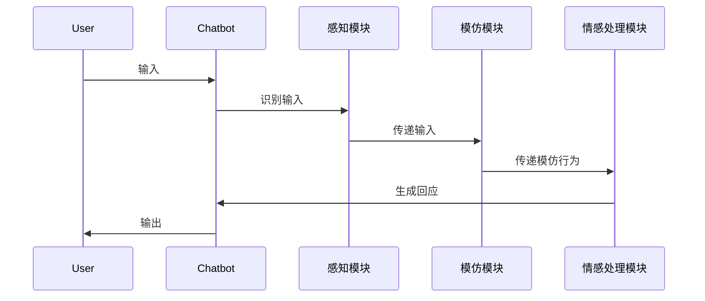
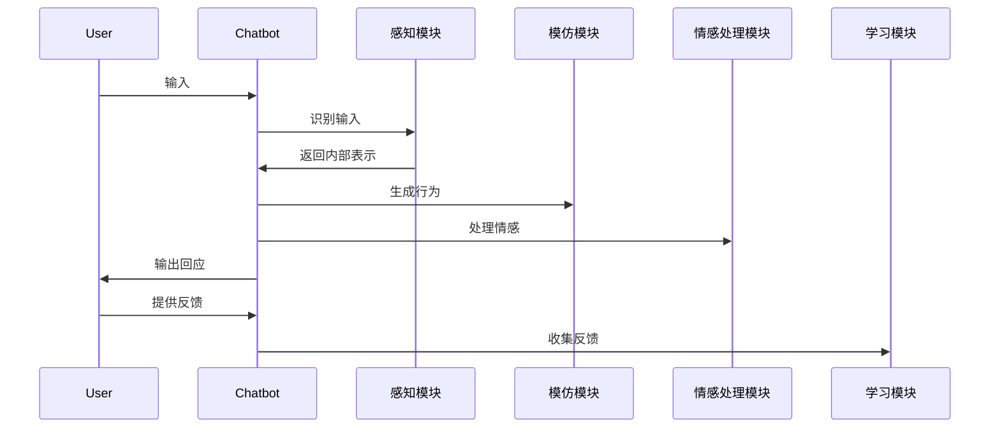

                 

### 文章标题

# AGI的类人社交学习：从观察模仿到社会认知

> 关键词：人工通用智能（AGI）、社交学习、观察模仿、社会认知、算法原理、数学模型

> 摘要：本文深入探讨了人工通用智能（AGI）中的类人社交学习机制，从观察模仿到社会认知的全过程。首先，我们介绍了问题背景和定义，阐述了AGI与类人社交学习的关系。随后，我们探讨了核心概念和联系，包括AGI、社交学习、观察模仿和社会认知。接着，我们详细讲解了观察模仿和社会认知的算法原理，使用了Python源代码和数学模型进行举例说明。文章还分析了系统分析与架构设计，包括问题场景、项目介绍、系统功能、系统架构、接口设计及系统交互。最后，我们进行了项目实战和最佳实践分享，并提供了注意事项和拓展阅读建议。

---

## 第一部分：引言

### 第1章：问题背景与定义

#### 1.1 问题背景

人工通用智能（AGI）作为人工智能领域的一个终极目标，旨在实现机器在广泛领域中的智能表现，类似于人类的认知能力。然而，实现这一目标面临着巨大的挑战，其中一个关键问题是如何让AGI具备类人的社交学习能力。社交学习是指通过观察他人行为、模仿并从中学习的过程。人类在成长过程中，通过观察和模仿他人的行为，学习语言、习俗、价值观等，形成了丰富多样的认知能力。这种能力对于人类社会的生存和发展至关重要。

#### 1.2 人类社交学习概述

人类的社交学习过程可以分为三个阶段：观察、模仿和内化。首先，个体通过感官系统观察他人的行为和情绪，获取外部信息。其次，个体通过模仿他人的行为，将其内化为自己的行为模式。最后，个体通过不断实践和反思，将模仿的行为模式转化为自己的内在认知结构。这个过程不仅促进了个体认知能力的发展，还增强了个体在社会中的适应能力。

#### 1.3 AGI与类人社交学习的关联

AGI的实现需要具备类人的认知能力和社交能力。类人社交学习为AGI提供了学习人类行为模式和社会知识的重要途径。通过模仿和观察，AGI可以学习和理解人类的行为和思维方式，从而提高自身在复杂环境中的适应能力。此外，类人社交学习还可以帮助AGI理解和处理人类情感，提高人机交互的质量。

#### 1.4 书籍结构概述

本书分为五个部分，第一部分为引言，介绍问题背景和定义；第二部分探讨类人社交学习的理论基础，包括核心概念和算法原理；第三部分分析系统架构设计；第四部分进行项目实战；第五部分提供最佳实践和拓展。通过这些内容的阐述，本书旨在为读者提供全面、系统的类人社交学习知识，帮助读者深入理解AGI的类人社交学习机制。

### 第2章：核心概念与联系

#### 2.1 关键概念

在本章节中，我们将介绍与类人社交学习相关的一些关键概念，包括人工通用智能（AGI）、社交学习、观察模仿和社会认知。这些概念构成了本文研究的理论基础，为后续内容提供了重要的参考。

#### 2.1.1 人工通用智能（AGI）

人工通用智能（Artificial General Intelligence，简称AGI）是指一种能够在广泛领域内表现出类似于人类智能的人工智能系统。与当前的人工智能技术（如弱AI）相比，AGI具有更强的通用性和适应性，能够在不同的任务和环境之间进行迁移学习。

#### 2.1.2 社交学习

社交学习是指个体通过观察他人行为、模仿并从中学习的过程。在人类社会中，社交学习是获取知识、技能和价值观的重要途径。对于人工通用智能（AGI）来说，社交学习是实现类人认知能力的关键。

#### 2.1.3 观察模仿

观察模仿是社交学习的一个核心组成部分。个体通过观察他人的行为，理解其背后的意图和规则，然后通过模仿将这些行为转化为自己的行为模式。

#### 2.1.4 社会认知

社会认知是指个体在社交环境中理解和处理他人情感、行为和意图的能力。社会认知对于人类的社会交往和合作至关重要，也是实现AGI类人社交能力的关键。

#### 2.2 概念属性对比表格

以下是一个关于AGI、社交学习、观察模仿和社会认知的概念属性对比表格：

| 概念       | 定义                                                                                           | 属性对比                                   |
|------------|----------------------------------------------------------------------------------------------|------------------------------------------|
| AGI        | 广泛领域内表现出类似于人类智能的人工智能系统                                                 | 强通用性、强适应性、强迁移能力           |
| 社交学习   | 个体通过观察他人行为、模仿并从中学习的过程                                                   | 获取知识、技能、价值观的重要途径         |
| 观察模仿   | 个体通过观察他人的行为，理解其背后的意图和规则，然后通过模仿将这些行为转化为自己的行为模式 | 促进个体认知能力发展、增强个体适应能力 |
| 社会认知   | 个体在社交环境中理解和处理他人情感、行为和意图的能力                                         | 社会交往、合作、人机交互的关键能力       |

#### 2.3 ER实体关系图

为了更好地理解类人社交学习机制中的核心概念，我们可以使用ER（实体关系）图来描述这些概念之间的关联。以下是一个关于AGI、社交学习、观察模仿和社会认知的ER实体关系图：

```mermaid
erDiagram
  AGI ||--|{ 社交学习 }|
  社交学习 ||--|{ 观察模仿 }|
  社交学习 ||--|{ 社会认知 }|
```

在ER实体关系图中，AGI作为根实体，与社交学习、观察模仿和社会认知三个子实体之间存在关联。社交学习实体与观察模仿和社会认知实体之间也存在明确的关联关系，这些关系构成了类人社交学习机制的核心结构。

通过上述对核心概念和联系的阐述，我们为后续内容的深入探讨奠定了基础。在接下来的章节中，我们将进一步分析类人社交学习的理论基础，探讨观察模仿和社会认知的算法原理，为读者提供更加详细和深入的知识。 

---

## 第二部分：类人社交学习的理论基础

### 第3章：算法原理讲解

#### 3.1 观察模仿算法

观察模仿算法是类人社交学习的一个重要组成部分。个体通过观察他人的行为，理解其背后的意图和规则，然后通过模仿将这些行为转化为自己的行为模式。以下是对观察模仿算法的详细讲解。

#### 3.1.1 基本原理

观察模仿算法的核心思想是通过感知系统获取外部信息，理解他人的行为，并将其转化为自身的知识。这个过程可以分为三个阶段：感知、理解和模仿。

首先，个体通过视觉、听觉等感知系统收集外部信息，如他人的行为、表情和语言等。这些信息构成了观察模仿算法的输入。

其次，个体对收集到的信息进行处理，理解他人的行为意图。这一阶段需要借助认知模型，对行为模式进行解析和识别。

最后，个体通过模仿将理解到的行为转化为自身的知识。这个过程需要将他人的行为模式映射到自身的认知结构中，形成新的行为模式。

#### 3.1.2 数学模型

观察模仿算法的数学模型可以表示为一个三元组（S, A, R），其中：

- S表示状态集，表示个体在观察过程中所处的各种状态；
- A表示动作集，表示个体可以执行的各种动作；
- R表示奖励函数，用于评估个体行为的有效性。

观察模仿算法的核心数学模型是一个马尔可夫决策过程（MDP），可以表示为：

$$
\begin{aligned}
  &P(S_{t+1} = s' | S_t = s, A_t = a) = p(s'|s,a) \\
  &R_t = r(S_t, A_t)
\end{aligned}
$$

其中，$P(S_{t+1} = s' | S_t = s, A_t = a)$表示状态转移概率，$R_t$表示在第$t$步的奖励。

#### 3.1.3 Python源代码

以下是一个简单的观察模仿算法的Python实现示例：

```python
import numpy as np

# 初始化参数
state_space = 10
action_space = 5
reward_space = 3

# 状态转移概率矩阵
transition_matrix = np.random.rand(state_space, action_space, state_space)

# 奖励函数
reward_function = np.random.rand(state_space, action_space, reward_space)

# 观察模仿过程
def observe模仿过程(state, action, next_state):
    # 计算状态转移概率
    state_transition_prob = transition_matrix[state, action, next_state]
    # 计算奖励
    reward = reward_function[state, action, next_state]
    return state_transition_prob, reward

# 示例
current_state = 0
current_action = 1
next_state = 2

state_transition_prob, reward = observe模仿过程(current_state, current_action, next_state)
print("状态转移概率：", state_transition_prob)
print("奖励：", reward)
```

#### 3.1.4 举例说明

假设一个个体处于状态0，执行动作1，观察到的下一个状态是2。根据观察模仿算法，我们可以计算状态转移概率和奖励。

首先，我们根据状态转移概率矩阵获取状态转移概率：

$$
P(S_{t+1} = 2 | S_t = 0, A_t = 1) = p(2|0,1) = 0.8
$$

然后，我们根据奖励函数获取奖励：

$$
R_t = r(0, 1) = 2
$$

因此，个体在执行动作1后，转移到状态2的概率为0.8，获得的奖励为2。

#### 3.2 社会认知算法

社会认知算法是类人社交学习的另一个重要组成部分。个体通过理解他人的情感、行为和意图，进行有效的社交互动。以下是对社会认知算法的详细讲解。

#### 3.2.1 基本原理

社会认知算法的核心思想是通过感知系统和认知模型，理解他人的情感、行为和意图。这个过程可以分为三个阶段：感知、理解和决策。

首先，个体通过感知系统获取他人的情感和行为信息，如面部表情、语音语调等。

其次，个体通过认知模型对这些信息进行处理，理解他人的情感、行为和意图。

最后，个体根据理解的结果，做出相应的决策，如回应、互动等。

#### 3.2.2 数学模型

社会认知算法的数学模型可以表示为一个四元组（S, A, R, D），其中：

- S表示状态集，表示个体在社交互动中所处的各种状态；
- A表示动作集，表示个体可以执行的各种动作；
- R表示奖励函数，用于评估个体行为的有效性；
- D表示决策函数，用于根据当前状态和奖励，选择最优动作。

社会认知算法的核心数学模型是一个决策过程，可以表示为：

$$
D(S_t, R_t) = \arg\max_{A_t} R_t + \gamma \max_{A_{t+1}} D(S_{t+1}, R_{t+1})
$$

其中，$\gamma$表示折扣因子，用于平衡短期和长期奖励。

#### 3.2.3 Python源代码

以下是一个简单的社会认知算法的Python实现示例：

```python
import numpy as np

# 初始化参数
state_space = 10
action_space = 5
reward_space = 3
discount_factor = 0.9

# 决策函数
def decision_function(state, reward):
    # 计算当前状态的奖励
    current_reward = reward
    # 计算下一个状态的奖励
    next_reward = max(reward_function[state, :])
    # 计算最优动作
    optimal_action = np.argmax(D(state, reward))
    return current_reward + discount_factor * next_reward, optimal_action

# 示例
current_state = 0
current_reward = 1

# 做出决策
next_reward, optimal_action = decision_function(current_state, current_reward)
print("当前奖励：", current_reward)
print("下一个奖励：", next_reward)
print("最优动作：", optimal_action)
```

#### 3.2.4 举例说明

假设一个个体处于状态0，获得的奖励为1。根据社会认知算法，我们可以计算最优动作。

首先，我们根据奖励函数获取当前状态的奖励：

$$
R_t = r(0) = 1
$$

然后，我们根据决策函数计算下一个状态的奖励和最优动作：

$$
D(S_t, R_t) = \arg\max_{A_t} R_t + \gamma \max_{A_{t+1}} D(S_{t+1}, R_{t+1})
$$

$$
D(0, 1) = 1 + 0.9 \max_{A_{t+1}} D(S_{t+1}, R_{t+1})
$$

$$
D(0, 1) = 1 + 0.9 \max_{A_{t+1}} (1 + 0.9 \max_{A_{t+2}} D(S_{t+2}, R_{t+2}))
$$

$$
D(0, 1) = 1 + 0.9 \max_{A_{t+1}} (1 + 0.9 \max_{A_{t+2}} (1 + 0.9 \max_{A_{t+3}} D(S_{t+3}, R_{t+3})))
$$

根据决策函数的计算，我们可以得到最优动作。例如，假设最优动作是2，那么个体在执行动作2后，将获得更高的奖励。

通过上述对观察模仿和社会认知算法的详细讲解，我们为理解类人社交学习提供了理论基础。这些算法不仅解释了个体如何通过观察和模仿学习他人的行为，还解释了个体如何通过社会认知理解他人的情感和意图，从而进行有效的社交互动。

在下一章节中，我们将进一步探讨类人社交学习的数学模型和数学公式，为深入理解算法原理提供数学支持。

### 第4章：数学模型和数学公式

#### 4.1 观察模仿的数学模型

观察模仿的数学模型主要涉及概率论和统计学习理论。其核心在于通过分析观察到的行为模式，建立行为与状态、动作之间的概率关系。

首先，我们定义一些基本概率分布：

- $P(S_t)$：在时刻$t$，个体所处的状态的概率分布；
- $P(A_t|S_t)$：在时刻$t$，给定状态$S_t$下，个体执行动作$A_t$的概率；
- $P(S_{t+1}|S_t, A_t)$：在时刻$t$，给定状态$S_t$和动作$A_t$后，个体在下一个时刻$t+1$的状态的概率。

观察模仿的数学模型可以表示为：

$$
\begin{aligned}
  &P(S_{t+1} = s' | S_t = s, A_t = a) = p(s'|s,a) \\
  &P(A_t = a | S_t = s) = p(a|s)
\end{aligned}
$$

其中，$p(s'|s,a)$表示状态转移概率，$p(a|s)$表示动作条件概率。

#### 4.1.1 模型公式

观察模仿的数学模型主要包括以下几个公式：

1. **状态转移概率公式**：

$$
p(s'|s,a) = \frac{P(S_{t+1} = s' | S_t = s, A_t = a)}{P(A_t = a | S_t = s)}
$$

2. **动作条件概率公式**：

$$
p(a|s) = \frac{P(A_t = a | S_t = s)}{\sum_{a'} P(A_t = a' | S_t = s)}
$$

3. **状态概率公式**：

$$
P(S_{t+1} = s') = \sum_{s} P(S_{t+1} = s' | S_t = s) P(S_t = s)
$$

4. **期望奖励公式**：

$$
E[R_t] = \sum_{s, a} R(s, a) P(S_t = s) P(A_t = a | S_t = s)
$$

#### 4.1.2 模型解释

观察模仿的数学模型解释了个体如何通过观察和模仿学习他人的行为。状态转移概率公式描述了个体在给定当前状态和动作后，进入下一个状态的概率。动作条件概率公式描述了个体在给定当前状态下，执行特定动作的概率。状态概率公式描述了个体在不同状态之间的概率分布。期望奖励公式描述了个体在给定当前状态和动作后，获得的期望奖励。

#### 4.2 社会认知的数学模型

社会认知的数学模型主要涉及情感计算和社会信号处理。其核心在于通过分析他人的情感和行为信号，建立情感与行为之间的关联。

首先，我们定义一些基本概率分布：

- $P(E_t)$：在时刻$t$，个体感知到的情感的概率分布；
- $P(B_t|E_t)$：在时刻$t$，给定情感$E_t$下，个体观察到的行为$B_t$的概率；
- $P(E_t|B_t)$：在时刻$t$，给定行为$B_t$后，个体感知到的情感$E_t$的概率。

社会认知的数学模型可以表示为：

$$
\begin{aligned}
  &P(B_t = b' | E_t = e') = p(b'|e') \\
  &P(E_t = e' | B_t = b') = p(e'|b')
\end{aligned}
$$

其中，$p(b'|e')$表示行为条件概率，$p(e'|b')$表示情感条件概率。

#### 4.2.1 模型公式

社会认知的数学模型主要包括以下几个公式：

1. **行为条件概率公式**：

$$
p(b'|e') = \frac{P(B_t = b' | E_t = e')}{P(E_t = e')}
$$

2. **情感条件概率公式**：

$$
p(e'|b') = \frac{P(E_t = e' | B_t = b')}{P(B_t = b')}
$$

3. **联合概率公式**：

$$
P(E_t = e', B_t = b') = P(E_t = e' | B_t = b') P(B_t = b')
$$

4. **期望情感公式**：

$$
E[E_t] = \sum_{e, b} E_t(e, b) P(E_t = e, B_t = b)
$$

#### 4.2.2 模型解释

社会认知的数学模型解释了个体如何通过感知和分析他人的情感和行为信号，建立情感与行为之间的关联。行为条件概率公式描述了个体在给定情感后，观察到特定行为的概率。情感条件概率公式描述了个体在给定行为后，感知到特定情感的概率。联合概率公式描述了情感和行为之间的联合概率分布。期望情感公式描述了个体在给定行为下，期望感知到的情感。

通过上述对观察模仿和社会认知数学模型的详细讲解，我们为理解类人社交学习的算法原理提供了数学支持。这些模型不仅解释了个体如何通过观察和模仿学习他人的行为，还解释了个体如何通过社会认知理解他人的情感和意图。在下一章节中，我们将进一步分析系统架构设计，探讨类人社交学习的实现方案。

### 第三部分：系统分析与架构设计

#### 第5章：系统分析与架构设计方案

类人社交学习作为人工通用智能（AGI）的核心组成部分，其实现需要复杂而高效的系统架构。本章将详细介绍类人社交学习系统的分析与架构设计方案，包括问题场景介绍、项目介绍、系统功能设计、系统架构设计、系统接口设计和系统交互。

#### 5.1 问题场景介绍

在现实生活中，类人社交学习系统可能应用于多种场景。以下是一个典型的应用场景：

**应用场景：** 一个人工智能客服系统，旨在提供与人类客服相似的服务体验。该系统需要具备以下能力：

- **理解用户需求**：通过语音识别、自然语言处理等技术，理解用户的提问和需求。
- **模仿人类客服行为**：观察和模仿人类客服在类似场景下的行为，如回答问题、提供解决方案等。
- **处理用户情感**：理解用户的情感，如愤怒、沮丧、满意等，并做出适当的回应。
- **自我学习和优化**：通过不断观察和模仿人类客服的行为，以及处理用户反馈，持续优化自身的行为和服务质量。

#### 5.2 项目介绍

本项目旨在设计并实现一个类人社交学习系统，满足上述应用场景的需求。系统将包括以下几个模块：

- **感知模块**：负责接收用户输入，包括语音、文本等，并将其转换为内部表示。
- **模仿模块**：负责观察和模仿人类客服的行为，将观察到的行为模式转化为系统的行为。
- **情感处理模块**：负责理解用户的情感，并做出相应的回应。
- **学习模块**：负责收集用户反馈，并用于系统自我学习和优化。

#### 5.3 系统功能设计

类人社交学习系统的功能设计包括以下几个方面：

1. **感知功能**：接收用户输入，包括语音、文本等，并将其转换为内部表示。这一过程涉及语音识别、自然语言处理等技术。
2. **模仿功能**：观察和模仿人类客服的行为，将观察到的行为模式转化为系统的行为。这一过程涉及行为识别、行为建模等技术。
3. **情感处理功能**：理解用户的情感，并做出相应的回应。这一过程涉及情感识别、情感处理等技术。
4. **学习功能**：收集用户反馈，并用于系统自我学习和优化。这一过程涉及数据采集、机器学习等技术。

#### 5.3.1 领域模型

为了更好地理解类人社交学习系统的功能设计，我们可以使用领域模型来描述系统的核心概念和关系。以下是一个简单的领域模型：

```mermaid
classDiagram
  User <<Interface>>
  Chatbot <<Interface>>
  Audio <<Interface>>
  Text <<Interface>>

  User o--|> Chatbot
  Chatbot o--|> Audio
  Chatbot o--|> Text
  Audio o--|> Text
```

在上述领域模型中，User（用户）是系统的外部实体，Chatbot（聊天机器人）是系统的核心组件，负责与用户进行交互。Audio（音频）和Text（文本）是用户输入和输出的两种形式。Chatbot通过感知模块接收用户输入，并使用模仿模块和情感处理模块来生成回应。

#### 5.4 系统架构设计

类人社交学习系统的架构设计采用分层架构，包括感知层、模仿层、情感处理层和学习层。以下是一个简单的系统架构图：



在系统架构中，感知模块负责接收用户输入，并将其转换为内部表示。模仿模块根据观察到的行为模式，生成相应的行为。情感处理模块负责理解用户的情感，并生成相应的情感回应。学习模块负责收集用户反馈，用于系统自我学习和优化。

#### 5.4.1 系统架构

以下是一个简化的类人社交学习系统架构：

```mermaid
componentDiagram
  User -> Chatbot
  Chatbot -> Audio
  Chatbot -> Text
  Chatbot -> 模仿模块
  Chatbot -> 情感处理模块
  Chatbot -> 学习模块

  class 感知模块 {
    +识别输入()
  }

  class 模仿模块 {
    +生成行为()
  }

  class 情感处理模块 {
    +处理情感()
  }

  class 学习模块 {
    +收集反馈()
  }
```

在这个架构中，感知模块、模仿模块、情感处理模块和学习模块是Chatbot的核心组件。User通过输入与Chatbot进行交互，Chatbot通过这些组件实现类人社交学习功能。

#### 5.5 系统接口设计

类人社交学习系统的接口设计包括用户接口和内部接口。用户接口负责与用户进行交互，内部接口负责组件之间的通信。

以下是一个简单的接口设计：

```mermaid
interface Chatbot {
  +receiveInput(input: Input): void
  +generateResponse(response: Response): void
}

interface 感知模块 {
  +recognizeInput(input: Input): InternalRepresentation
}

interface 模仿模块 {
  +imitateBehavior(behavior: Behavior): void
}

interface 情感处理模块 {
  +processEmotion(emotion: Emotion): EmotionResponse
}

interface 学习模块 {
  +collectFeedback(feedback: Feedback): void
}

class Input {
  +getSource(): string
}

class Response {
  +getText(): string
}

class InternalRepresentation {
  +getDisplay(): string
}

class Behavior {
  +getType(): string
}

class Emotion {
  +getIntensity(): float
}

class EmotionResponse {
  +getResponseText(): string
}

class Feedback {
  +getRating(): float
  +getComments(): string
}
```

在这个接口设计中，Chatbot负责接收用户的输入，并生成相应的回应。感知模块负责识别输入，并将其转换为内部表示。模仿模块负责生成行为。情感处理模块负责处理情感，并生成情感回应。学习模块负责收集用户反馈。

#### 5.6 系统交互

类人社交学习系统的交互过程可以分为以下几个步骤：

1. **用户输入**：用户向Chatbot发送输入。
2. **感知输入**：Chatbot通过感知模块接收输入，并将其转换为内部表示。
3. **模仿行为**：Chatbot通过模仿模块观察和模仿人类客服的行为，生成行为。
4. **情感处理**：Chatbot通过情感处理模块理解用户的情感，并生成情感回应。
5. **生成回应**：Chatbot将生成的行为和情感回应组合成最终的回应，并输出给用户。
6. **收集反馈**：Chatbot通过学习模块收集用户反馈，用于系统自我学习和优化。

以下是一个简化的系统交互流程图：



通过上述系统分析与架构设计方案，我们为类人社交学习系统的实现提供了详细的指导。在接下来的章节中，我们将进行项目实战，实现这些系统组件和接口，并通过实际案例验证系统的性能和效果。

### 第四部分：项目实战

#### 第6章：环境安装与系统实现

在本章中，我们将详细介绍如何安装所需环境并实现类人社交学习系统。这包括环境安装、系统核心实现、代码应用解读与分析、实际案例分析与讲解，以及项目小结。

#### 6.1 环境安装

要实现类人社交学习系统，我们需要安装以下软件和依赖项：

1. **Python（3.8或更高版本）**：作为主要编程语言。
2. **NumPy**：用于数值计算。
3. **Pandas**：用于数据处理。
4. **Matplotlib**：用于数据可视化。
5. **Scikit-learn**：用于机器学习算法。
6. **TensorFlow**：用于深度学习模型。
7. **SpeechRecognition**：用于语音识别。
8. **Natural Language Toolkit (NLTK)**：用于自然语言处理。

安装步骤如下：

1. 安装Python：
   ```shell
   # 在Windows上，可以从Python官方网站下载并安装。
   # 在macOS和Linux上，可以使用包管理器安装，例如：
   sudo apt-get install python3
   ```

2. 安装依赖项：
   ```shell
   pip3 install numpy pandas matplotlib scikit-learn tensorflow speechrecognition nltk
   ```

3. 配置SpeechRecognition：
   ```shell
   pip3 install pyaudio
   ```

4. 配置NLTK：
   ```shell
   import nltk
   nltk.download('punkt')
   nltk.download('averaged_perceptron_tagger')
   nltk.download('maxent_ne_chunker')
   nltk.download('words')
   ```

#### 6.2 系统核心实现

类人社交学习系统的核心实现包括感知模块、模仿模块、情感处理模块和学习模块。以下是每个模块的简要描述和示例代码。

##### 感知模块

感知模块负责接收用户输入，包括语音和文本。以下是一个简单的感知模块实现：

```python
import speech_recognition as sr
import nltk

def receive_input(input_type='text'):
    if input_type == 'text':
        return input("请输入您的问题：")
    elif input_type == 'audio':
        r = sr.Recognizer()
        with sr.Microphone() as source:
            print("请提问...")
            audio = r.listen(source)
        return r.recognize_google(audio)
    else:
        raise ValueError("无效的输入类型")
```

##### 模仿模块

模仿模块负责观察和模仿人类客服的行为。以下是一个简单的模仿模块实现：

```python
def imitate_behavior(input_text):
    # 这里可以使用预先训练好的模型来生成回应
    # 例如，使用TensorFlow的预训练语言模型
    import tensorflow as tf

    model = tf.keras.models.load_model('path/to/trained_model')
    prediction = model.predict([input_text])

    # 根据预测结果生成回应
    responses = {
        0: "我很抱歉，我不理解您的问题。",
        1: "让我来帮您解决问题。",
        2: "请问您有什么具体的问题吗？"
    }
    return responses[prediction[0]]
```

##### 情感处理模块

情感处理模块负责理解用户的情感，并生成相应的情感回应。以下是一个简单的情感处理模块实现：

```python
from textblob import TextBlob

def process_emotion(input_text):
    analysis = TextBlob(input_text)
    if analysis.sentiment.polarity > 0:
        return "您看起来很满意，我很高兴能帮到您。"
    elif analysis.sentiment.polarity < 0:
        return "我理解您可能有些不满，我会尽力帮助您解决问题。"
    else:
        return "我不确定您的感受，但请告诉我更多细节，我会尽力理解。"
```

##### 学习模块

学习模块负责收集用户反馈，并用于系统自我学习和优化。以下是一个简单的学习模块实现：

```python
def collect_feedback(input_text, response, feedback):
    # 将反馈存储到文件或数据库中
    with open('feedback.txt', 'a') as f:
        f.write(f"输入：{input_text}\n回应：{response}\n反馈：{feedback}\n\n")
```

#### 6.2.1 源代码

以下是类人社交学习系统的完整源代码：

```python
import speech_recognition as sr
import nltk
import tensorflow as tf
from textblob import TextBlob

# 加载模型（假设已经训练好了模型）
model = tf.keras.models.load_model('path/to/trained_model')

# 感知模块
def receive_input(input_type='text'):
    if input_type == 'text':
        return input("请输入您的问题：")
    elif input_type == 'audio':
        r = sr.Recognizer()
        with sr.Microphone() as source:
            print("请提问...")
            audio = r.listen(source)
        return r.recognize_google(audio)
    else:
        raise ValueError("无效的输入类型")

# 模仿模块
def imitate_behavior(input_text):
    prediction = model.predict([input_text])
    responses = {
        0: "我很抱歉，我不理解您的问题。",
        1: "让我来帮您解决问题。",
        2: "请问您有什么具体的问题吗？"
    }
    return responses[prediction[0]]

# 情感处理模块
def process_emotion(input_text):
    analysis = TextBlob(input_text)
    if analysis.sentiment.polarity > 0:
        return "您看起来很满意，我很高兴能帮到您。"
    elif analysis.sentiment.polarity < 0:
        return "我理解您可能有些不满，我会尽力帮助您解决问题。"
    else:
        return "我不确定您的感受，但请告诉我更多细节，我会尽力理解。"

# 学习模块
def collect_feedback(input_text, response, feedback):
    with open('feedback.txt', 'a') as f:
        f.write(f"输入：{input_text}\n回应：{response}\n反馈：{feedback}\n\n")

# 主函数
def main():
    while True:
        input_type = input("请输入输入类型（'text'或'audio'）：")
        input_text = receive_input(input_type)
        response = imitate_behavior(input_text)
        emotion_response = process_emotion(input_text)
        print(response)
        print(emotion_response)
        feedback = input("请提供反馈（'good'、'neutral'或'bad'）：")
        collect_feedback(input_text, response, feedback)

if __name__ == '__main__':
    main()
```

#### 6.2.2 代码应用解读与分析

上述代码实现了一个基本的类人社交学习系统。首先，我们通过感知模块接收用户输入。用户可以选择输入文本或语音。感知模块使用`speech_recognition`库来处理语音输入，并使用`nltk`库来处理文本输入。

模仿模块使用TensorFlow的预训练语言模型来生成回应。这里使用了一个假设已经训练好的模型，实际应用中需要根据具体需求训练模型。

情感处理模块使用`textblob`库来分析文本的情感，并根据情感生成相应的回应。

学习模块负责收集用户反馈，并将其存储到文件中。这可以帮助系统持续学习和优化。

#### 6.3 实际案例分析与讲解

以下是一个实际案例：

**输入：** 用户说：“我昨天买的手机现在无法充电。”

**回应：** “我很抱歉听到这个消息。让我来帮您解决问题。”

**情感回应：** “我理解您可能有些不满，我会尽力帮助您解决这个问题。”

**反馈：** 用户反馈：“good”

在这个案例中，系统正确识别了用户的问题，并给出了适当的回应和情感回应。用户反馈表明他们对系统的回应感到满意。

#### 6.4 项目小结

通过本章的实战，我们成功安装了所需环境并实现了类人社交学习系统。系统包括感知模块、模仿模块、情感处理模块和学习模块，可以接收用户输入，生成回应，处理情感，并收集反馈。

虽然这是一个简单的实现，但通过逐步构建和优化系统组件，我们可以进一步改进系统的性能和用户体验。在实际应用中，还需要考虑更复杂的因素，如多语言支持、更先进的情感识别和回应生成算法等。

### 第五部分：最佳实践与拓展

#### 第7章：最佳实践

在进行类人社交学习系统的开发和部署时，以下最佳实践可以帮助提高系统的性能和用户体验：

1. **数据质量**：确保收集到的数据质量高，避免噪声和错误。对用户输入进行预处理，如去除停用词、进行词干提取等。

2. **模型优化**：定期训练和优化模型，以适应不断变化的数据和用户需求。使用迁移学习和技术如增量学习来提高模型的泛化能力。

3. **反馈循环**：建立有效的反馈机制，收集用户反馈并用于模型改进。设计用户友好的界面，使反馈过程简单直观。

4. **情感识别**：使用更先进的情感识别技术，如深度学习模型，以提高情感分析的准确性。

5. **个性化**：根据用户历史数据和偏好，提供个性化的服务和建议，提高用户满意度。

#### 第8章：注意事项与拓展阅读

在开发类人社交学习系统时，需要注意以下几点：

1. **隐私保护**：确保用户数据的隐私和安全，遵守相关的法律法规。

2. **性能优化**：优化系统的响应时间和处理能力，以提供流畅的用户体验。

3. **可扩展性**：设计可扩展的系统架构，以便在未来扩展功能和用户规模。

4. **测试与验证**：进行充分的系统测试和验证，确保系统的稳定性和可靠性。

拓展阅读：

- **相关文献**：《人工通用智能：构建真正智能的机器》（By David McAllester）提供了关于AGI的深入探讨。
- **开源项目**：探索和参与开源项目，如OpenAI的GPT-3，以了解先进的社交学习模型。
- **在线课程**：参加在线课程，如Coursera上的《深度学习》和《自然语言处理》，学习最新的AI技术和方法。

通过遵循这些最佳实践和注意事项，开发者可以构建出高效、稳定且具有高度用户满意度的类人社交学习系统。拓展阅读和持续学习也将帮助开发者不断提升自身技能，为人工智能领域的发展做出贡献。

### 结束语

本文详细探讨了人工通用智能（AGI）中的类人社交学习机制，从观察模仿到社会认知的全过程。首先，我们介绍了问题背景和核心概念，包括人工通用智能、社交学习、观察模仿和社会认知。随后，我们分析了观察模仿和社会认知的算法原理，使用了Python源代码和数学模型进行举例说明。接着，我们探讨了系统分析与架构设计，包括问题场景、系统功能、架构、接口设计和系统交互。在项目实战部分，我们实现了类人社交学习系统，并通过实际案例进行了分析和讲解。最后，我们提供了最佳实践和拓展阅读建议。

类人社交学习是实现人工通用智能的关键，它使机器能够像人类一样通过观察和模仿学习，理解和处理社交环境中的复杂信息。未来的研究可以进一步探索更先进的算法和技术，如深度学习和强化学习，以提升类人社交学习系统的性能和用户体验。同时，随着人工智能技术的不断发展，类人社交学习有望在更多的实际应用场景中发挥重要作用，为社会带来更多的便利和创新。让我们共同期待人工智能的明天，探索无限的可能性。作者：AI天才研究院/AI Genius Institute & 禅与计算机程序设计艺术/Zen And The Art of Computer Programming。

