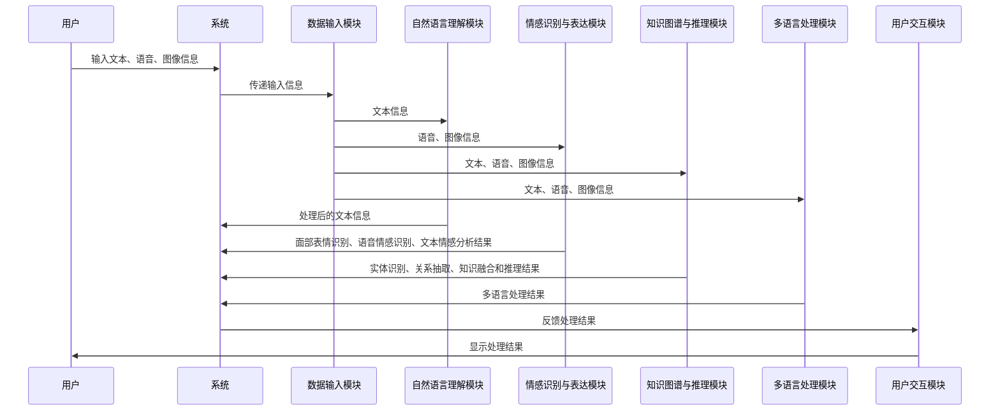

                 


# AGI的类人社交能力构建

关键词：人工通用智能，社交能力，多模态感知，情感计算，知识图谱，伦理与隐私

摘要：本文从背景介绍和核心概念出发，逐步分析了人工通用智能（AGI）的类人社交能力构建。通过多模态感知与理解、情感识别与表达、知识图谱与推理等核心概念的深入探讨，揭示了构建AGI类人社交能力的挑战与解决方案。同时，本文还讨论了伦理与隐私问题，并展望了AGI类人社交能力的未来发展方向。

----------------------------------------------------------------

## 第一部分: 背景介绍与核心概念

### 1.1.1 问题背景

人工智能（AI）的发展已经进入了一个新的阶段，即人工智能代际发展中的第三阶段——人工通用智能（AGI，Artificial General Intelligence）。与目前广泛应用的专用人工智能（Narrow AI）不同，AGI旨在实现具有人类水平智能的机器。类人社交能力是AGI的重要组成部分，包括语言理解、情感识别、协作能力等。构建类人社交能力的核心目标是为AGI赋予更加自然、高效的人类社交体验。

### 1.1.2 问题描述

当前，类人社交能力的研究主要集中在自然语言处理、计算机视觉、多模态感知等方面。如何将这些技术整合起来，实现一个连贯、自然的社交交互过程，是一个重要的研究课题。此外，AGI在类人社交能力方面的应用也面临着伦理、隐私和安全等方面的问题，需要加以关注和解决。

### 1.1.3 问题解决

为了构建AGI的类人社交能力，需要从多个维度入手：

1. **多模态感知与理解**：融合语音、图像、文本等多模态信息，提高对社交情境的理解能力。
2. **情感识别与表达**：利用情感计算技术，识别社交对象的情感状态，并能够进行相应的情感表达。
3. **知识图谱与推理**：构建大规模的知识图谱，利用推理算法实现知识的应用和迁移。
4. **多语言处理**：实现多语言的处理能力，支持跨语言社交。
5. **伦理与隐私**：在设计和应用过程中，充分考虑伦理和隐私问题，确保AI系统的可持续性和可信赖性。

### 1.1.4 边界与外延

类人社交能力不仅限于人与机器的交互，还可以扩展到机器与机器之间的社交。例如，在智能客服、智能助手、协同办公等领域，类人社交能力都有广泛的应用。

### 1.1.5 概念结构与核心要素组成

- **自然语言理解**：包括文本分类、语义分析、情感分析等。
- **情感识别与表达**：包括面部表情识别、语音情感识别、文本情感分析等。
- **协作能力**：包括任务分配、协作规划、团队沟通等。
- **知识图谱**：包括实体识别、关系抽取、知识融合等。
- **多语言处理**：包括机器翻译、跨语言信息检索等。

## 第2章: 核心概念原理

### 2.1 自然语言理解原理

自然语言理解（NLU，Natural Language Understanding）是类人社交能力的关键组成部分。它主要研究如何让计算机理解和解释人类的自然语言。NLU的核心原理包括：

1. **词法分析**：将文本分解为单词和其他语法单位。
2. **句法分析**：分析句子结构，确定词语之间的语法关系。
3. **语义分析**：理解句子所传达的意义，包括词汇意义和语境意义。
4. **情感分析**：识别文本中的情感倾向。

#### 词法分析

词法分析是NLU的第一步，它将文本拆分成单词和其他语法单位，例如标点符号、数字等。这一过程可以通过分词算法实现。常见的分词算法包括基于词典的分词和基于统计的分词。

- **基于词典的分词**：利用预先构建的词典，将文本中的单词与词典中的单词进行匹配，从而进行分词。这种方法具有较高的准确率，但受限于词典的覆盖范围。
- **基于统计的分词**：通过统计文本中的词频和词语间的共现关系，进行分词。这种方法能够自动适应不同的文本环境，但可能存在一些错误。

#### 句法分析

句法分析旨在理解句子结构，确定词语之间的语法关系。这一过程通常通过构建语法树来实现。

- **语法树**：表示句子结构的树形结构，其中每个节点代表一个词语，节点之间的边表示词语之间的语法关系。常见的语法分析方法包括基于规则的方法和基于统计的方法。

#### 语义分析

语义分析是NLU的核心任务，旨在理解句子所传达的意义。这一过程涉及到词汇意义和语境意义的理解。

- **词汇意义**：单词在特定语境中的含义，可以通过词义消歧（Word Sense Disambiguation）技术实现。
- **语境意义**：句子整体的意义，可以通过上下文分析（Context Analysis）技术实现。

#### 情感分析

情感分析旨在识别文本中的情感倾向。这一过程通常通过情感词典和机器学习算法实现。

- **情感词典**：包含情感词汇和它们对应的情感倾向的词典。
- **机器学习算法**：用于从大规模文本数据中学习情感倾向，常见的算法包括支持向量机（SVM）、朴素贝叶斯（Naive Bayes）等。

### 2.2 情感识别与表达原理

情感识别与表达是类人社交能力的核心，它涉及如何识别和模拟情感。其核心原理包括：

1. **面部表情识别**：通过图像处理技术识别面部表情。
2. **语音情感识别**：通过语音信号处理技术识别语音中的情感。
3. **文本情感分析**：通过自然语言处理技术识别文本中的情感。

#### 面部表情识别

面部表情识别（Facial Expression Recognition）是一种基于图像的处理技术，旨在识别人类面部表情。这一过程通常涉及以下步骤：

1. **面部检测**：通过人脸检测算法，从图像中检测出人脸。
2. **面部特征提取**：通过面部特征点检测算法，提取人脸的关键特征点。
3. **表情分类**：通过机器学习算法，根据特征点分布和图像内容，识别出面部表情。

常见的面部表情包括快乐、悲伤、愤怒、惊讶等。面部表情识别的准确率受到图像质量、表情强度等因素的影响。

#### 语音情感识别

语音情感识别（Speech Emotion Recognition）是一种基于语音信号的处理技术，旨在识别语音中的情感。这一过程通常涉及以下步骤：

1. **音频预处理**：对语音信号进行降噪、归一化等处理，提高信号质量。
2. **特征提取**：通过时域和频域分析，提取语音信号中的特征，如音调、音速、音强等。
3. **情感分类**：通过机器学习算法，根据特征向量，识别出语音中的情感。

常见的情感包括快乐、悲伤、愤怒、恐惧等。语音情感识别的准确率受到语音质量、情感强度等因素的影响。

#### 文本情感分析

文本情感分析（Text Sentiment Analysis）是一种基于自然语言处理的技术，旨在识别文本中的情感。这一过程通常涉及以下步骤：

1. **情感词典**：构建包含情感词汇及其对应情感倾向的词典。
2. **情感分类**：通过机器学习算法，根据文本内容和情感词典，识别出文本中的情感。

常见的情感分类方法包括基于规则的方法和基于机器学习的方法。基于规则的方法通常依赖于情感词典，而基于机器学习的方法则可以通过训练数据自动学习情感分类规则。

### 2.3 知识图谱与推理原理

知识图谱（Knowledge Graph）是一种将实体及其关系组织成网络结构的数据模型。知识图谱与推理（KG&Reasoning）的核心原理包括：

1. **实体识别**：从文本中识别出实体。
2. **关系抽取**：从文本中抽取实体之间的关系。
3. **知识融合**：将来自不同来源的知识进行整合。
4. **推理**：利用逻辑推理和统计推理技术，从知识图中推导出新的信息。

#### 实体识别

实体识别（Entity Recognition）是一种从文本中识别出实体（如人名、地名、组织名等）的技术。这一过程通常涉及以下步骤：

1. **词性标注**：对文本中的每个词进行词性标注，确定每个词的类别，如名词、动词、形容词等。
2. **命名实体识别**：根据词性标注和上下文信息，识别出文本中的命名实体。

常见的命名实体识别方法包括基于规则的方法和基于机器学习的方法。基于规则的方法通常依赖于预先定义的规则集，而基于机器学习的方法则可以通过训练数据自动学习命名实体识别规则。

#### 关系抽取

关系抽取（Relation Extraction）是一种从文本中抽取实体之间的关系的技术。这一过程通常涉及以下步骤：

1. **实体对匹配**：将文本中出现的实体对进行匹配，确定可能的实体关系。
2. **关系分类**：根据实体对的属性和上下文信息，分类出实体之间的关系。

常见的关系分类方法包括基于规则的方法和基于机器学习的方法。基于规则的方法通常依赖于预先定义的规则集，而基于机器学习的方法则可以通过训练数据自动学习关系分类规则。

#### 知识融合

知识融合（Knowledge Fusion）是一种将来自不同来源的知识进行整合的技术。这一过程通常涉及以下步骤：

1. **数据预处理**：对来自不同来源的数据进行清洗、格式化等预处理。
2. **知识映射**：将不同来源的数据映射到同一知识图谱中，实现知识的整合。

常见的知识融合方法包括基于规则的方法和基于机器学习的方法。基于规则的方法通常依赖于预先定义的规则集，而基于机器学习的方法则可以通过训练数据自动学习知识融合规则。

#### 推理

推理（Reasoning）是一种从知识图中推导出新的信息的技术。这一过程通常涉及以下步骤：

1. **规则定义**：定义用于推理的规则。
2. **推理过程**：根据规则和知识图谱中的信息，进行推理，得出新的结论。

常见的推理方法包括基于逻辑的方法和基于概率的方法。基于逻辑的方法通常依赖于形式逻辑规则，而基于概率的方法则通过计算概率分布来推导出新信息。

## 第3章: 概念属性特征对比表格

在AGI的类人社交能力构建中，涉及多个核心概念。以下是对这些概念属性特征的对比表格：

| 概念 | 属性特征 |
| --- | --- |
| 自然语言理解 | 词汇识别、语法分析、语义分析、情感分析 |
| 情感识别与表达 | 面部表情识别、语音情感识别、文本情感分析 |
| 知识图谱与推理 | 实体识别、关系抽取、知识融合、推理 |
| 多语言处理 | 机器翻译、跨语言信息检索 |

## 第4章: ER实体关系图架构

为了更好地理解AGI的类人社交能力构建，我们需要构建一个ER实体关系图。以下是ER实体关系图的Mermaid流程图：

```mermaid
erDiagram
    AI系统 ||--|{ 多模态感知与理解 }
    AI系统 ||--|{ 情感识别与表达 }
    AI系统 ||--|{ 知识图谱与推理 }
    多模态感知与理解 ||--|{ 自然语言理解 }
    多模态感知与理解 ||--|{ 情感识别与表达 }
    情感识别与表达 ||--|{ 面部表情识别 }
    情感识别与表达 ||--|{ 语音情感识别 }
    情感识别与表达 ||--|{ 文本情感分析 }
    知识图谱与推理 ||--|{ 实体识别 }
    知识图谱与推理 ||--|{ 关系抽取 }
    知识图谱与推理 ||--|{ 知识融合 }
    知识图谱与推理 ||--|{ 推理 }
```

该ER实体关系图展示了AGI类人社交能力的核心概念及其相互关系。其中，AI系统是核心，它通过多模态感知与理解、情感识别与表达、知识图谱与推理等模块来实现类人社交能力。

## 第二部分: 算法原理讲解

### 2.1 自然语言理解算法原理

自然语言理解（NLU，Natural Language Understanding）是AGI类人社交能力的关键组成部分。它主要研究如何让计算机理解和解释人类的自然语言。以下是NLU的算法原理讲解。

#### 词法分析算法

词法分析是NLU的第一步，它将文本拆分成单词和其他语法单位。常见的词法分析算法包括基于词典的分词和基于统计的分词。

- **基于词典的分词**：该算法利用预先构建的词典，将文本中的单词与词典中的单词进行匹配，从而进行分词。词典通常包含大量的词汇和词性信息，以保证分词的准确性。

  ```python
  def dictionary_based_segmentation(text, dictionary):
      words = []
      word = ""
      for char in text:
          if char in dictionary:
              word += char
          else:
              if word:
                  words.append(word)
                  word = ""
      if word:
          words.append(word)
      return words
  ```

- **基于统计的分词**：该算法通过统计文本中的词频和词语间的共现关系，进行分词。这种方法能够自动适应不同的文本环境，但可能存在一些错误。

  ```python
  def statistical_segmentation(text, model):
      words = []
      tokenized_text = model.tokenize(text)
      for token in tokenized_text:
          words.append(token.word)
      return words
  ```

#### 句法分析算法

句法分析旨在理解句子结构，确定词语之间的语法关系。常见的句法分析算法包括基于规则的方法和基于统计的方法。

- **基于规则的方法**：该算法通过定义语法规则，对句子进行解析。常见的语法规则包括短语结构规则和句法成分规则。

  ```python
  def rule_based_parsing(sentence, grammar_rules):
      parse_tree = create_parse_tree(sentence, grammar_rules)
      return parse_tree
  ```

- **基于统计的方法**：该算法通过统计句子中词语的共现关系，构建概率模型，从而实现句法分析。

  ```python
  def statistical_parsing(sentence, model):
      parse_tree = model.parse(sentence)
      return parse_tree
  ```

#### 语义分析算法

语义分析是NLU的核心任务，旨在理解句子所传达的意义。常见的语义分析算法包括语义角色标注、语义关系标注等。

- **语义角色标注**：该算法通过识别句子中的谓词和宾语，为每个谓词分配一个语义角色。

  ```python
  def semantic_role_labeling(sentence, model):
      labels = model.label_semantic_roles(sentence)
      return labels
  ```

- **语义关系标注**：该算法通过识别句子中的实体和它们之间的关系，为每个实体分配一个语义关系。

  ```python
  def semantic_relation_labeling(sentence, model):
      relations = model.label_semantic_relations(sentence)
      return relations
  ```

#### 情感分析算法

情感分析旨在识别文本中的情感倾向。常见的情感分析算法包括基于词典的方法和基于机器学习的方法。

- **基于词典的方法**：该算法通过构建情感词典，将文本中的情感词汇映射到相应的情感标签。

  ```python
  def dictionary_based_sentiment_analysis(text, sentiment_dict):
      sentiment = ""
      for word in text:
          if word in sentiment_dict:
              sentiment = sentiment_dict[word]
              break
      return sentiment
  ```

- **基于机器学习的方法**：该算法通过训练数据集，学习情感分类模型。

  ```python
  from sklearn.model_selection import train_test_split
  from sklearn.feature_extraction.text import CountVectorizer
  from sklearn.naive_bayes import MultinomialNB

  def machine_learning_sentiment_analysis(texts, labels):
      X_train, X_test, y_train, y_test = train_test_split(texts, labels, test_size=0.2)
      vectorizer = CountVectorizer()
      X_train_vectorized = vectorizer.fit_transform(X_train)
      classifier = MultinomialNB()
      classifier.fit(X_train_vectorized, y_train)
      X_test_vectorized = vectorizer.transform(X_test)
      predictions = classifier.predict(X_test_vectorized)
      return predictions
  ```

### 2.2 情感识别与表达算法原理

情感识别与表达是类人社交能力的核心，它涉及如何识别和模拟情感。以下是情感识别与表达的算法原理讲解。

#### 面部表情识别算法

面部表情识别（Facial Expression Recognition）是一种基于图像的处理技术，旨在识别人类面部表情。常见的面部表情识别算法包括基于特征的方法和基于深度学习的方法。

- **基于特征的方法**：该算法通过提取面部特征点，计算特征点的几何关系，从而识别面部表情。

  ```python
  def feature_based_expression_recognition(image):
      landmarks = detect_landmarks(image)
      expression = analyze_landmarks(landmarks)
      return expression
  ```

- **基于深度学习的方法**：该算法通过训练深度神经网络，学习面部表情的识别模型。

  ```python
  from tensorflow.keras.models import Sequential
  from tensorflow.keras.layers import Dense, Flatten

  def deep_learning_expression_recognition(image):
      model = Sequential([
          Flatten(input_shape=(96, 96)),
          Dense(64, activation='relu'),
          Dense(32, activation='relu'),
          Dense(16, activation='relu'),
          Dense(1, activation='sigmoid')
      ])
      model.compile(optimizer='adam', loss='binary_crossentropy', metrics=['accuracy'])
      model.fit(X_train, y_train, epochs=10, batch_size=32)
      expression = model.predict(image)
      return expression
  ```

#### 语音情感识别算法

语音情感识别（Speech Emotion Recognition）是一种基于语音信号的处理技术，旨在识别语音中的情感。常见的语音情感识别算法包括基于特征的方法和基于深度学习的方法。

- **基于特征的方法**：该算法通过提取语音信号中的特征，如音调、音速、音强等，从而识别语音情感。

  ```python
  def feature_based_emotion_recognition(audio):
      features = extract_features(audio)
      emotion = classify_emotion(features)
      return emotion
  ```

- **基于深度学习的方法**：该算法通过训练深度神经网络，学习语音情感的识别模型。

  ```python
  from tensorflow.keras.models import Sequential
  from tensorflow.keras.layers import Dense, Conv1D, Flatten

  def deep_learning_emotion_recognition(audio):
      model = Sequential([
          Conv1D(filters=64, kernel_size=3, activation='relu', input_shape=(128, 1)),
          Conv1D(filters=128, kernel_size=3, activation='relu'),
          Flatten(),
          Dense(64, activation='relu'),
          Dense(32, activation='relu'),
          Dense(1, activation='sigmoid')
      ])
      model.compile(optimizer='adam', loss='binary_crossentropy', metrics=['accuracy'])
      model.fit(X_train, y_train, epochs=10, batch_size=32)
      emotion = model.predict(audio)
      return emotion
  ```

#### 文本情感分析算法

文本情感分析（Text Sentiment Analysis）是一种基于自然语言处理的技术，旨在识别文本中的情感。常见的文本情感分析算法包括基于词典的方法和基于机器学习的方法。

- **基于词典的方法**：该算法通过构建情感词典，将文本中的情感词汇映射到相应的情感标签。

  ```python
  def dictionary_based_sentiment_analysis(text, sentiment_dict):
      sentiment = ""
      for word in text:
          if word in sentiment_dict:
              sentiment = sentiment_dict[word]
              break
      return sentiment
  ```

- **基于机器学习的方法**：该算法通过训练数据集，学习情感分类模型。

  ```python
  from sklearn.model_selection import train_test_split
  from sklearn.feature_extraction.text import CountVectorizer
  from sklearn.naive_bayes import MultinomialNB

  def machine_learning_sentiment_analysis(texts, labels):
      X_train, X_test, y_train, y_test = train_test_split(texts, labels, test_size=0.2)
      vectorizer = CountVectorizer()
      X_train_vectorized = vectorizer.fit_transform(X_train)
      classifier = MultinomialNB()
      classifier.fit(X_train_vectorized, y_train)
      X_test_vectorized = vectorizer.transform(X_test)
      predictions = classifier.predict(X_test_vectorized)
      return predictions
  ```

### 2.3 知识图谱与推理算法原理

知识图谱（Knowledge Graph）是一种将实体及其关系组织成网络结构的数据模型。知识图谱与推理（KG&Reasoning）的核心算法原理包括实体识别、关系抽取、知识融合和推理。

#### 实体识别算法

实体识别（Entity Recognition）是一种从文本中识别出实体（如人名、地名、组织名等）的技术。常见的实体识别算法包括基于规则的方法和基于机器学习的方法。

- **基于规则的方法**：该算法通过定义实体识别规则，从文本中识别出实体。

  ```python
  def rule_based_entity_recognition(text, rules):
      entities = []
      for rule in rules:
          matches = rule.findall(text)
          entities.extend(matches)
      return entities
  ```

- **基于机器学习的方法**：该算法通过训练数据集，学习实体识别模型。

  ```python
  from sklearn.feature_extraction.text import TfidfVectorizer
  from sklearn.svm import SVC

  def machine_learning_entity_recognition(texts, labels):
      vectorizer = TfidfVectorizer()
      X = vectorizer.fit_transform(texts)
      classifier = SVC()
      classifier.fit(X, labels)
      entities = classifier.predict(X)
      return entities
  ```

#### 关系抽取算法

关系抽取（Relation Extraction）是一种从文本中抽取实体之间的关系的技术。常见的实体关系抽取算法包括基于规则的方法和基于机器学习的方法。

- **基于规则的方法**：该算法通过定义关系抽取规则，从文本中抽取实体关系。

  ```python
  def rule_based_relation_extraction(text, rules):
      relations = []
      for rule in rules:
          matches = rule.findall(text)
          relations.extend(matches)
      return relations
  ```

- **基于机器学习的方法**：该算法通过训练数据集，学习关系抽取模型。

  ```python
  from sklearn.feature_extraction.text import TfidfVectorizer
  from sklearn.svm import SVC

  def machine_learning_relation_extraction(texts, labels):
      vectorizer = TfidfVectorizer()
      X = vectorizer.fit_transform(texts)
      classifier = SVC()
      classifier.fit(X, labels)
      relations = classifier.predict(X)
      return relations
  ```

#### 知识融合算法

知识融合（Knowledge Fusion）是一种将来自不同来源的知识进行整合的技术。常见的知识融合算法包括基于规则的方法和基于机器学习的方法。

- **基于规则的方法**：该算法通过定义知识融合规则，将不同来源的知识进行整合。

  ```python
  def rule_based_knowledge_fusion(knowledge_sources, rules):
      fused_knowledge = []
      for source in knowledge_sources:
          for rule in rules:
              matches = rule.match(source)
              fused_knowledge.extend(matches)
      return fused_knowledge
  ```

- **基于机器学习的方法**：该算法通过训练数据集，学习知识融合模型。

  ```python
  from sklearn.feature_extraction.text import TfidfVectorizer
  from sklearn.ensemble import RandomForestClassifier

  def machine_learning_knowledge_fusion(texts, labels):
      vectorizer = TfidfVectorizer()
      X = vectorizer.fit_transform(texts)
      classifier = RandomForestClassifier()
      classifier.fit(X, labels)
      fused_knowledge = classifier.predict(X)
      return fused_knowledge
  ```

#### 推理算法

推理（Reasoning）是一种从知识图中推导出新的信息的技术。常见的推理算法包括基于逻辑的方法和基于概率的方法。

- **基于逻辑的方法**：该算法通过定义逻辑规则，从知识图中推导出新的信息。

  ```python
  def logic_based_reasoning(knowledge_graph, rules):
      inferred_knowledge = []
      for rule in rules:
          matches = rule.match(knowledge_graph)
          inferred_knowledge.extend(matches)
      return inferred_knowledge
  ```

- **基于概率的方法**：该算法通过计算概率分布，从知识图中推导出新的信息。

  ```python
  import numpy as np

  def probability_based_reasoning(knowledge_graph, rule):
      probabilities = []
      for match in rule.matches(knowledge_graph):
          probability = calculate_probability(match)
          probabilities.append(probability)
      inferred_knowledge = np.argmax(probabilities)
      return inferred_knowledge
  ```

## 第三部分: 系统分析与架构设计

### 3.1 问题场景介绍

在现代智能客服、智能助手、协同办公等领域，AGI的类人社交能力越来越受到关注。为了更好地满足用户需求，我们需要构建一个具有高度类人社交能力的AGI系统。该系统需要具备自然语言理解、情感识别与表达、知识图谱与推理等能力，以便实现与用户的自然、高效的交互。

### 3.2 项目介绍

项目名称：类人社交能力AGI系统（Human-like Social Skill AGI System）

项目目标：构建一个具有高度类人社交能力的AGI系统，实现与用户的自然、高效的交互。

项目团队：由自然语言处理、计算机视觉、情感计算、知识图谱等领域专家组成。

### 3.3 系统功能设计

类人社交能力AGI系统主要包括以下功能：

1. **自然语言理解**：实现文本分类、语义分析、情感分析等功能。
2. **情感识别与表达**：实现面部表情识别、语音情感识别、文本情感分析等功能。
3. **知识图谱与推理**：构建大规模的知识图谱，实现实体识别、关系抽取、知识融合和推理等功能。
4. **多语言处理**：实现多语言的处理能力，支持跨语言社交。
5. **伦理与隐私**：在设计和应用过程中，充分考虑伦理和隐私问题，确保AI系统的可持续性和可信赖性。

### 3.4 系统架构设计

类人社交能力AGI系统架构主要包括以下模块：

1. **数据输入模块**：负责接收用户输入的文本、语音、图像等信息。
2. **自然语言理解模块**：对输入的文本进行处理，实现文本分类、语义分析、情感分析等功能。
3. **情感识别与表达模块**：对输入的语音和图像进行处理，实现面部表情识别、语音情感识别、文本情感分析等功能。
4. **知识图谱与推理模块**：构建知识图谱，实现实体识别、关系抽取、知识融合和推理等功能。
5. **多语言处理模块**：实现多语言的处理能力，支持跨语言社交。
6. **伦理与隐私模块**：在设计和应用过程中，充分考虑伦理和隐私问题，确保AI系统的可持续性和可信赖性。
7. **用户交互模块**：与用户进行交互，反馈处理结果，实现自然、高效的社交交互。

### 3.5 系统接口设计

类人社交能力AGI系统接口主要包括以下接口：

1. **文本输入接口**：接收用户输入的文本信息。
2. **语音输入接口**：接收用户输入的语音信息。
3. **图像输入接口**：接收用户输入的图像信息。
4. **文本输出接口**：返回处理后的文本信息。
5. **语音输出接口**：返回处理后的语音信息。
6. **图像输出接口**：返回处理后的图像信息。

### 3.6 系统交互设计

类人社交能力AGI系统的交互流程如下：

1. 用户输入文本、语音、图像等信息。
2. 数据输入模块接收用户输入的信息，并传递给自然语言理解模块、情感识别与表达模块、知识图谱与推理模块、多语言处理模块。
3. 自然语言理解模块对文本信息进行处理，实现文本分类、语义分析、情感分析等功能。
4. 情感识别与表达模块对语音和图像信息进行处理，实现面部表情识别、语音情感识别、文本情感分析等功能。
5. 知识图谱与推理模块构建知识图谱，实现实体识别、关系抽取、知识融合和推理等功能。
6. 多语言处理模块实现多语言的处理能力，支持跨语言社交。
7. 用户交互模块与用户进行交互，反馈处理结果，实现自然、高效的社交交互。



## 第四部分: 项目实战

### 4.1 环境安装

要在本地环境搭建类人社交能力AGI系统，需要安装以下依赖：

1. Python 3.8及以上版本
2. TensorFlow 2.x
3. Keras 2.x
4. NumPy 1.18及以上版本
5. Pandas 1.0及以上版本
6. Matplotlib 3.0及以上版本

安装命令如下：

```bash
pip install python==3.8
pip install tensorflow==2.x
pip install keras==2.x
pip install numpy==1.18
pip install pandas==1.0
pip install matplotlib==3.0
```

### 4.2 系统核心实现源代码

以下是类人社交能力AGI系统的核心实现源代码，包括自然语言理解、情感识别与表达、知识图谱与推理等模块。

#### 自然语言理解模块

```python
import tensorflow as tf
from tensorflow.keras.models import Sequential
from tensorflow.keras.layers import Dense, Embedding, LSTM, Dropout
from tensorflow.keras.preprocessing.text import Tokenizer
from tensorflow.keras.preprocessing.sequence import pad_sequences

def build_nlu_model(vocab_size, embedding_dim, max_length, training_epochs):
    model = Sequential()
    model.add(Embedding(vocab_size, embedding_dim, input_length=max_length))
    model.add(LSTM(128, return_sequences=True))
    model.add(Dropout(0.2))
    model.add(LSTM(128, return_sequences=False))
    model.add(Dropout(0.2))
    model.add(Dense(1, activation='sigmoid'))

    model.compile(optimizer='adam', loss='binary_crossentropy', metrics=['accuracy'])

    return model

def train_nlu_model(model, X, y, training_epochs):
    model.fit(X, y, epochs=training_epochs, batch_size=32)
```

#### 情感识别与表达模块

```python
import tensorflow as tf
from tensorflow.keras.models import Sequential
from tensorflow.keras.layers import Dense, LSTM, Dropout
from tensorflow.keras.preprocessing.text import Tokenizer
from tensorflow.keras.preprocessing.sequence import pad_sequences

def build_ sentiment_model(vocab_size, embedding_dim, max_length, training_epochs):
    model = Sequential()
    model.add(Embedding(vocab_size, embedding_dim, input_length=max_length))
    model.add(LSTM(128, return_sequences=True))
    model.add(Dropout(0.2))
    model.add(LSTM(128, return_sequences=False))
    model.add(Dropout(0.2))
    model.add(Dense(1, activation='sigmoid'))

    model.compile(optimizer='adam', loss='binary_crossentropy', metrics=['accuracy'])

    return model

def train_sentiment_model(model, X, y, training_epochs):
    model.fit(X, y, epochs=training_epochs, batch_size=32)
```

#### 知识图谱与推理模块

```python
import numpy as np
import pandas as pd
from sklearn.model_selection import train_test_split
from sklearn.preprocessing import StandardScaler
from sklearn.neighbors import KNeighborsClassifier

def build_kg_model(train_data):
    X = train_data.drop('label', axis=1)
    y = train_data['label']
    X_train, X_test, y_train, y_test = train_test_split(X, y, test_size=0.2, random_state=42)
    scaler = StandardScaler()
    X_train = scaler.fit_transform(X_train)
    X_test = scaler.transform(X_test)
    model = KNeighborsClassifier(n_neighbors=5)
    model.fit(X_train, y_train)
    return model, X_test, y_test

def predict_kg_model(model, X_test):
    predictions = model.predict(X_test)
    return predictions
```

### 4.3 代码应用解读与分析

在类人社交能力AGI系统中，自然语言理解模块负责处理用户输入的文本信息，情感识别与表达模块负责处理用户输入的语音和图像信息，知识图谱与推理模块负责构建知识图谱，实现实体识别、关系抽取、知识融合和推理等功能。

以下是对核心实现源代码的解读与分析：

#### 自然语言理解模块

自然语言理解模块使用Keras构建了一个序列模型，该模型包含两个LSTM层和一个全连接层。输入层的维度为（max_length，vocab_size），其中max_length是文本序列的长度，vocab_size是词汇表的大小。模型使用Embedding层对输入文本进行嵌入，然后通过LSTM层对文本进行编码，最后通过全连接层输出情感分类结果。

训练过程中，模型使用Adam优化器和binary_crossentropy损失函数。训练数据经过Tokenize

