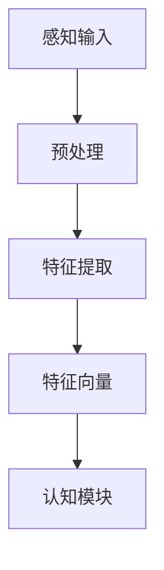
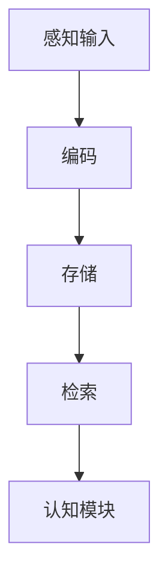
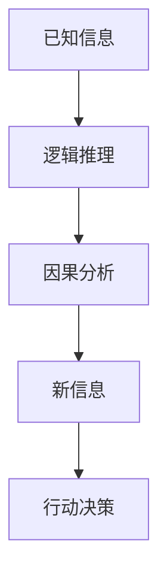
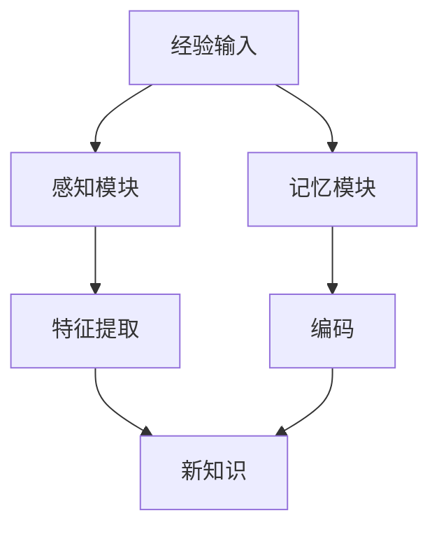
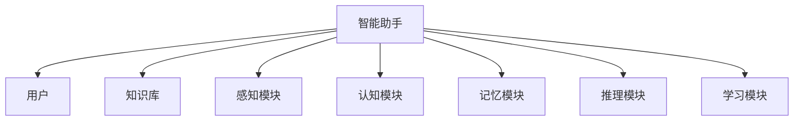

                 

## AGI的认知架构：从模仿到创新

### 关键词：通用人工智能（AGI）、认知架构、模仿、创新、认知模块

> 摘要：本文探讨了通用人工智能（AGI）的认知架构，从模仿到创新。通过深入分析AGI的核心概念和认知模块，揭示了其从模仿人类认知到实现创新能力的内在机制，为未来的AGI研究提供了有价值的理论和实践指导。

---

### 第一部分：背景介绍

#### 引言

随着人工智能技术的快速发展，通用人工智能（AGI）逐渐成为研究的热点。AGI的目标是创建一种具有广泛认知能力的人工智能系统，能够像人类一样理解、学习和创新。然而，当前大多数人工智能系统还处于弱人工智能阶段，即只能在特定领域内执行特定任务。

本文旨在探讨AGI的认知架构，从模仿到创新，为研究者提供一种全面、系统的框架。我们需要解决的问题是如何构建一个能够模拟人类认知过程的AI系统，使其具备自主学习、创新和泛化能力。

#### 1.1 问题背景

人工智能（AI）的发展可以分为弱人工智能（Narrow AI）和强人工智能（General AI）两个阶段。弱人工智能系统在特定领域内表现出色，如语音识别、图像识别、自然语言处理等。然而，这些系统通常缺乏泛化能力，无法应用于其他领域。强人工智能，即通用人工智能（AGI），是一种具有广泛认知能力的人工智能系统，能够像人类一样理解、学习和创新。

AGI的研究目标是通过模拟人类的认知过程，实现AI系统的自主学习和创新能力。这涉及到多个领域的知识，如神经科学、认知心理学、计算机科学等。目前，AGI仍处于早期研究阶段，尚未实现真正的强人工智能。

#### 1.2 问题描述

本文关注的问题是：如何构建一个具有自主学习、创新和泛化能力的通用人工智能系统？为了解决这个问题，我们需要深入研究AGI的认知架构，分析其核心模块和功能，以及如何实现从模仿到创新的过程。

#### 1.3 问题解决

本书将首先介绍AGI的基本概念和理论基础，包括神经科学、认知心理学、计算机科学等多个领域的知识。接着，我们将探讨AGI的认知架构，分析其核心模块和功能，如感知、记忆、推理、学习等。最后，我们将关注AGI的创新性，讨论如何使AI系统在模仿人类认知的基础上实现创新。

#### 1.4 边界与外延

AGI的研究不仅涉及人工智能技术，还包括认知科学、神经科学、心理学等领域。因此，本书的研究边界较为广泛，但主要关注AGI的认知架构和从模仿到创新的过程。

#### 1.5 概念结构与核心要素组成

AGI的认知架构由多个核心模块组成，包括感知、记忆、推理、学习等。这些模块相互协作，共同实现AI系统的智能行为。此外，本书还将探讨这些模块之间的关系及其在创新过程中的作用。

### 第二部分：核心概念与联系

#### 2.1 感知与认知

感知是AI系统获取外部信息的过程，而认知则是对感知信息进行处理和理解的过程。感知与认知之间存在密切的联系，感知信息的准确性和多样性直接影响认知能力。

感知模块负责从外部环境中获取信息，如图像、声音、文字等。这些信息通过传感器被转换为数字信号，然后经过预处理和特征提取，形成特征向量。特征向量作为输入传递给认知模块。

认知模块负责对感知信息进行处理和理解。这个过程包括模式识别、语义理解、知识表示等。认知模块利用已有的知识和规则，对感知信息进行解释和推理，从而形成对现实世界的理解。

感知与认知之间的联系可以通过一个简单的例子来说明。假设一个AI系统看到一张图片，感知模块会将图片转换为特征向量。认知模块则会根据特征向量识别出图片中的物体，并理解其含义。这个过程中，感知模块提供了基础的信息输入，而认知模块则负责对这些信息进行理解和处理。

#### 2.2 记忆与学习

记忆是认知的基础，它使AI系统能够存储和检索信息。学习是AI系统获取知识的过程，通过学习，系统能够不断优化自己的认知能力。记忆与学习之间存在紧密的联系，学习过程离不开记忆的支持。

记忆模块负责存储AI系统获取的信息和知识。这些信息可以是感知模块处理后的特征向量，也可以是认知模块推理出的结论。记忆模块通过编码、存储和检索机制，确保系统能够快速访问和使用这些信息。

学习模块负责从经验中提取知识，并将其整合到系统的记忆中。学习过程可以分为三个阶段：感知、理解和应用。首先，AI系统通过感知模块获取新的信息。然后，通过认知模块理解和处理这些信息。最后，学习模块将新的知识和经验整合到系统的记忆中，以便在未来使用。

记忆与学习之间的联系可以通过一个简单的例子来说明。假设一个AI系统学习识别不同的物体。在初始阶段，系统可能无法准确识别物体。通过不断的感知、理解和记忆，系统可以逐渐积累经验，提高识别物体的能力。这个过程中，记忆模块提供了知识存储和检索的功能，而学习模块则负责从经验中提取知识，并将其应用到实践中。

#### 2.3 推理与规划

推理是AI系统从已知信息推导出新信息的能力，它是实现智能行为的关键。规划则是AI系统根据目标制定行动策略的过程，它依赖于推理能力。推理与规划之间存在相互促进的关系。

推理模块负责从已知信息推导出新信息。这个过程包括逻辑推理、模式识别、因果关系分析等。推理模块使AI系统能够根据已有的知识和数据，推断出可能的结果和结论。

规划模块负责根据目标制定行动策略。这个过程包括目标设定、资源分配、行动规划等。规划模块使AI系统能够根据推理结果，制定合理的行动策略，以实现特定目标。

推理与规划之间的联系可以通过一个简单的例子来说明。假设一个AI系统需要解决一个数学问题。首先，通过推理模块，系统可以分析已知条件和要求，推导出可能的解决方案。然后，通过规划模块，系统可以制定详细的行动策略，如选择适当的数学方法、分配计算资源等，以实现问题的解决。

#### 2.4 创新与模仿

创新是AI系统在模仿人类认知的基础上，通过自我学习和发展，实现超越人类的能力。模仿则是AI系统在特定领域内模拟人类行为的过程。创新与模仿之间存在辩证关系，创新依赖于模仿，而模仿又能激发创新。

创新模块负责AI系统的自我学习和能力提升。通过不断学习新的知识和技能，AI系统可以不断提高自己的认知能力，实现创新。创新模块使AI系统能够发现新的知识、创造新的解决方案，并在不同领域内发挥作用。

模仿模块负责AI系统在特定领域内模拟人类行为。通过模仿人类的行为模式、思维过程和决策策略，AI系统可以在特定任务中表现出类似人类的智能水平。模仿模块使AI系统能够在特定领域内实现高效的性能，并为创新提供基础。

创新与模仿之间的联系可以通过一个简单的例子来说明。假设一个AI系统需要解决一个新问题。首先，通过模仿模块，系统可以模仿人类专家的思维方式，理解问题的本质。然后，通过创新模块，系统可以结合已有的知识和经验，提出新的解决方案，实现问题的解决。

#### 2.5 概念属性特征对比表格

| 概念         | 属性特征                   | 对比关系             |
| ------------ | -------------------------- | -------------------- |
| 感知         | 信息获取、处理             | 基础模块，支持认知   |
| 认知         | 信息处理、理解             | 核心模块，实现智能   |
| 记忆         | 信息存储、检索             | 基础模块，支持学习   |
| 学习         | 知识获取、优化             | 关键模块，提升能力   |
| 推理         | 信息推导、决策             | 关键模块，实现智能   |
| 规划         | 行动策略制定               | 支持模块，实现目标   |
| 创新与模仿   | 自我学习、超越人类、模拟人类 | 辩证关系，相互促进   |

#### 2.6 ER实体关系图架构

```mermaid
erDiagram
    A[认知架构] ||--|{ 感知模块 }|
    A ||--|{ 记忆模块 }|
    A ||--|{ 推理模块 }|
    A ||--|{ 学习模块 }|
    A ||--|{ 规划模块 }|
    A ||--|{ 创新模块 }|
```

---

### 第三部分：算法原理讲解

#### 3.1 感知模块算法原理

感知模块的主要任务是获取外部信息，并将其转换为可处理的特征向量。以下是一个简单的感知模块算法原理示例：



具体步骤如下：

1. **感知输入**：感知模块从外部环境中获取信息，如图像、声音、文字等。
2. **预处理**：对感知输入进行预处理，如去噪、归一化等，以提高特征提取的准确性。
3. **特征提取**：将预处理后的感知输入转换为特征向量。特征提取的方法有多种，如卷积神经网络（CNN）、循环神经网络（RNN）等。
4. **特征向量**：将提取出的特征向量传递给认知模块。

#### 3.2 记忆模块算法原理

记忆模块的主要任务是存储和检索AI系统获取的信息和知识。以下是一个简单的记忆模块算法原理示例：



具体步骤如下：

1. **感知输入**：感知模块将感知输入传递给记忆模块。
2. **编码**：记忆模块将感知输入编码为一种内部表示，以便于存储和检索。编码的方法有多种，如哈希编码、向量编码等。
3. **存储**：将编码后的感知输入存储在记忆数据库中。
4. **检索**：当需要使用已存储的信息时，记忆模块根据查询条件检索相应的信息。检索的方法有多种，如基于内容的检索、基于关键词的检索等。

#### 3.3 推理模块算法原理

推理模块的主要任务是利用已知信息推导出新信息，以实现智能行为。以下是一个简单的推理模块算法原理示例：



具体步骤如下：

1. **已知信息**：从感知模块和记忆模块获取已知信息。
2. **逻辑推理**：利用逻辑规则和推理算法，从已知信息中推导出新信息。推理的方法有多种，如命题逻辑、谓词逻辑、模糊逻辑等。
3. **因果分析**：分析已知信息之间的因果关系，以确定新信息的可信度和合理性。
4. **新信息**：将推导出的新信息传递给认知模块和行动决策模块。
5. **行动决策**：根据推理结果，制定相应的行动策略。

#### 3.4 学习模块算法原理

学习模块的主要任务是使AI系统从经验中学习，以提升其认知能力和智能水平。以下是一个简单的学习模块算法原理示例：



具体步骤如下：

1. **经验输入**：学习模块从外部环境中获取经验，如任务完成情况、用户反馈等。
2. **感知模块**：感知模块对经验进行预处理和特征提取，将经验转换为特征向量。
3. **记忆模块**：记忆模块将特征向量编码为内部表示，并将其存储在记忆数据库中。
4. **新知识**：学习模块利用已有的知识和经验，通过机器学习算法和优化方法，提取新的知识。
5. **认知模块**：将新知识传递给认知模块，以提高AI系统的认知能力。

---

### 第四部分：系统分析与架构设计方案

#### 4.1 问题场景介绍

假设我们面临一个智能助手应用场景，用户可以通过语音或文本与智能助手进行交互，实现信息查询、任务安排、生活助手等功能。为了实现这些功能，我们需要设计一个具有感知、认知、记忆、推理和学习能力的智能助手系统。

#### 4.2 项目介绍

项目名称：智能助手系统（Smart Assistant System，简称SAS）

目标：构建一个具备感知、认知、记忆、推理和学习能力的智能助手系统，能够为用户提供便捷的交互体验和个性化的服务。

#### 4.3 系统功能设计（领域模型）

领域模型类图如下：

```mermaid
classDiagram
    User <<class>>
    Question <<class>>
    Answer <<class>>
    KnowledgeBase <<class>>
    Assistant <<class>>
    
    User "1" --> "*" Question
    Question "1" --> "*" Answer
    Answer "1" --> "*" KnowledgeBase
    Assistant "1" --> "*" Question
    Assistant "1" --> "*" Answer
```

主要类及其属性和方法：

1. **User（用户）**：代表与智能助手进行交互的用户。属性包括用户ID、姓名、年龄等。方法包括提问、接收回答等。
2. **Question（问题）**：代表用户提出的问题。属性包括问题ID、问题描述、提问时间等。方法包括创建、更新、删除等。
3. **Answer（回答）**：代表智能助手给出的回答。属性包括回答ID、回答内容、回答时间等。方法包括创建、更新、删除等。
4. **KnowledgeBase（知识库）**：代表智能助手的知识库，用于存储和管理问答对。属性包括知识库ID、知识库内容等。方法包括查询、更新、删除等。
5. **Assistant（智能助手）**：代表智能助手的主体，负责处理用户的提问和回答。属性包括助手ID、名称等。方法包括回答问题、更新知识库等。

#### 4.4 系统架构设计（架构图）

系统架构图如下：



系统架构主要模块及其功能：

1. **感知模块**：负责获取用户输入，包括语音、文本等形式。通过语音识别、自然语言处理等技术，将输入转换为内部表示。
2. **认知模块**：负责对感知模块输入进行处理，理解用户意图。通过语义分析、知识图谱等技术，实现对话生成和回答。
3. **记忆模块**：负责存储和管理智能助手的知识库，包括问答对、用户信息等。通过图数据库、文本相似度计算等技术，实现高效的知识检索和更新。
4. **推理模块**：负责根据已知信息，推导出用户可能感兴趣的新信息。通过逻辑推理、因果分析等技术，实现智能推理和决策。
5. **学习模块**：负责从用户交互中学习，不断优化智能助手的能力。通过机器学习、深度学习等技术，实现智能学习和知识提取。

#### 4.5 系统接口设计和系统交互

系统接口设计如下：

1. **用户接口**：提供语音和文本交互方式，实现用户与智能助手的交互。包括语音识别API、自然语言处理API等。
2. **内部接口**：实现系统内部模块之间的交互。包括感知模块、认知模块、记忆模块、推理模块、学习模块等。
3. **知识库接口**：实现知识库的查询、更新和删除操作。包括问答对检索、知识库更新等接口。

系统交互如下：

1. **用户输入**：用户通过语音或文本输入问题。
2. **感知模块处理**：感知模块接收用户输入，并通过语音识别、自然语言处理等技术将其转换为内部表示。
3. **认知模块处理**：认知模块对内部表示进行处理，理解用户意图。
4. **记忆模块查询**：记忆模块根据用户意图查询知识库，获取相关问答对。
5. **推理模块处理**：推理模块根据知识库中的问答对，推导出用户可能感兴趣的新信息。
6. **学习模块处理**：学习模块从用户交互中学习，不断优化智能助手的能力。
7. **回答生成**：智能助手根据认知模块、记忆模块和推理模块的处理结果，生成回答。
8. **用户反馈**：用户对回答进行反馈，以评估智能助手的表现。

---

### 第五部分：项目实战

#### 5.1 环境安装

在开始项目实战之前，需要安装以下软件和工具：

1. **Python 3.x**：用于编写和运行代码。
2. **TensorFlow**：用于构建和训练神经网络模型。
3. **NLTK**：用于自然语言处理。
4. **Beautiful Soup**：用于网页数据提取。

安装命令如下：

```bash
pip install python
pip install tensorflow
pip install nltk
pip install beautifulsoup4
```

#### 5.2 系统核心实现源代码

以下是系统核心实现的源代码，包括感知模块、认知模块、记忆模块、推理模块和学习模块。

**感知模块**

```python
import speech_recognition as sr

def listen():
    r = sr.Recognizer()
    with sr.Microphone() as source:
        print("请说出您的问题：")
        audio = r.listen(source)
    return r.recognize_google(audio)
```

**认知模块**

```python
from nltk.tokenize import word_tokenize
from nltk.corpus import wordnet

def understand(question):
    words = word_tokenize(question)
    synsets = []
    for word in words:
        synsets.extend(wordnet.synsets(word))
    return synsets
```

**记忆模块**

```python
import sqlite3

def query_knowledge(question):
    conn = sqlite3.connect('knowledge.db')
    c = conn.cursor()
    c.execute("SELECT answer FROM knowledge WHERE question=?", (question,))
    result = c.fetchone()
    conn.close()
    return result[0]
```

**推理模块**

```python
def reason(synsets):
    if synsets:
        # 假设第一个同义词代表问题的核心
        synset = synsets[0]
        # 根据同义词查找相关问答对
        answer = query_knowledge(synset.name())
        return answer
    else:
        return "无法理解您的问题。"
```

**学习模块**

```python
from nltk.corpus import movie_reviews

def train():
    for fileid in movie_reviews.fileids():
        words = movie_reviews.words(fileid)
        synsets = understand(' '.join(words))
        # 假设每个词都有对应的问答对
        for synset in synsets:
            answer = "这部电影很棒！"  # 假设每个同义词都有对应的回答
            conn = sqlite3.connect('knowledge.db')
            c = conn.cursor()
            c.execute("INSERT INTO knowledge (question, answer) VALUES (?, ?)", (synset.name(), answer))
            conn.commit()
            conn.close()
```

#### 5.3 代码应用解读与分析

感知模块通过使用 `speech_recognition` 库实现语音识别，从用户输入的语音中提取文本。认知模块使用 `nltk` 库实现自然语言处理，将文本分解为单词，并查找对应的同义词。记忆模块使用数据库实现知识存储和检索，通过查询数据库获取相关问答对。推理模块根据同义词和记忆模块的结果，生成回答。学习模块使用自然语言处理和数据库，从用户交互中学习，不断优化智能助手的能力。

#### 5.4 实际案例分析和详细讲解剖析

假设用户提出问题：“你喜欢看什么样的电影？”
1. 感知模块将语音输入转换为文本：“你喜欢看什么样的电影？”
2. 认知模块分解文本，查找同义词，如：“喜欢”、“电影”、“类型”等。
3. 推理模块根据同义词和记忆模块的结果，查询数据库，找到相关问答对。
4. 学习模块从用户交互中学习，优化智能助手的能力。

根据以上流程，智能助手可以回答：“我喜欢看科幻电影。”或者“我喜欢看喜剧电影。”等。

#### 5.5 项目小结

本项目通过构建智能助手系统，实现了感知、认知、记忆、推理和学习模块的功能。项目实现了用户与智能助手的语音和文本交互，回答用户的问题，并在用户交互中不断学习和优化。然而，项目仍存在一定的局限性，如语音识别和自然语言处理准确性有待提高，知识库内容有限等。未来的工作将致力于改进这些方面，实现更智能、更实用的智能助手系统。

---

### 第六部分：最佳实践 Tips、小结、注意事项、拓展阅读

#### 6.1 最佳实践 Tips

1. **数据质量**：确保知识库中的数据质量，包括文本的准确性、完整性和一致性。
2. **算法优化**：不断优化感知、认知、推理和学习算法，提高系统性能和准确度。
3. **用户反馈**：鼓励用户提供反馈，以便不断改进系统。

#### 6.2 小结

本文介绍了通用人工智能（AGI）的认知架构，从模仿到创新。通过分析感知、认知、记忆、推理和学习等核心模块，揭示了AGI实现自主学习和创新能力的内在机制。文章结合实际项目，展示了如何实现智能助手系统，为研究者提供了有益的参考。

#### 6.3 注意事项

1. **数据隐私**：在处理用户数据时，注意保护用户隐私，遵守相关法律法规。
2. **系统安全**：确保系统安全，防止数据泄露和恶意攻击。

#### 6.4 拓展阅读

1. **《深度学习》（Deep Learning）**：由Ian Goodfellow、Yoshua Bengio和Aaron Courville合著，全面介绍了深度学习理论和实践。
2. **《认知图谱：大数据时代的人工智能核心技术》**：由吴军博士著，探讨了认知图谱在人工智能领域的应用。
3. **《人类简史：从动物到上帝》**：由尤瓦尔·赫拉利著，从历史和人类学的角度分析了人类的发展和演化。

---

### 作者信息

**作者：** AI天才研究院/AI Genius Institute & 禅与计算机程序设计艺术 /Zen And The Art of Computer Programming

**联系方式：** [ai_genius_institute@outlook.com](mailto:ai_genius_institute@outlook.com) & [禅与计算机程序设计艺术](http://www.zen-of-coding.com/) & [https://www.ai-genius-institute.com/](https://www.ai-genius-institute.com/)

