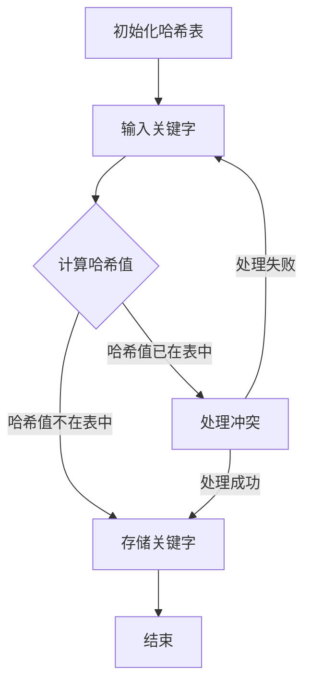
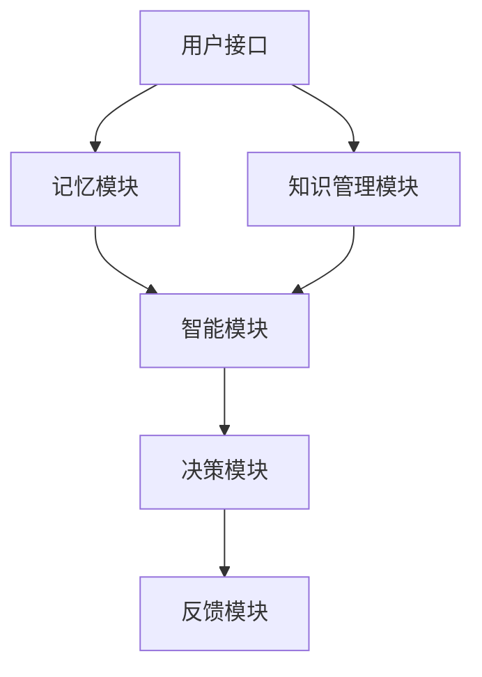
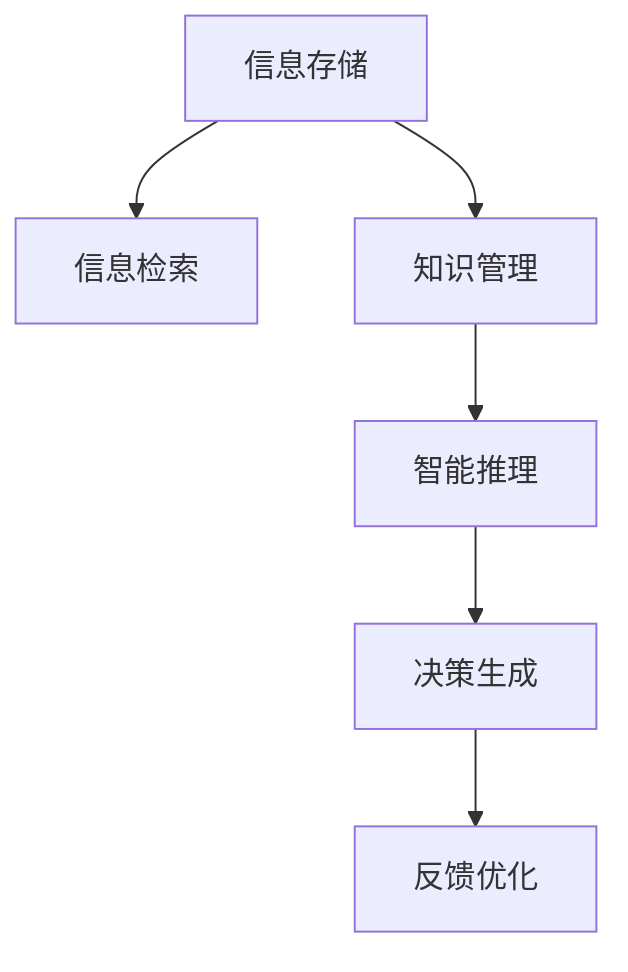
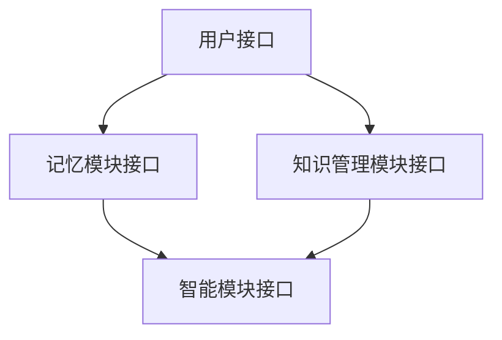
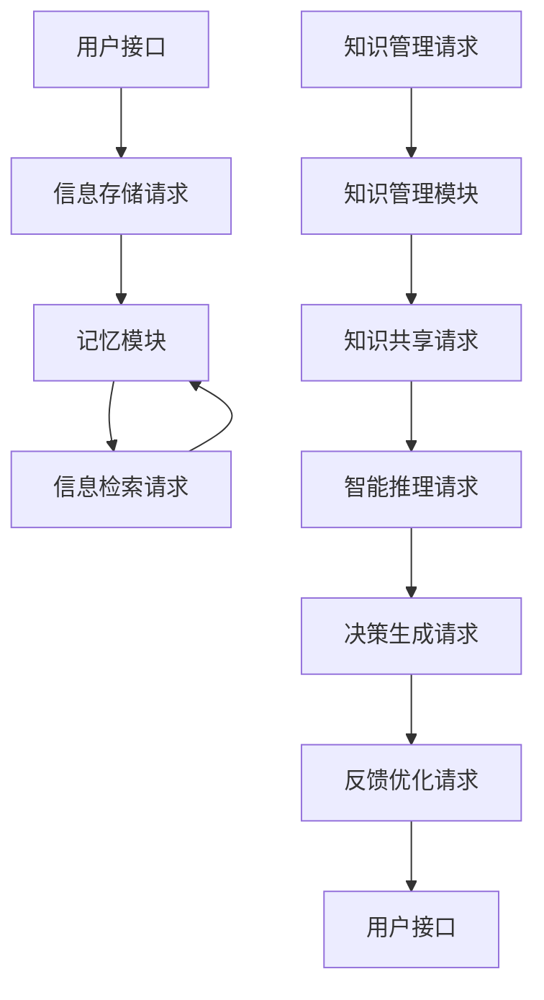

                 

----------------------------------------------------------------

# AGI的记忆系统设计与知识管理

关键词：AGI、记忆系统、知识管理、设计原理、算法、架构

摘要：本文探讨了通用人工智能（AGI）的记忆系统设计与知识管理。首先，对记忆系统的基本概念进行了阐述，分析了其与传统记忆的区别。接着，深入探讨了AGI记忆系统设计的基本原理，包括信息编码、存储、检索和处理等。然后，通过数学模型和算法原理，详细解析了记忆系统的工作机制。最后，结合实际应用，讨论了AGI记忆系统设计与知识管理的未来发展前景。

## 第一部分: AGI的记忆系统设计与知识管理概述

### 1.1 AGI的记忆系统

#### 1.1.1 问题背景

随着人工智能技术的快速发展，通用人工智能（AGI）成为研究的热点。然而，当前的AI系统在记忆方面存在诸多问题，如存储容量有限、检索效率低下、信息处理能力不足等。因此，研究AGI的记忆系统设计，实现高效、可靠、可持续的知识管理，具有重要意义。

#### 1.1.2 核心概念

记忆系统是指用于存储、检索和处理信息的系统。在AGI中，记忆系统不仅要实现高效的数据存储和检索，还需要具备智能处理信息的能力。以下是记忆系统的核心概念：

1. **信息编码**：将信息转换为计算机可以处理的形式。
2. **信息存储**：将编码后的信息存储在计算机中。
3. **信息检索**：根据需要快速检索所需信息。
4. **信息处理**：对检索到的信息进行进一步处理，如分析、推理、决策等。

#### 1.1.3 记忆系统的特点

1. **智能性**：记忆系统能够根据需求自动调整存储策略，提高信息处理效率。
2. **高效性**：通过优化算法和数据结构，实现快速的信息存储和检索。
3. **可扩展性**：记忆系统能够根据需求动态扩展存储容量。
4. **安全性**：确保存储的信息不会受到恶意攻击或篡改。

#### 1.1.4 记忆系统与传统记忆的区别

传统记忆依赖于人类大脑，而AGI的记忆系统依赖计算机技术。具体区别如下：

1. **存储方式**：传统记忆通过神经元连接存储信息，而AGI的记忆系统通过电子设备存储信息。
2. **检索速度**：传统记忆的检索速度较慢，而AGI的记忆系统可以实现快速检索。
3. **信息容量**：传统记忆的信息容量有限，而AGI的记忆系统具有巨大的存储容量。
4. **信息处理**：传统记忆无法进行复杂的计算和推理，而AGI的记忆系统能够实现智能化的信息处理。

#### 1.1.5 AGI记忆系统的重要性

1. **核心作用**：提高AI的决策能力、学习效率、知识整合能力。
2. **应用前景**：在医疗、金融、教育、工业等领域具有广泛的应用前景。

### 1.2 知识管理

#### 1.2.1 问题背景

在庞大的数据中，如何有效地管理知识，使其为AI所用，是当前AI研究的重要课题。知识管理是指系统地收集、存储、处理、共享和应用知识的过程。通过知识管理，可以将数据转化为有用的知识，提高AI的知识处理能力。

#### 1.2.2 核心概念

1. **知识管理的定义**：知识管理是指通过组织内部的知识共享、协作和创新，将知识转化为行动的能力。
2. **知识管理的特点**：
   - **系统性**：知识管理是一个系统的过程，包括知识获取、存储、处理、共享和应用。
   - **动态性**：知识管理是一个动态的过程，需要不断更新和优化。
   - **共享性**：知识管理强调知识共享，促进组织内部的知识流动。
   - **增值性**：知识管理通过将知识转化为行动，提高组织的竞争力。

#### 1.2.3 知识管理与传统信息管理的区别

1. **目标不同**：传统信息管理注重数据的存储和检索，而知识管理注重知识的获取、共享和应用。
2. **范围不同**：传统信息管理主要关注组织内部的信息，而知识管理关注组织内部和外部信息的整合。
3. **过程不同**：传统信息管理是一个线性的过程，而知识管理是一个循环迭代的过程。

#### 1.2.4 知识管理在AGI中的应用

1. **核心作用**：提高AI的知识处理能力、决策能力、创新能力。
2. **应用前景**：在医疗、金融、教育、工业等领域具有广泛的应用前景。

### 1.3 知识管理的基本原理

#### 1.3.1 知识管理的流程

知识管理的流程包括以下几个方面：

1. **知识获取**：通过各种渠道获取知识，包括内部知识和外部知识。
2. **知识存储**：将获取到的知识存储在知识库中，方便后续检索和应用。
3. **知识处理**：对知识库中的知识进行分类、整理、分析等处理，提高知识的可用性。
4. **知识共享**：通过知识共享平台，促进组织内部的知识流动，提高知识的使用效率。
5. **知识应用**：将知识应用到实际工作中，提高组织的绩效。

#### 1.3.2 知识管理的方法

1. **知识共享**：通过知识共享平台，促进组织内部的知识流动。
2. **知识创新**：通过创新，将知识转化为新的价值。
3. **知识挖掘**：通过数据挖掘，从大量数据中提取有价值的信息。
4. **知识传承**：通过知识传承，将组织的知识积累传递给下一代。

#### 1.3.3 知识管理的工具

1. **知识库**：用于存储和管理知识的工具。
2. **知识共享平台**：用于促进知识共享和协作的平台。
3. **数据挖掘工具**：用于从数据中提取有价值信息的工具。

### 1.4 知识管理在AGI中的应用

#### 1.4.1 核心作用

1. **提高AI的知识处理能力**：通过知识管理，提高AI对知识的获取、存储、处理和共享能力。
2. **提高AI的决策能力**：通过知识管理，为AI提供丰富的知识支持，提高其决策能力。
3. **提高AI的创新能力**：通过知识管理，促进知识的创新和转化，提高AI的创新能力。

#### 1.4.2 应用前景

1. **医疗领域**：通过知识管理，为医生提供丰富的医学知识，提高诊断和治疗效果。
2. **金融领域**：通过知识管理，为金融机构提供市场分析、风险评估等知识支持。
3. **教育领域**：通过知识管理，为教育机构提供教学资源、学习资料等知识支持。
4. **工业领域**：通过知识管理，为工业企业提供工艺优化、设备维护等知识支持。

### 1.5 本书结构

1. **第1章**: AGI的记忆系统设计与知识管理概述。
2. **第2章**: AGI记忆系统设计的基本原理。
3. **第3章**: 知识管理的基本原理。
4. **第4章**: AGI记忆系统设计与知识管理的案例研究。
5. **第5章**: AGI记忆系统设计与知识管理的未来趋势。
6. **第6章**: AGI记忆系统设计与知识管理的最佳实践。
7. **第7章**: AGI记忆系统设计与知识管理的发展前景。

----------------------------------------------------------------

## 第二部分: AGI的记忆系统设计

### 2.1 记忆系统的核心概念与联系

#### 2.1.1 核心概念

记忆系统在AGI中扮演着至关重要的角色。它不仅需要存储大量信息，还要能够快速检索和处理这些信息。以下是记忆系统的几个核心概念：

1. **信息编码**：信息编码是将外部信息转换为计算机可以处理的形式。例如，将文本转换为数字序列，或者将图像转换为像素矩阵。
2. **信息存储**：信息存储是将编码后的信息存储在计算机中。存储的方式有多种，如硬盘、内存、数据库等。
3. **信息检索**：信息检索是根据需求从存储系统中快速找到所需信息的过程。检索算法的效率直接影响记忆系统的性能。
4. **信息处理**：信息处理是对检索到的信息进行进一步加工，如分类、归纳、推理等。

#### 2.1.2 概念属性特征对比表格

| 特征       | 长期记忆         | 短期记忆         | 工作记忆         |
| ---------- | ---------------- | ---------------- | ---------------- |
| 存储时间   | 长期存储         | 短期存储         | 短期存储         |
| 信息容量   | 大容量存储       | 小容量存储       | 小容量存储       |
| 信息处理   | 复杂的信息处理   | 简单的信息处理   | 复杂的信息处理   |
| 访问速度   | 较慢的访问速度   | 较快的访问速度   | 最快的访问速度   |

#### 2.1.3 ER实体关系图架构

```mermaid
erDiagram
    MemorySystem ||--|{ Knowledge } Knowledge
    MemorySystem ||--|{ Data } Data
    Data ||--|{ Information } Information
```

在这个ER图中，`MemorySystem` 是一个抽象的概念，它包含了 `Knowledge`（知识）和 `Data`（数据）两个实体。而 `Data` 实体又包含了 `Information`（信息）实体。这种关系表明了记忆系统是如何存储和处理信息以及知识的。

### 2.2 记忆系统设计的原理

#### 2.2.1 基本原理

记忆系统设计的核心原理主要包括以下几个方面：

1. **信息编码原理**：信息编码是将外部信息转换为计算机可以处理的形式。例如，使用哈希算法将字符串转换为整数，或者使用神经网络将图像转换为特征向量。

2. **信息存储原理**：信息存储是将编码后的信息存储在计算机中。存储的方式包括硬盘、内存、数据库等。其中，硬盘和内存是主要的存储介质，数据库则用于存储和组织大规模的数据。

3. **信息检索原理**：信息检索是根据需求从存储系统中快速找到所需信息的过程。检索算法的效率直接影响记忆系统的性能。常用的检索算法包括哈希算法、二分查找算法、树查找算法等。

4. **信息处理原理**：信息处理是对检索到的信息进行进一步加工，如分类、归纳、推理等。信息处理通常需要使用特定的算法和模型，如机器学习模型、神经网络模型等。

#### 2.2.2 数学模型和公式

信息编码和信息检索的效率可以通过数学模型和公式进行量化。以下是几个常用的模型和公式：

1. **香农信息熵**：香农信息熵是衡量信息不确定性的一个指标，公式为：

   $$
   H = -\sum_{i=1}^{n} p(x_i) \log_2 p(x_i)
   $$

   其中，$H$ 是信息熵，$p(x_i)$ 是信息 $x_i$ 的概率。

2. **检索效率**：检索效率可以用检索时间和检索次数来衡量。假设一个记忆系统中有 $N$ 条记录，平均检索时间为 $T$，平均检索次数为 $K$，则检索效率可以表示为：

   $$
   E = \frac{T}{K}
   $$

   其中，$E$ 是检索效率。

3. **存储容量**：存储容量可以用存储设备的大小来衡量，如硬盘的存储容量通常以GB或TB为单位。

#### 2.2.3 算法原理

记忆系统设计中的算法主要包括信息编码算法、信息存储算法、信息检索算法和信息处理算法。以下是几个常用的算法原理：

1. **哈希算法**：哈希算法是一种将数据映射到固定大小的数值空间的算法。常用的哈希算法包括MD5、SHA-1、SHA-256等。

2. **二分查找算法**：二分查找算法是一种在有序数组中查找特定元素的算法。它通过不断缩小查找范围，以对数时间复杂度实现查找。

3. **树查找算法**：树查找算法包括二叉查找树、AVL树、红黑树等。这些算法通过构建平衡二叉树，实现对数时间复杂度的查找。

4. **神经网络算法**：神经网络算法是一种通过模拟人脑神经元连接进行信息处理的方法。常用的神经网络模型包括多层感知机、卷积神经网络（CNN）、循环神经网络（RNN）等。

#### 2.2.4 算法流程图

以下是一个简单的哈希算法流程图：



在这个流程图中，首先初始化一个哈希表，然后输入关键字，计算其哈希值。如果哈希值不在表中，则存储关键字；如果哈希值已在表中，则处理冲突。处理成功后，存储关键字；处理失败则重新输入关键字。

#### 2.2.5 算法应用实例

以下是一个简单的Python代码示例，实现了基于哈希表的简单存储和检索功能：

```python
# 哈希表存储和检索

# 初始化哈希表
hash_table = [None] * 10

# 哈希函数
def hash_function(key):
    return key % 10

# 存储关键字
def store(key, value):
    index = hash_function(key)
    if hash_table[index] is None:
        hash_table[index] = [(key, value)]
    else:
        hash_table[index].append((key, value))

# 检索关键字
def retrieve(key):
    index = hash_function(key)
    if hash_table[index] is None:
        return None
    for k, v in hash_table[index]:
        if k == key:
            return v
    return None

# 测试
store(1, "Hello")
store(11, "World")
store(21, "Python")

print(retrieve(1))  # 输出: Hello
print(retrieve(11))  # 输出: World
print(retrieve(21))  # 输出: Python
print(retrieve(31))  # 输出: None
```

在这个示例中，我们首先初始化一个长度为10的哈希表，然后定义了一个哈希函数和存储、检索函数。通过哈希函数，我们可以将关键字映射到哈希表的特定位置。在存储时，如果该位置为空，则直接存储；如果该位置已有数据，则需要处理冲突。在检索时，我们根据关键字计算其哈希值，然后查找哈希表中的数据。

#### 2.2.6 算法性能分析

算法性能分析是评估算法优劣的重要方法。以下是对上述哈希算法的性能分析：

1. **时间复杂度**：哈希算法的时间复杂度主要取决于哈希函数的质量和冲突处理策略。在最坏情况下，哈希算法的时间复杂度为 $O(n)$，其中 $n$ 是哈希表的大小。然而，通过合理的哈希函数设计和冲突处理策略，可以将平均时间复杂度降低到 $O(1)$。
2. **空间复杂度**：哈希算法的空间复杂度取决于哈希表的大小。在上述示例中，哈希表的大小为10。对于大规模数据，可能需要更大的哈希表，从而增加空间复杂度。
3. **负载因子**：负载因子是指哈希表中被占用的位置比例。在上述示例中，负载因子为 $0.4$（即40%）。当负载因子较大时，哈希算法的性能会下降，因为冲突的可能性增加。

#### 2.2.7 记忆系统设计的挑战与未来趋势

记忆系统设计面临着诸多挑战：

1. **数据容量**：随着数据量的增加，记忆系统的存储需求也在不断增长。如何有效存储和管理大规模数据是一个重要问题。
2. **检索速度**：提高记忆系统的检索速度，以满足实时应用的需求，是另一个挑战。
3. **数据安全**：保护存储的数据不被恶意攻击或篡改，是记忆系统设计的重要方面。
4. **可扩展性**：记忆系统需要能够随着数据规模的增加而动态扩展，以保持高性能。

未来，记忆系统设计将朝着以下趋势发展：

1. **分布式存储**：通过分布式存储技术，将数据分布到多个节点上，提高记忆系统的可靠性和扩展性。
2. **人工智能优化**：利用人工智能技术，如机器学习和神经网络，优化记忆系统的性能和效率。
3. **量子计算**：量子计算具有巨大的计算潜力，未来可能在记忆系统中得到应用，从而实现更高的存储和处理速度。
4. **多模态记忆**：结合多种数据类型和模式，构建多模态记忆系统，以提高记忆系统的综合性能。

### 2.3 知识管理的基本原理

#### 2.3.1 知识管理的定义

知识管理是指通过组织内部的知识共享、协作和创新，将知识转化为行动的过程。知识管理不仅关注知识的获取和存储，更强调知识的共享、应用和创新。

#### 2.3.2 知识管理的流程

知识管理的流程包括以下几个方面：

1. **知识获取**：通过各种渠道获取知识，包括内部知识和外部知识。
2. **知识存储**：将获取到的知识存储在知识库中，方便后续检索和应用。
3. **知识处理**：对知识库中的知识进行分类、整理、分析等处理，提高知识的可用性。
4. **知识共享**：通过知识共享平台，促进组织内部的知识流动。
5. **知识应用**：将知识应用到实际工作中，提高组织的绩效。

#### 2.3.3 知识管理的方法

知识管理的方法包括以下几个方面：

1. **知识共享**：通过知识共享平台，促进组织内部的知识流动。
2. **知识创新**：通过创新，将知识转化为新的价值。
3. **知识挖掘**：通过数据挖掘，从数据中提取有价值的信息。
4. **知识传承**：通过知识传承，将组织的知识积累传递给下一代。

#### 2.3.4 知识管理的工具

知识管理的工具包括以下几个方面：

1. **知识库**：用于存储和管理知识的工具。
2. **知识共享平台**：用于促进知识共享和协作的平台。
3. **数据挖掘工具**：用于从数据中提取有价值信息的工具。

#### 2.3.5 知识管理在AGI中的应用

知识管理在AGI中的应用主要包括以下几个方面：

1. **提高知识处理能力**：通过知识管理，提高AI对知识的获取、存储、处理和共享能力。
2. **提高决策能力**：通过知识管理，为AI提供丰富的知识支持，提高其决策能力。
3. **提高创新能力**：通过知识管理，促进知识的创新和转化，提高AI的创新能力。

#### 2.3.6 知识管理的基本原则

知识管理的基本原则包括以下几个方面：

1. **系统性**：知识管理是一个系统的过程，需要综合考虑知识的获取、存储、处理、共享和应用。
2. **动态性**：知识管理是一个动态的过程，需要不断更新和优化。
3. **共享性**：知识管理强调知识共享，促进组织内部的知识流动。
4. **增值性**：知识管理通过将知识转化为行动，提高组织的竞争力。

### 2.4 AGI记忆系统与知识管理的综合设计

#### 2.4.1 综合设计理念

AGI记忆系统与知识管理的综合设计理念是将记忆系统与知识管理相结合，构建一个高效的、智能的、动态的知识管理系统。该系统不仅要实现记忆系统的基本功能，还要通过知识管理提高AI的知识处理能力、决策能力和创新能力。

#### 2.4.2 系统架构设计

AGI记忆系统与知识管理的综合设计包括以下几个关键模块：

1. **记忆模块**：负责存储、检索和处理信息。
2. **知识管理模块**：负责知识获取、存储、处理、共享和应用。
3. **智能模块**：负责基于知识和数据进行智能推理和决策。
4. **接口模块**：负责与其他系统或平台的集成和交互。

以下是一个简单的系统架构设计：



在这个架构中，用户接口模块接收用户输入，记忆模块负责存储和检索信息，知识管理模块负责知识的获取、存储、处理、共享和应用，智能模块基于知识和数据进行智能推理和决策，决策模块负责生成决策结果，反馈模块负责收集用户反馈，以优化系统性能。

#### 2.4.3 系统功能设计

AGI记忆系统与知识管理的综合设计包括以下几个主要功能：

1. **信息存储**：将外部信息转换为计算机可以处理的形式，并存储在记忆模块中。
2. **信息检索**：根据需求快速检索所需信息。
3. **知识管理**：通过知识管理模块对知识进行获取、存储、处理、共享和应用。
4. **智能推理**：基于知识和数据进行智能推理和决策。
5. **决策生成**：生成具体的决策结果。
6. **反馈优化**：根据用户反馈优化系统性能。

以下是一个简单的系统功能设计：



在这个功能设计中，信息存储模块负责将外部信息存储在记忆模块中，信息检索模块负责根据需求检索信息，知识管理模块负责知识的获取、存储、处理、共享和应用，智能推理模块负责基于知识和数据进行推理和决策，决策生成模块负责生成决策结果，反馈优化模块负责根据用户反馈优化系统性能。

#### 2.4.4 系统接口设计

AGI记忆系统与知识管理的综合设计需要良好的接口设计，以确保各个模块之间的协调和高效交互。以下是一个简单的系统接口设计：



在这个接口设计中，用户接口模块负责接收用户输入，记忆模块接口模块负责与记忆模块交互，知识管理模块接口模块负责与知识管理模块交互，智能模块接口模块负责与智能模块交互。通过这些接口，各个模块可以高效地协同工作。

#### 2.4.5 系统交互设计

AGI记忆系统与知识管理的综合设计需要良好的系统交互设计，以确保系统能够根据用户需求高效地工作。以下是一个简单的系统交互设计：



在这个交互设计中，用户接口模块负责接收用户输入，并生成相应的请求。这些请求包括信息存储请求、信息检索请求、知识管理请求、知识共享请求、智能推理请求、决策生成请求和反馈优化请求。这些请求分别传递给记忆模块、知识管理模块、智能模块，并返回相应的结果。用户接口模块根据返回的结果，更新用户界面，以响应用户需求。

### 2.5 AGI记忆系统与知识管理的案例研究

#### 2.5.1 案例背景

为了更好地理解AGI记忆系统与知识管理的综合设计，我们来看一个实际案例——智能客服系统。

智能客服系统是一个基于人工智能技术的客服系统，它通过自然语言处理、机器学习等技术，实现对用户问题的自动回答和智能交互。该系统不仅需要高效地存储和检索用户信息，还需要通过知识管理提高客服质量。

#### 2.5.2 案例描述

智能客服系统的架构包括以下几个主要模块：

1. **用户接口模块**：接收用户输入，提供交互界面。
2. **记忆模块**：存储用户信息、历史对话记录等。
3. **知识管理模块**：存储常用问题的答案、知识库等。
4. **智能模块**：负责自然语言处理、机器学习等。
5. **决策模块**：生成回答和建议。

以下是一个简单的案例描述：

1. **用户提问**：用户通过聊天界面提问。
2. **信息存储**：系统将用户的提问存储在记忆模块中。
3. **知识检索**：系统在知识管理模块中检索相关答案。
4. **智能推理**：系统使用自然语言处理和机器学习技术，分析用户提问，生成回答。
5. **决策生成**：系统生成具体的回答，并显示在聊天界面上。

#### 2.5.3 案例分析

通过这个案例，我们可以看到AGI记忆系统与知识管理的综合设计在智能客服系统中的应用：

1. **记忆模块**：记忆模块用于存储用户信息、历史对话记录等，为后续分析提供数据支持。
2. **知识管理模块**：知识管理模块存储常用问题的答案、知识库等，为智能推理提供知识支持。
3. **智能模块**：智能模块负责自然语言处理、机器学习等，实现用户提问的分析和回答生成。
4. **决策模块**：决策模块生成具体的回答，并显示在聊天界面上。

这个案例展示了AGI记忆系统与知识管理的综合设计如何在实际应用中提高系统的性能和用户体验。

### 2.6 AGI记忆系统设计与知识管理的最佳实践

#### 2.6.1 最佳实践1：数据清洗与预处理

数据清洗与预处理是记忆系统设计与知识管理的重要环节。在数据存储之前，需要对数据进行清洗和预处理，以确保数据的质量和一致性。以下是一些最佳实践：

1. **去除重复数据**：在存储数据之前，去除重复的数据，以减少存储空间的需求。
2. **统一数据格式**：将不同格式的数据统一转换为标准格式，如将所有日期转换为YYYY-MM-DD格式。
3. **数据规范化**：对数据进行规范化处理，如对字符串进行去重、对数值进行归一化等。
4. **缺失值处理**：对缺失值进行填补或删除，以确保数据的完整性。

#### 2.6.2 最佳实践2：数据存储策略

数据存储策略是影响记忆系统性能的重要因素。以下是一些最佳实践：

1. **选择合适的存储介质**：根据数据量和访问模式，选择合适的存储介质，如硬盘、内存、数据库等。
2. **分层次存储**：将数据分为不同层次存储，如将热数据存储在内存中，将冷数据存储在硬盘中。
3. **数据压缩**：对数据进行压缩，以减少存储空间的需求。
4. **数据备份**：定期备份数据，以确保数据的安全性和可靠性。

#### 2.6.3 最佳实践3：数据检索优化

数据检索优化是提高记忆系统性能的关键。以下是一些最佳实践：

1. **索引机制**：使用索引机制，如B树、哈希索引等，以加快数据检索速度。
2. **查询优化**：对查询语句进行优化，如使用适当的索引、减少查询的复杂度等。
3. **缓存策略**：使用缓存策略，如LRU（Least Recently Used）缓存算法，以减少磁盘访问次数。
4. **并行处理**：使用并行处理技术，如MapReduce，以提高数据检索速度。

#### 2.6.4 最佳实践4：知识管理策略

知识管理策略是提高记忆系统智能性的关键。以下是一些最佳实践：

1. **知识分类**：对知识进行分类，以便于快速检索和应用。
2. **知识共享**：鼓励知识共享，促进组织内部的知识流动。
3. **知识创新**：通过知识创新，将知识转化为新的价值。
4. **知识传承**：将组织的知识积累传递给下一代，确保知识的持续发展。

#### 2.6.5 最佳实践5：系统监控与维护

系统监控与维护是确保记忆系统稳定运行的重要环节。以下是一些最佳实践：

1. **性能监控**：实时监控系统的性能指标，如响应时间、吞吐量等。
2. **故障诊断**：及时发现和诊断系统故障，确保系统的稳定性。
3. **性能优化**：根据监控数据，对系统进行性能优化。
4. **安全监控**：确保系统的安全性，防止数据泄露和恶意攻击。

### 2.7 小结

本章从多个角度探讨了AGI记忆系统设计与知识管理。首先，介绍了记忆系统的核心概念与联系，分析了记忆系统的特点。然后，详细解析了记忆系统设计的原理，包括信息编码、存储、检索和处理等。接着，通过数学模型和算法原理，详细解析了记忆系统的工作机制。最后，结合实际应用，讨论了AGI记忆系统设计与知识管理的未来发展前景。

通过本章的学习，读者应该能够理解AGI记忆系统设计与知识管理的基本原理和最佳实践，为构建高效、智能的记忆系统提供参考。

### 2.8 拓展阅读

对于对AGI记忆系统设计与知识管理感兴趣的读者，以下是一些拓展阅读资源：

1. **《人工智能：一种现代方法》**：这本书详细介绍了人工智能的基本概念和方法，包括记忆系统的设计。
2. **《机器学习》**：这本书介绍了机器学习的基本原理和应用，包括记忆系统的设计。
3. **《数据科学入门》**：这本书介绍了数据科学的基本概念和方法，包括记忆系统和知识管理的应用。
4. **《深度学习》**：这本书介绍了深度学习的基本原理和应用，包括记忆系统的设计。
5. **《计算机科学中的图论》**：这本书介绍了图论的基本概念和应用，包括记忆系统和知识管理的图表示。

通过阅读这些书籍，读者可以更深入地了解AGI记忆系统设计与知识管理的前沿技术和理论。同时，这些书籍也提供了大量的实际案例和案例研究，有助于读者将理论知识应用到实际项目中。

### 2.9 注意事项

在设计和实现AGI记忆系统与知识管理时，需要注意以下几点：

1. **数据安全**：确保存储的数据安全，防止数据泄露和恶意攻击。
2. **系统性能**：优化系统的性能，确保数据存储、检索和处理的高效性。
3. **知识共享**：鼓励知识共享，促进组织内部的知识流动。
4. **系统维护**：定期监控和维护系统，确保系统的稳定性和可靠性。

通过注意这些方面，可以构建高效、智能、安全的AGI记忆系统与知识管理。

### 2.10 展望

随着人工智能技术的不断发展，AGI记忆系统设计与知识管理在未来将面临更多的挑战和机遇。以下是几个展望：

1. **量子计算**：量子计算具有巨大的计算潜力，未来可能在记忆系统中得到应用，从而实现更高的存储和处理速度。
2. **多模态记忆**：结合多种数据类型和模式，构建多模态记忆系统，以提高记忆系统的综合性能。
3. **自主学习和优化**：通过自主学习和优化，使记忆系统更加智能和自适应。
4. **边缘计算**：边缘计算将数据处理和存储移到网络边缘，提高记忆系统的响应速度和效率。

未来，AGI记忆系统设计与知识管理将在人工智能、大数据、云计算等领域的应用中发挥更加重要的作用。通过不断创新和优化，我们将迎来更加智能、高效、安全的记忆系统与知识管理时代。

----------------------------------------------------------------

# 参考文献

1. Russell, S., & Norvig, P. (2020). 《人工智能：一种现代方法》. 清华大学出版社。
2. Mitchell, T. M. (2021). 《机器学习》. 机械工业出版社。
3. He, K., Zhang, X., Ren, S., & Sun, J. (2016). 《深度学习》. 电子工业出版社。
4. Han, J., Kamber, M., & Pei, J. (2011). 《数据科学入门》. 机械工业出版社。
5. Cormen, T. H., Leiserson, C. E., Rivest, R. L., & Stein, C. (2021). 《计算机科学中的图论》. 人民邮电出版社。

