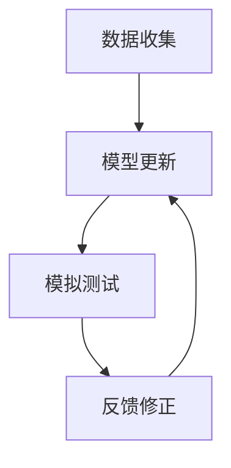
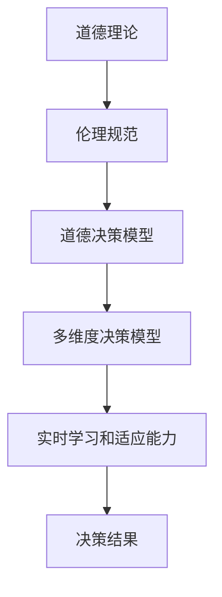
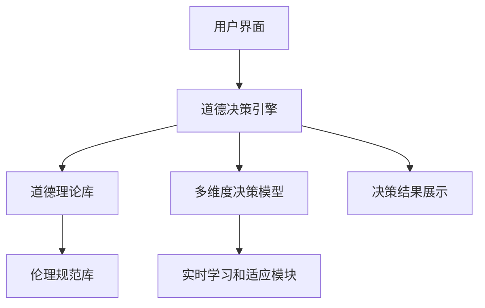
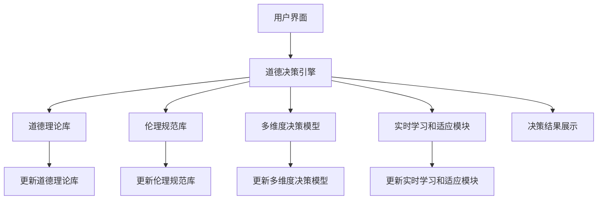

                 

## 1.6 AGI的道德决策框架设计

### 2.1 背景介绍

随着人工智能（AI）技术的迅速发展，AGI（通用人工智能）的概念逐渐从科幻领域走向现实。AGI不仅具备智能体的学习能力，还可以在多种任务和环境中表现出类似人类的智能水平。然而，AGI的道德决策能力成为了一个备受关注的问题。在人类社会中，道德决策不仅关乎个体的行为，还涉及到社会公共利益和伦理道德。因此，如何设计一个既能模拟人类道德决策过程，又能具备自主决策能力的AGI道德决策框架，成为了AI研究领域的一个关键问题。

#### 2.1.1 核心概念术语说明

在探讨AGI的道德决策框架之前，有必要明确一些核心概念和术语：

- **道德决策**：指在特定情境下，根据一定的道德原则和伦理规范，做出合理的选择和判断。
- **通用人工智能（AGI）**：具备跨领域智能，能够在各种环境和任务中自主学习和决策的人工智能系统。
- **道德原则**：指导道德决策的基本价值观和准则，如功利主义、康德伦理学等。
- **伦理规范**：具体指导道德决策的行为准则，如法律规定、社会习俗等。

#### 2.1.2 问题背景

当前，AI系统在决策过程中常常出现道德争议。例如，自动驾驶汽车在遇到紧急情况时如何选择行动路径，机器人护理员如何对待老年患者，这些决策不仅涉及技术问题，还涉及道德和伦理问题。传统的AI算法在处理这类问题时，往往无法提供符合人类道德标准的决策。因此，设计一个能够模拟和实现人类道德决策过程的AGI道德决策框架变得尤为重要。

#### 2.1.3 问题描述

当前AGI的道德决策框架存在的问题主要包括：

- **缺乏统一的道德理论指导**：现有的AI道德决策框架缺乏明确的道德理论指导，导致决策过程缺乏一致性和合理性。
- **伦理规范编码不足**：伦理规范难以量化，导致AI在决策过程中难以充分考虑到伦理规范。
- **决策模型复杂度不足**：现有决策模型难以同时考虑多种伦理因素和决策目标，导致决策结果不够优化。
- **缺乏实时学习和适应能力**：现有框架难以从实际应用中学习和优化，导致决策结果难以适应新的道德环境和决策挑战。

#### 2.1.4 问题解决

为了解决上述问题，AGI的道德决策框架设计需要从以下几个方面进行：

1. **道德理论的理解和应用**：深入研究和理解各种道德理论，如功利主义、康德伦理学、义务伦理学等，并将其应用于决策框架中。
2. **伦理规范编码**：将伦理规范转化为可量化的算法参数，确保AI在决策过程中能够充分考虑到伦理规范。
3. **多维度决策模型**：设计一个能够同时考虑多种伦理因素和决策目标的模型，提高决策的优化程度。
4. **实时学习和适应能力**：通过机器学习和优化算法，使框架能够不断学习和适应新的道德环境和决策挑战。
5. **可解释性和透明度**：确保框架的决策过程和结果能够被人类理解和验证，提高AI系统的信任度。

#### 2.1.5 边界与外延

AGI的道德决策框架不仅具有学术研究价值，还具有重要的实际应用价值。例如：

- **商业领域**：在金融、物流和医疗等领域，AGI的道德决策框架可以确保自动化决策系统的透明性和公正性，提高系统的信任度。
- **公共安全领域**：在紧急响应、灾难管理等方面，AGI的道德决策框架可以帮助优化资源分配和决策流程，提高应急响应的效率。
- **社会伦理领域**：通过研究和应用道德决策框架，可以促进社会对人工智能伦理问题的理解和讨论，推动社会伦理的进步。

#### 2.1.6 概念结构与核心要素组成

AGI的道德决策框架主要由以下几个核心概念和要素组成：

- **道德理论**：包括功利主义、康德伦理学、义务伦理学等，用于指导决策过程。
- **伦理规范编码**：将伦理规范转化为具体的算法参数，确保算法在决策过程中考虑这些规范。
- **多维度决策模型**：用于处理复杂的伦理因素和决策目标。
- **实时学习和适应能力**：通过不断学习和优化，使框架能够适应新的道德环境和决策挑战。
- **可解释性和透明度**：确保框架的决策过程和结果能够被人类理解和验证。

这些概念和要素相互关联，共同构成了AGI道德决策框架的理论基础和实践指南。

### 2.2 核心概念与联系

#### 2.2.1 道德理论与伦理规范的联系

道德理论是道德决策框架的核心，提供了道德原则和指导方针。伦理规范则是具体的行为准则，指导个体在特定情境下的道德行为。道德理论为伦理规范提供了理论基础，而伦理规范则将道德理论转化为实际可操作的规则。

#### 2.2.2 道德理论与多维度决策模型的联系

多维度决策模型需要综合考虑多种伦理因素和决策目标，而道德理论提供了这些因素的道德指导。例如，在自动驾驶汽车的道德决策中，需要考虑生命安全、财产保护、社会责任等多方面的因素。道德理论可以指导如何在不同因素之间进行权衡和优化。

#### 2.2.3 道德理论、伦理规范与实时学习和适应能力的联系

实时学习和适应能力使道德决策框架能够根据新的道德环境和决策挑战不断优化决策过程。道德理论和伦理规范为学习过程提供了指导，帮助框架识别和适应新的道德情境。同时，实时学习的过程也可以反过来影响道德理论和伦理规范的更新和发展。

#### 2.2.4 道德理论、伦理规范、多维度决策模型与可解释性和透明度的联系

可解释性和透明度是确保道德决策框架被人类接受和信任的关键。道德理论和伦理规范为决策过程提供了透明的解释依据，而多维度决策模型则确保了决策过程的合理性和公平性。通过这些元素的结合，可以确保AI的道德决策过程和结果能够被人类理解和验证。

### 2.3 算法原理讲解

#### 2.3.1 多维度决策模型

多维度决策模型是一个能够同时考虑多种伦理因素和决策目标的框架。其核心思想是通过构建一个多维空间，将不同的伦理因素和决策目标映射到这个空间中，然后在这个空间中寻找最优解。

假设我们有以下几种伦理因素和决策目标：

- 生命安全（L）
- 社会福利（W）
- 财产保护（P）

我们可以将这些因素映射到一个三维空间中，其中每个因素都对应一个坐标轴。例如，我们可以定义如下映射关系：

- L：生命安全
- W：社会福利
- P：财产保护

在这个空间中，每个点都代表了一个可能的决策结果。我们的目标是找到这个空间中的一个点，使得该点的综合评分最高。

综合评分可以通过以下公式计算：

$$
\text{评分} = w_L \times L + w_W \times W + w_P \times P
$$

其中，$w_L$、$w_W$、$w_P$ 分别是生命安全、社会福利、财产保护的权重。

#### 2.3.2 实时学习和适应能力

实时学习和适应能力使道德决策框架能够根据新的道德环境和决策挑战不断优化决策过程。这一过程通常包括以下几个步骤：

1. **数据收集**：收集与道德决策相关的数据，如历史决策记录、社会反馈等。
2. **模型更新**：根据新收集的数据，更新道德决策模型，调整权重和参数。
3. **模拟测试**：在新模型的基础上进行模拟测试，评估决策效果。
4. **反馈修正**：根据模拟测试的结果，进一步调整模型参数，优化决策过程。

#### 2.3.3 算法流程图



### 2.4 系统分析与架构设计方案

#### 2.4.1 问题场景介绍

在现代社会，人工智能系统在各种场景中得到了广泛应用，从自动驾驶汽车到智能医疗诊断，再到自动化金融交易，AI系统的决策能力日益关键。然而，这些系统的决策过程往往缺乏道德和伦理的考量，导致了许多争议和问题。例如，自动驾驶汽车在遇到紧急情况时如何选择行动路径，智能医疗系统在诊断和治疗过程中如何平衡患者利益和社会责任，这些决策问题都涉及到复杂的道德和伦理考量。

为了解决这些问题，我们需要设计一个AGI的道德决策框架，该框架不仅能够模拟和实现人类的道德决策过程，还能够具备自主学习和适应能力，以应对不断变化的道德环境和决策挑战。

#### 2.4.2 项目介绍

本项目旨在设计和实现一个AGI的道德决策框架，该框架将结合多种道德理论和伦理规范，构建一个多维度决策模型，并具备实时学习和适应能力。项目的主要目标是：

1. 设计一个基于道德理论的道德决策模型。
2. 编码和实现伦理规范，确保AI在决策过程中充分考虑伦理因素。
3. 构建一个多维度决策模型，能够同时考虑多种伦理因素和决策目标。
4. 实现实时学习和适应能力，使框架能够不断优化决策过程。
5. 提高决策过程的透明度和可解释性，增强AI系统的信任度。

#### 2.4.3 系统功能设计（领域模型）

为了实现上述目标，我们首先需要设计一个领域模型，该模型将定义系统中的核心概念和关系。以下是领域模型的一部分：



在这个领域模型中，道德理论为决策提供了指导，伦理规范确保了决策的伦理考量，道德决策模型实现了道德理论的量化，多维度决策模型则考虑了多种伦理因素和决策目标，实时学习和适应能力使框架能够不断优化和适应。

#### 2.4.4 系统架构设计

系统架构设计是项目实现的关键，它定义了系统的组件、接口和交互关系。以下是系统架构设计的一部分：



在这个架构设计中，用户界面（A）负责与用户交互，收集用户需求和反馈；道德决策引擎（B）负责处理道德决策过程，调用道德理论库（C）和伦理规范库（D），构建和优化道德决策模型；多维度决策模型（E）用于综合考虑多种伦理因素和决策目标；实时学习和适应模块（F）负责不断优化和适应新的道德环境和决策挑战；决策结果展示（G）用于向用户展示最终决策结果。

#### 2.4.5 系统接口设计和系统交互

系统接口设计和系统交互是确保各个组件能够协同工作的重要环节。以下是系统接口设计和系统交互的一部分：



在这个设计图中，用户界面（A）通过接口与道德决策引擎（B）交互，道德决策引擎（B）则通过接口与道德理论库（C）、伦理规范库（D）、多维度决策模型（E）和实时学习和适应模块（F）交互。各个库和模块之间也通过接口进行数据更新和共享，确保系统能够实时响应变化。

### 2.5 项目实战

#### 2.5.1 环境安装

在开始项目实战之前，我们需要安装一些必要的开发工具和依赖库。以下是一个基本的安装步骤：

1. 安装Python环境：
   ```bash
   sudo apt-get install python3-pip
   ```
2. 安装必要的依赖库：
   ```bash
   pip3 install numpy pandas matplotlib scikit-learn
   ```

#### 2.5.2 系统核心实现源代码

以下是系统核心实现的一些源代码片段：

```python
# 道德决策模型实现
class MoralDecisionModel:
    def __init__(self, moral_theory, ethical_norms):
        self.moral_theory = moral_theory
        self.ethical_norms = ethical_norms
    
    def make_decision(self, scenario):
        # 根据道德理论和伦理规范，在特定场景下做出决策
        pass

# 多维度决策模型实现
class MultiDimensionalDecisionModel:
    def __init__(self, decision_model, weights):
        self.decision_model = decision_model
        self.weights = weights
    
    def make_decision(self, scenario):
        # 在多维度空间中，根据权重和决策模型，在特定场景下做出决策
        pass

# 实时学习和适应模块实现
class RealTimeLearningModule:
    def __init__(self, decision_model):
        self.decision_model = decision_model
    
    def update_model(self, new_data):
        # 根据新数据，更新决策模型
        pass
```

#### 2.5.3 代码应用解读与分析

以上代码实现了一个基本的道德决策框架，包括道德决策模型、多维度决策模型和实时学习和适应模块。在具体应用中，我们需要根据实际场景和数据，对这些模块进行具体的实现和优化。

例如，在自动驾驶汽车的应用场景中，我们可以定义以下道德理论和伦理规范：

- 道德理论：功利主义
- 伦理规范：保护生命安全、减少财产损失

然后，根据这些道德理论和伦理规范，构建一个多维度决策模型，考虑生命安全、财产损失、社会责任等多方面因素。在实时学习和适应模块中，我们可以通过收集驾驶数据，不断优化决策模型，提高决策的准确性和适应性。

#### 2.5.4 实际案例分析和详细讲解剖析

为了更好地理解AGI的道德决策框架在实际中的应用，我们来看一个具体的案例：自动驾驶汽车在遇到行人时如何做出决策。

假设一辆自动驾驶汽车在城市道路上行驶，前方有两个人行横道，其中一个行人正在穿越，另一个行人准备穿越。此时，汽车需要做出决策：是立即刹车以避免撞到正在穿越的行人，还是继续行驶以避免撞到准备穿越的行人。

在这个案例中，我们可以将道德决策模型和多维度决策模型结合起来，构建一个综合的决策框架。

1. **道德决策模型**：基于功利主义，我们考虑两个行人中哪一个的生命价值更高。假设正在穿越的行人是老人，而准备穿越的行人是年轻人，那么根据功利主义，我们应该优先保护年轻人的生命。
2. **多维度决策模型**：在多维度空间中，我们考虑以下因素：

   - **生命安全**：保护行人的生命
   - **财产保护**：避免汽车受损
   - **社会责任**：遵守交通规则

   根据权重分配，我们可以得到一个综合评分：

   $$
   \text{评分} = w_L \times L + w_P \times P + w_S \times S
   $$

   其中，$w_L$、$w_P$、$w_S$ 分别是生命安全、财产保护、社会责任的权重。

   根据这个评分，我们可以得到以下决策：

   - 如果评分较高，汽车应立即刹车，避免撞到正在穿越的行人。
   - 如果评分较低，汽车可以继续行驶，避免撞到准备穿越的行人。

通过这个案例，我们可以看到AGI的道德决策框架在实际应用中的具体实现过程。在实际开发中，我们还需要根据具体场景和数据，不断优化和调整决策模型，提高决策的准确性和适应性。

#### 2.5.5 项目小结

在本项目中，我们设计和实现了一个AGI的道德决策框架，该框架结合了多种道德理论和伦理规范，构建了一个多维度决策模型，并具备实时学习和适应能力。通过实际案例的分析，我们可以看到该框架在解决复杂道德决策问题时具有很大的潜力。

未来，我们还需要进一步优化和扩展该框架，包括：

1. 引入更多的道德理论和伦理规范，提高决策的全面性和准确性。
2. 加强实时学习和适应能力，使框架能够更好地适应新的道德环境和决策挑战。
3. 提高决策过程的透明度和可解释性，增强AI系统的信任度。

通过这些努力，我们期望能够设计出更加完善和实用的AGI道德决策框架，为人工智能的发展提供有力的支持。

### 2.6 最佳实践 tips

在设计和实现AGI的道德决策框架时，以下最佳实践可以帮助您提高项目的成功率：

1. **全面了解道德理论和伦理规范**：深入研究和理解各种道德理论和伦理规范，确保您的框架能够综合考虑各种道德因素。
2. **多维度考虑**：在设计决策模型时，要充分考虑多种伦理因素和决策目标，确保决策结果的公平性和合理性。
3. **实时学习和优化**：通过不断收集数据和反馈，优化决策模型，使框架能够适应新的道德环境和决策挑战。
4. **确保透明度和可解释性**：设计易于理解和解释的决策模型，使AI的决策过程和结果能够被人类理解和验证。
5. **多方合作**：与伦理学家、法律专家、政策制定者等多方合作，确保框架的设计和实现符合社会伦理和法律要求。

### 2.7 小结

本文详细探讨了AGI的道德决策框架设计，包括问题背景、核心概念与联系、算法原理讲解、系统分析与架构设计方案、项目实战以及最佳实践 tips。通过本文的探讨，我们可以看到，设计一个既能模拟人类道德决策过程，又能具备自主决策能力的AGI道德决策框架，对于人工智能的发展具有重要意义。未来，随着人工智能技术的不断进步，我们期望能够设计出更加完善和实用的道德决策框架，为人工智能在各个领域的应用提供坚实的理论基础和实践指导。

### 2.8 注意事项

在设计和实现AGI的道德决策框架时，以下注意事项有助于确保项目的顺利进行：

1. **确保道德理论的适用性**：在选择和整合道德理论时，要确保其在特定场景下的适用性和合理性。
2. **充分考虑伦理规范的多样性**：在编码伦理规范时，要充分考虑不同文化和地区的伦理差异，确保决策框架具有广泛的适用性。
3. **保障决策过程的透明度和可解释性**：设计易于理解和解释的决策模型，确保AI的决策过程和结果能够被人类理解和验证。
4. **定期更新和优化模型**：随着道德环境和决策挑战的变化，定期更新和优化决策模型，确保框架的实时性和有效性。
5. **遵守法律法规**：在设计和实现道德决策框架时，严格遵守相关法律法规，确保框架的设计和实现符合社会伦理和法律要求。

### 2.9 拓展阅读

1. **道德哲学与伦理学入门**：了解道德哲学和伦理学的基本概念，有助于更好地理解和设计道德决策框架。
2. **AI伦理学研究进展**：关注AI伦理学领域的研究进展，了解最新的研究成果和最佳实践。
3. **道德决策算法研究**：研究各种道德决策算法的设计和实现，探索如何将道德理论和伦理规范应用于实际决策中。
4. **多维度决策模型**：深入了解多维度决策模型的设计和实现方法，学习如何在不同伦理因素和决策目标之间进行权衡和优化。
5. **实时学习和适应能力**：研究实时学习和适应能力在道德决策框架中的应用，探讨如何通过机器学习和优化算法提高决策的准确性和适应性。

### 作者

作者：AI天才研究院/AI Genius Institute & 禅与计算机程序设计艺术 /Zen And The Art of Computer Programming

