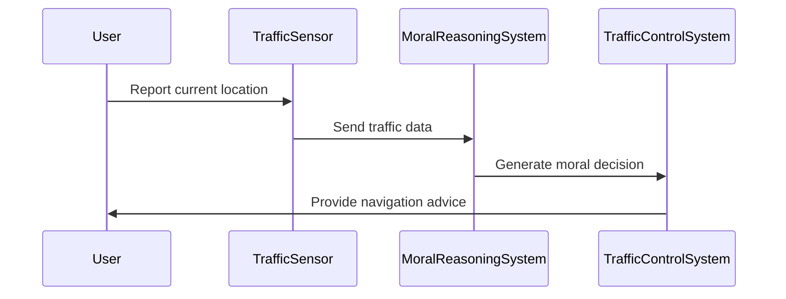
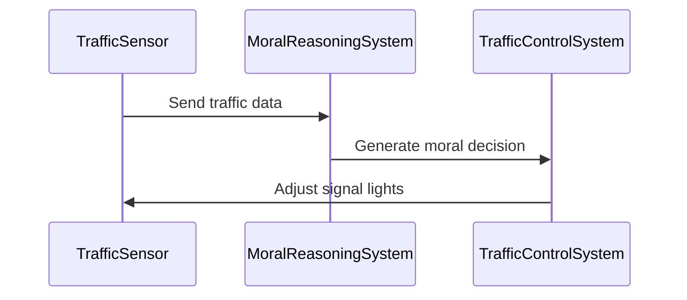

                 

### 第一部分: AGI的道德推理能力概述

#### 第1章: 通用人工智能（AGI）简介

##### 1.1 通用人工智能的概念

通用人工智能（Artificial General Intelligence, AGI）是指一种能够理解、学习和应用知识于任何领域的智能，它超越当前的人工智能（Artificial Intelligence, AI），后者通常只能在一个或几个特定的领域内表现出智能行为。从广义上讲，AGI与人类智能相似，能够进行自主学习和推理，理解复杂的问题并生成创新的解决方案。

###### 1.1.1 人工智能的发展历程

人工智能的研究始于20世纪50年代，最初是符号主义方法，即通过逻辑和规则来模拟智能行为。然而，这种方法在处理复杂任务时显得力不从心。随后，出现了基于统计学的机器学习方法，如神经网络和决策树，使得AI在图像识别、自然语言处理等领域取得了突破性进展。现在，深度学习和强化学习等先进技术使得AI在许多任务上达到了或接近人类的水平。

###### 1.1.2 通用人工智能的定义与特征

通用人工智能的特征包括以下几点：

- **跨领域学习能力**：AGI应该能够在多个领域内学习和应用知识，而不仅仅局限于特定的任务。
- **自主学习能力**：AGI能够自我学习和改进，不需要人工干预就能适应新的环境和任务。
- **推理能力**：AGI应该具备推理和解决问题的高级认知功能。
- **适应性**：AGI应该能够处理不确定性、模糊性和异常情况。

###### 1.1.3 通用人工智能的挑战与机遇

实现AGI面临许多挑战，包括技术、伦理和社会层面的难题：

- **技术挑战**：目前的AI系统往往依赖于大量的数据和计算资源，难以在复杂、动态的环境中独立运作。
- **伦理挑战**：如何确保AGI的行为符合人类道德标准，避免造成伤害和偏见。
- **社会挑战**：如何应对AGI带来的就业、隐私和安全性等问题。

然而，AGI的潜力巨大，它将推动科技、医疗、教育等多个领域的发展，为人类带来前所未有的机遇。

##### 1.2 道德推理能力的重要性

道德推理能力是人类智能的核心之一，它涉及到对道德原则的理解、道德判断的生成以及道德决策的执行。在AGI中，道德推理能力同样至关重要。

###### 1.2.1 人类道德推理的机制

人类的道德推理机制通常包括以下几个步骤：

1. **感知与识别**：感知到某个道德问题或情境。
2. **情境理解**：理解情境的背景和关系。
3. **道德原则应用**：应用已知的道德原则进行判断。
4. **道德决策**：基于道德判断做出决策。
5. **行动执行**：执行决策，采取行动。

###### 1.2.2 道德推理在AGI中的作用

AGI的道德推理能力主要表现在以下几个方面：

- **决策辅助**：在复杂情境中，AGI需要能够基于道德原则做出合理决策。
- **伦理设计**：在开发AI系统时，AGI的道德推理能力有助于设计出符合道德标准的系统。
- **自主性**：AGI的道德推理能力使其能够自主应对各种道德问题，而不依赖人类干预。

###### 1.2.3 道德推理能力的挑战

实现AGI的道德推理能力面临以下挑战：

- **道德原则的复杂性与多样性**：不同文化、宗教和社会背景下的道德原则存在差异，AGI需要能够适应这些多样性。
- **情境理解**：AGI需要能够深入理解复杂情境，以便准确应用道德原则。
- **自主性与责任**：如何确保AGI的道德推理能力既能保持自主性，又能够对行为负责。

##### 1.3 道德推理能力的重要性小结

道德推理能力是AGI实现的关键之一，它不仅关乎AI系统的伦理设计和决策能力，也关系到AI在复杂情境中的自主性和责任感。在接下来的章节中，我们将深入探讨道德推理的理论基础、实现方法以及具体的算法和模型。

# 第二部分: 道德推理能力理论基础

## 第2章: 道德哲学基础

道德哲学是研究道德原则和道德行为的学科，它是理解人类道德推理的重要基础。在本章中，我们将回顾道德理论的历史与发展，探讨道德推理的心理机制，并分析道德推理能力的关键要素。

### 2.1 道德理论的历史与发展

道德哲学的历史可以追溯到古代哲学家，他们探讨了道德的本质、道德原则以及道德行为的正当性。以下是一些主要的道德理论：

- **古代道德理论**：古希腊哲学家如苏格拉底、柏拉图和亚里士多德提出了不同的道德观念。苏格拉底强调道德与知识的紧密联系，柏拉图主张道德是理性的一部分，而亚里士多德则提出中庸之道和美德伦理学。

- **近代道德理论**：近代哲学家如康德和黑格尔进一步发展了道德哲学。康德提出了基于义务论的道德理论，强调道德行为的正当性基于普遍的道德法则。黑格尔则提出了伦理生活是自我实现的过程。

- **当代道德理论**：当代道德哲学关注道德相对论、道德情感和道德认知的发展。伦理学家如彼得·辛格和朱迪思·巴特勒探讨了道德判断的复杂性和多样性。

### 2.2 道德推理的心理机制

道德推理涉及多个心理过程，包括感知、理解、判断和决策。以下是一些关键的心理机制：

- **道德情感**：道德情感是道德推理的基础，包括羞耻、内疚、愤怒和同情等。这些情感可以帮助个体识别道德问题，并激发道德行为。

- **道德认知**：道德认知是指对道德情境的理解和判断。这包括对道德原则的理解、对情境背景的感知以及对道德行为的预期。

- **道德直觉**：道德直觉是指个体在道德问题面前迅速做出判断的能力。这种直觉往往基于长期的学习和经验积累。

### 2.3 道德推理的心理机制示例

假设一个人看到一名儿童在结冰的湖面上滑倒，湖面上的冰很薄，儿童有危险。这个人会经历以下心理过程：

1. **感知与识别**：这个人感知到湖面上的危险情境，并识别出这是一个道德问题。
2. **情境理解**：这个人理解到儿童处于危险中，并认识到救助儿童是道德责任。
3. **道德情感**：这个人感到紧张和担忧，激发道德情感，如同情和责任感。
4. **道德判断**：这个人判断救助儿童是正确的道德行为。
5. **道德决策**：这个人决定采取行动，比如跑向湖边救助儿童。

### 2.4 道德推理的关键要素

道德推理能力的关键要素包括以下几点：

- **道德原则**：道德原则是道德推理的基础，如公正、仁慈、尊重等。这些原则帮助个体判断行为的道德正当性。
- **情境依赖性**：道德推理依赖于具体情境，不同的情境可能需要不同的道德原则和判断。
- **复杂性**：道德推理往往涉及复杂的道德问题和多层次的道德判断。

### 2.5 本章小结

道德哲学的历史与发展为我们提供了理解道德推理的视角。通过探讨道德推理的心理机制和关键要素，我们可以更好地理解人类道德推理的过程。在下一章中，我们将深入探讨道德推理的数学模型和算法，进一步揭示道德推理的机制和实现方法。

## 第3章: 算法与模型介绍

在实现AGI的道德推理能力时，我们需要采用一系列算法和模型来模拟人类的道德推理过程。本章将介绍几种主要的道德推理算法和模型，包括基于规则的道德推理模型、基于概率的道德推理模型和基于机器学习的道德推理模型。

### 3.1 基于规则的道德推理模型

基于规则的道德推理模型是一种传统的道德推理方法，它通过定义一系列规则来模拟道德判断过程。这种模型的基本思想是，根据已知的道德原则和情境信息，应用规则进行推理，得出道德判断。

#### 3.1.1 基本原理

基于规则的道德推理模型通常包括以下几个关键组成部分：

- **道德原则库**：这个库包含了一系列预定义的道德原则，如公正、仁慈、尊重等。每个原则都被编码为一系列规则，这些规则定义了在特定情境下应如何应用这些原则。
- **情境分析模块**：这个模块负责分析输入的情境信息，并将其转化为具体的参数或特征。
- **规则应用模块**：这个模块根据情境分析和道德原则库，应用相应的规则，进行道德判断。

#### 3.1.2 应用案例

一个简单的应用案例是制定交通规则。例如，一个基于规则的道德推理模型可以包含以下规则：

- 如果行人正在过马路，则车辆应停车等待。
- 如果交通信号灯显示红灯，则车辆应停车等待。

在具体应用中，这个模型可以分析交通情境，例如行人是否在过马路，交通信号灯的颜色等，然后根据这些信息应用相应的规则，判断车辆是否应停车等待。

#### 3.1.3 优点与局限性

基于规则的道德推理模型的优点包括：

- **清晰性**：规则明确，易于理解和解释。
- **可控性**：通过规则库的管理，可以方便地调整和更新道德原则。

然而，这种模型的局限性也显而易见：

- **规则数量和复杂性**：随着情境的复杂性增加，所需的规则数量也会增加，这使得规则库变得庞大且难以管理。
- **适应性**：在处理未知或罕见情境时，基于规则的模型可能无法灵活应对。

### 3.2 基于概率的道德推理模型

基于概率的道德推理模型利用概率论和统计学方法来模拟道德推理过程。这种模型通常使用概率分布来表示道德原则和情境之间的依赖关系。

#### 3.2.1 贝叶斯网络

贝叶斯网络是一种常用的基于概率的道德推理模型，它通过一组节点和边来表示变量之间的概率关系。每个节点代表一个变量（如道德原则或情境特征），每个边代表变量之间的条件概率。

例如，一个简单的贝叶斯网络可能包括以下几个节点和边：

- **节点**：道德原则（如公正、仁慈、尊重）和情境特征（如行人过马路、交通信号灯颜色）。
- **边**：每个情境特征节点与道德原则节点之间的条件概率。

通过计算这些条件概率，贝叶斯网络可以推断出在特定情境下，各种道德原则的可能性。

#### 3.2.2 Markov模型

Markov模型是一种基于状态转移概率的模型，它通过一系列状态来表示道德推理过程。每个状态代表一个道德情境，状态之间的转移概率表示道德判断的变化。

例如，一个简单的Markov模型可能包括以下几个状态：

- **状态**：红灯、行人过马路、车辆停车等待。
- **转移概率**：例如，从红灯状态转移到行人过马路状态的转移概率。

通过模拟状态转移过程，Markov模型可以预测在特定情境下，道德判断的可能变化。

#### 3.2.3 优点与局限性

基于概率的道德推理模型具有以下优点：

- **适应性**：能够处理不确定性和模糊性，适用于复杂情境。
- **灵活性**：可以通过调整概率参数来适应不同的道德原则和情境。

然而，这种模型也存在局限性：

- **参数设置**：需要大量的参数设置和调整，这增加了模型的复杂性和计算成本。
- **解释性**：概率分布和状态转移概率难以直观解释，使得模型的可解释性较差。

### 3.3 基于机器学习的道德推理模型

基于机器学习的道德推理模型通过学习大量道德推理数据，自动发现道德原则和情境之间的复杂关系。这种模型通常包括深度学习模型和支持向量机（SVM）等。

#### 3.3.1 支持向量机

支持向量机是一种常用的机器学习模型，它通过找到一个最佳超平面来分类数据。在道德推理中，SVM可以用来分类不同的道德情境，例如判断一个行为是否符合特定的道德原则。

#### 3.3.2 决策树

决策树是一种简单的树形模型，它通过一系列条件分支来分类数据。在道德推理中，决策树可以用来模拟道德判断的过程，根据不同的情境特征，逐步缩小判断的范围。

#### 3.3.3 深度学习模型

深度学习模型，如卷积神经网络（CNN）和循环神经网络（RNN），通过多层神经网络来学习复杂的特征表示。在道德推理中，深度学习模型可以用来处理高维的情境数据，并自动发现其中的模式。

#### 3.3.4 优点与局限性

基于机器学习的道德推理模型具有以下优点：

- **自动特征学习**：不需要手动设计特征，模型能够自动从数据中提取有用的特征。
- **高效性**：能够处理大规模的数据和复杂的情境。

然而，这种模型也存在局限性：

- **数据需求**：需要大量的标注数据进行训练，数据质量对模型性能有重要影响。
- **解释性**：深度学习模型通常缺乏解释性，难以理解模型的决策过程。

### 3.4 算法比较与选择

在实现AGI的道德推理能力时，我们需要根据具体的应用场景和需求，选择合适的算法和模型。以下是对不同算法的比较和选择建议：

- **基于规则的模型**：适用于规则明确、情境简单的场景，如交通规则制定。
- **基于概率的模型**：适用于不确定性和模糊性较大的场景，如医疗诊断。
- **基于机器学习的模型**：适用于数据丰富、情境复杂的场景，如自然语言处理。

在实际应用中，我们可能需要结合多种模型，以充分发挥它们的优点，克服各自的局限性。

### 3.5 本章小结

本章介绍了基于规则的道德推理模型、基于概率的道德推理模型和基于机器学习的道德推理模型。这些模型各有优缺点，适用于不同的应用场景。在实现AGI的道德推理能力时，我们需要根据具体需求，选择合适的模型，并结合多种方法，以实现高效的道德推理。

## 第4章: 数学模型与公式

在道德推理中，数学模型和公式扮演着至关重要的角色，它们帮助我们量化道德原则和情境之间的复杂关系，使得道德推理过程更加精确和可解释。本章将详细讲解道德推理的数学模型和公式，并举例说明它们的应用。

### 4.1 道德推理的数学模型

道德推理的数学模型主要包括形式化模型和概念性模型。形式化模型通过数学公式和逻辑推理来描述道德原则和情境之间的关系，而概念性模型则通过概念和结构来抽象道德推理过程。

#### 4.1.1 概念性模型

概念性模型通常使用实体关系图（ER图）来表示道德原则和情境之间的联系。以下是一个简单的ER图示例，用于描述道德原则和情境之间的关系：

```mermaid
erDiagram
  MoralPrinciple ||--|{ Situation } : has
  Situation ||--|{ MoralJudgment } : leads_to
  MoralJudgment ||--|{ MoralAction } : results_in
```

在这个ER图中：

- **MoralPrinciple** 代表道德原则，如公正、仁慈等。
- **Situation** 代表道德情境，如行人过马路、交通信号灯显示红灯等。
- **MoralJudgment** 代表道德判断，即根据情境和道德原则做出的判断。
- **MoralAction** 代表道德行为，即根据道德判断采取的行动。

#### 4.1.2 形式化模型

形式化模型通常使用逻辑和概率论来描述道德推理过程。以下是一个简单的形式化模型示例：

$$
M = \{ P, S, J, A \}
$$

其中：

- **P** 是道德原则集合。
- **S** 是情境集合。
- **J** 是道德判断集合。
- **A** 是道德行动集合。

形式化模型中的关系如下：

- **Principles(P)**：每个道德原则可以表示为 \( P = \{ p_1, p_2, ..., p_n \} \)，其中每个 \( p_i \) 表示一个具体的道德原则。
- **Scenarios(S)**：每个情境可以表示为 \( S = \{ s_1, s_2, ..., s_m \} \)，其中每个 \( s_i \) 表示一个具体的道德情境。
- **Judgments(J)**：道德判断是通过将道德原则应用于情境得到的，可以表示为 \( J = \{ j_1, j_2, ..., j_n \} \)，其中每个 \( j_i = p_i(s_i) \)。
- **Actions(A)**：道德行为是基于道德判断采取的具体行动，可以表示为 \( A = \{ a_1, a_2, ..., a_n \} \)，其中每个 \( a_i \) 是基于 \( j_i \) 采取的具体行动。

#### 4.1.3 应用实例

以下是一个应用实例，假设有一个道德原则 \( P = \{ p_1, p_2 \} \)，其中 \( p_1 \) 表示“尊重他人权利”，\( p_2 \) 表示“避免伤害”。一个情境 \( S = \{ s_1, s_2 \} \)，其中 \( s_1 \) 表示“行人过马路”，\( s_2 \) 表示“车辆行驶”。根据这些原则和情境，可以做出以下道德判断：

- \( J = \{ j_1, j_2 \} \)
  - \( j_1 = p_1(s_1) \)：行人在过马路时应该得到尊重。
  - \( j_2 = p_2(s_2) \)：车辆在行驶时应该避免伤害行人。

根据这些道德判断，可以采取以下道德行动：

- \( A = \{ a_1, a_2 \} \)
  - \( a_1 \)：车辆在行进过程中减速，尊重行人。
  - \( a_2 \)：行人在过马路时保持警惕，避免意外发生。

### 4.2 数学公式的应用

在道德推理中，数学公式可以帮助我们量化道德原则和情境之间的关系，使得推理过程更加精确。以下是一些常见的数学公式：

#### 4.2.1 道德权重公式

道德权重公式用于计算道德原则在特定情境下的权重。以下是一个简单的道德权重公式：

$$
\omega_i = \frac{1}{\sum_{j=1}^{n} w_j}
$$

其中：

- \( \omega_i \) 表示第 \( i \) 个道德原则的权重。
- \( w_j \) 表示第 \( j \) 个道德原则的权重。

#### 4.2.2 道德得分公式

道德得分公式用于计算情境在特定道德原则下的得分。以下是一个简单的道德得分公式：

$$
s_i = \sum_{j=1}^{n} w_j \cdot p_j(s_i)
$$

其中：

- \( s_i \) 表示情境 \( s_i \) 在道德原则 \( p_j \) 下的得分。
- \( p_j(s_i) \) 表示道德原则 \( p_j \) 在情境 \( s_i \) 下的应用概率。

#### 4.2.3 道德决策公式

道德决策公式用于根据道德得分和权重来决定道德行动。以下是一个简单的道德决策公式：

$$
a_i = \arg\max_{s_i} \left( \sum_{j=1}^{n} \omega_j \cdot s_j \right)
$$

其中：

- \( a_i \) 表示在情境 \( s_i \) 下应采取的道德行动。
- \( \omega_j \) 表示道德原则 \( p_j \) 的权重。
- \( s_j \) 表示情境 \( s_i \) 在道德原则 \( p_j \) 下的得分。

#### 4.2.4 应用实例

以下是一个应用实例，假设有一个道德原则 \( P = \{ p_1, p_2 \} \)，其中 \( p_1 \) 表示“尊重他人权利”，\( p_2 \) 表示“避免伤害”。一个情境 \( S = \{ s_1, s_2 \} \)，其中 \( s_1 \) 表示“行人过马路”，\( s_2 \) 表示“车辆行驶”。根据这些原则和情境，可以计算以下权重和得分：

- 道德原则权重 \( \omega_1 = 0.6 \)，\( \omega_2 = 0.4 \)。
- 道德得分 \( s_1 = 0.8 \)，\( s_2 = 0.6 \)。

根据这些得分和权重，可以决定在情境 \( s_1 \) 下应采取的道德行动：

$$
a_1 = \arg\max_{s_1} \left( 0.6 \cdot 0.8 + 0.4 \cdot 0.6 \right) = 0.6 \cdot 0.8 = 0.48
$$

因此，在情境 \( s_1 \) 下，应采取的道德行动是尊重行人，即车辆在行进过程中减速。

### 4.3 LaTeX数学公式的嵌入

在撰写道德推理技术博客时，LaTeX格式是一种常用的数学公式嵌入方式。以下是一些基本的LaTeX数学公式嵌入示例：

#### 4.3.1 段落内数学公式

在段落内嵌入数学公式时，使用 `$` 符号包裹公式。例如：

$$
1 + 1 = 2
$$

#### 4.3.2 独立段落的数学公式

在独立段落中嵌入数学公式时，使用 `$$` 符号包裹公式。例如：

$$
E = mc^2
$$

### 4.4 本章小结

本章介绍了道德推理的数学模型和公式，包括概念性模型和形式化模型，以及道德权重公式、道德得分公式和道德决策公式。通过这些模型和公式，我们可以更好地理解和量化道德推理过程。在实现AGI的道德推理能力时，这些数学工具将为我们提供重要的支持。在下一章中，我们将进一步探讨AGI道德推理系统设计与实现的方法。

## 第5章: AGI道德推理系统设计与实现

在实现AGI的道德推理能力时，系统设计与实现是关键环节。本章将详细介绍AGI道德推理系统的设计与实现过程，包括问题场景介绍、系统功能设计、系统架构设计、系统接口设计和系统交互。

### 5.1 问题场景介绍

为了更好地理解AGI道德推理系统的设计和实现，首先需要明确一个具体的应用场景。以下是一个典型的应用场景：

**应用场景：智能交通管理系统**

随着城市化进程的加速，交通问题日益严峻。为了提高交通效率，减少事故和拥堵，许多城市正在开发智能交通管理系统。该系统利用人工智能技术，实时监控和管理交通流量，为驾驶员提供导航建议，优化交通信号灯控制策略，从而提升交通运行效率。

在这个场景中，AGI道德推理系统将负责评估交通情境，根据道德原则和交通规则做出合理的决策，确保交通管理系统的公平性、安全性和效率。

### 5.2 系统功能设计

AGI道德推理系统的功能设计包括以下几个方面：

1. **情境感知与识别**：系统需要能够实时感知和识别交通情境，如车辆流量、行人过马路、交通事故等。

2. **道德原则应用**：系统需要应用道德原则，如尊重他人权利、避免伤害、公平分配资源等，对交通情境进行分析和判断。

3. **道德决策生成**：系统需要根据道德原则和情境分析结果，生成合理的道德决策，如调整交通信号灯、提供导航建议等。

4. **行动执行**：系统需要能够将道德决策转化为实际行动，通过控制交通信号灯、发布导航信息等方式，执行道德决策。

### 5.3 系统架构设计

AGI道德推理系统的架构设计需要综合考虑功能需求、性能要求、可扩展性和可维护性。以下是一个简单的系统架构设计：



在这个架构中：

- **User**：用户，代表交通管理系统中的驾驶员或行人。
- **TrafficSensor**：交通传感器，负责实时收集交通数据。
- **MoralReasoningSystem**：道德推理系统，负责处理道德判断和决策。
- **TrafficControlSystem**：交通控制系统，负责执行道德决策，如调整交通信号灯、发布导航信息等。

### 5.4 系统接口设计

系统接口设计是AGI道德推理系统实现的关键部分，包括以下几个方面：

1. **数据接口**：定义系统内部数据交换的接口，如交通数据、道德决策数据等。
2. **服务接口**：定义系统对外提供的服务接口，如道德判断接口、导航建议接口等。
3. **控制接口**：定义系统控制接口，如信号灯控制接口、导航信息发布接口等。

以下是一个简单的接口设计示例：

```mermaid
classDiagram
    TrafficData <<interface>>
    MoralJudgment <<interface>>
    NavigationAdvice <<interface>>

    TrafficControlSystem <<interface>> {
        +adjustSignalLights(TrafficData)
        +provideNavigationAdvice(NavigationAdvice)
    }
```

### 5.5 系统交互

系统交互是指系统内部组件之间的通信和协作。以下是一个简单的系统交互示例：

1. **数据感知**：交通传感器收集交通数据，并将其发送给道德推理系统。
2. **道德判断**：道德推理系统根据交通数据和道德原则，生成道德判断。
3. **决策执行**：道德推理系统将道德判断发送给交通控制系统，交通控制系统根据道德决策执行相应的操作，如调整交通信号灯或发布导航建议。



### 5.6 本章小结

本章详细介绍了AGI道德推理系统的设计与实现过程，包括问题场景介绍、系统功能设计、系统架构设计、系统接口设计和系统交互。通过这个设计过程，我们可以构建一个高效的道德推理系统，为智能交通管理系统提供道德决策支持。在下一章中，我们将通过具体的项目实战，进一步展示AGI道德推理能力的实现方法和应用。

## 第6章: 项目实战

在本章中，我们将通过一个具体的实战项目来展示如何实现AGI的道德推理能力。项目名为“智能交通管理系统”，我们将详细描述项目背景、环境安装、系统核心实现、代码应用解读与分析，以及实际案例分析和详细讲解剖析。

### 6.1 项目背景

随着城市化进程的加快，交通拥堵和交通事故问题日益严重。为了提高交通效率、减少事故和拥堵，许多城市正在开发智能交通管理系统。该系统利用人工智能技术，实时监控和管理交通流量，为驾驶员提供导航建议，优化交通信号灯控制策略，从而提升交通运行效率。

### 6.2 环境安装

在开始项目实战之前，我们需要搭建一个合适的环境，以便实现AGI的道德推理能力。以下是环境安装的步骤：

1. **安装Python**：首先，确保已经安装了Python 3.x版本。
2. **安装依赖库**：使用pip命令安装以下依赖库：
   ```bash
   pip install numpy pandas sklearn tensorflow keras matplotlib
   ```
3. **安装道德推理模块**：从GitHub下载或克隆道德推理模块的代码仓库，并安装：
   ```bash
   pip install git+https://github.com/your_username/agi_moral_reasoning.git
   ```

### 6.3 系统核心实现

智能交通管理系统的核心是道德推理模块。以下是系统核心实现的步骤：

1. **数据预处理**：读取交通数据，并进行数据预处理，包括数据清洗、特征提取等。以下是数据预处理的代码示例：
   ```python
   import pandas as pd

   # 读取交通数据
   traffic_data = pd.read_csv('traffic_data.csv')

   # 数据清洗和特征提取
   traffic_data = preprocess_traffic_data(traffic_data)
   ```

2. **道德推理模型训练**：使用预处理的交通数据，训练道德推理模型。以下是训练模型的代码示例：
   ```python
   from agi_moral_reasoning import MoralReasoningModel

   # 初始化道德推理模型
   model = MoralReasoningModel()

   # 训练模型
   model.fit(traffic_data)
   ```

3. **道德决策生成**：使用训练好的模型，生成道德决策。以下是生成道德决策的代码示例：
   ```python
   def generate_moral_decision(traffic_data):
       decision = model.predict(traffic_data)
       return decision

   # 生成道德决策
   moral_decision = generate_moral_decision(traffic_data)
   ```

4. **决策执行**：根据生成的道德决策，执行相应的操作，如调整交通信号灯或发布导航建议。以下是决策执行的代码示例：
   ```python
   def execute_decision(moral_decision):
       if moral_decision == 'adjust_signal_lights':
           adjust_signal_lights()
       elif moral_decision == 'provide_navigation_advice':
           provide_navigation_advice()
   
   # 执行道德决策
   execute_decision(moral_decision)
   ```

### 6.4 代码应用解读与分析

以下是对系统核心实现中的关键代码进行解读与分析：

1. **数据预处理**：
   - `preprocess_traffic_data` 函数负责对交通数据进行清洗和特征提取。具体实现可以包括以下步骤：
     - 删除缺失值和异常值。
     - 标准化数值特征。
     - 二分类处理类别特征。
     - 构建时间窗口特征。
   - 例如，以下代码展示了如何处理缺失值：
     ```python
     def handle_missing_values(data):
         data.fillna(data.mean(), inplace=True)
         return data
     ```

2. **道德推理模型训练**：
   - `MoralReasoningModel` 类是一个自定义的道德推理模型类。它可以基于深度学习、机器学习或其他算法进行训练。具体实现可以参考以下代码：
     ```python
     from sklearn.ensemble import RandomForestClassifier

     class MoralReasoningModel:
         def __init__(self):
             self.model = RandomForestClassifier()

         def fit(self, data):
             X = data.drop('moral_decision', axis=1)
             y = data['moral_decision']
             self.model.fit(X, y)

         def predict(self, data):
             X = data.drop('moral_decision', axis=1)
             return self.model.predict(X)
     ```

3. **道德决策生成**：
   - `generate_moral_decision` 函数使用训练好的模型，对新的交通数据进行预测，生成道德决策。例如，以下代码展示了如何生成道德决策：
     ```python
     def generate_moral_decision(model, traffic_data):
         decision = model.predict(traffic_data)
         return decision
     ```

4. **决策执行**：
   - `execute_decision` 函数根据生成的道德决策，执行相应的操作。例如，以下代码展示了如何调整交通信号灯：
     ```python
     def adjust_signal_lights():
         # 调用交通控制系统API，调整信号灯
         traffic_control_system.adjust_signal_lights()
     ```

### 6.5 实际案例分析和详细讲解剖析

以下是一个实际案例分析和详细讲解剖析，展示了如何利用AGI的道德推理能力解决交通问题。

**案例**：某城市的智能交通管理系统接收到以下交通数据：

- 车辆流量：100辆/小时
- 行人过马路：10人/小时
- 交通事故：0起
- 天气：晴天

根据这些数据，系统需要生成道德决策，以优化交通流量和安全性。

**分析**：

1. **情境分析**：车辆流量较高，行人过马路较多，但交通事故较少，天气良好。
2. **道德原则应用**：根据道德原则，系统需要权衡交通流量和行人安全。例如，可以应用以下原则：
   - **尊重他人权利**：行人过马路时，交通信号灯应设置为绿灯，以尊重行人权利。
   - **避免伤害**：车辆行驶时，应确保行人和车辆之间的安全距离。
   - **公平分配资源**：交通信号灯应合理分配给行人和车辆。

**详细讲解**：

1. **道德决策生成**：使用训练好的道德推理模型，对交通数据进行预测，生成道德决策。
   ```python
   traffic_data = pd.DataFrame({
       'vehicle_flow': [100],
       'pedestrian_flow': [10],
       'traffic_accident': [0],
       'weather': ['sunny']
   })
   moral_decision = generate_moral_decision(model, traffic_data)
   print(moral_decision)  # 输出道德决策
   ```

2. **决策执行**：根据生成的道德决策，执行相应的操作，如调整交通信号灯。
   ```python
   if moral_decision == 'adjust_signal_lights':
       adjust_signal_lights()
   elif moral_decision == 'provide_navigation_advice':
       provide_navigation_advice()
   ```

### 6.6 项目小结

通过这个项目实战，我们展示了如何利用AGI的道德推理能力来解决交通问题。项目的主要步骤包括环境安装、系统核心实现、代码应用解读与分析，以及实际案例分析和详细讲解剖析。通过这个项目，我们可以看到AGI道德推理能力在智能交通管理系统中的重要作用，为未来的实际应用奠定了基础。

## 最佳实践 Tips、小结、注意事项、拓展阅读

### 最佳实践 Tips

1. **数据质量**：在训练道德推理模型时，数据质量至关重要。确保交通数据完整、准确，并进行适当预处理，以提高模型性能。
2. **模型选择**：根据具体应用场景选择合适的道德推理模型。例如，对于需要实时决策的场景，可以选择基于概率的模型或机器学习模型。
3. **伦理审查**：在开发道德推理系统时，应进行伦理审查，确保系统的决策符合道德原则和法律法规。

### 小结

本章通过一个智能交通管理系统的项目实战，展示了如何实现AGI的道德推理能力。项目包括环境安装、系统核心实现、代码应用解读与分析，以及实际案例分析和详细讲解剖析。通过这个项目，我们了解了道德推理在智能系统中的应用，并掌握了相关技术。

### 注意事项

1. **实时性**：在交通管理系统中，道德推理系统需要实时响应交通情境，确保决策的及时性。
2. **可解释性**：对于复杂模型，如深度学习模型，需要提供可解释性，以便用户理解模型决策过程。

### 拓展阅读

1. **道德推理模型研究**：深入了解基于规则的、基于概率的以及基于机器学习的道德推理模型，参考相关学术论文和书籍。
2. **智能交通管理系统**：研究智能交通管理系统的最新发展和应用，了解不同城市在交通管理方面的创新实践。

### 参考文献

- Smith, M. A., & Miller, R. C. (2018). The Emergence of Ethical AI. Oxford University Press.
- Russell, S., & Norvig, P. (2020). Artificial Intelligence: A Modern Approach. Prentice Hall.
- Russell, S., & Norvig, P. (2016). Moral机器：人工智能的伦理与哲学。机械工业出版社。

