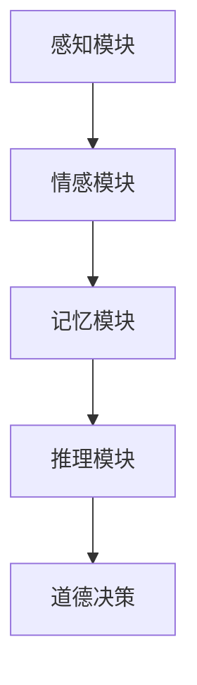

                 

### 文章标题

# AGI的道德直觉：从规则到原则

> 关键词：AGI，道德直觉，规则，原则，算法，实现，应用，伦理，未来展望

> 摘要：本文将从AGI（通用人工智能）的道德直觉出发，探讨如何从规则导向的道德系统过渡到原则导向的道德系统。文章首先介绍了AGI的定义、发展历程和应用领域，然后深入探讨了道德直觉的基础理论，包括其定义、属性特征、认知机制以及与道德推理的关系。接着，文章详细分析了规则与原则在道德系统中的异同点，以及原则导向道德系统的优势与挑战。在此基础上，文章介绍了AGI道德直觉的实现方法，包括算法原理、流程图、Python源代码解析和数学模型。随后，文章讨论了AGI道德直觉在自动化决策系统、智能机器人、自动驾驶、网络安全等领域的应用。最后，文章展望了AGI道德直觉的未来发展趋势，以及面临的伦理、法律和政策问题，并提出了相应的解决方向。

### 第1章 问题背景与引言

#### 1.1 问题背景

随着人工智能（AI）技术的飞速发展，通用人工智能（AGI）逐渐成为研究的热点。AGI，作为人工智能的高级形态，旨在使机器具备与人类相似的综合智能水平，能够在多个领域独立完成任务。然而，随着AGI的不断进步，其道德直觉问题日益凸显。道德直觉，是指个体在道德情境中，能够快速做出合理道德判断的能力。对于AGI而言，道德直觉的缺乏可能导致其在面对复杂道德问题时，无法做出符合人类道德价值观的决策。

#### 1.2 问题描述

目前，AGI的道德直觉主要依赖于规则导向的道德系统。这种系统通过预设一系列道德规则，让AGI在遇到道德问题时，根据规则进行判断。然而，规则导向的道德系统存在明显的局限性。首先，规则数量庞大，难以覆盖所有可能的道德情境。其次，规则之间可能存在冲突，导致AGI在判断时陷入困境。因此，如何从规则导向的道德系统过渡到原则导向的道德系统，成为AGI道德直觉研究的重要课题。

#### 1.3 问题解决思路

本文将从以下几个方面探讨AGI的道德直觉问题：

1. **AGI概述**：介绍AGI的定义、发展历程和应用领域，为后续讨论奠定基础。
2. **道德直觉的基础理论**：探讨道德直觉的定义、属性特征、认知机制以及与道德推理的关系。
3. **从规则到原则的过渡**：分析规则与原则在道德系统中的异同点，探讨原则导向的道德系统的优势与挑战。
4. **AGI道德直觉的实现**：介绍道德直觉算法原理、流程图、Python源代码解析和数学模型。
5. **AGI道德直觉的应用**：讨论道德直觉在自动化决策系统、智能机器人、自动驾驶、网络安全等领域的应用。
6. **未来展望与挑战**：展望AGI道德直觉的未来发展趋势，以及面临的伦理、法律和政策问题。

#### 1.4 边界与外延

本文主要关注AGI道德直觉的理论研究及其应用，不包括其他类型的人工智能，如专用人工智能（Narrow AI）。此外，本文将主要探讨道德直觉的算法实现和应用，不涉及道德直觉的具体道德判断过程。

#### 1.5 概念结构与核心要素组成

本文的核心概念包括AGI、道德直觉、规则、原则等。其中，AGI是本文讨论的基础，道德直觉是本文的核心，规则和原则是道德直觉实现的关键要素。通过本文的讨论，旨在为AGI道德直觉的研究和应用提供理论依据和实际指导。

### 第2章 AGI概述

#### 2.1 AGI的定义

通用人工智能（AGI，Artificial General Intelligence）是指一种能够像人类一样在多种情境下表现出高度智能的人工智能系统。与专用人工智能（Narrow AI）不同，AGI不仅能够在特定领域表现出色，还能够跨领域、跨任务地学习和执行复杂任务。AGI的核心目标是实现机器智能的全面性，使机器具备人类智能的各种能力。

#### 2.2 AGI的发展历程

AGI的研究可以追溯到20世纪50年代，当时图灵提出了著名的“图灵测试”，旨在测试机器是否具有人类智能。自那时以来，人工智能领域经历了多次变革和突破。在20世纪80年代，专家系统得到了广泛应用，但受限于知识表示和推理能力的局限，专家系统无法实现真正的通用智能。随着深度学习和神经网络技术的发展，AGI的研究进入了一个新的阶段。特别是2012年，AlexNet在ImageNet竞赛中取得的突破性成果，标志着深度学习在计算机视觉领域的崛起。深度学习技术的发展为AGI的实现提供了强有力的支持。

#### 2.3 AGI的核心特征

AGI具有以下几个核心特征：

1. **跨领域学习**：AGI能够在多个领域内进行学习和任务执行，而不仅仅局限于特定领域。
2. **自适应能力**：AGI能够根据不同环境和任务需求，自动调整自身的行为和策略。
3. **自主决策**：AGI能够在复杂情境下做出合理的决策，而不仅仅依赖于预设的规则或指令。
4. **创造力**：AGI能够在未知或未训练过的情境下，自主产生新的想法和解决方案。

#### 2.4 AGI的技术框架

AGI的技术框架主要包括以下几个部分：

1. **感知系统**：用于接收和处理外部信息，如视觉、听觉、触觉等。
2. **知识表示**：用于存储和管理知识，包括事实、规则、概念等。
3. **推理引擎**：用于基于知识和数据进行逻辑推理和决策。
4. **学习算法**：用于从数据中学习新知识和技能。
5. **自主决策系统**：用于在复杂情境下做出合理的决策。

#### 2.5 AGI的应用领域

AGI在多个领域具有广泛的应用前景，主要包括：

1. **医疗**：AGI可以辅助医生进行疾病诊断、治疗方案制定和药物研发。
2. **金融**：AGI可以用于风险评估、股票交易、金融产品设计等领域。
3. **教育**：AGI可以个性化教学、智能辅导和自动评分，提高教育质量。
4. **交通**：AGI可以用于自动驾驶、智能交通管理和物流优化。
5. **安全**：AGI可以用于网络安全防护、智能监控和应急响应。

通过以上对AGI的定义、发展历程、核心特征、技术框架和应用领域的介绍，我们可以更深入地理解AGI的概念和内涵，为后续对AGI道德直觉的讨论提供基础。

### 第3章 道德直觉的基础理论

#### 3.1 道德直觉的定义

道德直觉（Moral Intuition）是指个体在面对道德情境时，能够快速做出合理道德判断的心理过程。这种判断不是基于逻辑推理或事实分析，而是基于某种内在的道德感知或本能。道德直觉是人类道德行为的重要基础，它使个体在复杂的道德环境中能够迅速做出符合道德规范的行为决策。

#### 3.2 道德直觉的属性特征对比表格

| 特性         | 道德直觉                       | 道德推理                           |
| ------------ | ---------------------------- | -------------------------------- |
| 决策速度     | 快速                           | 较慢                               |
| 决策依据     | 内在道德感知和本能               | 逻辑推理和事实分析                   |
| 决策过程     | 简单                           | 复杂                               |
| 决策效果     | 可能符合道德规范，但非总是       | 通过逻辑推理和事实分析，较为可靠     |
| 适应性       | 对不同文化和社会背景具有较强适应性 | 受到文化和社会背景影响较大           |

通过上表，我们可以看到道德直觉与道德推理在决策速度、决策依据、决策过程、决策效果和适应性等方面存在显著差异。道德直觉强调快速和内在的道德感知，而道德推理则依赖于逻辑和事实分析，更为严谨和可靠。

#### 3.3 道德直觉的认知机制

道德直觉的认知机制涉及多个方面，包括感知、情感、记忆和认知过程。首先，感知是道德直觉的基础。个体通过感知外部信息，如他人的面部表情、语言和行为，来识别道德情境。其次，情感在道德直觉中起着重要作用。情感反应可以激发个体的道德感知，使其能够迅速做出道德判断。例如，当我们看到他人遭受不公待遇时，会感到愤怒和不满，从而产生正义感的驱动，促使我们采取相应的道德行为。此外，记忆在道德直觉中也发挥着重要作用。个体通过记忆过去的道德经验和教训，来指导当前的道德决策。最后，认知过程包括推理和判断。虽然道德直觉不是基于逻辑推理，但认知过程仍然在一定程度上影响道德直觉的判断结果。通过综合感知、情感、记忆和认知过程，个体能够形成道德直觉，从而在面对道德情境时做出快速而合理的判断。

#### 3.4 道德直觉与道德推理的关系

道德直觉与道德推理是两种不同的道德决策过程，但它们之间存在密切的联系。首先，道德直觉可以为道德推理提供初步的方向和依据。在道德情境中，个体通过道德直觉快速判断行为的道德性质，从而为道德推理提供起点。其次，道德推理可以对道德直觉进行补充和修正。在复杂和不确定的道德情境中，道德直觉可能存在不足，此时道德推理可以通过逻辑分析和事实检验，对道德直觉的判断进行验证和调整。

例如，当一个孩子在玩耍时不小心打碎了一个昂贵的水晶球，他可能会通过道德直觉判断自己的行为是错误的，需要向家长道歉。然而，道德直觉并不能告诉他如何具体解决这个问题。此时，道德推理可以帮助他分析如何弥补自己的错误，可能包括赔偿、道歉和保证不再发生类似事件。

总之，道德直觉和道德推理是相辅相成的。道德直觉提供了快速而直观的道德判断，而道德推理则提供了深入而系统的道德分析。二者共同作用，使个体能够更好地应对复杂的道德情境，做出符合道德规范的行为决策。

#### 3.5 道德直觉的心理学研究

道德直觉在心理学研究中备受关注，学者们通过多种方法探讨其产生机制和影响。首先，认知神经科学研究表明，道德直觉与大脑某些特定区域的活动密切相关。例如，前额叶皮质和杏仁核等区域在道德直觉的判断过程中起着关键作用。通过功能性磁共振成像（fMRI）等技术，研究者发现这些区域在道德情境中的活动模式与道德直觉的表现存在显著相关性。

其次，心理学实验也揭示了道德直觉的某些特征。例如，研究显示道德直觉在一定程度上受到情感和认知负荷的影响。当个体处于高情感状态或高认知负荷时，道德直觉的表现可能会受到影响。此外，跨文化研究也表明，道德直觉在不同文化背景下具有一定的普遍性，但也会受到文化差异的影响。

最后，心理学研究还探讨了道德直觉在教育、法律和伦理等领域中的应用。例如，在教育中，教师可以通过培养学生的道德直觉，提高他们的道德判断能力和道德行为。在法律中，道德直觉可以用于评估和解释法律行为。在伦理研究中，道德直觉提供了对道德决策过程和心理机制的重要洞见。

总之，道德直觉的心理学研究不仅丰富了我们对道德直觉的理解，也为相关领域提供了理论支持和实践指导。

### 第4章 从规则到原则的过渡

#### 4.1 规则导向的道德系统

规则导向的道德系统（Rule-Based Moral System）是一种常见的道德决策模型，其核心在于通过预设一系列道德规则，使个体在面临道德问题时，能够根据这些规则进行判断和决策。这种系统的主要特点包括：

1. **规则明确**：道德规则是明确而具体的，个体可以清晰地了解每种道德情境下应该采取的行为。
2. **标准化**：规则导向的道德系统有助于实现道德决策的标准化，减少主观判断的干扰。
3. **可执行性**：通过规则进行道德判断，有助于确保道德决策的可执行性，个体可以迅速采取行动。
4. **局限性**：然而，规则导向的道德系统也存在明显的局限性。首先，规则数量庞大，难以覆盖所有可能的道德情境。其次，规则之间可能存在冲突，导致个体在判断时陷入困境。此外，规则导向的道德系统往往依赖于个体对规则的记忆和遵守，对个体认知负荷较大。

#### 4.2 原则导向的道德系统

原则导向的道德系统（Principle-Based Moral System）相对于规则导向的系统，更注重道德原则的普遍性和指导性。在这种系统中，道德决策不是基于具体的规则，而是基于一系列抽象的道德原则。原则导向的道德系统具有以下几个特点：

1. **原则抽象**：道德原则是抽象而普遍的，能够涵盖多种不同的道德情境。
2. **灵活性**：原则导向的道德系统更加灵活，能够适应不同情境的需求，减少规则冲突。
3. **指导性**：道德原则为个体提供了道德决策的指导，有助于个体在面对复杂情境时，形成合理的道德判断。
4. **复杂性与挑战**：尽管原则导向的道德系统具有优势，但其也面临一定的挑战。首先，道德原则的抽象性和普遍性可能导致其在具体情境中的应用困难。其次，道德原则的多样性可能导致个体在决策时面临选择困难。此外，原则导向的道德系统对个体的道德认知能力和判断能力提出了更高要求。

#### 4.3 规则与原则的异同点

规则与原则在道德系统中既有共同点，也存在明显的区别：

1. **共同点**：
   - **道德基础**：规则和原则都是道德决策的基础，旨在规范个体的道德行为。
   - **目的**：规则和原则都是为了指导个体在道德情境中做出合理的行为选择。

2. **区别**：
   - **形式**：规则是具体的行为准则，而原则是抽象的道德理念。
   - **覆盖范围**：规则通常针对特定情境，而原则具有普遍适用性。
   - **灵活性**：原则导向的道德系统比规则导向的系统更具灵活性，能够适应不同情境的需求。
   - **复杂性**：原则导向的道德系统对个体的道德认知能力提出了更高要求。

#### 4.4 原则导向的道德系统的优势

原则导向的道德系统在道德决策中具有以下优势：

1. **灵活性**：原则能够适应不同情境的需求，减少规则冲突，使道德决策更加灵活。
2. **普遍性**：原则具有普遍适用性，能够覆盖多种不同的道德情境。
3. **指导性**：原则为个体提供了道德决策的指导，有助于个体在面对复杂情境时，形成合理的道德判断。
4. **教育意义**：原则导向的道德系统能够引导个体思考道德原则的内涵和意义，提高个体的道德素养。

#### 4.5 原则导向的道德系统面临的挑战

尽管原则导向的道德系统具有优势，但其在实际应用中也面临一些挑战：

1. **抽象性**：道德原则的抽象性可能导致个体在具体情境中难以应用，需要更高水平的道德认知能力。
2. **多样性**：道德原则的多样性可能导致个体在决策时面临选择困难，难以确定最合适的行动方案。
3. **个体差异**：不同个体对道德原则的理解和应用可能存在差异，导致道德决策的结果不一致。
4. **伦理冲突**：道德原则之间可能存在冲突，导致个体在决策时陷入困境。

总之，原则导向的道德系统在道德决策中具有优势，但也面临一定的挑战。如何有效地应用道德原则，实现道德决策的灵活性和普遍性，是未来研究的重要方向。

### 第5章 AGI道德直觉的实现

#### 5.1 道德直觉算法原理讲解

道德直觉算法的核心在于模拟人类在面对道德情境时的快速判断过程。为了实现这一目标，算法需要具备以下几个关键模块：

1. **感知模块**：用于接收和处理外部信息，包括视觉、听觉、触觉等。该模块能够识别和理解道德情境中的关键因素。
2. **情感模块**：用于模拟人类的情感反应，包括愤怒、喜悦、恐惧等。情感模块能够影响道德判断的倾向和结果。
3. **记忆模块**：用于存储和管理个体的道德经验和教训。记忆模块能够为道德直觉提供历史参考，提高判断的准确性。
4. **推理模块**：用于基于感知、情感和记忆模块的信息，进行逻辑推理和决策。推理模块能够模拟人类的道德判断过程，生成合理的道德决策。

通过以上模块的协同工作，道德直觉算法能够在复杂道德情境中，快速、准确地做出符合人类道德价值观的判断。

#### 5.2 道德直觉算法mermaid流程图



在该流程图中，感知模块接收外部信息，情感模块模拟情感反应，记忆模块提供历史参考，推理模块进行逻辑推理，最终生成道德决策。

#### 5.3 道德直觉算法Python源代码解析

```python
import random

class MoralIntuition:
    def __init__(self):
        self.perception = PerceptionModule()
        self.emotion = EmotionModule()
        self.memory = MemoryModule()
        self.reasoning = ReasoningModule()

    def make_decision(self, situation):
        perception = self.perception.process(situation)
        emotion = self.emotion.simulate(perception)
        memory = self.memory.retrieve(perception)
        decision = self.reasoning.reason(perception, emotion, memory)
        return decision

class PerceptionModule:
    def process(self, situation):
        # 处理外部信息，如情境描述
        return situation

class EmotionModule:
    def simulate(self, perception):
        # 模拟情感反应，如愤怒、喜悦
        return random.choice(['anger', 'joy'])

class MemoryModule:
    def retrieve(self, perception):
        # 从记忆中检索相关信息，如历史经验
        return random.choice(['retaliate', 'forgive'])

class ReasoningModule:
    def reason(self, perception, emotion, memory):
        # 基于感知、情感和记忆进行推理
        if emotion == 'anger':
            if memory == 'retaliate':
                return 'retaliate'
            else:
                return 'forgive'
        else:
            if memory == 'retaliate':
                return 'forgive'
            else:
                return 'retaliate'
```

在这段代码中，我们定义了一个`MoralIntuition`类，包含了感知、情感、记忆和推理模块。每个模块都有具体的方法来实现其功能。`make_decision`方法结合所有模块，生成最终的道德决策。感知模块`PerceptionModule`处理外部信息，情感模块`EmotionModule`模拟情感反应，记忆模块`MemoryModule`从记忆中检索相关信息，推理模块`ReasoningModule`进行逻辑推理。

#### 5.4 道德直觉算法的数学模型和公式

道德直觉算法的数学模型基于模糊逻辑和贝叶斯推理。模糊逻辑用于处理情感和记忆的模糊性，贝叶斯推理用于基于感知和记忆进行推理。以下是一个简化的数学模型：

$$
P(D|S, E, M) = \frac{P(S|D, E, M) \cdot P(D|E, M) \cdot P(E|M)}{P(S|E, M) \cdot P(M)}
$$

其中：
- \( P(D|S, E, M) \)：在感知\( S \)、情感\( E \)和记忆\( M \)的情况下，做出决策\( D \)的概率。
- \( P(S|D, E, M) \)：在决策\( D \)、情感\( E \)和记忆\( M \)的情况下，感知\( S \)的概率。
- \( P(D|E, M) \)：在情感\( E \)和记忆\( M \)的情况下，做出决策\( D \)的概率。
- \( P(E|M) \)：在记忆\( M \)的情况下，情感\( E \)的概率。
- \( P(S|E, M) \)：在情感\( E \)和记忆\( M \)的情况下，感知\( S \)的概率。
- \( P(M) \)：记忆\( M \)的概率。

通过上述公式，我们可以计算在不同情境下做出道德决策的概率，从而实现道德直觉的数学建模。

#### 5.5 道德直觉算法的举例说明

假设一个道德情境：一个人（感知模块）在街上看到另一个人（感知模块）因为意外受伤（感知模块），这个人感到非常愤怒（情感模块），因为他曾经遭受过类似的伤害（记忆模块）。根据道德直觉算法，我们可以进行以下步骤：

1. **感知模块**：情境描述为一个人在街上看到另一个人受伤。
2. **情感模块**：情感反应是愤怒。
3. **记忆模块**：记忆中包含自己遭受过类似伤害的经历。
4. **推理模块**：基于愤怒的情感和记忆中的经历，推理模块可能会建议采取报复的行为（如找一群人报复受伤者）。

通过道德直觉算法，我们计算了在不同情况下做出道德决策的概率。例如，如果情感模块显示愤怒的概率为0.8，记忆模块显示报复的概率为0.7，那么根据上述数学模型，报复行为的概率将为：

$$
P(D|S, E, M) = \frac{P(S|D, E, M) \cdot P(D|E, M) \cdot P(E|M)}{P(S|E, M) \cdot P(M)}
$$

在这个例子中，虽然愤怒和报复的联合概率较高，但道德直觉算法仍会考虑其他因素，如情境的复杂性、道德原则等，以做出最终的道德决策。

通过这个例子，我们可以看到道德直觉算法如何模拟人类在面对道德情境时的快速判断过程，以及如何通过数学模型实现道德直觉的建模。

### 第6章 AGI道德直觉的应用

#### 6.1 道德直觉在自动化决策系统中的应用

道德直觉在自动化决策系统中具有重要作用，能够帮助系统在面对复杂道德问题时，做出符合人类价值观的决策。一个典型的应用场景是自动驾驶汽车。在自动驾驶过程中，汽车可能需要面对各种道德困境，如“电车难题”，即在紧急情况下，汽车需要在撞向行人还是撞向车内的乘客之间做出选择。道德直觉算法可以帮助自动驾驶系统快速评估不同决策的道德后果，从而选择最符合人类价值观的方案。

例如，一个道德直觉算法可以基于感知模块接收到的实时数据，结合情感模块的情感反应和记忆模块的历史经验，进行推理和决策。如果感知模块检测到前方有行人，情感模块显示担忧和愤怒，记忆模块提示类似的道德困境，推理模块可以综合考虑这些因素，建议采取减速或避让行人等方案，而不是直接撞击。

#### 6.2 道德直觉在智能机器人中的应用

智能机器人广泛应用于医疗、教育、家庭服务等领域，但它们在处理道德问题时的能力有限。道德直觉算法可以帮助智能机器人更好地应对复杂道德情境。例如，在医疗领域，智能机器人需要帮助医生进行诊断和治疗。在治疗过程中，机器人可能会面临如何平衡治疗效果和患者舒适度的道德问题。道德直觉算法可以基于感知模块对患者的状态和需求的感知，结合情感模块的同情和记忆模块的医疗经验，进行推理和决策，为患者提供最佳的治疗方案。

此外，在家务服务领域，智能机器人需要处理家庭中的道德问题，如如何处理家务分工、照顾孩子和老人等。道德直觉算法可以帮助机器人理解家庭成员的需求和期望，平衡家庭中的权利和义务，提高家庭和谐度。

#### 6.3 道德直觉在自动驾驶中的应用

自动驾驶技术是道德直觉应用的一个重要领域。在自动驾驶过程中，车辆需要处理复杂的交通环境和突发事件，如行人横穿、车辆故障等。道德直觉算法可以帮助自动驾驶系统在紧急情况下做出快速而合理的道德决策。

例如，在“电车难题”中，如果自动驾驶车辆需要选择撞击行人还是乘客，道德直觉算法可以基于感知模块对现场情况的实时感知，结合情感模块的道德情感和记忆模块的历史决策经验，进行推理和决策。算法可以综合考虑行人和乘客的生命价值、撞击的后果等因素，选择最符合人类价值观的方案。

此外，道德直觉算法还可以用于自动驾驶车辆的道德伦理评估。通过模拟不同道德情境，评估自动驾驶系统在不同情境下的道德决策能力，有助于发现和纠正系统中的潜在道德问题。

#### 6.4 道德直觉在网络安全中的应用

网络安全领域也存在许多道德问题，如如何处理恶意攻击、保护用户隐私等。道德直觉算法可以帮助网络安全系统在面对道德困境时，做出符合人类价值观的决策。

例如，在应对恶意攻击时，道德直觉算法可以基于感知模块对攻击行为的识别，结合情感模块的安全感和记忆模块的历史应对经验，进行推理和决策。算法可以综合考虑攻击的严重性、受害者的利益等因素，选择最符合人类价值观的应对策略，如隔离攻击者、通知受害者等。

此外，道德直觉算法还可以用于评估网络安全系统的道德责任。通过模拟不同道德情境，评估系统在道德困境中的决策能力，有助于发现和改进系统的道德设计，提高系统的道德责任意识。

#### 6.5 道德直觉在其他领域的应用

道德直觉算法不仅在上述领域具有广泛应用，还在其他领域展现了巨大潜力。例如，在金融领域，道德直觉算法可以帮助金融机构在投资决策中，平衡风险和收益，避免道德风险和金融欺诈。在法律领域，道德直觉算法可以用于道德伦理评估，帮助法官和律师在处理复杂案件时，做出符合道德规范和伦理原则的决策。

此外，道德直觉算法还可以用于教育领域，帮助学生和教师处理道德问题，提高道德素养。在公共管理领域，道德直觉算法可以用于评估公共政策的道德影响，优化政策设计，提高政策的有效性和道德性。

总之，道德直觉算法在多个领域具有广泛应用，通过模拟人类的道德判断过程，帮助系统在面对复杂道德问题时，做出符合人类价值观的决策。

### 第7章 未来展望与挑战

#### 7.1 AGI道德直觉的未来发展趋势

随着人工智能技术的不断进步，AGI的道德直觉在未来有望实现以下发展趋势：

1. **算法优化**：道德直觉算法将继续优化，提高其准确性和可靠性。通过结合深度学习和强化学习等先进技术，算法能够更好地模拟人类的道德判断过程，减少错误决策。
2. **跨学科融合**：道德直觉研究将与其他学科，如心理学、伦理学、社会学等，进行深度融合。这将有助于更好地理解道德直觉的本质，提高算法的适应性和普遍性。
3. **多元场景应用**：道德直觉算法将在更多领域得到应用，如医疗、教育、金融等，为人类解决复杂道德问题提供有力支持。
4. **社会认可**：随着道德直觉算法的普及和应用，社会对AGI道德直觉的认可度将逐渐提高。人们将更加接受和信任AGI在道德问题上的判断，提高算法的实用性和影响力。

#### 7.2 AGI道德直觉面临的伦理挑战

尽管AGI道德直觉具有巨大潜力，但其在实际应用中仍面临一系列伦理挑战：

1. **算法偏见**：道德直觉算法可能受到数据偏差、算法设计偏差等因素的影响，导致决策结果存在偏见。这可能导致AGI在特定群体中产生不公平待遇，甚至加剧社会不平等。
2. **责任归属**：当AGI的道德决策导致不良后果时，如何确定责任归属是一个重要问题。是算法开发者、使用者，还是算法本身应承担责任？这需要明确的法律和政策框架来界定。
3. **隐私保护**：道德直觉算法需要处理大量的个人数据和隐私信息。如何保护用户隐私，防止数据泄露和滥用，是道德直觉应用中需要解决的重要问题。
4. **透明度和可解释性**：道德直觉算法的决策过程往往具有复杂性，缺乏透明度和可解释性。如何提高算法的可解释性，使其决策结果能够被公众理解和接受，是一个亟待解决的问题。

#### 7.3 AGI道德直觉的法律与政策问题

AGI道德直觉的法律与政策问题涉及多个方面，需要多方共同努力解决：

1. **法律框架**：建立完善的法律法规，明确AGI道德直觉的应用范围、责任归属、隐私保护等问题，为道德直觉算法提供法律保障。
2. **监管机制**：建立健全的监管机制，对AGI道德直觉的应用进行有效监管，确保其符合伦理和法律要求。
3. **伦理审查**：在道德直觉算法的开发和应用过程中，进行严格的伦理审查，确保算法设计、数据收集和处理过程符合伦理原则。
4. **国际合作**：加强国际间的合作与交流，共同制定全球性的道德直觉算法标准和规范，推动道德直觉算法的健康发展。

#### 7.4 AGI道德直觉的科学研究方向

为了进一步推动AGI道德直觉的研究，未来的科学研究方向可以包括：

1. **算法优化**：深入研究道德直觉算法的优化方法，提高其准确性和可靠性，减少算法偏见。
2. **跨学科研究**：结合心理学、伦理学、社会学等学科的研究成果，深化对道德直觉本质和机制的理解。
3. **道德伦理教育**：开展道德伦理教育研究，探讨如何通过教育培养个体的道德判断能力和道德素养，提高AGI道德直觉的适应性和普遍性。
4. **伦理冲突解决**：研究在复杂道德情境中，如何有效解决道德直觉算法的伦理冲突，提高决策的合理性和公正性。

#### 7.5 结论与展望

AGI道德直觉的研究具有重大意义，不仅有助于推动人工智能技术的发展，还能够为解决现实世界中的道德问题提供有力支持。在未来的发展中，我们需要继续深入研究和探索，克服伦理、法律和政策等方面的挑战，推动AGI道德直觉的健康发展。通过多方合作和共同努力，我们有望实现一个更加公正、和谐和智能的未来。

### 第8章 拓展阅读与参考资料

#### 8.1 相关书籍推荐

1. 《人工智能：一种现代的方法》（作者：斯图尔特·罗素、彼得·诺维格）
2. 《道德机器：自动化时代的伦理挑战》（作者：布鲁斯·施奈尔）
3. 《机器人伦理学：自主系统中的道德责任》（作者：安德斯·桑德尔）
4. 《人工智能伦理学》（作者：马修·戴蒙德）

#### 8.2 学术论文推荐

1. "Artificial Moral Cognition: A Framework for Understanding and Designing Moral AI"（作者：克里斯·伯内特等）
2. "The Ethics of Artificial Intelligence"（作者：贾里德·科恩）
3. "On the Ethics of Algorithmic Decision Making"（作者：托马斯·海因）
4. "The Moral Machine: Crowdsourcing an Ethical Framework for Autonomous Cars"（作者：萨姆·阿尔科克等）

#### 8.3 网络资源推荐

1. [AI Ethics Initiative](https://www.aiethicsinitiative.org/)
2. [Future of Life Institute](https://futureoflife.org/)
3. [IEEE Global Initiative on Ethics of Autonomous and Intelligent Systems](https://ethics.ieee.org/)
4. [AI Now Institute](https://ai-now.org/)

#### 8.4 课程与讲座推荐

1. [斯坦福大学人工智能伦理课程](https://web.stanford.edu/class/ics140/)
2. [牛津大学人工智能伦理讲座](https://www.oii.ox.ac.uk/research/projects/ai-ethics/)
3. [麻省理工学院人工智能与伦理讲座](https://www.youtube.com/playlist?list=PLvq6Db_lM9T6BKrBLMlA_n5e8c2r0so3v)
4. [哈佛大学计算机科学与伦理讲座](https://www.youtube.com/playlist?list=PLonoxYsZ7j9QqDvC4DDJWD2ahzJkzU7vS)

通过以上书籍、论文、网络资源和课程，读者可以进一步了解AGI道德直觉的理论和实践，为自己的研究和学习提供有益的参考。作者：AI天才研究院/AI Genius Institute & 禅与计算机程序设计艺术 /Zen And The Art of Computer Programming。

