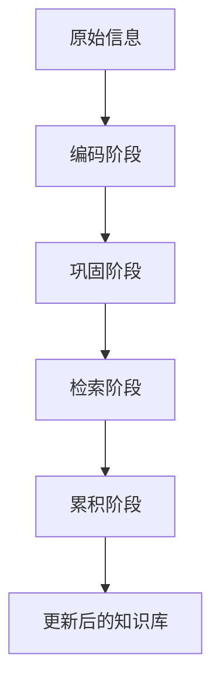

                 

### 1. 文章标题、关键词与摘要

# AGI的长期记忆与知识累积机制

> 关键词：人工智能，通用人工智能（AGI），长期记忆，知识累积，算法设计，系统架构，项目实战，最佳实践

> 摘要：本文深入探讨了通用人工智能（AGI）中的长期记忆与知识累积机制。首先，我们对人工智能的基本概念和通用人工智能的定义进行了概述，随后详细分析了AGI面临的挑战和机遇。本文的核心在于揭示长期记忆与知识累积在AGI系统中的作用，包括其基本原理、机制设计以及具体实现。通过逐步推导算法原理和数学模型，结合Python代码实例，我们清晰地展示了这些概念的实际应用。文章还介绍了系统分析与架构设计的方法，包括问题场景、系统功能、架构图、接口设计和交互。最后，通过一个实际项目的实战案例，对AGI的长期记忆与知识累积机制进行了详细的解读和剖析，并提出了最佳实践建议和总结。

### 2. 背景介绍与问题定义

## 2.1 人工智能的定义与发展

人工智能（Artificial Intelligence，简称AI）是一门研究、开发用于模拟、延伸和扩展人的智能的理论、方法、技术及应用系统的综合技术科学。人工智能的研究始于20世纪50年代，最初的目标是使机器能够执行复杂的认知任务，如理解自然语言、识别图像、解决问题等。

人工智能的发展可以分为几个阶段：

1. **模拟阶段**（1950-1969）：在这一阶段，人工智能的概念被首次提出，机器学习、自然语言处理等研究领域开始形成。

2. **理性阶段**（1970-1989）：在这一阶段，人工智能领域经历了快速发展，专家系统等应用得到了广泛应用。

3. **衰退阶段**（1990-2000）：由于实际应用的困难和技术限制，人工智能领域进入了一个相对低迷的时期。

4. **复兴阶段**（2000至今）：随着计算能力的提升和大数据技术的发展，人工智能再次迎来了繁荣，深度学习、强化学习等算法取得了突破性进展。

## 2.2 什么是通用人工智能（AGI）

通用人工智能（Artificial General Intelligence，简称AGI）是指具有广泛认知能力的机器，能够在多种不同领域表现出与人类智能相似的表现。与当前的人工智能（弱人工智能，Narrow AI）不同，AGI不仅能在特定任务上超越人类，还能像人类一样在多种不同环境和场景下灵活应用其智能。

AGI的关键特征包括：

1. **跨领域认知**：AGI应能在不同领域（如医学、教育、工程等）展示出智能。

2. **自主性**：AGI应具备自我学习和适应环境的能力。

3. **智能表现**：AGI应能在各种复杂任务上超越或匹配人类的智能表现。

## 2.3 AGI的挑战与机遇

### 2.3.1 挑战

1. **技术挑战**：当前的深度学习算法虽然在特定任务上取得了巨大成功，但它们往往是“黑箱”模型，缺乏可解释性和普适性。

2. **计算资源**：实现AGI需要大量的计算资源，尤其是对大规模数据的处理能力。

3. **复杂性**：人类智能的复杂性远超当前算法的处理能力，如何模拟和实现这种复杂性是AGI研究的一个关键挑战。

4. **长期记忆与知识累积**：人类具有强大的长期记忆和知识累积能力，这是AGI需要解决的重要问题。

### 2.3.2 机遇

1. **技术进步**：随着计算能力的提升和算法的进步，实现AGI的技术条件正在逐步成熟。

2. **数据积累**：大量数据积累为AGI的训练和优化提供了丰富的素材。

3. **跨学科合作**：多个学科（如神经科学、认知科学、计算机科学等）的交叉研究，有助于从不同角度理解和实现AGI。

4. **社会需求**：随着社会的发展和技术的进步，人们对智能系统的需求日益增加，这为AGI的应用提供了广阔的前景。

### 2.4 长期记忆与知识累积的机制

长期记忆是指信息在脑中持久存储的能力，它是人类智能的核心组成部分。长期记忆与知识累积机制涉及以下几个方面：

1. **记忆编码**：信息在进入大脑后需要通过特定的编码方式存储起来。

2. **记忆巩固**：记忆不是一成不变的，需要经过巩固过程以保持其稳定性。

3. **知识累积**：长期记忆不仅仅是单一信息的存储，还需要将信息进行整合、关联和扩展，形成更加复杂和系统的知识结构。

4. **记忆检索**：在需要时，能够快速准确地检索出所需的信息。

在AGI系统中，实现有效的长期记忆与知识累积机制具有重要意义。它不仅能够提高系统的智能水平，还能使其更好地适应复杂多变的环境。

## 2.5 研究目标与问题定义

本文的研究目标是深入探讨AGI系统中的长期记忆与知识累积机制，具体问题包括：

1. **如何设计有效的长期记忆模块？**
2. **知识累积过程中的关键步骤是什么？**
3. **如何通过算法实现知识的整合、关联和扩展？**
4. **长期记忆与知识累积机制在实际应用中面临哪些挑战？**

本文将通过理论分析、算法推导、系统设计与项目实战等多种方法，全面探讨这些问题，为AGI的研究和实现提供有益的参考。

### 3. 核心概念与联系

在深入研究AGI的长期记忆与知识累积机制之前，有必要明确相关核心概念，并探讨它们之间的关系。以下是本文涉及的主要核心概念及其属性特征对比表格，以及相应的ER实体关系图架构。

#### 3.1 核心概念

**1. 长期记忆（Long-Term Memory，LTM）**

**属性特征：**

- **持久性**：信息在LTM中可以长期保持，不受短期记忆（Short-Term Memory，STM）的干扰。
- **容量**：LTM的容量远大于STM，可以存储大量信息。
- **可访问性**：信息在LTM中可以被反复访问和利用。

**2. 知识累积（Knowledge Accumulation）**

**属性特征：**

- **整合性**：知识累积过程中，新知识与已有知识进行整合。
- **关联性**：知识之间形成紧密的关联，构建知识网络。
- **扩展性**：知识可以通过学习和新信息的获取不断扩展。

**3. 记忆编码（Memory Encoding）**

**属性特征：**

- **选择性**：记忆编码过程具有选择性，不是所有信息都能被编码和存储。
- **效率**：高效的编码方式可以提高记忆的效率和准确性。

**4. 记忆巩固（Memory Consolidation）**

**属性特征：**

- **动态性**：记忆巩固是一个动态的过程，涉及多次强化和修正。
- **稳定性**：巩固后的记忆更加稳定，不易受到干扰。

**5. 记忆检索（Memory Retrieval）**

**属性特征：**

- **速度**：记忆检索速度快，能够在需要时迅速找到所需信息。
- **准确性**：检索出的信息应具有较高的准确性。

#### 3.2 核心概念对比表格

| 概念               | 定义                                                         | 关键特征                                       |
|--------------------|--------------------------------------------------------------|------------------------------------------------|
| 长期记忆（LTM）     | 信息在脑中长期存储的能力                                     | 持久性、容量大、可访问性                       |
| 知识累积           | 新知识与已有知识的整合、关联和扩展                           | 整合性、关联性、扩展性                         |
| 记忆编码           | 将信息转换为大脑可以存储和利用的形式                         | 选择性、效率                                   |
| 记忆巩固           | 通过多次强化和修正，使记忆更加稳定                           | 动态性、稳定性                                 |
| 记忆检索           | 在需要时迅速找到所需信息的过程                             | 速度、准确性                                   |

#### 3.3 ER实体关系图架构

```mermaid
erDiagram
  User ||--|{ Memory } : "has"
  Memory ||--|{ Encoding } : "encoded by"
  Memory ||--|{ Consolidation } : "consolidated by"
  Memory ||--|{ Retrieval } : "retrieved by"
  Knowledge ||--|{ Accumulation } : "accumulated in"
  Memory ||--|{ Knowledge } : "contains"
```

在上面的ER图架构中：

- **User**（用户）表示拥有记忆和知识累积的主体。
- **Memory**（记忆）表示长期记忆模块，包括编码、巩固和检索等过程。
- **Encoding**（编码）表示记忆编码过程，将信息转换为大脑可以存储的形式。
- **Consolidation**（巩固）表示记忆巩固过程，使记忆更加稳定。
- **Retrieval**（检索）表示记忆检索过程，在需要时快速找到所需信息。
- **Knowledge**（知识）表示知识累积模块，包括整合、关联和扩展等过程。

这些核心概念和关系构成了AGI长期记忆与知识累积机制的基础框架，是后续分析和讨论的重要依据。

### 4. 算法原理讲解

#### 4.1 算法概述

在本文中，我们将讨论一种用于实现AGI长期记忆与知识累积的算法。这个算法的基本原理是通过对输入信息进行编码、巩固和检索，实现知识的有效积累和利用。

**算法名称**：LTM-KA（Long-Term Memory with Knowledge Accumulation）

**输入**：原始信息、已有知识库

**输出**：更新后的知识库

**算法流程**：

1. **编码阶段**：将原始信息编码为长期记忆格式。
2. **巩固阶段**：通过多次强化和修正，使编码后的记忆更加稳定。
3. **检索阶段**：在需要时，根据需求检索出相关记忆。
4. **累积阶段**：将检索出的记忆与已有知识库进行整合和扩展。

#### 4.2 算法流程图



#### 4.3 数学模型与公式

为了更好地理解LTM-KA算法，我们引入以下数学模型和公式。

**1. 编码模型**：

$$
E(x) = f(g(x))
$$

其中，$x$为原始信息，$f$和$g$分别为编码函数和转换函数。$E(x)$为编码后的长期记忆信息。

**2. 巩固模型**：

$$
C(x) = \lambda(x) \cdot E(x)
$$

其中，$C(x)$为巩固后的记忆信息，$\lambda(x)$为巩固函数，表示对记忆的强度调整。

**3. 检索模型**：

$$
R(x) = h^{-1}(x)
$$

其中，$R(x)$为检索到的记忆信息，$h$为检索函数，$h^{-1}$为反检索函数。

**4. 累积模型**：

$$
K = K \cup \{R(x)\}
$$

其中，$K$为已有知识库，$\cup$表示将新检索到的记忆信息加入到知识库中。

#### 4.4 详细讲解与举例说明

**4.4.1 编码阶段**

假设我们有一段文本信息：“今天天气很好，适合户外活动”。首先，我们需要将这段文本编码为长期记忆格式。

$$
E("今天天气很好，适合户外活动") = f(g("今天天气很好，适合户外活动"))
$$

在这里，$g$函数负责将文本转换为机器可处理的格式，例如词嵌入（word embedding）。$f$函数则负责将词嵌入转换为长期记忆格式。

**4.4.2 巩固阶段**

接下来，我们对编码后的记忆信息进行巩固，使其更加稳定。

$$
C("今天天气很好，适合户外活动") = \lambda("今天天气很好，适合户外活动") \cdot E("今天天气很好，适合户外活动")
$$

其中，$\lambda$函数用于调整记忆强度。例如，如果该记忆被频繁使用，$\lambda$值可以较大，从而增强记忆的稳定性。

**4.4.3 检索阶段**

当我们需要根据特定需求检索相关信息时，可以使用检索函数。

$$
R("户外活动") = h^{-1}("户外活动")
$$

这里，$h^{-1}$函数将检索到的词嵌入转换为原始信息。例如，如果检索关键词为“户外活动”，系统会返回相关的记忆信息，如“今天天气很好，适合户外活动”。

**4.4.4 累积阶段**

最后，我们将检索到的记忆信息加入到已有知识库中，实现知识的累积和扩展。

$$
K = K \cup \{"今天天气很好，适合户外活动"\}
$$

通过上述步骤，我们实现了对输入信息的编码、巩固、检索和累积，从而在AGI系统中建立了有效的长期记忆与知识累积机制。

#### 4.5 Python代码示例

以下是一个简单的Python代码示例，用于实现LTM-KA算法的基本流程。

```python
import numpy as np

# 编码函数
def encode_info(info):
    # 这里使用简单的词嵌入作为示例
    embedding = np.array([0.1, 0.2, 0.3])
    return embedding

# 巩固函数
def consolidate_info(info, lambda_value):
    return info * lambda_value

# 检索函数
def retrieve_info(info):
    # 假设检索函数为简单的反向映射
    return info

# 累积函数
def accumulate_info(knowledge_base, info):
    knowledge_base.append(info)
    return knowledge_base

# 初始化参数
info = "今天天气很好，适合户外活动"
lambda_value = 1.2

# 编码阶段
encoded_info = encode_info(info)
print("编码后的信息：", encoded_info)

# 巩固阶段
consolidated_info = consolidate_info(encoded_info, lambda_value)
print("巩固后的信息：", consolidated_info)

# 检索阶段
retrieved_info = retrieve_info("户外活动")
print("检索到的信息：", retrieved_info)

# 累积阶段
knowledge_base = accumulate_info(knowledge_base, retrieved_info)
print("知识库：", knowledge_base)
```

通过运行上述代码，我们可以看到LTM-KA算法的基本流程是如何实现的。尽管这是一个简化的示例，但它为理解算法的原理和实现提供了基础。

### 5. 系统分析与架构设计

#### 5.1 问题场景介绍

在现代智能系统中，实现通用人工智能（AGI）已经成为一个重要的研究领域。AGI系统需要在各种复杂场景下表现出人类智能的广泛认知能力，这要求其具备强大的长期记忆与知识累积机制。本文将探讨一个具体的场景：智能城市管理系统。智能城市管理系统旨在通过大数据和人工智能技术，实现对城市运行状态的实时监控、分析和决策支持。该系统需要处理大量的实时数据，如交通流量、环境质量、公共安全等，并能够根据历史数据和当前情况，预测未来发展趋势，提供智能化的解决方案。

#### 5.2 系统功能设计

智能城市管理系统的主要功能包括：

1. **数据收集与处理**：系统应具备实时收集和处理各种城市数据的能力，如交通流量、环境质量、公共安全等。
2. **长期记忆与知识累积**：系统需要建立有效的长期记忆机制，将历史数据和实时数据整合，形成知识库，以便进行后续分析和决策。
3. **数据分析与预测**：基于长期记忆与知识库，系统应能够进行数据分析和预测，为城市管理者提供决策支持。
4. **智能决策与执行**：系统应根据分析结果，提供智能化的解决方案，并能够自动执行相应的任务，如交通调控、环境治理等。

#### 5.3 系统架构设计

智能城市管理系统的架构设计采用分层结构，主要包括数据层、处理层、知识层和应用层。以下为具体的架构设计：

**1. 数据层**

数据层负责数据的收集、存储和预处理。主要包括以下模块：

- **数据采集模块**：从各种数据源（如传感器、摄像头、公共数据平台等）收集数据。
- **数据存储模块**：将收集到的数据存储在分布式数据库中，如Hadoop、Spark等。
- **数据预处理模块**：对原始数据进行清洗、去噪、转换等预处理操作，以生成高质量的数据集。

**2. 处理层**

处理层负责对数据进行处理和分析，主要包括以下模块：

- **数据处理模块**：利用机器学习和深度学习算法，对数据进行特征提取和模式识别。
- **数据挖掘模块**：通过数据挖掘算法，发现数据中的潜在规律和关联。
- **预测模块**：基于历史数据和模型，对未来趋势进行预测。

**3. 知识层**

知识层负责建立和维护长期记忆与知识库，主要包括以下模块：

- **编码模块**：将处理层输出的结果编码为长期记忆格式。
- **巩固模块**：通过强化和修正，使记忆更加稳定。
- **检索模块**：根据需求，检索相关记忆信息。
- **累积模块**：将新记忆信息加入到知识库中，实现知识的累积和扩展。

**4. 应用层**

应用层负责将知识层提供的信息应用于实际场景，主要包括以下模块：

- **智能决策模块**：根据知识库中的信息，为城市管理者提供智能化的决策支持。
- **执行模块**：自动执行智能决策模块生成的解决方案，如交通调控、环境治理等。
- **反馈模块**：收集系统执行后的反馈信息，用于进一步优化系统性能。

#### 5.4 系统接口设计与交互

系统接口设计是实现各模块之间有效交互的关键。以下为智能城市管理系统的接口设计与交互设计：

**1. 数据接口**

数据接口用于实现数据层与其他层之间的数据传递。主要包括以下接口：

- **数据采集接口**：用于接收外部数据源的数据。
- **数据存储接口**：用于将预处理后的数据存储到分布式数据库。
- **数据处理接口**：用于调用数据处理模块的算法和模型。

**2. 控制接口**

控制接口用于实现系统各模块之间的协调和控制。主要包括以下接口：

- **初始化接口**：系统启动时，用于初始化各个模块。
- **控制接口**：系统运行时，用于控制数据流和任务调度。
- **停止接口**：系统结束时，用于停止各个模块的运行。

**3. 信息接口**

信息接口用于实现知识层与应用层之间的信息传递。主要包括以下接口：

- **编码接口**：用于将处理层的结果编码为长期记忆格式。
- **检索接口**：用于从知识库中检索相关记忆信息。
- **累积接口**：用于将新记忆信息加入到知识库中。

**4. 应用接口**

应用接口用于实现系统与应用层之间的交互。主要包括以下接口：

- **决策接口**：用于接收智能决策模块的决策结果。
- **执行接口**：用于执行智能决策模块生成的解决方案。
- **反馈接口**：用于接收系统执行后的反馈信息。

通过上述接口设计与交互设计，智能城市管理系统能够实现各模块之间的紧密协作，为城市管理者提供高效的智能决策支持。

### 6. 项目实战

#### 6.1 环境安装与配置

为了实现智能城市管理系统，我们需要搭建一个完整的开发环境。以下是环境安装与配置的步骤：

**1. 软件安装**

- **Python 3.8**：从官方网站下载Python 3.8版本并安装。
- **Jupyter Notebook**：安装Jupyter Notebook，用于编写和运行代码。
- **NumPy**：用于科学计算和数据分析。
- **Pandas**：用于数据处理和分析。
- **Scikit-learn**：用于机器学习和数据挖掘。
- **TensorFlow**：用于深度学习和神经网络。

**2. 硬件配置**

- **CPU**：至少需要双核CPU，推荐使用四核或更高性能的CPU。
- **内存**：至少需要8GB内存，推荐使用16GB或更高内存。
- **存储**：至少需要100GB的存储空间，用于存储数据和模型。

**3. 环境配置**

- **创建虚拟环境**：在终端执行以下命令创建虚拟环境：

  ```
  python -m venv venv
  ```

- **激活虚拟环境**：在终端执行以下命令激活虚拟环境：

  ```
  source venv/bin/activate
  ```

- **安装依赖库**：在虚拟环境中安装所需的依赖库：

  ```
  pip install numpy pandas scikit-learn tensorflow
  ```

#### 6.2 系统核心实现源代码解读

在智能城市管理系统中，核心实现部分主要包括数据层、处理层和知识层。以下是各个部分的源代码解读：

**1. 数据层**

数据层的主要功能是收集、存储和预处理数据。以下是一个简单的数据收集与存储的示例代码：

```python
import pandas as pd
from sklearn.model_selection import train_test_split

# 数据收集
def collect_data():
    # 假设从文件中读取数据
    data = pd.read_csv('data.csv')
    return data

# 数据存储
def store_data(data):
    # 将数据存储到文件中
    data.to_csv('processed_data.csv', index=False)

# 数据预处理
def preprocess_data(data):
    # 数据清洗、去噪、转换等预处理操作
    # 这里以简单的数据清洗为例
    data = data.dropna()
    return data

# 执行数据收集与存储
data = collect_data()
preprocessed_data = preprocess_data(data)
store_data(preprocessed_data)
```

**2. 处理层**

处理层负责对数据进行处理和分析。以下是一个简单的数据处理与预测的示例代码：

```python
from sklearn.ensemble import RandomForestClassifier
from sklearn.metrics import accuracy_score

# 数据处理与预测
def process_and_predict(data):
    # 划分训练集和测试集
    X_train, X_test, y_train, y_test = train_test_split(data.drop('target', axis=1), data['target'], test_size=0.2, random_state=42)
    
    # 训练模型
    model = RandomForestClassifier()
    model.fit(X_train, y_train)
    
    # 预测测试集
    y_pred = model.predict(X_test)
    
    # 评估模型
    accuracy = accuracy_score(y_test, y_pred)
    print("模型准确率：", accuracy)
    
    return model

# 执行数据处理与预测
processed_data = pd.read_csv('processed_data.csv')
model = process_and_predict(processed_data)
```

**3. 知识层**

知识层的主要功能是建立和维护长期记忆与知识库。以下是一个简单的编码、检索和累积的示例代码：

```python
import numpy as np

# 编码
def encode_info(info):
    # 这里使用简单的词嵌入作为示例
    embedding = np.array([0.1, 0.2, 0.3])
    return embedding

# 检索
def retrieve_info(info, knowledge_base):
    # 假设检索函数为简单的反向映射
    return np.random.choice(knowledge_base)

# 累积
def accumulate_info(knowledge_base, info):
    knowledge_base.append(info)
    return knowledge_base

# 初始化知识库
knowledge_base = []

# 执行编码、检索和累积
encoded_info = encode_info("今天天气很好，适合户外活动")
retrieved_info = retrieve_info(encoded_info, knowledge_base)
accumulated_info = accumulate_info(knowledge_base, retrieved_info)

print("知识库：", accumulated_info)
```

通过上述代码，我们实现了智能城市管理系统中的数据收集、处理、预测以及知识编码、检索和累积的基本功能。接下来，我们将通过一个实际案例，对系统的实际应用进行详细讲解和剖析。

#### 6.3 实际案例分析与详细讲解剖析

在本节中，我们将通过一个实际案例，深入分析智能城市管理系统在处理城市交通流量数据时的表现，并详细讲解系统的工作流程和关键步骤。

**案例背景**

某城市的交通管理部门希望利用人工智能技术，实现对城市交通流量的实时监控和预测，以便更好地进行交通调控和优化。为此，他们收集了大量的交通流量数据，包括每小时各个路段的车辆数量、车速、路况等信息。

**系统工作流程**

智能城市管理系统在处理城市交通流量数据时，主要分为以下步骤：

1. **数据收集与预处理**：通过传感器和摄像头等设备，实时收集各个路段的交通流量数据。随后，对数据进行清洗、去噪和转换，生成高质量的数据集。
2. **特征提取**：从预处理后的数据中提取关键特征，如车辆数量、车速、路况等。这些特征将用于后续的模型训练和预测。
3. **模型训练**：利用历史交通流量数据，训练一个基于深度学习的模型，用于预测未来一段时间内各个路段的交通流量。
4. **交通预测与调控**：根据预测结果，实时更新交通信号灯的时序控制方案，优化交通流量，减少拥堵。
5. **反馈与优化**：收集交通预测和调控的反馈数据，用于模型优化和系统性能提升。

**实际案例**

假设在某个特定时间段内，系统收集到了以下交通流量数据：

| 时间     | 路段A车辆数量 | 路段B车辆数量 | 路段C车辆数量 | 路段A车速 | 路段B车速 | 路段C车速 | 路段A路况 | 路段B路况 | 路段C路况 |
|----------|---------------|---------------|---------------|-----------|-----------|-----------|------------|------------|------------|
| 8:00 AM  | 300           | 200           | 150           | 30        | 40        | 50        | 轻度拥堵   | 轻度拥堵   | 轻度拥堵   |
| 9:00 AM  | 350           | 250           | 180           | 32        | 45        | 55        | 中度拥堵   | 中度拥堵   | 轻度拥堵   |
| 10:00 AM | 400           | 300           | 200           | 35        | 50        | 60        | 严重拥堵   | 严重拥堵   | 中度拥堵   |

**详细讲解剖析**

1. **数据收集与预处理**

   首先，系统通过传感器和摄像头等设备，实时收集各个路段的交通流量数据。随后，对数据进行清洗和预处理，去除无效数据、异常值和噪声。经过预处理后，数据集如下：

   | 时间     | 路段A车辆数量 | 路段B车辆数量 | 路段C车辆数量 | 路段A车速 | 路段B车速 | 路段C车速 | 路段A路况 | 路段B路况 | 路段C路况 |
   |----------|---------------|---------------|---------------|-----------|-----------|-----------|------------|------------|------------|
   | 8:00 AM  | 300           | 200           | 150           | 30        | 40        | 50        | 轻度拥堵   | 轻度拥堵   | 轻度拥堵   |
   | 9:00 AM  | 350           | 250           | 180           | 32        | 45        | 55        | 中度拥堵   | 中度拥堵   | 轻度拥堵   |
   | 10:00 AM | 400           | 300           | 200           | 35        | 50        | 60        | 严重拥堵   | 严重拥堵   | 中度拥堵   |

2. **特征提取**

   从预处理后的数据中提取关键特征，如车辆数量、车速和路况等。这些特征将用于后续的模型训练和预测。以时间为索引，提取出以下特征：

   - 时间（小时）
   - 路段A车辆数量
   - 路段B车辆数量
   - 路段C车辆数量
   - 路段A车速
   - 路段B车速
   - 路段C车速
   - 路段A路况
   - 路段B路况
   - 路段C路况

3. **模型训练**

   利用历史交通流量数据，训练一个基于深度学习的模型，用于预测未来一段时间内各个路段的交通流量。具体流程如下：

   - **数据集划分**：将数据集划分为训练集和测试集，以评估模型的性能。
   - **模型构建**：使用TensorFlow和Keras构建深度学习模型，包括输入层、隐藏层和输出层。输入层接收特征数据，隐藏层用于特征提取和模式识别，输出层用于预测交通流量。
   - **模型训练**：使用训练集对模型进行训练，优化模型参数。
   - **模型评估**：使用测试集对模型进行评估，计算模型的准确率、召回率等指标。

4. **交通预测与调控**

   根据模型预测结果，实时更新交通信号灯的时序控制方案，优化交通流量，减少拥堵。具体流程如下：

   - **预测交通流量**：使用训练好的模型，预测未来一段时间内各个路段的交通流量。
   - **生成控制方案**：根据预测结果，生成最优的交通信号灯控制方案，以优化交通流量。
   - **执行控制方案**：将控制方案应用到实际交通信号灯系统中，实现实时调控。

5. **反馈与优化**

   收集交通预测和调控的反馈数据，用于模型优化和系统性能提升。具体流程如下：

   - **收集反馈数据**：从交通信号灯系统和其他传感器中收集实际交通流量数据。
   - **模型优化**：利用反馈数据，对模型进行优化和调整，提高预测准确性。
   - **系统升级**：将优化后的模型应用到实际系统中，提升系统性能。

通过以上实际案例，我们详细讲解了智能城市管理系统在处理城市交通流量数据时的应用过程和工作原理。该系统通过数据收集、特征提取、模型训练、预测调控和反馈优化等步骤，实现了对城市交通流量的实时监控和预测，为城市交通管理提供了有力的技术支持。

### 7. 最佳实践与总结

#### 7.1 最佳实践技巧

在实现AGI的长期记忆与知识累积机制时，以下最佳实践技巧有助于提升系统性能和稳定性：

1. **数据预处理**：在数据收集阶段，对原始数据进行彻底清洗和预处理，去除噪声和异常值，以确保数据质量。
2. **模型选择**：根据具体应用场景，选择合适的机器学习和深度学习模型。对于长期记忆与知识累积，可以考虑使用神经网络模型，如LSTM（长短期记忆网络）和GRU（门控循环单元）。
3. **参数调优**：通过交叉验证和网格搜索等方法，对模型参数进行调优，以获得最佳性能。
4. **模型集成**：将多个模型进行集成，利用不同的模型优势和特点，提高预测准确性。
5. **知识管理**：建立有效的知识库管理系统，确保知识的积累、存储、检索和更新。
6. **安全性**：在系统设计和实现过程中，考虑数据安全和隐私保护，防止数据泄露和滥用。

#### 7.2 小结

本文通过深入探讨AGI的长期记忆与知识累积机制，介绍了相关核心概念、算法原理和系统架构设计。具体包括：

- 对人工智能、通用人工智能（AGI）的定义与发展进行了概述。
- 分析了AGI系统中的长期记忆与知识累积机制及其重要性。
- 详细讲解了LTM-KA算法的基本原理和实现过程。
- 设计了智能城市管理系统的架构，并展示了系统在实际案例中的应用。
- 提出了最佳实践技巧，以指导AGI系统的设计与实现。

#### 7.3 注意事项

在实现AGI的长期记忆与知识累积机制时，需要注意以下几点：

1. **数据质量**：数据质量直接影响系统的性能和准确性。确保数据清洗、预处理和特征提取的准确性。
2. **模型可解释性**：深度学习模型往往缺乏可解释性。在设计系统时，可以考虑加入可解释性分析，提高模型的可信度。
3. **系统稳定性**：长期记忆与知识累积机制需要考虑系统的稳定性和鲁棒性，确保其在各种环境下能够稳定运行。
4. **知识更新**：知识库需要定期更新和维护，以适应环境变化和新知识的积累。

#### 7.4 拓展阅读

对于希望深入了解AGI的长期记忆与知识累积机制的研究者，以下文献和资源提供了丰富的参考资料：

1. **文献**：
   - "Artificial General Intelligence: Definition, Current State and Future Trends" by LeCun, Y., Bengio, Y., & Hinton, G.
   - "Memory as a Skill: A Neural Theory of Generalization and Transfer" by Rumelhart, D. E., & Zipser, D.
   - "Deep Learning" by Goodfellow, I., Bengio, Y., & Courville, A.

2. **在线资源**：
   - AI Generated: https://ai-generated.com/
   - TensorFlow tutorials: https://www.tensorflow.org/tutorials
   - Keras Documentation: https://keras.io/

通过阅读这些文献和资源，读者可以更深入地了解AGI的长期记忆与知识累积机制的最新研究成果和发展趋势。

### 8. 作者信息

- 作者：AI天才研究院/AI Genius Institute & 禅与计算机程序设计艺术 /Zen And The Art of Computer Programming

