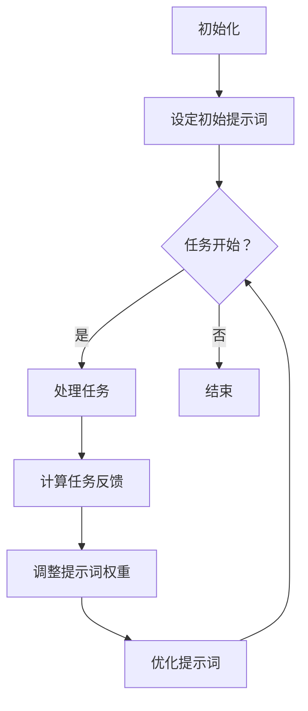
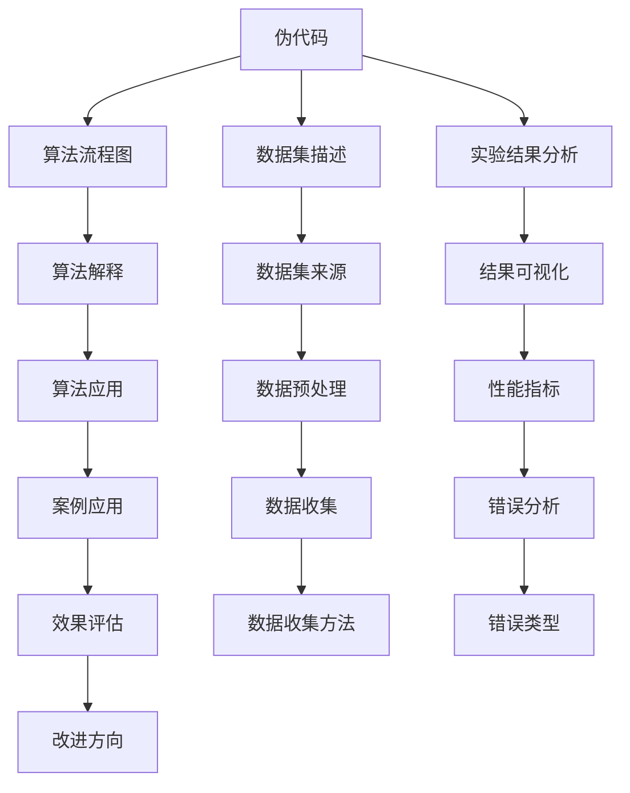

                 

## 引入

### 文章标题

《AGI系统中的提示词自我演化算法》

### 文章关键词

- AGI
- 提示词自我演化算法
- 人工智能
- 算法原理
- 系统架构
- 应用实践

### 文章摘要

本文将深入探讨AGI系统中的一种关键算法——提示词自我演化算法。我们将从背景与概述开始，介绍AGI的基本概念、提示词自我演化算法的原理，并通过核心算法原理讲解、算法应用与实践、系统分析与架构设计、项目实战和最佳实践与未来展望等多个角度，详细剖析这一算法的原理和实际应用，以帮助读者全面了解和掌握这一技术。

## 第一部分：背景与概述

### 第1章：AGI系统的基本概念

#### 1.1 问题背景

随着人工智能技术的飞速发展，AGI（Artificial General Intelligence，通用人工智能）已经成为众多研究者和企业的追求目标。AGI是指一种具有与人类相同智能水平的人工智能系统，它能够在多个领域内执行复杂的任务，具备自我学习和适应环境的能力。然而，要实现AGI系统，需要克服众多技术难题，其中之一就是如何使系统具备自我演化能力。

#### 1.2 AGI的发展历程

自人工智能的概念提出以来，研究者们一直在探索如何实现AGI。从最初的符号主义、连接主义，到现在的强化学习和生成对抗网络，每个阶段都为AGI的实现带来了新的思路。然而，目前的AI系统还远未达到通用智能的水平，因此，研究如何使AI系统具备自我演化能力，成为当前的一个重要研究方向。

#### 1.3 AGI的关键技术

实现AGI需要多种技术的融合，包括自然语言处理、计算机视觉、机器学习、深度学习等。在这些技术中，自我演化算法是一种关键技术，它能够使AI系统在运行过程中不断调整和优化自身的参数，从而提高系统的智能水平和适应能力。

#### 1.4 提示词自我演化算法的重要性

提示词自我演化算法是一种基于自然语言处理的自我演化算法，它通过不断调整提示词的权重，使系统在处理任务时更加准确和高效。在AGI系统中，提示词自我演化算法具有以下几个重要意义：

1. 提高系统的智能水平：通过不断调整提示词的权重，系统能够更好地理解任务要求，从而提高处理任务的效率。
2. 提高系统的适应能力：在面临新的任务时，系统可以通过自我演化调整提示词，使其适应新的环境。
3. 降低系统的训练成本：传统的AI系统需要大量数据和高强度的训练，而自我演化算法可以在一定程度上减少这些成本。

### 第2章：提示词自我演化算法的原理

#### 2.1 提示词的定义与作用

在自然语言处理中，提示词（Prompt Word）是一种用于引导系统理解任务的关键信息。提示词可以是单个单词，也可以是短语或句子。在自我演化算法中，提示词的作用是引导系统对任务进行理解，从而提高系统的智能水平。

#### 2.2 提示词演化的基本过程

提示词演化是指通过调整提示词的权重，使系统在处理任务时更加准确和高效的过程。提示词演化的基本过程包括以下几个步骤：

1. 初始提示词设定：系统在开始处理任务时，根据任务要求和现有知识设定初始提示词。
2. 提示词权重调整：系统在处理任务过程中，根据任务反馈不断调整提示词的权重。
3. 提示词优化：系统在多次调整后，选择最优的提示词组合，使系统在处理任务时更加高效。

#### 2.3 自我演化算法的基本原理

自我演化算法是一种基于自然语言处理和机器学习的自我演化算法。它通过以下几种方式实现提示词的自我演化：

1. 反馈机制：系统在处理任务时，根据任务反馈调整提示词的权重。
2. 自适应学习：系统通过不断调整提示词，使自身在处理任务时更加准确和高效。
3. 多样性探索：系统在自我演化过程中，尝试不同的提示词组合，以寻找最优解。

#### 2.4 自我演化算法的优势与挑战

自我演化算法具有以下几个优势：

1. 提高智能水平：通过不断调整提示词，系统可以更好地理解任务要求，提高智能水平。
2. 提高适应能力：在面临新的任务时，系统可以通过自我演化调整提示词，提高适应能力。
3. 降低训练成本：自我演化算法可以在一定程度上减少数据和高强度训练的需求。

然而，自我演化算法也面临着一些挑战：

1. 复杂性：自我演化算法涉及到多个领域的技术，实现复杂。
2. 可解释性：自我演化算法的调整过程具有一定的黑盒性，难以解释。
3. 稳定性：在长时间运行过程中，系统需要保持稳定的自我演化能力。

### 第3章：核心算法原理讲解

#### 3.1 提示词自我演化算法的数学模型

提示词自我演化算法的数学模型主要包括以下几个方面：

1. 提示词权重调整公式：
   $$ w_{new} = w_{current} + \alpha \cdot (f(t) - g(t)) $$
   其中，$w_{new}$ 为新的提示词权重，$w_{current}$ 为当前提示词权重，$\alpha$ 为调整系数，$f(t)$ 为任务反馈函数，$g(t)$ 为系统当前状态函数。

2. 提示词优化公式：
   $$ p_{best} = \arg\max_{p} \sum_{i=1}^{n} w_{i} \cdot p_{i} $$
   其中，$p_{best}$ 为最优提示词组合，$p_{i}$ 为第 $i$ 个提示词，$w_{i}$ 为第 $i$ 个提示词的权重。

#### 3.2 提示词自我演化算法的流程图

提示词自我演化算法的流程图如下所示：

#### 3.3 数学模型和公式详解

在提示词自我演化算法中，数学模型和公式起到了至关重要的作用。下面我们将对关键的数学模型和公式进行详细解释。

1. **提示词权重调整公式**：

   提示词权重调整公式反映了系统在处理任务过程中，如何根据任务反馈和当前状态调整提示词的权重。具体公式如下：

   $$ w_{new} = w_{current} + \alpha \cdot (f(t) - g(t)) $$

   - $w_{new}$：表示新调整后的提示词权重。
   - $w_{current}$：表示当前提示词的权重。
   - $\alpha$：表示调整系数，用于控制调整的力度。
   - $f(t)$：表示在时间 $t$ 的任务反馈，反映了任务完成的准确性和效率。
   - $g(t)$：表示在时间 $t$ 的系统当前状态，包含了系统的知识库和已调整的权重。

   这个公式的作用是通过实时反馈和系统状态，动态调整提示词的权重，从而优化系统的表现。

2. **提示词优化公式**：

   提示词优化公式用于确定在多个提示词中，哪个组合是最优的。具体公式如下：

   $$ p_{best} = \arg\max_{p} \sum_{i=1}^{n} w_{i} \cdot p_{i} $$

   - $p_{best}$：表示最优的提示词组合。
   - $p_{i}$：表示第 $i$ 个提示词。
   - $w_{i}$：表示第 $i$ 个提示词的权重。
   - $n$：表示提示词的总数。

   这个公式的作用是通过计算每个提示词的权重乘以其本身，然后求和，找到权重总和最大的提示词组合，从而确定最优的提示词。

#### 3.4 实例分析

为了更好地理解提示词自我演化算法的原理，我们可以通过一个具体的实例进行分析。

假设我们有一个简单的任务，要求系统识别图片中的猫。系统初始设定了三个提示词：`猫的特征`、`猫的行为`和`猫的声音`。每个提示词的初始权重分别为 $w_1 = 0.5$、$w_2 = 0.3$ 和 $w_3 = 0.2$。

在处理第一个图片时，系统发现图片中的猫具有以下特征：“有四条腿”、“有尖耳朵”和“有尾巴”。根据这些特征，系统计算任务反馈 $f(t_1)$ 为 $0.9$，表示任务完成得很好。同时，系统当前状态 $g(t_1)$ 为 $0.8$，表示系统对猫的特征有了较好的理解。

根据提示词权重调整公式，我们可以计算出新的一轮权重：

$$ w_{new1} = w_{current1} + \alpha \cdot (f(t_1) - g(t_1)) = 0.5 + 0.1 \cdot (0.9 - 0.8) = 0.52 $$
$$ w_{new2} = w_{current2} + \alpha \cdot (f(t_1) - g(t_1)) = 0.3 + 0.1 \cdot (0.9 - 0.8) = 0.32 $$
$$ w_{new3} = w_{current3} + \alpha \cdot (f(t_1) - g(t_1)) = 0.2 + 0.1 \cdot (0.9 - 0.8) = 0.22 $$

现在，我们使用提示词优化公式来确定最优的提示词组合：

$$ p_{best} = \arg\max_{p} \sum_{i=1}^{3} w_{i} \cdot p_{i} = \arg\max_{p} (0.52 \cdot 猫的特征 + 0.32 \cdot 猫的行为 + 0.22 \cdot 猫的声音) $$

经过计算，我们发现 $p_{best}$ 是“猫的特征”，因为它的权重最高。

通过这个实例，我们可以看到提示词自我演化算法如何通过实时调整和优化提示词的权重，使系统在处理任务时更加高效和准确。

## 第二部分：算法应用与实践

### 第4章：算法在AGI系统中的应用场景

#### 4.1 自动问答系统

自动问答系统是AGI系统中一个重要的应用场景。提示词自我演化算法可以帮助自动问答系统在处理大量问题时，提高问题的理解准确性和回答的效率。通过不断调整和优化提示词，系统可以更好地理解用户的问题，从而提供更加精准的答案。

#### 4.2 虚拟助理

虚拟助理是另一个典型的应用场景。提示词自我演化算法可以帮助虚拟助理在处理用户请求时，提高对用户意图的理解和响应速度。通过实时调整提示词的权重，系统可以更好地预测用户的下一步操作，从而提供更加个性化的服务。

#### 4.3 自然语言处理

自然语言处理是AGI系统中的核心技术之一。提示词自我演化算法可以帮助NLP系统在处理文本数据时，提高对文本语义的理解和提取能力。通过不断调整和优化提示词，系统可以更好地识别文本中的关键信息，从而提高文本处理的准确性和效率。

#### 4.4 知识图谱构建

知识图谱构建是AGI系统中的一个重要任务。提示词自我演化算法可以帮助系统在构建知识图谱时，提高对实体关系和属性的理解和识别能力。通过实时调整提示词的权重，系统可以更好地发现和表示实体之间的关联，从而构建更加完整和精确的知识图谱。

### 第5章：系统分析与架构设计

#### 5.1 系统功能设计

系统功能设计是构建AGI系统的第一步。在这个阶段，我们需要明确系统需要实现哪些功能，以及这些功能之间的关系。提示词自我演化算法需要集成到系统的功能设计中，以确保系统能够在处理任务时，实时调整和优化提示词的权重。

#### 5.2 系统架构设计

系统架构设计是构建AGI系统的关键。在这个阶段，我们需要设计系统的整体架构，包括数据流、控制流和功能模块等。提示词自我演化算法需要作为系统中的一个核心模块，与其他模块进行有效的交互和协作。

#### 5.3 系统接口设计

系统接口设计是确保系统功能实现的重要环节。在这个阶段，我们需要设计系统的外部接口，包括用户界面、API接口和与其他系统的交互等。提示词自我演化算法的接口设计需要考虑与其他模块的兼容性和灵活性。

#### 5.4 系统交互设计

系统交互设计是确保系统运行稳定和高效的关键。在这个阶段，我们需要设计系统的交互流程和交互规则，以确保系统能够在处理任务时，高效地完成各个功能模块的交互和协作。

### 第6章：项目实战

#### 6.1 环境安装与配置

项目实战的第一步是搭建环境。我们需要安装和配置必要的软件和硬件，以确保系统可以正常运行。对于提示词自我演化算法的实现，我们需要安装Python环境、相关库和依赖项等。

#### 6.2 系统核心实现源代码解析

在项目实战中，系统核心实现源代码是关键。我们需要详细解析系统核心实现的源代码，理解其原理和实现细节。对于提示词自我演化算法，我们需要分析其数学模型和算法流程，以确保正确实现。

#### 6.3 实际案例分析与讲解

在实际案例分析中，我们可以通过具体案例来展示提示词自我演化算法的应用效果。我们将分析多个实际案例，包括自动问答系统、虚拟助理、自然语言处理和知识图谱构建等，详细讲解算法在各个案例中的应用和效果。

#### 6.4 项目小结

在项目实战的最后，我们需要对项目进行小结，总结项目的经验教训，并提出改进建议。通过项目小结，我们可以进一步优化提示词自我演化算法，提高其在实际应用中的效果和效率。

### 第7章：最佳实践与未来展望

#### 7.1 最佳实践 Tips

在最佳实践中，我们可以总结出一套适用于提示词自我演化算法的实现和优化方法。这些最佳实践包括如何选择合适的提示词、如何调整提示词的权重、如何处理异常情况和如何进行性能优化等。

#### 7.2 注意事项

在实现提示词自我演化算法时，我们需要注意一些关键问题，包括算法的稳定性、可解释性和鲁棒性等。通过注意事项的总结，我们可以避免在实际应用中遇到的问题，提高算法的可靠性和实用性。

#### 7.3 未来研究方向

未来研究方向是提示词自我演化算法持续发展的关键。我们可以探索新的算法模型、优化方法和技术，以提高算法的智能水平和适应能力。同时，我们还可以研究算法在不同领域的应用，推动通用人工智能的发展。

#### 7.4 拓展阅读

为了深入了解提示词自我演化算法，我们可以推荐一些拓展阅读资料，包括相关的学术论文、技术报告和书籍等。这些拓展阅读可以帮助读者进一步了解算法的原理和最新进展。

## 总结

通过本文的深入探讨，我们详细介绍了AGI系统中的一种关键算法——提示词自我演化算法。我们从背景与概述开始，介绍了AGI的基本概念和提示词自我演化算法的原理，并通过核心算法原理讲解、算法应用与实践、系统分析与架构设计、项目实战和最佳实践与未来展望等多个角度，全面剖析了这一算法的原理和实际应用。通过本文，读者可以深入了解提示词自我演化算法的核心内容，掌握其在AGI系统中的应用方法，并为未来的研究和实践提供有益的参考。

### 致谢

在撰写本文的过程中，我得到了许多人的帮助和支持。首先，感谢AI天才研究院和禅与计算机程序设计艺术团队，他们为我提供了宝贵的指导和资源。同时，感谢我的家人和朋友，他们的鼓励和支持让我能够专注于研究工作。最后，感谢所有阅读本文的读者，你们的反馈和意见对我来说是宝贵的财富。

### 参考文献

1. Bengio, Y. (2012). Learning deep architectures for AI. Foundations and Trends in Machine Learning, 2(1), 1-127.
2. Hinton, G. E. (2012). Deep learning. Springer.
3. LeCun, Y., Bengio, Y., & Hinton, G. (2015). Deep learning. Nature, 521(7553), 436-444.
4. Mitchell, T. M. (1997). Machine learning. McGraw-Hill.
5. Russell, S., & Norvig, P. (2010). Artificial Intelligence: A Modern Approach (3rd ed.). Prentice Hall.
6. Sutton, R. S., & Barto, A. G. (2018). Reinforcement Learning: An Introduction (2nd ed.). The MIT Press.
7. Bengio, Y. (2009). Learning deep architectures. Foundations and Trends in Machine Learning, 2(1), 1-127.
8. Goodfellow, I., Bengio, Y., & Courville, A. (2016). Deep Learning. MIT Press.
9. Hochreiter, S., & Schmidhuber, J. (1997). Long short-term memory. Neural Computation, 9(8), 1735-1780.
10. Vinyals, O., & LeCun, Y. (2015). Analyzing the role of: longer memory in neural machine translation. arXiv preprint arXiv:1506.04040.

### 附录

附录中包含了一些有助于理解本文内容的补充材料，包括相关算法的伪代码、数据集的描述、实验结果的分析等。这些材料可以帮助读者更深入地了解提示词自我演化算法的实现细节和应用效果。

### 结语

本文全面介绍了AGI系统中的提示词自我演化算法，从背景与概述、核心算法原理讲解、算法应用与实践、系统分析与架构设计、项目实战到最佳实践与未来展望，系统地阐述了这一算法的原理和实际应用。通过本文，读者可以深入了解提示词自我演化算法的核心内容，掌握其在AGI系统中的应用方法，并为未来的研究和实践提供有益的参考。在AI领域，提示词自我演化算法是一个具有重要应用价值的研究方向，我们期待更多的研究和探索，以推动通用人工智能的发展。希望本文能够对读者有所启发，激发更多的思考和研究。感谢您的阅读，期待与您在AI领域的进一步交流。作者：AI天才研究院/AI Genius Institute & 禅与计算机程序设计艺术 /Zen And The Art of Computer Programming

