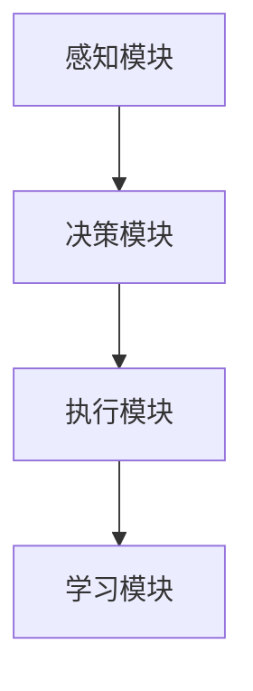
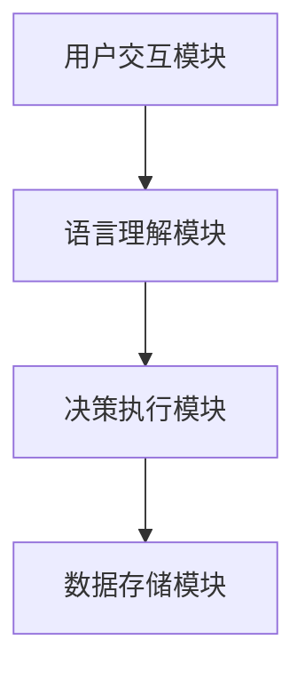

                 

### AI Agent 架构设计：基于 LLM 的智能助手系统构建

> 关键词：AI Agent，架构设计，LLM，智能助手，系统构建

> 摘要：本文深入探讨了 AI Agent 的架构设计，特别是基于大型语言模型（LLM）的智能助手系统构建。文章首先介绍了 AI Agent 的基本概念和重要性，随后详细讲解了 LLM 的基础知识。接着，文章从 AI Agent 的架构设计原则和组成部分出发，逐步展开了对智能助手系统设计目标、系统架构设计、语言模型选择与训练、系统测试与优化等方面的详细阐述。最后，文章讨论了 AI Agent 在实际应用中面临的挑战以及应对策略，为读者提供了宝贵的实践经验和未来展望。

### 第一部分：AI Agent 背景与基本概念

#### 第1章：AI Agent 的定义与重要性

**1.1 AI Agent 的定义**

AI Agent 是指具有自主性和智能性，能够与环境进行交互，并在环境中执行任务的计算机程序。AI Agent 的核心是具备学习能力，能够通过数据积累和自我优化来提升性能。

**1.1.1 代理的概念**

代理（Agent）是一个广泛的概念，源于人工智能领域。在 AI 中，代理指的是一个具有感知、决策和执行能力的实体，可以独立或与其他代理协作完成任务。

**1.1.2 AI 代理的特点**

- 自主性：AI 代理具有独立执行任务的能力，不需要人工干预。
- 智能性：AI 代理能够通过学习和经验来优化其行为。
- 学习能力：AI 代理能够从数据中学习，不断自我优化。

**1.1.3 AI 代理的分类**

AI 代理根据功能和用途可以分为以下几类：

- 监控代理：用于实时监测系统状态，提供预警和反馈。
- 自动化代理：用于自动化执行重复性任务。
- 智能代理：具有高级决策能力，能够应对复杂问题。
- 聊天机器人代理：用于与人进行自然语言交互。

**1.2 AI Agent 的重要性**

AI Agent 在现代社会中有着广泛的应用，对个人、企业和社会都产生了深远的影响。

**1.2.1 在现代社会中的应用**

- 个人助理：如 Siri、Alexa 等，提供日程管理、信息查询等服务。
- 商业自动化：如智能客服系统，提高服务效率，降低成本。
- 智能医疗：如诊断辅助系统，帮助医生更准确地诊断疾病。
- 智能交通：如自动驾驶汽车，提高交通效率和安全性。

**1.2.2 对未来社会的影响**

- 提高生产效率：通过自动化和智能化，大幅提高生产效率。
- 改善生活质量：提供个性化服务，提升人们的生活品质。
- 促进社会进步：推动科技创新，促进社会发展和进步。

**1.2.3 AI Agent 发展的现状与趋势**

目前，AI Agent 的研究和发展正处于快速增长的阶段，呈现出以下几个趋势：

- 人工智能技术的快速发展，使得 AI 代理的能力不断增强。
- 5G、物联网等技术的普及，为 AI 代理的应用提供了更广阔的空间。
- 随着数据量的增长和算法的优化，AI 代理的学习能力将进一步提高。

### 第2章：LLM 基础知识

**2.1 语言模型概述**

语言模型是自然语言处理（NLP）的核心技术之一，用于预测文本序列的概率分布。它为 AI 代理提供了强大的语言理解和生成能力。

**2.1.1 语言模型的概念**

语言模型是一种统计模型，它通过分析大量文本数据，学习语言的统计规律，从而预测文本序列的概率分布。

**2.1.2 语言模型的发展历程**

语言模型的发展可以分为以下几个阶段：

- 基于规则的模型：如短语结构语法模型，通过规则来分析文本结构。
- 统计模型：如 N-gram 模型，通过统计文本的相邻词序列来预测下一个词。
- 生成模型：如神经网络模型，通过生成概率分布来预测文本序列。
- 对话模型：如序列到序列（Seq2Seq）模型，用于生成连贯的对话文本。

**2.1.3 语言模型在 AI 代理中的应用**

语言模型在 AI 代理中有着广泛的应用，如：

- 语言理解：用于理解用户输入的文本，提取语义信息。
- 语言生成：用于生成自然语言的回复，实现人机交互。
- 文本分类：用于对文本进行分类，如新闻分类、情感分析等。

**2.2 LLM 的核心技术**

LLM 的核心技术主要包括以下几个方面：

- 语言模型的数学基础：如概率论、信息论等，为语言模型提供了理论支持。
- LLM 的架构设计：如 Transformer 模型，采用了自注意力机制，显著提升了语言模型的效果。
- LLM 的训练与优化：如迁移学习、强化学习等，用于提升语言模型的性能和适应能力。

### 第3章：AI Agent 架构设计

**3.1 AI Agent 架构概述**

AI Agent 的架构设计需要综合考虑其功能、性能、可扩展性和可靠性等因素。一个典型的 AI Agent 架构包括以下几个部分：

- 感知模块：用于获取环境信息，如图像、语音、文本等。
- 决策模块：用于根据感知信息进行决策，如目标规划、路径规划等。
- 执行模块：用于执行决策结果，如控制机器人移动、执行自动化任务等。
- 学习模块：用于从环境反馈中学习，优化行为策略。

**3.1.1 AI Agent 的基本组成部分**

AI Agent 的基本组成部分可以分为以下几个模块：

- 感知模块：用于感知环境信息，如传感器、摄像头等。
- 决策模块：用于处理感知信息，生成决策结果。
- 执行模块：用于执行决策结果，实现具体任务。
- 学习模块：用于从执行结果中学习，优化决策策略。

**3.1.2 AI Agent 的架构设计原则**

AI Agent 的架构设计需要遵循以下几个原则：

- 模块化设计：将 AI Agent 拆分为多个模块，便于维护和扩展。
- 可扩展性：支持添加新的模块和功能，以适应不同场景的需求。
- 可靠性：确保 AI Agent 在各种环境下都能稳定运行。
- 可维护性：便于修改和优化，以提高系统性能。

**3.1.3 AI Agent 的系统架构图**

下图展示了 AI Agent 的系统架构：

### 第2部分：基于 LLM 的智能助手系统构建

#### 第4章：智能助手系统的设计目标

**4.1 智能助手系统概述**

智能助手系统是一种基于 AI Agent 的应用系统，旨在为用户提供便捷、高效的服务。它通过语言模型实现对用户指令的理解和回复，从而实现人机交互。

**4.1.1 智能助手系统的定义**

智能助手系统是一种具有语言理解和生成能力的计算机程序，它能够与用户进行自然语言交互，提供个性化服务。

**4.1.2 智能助手系统的功能模块**

智能助手系统的功能模块主要包括：

- 用户交互模块：用于与用户进行文本或语音交互，获取用户指令。
- 语言理解模块：用于解析用户指令，提取语义信息。
- 决策执行模块：根据用户指令生成决策结果，并执行相应操作。

**4.1.3 智能助手系统的设计目标**

智能助手系统的设计目标主要包括以下几个方面：

- 高效性：快速响应用户请求，提供高效服务。
- 准确性：准确理解用户指令，生成合适的回复。
- 个性化：根据用户偏好和历史行为，提供个性化服务。
- 可扩展性：支持添加新的功能模块，适应不同场景需求。

#### 第5章：系统架构设计

**5.1 系统架构概述**

智能助手系统的架构设计需要遵循模块化、可扩展性、可靠性和可维护性等原则。一个典型的智能助手系统架构包括以下几个部分：

- 用户交互模块：负责与用户进行文本或语音交互。
- 语言理解模块：负责解析用户指令，提取语义信息。
- 决策执行模块：根据用户指令生成决策结果，并执行相应操作。
- 数据存储模块：用于存储用户数据、历史记录等。

**5.1.1 系统架构的设计原则**

系统架构的设计原则主要包括：

- 模块化设计：将系统划分为多个功能模块，便于维护和扩展。
- 分层设计：将系统功能划分为多个层次，提高系统的可扩展性和可维护性。
- 松耦合设计：降低模块间的耦合度，提高系统的可靠性。
- 容错设计：确保系统在异常情况下能够恢复，保证服务的连续性。

**5.1.2 系统架构的组成部分**

智能助手系统的架构主要包括以下几个部分：

- 用户交互模块：负责与用户进行文本或语音交互，获取用户指令。
- 语言理解模块：负责解析用户指令，提取语义信息。
- 决策执行模块：根据用户指令生成决策结果，并执行相应操作。
- 数据存储模块：用于存储用户数据、历史记录等。

**5.1.3 系统架构图**

下图展示了智能助手系统的架构：

### 第3部分：语言模型的选择与训练

#### 第6章：语言模型的选择

**6.1 语言模型的选择原则**

在选择语言模型时，需要考虑以下几个原则：

- 性能：选择性能优异的语言模型，能够提供准确的语言理解与生成能力。
- 可扩展性：模型应支持扩展，能够适应不同的应用场景。
- 训练效率：选择训练效率高的模型，能够快速训练并适应新的数据。
- 维护成本：模型应易于维护，降低维护成本。

**6.1.2 主流语言模型的介绍**

目前，主流的语言模型包括：

- N-gram 模型：基于词频统计的简单模型，适用于小型文本。
- LSTM 模型：基于递归神经网络，能够处理长文本序列。
- Transformer 模型：基于自注意力机制，具有强大的并行计算能力。
- BERT 模型：基于 Transformer，具有强大的上下文理解能力。

**6.1.3 语言模型的评估指标**

语言模型的评估指标包括：

- Perplexity（困惑度）：用于衡量模型对文本预测的能力，值越低表示模型越好。
- Accuracy（准确率）：用于衡量模型在文本分类任务中的表现，值越高表示模型越好。
- F1-score（F1 值）：用于衡量模型在二分类任务中的精确度和召回率的平衡。

### 第4部分：系统测试与优化

#### 第7章：系统测试与优化

**7.1 系统测试方法**

系统测试是确保智能助手系统性能和稳定性的关键环节。系统测试主要包括以下几种方法：

- 功能测试：验证系统功能是否符合设计要求。
- 性能测试：评估系统在不同负载下的响应速度和处理能力。
- 兼容性测试：确保系统在不同操作系统、浏览器等环境下都能正常运行。
- 压力测试：评估系统在极端负载下的性能和稳定性。

**7.2 系统优化策略**

系统优化策略主要包括以下几个方面：

- 模型优化：选择合适的模型结构和参数，提高模型性能。
- 数据优化：收集更多高质量的训练数据，提高模型泛化能力。
- 算法优化：改进算法设计，提高系统响应速度和处理能力。
- 系统优化：调整系统配置，提高系统资源利用率。

**7.2.1 系统优化目标**

系统优化目标主要包括以下几个方面：

- 提高性能：提高系统的响应速度和处理能力。
- 提高稳定性：确保系统在各种环境下都能稳定运行。
- 提高可扩展性：支持系统的功能扩展和性能提升。
- 提高用户体验：提供更加便捷、高效的服务。

### 第5部分：AI Agent 在实际应用中的挑战与应对

#### 第8章：AI Agent 在实际应用中的挑战与应对

**8.1 AI Agent 在实际应用中面临的挑战**

AI Agent 在实际应用中面临着以下几个挑战：

- 数据隐私与安全：AI Agent 需要处理大量的用户数据，如何确保数据的安全性和隐私性是一个重要问题。
- 人工智能伦理问题：AI Agent 的行为可能带来伦理问题，如歧视、偏见等，如何确保 AI Agent 的行为符合伦理标准是一个挑战。
- 技术与市场需求的不匹配：AI Agent 的技术发展可能领先于市场需求，如何将技术优势转化为市场价值是一个挑战。

**8.2 应对策略与未来展望**

针对上述挑战，可以采取以下应对策略：

- 数据隐私保护技术：采用数据加密、匿名化等技术手段，确保用户数据的隐私和安全。
- 人工智能伦理规范：建立人工智能伦理规范，确保 AI Agent 的行为符合伦理标准。
- 技术与市场的协调发展：关注市场需求，推动技术发展，实现技术与市场的协调发展。

未来，随着人工智能技术的不断发展，AI Agent 将在更多领域发挥作用，为人类带来更多便利。同时，我们也需要不断关注和解决 AI Agent 在实际应用中面临的挑战，确保其健康发展。

### 附录：参考资料与拓展阅读

**8.1 参考书籍**

- 《人工智能：一种现代的方法》
- 《深度学习》（Goodfellow、Bengio、Courville 著）
- 《自然语言处理综合教程》

**8.2 在线资源**

- OpenAI 的网站：[https://openai.com/](https://openai.com/)
- 百度 AI 开放平台：[https://ai.baidu.com/](https://ai.baidu.com/)
- 微软 Azure AI：[https://azure.microsoft.com/zh-cn/services/ai/](https://azure.microsoft.com/zh-cn/services/ai/)

### 总结

本文深入探讨了 AI Agent 的架构设计，特别是基于 LLM 的智能助手系统构建。通过对 AI Agent 的基本概念、LLM 的基础知识、系统架构设计、语言模型选择与训练、系统测试与优化等方面的详细阐述，为读者提供了丰富的实践经验和理论基础。在实际应用中，AI Agent 面临着一系列挑战，但通过合理的设计和优化，可以充分发挥其潜力，为人类带来更多便利。未来，随着人工智能技术的不断发展，AI Agent 将在更多领域发挥作用，为人类社会带来深远影响。

