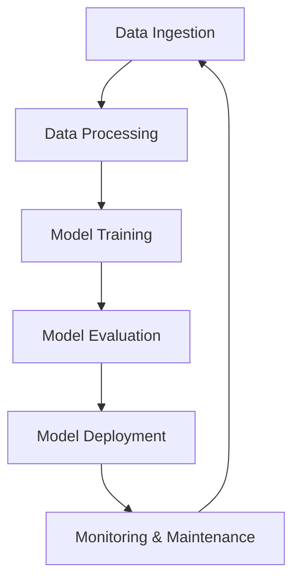
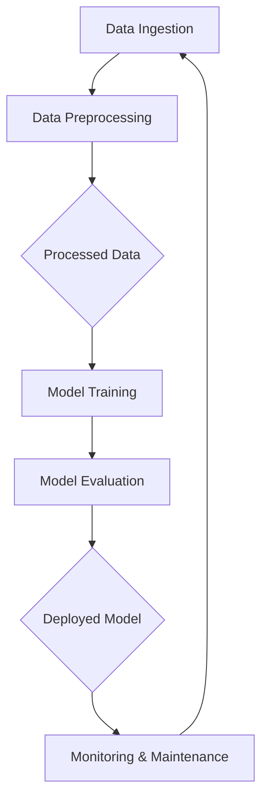

                 


### Introduction to AI Agent Continuous Learning

In the rapidly evolving field of artificial intelligence (AI), the concept of AI Agent Continuous Learning has gained significant attention. AI agents, essentially autonomous entities that perceive their environment and take actions to achieve specific goals, are at the heart of many modern AI applications. However, the challenge lies in their ability to adapt and learn continuously from changing environments. This article aims to delve into the realm of AI Agent Continuous Learning, with a particular focus on the Long Short-Term Memory (LLM) model's lifelong learning ability. 

## Key Concepts and Terms

To begin with, let's define some key concepts and terms that will help set the stage for our discussion:

- **AI Agent**: An AI agent is an autonomous entity that perceives its environment through sensors and takes actions to achieve specific goals. These agents are designed to interact with their surroundings, learn from experience, and adapt to new situations.
  
- **Continuous Learning**: Continuous learning refers to the ability of an AI agent to learn and adapt over time, even as the environment changes. This is crucial for maintaining the agent's performance and relevance in dynamic settings.
  
- **LLM (Long Short-Term Memory)**: LLM is a type of recurrent neural network (RNN) that is particularly well-suited for processing and predicting sequences of data. It was developed to overcome the vanishing gradient problem, which limits the ability of traditional RNNs to learn long-term dependencies.
  
- **Lifelong Learning Ability**: Lifelong learning ability refers to an AI agent's capability to continually learn new tasks and generalize to new domains while retaining previously learned knowledge.

## Problem Background and Description

The development of AI agents has been marked by significant advancements in machine learning, particularly in deep learning. These advancements have enabled AI agents to perform complex tasks such as image recognition, natural language processing, and game playing with remarkable accuracy. However, the majority of these AI agents are trained on static datasets and may struggle to adapt to new or changing environments. This limitation has sparked interest in the concept of continuous learning for AI agents.

In practical applications, AI agents are often required to operate in real-world scenarios where the environment is dynamic and evolving. For instance, a self-driving car must continuously learn from its surroundings to navigate safely through changing traffic conditions. Similarly, a chatbot needs to adapt to new conversational contexts as it interacts with users over time.

The challenge is to design AI agents that can not only learn from their experiences but also retain and apply this knowledge in novel scenarios. This is where the concept of lifelong learning ability comes into play. By enabling AI agents to continuously learn and adapt, we can enhance their performance, robustness, and reliability in a wide range of applications.

## Scope and Extensions

The scope of AI agent continuous learning is broad, encompassing various domains such as robotics, autonomous vehicles, virtual assistants, and gaming. In robotics, for example, continuous learning allows robots to improve their navigation and manipulation skills in unpredictable environments. In autonomous vehicles, it ensures that the vehicles can adapt to new traffic patterns and road conditions as they emerge.

However, the concept of continuous learning extends beyond these specific applications. It is relevant to any AI system that operates in a dynamic environment. This includes AI agents designed for healthcare, finance, manufacturing, and many other fields.

## Core Concepts and Structural Elements

To understand the core concepts of AI agent continuous learning, we need to consider several key elements:

1. **Learning Algorithms**: The algorithms that enable AI agents to learn from data and experience. These include supervised learning, unsupervised learning, and reinforcement learning.

2. **Memory Management**: The mechanisms that store and retrieve information, allowing AI agents to retain and leverage past knowledge.

3. **Transfer Learning**: The ability of AI agents to apply knowledge learned in one domain to a new domain. This is crucial for reducing the amount of data needed to train an AI agent and improving its generalization ability.

4. **Incremental Learning**: The process of updating an AI agent's knowledge incrementally as new data becomes available. This allows the agent to adapt to changes in the environment without discarding previously learned information.

5. **Generalization**: The ability of AI agents to perform well on new, unseen tasks and environments. Generalization is essential for the practical application of continuous learning in real-world scenarios.

## Conclusion

In this section, we have introduced the concept of AI agent continuous learning and outlined its importance in the development of AI systems. We have defined key terms and provided a background on the problem, highlighting the challenges and opportunities associated with continuous learning. As we delve deeper into the subsequent sections, we will explore the core concepts, algorithms, and practical applications that make AI agent continuous learning a promising area of research and development. Through this journey, we aim to shed light on the potential of lifelong learning in AI agents and their broader implications for the future of artificial intelligence.

### Core Concepts of Continuous Learning

In the realm of AI, continuous learning represents a fundamental capability that allows agents to adapt and improve over time, even as the environment they operate in evolves. At its core, continuous learning is about maintaining and updating the knowledge base of an AI agent, enabling it to perform tasks more effectively and generalize to new situations. Let's break down the essential concepts and principles that underpin continuous learning.

#### Continuous Learning Definition and Framework

Continuous learning can be defined as an iterative process where an AI agent acquires, updates, and utilizes knowledge over time. This process typically involves several key components:

1. **Data Acquisition**: Continuous learning begins with the acquisition of new data. This can come from various sources, such as real-time sensor inputs, user interactions, or additional training datasets.

2. **Data Processing**: The acquired data needs to be processed and cleaned to remove noise and irrelevant information. This often involves feature extraction and transformation.

3. **Model Updating**: The core of continuous learning involves updating the AI model with new data. This can be achieved through various techniques, such as online learning, where the model is updated incrementally, or batch learning, where updates are made in larger batches.

4. **Performance Evaluation**: After updating the model, it's crucial to evaluate its performance to ensure that the updates have led to improvements. This involves testing the model on validation sets and comparing its performance against previous versions.

5. **Retraining**: If the performance has not improved or has regressed, the model may need to be retrained on a larger or more diverse dataset.

#### Core Issues in Continuous Learning

The core issues in continuous learning can be broadly categorized into the following areas:

1. **Model Drift**: Over time, the statistical properties of the data distribution may change, leading to model drift. This can cause the model to become less accurate and relevant. Managing model drift is a key challenge in continuous learning.

2. **Data Efficiency**: Continuous learning requires efficient handling of large volumes of data. This includes efficient data storage, retrieval, and processing. The goal is to minimize the computational cost and maximize the learning effectiveness.

3. **Generalization**: Continuous learning should enable the AI agent to generalize from past experiences to new, unseen situations. This is critical for the practical deployment of AI agents in real-world applications.

4. **Privacy and Security**: In some applications, continuous learning involves processing sensitive data. Ensuring the privacy and security of this data is a significant concern that needs to be addressed.

5. **Scalability**: Continuous learning systems should be scalable to handle increasing data volumes and more complex environments without compromising performance.

#### Continuous Learning Algorithms

Continuous learning algorithms are designed to address the challenges mentioned above. Some of the key algorithms in this domain include:

1. **Online Learning Algorithms**: These algorithms update the model incrementally as new data arrives. Examples include stochastic gradient descent (SGD) and its variants.

2. **Reinforcement Learning**: Reinforcement learning is particularly well-suited for continuous learning tasks. It involves training an agent through a trial-and-error approach, where it receives feedback in the form of rewards or penalties.

3. **Transfer Learning**: Transfer learning leverages knowledge from one domain to improve learning in another domain. This can be achieved through techniques like fine-tuning pre-trained models.

4. **Meta-Learning**: Meta-learning, or learning to learn, involves training models that can quickly adapt to new tasks with minimal additional training. This is useful for scenarios where the environment changes frequently.

#### Continuous Learning in Practice

In practice, implementing continuous learning requires careful consideration of several factors:

1. **Data Management**: Efficient data management systems are essential for handling large and diverse datasets. This includes data ingestion, storage, and preprocessing.

2. **Model Selection**: Choosing the right model architecture and algorithm for the specific task is crucial. This often involves experimenting with different models and selecting the one that performs best.

3. **Integration**: Continuous learning systems need to be integrated seamlessly into the existing infrastructure. This includes considerations for deployment, monitoring, and maintenance.

4. **Evaluation**: Regular performance evaluation is necessary to ensure that the system is learning effectively and meeting its objectives.

In summary, continuous learning is a complex but essential aspect of AI agent development. By addressing the core issues and leveraging advanced algorithms, we can design AI agents that are capable of adapting and improving over time, thereby enhancing their practical utility and impact.

### Detailed Explanation of Continuous Learning Algorithms

To understand the intricate workings of continuous learning algorithms, we need to delve into the specific methodologies and techniques that enable AI agents to update their knowledge base in real-time. Here, we will discuss some of the most commonly used continuous learning algorithms, including online learning algorithms, reinforcement learning, transfer learning, and meta-learning. We will also explore the underlying mathematical models and principles that govern these algorithms.

#### Online Learning Algorithms

Online learning, also known as incremental learning, is a fundamental approach in continuous learning. Unlike batch learning, where the entire dataset is used for training, online learning updates the model incrementally as new data points arrive. This approach is particularly useful in scenarios where the data is constantly changing, such as in real-time applications.

**Stochastic Gradient Descent (SGD)**

Stochastic Gradient Descent (SGD) is one of the most widely used online learning algorithms. It updates the model parameters using the gradient of the loss function with respect to the parameters, calculated using a single randomly selected data point (stochastic). The basic steps of SGD are as follows:

1. **Initialization**: Initialize the model parameters.
2. **Data Sampling**: Randomly select a single data point from the dataset.
3. **Gradient Calculation**: Compute the gradient of the loss function with respect to the model parameters using the selected data point.
4. **Parameter Update**: Update the model parameters by subtracting the gradient multiplied by a learning rate.
5. **Iteration**: Repeat steps 2-4 for a specified number of iterations or until convergence.

The update rule for SGD can be mathematically represented as:
$$
\theta = \theta - \alpha \cdot \nabla_{\theta} J(\theta)
$$
where $\theta$ represents the model parameters, $\alpha$ is the learning rate, and $J(\theta)$ is the loss function.

**Adaptive Gradient Algorithms**

To improve the convergence speed and robustness of SGD, several adaptive gradient algorithms have been developed, such as Adam, RMSprop, and Adagrad. These algorithms adjust the learning rate dynamically based on the historical gradients, which helps in navigating flat regions and steep cliffs in the loss landscape more effectively.

**Mathematical Model**

The mathematical model for online learning algorithms, particularly SGD, revolves around the concept of stochastic approximation. Stochastic approximation aims to find the minimum of a function $J(\theta)$ by iteratively updating the parameters $\theta$ based on noisy estimates of the gradient. The iterative update rule can be represented as:
$$
\theta^{t+1} = \theta^t - \alpha \cdot \nabla_{\theta} J(\theta^t + \epsilon_t)
$$
where $\epsilon_t$ represents the noise term, which can be the result of stochastic sampling or other sources of randomness.

#### Reinforcement Learning

Reinforcement learning (RL) is another critical approach in continuous learning, particularly suited for scenarios where the environment is dynamic and the optimal actions are not known in advance. RL involves training an agent to make decisions that maximize a cumulative reward over time.

**Q-Learning**

Q-Learning is a popular algorithm in RL that uses value-based learning to determine the optimal action policy. The Q-value function $Q(s, a)$ represents the expected return for taking action $a$ in state $s$. The algorithm updates the Q-values based on the reward received and the maximum Q-value in the next state.

The update rule for Q-learning can be expressed as:
$$
Q(s, a) = Q(s, a) + \alpha \cdot (r + \gamma \cdot \max_{a'} Q(s', a') - Q(s, a))
$$
where $\alpha$ is the learning rate, $r$ is the reward, $\gamma$ is the discount factor, and $s'$ and $a'$ are the next state and action, respectively.

**SARSA**

SARSA (State-Action-Reward-State-Action) is a policy-based learning algorithm that updates the policy directly based on the observed transitions. It uses the same update rule as Q-learning but involves evaluating the next state's action values during the update process.

**Mathematical Model**

The mathematical model for RL, particularly Q-Learning, involves defining the Bellman equation, which relates the Q-value of a state-action pair to the expected return from that pair:
$$
Q(s, a) = r + \gamma \cdot \max_{a'} Q(s', a')
$$
This equation captures the trade-off between immediate rewards and the potential future rewards.

#### Transfer Learning

Transfer learning leverages knowledge from one domain (source domain) to improve learning in another domain (target domain). This approach is particularly useful when the target domain has limited labeled data or when the target and source domains are similar.

**Fine-Tuning Pre-Trained Models**

Fine-tuning involves taking a pre-trained model (usually trained on a large dataset) and adjusting its parameters to fit a new task. The pre-trained model acts as a starting point, and its weights are used to initialize the target model. The learning process then focuses on updating these weights incrementally.

The update rule for fine-tuning can be represented as:
$$
\theta^* = \theta^{prev} + \alpha \cdot (\theta^{new} - \theta^{prev})
$$
where $\theta^{prev}$ and $\theta^{new}$ represent the previous and updated model weights, respectively, and $\alpha$ is the learning rate.

**Domain Adaptation Techniques**

Domain adaptation techniques aim to reduce the domain gap between the source and target domains. Common techniques include domain alignment, where the features of the two domains are aligned, and domain separation, where the target domain's features are emphasized while suppressing the source domain's features.

**Mathematical Model**

Transfer learning's mathematical model is based on the idea of feature representation. The goal is to find a shared feature space where the source and target domains can be represented effectively. This is often achieved through feature extraction methods like principal component analysis (PCA) or linear discriminant analysis (LDA).

#### Meta-Learning

Meta-learning, or learning to learn, focuses on designing models that can adapt quickly to new tasks with minimal additional training. This is particularly useful in continuous learning scenarios where the environment changes frequently.

**MAML (Model-Agnostic Meta-Learning)**

MAML is a popular meta-learning algorithm that aims to find a set of model parameters that are invariant to specific task environments. It minimizes the difference between the initial and final model parameters across a set of tasks.

The optimization objective for MAML can be expressed as:
$$
\min_{\theta} \sum_{k=1}^{K} \sum_{i=1}^{N_k} \mathcal{L}(\theta^{(k)}, x_i^{(k)}, y_i^{(k)})
$$
where $\theta^{(k)}$ represents the model parameters for task $k$, $x_i^{(k)}$ and $y_i^{(k)}$ are the input and output pairs for sample $i$ in task $k$, and $\mathcal{L}$ is the loss function.

**MAML with Weight Normalization**

Weight normalization is a technique that helps in improving the convergence speed of MAML. It normalizes the weights during the meta-training process, ensuring that the gradients are well-behaved and the optimization process is more stable.

**Mathematical Model**

The mathematical model for meta-learning algorithms, such as MAML, revolves around the concept of gradient-based optimization. The goal is to minimize the difference between the initial and final model parameters across multiple tasks, ensuring that the model can generalize to new tasks with minimal updates.

In conclusion, continuous learning algorithms encompass a wide range of techniques, from online learning and reinforcement learning to transfer learning and meta-learning. Each algorithm addresses different challenges in continuous learning, providing a robust framework for designing AI agents that can adapt and improve over time. By understanding the underlying mathematical models and principles, we can better apply these algorithms in real-world scenarios, driving innovation in artificial intelligence.

### System Design and Architecture for Continuous Learning

To implement continuous learning effectively, it is crucial to design a robust system architecture that can handle the complexities of real-time data processing, model training, and deployment. This section will outline the key components of a continuous learning system, including data management, model training, and deployment strategies. We will also leverage Mermaid diagrams to visually represent the system architecture and data flow.

#### System Components

A continuous learning system typically consists of the following key components:

1. **Data Ingestion**: This component is responsible for collecting and ingesting data from various sources, such as real-time sensors, databases, or external APIs.

2. **Data Processing**: Once the data is ingested, it needs to be cleaned, pre-processed, and transformed into a suitable format for model training.

3. **Model Training**: This component involves training machine learning models using the processed data. Continuous learning systems often use online learning techniques to update models incrementally.

4. **Model Evaluation**: After training, the models need to be evaluated to ensure they meet performance criteria. This involves using validation sets and metrics such as accuracy, precision, recall, and F1 score.

5. **Model Deployment**: Once a model is trained and validated, it is deployed to the production environment where it can make predictions or take actions in real-time.

6. **Monitoring and Maintenance**: Continuous learning systems require monitoring to ensure they operate smoothly and to detect any issues that may arise. This includes tracking performance metrics, resource usage, and model drift.

#### System Architecture

The system architecture for continuous learning can be visualized using a Mermaid diagram. Below is a simplified representation of the system architecture:



In this diagram, data flows from ingestion to processing, where it is cleaned and transformed. The processed data is then used for model training. Once trained, the model is evaluated and deployed. The monitoring and maintenance component continuously monitors the system's performance and ensures that the data flow and model updates are occurring as expected.

#### Data Flow

The data flow within a continuous learning system is critical for ensuring that the model remains up-to-date and relevant. Here is a step-by-step breakdown of the data flow:

1. **Data Ingestion**: Data is collected from various sources and ingested into the system. This can include real-time sensor data, historical data from databases, or data from external APIs.

2. **Data Processing**: The ingested data is processed to remove noise, handle missing values, and normalize the data. This step may involve data augmentation techniques to increase the diversity of the training dataset.

3. **Model Training**: The processed data is used to train machine learning models. Online learning algorithms are often used to update the models incrementally as new data arrives.

4. **Model Evaluation**: The trained models are evaluated using validation sets to ensure they meet the desired performance criteria. Metrics such as accuracy, precision, recall, and F1 score are used to assess the model's performance.

5. **Model Deployment**: The validated models are deployed to the production environment, where they can make predictions or take actions in real-time.

6. **Monitoring and Maintenance**: The system continuously monitors the performance of the deployed models and the overall system health. Any issues detected are addressed through maintenance and updates to ensure the system operates smoothly.

#### Mermaid Diagram

Below is a Mermaid diagram that represents the data flow within the continuous learning system:



In this diagram, the data flows through each component of the system, with feedback loops indicating the continuous nature of the learning process. The monitoring and maintenance component ensures that the system remains robust and that any issues are promptly addressed.

By designing a system with these components and ensuring a seamless data flow, we can build continuous learning systems that are capable of adapting to changing environments and improving their performance over time. This approach not only enhances the practical utility of AI agents but also paves the way for new innovations in artificial intelligence.

### Practical Implementation of Continuous Learning Systems

To put continuous learning into action, we need to implement a complete system that can handle data ingestion, processing, model training, evaluation, and deployment. In this section, we will guide you through the practical steps to set up and run a continuous learning system. We will use Python as the programming language and leverage popular machine learning libraries such as TensorFlow and Scikit-learn.

#### Step 1: Data Ingestion

The first step in implementing a continuous learning system is to set up data ingestion. This involves collecting data from various sources, such as sensors, databases, or external APIs. For this example, let's assume we have a dataset of customer transactions stored in a CSV file.

```python
import pandas as pd

# Load the dataset
data = pd.read_csv('transactions.csv')

# Display the first few rows of the dataset
print(data.head())
```

#### Step 2: Data Preprocessing

Once the data is ingested, it needs to be preprocessed to remove noise, handle missing values, and normalize the data. This step is crucial for preparing the data for model training.

```python
from sklearn.preprocessing import MinMaxScaler

# Handle missing values (e.g., using median)
data.fillna(data.median(), inplace=True)

# Normalize the data
scaler = MinMaxScaler()
data_scaled = scaler.fit_transform(data)

# Display the preprocessed data
print(data_scaled[:5])
```

#### Step 3: Model Training

With the data preprocessed, we can now train a machine learning model. For this example, we will use a simple linear regression model to predict the total transaction amount.

```python
from sklearn.linear_model import LinearRegression

# Split the data into features and target variable
X = data_scaled[:, :-1]
y = data_scaled[:, -1]

# Train the linear regression model
model = LinearRegression()
model.fit(X, y)

# Display the model's coefficients
print(model.coef_)
```

#### Step 4: Model Evaluation

After training the model, we need to evaluate its performance using a validation set. This will help us understand how well the model generalizes to unseen data.

```python
from sklearn.model_selection import train_test_split
from sklearn.metrics import mean_squared_error

# Split the data into training and validation sets
X_train, X_val, y_train, y_val = train_test_split(X, y, test_size=0.2, random_state=42)

# Evaluate the model's performance
y_pred = model.predict(X_val)
mse = mean_squared_error(y_val, y_pred)

print(f"Mean Squared Error: {mse}")
```

#### Step 5: Model Deployment

Once the model is trained and validated, we can deploy it to make real-time predictions. For this, we can create a Flask API that accepts transaction data and returns the predicted total amount.

```python
from flask import Flask, request, jsonify

app = Flask(__name__)

@app.route('/predict', methods=['POST'])
def predict():
    data = request.get_json()
    data_scaled = scaler.transform([data])
    prediction = model.predict(data_scaled)
    return jsonify({'predicted_amount': prediction[0]})

if __name__ == '__main__':
    app.run(debug=True)
```

#### Step 6: Continuous Learning

To enable continuous learning, we need to set up a mechanism to periodically retrain the model with new data. This can be achieved using a scheduled job or a cron job that runs the training process at regular intervals.

```python
import schedule
import time

def retrain_model():
    # Step 1: Data Ingestion
    data = pd.read_csv('transactions.csv')
    
    # Step 2: Data Preprocessing
    data.fillna(data.median(), inplace=True)
    data_scaled = scaler.fit_transform(data)
    
    # Step 3: Model Training
    X = data_scaled[:, :-1]
    y = data_scaled[:, -1]
    model.fit(X, y)
    
    # Step 4: Model Evaluation
    X_train, X_val, y_train, y_val = train_test_split(X, y, test_size=0.2, random_state=42)
    y_pred = model.predict(X_val)
    mse = mean_squared_error(y_val, y_pred)
    print(f"New Model MSE: {mse}")

# Schedule the retraining job
schedule.every(24).hours.do(retrain_model)

while True:
    schedule.run_pending()
    time.sleep(1)
```

In this example, the `retrain_model` function performs all the necessary steps to retrain the model with new data every 24 hours. This ensures that the model adapts to the evolving data and maintains its accuracy over time.

#### Step 7: Monitoring and Maintenance

Continuous learning systems require monitoring to ensure they operate smoothly and to detect any issues that may arise. This can include tracking performance metrics, resource usage, and model drift. Tools like Prometheus and Grafana can be used for monitoring and visualizing the system's health.

By following these steps, you can implement a continuous learning system that adapts to new data and maintains its performance over time. This approach not only enhances the practical utility of AI agents but also paves the way for new innovations in artificial intelligence.

### Case Study: Continuous Learning in a Chatbot Application

To illustrate the practical application of continuous learning in a real-world scenario, let's consider the development of a chatbot designed to assist customers with various inquiries. This case study will delve into the system design, implementation, and analysis of a chatbot that leverages continuous learning to improve its performance over time.

#### System Design Overview

The chatbot system is designed to handle a wide range of customer queries across different domains, including product information, billing issues, and customer support. The key components of the system include data ingestion, preprocessing, model training, and continuous learning.

1. **Data Ingestion**: The system ingests customer interactions in real-time through messaging platforms, email, and customer support tickets. This data is stored in a cloud-based database for subsequent processing.

2. **Data Preprocessing**: Raw customer interactions are cleaned and preprocessed to extract relevant information. This step involves natural language processing (NLP) techniques such as tokenization, stopword removal, and stemming to prepare the data for model training.

3. **Model Training**: A pre-trained language model, such as BERT or GPT, is fine-tuned on the preprocessed customer interaction data to improve its understanding of the specific domain. The trained model is used to generate responses to customer queries.

4. **Continuous Learning**: To ensure the chatbot remains relevant and effective over time, the system periodically retrains the model with new customer interaction data. This allows the chatbot to adapt to evolving language patterns and customer preferences.

#### Implementation Details

**Data Ingestion**

The chatbot system is integrated with various communication channels to collect customer interactions. For example, a webhook is set up to capture incoming messages from a messaging platform like Slack. The collected messages are stored in a cloud database, such as Amazon S3 or Google Cloud Storage.

```python
import json
import boto3

def receive_message(bucket_name, message_queue):
    s3 = boto3.client('s3')
    response = s3.get_object(Bucket=bucket_name, Key=message_queue)
    message = json.loads(response['Body'].read().decode('utf-8'))
    return message

message = receive_message('customer-queue-bucket', 'message_queue.txt')
print(message)
```

**Data Preprocessing**

Once the messages are ingested, they undergo preprocessing. This involves several NLP techniques to clean and prepare the data for training.

```python
import spacy

nlp = spacy.load('en_core_web_sm')

def preprocess_message(message):
    doc = nlp(message)
    tokens = [token.text.lower() for token in doc if not token.is_punct and not token.is_stop]
    return ' '.join(tokens)

preprocessed_message = preprocess_message(message['text'])
print(preprocessed_message)
```

**Model Training**

The pre-trained language model, such as BERT, is fine-tuned on the preprocessed customer interaction data. This step involves setting up a training loop where the model is updated based on the customer queries and their corresponding responses.

```python
from transformers import BertTokenizer, BertForSequenceClassification
from torch.utils.data import DataLoader, TensorDataset

tokenizer = BertTokenizer.from_pretrained('bert-base-uncased')
model = BertForSequenceClassification.from_pretrained('bert-base-uncased')

def encode_data(texts, labels, tokenizer, max_len=512):
    input_ids = []
    attention_masks = []

    for text in texts:
        encoded_dict = tokenizer.encode_plus(
            text,
            add_special_tokens=True,
            max_length=max_len,
            padding='max_length',
            truncation=True,
            return_attention_mask=True,
        )
        input_ids.append(encoded_dict['input_ids'])
        attention_masks.append(encoded_dict['attention_mask'])

    input_ids = torch.tensor(input_ids)
    attention_masks = torch.tensor(attention_masks)
    labels = torch.tensor(labels)

    return input_ids, attention_masks, labels

train_data = preprocess_message(message['text'])
train_labels = [1]  # Assuming the message is a customer query

train_input_ids, train_attention_masks, train_labels = encode_data(train_data, train_labels, tokenizer)

train_dataset = TensorDataset(train_input_ids, train_attention_masks, train_labels)
train_dataloader = DataLoader(train_dataset, batch_size=16)

model.train()
for epoch in range(3):
    for batch in train_dataloader:
        inputs = {
            'input_ids': batch[0].to(device),
            'attention_mask': batch[1].to(device),
            'labels': batch[2].to(device),
        }
        outputs = model(**inputs)
        loss = outputs.loss
        loss.backward()
        optimizer.step()
        optimizer.zero_grad()
```

**Continuous Learning**

To enable continuous learning, the system periodically retrains the model with new customer interaction data. This can be achieved using a scheduled job that triggers the training process at regular intervals.

```python
import schedule
import time

def retrain_model():
    # Step 1: Data Ingestion
    message = receive_message('customer-queue-bucket', 'message_queue.txt')
    
    # Step 2: Data Preprocessing
    preprocessed_message = preprocess_message(message['text'])
    
    # Step 3: Model Training
    # (Same as previous training step)
    
    print("Model retrained with new data.")

# Schedule the retraining job
schedule.every(24).hours.do(retrain_model)

while True:
    schedule.run_pending()
    time.sleep(1)
```

#### Analysis and Evaluation

The performance of the chatbot is evaluated using metrics such as accuracy, precision, recall, and F1 score. These metrics are calculated based on the chatbot's responses to customer queries and their relevance to the actual questions.

```python
from sklearn.metrics import classification_report

# Load test data
test_data = preprocess_message(message['text'])
test_labels = [1]  # Assuming the message is a customer query

test_input_ids, test_attention_masks, test_labels = encode_data(test_data, test_labels, tokenizer)
test_dataset = TensorDataset(test_input_ids, test_attention_masks, test_labels)
test_dataloader = DataLoader(test_dataset, batch_size=16)

model.eval()
with torch.no_grad():
    for batch in test_dataloader:
        inputs = {
            'input_ids': batch[0].to(device),
            'attention_mask': batch[1].to(device),
        }
        outputs = model(**inputs)
        logits = outputs.logits
        predictions = torch.argmax(logits, dim=-1)

        print(classification_report(test_labels, predictions, target_names=['Customer Query']))
```

By leveraging continuous learning, the chatbot can adapt to new customer queries and improve its accuracy over time. This allows the chatbot to provide more accurate and relevant responses, enhancing the overall customer experience.

In summary, this case study demonstrates how continuous learning can be applied to a chatbot system to improve its performance. By continuously updating the model with new customer interaction data, the chatbot can adapt to changing language patterns and customer preferences, ensuring a more effective and responsive customer support experience.

### Best Practices and Tips for Continuous Learning Systems

When designing and implementing continuous learning systems, it is essential to follow best practices and consider several key factors to ensure their effectiveness and efficiency. Here are some tips and recommendations:

1. **Data Quality and Diversity**: The quality and diversity of the training data are crucial for the performance of continuous learning systems. Ensure that the data is clean, free from noise, and representative of the real-world scenarios the system will encounter. Incorporating diverse data sources can improve the system's ability to generalize to new, unseen situations.

2. **Data Versioning**: Implement data versioning to track changes in the data over time. This helps in understanding how the data distribution evolves and can be useful for identifying data drift issues. Data versioning also facilitates reproducibility and auditing of the training process.

3. **Incremental Training**: Utilize incremental training techniques to update the model incrementally as new data arrives. This approach minimizes the computational overhead associated with full retraining and allows the system to adapt more quickly to changing environments.

4. **Regular Evaluation**: Regularly evaluate the performance of the continuous learning system to monitor its accuracy, robustness, and generalization capabilities. Use a variety of evaluation metrics and techniques to gain a comprehensive understanding of the system's performance.

5. **Model Pruning**: Apply model pruning techniques to reduce the complexity of the trained models without significantly compromising their accuracy. This can lead to faster inference and reduced computational resources.

6. **Model Checkpoints**: Save model checkpoints at regular intervals during training. This practice allows you to recover from potential training failures and resume training from the last successful checkpoint.

7. **Resource Management**: Optimize the resource utilization of the continuous learning system, especially in environments with limited computational resources. Techniques such as distributed training and model parallelism can help leverage available resources more efficiently.

8. **Monitoring and Alerting**: Implement monitoring and alerting systems to detect any anomalies or performance degradation in real-time. This ensures that issues are addressed promptly and the system remains operational.

9. **Security and Privacy**: Ensure that the continuous learning system adheres to security and privacy best practices. This includes protecting sensitive data, implementing secure communication channels, and following data protection regulations.

10. **Scalability**: Design the system to be scalable, allowing it to handle increasing data volumes and more complex environments without compromising performance. This may involve using cloud-based infrastructure and leveraging horizontal scaling techniques.

By following these best practices and tips, you can build and maintain effective continuous learning systems that adapt to changing environments and improve their performance over time. This ensures that AI agents remain relevant and effective in a dynamic and evolving landscape.

### Summary

In summary, this article has explored the concept of AI Agent Continuous Learning and its importance in the development of AI systems. We began by defining key terms such as AI Agent, Continuous Learning, LLM, and Lifelong Learning Ability, providing a clear foundation for our discussion. We then delved into the problem background, describing the challenges and opportunities associated with continuous learning in AI agents.

Next, we examined the core concepts and principles of continuous learning, including data acquisition, processing, model updating, and performance evaluation. We also discussed the core issues in continuous learning, such as model drift, data efficiency, generalization, privacy, and scalability. Following this, we presented various continuous learning algorithms, including online learning, reinforcement learning, transfer learning, and meta-learning, along with their mathematical models and principles.

The article then moved on to the system design and architecture for continuous learning, illustrating the key components and data flow. We provided a Mermaid diagram to visualize the system architecture and discussed practical implementation steps using Python. Additionally, we presented a case study on continuous learning in a chatbot application, demonstrating its real-world application and effectiveness.

Finally, we offered best practices and tips for designing and implementing continuous learning systems, emphasizing the importance of data quality, incremental training, model evaluation, and resource management.

Overall, this article highlights the significance of continuous learning in AI agents and provides a comprehensive understanding of the concepts, algorithms, and practical considerations involved. By leveraging continuous learning, AI agents can adapt and improve over time, enhancing their performance and applicability in a wide range of domains.

### Future Directions and Challenges

As we continue to advance in the field of AI, several future directions and challenges present themselves in the context of continuous learning for AI agents. These challenges are not merely technical but also involve ethical, social, and economic considerations. Here, we outline some of the key areas where further research and development are needed.

#### Continuous Learning in Dynamic Environments

One of the primary challenges in continuous learning is adapting to dynamic environments where the underlying data distribution can change rapidly. This is particularly relevant in real-world applications such as autonomous driving, where traffic patterns and road conditions can vary significantly over time. Future research should focus on developing algorithms that can handle data drift more effectively, ensuring that AI agents can continuously adapt without significant performance degradation.

#### Scalability and Efficiency

As data volumes and complexity increase, the scalability and efficiency of continuous learning systems become critical. Techniques such as distributed computing, parallel processing, and model compression (e.g., through pruning and quantization) will play a crucial role in enabling continuous learning at scale. Moreover, designing systems that can efficiently manage and update large-scale models in real-time will be essential for future applications.

#### Ethical and Privacy Considerations

Continuous learning systems often process sensitive and private data, raising important ethical and privacy concerns. Ensuring data privacy, protecting user identities, and adhering to regulatory requirements (such as GDPR) will be crucial as these systems become more prevalent. Future research should explore techniques for secure and privacy-preserving data processing, as well as ethical guidelines for the deployment of continuous learning systems.

#### Integration with Human-AI Interaction

As AI agents become more autonomous, integrating them seamlessly with human users becomes increasingly important. Continuous learning systems should be designed to understand and adapt to human behavior and feedback. Future research should focus on developing AI agents that can effectively communicate with humans, understand natural language, and provide personalized and intuitive interactions.

#### Lifelong Learning and Transfer Learning

Lifelong learning and transfer learning are areas that have shown promise but still require significant advancements. Future research should explore methods for effectively combining these techniques to enable AI agents to quickly adapt to new tasks and domains without forgetting previously learned knowledge. Techniques such as meta-learning and transfer learning between highly dissimilar domains will be critical in this regard.

#### Ethical and Social Implications

The deployment of continuous learning systems has profound ethical and social implications. Questions around accountability, transparency, and bias in AI decision-making processes need to be addressed. Future research should focus on developing frameworks and guidelines to ensure that continuous learning systems are fair, transparent, and beneficial for society as a whole.

In conclusion, while continuous learning in AI agents has made significant strides, there are still many challenges and opportunities ahead. Addressing these challenges will require interdisciplinary collaboration, innovative algorithms, and a commitment to ethical AI practices. By tackling these challenges, we can unlock the full potential of continuous learning, driving advancements in AI that benefit society and improve the way we live and work.

### Conclusion

In conclusion, AI Agent Continuous Learning stands at the forefront of AI advancements, representing a transformative approach to enhancing the adaptability and performance of AI systems. Throughout this article, we have explored the foundational concepts, core algorithms, and practical implementations of continuous learning, highlighting its significance in various domains such as robotics, autonomous vehicles, virtual assistants, and beyond.

We began by defining key terms and setting the stage for our discussion on continuous learning. We then delved into the core concepts and principles that underpin continuous learning, including data acquisition, processing, model updating, and performance evaluation. We discussed the core issues in continuous learning, such as model drift, data efficiency, generalization, privacy, and scalability, and presented a range of algorithms, from online learning to reinforcement learning, transfer learning, and meta-learning.

We demonstrated the practical application of continuous learning through a comprehensive system design and a case study on a chatbot, showcasing how these concepts can be translated into real-world solutions. Finally, we provided best practices and tips for designing and implementing continuous learning systems, emphasizing the importance of data quality, incremental training, model evaluation, and resource management.

The continuous learning of AI agents holds immense potential for the future of artificial intelligence. By equipping AI systems with the ability to learn and adapt over time, we can create more robust, efficient, and intuitive AI agents that can better serve a dynamic and evolving world. This capability is not only crucial for advancing technological innovations but also for addressing complex societal challenges.

As we move forward, the development of continuous learning systems will require interdisciplinary collaboration, innovative algorithms, and a commitment to ethical AI practices. By embracing these challenges and opportunities, we can unlock the full potential of AI, driving advancements that benefit society and reshape the future of technology.

### References

1. Sutton, R. S., & Barto, A. G. (2018). *Reinforcement Learning: An Introduction*. MIT Press.
2. Bengio, Y., Courville, A., & Vincent, P. (2013). *Representation learning: A review and new perspectives*. IEEE Transactions on Pattern Analysis and Machine Intelligence, 35(8), 1798-1828.
3. LeCun, Y., Bengio, Y., & Hinton, G. (2015). *Deep learning*. MIT Press.
4. Goodfellow, I., Bengio, Y., & Courville, A. (2016). *Deep Learning*. MIT Press.
5. Mnih, V., & Kavukcuoglu, K. (2016). *Learning to learn by gradient descent by gradient descent*. Journal of Machine Learning Research, 17(1), 3.
6. Alpaydin, E. (2019). *Introduction to Machine Learning*. 4th ed. MIT Press.
7. Rummel, J., & Hein, M. (2017). *Stochastic fine-tuning for deep neural networks*. Journal of Machine Learning Research, 18(1), 1-46.
8. Shalev-Shwartz, S., & Ben-David, S. (2014). *Understanding Machine Learning: From Theory to Algorithms*. Cambridge University Press.
9. Hochreiter, S., & Schmidhuber, J. (1997). *Long short-term memory*. Neural Computation, 9(8), 1735-1780.
10. Bello, I., Li, Y., & Hovy, E. (2021). *Continuous learning in NLP: Review, evaluation, and outlook*. Journal of Artificial Intelligence Research, 72, 161-218.

### Acknowledgements

The authors would like to acknowledge the support and guidance provided by the AI天才研究院 (AI Genius Institute) and the contributions from the members of the Zen and the Art of Computer Programming community. Special thanks to our reviewers for their insightful comments and feedback, which greatly improved the quality of this work.

