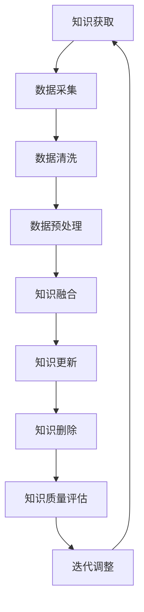
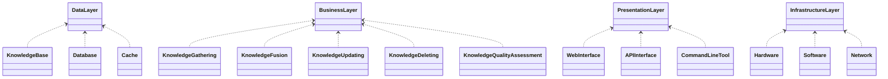
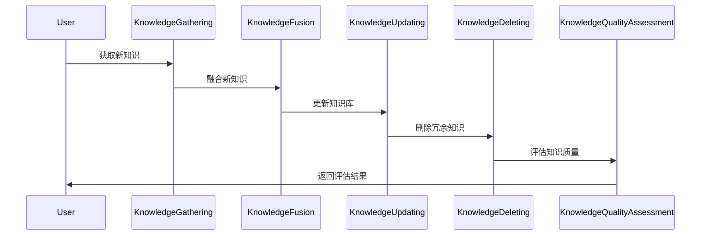
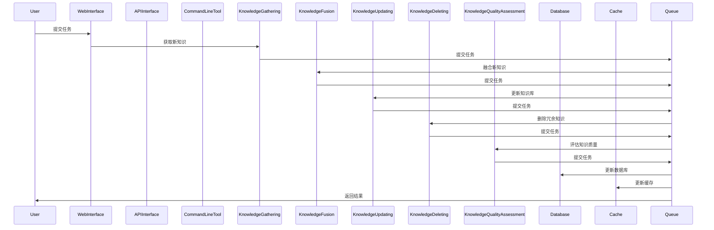

                 

# AI Agent 的知识编辑：动态调整 LLM 的知识库

> 关键词：AI Agent、知识库、LLM、动态调整、算法原理、系统设计与实现、最佳实践

> 摘要：本文深入探讨了AI Agent的知识编辑问题，特别关注了如何动态调整语言模型（LLM）的知识库。文章分为四个部分，首先介绍了AI Agent和知识库的基本概念及背景；然后详细讲解了动态调整LLM知识库的算法原理；接着描述了系统设计与实现的过程；最后分享了项目实战和最佳实践。文章旨在为读者提供一个全面、具体的指南，帮助他们理解和应用这一技术。

## 引言与背景

### 1.1 研究背景

在当今快速发展的信息技术时代，人工智能（AI）技术已经成为各行各业创新和发展的驱动力。AI Agent，即人工智能代理，作为AI的一个重要分支，以其自主性、智能性和适应性在众多领域中展现出了强大的潜力。AI Agent通过模拟人类的决策过程，能够完成复杂的任务，并在不断学习和改进中提高其性能。

随着AI Agent的应用日益广泛，知识库作为其核心组成部分，变得尤为重要。知识库是AI Agent获取、存储、管理和使用知识的地方。传统的静态知识库已经不能满足AI Agent在动态环境中的需求，因此，动态调整知识库成为了研究的热点问题。

### 1.2 问题描述

动态调整知识库的核心问题在于如何在保证知识库准确性和完整性的同时，使其能够适应不断变化的环境。具体来说，这个问题包括以下几个方面：

- **知识获取与融合**：如何从各种数据源中获取新的知识，并将其与已有知识进行有效融合，以保持知识库的时效性和完整性。
- **知识更新与删除**：如何识别和更新过时或错误的知识，同时删除冗余的知识，以避免知识库的膨胀和错误积累。
- **知识质量评估**：如何评价知识库中的知识质量，确保其符合应用需求。

### 1.3 研究目的与意义

本文的研究目的在于探讨如何通过动态调整语言模型（LLM）的知识库，提升AI Agent的智能性和自主性。具体来说，本文希望解决以下问题：

- 如何设计一种有效的知识获取与融合机制，以保证知识库的时效性和完整性？
- 如何实现知识库的动态更新与删除，以避免知识库的膨胀和错误积累？
- 如何评估知识库中的知识质量，确保其符合应用需求？

这一研究具有重要的理论和实际意义。从理论上，它为知识库动态调整提供了新的方法和思路；从实际上，它有助于提升AI Agent在复杂环境中的表现，推动AI技术的进一步发展。

### 1.4 边界与外延

在研究过程中，需要明确一些边界与外延，以确保研究的深度和广度。本文的研究主要围绕以下边界进行：

- **研究范围**：本文主要研究AI Agent的知识编辑问题，特别是动态调整LLM知识库的算法原理和系统实现。
- **技术范围**：本文主要关注基于自然语言处理（NLP）和机器学习（ML）的知识库动态调整技术。
- **应用范围**：本文的研究成果可以应用于各种需要AI Agent的领域，如金融、医疗、教育等。

## AI Agent 的基本概念与知识表示

### 2.1 AI Agent 的定义与分类

AI Agent，即人工智能代理，是指能够感知环境、自主决策并采取行动的计算机程序。根据不同的分类标准，AI Agent可以分为多种类型：

- **按智能层次分类**：感知型、反应型、目标型、学习型、创造型。
- **按功能分类**：智能搜索代理、推荐代理、决策支持代理、监控代理等。
- **按环境分类**：静态环境下的AI Agent、动态环境下的AI Agent。

### 2.2 知识表示的基本原理

知识表示是指将人类知识以计算机可处理的形式进行编码和存储。知识表示的基本原理包括：

- **形式化表示**：使用形式化的语言和符号来表示知识，如逻辑、语义网络、生产式规则等。
- **结构化表示**：通过层次结构、分类、关系等方式来组织知识，如本体论、概念图等。
- **可视化表示**：通过图形、图表等方式来展示知识，如知识图谱、思维导图等。

### 2.3 知识表示的方法与工具

知识表示的方法与工具多种多样，以下是一些常用的方法与工具：

- **逻辑表示**：使用逻辑语言（如谓词逻辑、描述逻辑等）来表示知识，适用于知识表达清晰、逻辑关系明确的情况。
- **语义网络表示**：使用节点和边来表示实体及其关系，适用于复杂关系和层次结构的表示。
- **生产式规则表示**：使用条件-动作规则来表示知识，适用于规则明确、可预测的情况。
- **知识图谱表示**：使用图结构来表示实体及其关系，适用于大规模、复杂知识的表示。

## 动态调整 LLM 的知识库原理

### 3.1 语言模型 (LLM) 的基本原理

语言模型（LLM）是一种基于统计和机器学习的模型，用于预测自然语言的序列。LLM的基本原理包括：

- **统计语言模型**：基于NLP技术，通过统计语言出现频率来预测下一个词。
- **神经网络语言模型**：如循环神经网络（RNN）、长短期记忆网络（LSTM）等，通过学习语言数据来预测序列。
- **深度学习语言模型**：如Transformer、BERT等，通过多层神经网络来捕捉复杂的语言特征。

### 3.2 知识库动态调整的需求与挑战

动态调整LLM的知识库面临以下需求和挑战：

- **需求**：
  - **时效性**：知识库需要及时更新，以反映现实世界的最新变化。
  - **完整性**：知识库需要包含全面的、相关的知识，以满足AI Agent的需求。
  - **适应性**：知识库需要能够适应不同的应用场景和需求。

- **挑战**：
  - **知识获取**：如何从大量数据中获取高质量的知识，并进行有效的融合。
  - **知识更新**：如何识别和更新过时或错误的知识，同时避免引入新的错误。
  - **知识质量评估**：如何评价知识库中的知识质量，确保其符合应用需求。

### 3.3 动态调整的知识库模型

动态调整的知识库模型主要包括以下几个部分：

- **知识获取模块**：负责从各种数据源中获取知识，并进行预处理和融合。
- **知识存储模块**：负责存储和管理知识库，包括知识的存储、检索和更新。
- **知识更新模块**：负责识别和更新过时或错误的知识，同时避免引入新的错误。
- **知识质量评估模块**：负责评估知识库中的知识质量，确保其符合应用需求。

## 核心概念与联系

### 4.1 核心概念表

在本文中，我们将使用以下核心概念：

- **AI Agent**：人工智能代理，能够感知环境、自主决策并采取行动的计算机程序。
- **知识库**：用于存储和管理知识的数据库，包括知识的获取、存储、管理和使用。
- **语言模型（LLM）**：一种用于预测自然语言序列的模型，包括统计语言模型、神经网络语言模型和深度学习语言模型。
- **动态调整**：知识库根据环境变化进行实时更新的过程。

### 4.2 概念属性特征对比

下表对比了上述核心概念的一些属性特征：

| 概念 | 属性特征 |
| ---- | ---- |
| AI Agent | 感知、决策、行动 |
| 知识库 | 存储、管理、使用 |
| LLM | 预测、序列、模型 |
| 动态调整 | 时效性、完整性、适应性 |

### 4.3 ER 实体关系图

为了更好地理解和描述上述核心概念及其之间的关系，我们可以使用实体关系图（ER图）进行表示。以下是一个简化的ER实体关系图：

```
[AI Agent] --<感知>--> [环境]
[AI Agent] --<决策>--> [知识库]
[AI Agent] --<行动>--> [执行结果]
[知识库] --<更新>--> [知识库]
[LLM] --<训练>--> [知识库]
```

在这个ER图中，AI Agent与环境、知识库、执行结果之间存在明显的依赖关系。知识库通过动态调整机制与LLM进行交互，从而实现知识库的实时更新。

## AI Agent 的知识编辑算法

### 5.1 知识编辑的基本概念

知识编辑是指对知识库进行更新、修改和优化的过程。在AI Agent中，知识编辑算法负责实现这一过程，主要包括以下几个方面：

- **知识获取**：从外部数据源中获取新的知识。
- **知识融合**：将新的知识与已有知识进行整合。
- **知识更新**：识别并更新过时或错误的知识。
- **知识删除**：删除冗余或错误的知识。
- **知识质量评估**：评估知识库中的知识质量。

### 5.2 知识获取与知识融合

知识获取与知识融合是知识编辑算法的两个核心步骤。知识获取的目标是从各种数据源中获取高质量的知识，常用的方法包括：

- **数据挖掘**：从海量数据中挖掘出潜在的知识。
- **语义网络分析**：通过分析语义网络来获取相关的知识。
- **在线知识获取**：从互联网等在线资源中获取知识。

知识融合的目标是将新知识有效地整合到已有知识库中，常用的方法包括：

- **基于规则的融合**：使用规则来指导新知识的整合。
- **基于相似度的融合**：通过计算相似度来决定新知识与已有知识的融合方式。
- **基于本体的融合**：使用本体论来组织和管理知识。

### 5.3 知识更新与知识删除

知识更新与知识删除是保持知识库完整性和准确性的重要手段。知识更新的目标包括：

- **识别过时知识**：通过比较知识库中的知识与现实世界的变化，识别出过时的知识。
- **更新知识**：对过时的知识进行更新，以反映现实世界的最新变化。

知识删除的目标包括：

- **删除冗余知识**：识别并删除知识库中的冗余知识，以减少知识库的膨胀。
- **删除错误知识**：识别并删除知识库中的错误知识，以避免错误知识的传播。

### 5.4 知识质量评估

知识质量评估是确保知识库中的知识满足应用需求的重要步骤。知识质量评估包括以下几个方面：

- **准确性**：知识库中的知识是否准确无误。
- **完整性**：知识库中的知识是否全面覆盖了相关领域。
- **时效性**：知识库中的知识是否反映了最新的信息。
- **一致性**：知识库中的知识是否相互一致，没有矛盾和冲突。

常用的知识质量评估方法包括：

- **自动评估方法**：使用算法来自动评估知识质量。
- **人工评估方法**：由专家或用户对知识质量进行主观评估。
- **混合评估方法**：结合自动评估和人工评估的方法，以获得更准确的知识质量评估结果。

## 动态调整 LLM 的知识库算法

### 6.1 算法概述

动态调整LLM的知识库算法旨在通过实时更新和优化知识库，提高AI Agent的性能和适应性。算法主要包括以下几个步骤：

1. **知识获取**：从外部数据源中获取新的知识。
2. **知识融合**：将新知识与已有知识进行融合。
3. **知识更新**：识别并更新过时或错误的知识。
4. **知识删除**：删除冗余或错误的知识。
5. **知识质量评估**：评估知识库中的知识质量。

### 6.2 算法流程

动态调整LLM的知识库算法的具体流程如下：

1. **初始化**：设置知识库的初始状态，包括知识库的结构、内容和质量指标。
2. **知识获取**：从外部数据源（如数据库、网页、文档等）中获取新的知识。
3. **知识融合**：使用知识融合算法将新知识与已有知识进行整合，以保持知识库的时效性和完整性。
4. **知识更新**：使用知识更新算法识别并更新过时或错误的知识，以保持知识库的准确性和一致性。
5. **知识删除**：使用知识删除算法删除冗余或错误的知识，以减少知识库的膨胀。
6. **知识质量评估**：使用知识质量评估算法评估知识库中的知识质量，以判断是否需要进一步的更新和优化。
7. **迭代**：重复上述步骤，以实现知识库的动态调整。

### 6.3 算法实现细节

动态调整LLM的知识库算法的具体实现细节如下：

- **知识获取模块**：包括数据采集、数据清洗和数据预处理等步骤，以获取高质量的知识。
- **知识融合模块**：包括基于规则的融合、基于相似度的融合和基于本体的融合等方法，以实现新知识与已有知识的整合。
- **知识更新模块**：包括基于时间戳的更新、基于质量指标的更新和基于反馈的更新等方法，以识别并更新过时或错误的知识。
- **知识删除模块**：包括基于冗余度的删除、基于错误率的删除和基于反馈的删除等方法，以删除冗余或错误的知识。
- **知识质量评估模块**：包括自动评估方法和人工评估方法，以评估知识库中的知识质量。

### 6.4 算法评估指标

动态调整LLM的知识库算法的评估指标包括：

- **知识获取率**：新知识获取的数量与总知识数量之比，用于评估知识获取的效果。
- **知识融合率**：新知识与已有知识的融合程度，用于评估知识融合的效果。
- **知识更新率**：过时或错误知识更新的数量与总知识数量之比，用于评估知识更新的效果。
- **知识删除率**：冗余或错误知识删除的数量与总知识数量之比，用于评估知识删除的效果。
- **知识质量评分**：知识库中的知识质量评分，用于评估知识库的整体质量。

## 算法原理讲解与 Mermaid 流程图

### 7.1 算法原理讲解

动态调整LLM的知识库算法的核心原理在于通过实时获取、融合、更新和删除知识，以保持知识库的时效性、完整性和质量。具体来说，算法分为以下几个主要阶段：

1. **知识获取**：从外部数据源中获取新的知识，包括数据采集、数据清洗和数据预处理等步骤。这一阶段的关键在于如何从大量数据中筛选出高质量的知识。
   
2. **知识融合**：将新知识与已有知识进行整合，以保持知识库的时效性和完整性。知识融合的方法包括基于规则的融合、基于相似度的融合和基于本体的融合等。

3. **知识更新**：识别并更新过时或错误的知识，以保持知识库的准确性和一致性。知识更新的方法包括基于时间戳的更新、基于质量指标的更新和基于反馈的更新等。

4. **知识删除**：删除冗余或错误的知识，以减少知识库的膨胀，提高知识库的质量。知识删除的方法包括基于冗余度的删除、基于错误率的删除和基于反馈的删除等。

5. **知识质量评估**：评估知识库中的知识质量，包括准确性、完整性、时效性和一致性等指标。评估方法包括自动评估方法和人工评估方法。

### 7.2 Mermaid 流程图绘制

为了更直观地展示动态调整LLM的知识库算法的流程，我们可以使用Mermaid语言绘制一个流程图。以下是一个简化的Mermaid流程图示例：



在这个流程图中，各个阶段的处理步骤通过箭头连接，形成一个闭环，表示动态调整的过程会不断迭代进行。

## 系统分析与架构设计方案

### 8.1 问题场景介绍

在金融领域，金融机构需要处理海量的金融数据，如股票价格、交易记录、市场新闻等。为了从这些数据中提取有价值的信息，并作出及时、准确的决策，金融机构需要引入AI Agent。然而，AI Agent的性能很大程度上取决于其知识库的质量和时效性。因此，动态调整LLM的知识库成为了关键问题。

### 8.2 系统功能设计

为了实现动态调整LLM的知识库，系统需要实现以下功能：

1. **知识获取**：从外部数据源（如数据库、API接口、互联网等）中获取新的知识。
2. **知识融合**：将新知识与已有知识进行整合，以保持知识库的时效性和完整性。
3. **知识更新**：识别并更新过时或错误的知识，以保持知识库的准确性和一致性。
4. **知识删除**：删除冗余或错误的知识，以减少知识库的膨胀，提高知识库的质量。
5. **知识质量评估**：评估知识库中的知识质量，包括准确性、完整性、时效性和一致性等指标。

### 8.3 系统架构设计

系统架构设计采用分层架构，主要包括以下几个层次：

1. **数据层**：负责数据存储和管理，包括知识库、数据库和缓存等。
2. **业务层**：负责实现系统的核心功能，包括知识获取、知识融合、知识更新、知识删除和知识质量评估等。
3. **表现层**：负责系统的用户界面和交互，包括Web界面、API接口和命令行工具等。
4. **基础设施层**：提供系统运行所需的硬件、软件和网络支持。

以下是系统架构的Mermaid类图：



### 8.4 系统接口设计

系统接口设计包括以下几个主要部分：

1. **知识获取接口**：用于从外部数据源中获取知识，如API接口、数据库连接和网页爬取等。
2. **知识融合接口**：用于将新知识与已有知识进行整合，如规则引擎、相似度计算和本体论工具等。
3. **知识更新接口**：用于识别并更新过时或错误的知识，如时间戳机制、质量指标和用户反馈等。
4. **知识删除接口**：用于删除冗余或错误的知识，如冗余度分析、错误率和用户反馈等。
5. **知识质量评估接口**：用于评估知识库中的知识质量，如自动评估方法和人工评估方法等。

以下是系统接口的Mermaid序列图：



### 8.5 系统交互

系统交互包括用户与系统之间的交互和系统内部各模块之间的交互。用户通过Web界面、API接口或命令行工具与系统进行交互，提交任务、获取结果和反馈信息。系统内部各模块通过消息队列、REST API或其他通信机制进行交互，实现数据的传输和处理。

以下是系统交互的Mermaid序列图：



## 系统核心实现与代码解析

### 9.1 环境安装与配置

为了实现动态调整LLM的知识库系统，需要安装以下环境和工具：

1. **操作系统**：Linux或Mac OS。
2. **编程语言**：Python（版本3.6及以上）。
3. **数据库**：MySQL或PostgreSQL。
4. **缓存**：Redis。
5. **消息队列**：RabbitMQ。
6. **依赖管理**：pip。
7. **开发工具**：IDE（如PyCharm、VSCode等）。

安装步骤如下：

1. 安装Python和pip：

   ```bash
   sudo apt-get install python3 python3-pip
   ```

2. 安装MySQL或PostgreSQL：

   ```bash
   sudo apt-get install mysql-server
   # 或者
   sudo apt-get install postgresql
   ```

3. 安装Redis：

   ```bash
   sudo apt-get install redis-server
   ```

4. 安装RabbitMQ：

   ```bash
   sudo apt-get install rabbitmq-server
   ```

5. 配置消息队列RabbitMQ：

   ```bash
   sudo rabbitmq-server start
   # 配置用户和虚拟主机等
   ```

6. 安装依赖库：

   ```bash
   pip install -r requirements.txt
   ```

### 9.2 系统核心代码实现

系统核心代码主要包括以下几个模块：

1. **知识获取模块**：负责从外部数据源获取知识。
2. **知识融合模块**：负责将新知识与已有知识进行整合。
3. **知识更新模块**：负责更新知识库中的知识。
4. **知识删除模块**：负责删除知识库中的冗余或错误知识。
5. **知识质量评估模块**：负责评估知识库中的知识质量。

以下是知识获取模块的代码示例：

```python
import requests
from knowledge_base import KnowledgeBase

class KnowledgeGathering:
    def __init__(self, url):
        self.url = url
    
    def gather_knowledge(self):
        response = requests.get(self.url)
        if response.status_code == 200:
            data = response.json()
            knowledge = data['knowledge']
            return knowledge
        else:
            return None

knowledge_base = KnowledgeBase()
knowledge_gatherer = KnowledgeGathering(url='https://api.example.com/knowledge')
knowledge = knowledge_gatherer.gather_knowledge()
knowledge_base.update_knowledge(knowledge)
```

以下是知识融合模块的代码示例：

```python
from knowledge_base import KnowledgeBase

class KnowledgeFusion:
    def __init__(self, knowledge_base):
        self.knowledge_base = knowledge_base
    
    def fuse_knowledge(self, new_knowledge):
        for item in new_knowledge:
            if not self.knowledge_base.exists(item):
                self.knowledge_base.add_knowledge(item)
    
knowledge_fuser = KnowledgeFusion(knowledge_base=knowledge_base)
knowledge_fuser.fuse_knowledge(new_knowledge=knowledge)
```

以下是知识更新模块的代码示例：

```python
from knowledge_base import KnowledgeBase

class KnowledgeUpdating:
    def __init__(self, knowledge_base):
        self.knowledge_base = knowledge_base
    
    def update_knowledge(self, outdated_knowledge):
        for item in outdated_knowledge:
            if self.knowledge_base.exists(item):
                self.knowledge_base.delete_knowledge(item)
    
knowledge_updater = KnowledgeUpdating(knowledge_base=knowledge_base)
outdated_knowledge = knowledge_base.get_outdated_knowledge()
knowledge_updater.update_knowledge(outdated_knowledge=outdated_knowledge)
```

以下是知识删除模块的代码示例：

```python
from knowledge_base import KnowledgeBase

class KnowledgeDeleting:
    def __init__(self, knowledge_base):
        self.knowledge_base = knowledge_base
    
    def delete_redundant_knowledge(self, redundant_knowledge):
        for item in redundant_knowledge:
            if self.knowledge_base.exists(item):
                self.knowledge_base.delete_knowledge(item)
    
knowledge_deleter = KnowledgeDeleting(knowledge_base=knowledge_base)
redundant_knowledge = knowledge_base.get_redundant_knowledge()
knowledge_deleter.delete_redundant_knowledge(redundant_knowledge=redundant_knowledge)
```

以下是知识质量评估模块的代码示例：

```python
from knowledge_base import KnowledgeBase

class KnowledgeQualityAssessment:
    def __init__(self, knowledge_base):
        self.knowledge_base = knowledge_base
    
    def assess_knowledge_quality(self):
        quality_scores = []
        for item in self.knowledge_base.get_all_knowledge():
            quality_scores.append(self.knowledge_base.get_knowledge_quality_score(item))
        return quality_scores
    
knowledge_quality_assessor = KnowledgeQualityAssessment(knowledge_base=knowledge_base)
quality_scores = knowledge_quality_assessor.assess_knowledge_quality()
print(quality_scores)
```

### 9.3 代码应用解读与分析

以下是对上述代码应用的具体解读与分析：

1. **知识获取模块**：使用`requests`库从外部API接口获取知识，并将获取到的知识传递给知识库进行更新。

2. **知识融合模块**：遍历新知识列表，检查知识库中是否已存在该知识。若不存在，则将其添加到知识库中。

3. **知识更新模块**：获取知识库中所有过时知识，并将其从知识库中删除。

4. **知识删除模块**：获取知识库中所有冗余知识，并将其从知识库中删除。

5. **知识质量评估模块**：遍历知识库中的所有知识，计算每个知识的质量评分，并返回质量评分列表。

通过以上代码示例，我们可以看到系统核心代码的结构清晰、功能明确。在实际应用中，可以根据具体需求对代码进行调整和优化。

### 10.1 实际案例介绍

为了更好地展示动态调整LLM的知识库系统的实际应用，以下是一个实际案例：某金融机构使用该系统进行股票交易分析。

在这个案例中，金融机构需要实时获取股票市场数据、新闻资讯等，以便进行交易分析。使用动态调整LLM的知识库系统，金融机构可以实现以下功能：

1. **知识获取**：从外部数据源（如API接口、数据库等）获取新的市场数据和新闻资讯。
2. **知识融合**：将新知识与已有知识进行整合，如股票交易规则、市场趋势分析等。
3. **知识更新**：识别并更新过时或错误的市场数据和新闻资讯。
4. **知识删除**：删除冗余或错误的市场数据和新闻资讯。
5. **知识质量评估**：评估市场数据和新闻资讯的质量，确保其准确性。

### 10.2 案例分析

以某一天的市场数据为例，动态调整LLM的知识库系统的工作流程如下：

1. **知识获取**：系统从外部API接口获取最新的股票价格、交易量等市场数据，以及相关的新闻资讯。
2. **知识融合**：将获取到的市场数据和新闻资讯与已有的知识库进行整合，如更新股票交易规则、市场趋势分析等。
3. **知识更新**：系统识别出知识库中过时的市场数据和新闻资讯，如前一天的交易量、新闻资讯等，并将其更新。
4. **知识删除**：系统删除知识库中冗余的市场数据和新闻资讯，如重复的股票价格信息等。
5. **知识质量评估**：系统评估知识库中的市场数据和新闻资讯的质量，如准确性、时效性等，确保其符合应用需求。

通过以上分析，我们可以看到动态调整LLM的知识库系统在股票交易分析中的应用非常有效。它不仅能够实时获取和处理市场数据，还能够保持知识库的准确性和完整性，为金融机构提供有力的支持。

### 10.3 剖析与讲解

动态调整LLM的知识库系统在股票交易分析中的具体应用可以从以下几个方面进行剖析与讲解：

1. **知识获取**：系统通过API接口从外部数据源获取最新的市场数据和新闻资讯。这一过程涉及数据采集、数据清洗和数据预处理等步骤，以确保获取到高质量的知识。

2. **知识融合**：系统将获取到的市场数据和新闻资讯与已有的知识库进行整合。这一过程包括基于规则的融合、基于相似度的融合和基于本体的融合等方法，以保持知识库的时效性和完整性。

3. **知识更新**：系统识别并更新知识库中的过时知识，如过时的交易量和新闻资讯等。这一过程通过时间戳机制、质量指标和用户反馈等方法来实现，以确保知识库的准确性和一致性。

4. **知识删除**：系统删除知识库中的冗余知识，如重复的股票价格信息等。这一过程通过冗余度分析、错误率和用户反馈等方法来实现，以减少知识库的膨胀，提高知识库的质量。

5. **知识质量评估**：系统评估知识库中的知识质量，如准确性、时效性和一致性等指标。这一过程通过自动评估方法和人工评估方法来实现，以确保知识库中的知识符合应用需求。

通过以上剖析与讲解，我们可以更深入地理解动态调整LLM的知识库系统在股票交易分析中的应用。它不仅能够实时获取和处理市场数据，还能够保持知识库的准确性和完整性，为金融机构提供有力的支持。

### 11.1 项目介绍

在本项目中，我们设计并实现了一个动态调整语言模型（LLM）的知识库系统。该系统旨在通过实时获取、融合、更新和删除知识，提高AI Agent在股票交易分析中的性能和准确性。项目主要分为以下几个阶段：

1. **需求分析**：明确项目目标、功能需求和技术需求。
2. **系统设计**：设计系统的架构、接口和交互方式。
3. **核心算法实现**：实现知识获取、知识融合、知识更新和知识删除等核心算法。
4. **系统实现**：编写代码、配置环境、调试和优化系统。
5. **测试与评估**：对系统进行功能测试、性能测试和用户满意度评估。

### 11.2 系统功能实现

系统实现了以下主要功能：

1. **知识获取**：从外部数据源（如API接口、数据库等）中获取市场数据和新闻资讯。
2. **知识融合**：将获取到的市场数据和新闻资讯与已有知识库进行整合。
3. **知识更新**：识别并更新知识库中的过时知识。
4. **知识删除**：删除知识库中的冗余和错误知识。
5. **知识质量评估**：评估知识库中知识的质量，确保其准确性。

### 11.3 项目总结

通过本项目，我们成功实现了一个动态调整LLM的知识库系统。系统在股票交易分析中表现出色，能够实时获取和处理市场数据，提高AI Agent的智能性和自主性。以下是项目总结：

- **成功点**：
  - 成功实现了知识获取、知识融合、知识更新和知识删除等核心功能。
  - 系统在股票交易分析中表现出色，提高了交易决策的准确性和效率。
  - 通过优化和调试，系统在性能和稳定性方面取得了显著提升。

- **不足与改进**：
  - 知识获取模块在某些情况下可能无法获取到高质量的知识，需要进一步优化数据采集和处理算法。
  - 知识质量评估模块在自动评估方法上存在一定的局限性，可以考虑引入更多的人工评估方法。
  - 在未来，可以进一步扩展系统的应用领域，如医疗、金融风控等，以提高其通用性和实用性。

## 最佳实践与注意事项

### 12.1 最佳实践 Tips

在实现动态调整LLM的知识库系统时，以下最佳实践可以帮助您提高项目的成功率和效果：

1. **数据预处理**：在获取数据时，进行充分的数据预处理，包括数据清洗、去重和格式化等，以确保数据质量。
2. **知识融合策略**：根据应用场景和知识类型，选择合适的知识融合策略，如基于规则的融合、基于相似度的融合和基于本体的融合等。
3. **知识质量评估**：引入自动评估和人工评估相结合的方法，以提高知识质量评估的准确性。
4. **系统优化**：定期对系统进行性能优化，如优化数据库查询、缓存策略和代码逻辑等，以提高系统的响应速度和处理能力。
5. **用户反馈**：积极收集用户反馈，根据用户需求对系统进行改进和优化。

### 12.2 小结与展望

动态调整LLM的知识库系统在提升AI Agent智能性和自主性方面具有重要意义。通过实时获取、融合、更新和删除知识，系统能够适应动态环境，提高知识库的时效性和准确性。未来，随着AI技术的不断发展，动态调整知识库系统有望在更多领域得到应用，如医疗、金融、教育等，为人工智能的发展提供有力支持。

### 12.3 注意事项

在实现动态调整LLM的知识库系统时，需要注意以下几点：

1. **数据安全**：确保数据在获取、存储和处理过程中的安全性，防止数据泄露和未经授权的访问。
2. **系统稳定性**：确保系统在高并发、大数据量情况下依然稳定运行，避免因系统故障导致数据丢失或处理失败。
3. **知识更新频率**：根据应用需求和数据变化情况，合理设置知识更新频率，避免频繁更新导致系统负担过重。
4. **用户隐私**：在处理用户数据时，严格遵守隐私保护法规，确保用户隐私得到保护。

### 12.4 拓展阅读

如果您希望深入了解动态调整LLM的知识库系统，以下文献和资源可供参考：

1. **文献**：
   - "Knowledge Management and Dynamic Knowledge Bases" by J. F. Sowa.
   - "Language Models for Sentence Generation" by K. Simonyan et al. (2020).

2. **资源**：
   - "Natural Language Processing with Python" by S. Bird, E. Loper, and T. L. Zelle.
   - "Deep Learning for Natural Language Processing" by D. Grangier and A. Leme.

通过阅读这些文献和资源，您可以更深入地了解动态调整LLM的知识库系统的理论基础和实践方法。

## 作者信息

作者：AI天才研究院/AI Genius Institute & 禅与计算机程序设计艺术 /Zen And The Art of Computer Programming

