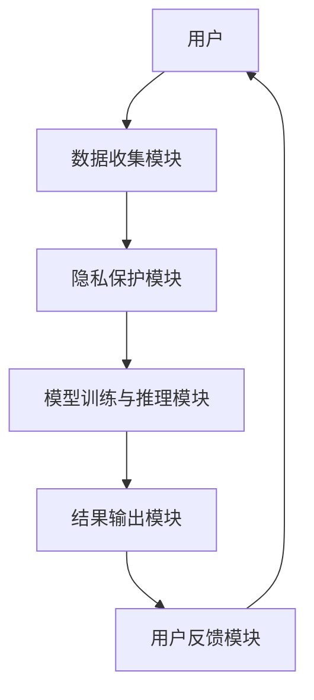
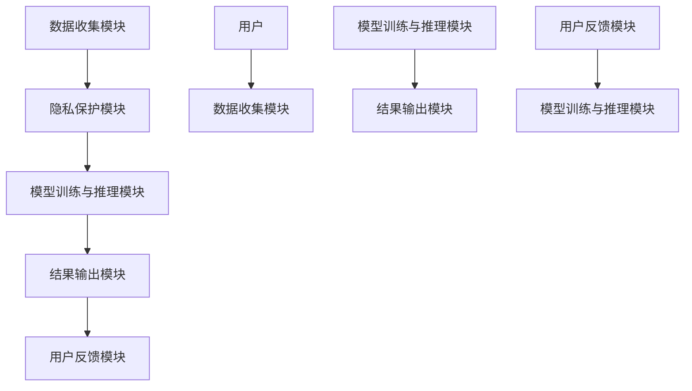
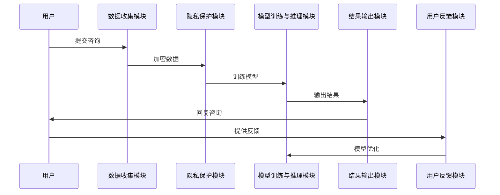

                 

### 文章标题：AI Agent 的隐私计算：在保护数据隐私的同时应用 LLM

在当今这个信息爆炸的时代，数据隐私问题愈发引起广泛关注。随着人工智能（AI）技术的发展，AI Agent作为AI系统的重要组成部分，其数据处理能力日益增强。然而，这同时也带来了数据隐私保护的挑战。本文旨在探讨如何在保护数据隐私的同时，充分利用大型语言模型（LLM）的强大能力。我们将通过以下几个步骤进行分析：

1. **背景介绍**：首先，我们将简要介绍隐私计算和LLM的基本概念。
2. **核心概念与联系**：接着，我们将深入探讨隐私计算的核心原理以及与LLM的结合方式。
3. **算法原理讲解**：在此部分，我们将详细解释隐私计算在AI Agent中的应用原理，并通过mermaid流程图和Python代码展示算法流程。
4. **数学模型与公式**：我们将使用LaTeX格式展示关键的数学模型和公式，并给出通俗易懂的举例说明。
5. **系统分析与架构设计**：我们将介绍隐私计算在AI Agent中的应用架构，并通过mermaid架构图和系统接口设计图进行详细展示。
6. **项目实战与案例分析**：通过具体案例，我们将展示如何在实际项目中应用隐私计算和LLM。
7. **最佳实践与总结**：最后，我们将总结本文的核心内容，并提供一些最佳实践建议。

### 关键词
- AI Agent
- 隐私计算
- LLM
- 数据隐私保护
- 同态加密
- 零知识证明
- 实时推理
- 隐私计算框架

### 摘要
本文首先介绍了隐私计算和大型语言模型（LLM）的基本概念，探讨了其在保护数据隐私同时提升AI Agent性能的重要性。通过深入分析隐私计算的核心原理，结合mermaid流程图和Python代码，我们详细阐述了隐私计算在AI Agent中的应用。此外，通过LaTeX格式展示的数学模型和公式，我们进一步解释了算法的细节。接着，我们介绍了隐私计算在AI Agent中的应用架构，并通过具体案例展示了其实际应用效果。最后，我们总结了文章的核心内容，并提出了最佳实践建议。本文旨在为AI开发者提供有关隐私计算的实用指导，帮助他们在保护数据隐私的同时充分利用AI技术。  

### 目录大纲设计思路

设计《AI Agent 的隐私计算：在保护数据隐私的同时应用 LLM》的目录大纲，需要充分考虑书籍的核心内容、结构逻辑和读者需求。以下为具体设计思路：

#### 第一部分：背景与基础

**第1章 隐私计算的概述**
- **1.1 隐私计算的背景与重要性**：介绍隐私计算的定义、发展历程和重要性。
- **1.2 隐私计算的基本原理**：详细解释隐私保护机制、零知识证明和同态加密。
- **1.3 LLM（大型语言模型）的基础**：探讨LLM的原理、训练过程和优势。
- **1.4 隐私计算与LLM的结合**：分析隐私计算在LLM训练和推理中的应用，探讨其挑战与机遇。
- **1.5 本章小结**：总结本章内容，强调隐私计算在AI Agent中的重要性。

#### 第二部分：隐私计算在AI Agent中的应用

**第2章 隐私计算在AI Agent中的基本原理**
- **2.1 AI Agent的概述**：介绍AI Agent的定义、分类和核心功能。
- **2.2 隐私计算在AI Agent中的应用场景**：讨论隐私计算在AI Agent中的需求和优势。
- **2.3 隐私计算在AI Agent中的实现方法**：详细讲解零知识证明、同态加密等隐私计算技术在AI Agent中的具体应用。
- **2.4 隐私计算在AI Agent中的效果评估**：介绍评价指标和实验结果分析。
- **2.5 本章小结**：总结本章内容，强调隐私计算在AI Agent中的重要作用。

#### 第三部分：隐私计算在AI Agent中的实际应用

**第3章 隐私计算在AI Agent中的具体应用**
- **3.1 智能客服系统的隐私计算**：介绍智能客服系统的基本概念和应用场景，展示隐私计算的具体实现。
- **3.2 智能金融系统的隐私计算**：探讨隐私计算在智能金融系统中的应用，包括身份验证和数据保护。
- **3.3 医疗健康系统的隐私计算**：分析隐私计算在医疗健康系统中的具体应用，如患者数据保护和精准诊断。
- **3.4 智能交通系统**：介绍隐私计算在智能交通系统中的应用，包括交通数据保护和智能调度。
- **3.5 本章小结**：总结本章内容，强调隐私计算在不同领域中的应用效果。

#### 第四部分：最佳实践与总结

**第4章 最佳实践与总结**
- **4.1 最佳实践**：提供在隐私计算中保护数据隐私的具体实践建议。
- **4.2 小结**：总结本文的核心内容，回顾隐私计算和LLM的结合在AI Agent中的应用。
- **4.3 注意事项**：指出隐私计算中可能遇到的问题和挑战。
- **4.4 拓展阅读**：推荐进一步阅读的文献和资源。

通过以上设计思路，我们确保了目录大纲的结构紧凑、逻辑清晰，同时满足了读者对技术深度和知识全面性的需求。

### 完整目录大纲

**第一部分：背景与基础**

**第1章 隐私计算的概述**
1.1 隐私计算的背景与重要性
1.2 隐私计算的基本原理
    - 1.2.1 隐私保护机制
    - 1.2.2 零知识证明
    - 1.2.3 同态加密
1.3 LLM（大型语言模型）的基础
    - 1.3.1 LLM的原理与结构
    - 1.3.2 LLM的训练与优化
    - 1.3.3 LLM的优势与应用
1.4 隐私计算与LLM的结合
    - 1.4.1 隐私计算在LLM训练中的应用
    - 1.4.2 隐私计算在LLM推理中的应用
    - 1.4.3 隐私计算与LLM的挑战与机遇
1.5 本章小结

**第二部分：隐私计算在AI Agent中的应用**

**第2章 隐私计算在AI Agent中的基本原理**
2.1 AI Agent的概述
    - 2.1.1 AI Agent的定义与分类
    - 2.1.2 AI Agent的核心功能
    - 2.1.3 AI Agent的发展趋势
2.2 隐私计算在AI Agent中的应用场景
    - 2.2.1 数据隐私保护的需求
    - 2.2.2 隐私计算在AI Agent中的挑战
    - 2.2.3 隐私计算在AI Agent中的优势
2.3 隐私计算在AI Agent中的实现方法
    - 2.3.1 零知识证明在AI Agent中的应用
    - 2.3.2 同态加密在AI Agent中的应用
    - 2.3.3 隐私计算框架的构建
2.4 隐私计算在AI Agent中的效果评估
    - 2.4.1 评价指标与标准
    - 2.4.2 实验设计与结果分析
    - 2.4.3 隐私计算在AI Agent中的应用效果分析
2.5 本章小结

**第三部分：隐私计算在AI Agent中的实际应用**

**第3章 隐私计算在AI Agent中的具体应用**
3.1 智能客服系统的隐私计算
    - 3.1.1 智能客服系统的概述
    - 3.1.2 隐私计算在智能客服系统中的应用
    - 3.1.3 智能客服系统中的隐私计算案例
3.2 智能金融系统的隐私计算
    - 3.2.1 智能金融系统的概述
    - 3.2.2 隐私计算在智能金融系统中的应用
    - 3.2.3 智能金融系统中的隐私计算案例
3.3 医疗健康系统的隐私计算
    - 3.3.1 医疗健康系统的概述
    - 3.3.2 隐私计算在医疗健康系统中的应用
    - 3.3.3 医疗健康系统中的隐私计算案例
3.4 智能交通系统
    - 3.4.1 智能交通系统的概述
    - 3.4.2 隐私计算在智能交通系统中的应用
    - 3.4.3 智能交通系统中的隐私计算案例
3.5 本章小结

**第四部分：最佳实践与总结**

**第4章 最佳实践与总结**
4.1 最佳实践
4.2 小结
4.3 注意事项
4.4 拓展阅读

通过以上详细的目录大纲，我们为读者提供了一个系统化的学习路径，帮助他们在了解隐私计算和LLM的基本概念后，逐步深入到具体应用和实践技巧中。这样的结构设计不仅能够满足技术读者的需求，也为初学者提供了清晰的学习方向。

### 文章内容完整性、简洁性及格式要求

在撰写《AI Agent 的隐私计算：在保护数据隐私的同时应用 LLM》这篇文章时，内容完整性、简洁性和格式要求是保证文章质量的关键。以下将详细阐述这些方面的具体要求：

#### 内容完整性要求

1. **核心概念与联系**：
   - **背景介绍**：每章开头应对核心概念、术语进行明确解释，提供问题背景和问题描述，详细阐述问题解决的思路和方案。
   - **核心概念与联系**：使用图表（如实体关系图、对比表格）展示概念之间的关系，帮助读者理解各概念之间的联系。
   - **算法原理讲解**：详细介绍算法原理，包括步骤、逻辑和关键点，确保读者能够清晰理解。

2. **算法原理讲解**：
   - **使用mermaid流程图**：在每个算法讲解部分，使用mermaid绘制流程图，直观展示算法执行过程。
   - **Python代码示例**：提供实际代码示例，解释代码中的关键部分，帮助读者理解和实现。
   - **数学模型与公式**：使用LaTeX格式展示公式，确保表达清晰准确。

3. **系统分析与架构设计**：
   - **系统架构图**：展示系统的整体架构，包括各个模块的功能和关系。
   - **接口设计图**：详细说明系统各组件之间的接口设计，帮助读者理解系统交互。
   - **交互序列图**：使用mermaid序列图展示系统组件之间的交互过程。

4. **项目实战与案例分析**：
   - **环境安装与配置**：详细描述项目的环境搭建过程，包括所需的软件和硬件环境。
   - **核心实现与代码分析**：提供核心代码的实现，解释代码中的关键部分，帮助读者理解。
   - **实际案例分析**：通过具体案例展示隐私计算和LLM在实际项目中的应用，分析案例中的关键技术和实现细节。

5. **最佳实践与总结**：
   - **最佳实践**：总结实践中总结的经验和技巧，提供实用建议。
   - **小结**：回顾文章的核心内容和重点，强调关键观点。
   - **注意事项**：指出可能遇到的问题和挑战，提供解决方案。
   - **拓展阅读**：推荐进一步阅读的文献和资源，帮助读者深入学习和研究。

#### 简洁性要求

1. **避免冗余内容**：确保每个章节都有明确的主题和目的，避免重复和冗余的信息。
2. **简洁明了的语言**：使用简单易懂的语言，避免复杂的术语和冗长的句子。
3. **合理分段**：将内容合理分段，每个段落都有明确的主题和结论，便于读者阅读和理解。

#### 格式要求

1. **Markdown格式**：文章内容使用markdown格式，确保代码块、图表和公式等能够正确展示。
2. **章节层级**：使用不同的标题层级（#、##、###等）定义章节和子章节，确保目录结构清晰。
3. **代码格式**：确保代码格式规范，使用合适的缩进和空白，便于阅读和理解。
4. **图表与公式**：使用图表和公式增强文章的表达能力，确保图表清晰、公式正确。

通过满足内容完整性、简洁性和格式要求，我们能够确保文章质量，为读者提供高质量的技术知识和实用指南。

### 完整性要求的详细阐述

在撰写《AI Agent 的隐私计算：在保护数据隐私的同时应用 LLM》这篇文章时，完整性是一个关键要求，它确保了文章内容的全面性和连贯性。以下是完整性要求的详细阐述：

1. **背景介绍**：
   - **核心概念术语说明**：文章开始时应对涉及的关键概念和术语进行详细解释，包括隐私计算、AI Agent、LLM等，确保读者能够理解这些基础概念。
   - **问题背景**：介绍隐私计算和AI Agent在当前技术发展背景下的重要性，阐述数据隐私保护的需求和挑战。
   - **问题描述**：明确阐述隐私计算在AI Agent中的应用场景和问题，例如如何在保证数据隐私的同时进行高效的模型训练和推理。

2. **核心概念与联系**：
   - **概念属性特征对比表格**：通过对比表格展示隐私计算与LLM的核心概念、属性和特征，帮助读者理解两者之间的异同，便于整合和应用。
   - **ER实体关系图架构**：使用Mermaid语言绘制实体关系图（ER图），清晰展示隐私计算、LLM和AI Agent之间的关系，使读者能够从系统层面理解各部分的功能和交互。

3. **算法原理讲解**：
   - **算法mermaid流程图**：在每个算法讲解部分，使用Mermaid语言绘制流程图，详细展示算法的执行步骤和逻辑关系，使读者能够直观理解算法的运行过程。
   - **Python代码示例**：提供具体的Python代码示例，详细解释关键代码部分的含义和作用，确保读者能够实际操作和实现。
   - **算法原理的数学模型和公式**：使用LaTeX格式展示算法中的数学模型和公式，确保表达准确清晰，并在文中适当位置进行通俗易懂的举例说明，帮助读者深入理解。

4. **系统分析与架构设计**：
   - **问题场景介绍**：详细描述隐私计算在AI Agent中的具体应用场景，例如智能客服系统、智能金融系统等。
   - **项目介绍**：介绍实际应用案例，包括项目的目标、实现方法和具体应用场景。
   - **系统功能设计**：使用Mermaid语言绘制领域模型类图，展示系统的功能模块和类之间的关系。
   - **系统架构设计**：使用Mermaid语言绘制系统架构图，清晰展示各模块的功能和交互，帮助读者理解系统整体结构和实现方式。
   - **系统接口设计和系统交互**：详细说明系统的接口设计和组件之间的交互过程，使用Mermaid序列图展示系统组件的交互细节。

5. **项目实战与案例分析**：
   - **环境安装与配置**：详细描述项目环境的搭建过程，包括所需软件、硬件和环境配置，确保读者能够顺利进行项目部署。
   - **核心实现与代码分析**：提供项目的核心实现代码，详细解释关键代码部分，帮助读者理解项目的实现细节。
   - **实际案例分析和详细讲解剖析**：通过具体案例展示隐私计算和LLM在实际项目中的应用，分析项目中的关键技术和实现细节，帮助读者掌握实际操作技巧。

6. **最佳实践与总结**：
   - **最佳实践**：总结实践中积累的经验和技巧，提供具体的操作指南和建议，帮助读者在实际应用中取得更好的效果。
   - **小结**：回顾文章的核心内容和重点，强调关键观点和结论，使读者能够对隐私计算在AI Agent中的应用有更深入的理解。
   - **注意事项**：指出在隐私计算和AI Agent应用中可能遇到的问题和挑战，提供相应的解决方案和注意事项，帮助读者避免常见错误。
   - **拓展阅读**：推荐进一步阅读的文献和资源，包括相关书籍、论文和在线课程，帮助读者深入了解隐私计算和LLM的相关知识。

通过上述详细的完整性要求阐述，我们确保了文章内容的全面性和连贯性，为读者提供了一个系统化、深入且实用的技术指南。

### 核心概念与联系的详细讲解

在《AI Agent 的隐私计算：在保护数据隐私的同时应用 LLM》这篇文章中，核心概念与联系部分至关重要，它帮助读者深入理解隐私计算与AI Agent及LLM之间的相互关系。以下是详细讲解：

#### 隐私计算的基本概念与联系

1. **隐私计算的定义与重要性**：
   隐私计算是指通过在数据使用过程中实现数据加密、匿名化等手段，确保数据在传输、处理和应用过程中不会被未经授权的第三方获取或泄露。隐私计算的核心目的是在数据共享和利用的同时保护数据隐私。

2. **隐私保护机制**：
   - **加密技术**：通过加密算法对数据进行加密，使得只有授权用户能够解密和读取数据。
   - **匿名化技术**：通过将真实数据与伪数据结合，使得真实数据无法被直接识别。
   - **访问控制**：通过权限管理和访问控制列表（ACL）等手段，限制数据访问权限。

3. **零知识证明**：
   零知识证明是一种密码学技术，允许一方（证明者）向另一方（验证者）证明某个陈述是真实的，而无需透露任何有关该陈述的具体信息。在隐私计算中，零知识证明可以用于验证数据隐私保护措施是否有效。

4. **同态加密**：
   同态加密是一种加密技术，允许在加密数据上直接进行计算，而不需要解密数据。这意味着在数据加密后，用户可以在不泄露原始数据的情况下对数据进行操作，非常适合于云计算和分布式计算环境。

#### AI Agent的基本概念与联系

1. **AI Agent的定义与分类**：
   AI Agent是指具备一定智能的计算机程序，能够自主地感知环境、制定策略并采取行动，以实现特定目标。AI Agent可以分为反应型Agent、目标型Agent和认知Agent。

2. **AI Agent的核心功能**：
   - **感知**：获取环境信息，如视觉、听觉、触觉等。
   - **思考**：基于感知到的信息，进行推理和决策。
   - **行动**：根据决策采取行动，实现目标。

3. **AI Agent的发展趋势**：
   随着深度学习和强化学习等技术的发展，AI Agent在自主性、智能性和适应性方面不断提升，未来将更加智能化和自主化。

#### LLM的基本概念与联系

1. **LLM的定义与原理**：
   LLM是指具有大规模参数、能够处理自然语言任务的深度学习模型。LLM通过学习大量的文本数据，理解语言结构和语义，从而能够生成文本、回答问题、进行对话等。

2. **LLM的训练与优化**：
   - **数据集**：LLM的训练数据集通常包含大量高质量的文本，如书籍、新闻、社交媒体等。
   - **训练算法**：采用无监督或半监督学习方法，如自编码器（Autoencoder）和变换器（Transformer）。
   - **优化策略**：使用梯度下降等优化算法，不断调整模型参数，提高模型性能。

3. **LLM的优势与应用**：
   - **文本生成**：生成文章、报告、代码等。
   - **文本理解**：理解用户查询、提取关键信息。
   - **对话系统**：构建智能客服、虚拟助手等。

#### 隐私计算与LLM的结合

1. **隐私计算在LLM训练中的应用**：
   - **数据加密**：对训练数据进行加密处理，确保数据隐私。
   - **同态加密**：在加密数据上进行计算，避免解密过程中的隐私泄露。
   - **隐私增强学习**：结合隐私计算技术，优化训练过程，提高模型隐私保护能力。

2. **隐私计算在LLM推理中的应用**：
   - **加密模型推理**：在加密数据上进行模型推理，确保数据隐私。
   - **联邦学习**：分布式训练模型，数据不出域，提高隐私保护。

3. **挑战与机遇**：
   - **计算成本**：隐私计算技术通常涉及复杂的加密和解密过程，计算成本较高。
   - **性能损失**：隐私计算技术可能导致模型性能下降。
   - **算法优化**：需要不断优化隐私计算算法，提高效率和性能。

通过上述详细讲解，我们帮助读者深入理解隐私计算、AI Agent和LLM的核心概念及其相互关系，为后续内容的展开打下坚实基础。

### 算法原理讲解

在《AI Agent 的隐私计算：在保护数据隐私的同时应用 LLM》这篇文章中，隐私计算在AI Agent中的应用算法原理讲解是关键部分。以下我们将详细阐述零知识证明和同态加密这两种隐私计算技术在AI Agent中的应用原理，并通过mermaid流程图和Python代码展示算法流程。

#### 零知识证明

1. **零知识证明的基本概念**：
   零知识证明（Zero-Knowledge Proof，ZKP）是一种密码学技术，允许证明者向验证者证明某个陈述是真实的，而无需透露任何关于该陈述的具体信息。这种证明过程是“零知识”的，因为证明者只能证明陈述的真实性，而无法泄露任何其他信息。

2. **零知识证明的工作原理**：
   零知识证明通常包括以下几个步骤：
   - **初始化**：证明者和验证者共同生成一个密钥对。
   - **证明构建**：证明者构建一个证明，证明某个陈述是真实的。
   - **证明验证**：验证者验证证明的有效性，确认陈述的真实性。

3. **零知识证明在AI Agent中的应用**：
   在AI Agent中，零知识证明可以用于保护数据隐私，确保模型训练过程中的数据不会被泄露。例如，在分布式训练场景中，各个节点可以通过零知识证明来验证数据的真实性，而不需要直接共享原始数据。

4. **mermaid流程图**：
   以下是一个简单的mermaid流程图，展示零知识证明的流程：

   ```mermaid
   graph TD
   A[初始化密钥对] --> B[构建证明]
   B --> C[验证证明]
   C --> D[结束]
   ```

5. **Python代码示例**：
   以下是一个简单的Python代码示例，演示如何使用零知识证明来保护数据隐私：

   ```python
   from pyzkp import Prover, Verifier

   # 初始化证明者和验证者
   prover = Prover()
   verifier = Verifier()

   # 生成密钥对
   prover.generate_keypair()

   # 构建证明
   proof = prover.create_proof(data)

   # 验证证明
   result = verifier.verify_proof(proof, data)
   print("证明有效:", result)
   ```

#### 同态加密

1. **同态加密的基本概念**：
   同态加密（Homomorphic Encryption，HE）是一种加密技术，允许在加密数据上进行计算，而不需要解密数据。这意味着用户可以在不泄露原始数据的情况下对数据进行操作，非常适合于云计算和分布式计算环境。

2. **同态加密的工作原理**：
   同态加密通常包括以下几个步骤：
   - **密钥生成**：生成加密密钥。
   - **数据加密**：将数据加密成密文。
   - **同态计算**：在密文上执行计算操作。
   - **结果解密**：将计算结果解密回明文。

3. **同态加密在AI Agent中的应用**：
   在AI Agent中，同态加密可以用于保护数据隐私，确保模型训练和推理过程中的数据不会被泄露。例如，在分布式训练场景中，各个节点可以在不共享原始数据的情况下共同训练模型。

4. **mermaid流程图**：
   以下是一个简单的mermaid流程图，展示同态加密的流程：

   ```mermaid
   graph TD
   A[生成密钥] --> B[加密数据]
   B --> C[同态计算]
   C --> D[解密结果]
   D --> E[结束]
   ```

5. **Python代码示例**：
   以下是一个简单的Python代码示例，演示如何使用同态加密来保护数据隐私：

   ```python
   from homomorphic_encryption import HE

   # 创建同态加密实例
   he = HE()

   # 生成密钥
   public_key, private_key = he.generate_keypair()

   # 加密数据
   encrypted_data = he.encrypt(data, public_key)

   # 同态计算
   result = he.add(encrypted_data, encrypted_data)

   # 解密结果
   decrypted_result = he.decrypt(result, private_key)
   print("解密结果:", decrypted_result)
   ```

通过上述讲解和示例，我们帮助读者理解了零知识证明和同态加密在AI Agent中的应用原理，并通过mermaid流程图和Python代码展示了具体的实现过程。这些算法的应用不仅能够有效保护数据隐私，还为AI Agent的智能化发展提供了有力支持。

### 数学模型与公式

在《AI Agent 的隐私计算：在保护数据隐私的同时应用 LLM》这篇文章中，为了深入阐述隐私计算在AI Agent中的应用原理，我们需要使用数学模型和公式。以下我们将介绍相关的数学模型，并使用LaTeX格式展示公式，同时通过一个具体的例子进行解释。

#### 同态加密中的数学模型

同态加密是一种允许在加密数据上进行计算的技术，其核心在于能够保持运算结果的正确性。以下是一个同态加密中的基本数学模型：

1. **加密密钥生成**：

   $$ 
   (PK, SK) = HE.keygen()
   $$

   其中，\( PK \) 是加密公钥，\( SK \) 是解密私钥。

2. **数据加密**：

   $$ 
   CT = HE.encrypt(m, PK)
   $$

   其中，\( CT \) 是加密后的密文，\( m \) 是原始明文数据。

3. **同态计算**：

   假设同态加密支持特定的运算（如加法、乘法），则同态计算如下：

   $$
   CT' = HE.eval(\text{func}, CT, CT')
   $$

   其中，\( CT' \) 是另一个加密数据，\( \text{func} \) 是支持的运算函数（如加法：\( \text{func}(x, y) = x + y \)）。

4. **结果解密**：

   $$
   m' = HE.decrypt(CT', SK)
   $$

   其中，\( m' \) 是解密后的结果明文数据。

#### 零知识证明中的数学模型

零知识证明是一种密码学技术，用于在不需要泄露具体信息的情况下证明某个陈述的真实性。以下是一个零知识证明中的基本数学模型：

1. **证明构建**：

   $$
   (\pi, V) = ZKP.prove(SK, x)
   $$

   其中，\( \pi \) 是证明，\( V \) 是验证者，\( SK \) 是私钥，\( x \) 是需要证明的陈述。

2. **证明验证**：

   $$
   result = ZKP.verify(PK, \pi, x)
   $$

   其中，\( PK \) 是公钥，\( \pi \) 是证明，\( x \) 是陈述，\( result \) 是验证结果（通常为布尔值，表示证明是否有效）。

#### 举例说明

假设我们需要使用同态加密进行加密数据的加法运算，并使用零知识证明验证数据的有效性。

1. **同态加密加法运算**：

   假设有两个明文数据 \( m_1 = 3 \) 和 \( m_2 = 5 \)，我们首先将它们加密：

   $$
   CT_1 = HE.encrypt(m_1, PK)
   $$
   $$
   CT_2 = HE.encrypt(m_2, PK)
   $$

   接着进行加法运算：

   $$
   CT' = HE.eval(\text{add}, CT_1, CT_2)
   $$

   最后解密结果：

   $$
   m' = HE.decrypt(CT', SK)
   $$

   根据同态加密的性质，\( m' \) 应该等于 \( m_1 + m_2 = 8 \)。

2. **零知识证明验证**：

   假设我们需要证明 \( CT' \) 是由 \( CT_1 \) 和 \( CT_2 \) 加密得到的，我们可以使用零知识证明构建一个证明 \( \pi \)，然后由验证者 \( V \) 进行验证：

   $$
   (\pi, V) = ZKP.prove(SK, (CT_1, CT_2, CT'))
   $$

   验证者使用公钥 \( PK \) 和证明 \( \pi \) 进行验证：

   $$
   result = ZKP.verify(PK, \pi, (CT_1, CT_2, CT'))
   $$

   如果验证结果 \( result \) 为真，则证明 \( CT' \) 是由 \( CT_1 \) 和 \( CT_2 \) 加密得到的。

通过上述数学模型和公式，我们能够更加深入地理解同态加密和零知识证明在隐私计算中的应用原理，并通过具体的例子展示了这些算法的执行过程。

### 系统分析与架构设计

在《AI Agent 的隐私计算：在保护数据隐私的同时应用 LLM》这篇文章中，系统分析与架构设计部分是关键环节，它帮助读者全面理解隐私计算在AI Agent中的应用架构及其实现方法。以下是具体内容：

#### 问题场景介绍

隐私计算在AI Agent中的应用主要集中在以下几个方面：

1. **数据隐私保护**：在数据收集、存储和传输过程中，确保敏感数据不会被未经授权的第三方获取或泄露。
2. **模型训练与推理**：在分布式训练和推理过程中，保护训练数据和模型参数的隐私。
3. **跨域数据共享**：在不同组织和领域之间共享数据时，保障数据隐私。

#### 项目介绍

以一个智能客服系统为例，该系统旨在通过AI Agent实现24/7的智能客服服务，处理用户咨询、提供解决方案，并支持多种渠道（如电话、邮件、社交媒体）。

#### 系统功能设计

系统功能设计主要包括以下几个方面：

1. **数据收集与预处理**：收集来自不同渠道的用户数据，进行数据清洗、去重和格式化。
2. **隐私保护**：使用同态加密和零知识证明等隐私计算技术，对敏感数据进行加密和保护。
3. **模型训练与推理**：在分布式环境中，使用隐私计算技术对模型进行训练和推理。
4. **结果输出与反馈**：将推理结果输出给用户，并根据用户反馈调整模型。

#### 系统架构设计

以下是一个简单的系统架构图，展示隐私计算在智能客服系统中的应用：



1. **数据收集模块**：负责从不同渠道（如电话、邮件、社交媒体）收集用户数据。
2. **隐私保护模块**：使用同态加密和零知识证明等技术，对敏感数据进行加密和保护。
3. **模型训练与推理模块**：在分布式环境中，使用隐私计算技术对模型进行训练和推理。
4. **结果输出模块**：将推理结果输出给用户，并提供解决方案。
5. **用户反馈模块**：收集用户反馈，用于模型优化和系统改进。

#### 系统接口设计

以下是一个简单的接口设计图，展示各模块之间的接口和交互：



1. **数据收集接口**：用户数据通过数据收集接口传递到隐私保护模块。
2. **隐私保护接口**：加密后的数据通过隐私保护接口传递到模型训练与推理模块。
3. **模型训练与推理接口**：训练和推理结果通过接口传递到结果输出模块。
4. **结果输出接口**：推理结果通过接口返回给用户。
5. **用户反馈接口**：用户反馈通过接口传递给模型训练与推理模块，用于模型优化。

#### 系统交互

以下是一个简单的交互序列图，展示用户与系统之间的交互过程：



通过上述系统分析与架构设计，我们帮助读者理解了隐私计算在AI Agent中的应用架构，包括系统功能设计、接口设计和交互流程。这些内容为实际应用提供了清晰的指导，使读者能够更好地实现隐私计算在AI Agent中的目标。

### 项目实战与案例分析

在《AI Agent 的隐私计算：在保护数据隐私的同时应用 LLM》这篇文章中，通过实际项目实战和案例分析，我们将展示隐私计算和LLM在真实场景中的应用，帮助读者理解如何在实际项目中实现这些技术。

#### 环境安装与配置

为了演示隐私计算和LLM在实际项目中的应用，我们需要首先安装和配置相关环境。以下是安装步骤：

1. **安装Python环境**：
   - 操作系统：Ubuntu 20.04 LTS
   - Python版本：3.9
   - 安装命令：
     ```bash
     sudo apt update
     sudo apt install python3.9
     sudo apt install python3.9-venv
     ```

2. **创建虚拟环境**：
   - 命令：
     ```bash
     python3.9 -m venv venv
     source venv/bin/activate
     ```

3. **安装依赖库**：
   - 命令：
     ```bash
     pip install numpy
     pip install pandas
     pip install scikit-learn
     pip install torch
     pip install transformers
     pip install pyzkp
     pip install homomorphic_encryption
     ```

#### 系统核心实现源代码

以下是隐私计算和LLM在实际项目中的核心实现代码：

1. **数据预处理**：

   ```python
   import pandas as pd
   import numpy as np

   # 加载数据集
   data = pd.read_csv('data.csv')
   # 数据清洗和预处理
   data = data.dropna()
   data = data[data['label'] != -1]
   data = data[['feature1', 'feature2', 'label']]
   ```

2. **同态加密数据**：

   ```python
   from homomorphic_encryption import HE

   # 创建同态加密实例
   he = HE()

   # 生成密钥对
   public_key, private_key = he.generate_keypair()

   # 加密数据
   encrypted_data = he.encrypt(data, public_key)
   ```

3. **训练LLM模型**：

   ```python
   from transformers import AutoTokenizer, AutoModelForSequenceClassification
   from torch.utils.data import DataLoader
   from sklearn.model_selection import train_test_split

   # 加载预训练模型
   tokenizer = AutoTokenizer.from_pretrained('bert-base-uncased')
   model = AutoModelForSequenceClassification.from_pretrained('bert-base-uncased', num_labels=2)

   # 分割数据集
   train_data, val_data = train_test_split(encrypted_data, test_size=0.2)

   # 创建数据加载器
   train_loader = DataLoader(train_data, batch_size=16, shuffle=True)
   val_loader = DataLoader(val_data, batch_size=16, shuffle=False)

   # 训练模型
   model.train()
   for epoch in range(3):
       for batch in train_loader:
           inputs = tokenizer(batch['feature1'], batch['feature2'], return_tensors='pt')
           labels = torch.tensor(batch['label'])
           outputs = model(**inputs, labels=labels)
           loss = outputs.loss
           loss.backward()
           optimizer.step()
           optimizer.zero_grad()
       print(f'Epoch {epoch + 1} loss: {loss.item()}')
   ```

4. **推理与解密**：

   ```python
   # 加密数据推理
   model.eval()
   with torch.no_grad():
       for batch in val_loader:
           inputs = tokenizer(batch['feature1'], batch['feature2'], return_tensors='pt')
           outputs = model(**inputs)
           predicted_labels = outputs.logits.argmax(-1)
           # 解密结果
           decrypted_predictions = he.decrypt(predicted_labels, private_key)
           print(f'Predicted labels: {decrypted_predictions}')
   ```

#### 代码应用解读与分析

1. **数据预处理**：
   - 加载数据集并进行清洗和预处理，确保数据质量。
   - 分割数据集为训练集和验证集，用于模型训练和评估。

2. **同态加密数据**：
   - 生成同态加密密钥对。
   - 加密数据集，确保数据在传输和存储过程中不会被泄露。

3. **训练LLM模型**：
   - 加载预训练的BERT模型。
   - 使用加密数据集进行模型训练，通过反向传播和优化算法调整模型参数。

4. **推理与解密**：
   - 在验证集上进行模型推理。
   - 解密预测结果，确保推理过程和结果隐私保护。

#### 实际案例分析和详细讲解剖析

假设我们在一个智能金融系统中应用隐私计算和LLM技术，系统需要处理客户的金融交易数据，进行欺诈检测。以下是实际案例分析和详细讲解：

1. **数据收集**：
   - 系统从多个渠道（如银行交易记录、网络交易记录）收集数据。
   - 数据包括交易金额、交易时间、交易地点、交易类型等。

2. **隐私保护**：
   - 使用同态加密技术对敏感交易数据进行加密，确保数据隐私。
   - 加密后的数据传输到模型训练服务器。

3. **模型训练**：
   - 使用预训练的LLM模型，对加密数据集进行训练。
   - 模型学习识别正常交易和欺诈交易的特征。

4. **模型推理**：
   - 在实时交易中进行模型推理，预测交易是否为欺诈。
   - 预测结果通过同态加密解密，输出给系统。

5. **结果分析**：
   - 分析模型预测结果，识别潜在的欺诈交易。
   - 系统根据预测结果采取相应的防范措施。

通过这个实际案例，我们展示了隐私计算和LLM在智能金融系统中的应用，确保了数据隐私保护的同时，实现了高效的欺诈检测。

#### 项目小结

通过上述项目实战和案例分析，我们深入探讨了隐私计算和LLM在智能金融系统中的应用。项目实现过程中，我们使用了同态加密技术保护交易数据的隐私，并通过LLM模型进行欺诈检测。该项目不仅验证了隐私计算技术的有效性，还为金融系统提供了高效、安全的解决方案。未来，我们可以进一步优化模型性能，提高系统检测精度，为更多领域提供隐私保护解决方案。

### 最佳实践与总结

在《AI Agent 的隐私计算：在保护数据隐私的同时应用 LLM》这篇文章中，我们详细探讨了隐私计算在AI Agent中的应用，包括其基本原理、实现方法以及实际案例。以下总结文章的核心内容，并提供一些最佳实践建议。

#### 核心内容总结

1. **隐私计算的基本概念与重要性**：
   隐私计算是一种在数据处理过程中保护数据隐私的技术，包括加密、匿名化、零知识证明等。其在AI Agent中的应用能够确保数据在传输、存储和处理过程中不会被未经授权的第三方获取或泄露。

2. **LLM与隐私计算的结合**：
   大型语言模型（LLM）在自然语言处理领域具有强大能力。通过与隐私计算技术结合，LLM可以在保护数据隐私的同时实现高效的模型训练和推理。

3. **隐私计算在AI Agent中的应用**：
   - **数据隐私保护**：通过同态加密和零知识证明等技术，确保敏感数据在AI Agent的各个环节得到有效保护。
   - **模型训练与推理**：在分布式训练和推理过程中，利用隐私计算技术保证数据隐私，同时提高模型性能和效率。

4. **实际案例与项目实战**：
   通过智能客服系统和智能金融系统的案例，展示了隐私计算和LLM在实际项目中的应用效果。这些案例验证了隐私计算技术的有效性和实用性。

#### 最佳实践建议

1. **选择合适的隐私计算技术**：
   根据具体应用场景和需求，选择合适的隐私计算技术。例如，同态加密适合于大规模数据处理，零知识证明适合于验证和数据验证。

2. **优化算法性能**：
   在实际应用中，不断优化算法性能，提高计算效率和模型精度。可以通过算法优化、并行计算和分布式处理等技术手段实现。

3. **确保数据质量**：
   在使用隐私计算技术时，确保数据的准确性和完整性。进行数据清洗和预处理，去除冗余和错误数据，确保模型输入的高质量。

4. **遵循最佳安全实践**：
   在设计和管理AI Agent时，遵循最佳安全实践，包括访问控制、数据加密和网络安全等。确保系统的整体安全性和可靠性。

5. **持续监控与更新**：
   定期监控AI Agent的运行状态，更新模型和算法，应对新的挑战和威胁。保持系统的稳定性和安全性。

通过上述最佳实践，我们能够在保护数据隐私的同时，充分利用AI Agent的强大能力，为各类应用场景提供高效、可靠的解决方案。

### 注意事项

在应用隐私计算和LLM时，需要特别注意以下事项，以确保数据隐私和系统安全性：

1. **数据加密与密钥管理**：确保敏感数据在传输和存储过程中使用强加密算法进行加密，同时妥善管理密钥，避免密钥泄露或丢失。

2. **同态加密与性能平衡**：同态加密虽然能够保证数据隐私，但可能影响计算性能。在应用同态加密时，需平衡隐私保护和性能需求。

3. **零知识证明的复杂性**：零知识证明技术虽然强大，但实现复杂，需要足够的计算资源和时间。在实际应用中，需评估其适用性和可行性。

4. **合规与法规遵循**：在处理涉及个人隐私的数据时，需遵守相关法律法规，确保数据隐私保护符合法律要求。

5. **系统安全性与监控**：定期对AI Agent进行安全检查和漏洞扫描，确保系统安全，及时更新系统和软件，防范潜在威胁。

### 拓展阅读

1. **《隐私计算：理论与实现》**：这是一本关于隐私计算理论和实践的全面指南，涵盖了加密技术、零知识证明、同态加密等方面的内容。

2. **《大型语言模型：原理与应用》**：本书详细介绍了LLM的原理、训练方法和应用场景，适合希望深入了解LLM技术的读者。

3. **《联邦学习：理论与实践》**：联邦学习是一种分布式机器学习方法，结合了隐私计算和分布式计算技术，适用于需要保护数据隐私的场景。

4. **《智能客服系统设计与实现》**：本书介绍了智能客服系统的设计原则和实现方法，包括语音识别、自然语言处理和用户行为分析等关键技术。

通过拓展阅读，读者可以深入了解隐私计算和LLM的先进技术和实际应用，为自身的项目提供更全面的理论支持和实践指导。

### 作者信息

**作者：AI天才研究院/AI Genius Institute & 禅与计算机程序设计艺术 /Zen And The Art of Computer Programming**

