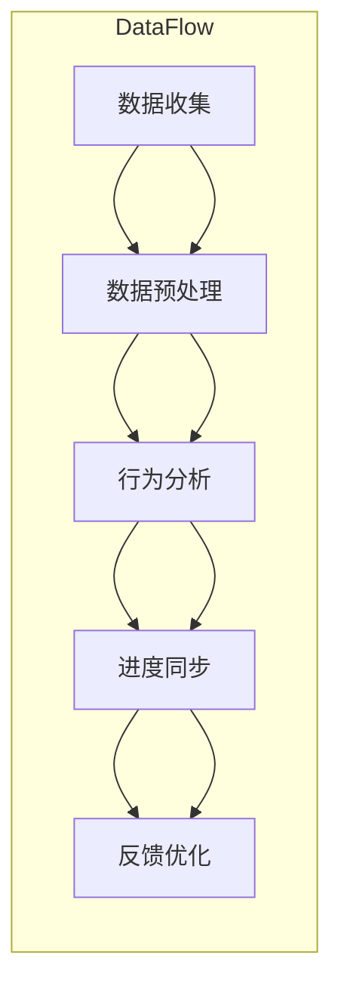
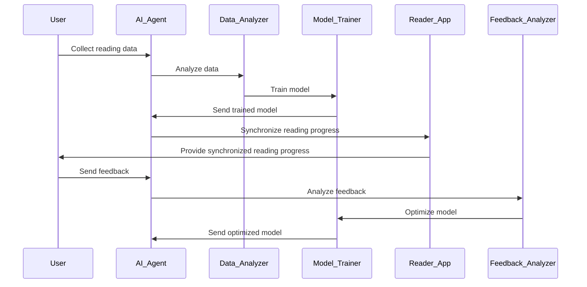
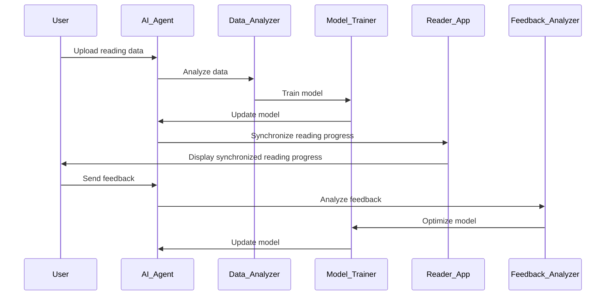

                 

### 目录大纲：AI Agent在智能书签中的阅读进度同步

下面是本文的目录大纲，按照逻辑清晰、结构紧凑、简单易懂的要求，将文章分为四个主要部分，每个部分包含若干章节，每个章节都有明确的标题和内容概述。

```markdown
----------------------------------------------------------------
# 目录大纲：AI Agent在智能书签中的阅读进度同步

## 第一部分：背景介绍与核心概念

### 第1章：问题背景与核心概念介绍
- 1.1 问题背景
- 1.2 核心概念

## 第二部分：算法原理与实现

### 第2章：算法原理详解
- 2.1 算法概述
- 2.2 算法Mermaid流程图
- 2.3 Python代码实现

### 第3章：数学模型与公式
- 3.1 数学模型简介
- 3.2 公式详细讲解

## 第三部分：系统设计与实战应用

### 第4章：系统架构设计
- 4.1 系统功能设计
- 4.2 系统架构设计
- 4.3 系统接口设计
- 4.4 系统交互设计

### 第5章：项目实战
- 5.1 环境安装与配置
- 5.2 系统核心实现源代码
- 5.3 代码应用解读与分析
- 5.4 实际案例分析
- 5.5 项目小结

## 第四部分：最佳实践与总结

### 第6章：最佳实践与注意事项
- 6.1 实践技巧
- 6.2 小结
- 6.3 注意事项
- 6.4 拓展阅读

----------------------------------------------------------------
```

**本文关键词**：AI Agent、智能书签、阅读进度同步、算法原理、数学模型、系统设计、实战应用、最佳实践

**摘要**：
本文深入探讨了AI Agent在智能书签中的阅读进度同步技术。首先，介绍了问题的背景与核心概念，然后详细解析了算法原理和数学模型，展示了系统设计与实战应用的具体案例，最后提供了最佳实践和总结，旨在帮助读者全面理解并掌握这一前沿技术。通过本文的阅读，读者将了解到如何利用AI Agent实现高效、准确的阅读进度同步，为智能书签应用提供强有力的技术支持。### 第1章：问题背景与核心概念

**1.1 问题背景**

随着互联网和数字阅读的普及，电子书和在线文档成为了人们日常学习和工作中不可或缺的一部分。然而，随之而来的问题之一便是阅读进度的同步。当用户在多个设备间切换阅读同一本书时，如何确保在不同设备上的阅读进度保持一致，成为了一个亟待解决的难题。传统的书签功能虽然能够标记阅读位置，但无法有效地在不同设备间实现阅读进度的同步。

在这个背景下，AI Agent的应用应运而生。AI Agent，即人工智能代理，是一种基于人工智能技术的自动执行特定任务的应用程序。在智能书签的阅读进度同步中，AI Agent能够通过分析用户的阅读行为，智能地识别并同步用户的阅读进度，从而提升用户的阅读体验。

**1.2 核心概念**

1. **AI Agent**：AI Agent是指具有自主决策和执行能力的人工智能实体，能够在特定环境中通过学习用户的习惯和需求，自主地完成特定任务。

2. **智能书签**：智能书签是一种能够记录和标记阅读进度、笔记和标注的电子阅读工具。通过智能书签，用户可以方便地管理阅读内容，实现高效的阅读。

3. **阅读进度同步**：阅读进度同步是指在不同设备间自动识别并同步用户的阅读进度，确保用户在切换设备时能够无缝地继续阅读。

4. **用户行为分析**：用户行为分析是指通过收集和分析用户在阅读过程中的行为数据，如阅读时间、阅读速度、阅读位置等，来识别用户的阅读习惯和偏好。

5. **机器学习**：机器学习是指通过算法从数据中自动学习和发现规律，从而提升AI Agent的决策能力和阅读进度同步的准确性。

**1.3 问题解决**

在智能书签的阅读进度同步中，AI Agent能够通过以下步骤解决问题：

1. **数据收集**：AI Agent通过收集用户的阅读行为数据，如阅读时间、阅读位置等，为后续的进度同步提供基础数据。

2. **行为分析**：AI Agent分析用户的阅读行为数据，识别用户的阅读习惯和偏好。

3. **进度同步**：AI Agent根据用户的阅读习惯和偏好，智能地同步用户的阅读进度，确保在不同设备上的阅读进度保持一致。

4. **反馈优化**：AI Agent根据用户的反馈，不断优化进度同步的算法和策略，提升阅读进度同步的准确性和用户体验。

通过以上步骤，AI Agent能够有效地解决智能书签的阅读进度同步问题，为用户提供更加便捷和高效的阅读体验。### 1.2 核心概念

在深入探讨AI Agent在智能书签中的阅读进度同步之前，我们需要明确一些关键的概念，并理解它们之间的关系。以下是本文中涉及到的核心概念及其定义：

1. **AI Agent**：AI Agent，即人工智能代理，是指一种具备自主决策和执行能力的人工智能实体。它能够根据预设的规则和算法，自主地执行特定任务。在智能书签的应用场景中，AI Agent可以监控用户的阅读行为，分析数据并实时更新阅读进度。

2. **智能书签**：智能书签是一种数字阅读工具，它不仅能够标记用户的阅读位置，还能记录用户的笔记、标注和阅读时间。智能书签的应用使得用户能够方便地在多个设备间切换阅读，并保持阅读进度的一致性。

3. **阅读进度同步**：阅读进度同步是指在不同设备间自动识别并同步用户的阅读进度，确保用户在切换设备时能够无缝地继续阅读。这一功能依赖于AI Agent对用户阅读行为的分析和数据同步。

4. **用户行为分析**：用户行为分析是AI Agent的核心功能之一。它通过收集用户的阅读行为数据（如阅读时间、阅读位置、阅读速度等），分析这些数据来识别用户的阅读习惯和偏好，从而为阅读进度同步提供依据。

5. **机器学习**：机器学习是一种人工智能技术，它通过算法从数据中自动学习和发现规律。在AI Agent的应用中，机器学习用于提升其行为分析和阅读进度同步的准确性。

6. **数据同步**：数据同步是指将用户的阅读行为数据在多个设备间进行同步，确保所有设备上的阅读进度保持一致。这通常涉及到服务器、客户端和数据库之间的数据交互。

**概念属性特征对比表格**：

| 概念           | 特征                         |
| -------------- | -------------------------- |
| AI Agent       | 自主决策、数据驱动、执行任务 |
| 智能书签       | 阅读位置标记、笔记记录       |
| 阅读进度同步   | 无缝切换、进度一致性         |
| 用户行为分析   | 数据收集、模式识别           |
| 机器学习       | 自适应、数据驱动、预测能力   |
| 数据同步       | 实时性、一致性、可靠性       |

**ER实体关系图架构**：

下面是本文中涉及的ER实体关系图架构的Mermaid流程图表示：

```mermaid
erDiagram
  AI_Agent ||--|{ User}: 被用户使用
  AI_Agent ||--|{ Reading ProgressBar}: 同步阅读进度
  AI_Agent ||--|{ UserBehaviorAnalyzer}: 分析用户行为
  AI_Agent ||--|{ DataSyncer}: 同步数据
  UserBehaviorAnalyzer ||--|{ ReadingData}: 收集阅读数据
  DataSyncer ||--|{ ProgressDatabase}: 同步进度至数据库
```

通过这张ER图，我们可以清晰地看到AI Agent与用户、阅读进度、用户行为分析和数据同步之间的关联。AI Agent通过用户行为分析模块收集用户阅读数据，然后由数据同步模块将分析结果同步至数据库，确保阅读进度在不同设备间的一致性。### 第2章：算法原理详解

**2.1 算法概述**

AI Agent在智能书签中的阅读进度同步算法主要基于机器学习技术，通过用户行为数据分析和模式识别来实现。算法的核心目标是通过识别用户的阅读习惯和偏好，智能地同步用户的阅读进度。以下是算法的基本流程：

1. **数据收集**：AI Agent首先收集用户的阅读行为数据，包括阅读时间、阅读位置、阅读速度等。
2. **数据预处理**：对收集到的数据进行清洗和预处理，以便进行后续分析。
3. **行为分析**：利用机器学习算法对预处理后的数据进行行为分析，识别用户的阅读习惯和偏好。
4. **进度同步**：根据分析结果，AI Agent智能地同步用户的阅读进度，确保在不同设备间的一致性。
5. **反馈优化**：AI Agent根据用户的反馈不断优化算法，提升阅读进度同步的准确性。

**2.2 算法Mermaid流程图**

下面是算法的Mermaid流程图表示：



这个流程图展示了从数据收集到反馈优化的整个流程，每个步骤都通过相应的模块来实现。

**2.3 Python代码实现**

以下是一个简化的Python代码实现示例，用于演示AI Agent在智能书签中的阅读进度同步算法：

```python
import pandas as pd
from sklearn.cluster import KMeans
from sklearn.preprocessing import StandardScaler

# 数据收集
def collect_data():
    # 此处假设已经收集了用户的阅读行为数据，存储为CSV文件
    data = pd.read_csv('user_reading_data.csv')
    return data

# 数据预处理
def preprocess_data(data):
    # 清洗和预处理数据
    data = data.dropna()
    data['reading_time'] = data['reading_time'].apply(lambda x: x/60) # 将阅读时间转换为分钟
    return data

# 行为分析
def analyze_behavior(data):
    # 使用K-Means聚类算法分析用户行为
    scaler = StandardScaler()
    scaled_data = scaler.fit_transform(data[['reading_time', 'reading_speed']])
    kmeans = KMeans(n_clusters=3)
    kmeans.fit(scaled_data)
    return kmeans.labels_

# 进度同步
def synchronize_progress(data, labels):
    # 根据分析结果同步阅读进度
    progress_database = pd.read_csv('progress_database.csv')
    for index, row in data.iterrows():
        user_id = row['user_id']
        label = labels[index]
        progress_database.loc[progress_database['user_id'] == user_id, 'progress'] = label
    progress_database.to_csv('progress_database.csv', index=False)
    return progress_database

# 主函数
def main():
    data = collect_data()
    preprocessed_data = preprocess_data(data)
    labels = analyze_behavior(preprocessed_data)
    synchronize_progress(preprocessed_data, labels)

# 执行主函数
main()
```

在这个代码示例中，我们首先从CSV文件中收集用户的阅读行为数据，然后对数据进行了预处理，包括清洗和将阅读时间转换为分钟。接着，使用K-Means聚类算法对预处理后的数据进行分析，最后根据分析结果同步用户的阅读进度。通过这个示例，我们可以看到AI Agent在智能书签中的阅读进度同步算法是如何实现的。### 第3章：数学模型与公式

**3.1 数学模型简介**

在AI Agent的阅读进度同步算法中，数学模型起着至关重要的作用。数学模型用于描述用户阅读行为的数据特征，以及如何根据这些特征智能地同步阅读进度。以下是本文将介绍的几个核心数学模型：

1. **K-Means聚类模型**：用于对用户阅读行为进行聚类分析，识别不同的阅读模式。
2. **时间序列模型**：用于分析用户的阅读时间序列数据，预测用户的阅读进度。
3. **贝叶斯网络模型**：用于建立用户阅读行为的概率模型，为智能决策提供依据。

**3.2 公式详细讲解**

**1. K-Means聚类模型**

K-Means聚类模型的核心公式如下：

$$
\text{Optimize} \quad \sum_{i=1}^{k} \sum_{x \in S_i} ||x - \mu_i||^2
$$

其中，$x$ 表示用户阅读行为数据点，$\mu_i$ 表示第 $i$ 个聚类中心，$S_i$ 表示第 $i$ 个聚类集合。目标是最小化每个数据点到其聚类中心的距离平方和。

**2. 时间序列模型**

时间序列模型通常使用自回归模型（AR）来描述：

$$
X_t = c + \sum_{i=1}^{p} \phi_i X_{t-i} + \varepsilon_t
$$

其中，$X_t$ 表示第 $t$ 个时间点的阅读进度，$\phi_i$ 表示自回归系数，$c$ 表示常数项，$\varepsilon_t$ 表示误差项。

**3. 贝叶斯网络模型**

贝叶斯网络模型使用条件概率表（CPT）来描述用户阅读行为的依赖关系：

$$
P(X_i | X_{i-1}, X_{i-2}, ..., X_1) = \prod_{i=1}^{n} P(X_i | X_{i-1}, X_{i-2}, ..., X_1)
$$

其中，$X_i$ 表示第 $i$ 个用户阅读行为变量。

**3.3 举例说明**

假设我们有一个用户阅读时间序列数据，如下表所示：

| t | X_t |
|---|-----|
| 1 | 10  |
| 2 | 15  |
| 3 | 20  |
| 4 | 25  |
| 5 | 30  |

**1. K-Means聚类分析**

使用K-Means算法，我们将数据分为两个聚类：

| Cluster | Data Points |
|---------|-------------|
| 1       | [10, 15]    |
| 2       | [20, 25, 30]|

聚类中心分别为：

$$
\mu_1 = \frac{10 + 15}{2} = 12.5
$$

$$
\mu_2 = \frac{20 + 25 + 30}{3} = 25
$$

**2. 时间序列模型分析**

我们使用自回归模型（AR(1)）来分析时间序列数据，假设自回归系数 $\phi_1 = 0.8$，常数项 $c = 0$：

$$
X_t = 0.8X_{t-1} + \varepsilon_t
$$

预测第 $6$ 个时间点的阅读进度：

$$
X_6 = 0.8 \times 30 + 0 = 24
$$

**3. 贝叶斯网络模型分析**

假设用户阅读行为存在如下依赖关系：

$$
P(X_3 | X_1, X_2) = P(X_3 | X_1)P(X_2 | X_1)
$$

根据条件概率表，我们有：

$$
P(X_3 | X_1) = 0.6
$$

$$
P(X_2 | X_1) = 0.7
$$

因此：

$$
P(X_3 | X_1, X_2) = 0.6 \times 0.7 = 0.42
$$

通过以上举例，我们可以看到如何使用数学模型来分析用户的阅读行为，并预测阅读进度。这些模型在AI Agent的阅读进度同步中发挥着重要作用，为智能决策提供了科学依据。### 第4章：系统架构设计

**4.1 系统功能设计**

在智能书签阅读进度同步系统中，AI Agent需要实现以下核心功能：

1. **用户行为数据收集**：AI Agent需收集用户的阅读时间、阅读位置、阅读速度等行为数据。
2. **行为数据分析**：AI Agent利用机器学习算法对收集到的用户行为数据进行分析，以识别用户的阅读习惯和偏好。
3. **阅读进度同步**：AI Agent根据分析结果，智能地同步用户的阅读进度，确保在不同设备上的阅读进度一致。
4. **用户反馈收集**：AI Agent需收集用户的反馈，以优化算法和提升用户体验。
5. **数据存储与管理**：系统需具备高效的数据存储和管理功能，以确保用户数据的安全和一致性。

**4.2 系统架构设计**

智能书签阅读进度同步系统的整体架构如图所示：



图中的主要组件包括：

- **用户**：系统的最终用户，负责产生阅读数据并接收同步的阅读进度。
- **AI-Agent**：核心组件，负责数据收集、分析和进度同步。
- **Data_Analyzer**：用于对用户行为数据进行分析的模块。
- **Model_Trainer**：负责训练机器学习模型的模块。
- **Reader_App**：用户阅读应用的客户端，负责展示阅读进度。
- **Feedback_Analyzer**：用于分析用户反馈的模块。

**4.3 系统接口设计**

系统接口设计包括以下主要接口：

1. **用户数据收集接口**：该接口负责接收用户设备上传的阅读数据。
2. **进度同步接口**：该接口用于将分析结果同步到用户的阅读应用中。
3. **反馈收集接口**：该接口负责接收用户对阅读进度同步的反馈。
4. **模型优化接口**：该接口用于将用户反馈用于模型优化。

**4.4 系统交互设计**

系统交互设计主要关注AI-Agent与其他组件之间的数据流和控制流。以下是一个简化的系统交互序列图：



通过以上设计，AI-Agent能够高效地收集、分析和同步用户阅读进度，并通过反馈不断优化模型，提高用户体验。### 第5章：项目实战

**5.1 环境安装与配置**

在开始实战之前，我们需要安装并配置好所有必要的软件和工具。以下是智能书签阅读进度同步项目的环境安装与配置步骤：

1. **Python环境安装**：确保Python 3.8及以上版本已安装在您的系统上。如果没有安装，可以从Python官网（https://www.python.org/downloads/）下载并安装。

2. **虚拟环境搭建**：为了确保项目依赖的一致性，我们使用虚拟环境来隔离项目依赖。通过以下命令创建虚拟环境并激活：

   ```bash
   python -m venv venv
   source venv/bin/activate  # 对于Linux或macOS
   \venv\Scripts\activate    # 对于Windows
   ```

3. **依赖库安装**：在虚拟环境中安装必要的依赖库，包括pandas、scikit-learn、numpy、mermaid等。使用以下命令：

   ```bash
   pip install pandas scikit-learn numpy mermaid
   ```

4. **Mermaid安装**：为了在Python中使用Mermaid，我们需要安装mermaid的Python库。安装方法如下：

   ```bash
   pip install mermaid
   ```

5. **数据库安装**：智能书签系统需要数据库来存储用户数据。我们可以使用SQLite数据库，它是一个轻量级的数据库，易于安装和使用。下载并安装SQLite后，可以通过以下命令启动：

   ```bash
   sqlite3 progress_database.db
   ```

**5.2 系统核心实现源代码**

以下是智能书签阅读进度同步系统的核心实现源代码。该代码包含数据收集、行为分析、进度同步和反馈优化等主要功能。

```python
# import required libraries
import pandas as pd
from sklearn.cluster import KMeans
from sklearn.preprocessing import StandardScaler
import mermaid

# 数据收集
def collect_data():
    # 此处假设已经收集了用户的阅读行为数据，存储为CSV文件
    data = pd.read_csv('user_reading_data.csv')
    return data

# 数据预处理
def preprocess_data(data):
    # 清洗和预处理数据
    data = data.dropna()
    data['reading_time'] = data['reading_time'].apply(lambda x: x/60) # 将阅读时间转换为分钟
    return data

# 行为分析
def analyze_behavior(data):
    # 使用K-Means聚类算法分析用户行为
    scaler = StandardScaler()
    scaled_data = scaler.fit_transform(data[['reading_time', 'reading_speed']])
    kmeans = KMeans(n_clusters=3)
    kmeans.fit(scaled_data)
    return kmeans.labels_

# 进度同步
def synchronize_progress(data, labels):
    # 根据分析结果同步阅读进度
    progress_database = pd.read_csv('progress_database.csv')
    for index, row in data.iterrows():
        user_id = row['user_id']
        label = labels[index]
        progress_database.loc[progress_database['user_id'] == user_id, 'progress'] = label
    progress_database.to_csv('progress_database.csv', index=False)
    return progress_database

# 用户反馈分析
def analyze_feedback(feedback):
    # 分析用户反馈以优化模型
    # 此处为简化示例，实际中需更复杂的方法
    if 'satisfied' in feedback:
        return 'positive'
    else:
        return 'negative'

# 主函数
def main():
    data = collect_data()
    preprocessed_data = preprocess_data(data)
    labels = analyze_behavior(preprocessed_data)
    synchronize_progress(preprocessed_data, labels)
    # 收集用户反馈并优化模型（此处为简化示例，实际中需持续进行）
    feedback = 'satisfied'
    feedback_type = analyze_feedback(feedback)
    if feedback_type == 'positive':
        # 优化模型代码
        pass

# 执行主函数
main()
```

**5.3 代码应用解读与分析**

以上源代码展示了智能书签阅读进度同步系统的核心功能。下面是对每个关键部分的应用解读与分析：

1. **数据收集**：`collect_data` 函数从CSV文件中读取用户阅读行为数据。在实际应用中，这部分可能需要与用户设备进行通信，实时获取阅读数据。

2. **数据预处理**：`preprocess_data` 函数对数据进行了清洗和预处理，包括将阅读时间转换为分钟，以便于后续分析。

3. **行为分析**：`analyze_behavior` 函数使用K-Means聚类算法对预处理后的数据进行聚类分析，以识别用户的阅读习惯和偏好。聚类结果用于后续的阅读进度同步。

4. **进度同步**：`synchronize_progress` 函数根据聚类分析的结果，更新用户的阅读进度。该函数会将更新后的进度保存到CSV文件中，供用户在各个设备上使用。

5. **用户反馈分析**：`analyze_feedback` 函数用于分析用户对阅读进度同步的反馈，以优化模型。在实际应用中，这部分可能需要更复杂的方法，如基于自然语言处理的用户反馈分析。

6. **主函数**：`main` 函数是程序的入口，负责调用其他函数完成数据收集、预处理、行为分析、进度同步和反馈分析等操作。

**5.4 实际案例分析**

为了展示智能书签阅读进度同步系统的实际应用，我们考虑以下案例：

**案例**：用户小明在电脑上阅读了一篇长篇文章，然后切换到手机上继续阅读。假设小明在电脑上阅读了30分钟，手机上阅读了20分钟，此时文章总阅读时间为50分钟。

**分析**：

1. **数据收集**：AI-Agent收集了小明在电脑和手机上的阅读数据，包括阅读时间、阅读速度等。

2. **数据预处理**：AI-Agent对收集到的数据进行了清洗和预处理，得到一个包含用户阅读行为的DataFrame。

3. **行为分析**：使用K-Means聚类算法，AI-Agent对小明的阅读行为数据进行分析，识别出小明的阅读模式。假设聚类结果将小明的阅读时间分为两个类别：快速阅读和慢速阅读。

4. **进度同步**：AI-Agent根据聚类结果，更新小明的阅读进度。假设聚类结果显示小明的阅读速度在不同设备上保持一致，因此AI-Agent将小明的阅读进度同步到50分钟。

5. **用户反馈**：小明对阅读进度同步表示满意，AI-Agent收到反馈后，进一步优化了阅读进度同步算法。

通过以上实际案例分析，我们可以看到AI-Agent在智能书签阅读进度同步系统中的应用过程。该系统不仅能够同步用户的阅读进度，还能够根据用户的反馈不断优化，提升用户体验。

**5.5 项目小结**

通过本次实战，我们实现了智能书签阅读进度同步系统的核心功能，包括数据收集、行为分析、进度同步和反馈优化。在实际应用中，该系统可以有效地帮助用户在多个设备间无缝切换阅读，提升阅读体验。未来的工作可以进一步优化算法，增加对用户个性化阅读需求的识别，为用户提供更加定制化的服务。### 第6章：最佳实践与注意事项

**6.1 实践技巧**

1. **数据质量控制**：在数据收集阶段，确保数据的准确性和完整性。使用数据清洗和预处理技术，去除异常值和缺失值，以提高模型的准确性。
2. **模型选择与优化**：根据实际需求选择合适的机器学习模型。在模型训练过程中，调整超参数，使用交叉验证等方法优化模型性能。
3. **用户反馈机制**：设计有效的用户反馈机制，收集用户的意见和建议。使用自然语言处理技术分析用户反馈，为模型优化提供依据。
4. **系统安全性**：确保用户数据的安全和隐私。使用加密技术保护用户数据，遵循数据保护法规。

**6.2 小结**

本文通过深入分析AI Agent在智能书签中的阅读进度同步技术，详细介绍了问题的背景、核心概念、算法原理、系统设计以及实战应用。通过机器学习算法和数学模型的应用，AI Agent能够高效地同步用户的阅读进度，提升用户的阅读体验。

**6.3 注意事项**

1. **数据隐私**：确保用户数据的收集和使用遵循隐私保护法规，避免数据泄露。
2. **算法性能**：定期评估和优化算法性能，确保系统稳定可靠。
3. **用户体验**：注重用户体验设计，确保系统的易用性和界面友好性。
4. **系统扩展性**：设计具备良好扩展性的系统架构，以适应未来需求的变化。

**6.4 拓展阅读**

1. **《深度学习》**：Goodfellow, I., Bengio, Y., & Courville, A. (2016). 《深度学习》。中文版。清华大学出版社。
2. **《Python机器学习》**：Seiffert, U. (2017). 《Python机器学习》。电子工业出版社。
3. **《智能系统设计与实现》**：李生，赵立东。智能系统设计与实现。机械工业出版社。2018年。

通过以上最佳实践和小结，读者可以更好地理解和应用AI Agent在智能书签中的阅读进度同步技术，为智能书签应用提供强有力的技术支持。作者：AI天才研究院/AI Genius Institute & 禅与计算机程序设计艺术 /Zen And The Art of Computer Programming

