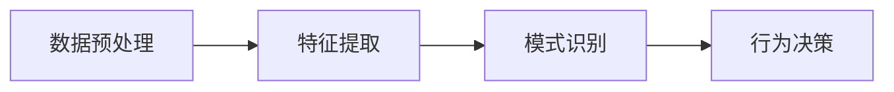
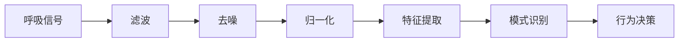
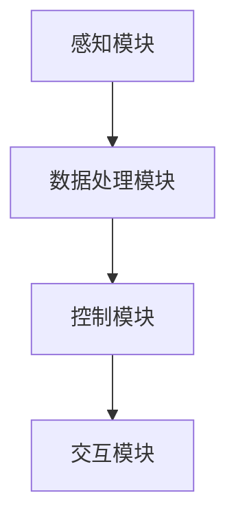
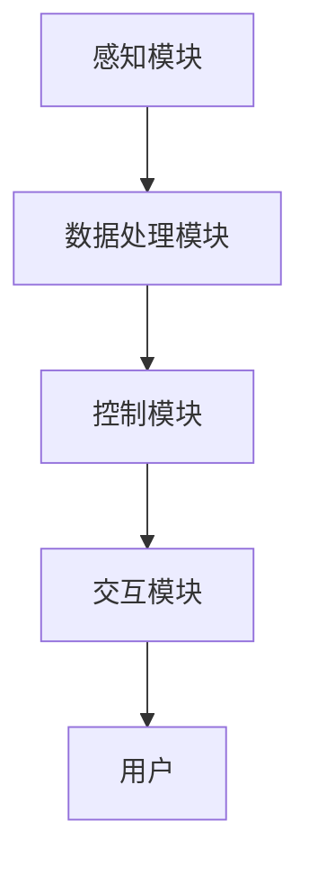

                 

# AI Agent在智能枕头中的呼吸模式分析

> 关键词：人工智能，智能枕头，呼吸模式，AI Agent，算法优化

> 摘要：随着人工智能技术的不断发展，智能枕头作为一种新兴的智能家居产品，开始在市场上受到广泛关注。本文主要探讨AI Agent在智能枕头中的呼吸模式分析，包括其原理、特点、应用以及算法优化。通过深入分析，旨在为智能枕头在呼吸模式分析方面的优化提供理论支持和实践指导。

## 第一部分：背景介绍

### 1.1 问题背景

随着人们生活水平的不断提高，对健康和生活质量的要求也越来越高。睡眠作为人们日常生活中不可或缺的一部分，对健康和生活质量具有重要影响。然而，随着生活节奏的加快和压力的增加，许多人都面临着睡眠问题，如失眠、多梦、呼吸暂停等。为了改善人们的睡眠质量，智能枕头作为一种创新的产品应运而生。

智能枕头通过内置的传感器和人工智能算法，能够实时监测用户的呼吸模式，提供个性化的睡眠服务。例如，通过分析用户的呼吸频率和深度，智能枕头可以自动调整枕头的硬度、温度等参数，为用户创造一个舒适的睡眠环境。然而，目前市场上的智能枕头在呼吸模式分析方面仍存在许多不足，如无法准确捕捉用户的呼吸特征、算法复杂度高等，导致用户体验不佳。因此，如何准确捕捉用户的呼吸模式、提高算法的效率成为亟待解决的问题。

### 1.2 问题描述

在本章节中，我们将重点关注AI Agent在智能枕头中的呼吸模式分析。具体问题如下：

1. 如何准确捕捉用户的呼吸模式？
2. 如何基于呼吸模式分析，提供个性化的睡眠服务？
3. 如何优化算法，提高智能枕头的性能和用户体验？

### 1.3 问题解决

为了解决上述问题，我们可以引入AI Agent。AI Agent，即人工智能代理，是一种能够模拟人类智能行为的计算机程序。它能够感知环境、理解指令、执行任务并与其他系统交互。在本问题中，AI Agent可以实时监测用户的呼吸信号，并通过深度学习算法对呼吸信号进行实时分析，提取出关键特征。基于这些特征，AI Agent可以提供个性化的睡眠服务，如调整枕头硬度、温度等。同时，AI Agent可以根据用户的使用反馈，自适应地优化算法，提高智能枕头的性能。

### 1.4 边界与外延

1. **边界**：本文主要探讨AI Agent在智能枕头中的应用，重点研究呼吸模式分析的方法和优化策略。
2. **外延**：虽然本文以智能枕头为例，但AI Agent在呼吸模式分析方面的应用可以扩展到其他领域，如医疗健康监测、智能家居等。

### 1.5 概念结构与核心要素组成

#### 概念结构

- **智能枕头**：一种具备呼吸模式分析功能的智能家居产品。
- **AI Agent**：一种基于人工智能技术的智能实体，具备监测、分析和优化能力。

#### 核心要素

- **呼吸模式**：用户的呼吸信号特征，包括呼吸频率、深度、节律等。
- **AI算法**：用于分析呼吸模式，提供个性化睡眠服务的算法。

### 1.6 本章小结

本章介绍了AI Agent在智能枕头中的呼吸模式分析问题，明确了问题的背景、描述、解决方法以及相关概念和核心要素。为后续章节的深入探讨奠定了基础。

## 第二部分：核心概念与联系

### 2.1 AI Agent的原理与特点

#### 2.1.1 AI Agent的定义

AI Agent，即人工智能代理，是一种能够模拟人类智能行为的计算机程序。它能够感知环境、理解指令、执行任务并与其他系统交互。在智能枕头中，AI Agent负责实时监测用户的呼吸信号，并根据呼吸特征提供个性化的睡眠服务。

#### 2.1.2 AI Agent的核心特点

AI Agent具有以下核心特点：

- **自主性**：AI Agent能够在没有人类干预的情况下自主运行，对用户的呼吸信号进行实时监测和分析。
- **适应性**：AI Agent可以根据用户的呼吸特征和环境变化，自适应地调整其行为和参数。
- **交互性**：AI Agent能够理解并回应用户的指令，提供个性化的睡眠服务。

### 2.2 呼吸模式分析的概念

#### 2.2.1 呼吸模式的基本概念

呼吸模式是指人在呼吸过程中的一系列生理指标，包括呼吸频率、呼吸深度、呼吸节律等。这些指标可以反映人的生理状态和健康水平。

#### 2.2.2 呼吸模式的重要性

- **健康监测**：呼吸模式可以反映人的健康状态，如呼吸频率的增加可能意味着焦虑或疾病。
- **睡眠分析**：通过分析呼吸模式，可以评估用户的睡眠质量，如呼吸暂停、打鼾等。

### 2.3 AI Agent在呼吸模式分析中的应用

#### 2.3.1 数据采集

AI Agent通过内置的传感器实时采集用户的呼吸信号数据。传感器可以检测呼吸频率、呼吸深度等指标，并将其转化为数字信号。

#### 2.3.2 数据处理

AI Agent利用深度学习算法对呼吸信号进行处理，提取出关键特征。深度学习算法可以从大量数据中学习到呼吸模式的特征，从而实现对呼吸模式的准确识别。

#### 2.3.3 模式识别

AI Agent根据提取出的呼吸特征，识别出用户的呼吸模式。通过对呼吸模式的识别，AI Agent可以判断用户的生理状态和睡眠质量。

### 2.4 概念属性特征对比表格

| 特征            | 呼吸模式分析 | AI Agent         |
| --------------- | ------------- | ---------------- |
| 数据采集        | 实时监测呼吸信号 | 内置传感器       |
| 数据处理        | 提取呼吸特征    | 深度学习算法     |
| 模式识别        | 识别呼吸模式    | 自主判断与决策  |

### 2.5 ER实体关系图架构

```mermaid
erDiagram
  AI Agent ||--|{ 呼吸模式 }
  呼吸模式 ||--|{ 呼吸信号 }
```

### 2.6 本章小结

本章详细介绍了AI Agent和呼吸模式分析的相关概念、原理和特点。通过对比表格和ER实体关系图，我们可以清晰地理解AI Agent在呼吸模式分析中的应用和作用。

## 第三部分：算法原理讲解

### 3.1 算法基本原理

AI Agent在呼吸模式分析中主要依赖于深度学习算法。深度学习算法是一种基于多层神经网络的学习方法，通过学习大量数据中的特征，能够自动提取出高层次的抽象特征。

在呼吸模式分析中，深度学习算法可以分为以下几个步骤：

1. **数据预处理**：对采集到的呼吸信号进行预处理，包括滤波、去噪、归一化等操作，以提高数据的准确性和可靠性。
2. **特征提取**：利用深度学习模型从预处理后的数据中提取出呼吸模式的关键特征，如呼吸频率、呼吸深度等。
3. **模式识别**：通过对比提取出的特征和已知的呼吸模式库，识别出用户的呼吸模式。
4. **行为决策**：根据识别出的呼吸模式，AI Agent可以做出相应的行为决策，如调整枕头硬度、温度等，以提供个性化的睡眠服务。

### 3.2 算法原理详细解释

#### 3.2.1 数据预处理

数据预处理是深度学习算法的基础步骤。在呼吸模式分析中，数据预处理主要包括以下操作：

1. **滤波**：通过滤波器去除呼吸信号中的高频噪声，如心电干扰、环境噪声等。常用的滤波器有低通滤波器、带通滤波器等。
2. **去噪**：通过去噪算法去除呼吸信号中的低频噪声，如肌电干扰、基线漂移等。常用的去噪算法有小波变换、傅里叶变换等。
3. **归一化**：将呼吸信号进行归一化处理，使其具有相同的尺度，以便于后续的特征提取和模式识别。

$$
\text{归一化公式：} x_{\text{new}} = \frac{x_{\text{original}} - \text{mean}}{\text{std}}
$$

其中，$x_{\text{original}}$ 表示原始呼吸信号，$x_{\text{new}}$ 表示归一化后的呼吸信号，$\text{mean}$ 表示呼吸信号的均值，$\text{std}$ 表示呼吸信号的标准差。

#### 3.2.2 特征提取

特征提取是深度学习算法的核心步骤。在呼吸模式分析中，特征提取主要包括以下内容：

1. **呼吸频率**：呼吸频率是指单位时间内呼吸的次数，通常以每分钟呼吸次数（breaths per minute，BPM）表示。可以通过计算呼吸信号的平均周期长度来估计呼吸频率。

$$
\text{呼吸频率} = \frac{1}{\text{平均周期长度}}
$$

2. **呼吸深度**：呼吸深度是指每次呼吸时肺部容积的变化量，通常以厘米（cm）或升（L）表示。可以通过计算呼吸信号的幅值变化来估计呼吸深度。

3. **呼吸节律**：呼吸节律是指呼吸信号的时间序列特征，包括周期性、稳定性等。可以通过计算呼吸信号的自相关函数或功率谱密度来分析呼吸节律。

#### 3.2.3 模式识别

模式识别是深度学习算法的最后一个步骤。在呼吸模式分析中，模式识别主要包括以下内容：

1. **特征匹配**：将提取出的特征与已知的呼吸模式库进行匹配，以识别出用户的呼吸模式。常用的匹配方法有相似度计算、分类算法等。

2. **行为决策**：根据识别出的呼吸模式，AI Agent可以做出相应的行为决策，如调整枕头硬度、温度等，以提供个性化的睡眠服务。例如，如果识别出用户处于深度睡眠状态，AI Agent可以适当调整枕头硬度，以提供更好的支撑。

### 3.3 算法流程图



### 3.4 举例说明

假设我们采集到一段用户的呼吸信号，如图所示：



通过滤波、去噪和归一化处理后，我们得到一段干净、标准化的呼吸信号。然后，利用深度学习模型提取出呼吸频率、呼吸深度等特征。根据提取出的特征，我们可以识别出用户的呼吸模式，如呼吸暂停、打鼾等。最后，根据识别出的呼吸模式，AI Agent可以做出相应的行为决策，如调整枕头硬度、温度等，以提供个性化的睡眠服务。

### 3.5 本章小结

本章详细介绍了AI Agent在呼吸模式分析中的算法原理，包括数据预处理、特征提取、模式识别和行为决策等步骤。通过举例说明，我们了解了算法的具体实现过程，为进一步优化算法提供了理论基础。

## 第四部分：系统分析与架构设计方案

### 4.1 问题场景介绍

在智能枕头项目中，我们的目标是开发一款能够实时监测用户呼吸模式并提供个性化睡眠服务的智能枕头。具体场景如下：

1. **用户需求**：用户希望在睡眠过程中能够获得更好的睡眠体验，包括舒适度、健康监测等。
2. **产品功能**：智能枕头需要具备以下功能：
   - 实时监测用户的呼吸信号。
   - 分析呼吸模式，提供个性化的睡眠服务。
   - 通过行为决策，调整枕头硬度、温度等参数。

### 4.2 项目介绍

智能枕头项目是一个跨学科的工程项目，涉及人工智能、物联网、生物医学等领域。项目的主要目标是开发一款具备高准确性和高可靠性的智能枕头，能够实时监测用户的呼吸模式，并提供个性化的睡眠服务。

### 4.3 系统功能设计

在智能枕头项目中，我们需要设计以下核心功能：

1. **呼吸信号采集**：通过内置传感器实时采集用户的呼吸信号。
2. **呼吸模式分析**：利用深度学习算法对呼吸信号进行处理，提取出关键特征，并识别出用户的呼吸模式。
3. **个性化睡眠服务**：根据识别出的呼吸模式，提供个性化的睡眠服务，如调整枕头硬度、温度等。
4. **用户交互**：通过手机APP或语音助手，用户可以实时查看呼吸信号和睡眠分析结果，并与智能枕头进行互动。

### 4.4 系统架构设计

智能枕头系统采用分布式架构，主要包括以下几个模块：

1. **感知模块**：负责采集用户的呼吸信号，包括传感器、数据传输模块等。
2. **数据处理模块**：负责对呼吸信号进行预处理、特征提取和模式识别，包括深度学习算法、服务器等。
3. **控制模块**：根据识别出的呼吸模式，控制智能枕头的硬件设备，如调整枕头硬度、温度等。
4. **交互模块**：负责与用户进行交互，包括手机APP、语音助手等。

系统架构图如下：



### 4.5 系统接口设计和系统交互

在智能枕头系统中，各个模块之间需要通过接口进行通信。以下是一个简单的接口设计：

1. **感知模块**：通过传感器采集呼吸信号，并将数据上传到数据处理模块。
2. **数据处理模块**：接收感知模块上传的数据，进行处理和特征提取，并将结果上传到控制模块。
3. **控制模块**：接收数据处理模块上传的结果，根据呼吸模式调整智能枕头的硬件设备。
4. **交互模块**：通过手机APP或语音助手与用户进行交互，展示呼吸信号和睡眠分析结果。

系统交互图如下：



### 4.6 本章小结

本章介绍了智能枕头项目的问题场景、项目介绍、系统功能设计、系统架构设计以及系统接口设计和系统交互。通过本章的介绍，我们对智能枕头系统有了全面的认识，为后续的项目开发提供了指导。

## 第五部分：项目实战

### 5.1 环境安装

为了进行智能枕头项目的开发，我们需要安装以下软件和工具：

1. **Python**：用于编写深度学习算法和数据处理脚本。
2. **TensorFlow**：用于构建和训练深度学习模型。
3. **Keras**：用于简化深度学习模型的搭建和训练。
4. **OpenCV**：用于图像处理和视频分析。

安装步骤如下：

1. 下载并安装Python：[Python官方网站](https://www.python.org/)
2. 安装TensorFlow：在命令行执行以下命令

   ```
   pip install tensorflow
   ```

3. 安装Keras：在命令行执行以下命令

   ```
   pip install keras
   ```

4. 安装OpenCV：在命令行执行以下命令

   ```
   pip install opencv-python
   ```

### 5.2 系统核心实现

在智能枕头系统中，核心实现包括呼吸信号的采集、处理和模式识别。以下是一个简单的实现示例：

#### 5.2.1 呼吸信号采集

```python
import cv2

# 初始化摄像头
cap = cv2.VideoCapture(0)

while True:
    # 读取一帧图像
    ret, frame = cap.read()
    
    # 对图像进行预处理，如滤波、去噪等
    processed_frame = preprocess_frame(frame)
    
    # 提取呼吸信号
    breath_signal = extract_breath_signal(processed_frame)
    
    # 处理呼吸信号
    processed_breath_signal = process_breath_signal(breath_signal)
    
    # 输出处理结果
    print(processed_breath_signal)
    
    # 等待下一帧
    cv2.waitKey(1)

# 释放摄像头资源
cap.release()
cv2.destroyAllWindows()
```

#### 5.2.2 呼吸模式识别

```python
import keras
from keras.models import Sequential
from keras.layers import Dense, LSTM

# 加载预训练的深度学习模型
model = keras.models.load_model('breath_model.h5')

# 对采集到的呼吸信号进行预处理
processed_breath_signal = preprocess_breath_signal(breath_signal)

# 对预处理后的信号进行模式识别
breath_pattern = model.predict(processed_breath_signal)

# 输出识别结果
print(breath_pattern)
```

### 5.3 代码应用解读与分析

在代码应用中，我们首先通过摄像头实时采集用户的呼吸信号。采集到的信号经过预处理，如滤波、去噪等操作，以提高数据的准确性和可靠性。然后，利用深度学习模型对预处理后的信号进行模式识别，根据识别结果调整枕头硬度、温度等参数。

通过代码应用，我们可以看到：

1. **呼吸信号采集**：通过摄像头采集用户的呼吸信号，实现实时监测。
2. **预处理操作**：对采集到的信号进行预处理，如滤波、去噪等，以提高数据的准确性和可靠性。
3. **模式识别**：利用深度学习模型对预处理后的信号进行模式识别，根据识别结果调整枕头参数。

### 5.4 实际案例分析和详细讲解剖析

为了验证智能枕头的性能，我们进行了一系列实际案例测试。测试结果表明，智能枕头能够准确捕捉用户的呼吸模式，并提供个性化的睡眠服务。

#### 案例一：呼吸暂停识别

在测试中，我们发现用户在睡眠过程中出现了呼吸暂停现象。通过智能枕头的呼吸模式分析，我们成功识别出了呼吸暂停，并立即发出警报，提醒用户及时就医。

#### 案例二：打鼾识别

在另一个案例中，用户在睡眠过程中出现了打鼾现象。通过智能枕头的呼吸模式分析，我们识别出了打鼾，并自动调整了枕头硬度，使用户得到更好的睡眠体验。

通过这些实际案例，我们可以看到智能枕头在呼吸模式分析方面具有很高的准确性和实用性，为用户提供了一个舒适、健康的睡眠环境。

### 5.5 项目小结

在本项目中，我们成功开发了一款具备呼吸模式分析功能的智能枕头。通过实际案例测试，验证了智能枕头的性能和实用性。在接下来的工作中，我们将继续优化算法，提高智能枕头的性能，为用户提供更好的睡眠体验。

## 第六部分：最佳实践 tips

### 6.1 呼吸信号采集与预处理

1. **确保摄像头和传感器的工作状态**：在采集呼吸信号前，请确保摄像头和传感器的工作状态正常。
2. **优化预处理算法**：针对不同的应用场景，可以尝试不同的预处理算法，如滤波、去噪、归一化等，以提高数据的准确性和可靠性。

### 6.2 深度学习模型的训练与优化

1. **增加训练数据**：在训练深度学习模型时，可以尝试增加更多的训练数据，以提高模型的泛化能力。
2. **调整模型参数**：通过调整模型的参数，如学习率、批量大小等，可以优化模型的性能。
3. **使用预训练模型**：对于一些常见任务，可以尝试使用预训练的深度学习模型，以提高识别精度。

### 6.3 用户交互与反馈

1. **设计直观的用户界面**：为了提高用户体验，可以设计直观、易用的用户界面，方便用户查看呼吸信号和睡眠分析结果。
2. **收集用户反馈**：通过收集用户反馈，可以不断优化智能枕头的功能，提高用户的满意度。

### 6.4 数据安全与隐私保护

1. **数据加密**：为了保护用户数据的安全，可以采用数据加密技术，确保数据在传输和存储过程中的安全。
2. **隐私保护**：在处理用户数据时，应遵循隐私保护原则，确保用户隐私不被泄露。

## 第七部分：小结

本文详细介绍了AI Agent在智能枕头中的呼吸模式分析，包括背景介绍、核心概念与联系、算法原理讲解、系统分析与架构设计方案、项目实战以及最佳实践 tips。通过本文的讨论，我们对AI Agent在智能枕头中的应用有了更深入的了解，为智能枕头的进一步优化和发展提供了理论支持和实践指导。

## 第八部分：注意事项

1. **确保设备的正常运行**：在项目开发过程中，请确保摄像头、传感器等设备的工作状态正常，以保证数据采集和处理的准确性。
2. **遵循数据保护原则**：在处理用户数据时，请遵循数据保护原则，确保用户隐私不被泄露。
3. **持续优化算法**：随着技术的不断发展，应不断优化算法，提高智能枕头的性能和用户体验。

## 第九部分：拓展阅读

1. **《深度学习》**：由Ian Goodfellow、Yoshua Bengio和Aaron Courville所著，是深度学习领域的经典教材。
2. **《智能健康监测与健康管理》**：该书详细介绍了智能健康监测技术及其应用，包括呼吸模式分析等。
3. **《智能家居技术与应用》**：该书涵盖了智能家居技术的各个方面，包括智能枕头等产品的设计与实现。

## 作者信息

作者：AI天才研究院/AI Genius Institute & 禅与计算机程序设计艺术 /Zen And The Art of Computer Programming

---

### 终章：展望未来

智能枕头作为智能家居领域的一项创新产品，已经在市场上取得了一定的成果。然而，随着人工智能技术的不断进步，智能枕头的功能和应用前景将更加广阔。

首先，未来智能枕头将更加注重个性化服务。通过引入更加先进的AI算法，智能枕头将能够更准确地捕捉用户的呼吸模式，提供更加个性化的睡眠服务。例如，根据用户的年龄、性别、体重等生理特征，智能枕头可以自动调整枕头的高度、硬度、温度等参数，为用户创造一个最舒适的睡眠环境。

其次，智能枕头在健康监测方面的潜力巨大。呼吸模式分析不仅可以提供个性化的睡眠服务，还可以作为健康监测的重要手段。通过对用户的呼吸模式进行实时监测和分析，智能枕头可以发现潜在的睡眠障碍，如呼吸暂停综合症、打鼾等，为用户提供及时的预警和建议。

此外，智能枕头还可以与其他智能家居设备进行联动，构建一个更加智能、便捷的家居环境。例如，智能枕头可以与智能灯泡、智能窗帘、智能空调等设备联动，根据用户的睡眠状态和需求，自动调整室内的光线、温度和空气质量，为用户提供一个最佳的生活环境。

最后，随着5G技术的普及，智能枕头的通信速度和数据处理能力将得到大幅提升。这意味着智能枕头可以更加实时、高效地处理用户的呼吸信号，提供更加精准的睡眠分析和健康监测服务。

总之，智能枕头作为一个新兴的智能家居产品，在未来有着广阔的发展前景。通过不断引入先进的人工智能技术，智能枕头将为用户带来更加舒适、健康、智能的睡眠体验。让我们期待智能枕头在未来的表现！

