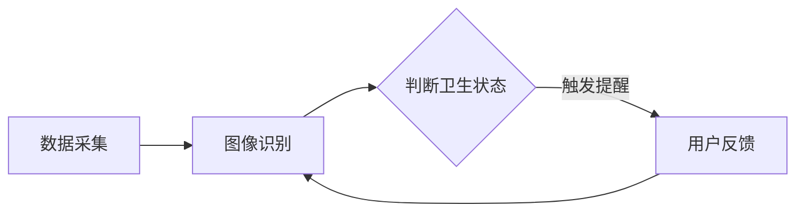
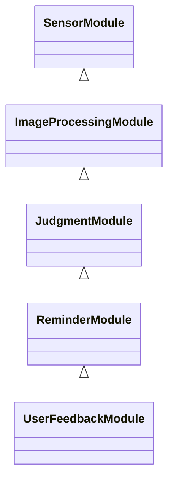
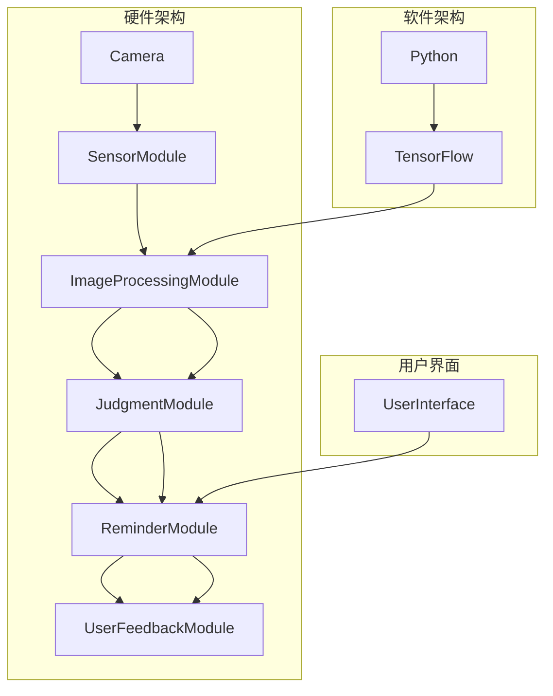

                 

# AI Agent在智能门把手中的手部卫生提醒

> 关键词：AI Agent、智能门把手、手部卫生、传感器、图像识别、机器学习

> 摘要：本文将探讨AI Agent在智能门把手中的手部卫生提醒应用，从背景介绍、核心概念、原理讲解、系统分析与架构设计、项目实战、最佳实践与注意事项等方面进行深入分析，旨在为相关领域的开发者和研究者提供有价值的参考。

## 目录大纲

1. 问题背景与概述
   1.1 问题背景
   1.2 问题描述
   1.3 问题解决
   1.4 边界与外延
   1.5 概念结构与核心要素组成

2. 核心概念与联系
   2.1 传感器技术
   2.2 图像识别
   2.3 机器学习
   2.4 概念属性特征对比表格
   2.5 ER实体关系图架构

3. AI Agent原理讲解
   3.1 AI Agent的定义与作用
   3.2 AI Agent的工作流程
   3.3 Python源代码实现
   3.4 数学模型和公式
   3.5 详细讲解与举例说明

4. 系统分析与架构设计
   4.1 问题场景介绍
   4.2 项目介绍
   4.3 系统功能设计
   4.4 系统架构设计
   4.5 系统接口设计
   4.6 系统交互Mermaid序列图

5. 项目实战
   5.1 环境安装
   5.2 系统核心实现源代码
   5.3 代码应用解读与分析
   5.4 实际案例分析与详细讲解剖析
   5.5 项目小结

6. 最佳实践与注意事项
   6.1 最佳实践
   6.2 注意事项
   6.3 拓展阅读

7. 未来展望与总结
   7.1 未来展望
   7.2 总结

---

## 第1章 问题背景与概述

### 1.1 问题背景

随着社会的快速发展，公共卫生问题日益受到关注。尤其是在疫情期间，手部卫生成为防止病毒传播的关键措施之一。然而，现实生活中，很多人并不能始终保持良好的手部卫生习惯。这种情况下，智能门把手作为一种智能家居设备，其手部卫生提醒功能就显得尤为重要。

智能门把手作为一种先进的智能家居设备，集成了传感器技术、图像识别和机器学习等多种AI技术，可以实时监测用户的手部卫生状态，并在必要时提供提醒。这种功能不仅有助于提高个人卫生水平，还能在一定程度上降低传染病的传播风险。

### 1.2 问题描述

智能门把手手部卫生提醒的需求主要包括以下几个方面：

1. **实时监测**：需要一种能够实时监测用户手部卫生状态的传感器或技术。
2. **卫生提醒**：当用户手部不干净时，需要门把手能够及时发出提醒，引导用户洗手。
3. **用户反馈**：提供一种用户可以反馈自身手部卫生状态的机制，以便进一步优化提醒功能。

### 1.3 问题解决

AI Agent在智能门把手手部卫生提醒中的作用如下：

1. **传感器监测**：AI Agent可以利用传感器技术，如红外传感器、摄像头等，实时捕捉用户的手部状态。
2. **图像识别**：通过图像识别技术，AI Agent可以对捕捉到的图像进行分析，判断手部是否干净。
3. **机器学习**：AI Agent可以利用机器学习算法，根据历史数据和用户反馈，不断优化手部卫生状态的判断准确性。
4. **卫生提醒**：当AI Agent判断用户手部不干净时，可以触发提醒机制，例如通过声音、振动等方式提醒用户洗手。
5. **用户反馈**：AI Agent还可以收集用户反馈，根据用户的反馈调整提醒策略，提高用户满意度。

### 1.4 边界与外延

虽然AI Agent在智能门把手手部卫生提醒中具有重要作用，但该应用仍有一些边界和限制：

1. **技术实现难度**：传感器技术、图像识别和机器学习算法的实现都需要较高的技术门槛。
2. **用户隐私保护**：手部卫生监测涉及用户隐私，需要确保数据的安全和用户的隐私保护。
3. **未来发展方向**：随着技术的不断发展，AI Agent在手部卫生提醒中的应用将更加广泛和深入，例如结合其他健康监测功能。

### 1.5 概念结构与核心要素组成

智能门把手手部卫生提醒系统的核心概念和要素主要包括：

1. **传感器技术**：用于实时捕捉用户手部状态。
2. **图像识别技术**：用于分析用户手部卫生状态。
3. **机器学习算法**：用于优化手部卫生状态的判断准确性。
4. **提醒机制**：用于触发提醒，引导用户洗手。
5. **用户反馈机制**：用于收集用户反馈，优化提醒功能。

---

## 第2章 核心概念与联系

### 2.1 传感器技术

传感器技术是智能门把手手部卫生提醒系统的基础。传感器可以实时捕捉用户的手部状态，并将信息传输给AI Agent进行分析。常用的传感器包括：

1. **红外传感器**：可以捕捉手部的红外辐射，判断手部是否存在。
2. **摄像头**：可以捕捉手部的图像，用于图像识别分析。

### 2.2 图像识别

图像识别技术用于分析摄像头捕捉到的手部图像，判断手部是否干净。图像识别技术主要包括：

1. **特征提取**：从图像中提取有用的特征，用于后续分析。
2. **模式识别**：利用提取的特征，判断手部是否干净。

### 2.3 机器学习

机器学习算法用于优化手部卫生状态的判断准确性。常见的机器学习算法包括：

1. **监督学习**：利用已标记的数据进行训练，提高判断准确性。
2. **无监督学习**：通过未标记的数据，发现手部卫生状态的特征和规律。

### 2.4 概念属性特征对比表格

以下是一个简单的概念属性特征对比表格，用于对比传感器技术、图像识别技术和机器学习算法：

| 技术类型 | 功能 | 特点 | 应用场景 |
| --- | --- | --- | --- |
| 传感器技术 | 实时捕捉用户手部状态 | 精度高，实时性强 | 智能门把手手部卫生提醒 |
| 图像识别技术 | 分析手部图像 | 高精度，适用于复杂场景 | 智能门把手手部卫生提醒 |
| 机器学习算法 | 优化判断准确性 | 需要大量数据训练，自适应性强 | 智能门把手手部卫生提醒 |

### 2.5 ER实体关系图架构

以下是一个ER实体关系图，用于展示智能门把手手部卫生提醒系统的整体架构：

```mermaid
erDiagram
    User ||--|{ HandSanitizer}
    User ||--|{ Feedback}
    HandSanitizer ||--|{ Sensor}
    HandSanitizer ||--|{ ImageRecognition}
    HandSanitizer ||--|{ MachineLearning}
    Feedback ||--|{ User}
```

在这个ER图中，User代表用户，HandSanitizer代表智能门把手，Sensor代表传感器，ImageRecognition代表图像识别，MachineLearning代表机器学习，Feedback代表用户反馈。各个实体之间的关系展示了智能门把手手部卫生提醒系统的核心组件及其相互作用。

---

## 第3章 AI Agent原理讲解

### 3.1 AI Agent的定义与作用

AI Agent，即人工智能代理，是一种具有自主决策和执行能力的智能系统。在智能门把手手部卫生提醒中，AI Agent起着核心作用，其主要功能和作用如下：

1. **实时监测**：AI Agent利用传感器技术，实时捕捉用户的手部状态。
2. **判断卫生状态**：AI Agent通过图像识别技术，分析手部图像，判断手部是否干净。
3. **提供提醒**：当AI Agent判断用户手部不干净时，触发提醒机制，引导用户洗手。
4. **用户反馈**：AI Agent收集用户反馈，优化提醒策略。

### 3.2 AI Agent的工作流程

AI Agent的工作流程主要包括以下几个步骤：

1. **数据采集**：AI Agent通过传感器技术，实时捕捉用户的手部状态。
2. **图像识别**：AI Agent利用图像识别技术，对捕捉到的图像进行分析，提取手部特征。
3. **判断卫生状态**：AI Agent利用机器学习算法，根据提取的特征，判断手部是否干净。
4. **触发提醒**：当AI Agent判断用户手部不干净时，触发提醒机制，引导用户洗手。
5. **用户反馈**：AI Agent收集用户反馈，优化提醒策略。

以下是一个AI Agent的工作流程Mermaid流程图：



### 3.3 Python源代码实现

以下是一个简化的Python源代码实现，展示了AI Agent在智能门把手手部卫生提醒中的具体实现方式：

```python
import cv2
import numpy as np

# 初始化摄像头
cap = cv2.VideoCapture(0)

while True:
    # 采集图像
    ret, frame = cap.read()

    # 图像预处理
    frame = cv2.resize(frame, (224, 224))
    frame = cv2.cvtColor(frame, cv2.COLOR_BGR2RGB)

    # 图像识别
    features = extract_features(frame)

    # 判断卫生状态
    if is_dirty(features):
        # 触发提醒
        remind_to_wash Hands()
    else:
        # 无需提醒
        print("Hand is clean.")

    # 用户反馈
    feedback = get_user_feedback()

    # 优化提醒策略
    optimize_reminder_strategy(feedback)

    # 显示图像
    cv2.imshow('Frame', frame)

    # 按下'q'键退出循环
    if cv2.waitKey(1) & 0xFF == ord('q'):
        break

# 释放摄像头
cap.release()
cv2.destroyAllWindows()
```

在这个代码中，`extract_features`、`is_dirty`、`remind_to_wash_Hands`和`optimize_reminder_strategy`是假设的实现方法，需要根据具体情况进行实现。

### 3.4 数学模型和公式

在AI Agent中，数学模型和公式用于描述手部卫生状态的判断过程。以下是一个简化的数学模型和公式示例：

$$
f(x) = \sum_{i=1}^{n} w_i \cdot x_i
$$

其中，$f(x)$表示手部卫生状态的判断结果，$w_i$表示权重，$x_i$表示手部特征。

### 3.5 详细讲解与举例说明

以下是一个具体的例子，展示了AI Agent在手部卫生提醒中的工作原理：

假设有一个用户在使用智能门把手，AI Agent通过摄像头实时捕捉用户的手部图像。首先，AI Agent对图像进行预处理，包括调整大小、灰度化等操作。然后，AI Agent利用卷积神经网络（CNN）提取手部特征。

接下来，AI Agent使用一个简单的线性模型判断手部是否干净。该模型的公式如下：

$$
f(x) = w_1 \cdot x_1 + w_2 \cdot x_2 + w_3 \cdot x_3
$$

其中，$w_1$、$w_2$和$w_3$是权重，$x_1$、$x_2$和$x_3$是提取的手部特征。

假设提取的手部特征如下：

$$
x_1 = 0.8, \quad x_2 = 0.6, \quad x_3 = 0.9
$$

根据上述公式，可以计算出：

$$
f(x) = 0.8 \cdot 0.8 + 0.6 \cdot 0.6 + 0.9 \cdot 0.9 = 0.64 + 0.36 + 0.81 = 1.81
$$

由于$f(x) > 1$，AI Agent判断用户手部不干净，触发提醒机制，引导用户洗手。

通过这个例子，我们可以看到AI Agent在手部卫生提醒中的工作原理。在实际应用中，AI Agent会使用更复杂的模型和算法，以提高判断准确性。

---

## 第4章 系统分析与架构设计

### 4.1 问题场景介绍

智能门把手手部卫生提醒系统的典型应用场景包括以下几种：

1. **公共场所**：如医院、学校、办公楼等，这些场所对公共卫生有较高要求，智能门把手手部卫生提醒系统可以有效提高场所的卫生水平。
2. **家庭环境**：家庭成员经常使用智能门把手，智能门把手手部卫生提醒系统可以帮助家庭成员养成良好的卫生习惯。
3. **工厂企业**：工厂企业中，工人经常接触机器和设备，智能门把手手部卫生提醒系统可以提高工人的卫生水平，减少工作事故。

### 4.2 项目介绍

智能门把手手部卫生提醒项目的主要目标是实现以下功能：

1. **实时监测**：通过传感器技术，实时捕捉用户的手部状态。
2. **卫生提醒**：当用户手部不干净时，触发提醒机制，引导用户洗手。
3. **用户反馈**：收集用户反馈，优化提醒策略。

项目的主要实现方案如下：

1. **硬件设备**：选用高精度的摄像头和红外传感器，用于实时捕捉用户的手部状态。
2. **软件平台**：使用Python和TensorFlow等工具，实现图像识别和机器学习算法。
3. **用户界面**：通过手机APP或显示器，向用户展示手部卫生状态和提醒信息。

### 4.3 系统功能设计

智能门把手手部卫生提醒系统的功能模块主要包括以下几部分：

1. **传感器模块**：负责实时捕捉用户的手部状态。
2. **图像处理模块**：对捕捉到的图像进行预处理和特征提取。
3. **判断模块**：利用机器学习算法，判断手部是否干净。
4. **提醒模块**：根据判断结果，触发提醒机制，引导用户洗手。
5. **用户反馈模块**：收集用户反馈，优化提醒策略。

以下是一个领域模型类图，展示了智能门把手手部卫生提醒系统的功能模块：



### 4.4 系统架构设计

智能门把手手部卫生提醒系统的整体架构如图所示：



在这个架构中，硬件架构包括摄像头、传感器模块、图像处理模块、判断模块、提醒模块和用户反馈模块；软件架构包括Python、TensorFlow等工具；用户界面用于向用户展示提醒信息和用户反馈。

### 4.5 系统接口设计

智能门把手手部卫生提醒系统的主要接口设计如下：

1. **硬件接口**：摄像头和传感器模块的接口，用于实时捕捉用户的手部状态。
2. **软件接口**：Python和TensorFlow等工具的接口，用于实现图像识别和机器学习算法。
3. **用户接口**：用户界面与提醒模块的接口，用于向用户展示提醒信息和用户反馈。

### 4.6 系统交互Mermaid序列图

智能门把手手部卫生提醒系统的交互流程如图所示：

```mermaid
sequenceDiagram
    User->>Camera: 伸手
    Camera->>SensorModule: 传递手部状态
    SensorModule->>ImageProcessingModule: 传递图像
    ImageProcessingModule->>JudgmentModule: 传递预处理后的图像
    JudgmentModule->>ReminderModule: 判断手部是否干净
    alt 手部干净
        ReminderModule->>UserInterface: 无需提醒
    else 手部不干净
        ReminderModule->>UserInterface: 提醒洗手
    end
    UserInterface->>User: 显示提醒信息
    User->>UserInterface: 提供反馈
    UserInterface->>UserFeedbackModule: 传递反馈信息
    UserFeedbackModule->>JudgmentModule: 优化判断策略
end
```

在这个交互流程中，用户首先伸手，摄像头和传感器模块实时捕捉用户的手部状态，然后图像处理模块对图像进行预处理，判断模块根据预处理后的图像判断手部是否干净。如果手部干净，则无需提醒；如果手部不干净，则触发提醒机制，引导用户洗手。用户界面用于向用户展示提醒信息，用户根据提醒信息提供反馈，反馈模块根据用户的反馈优化判断策略。

---

## 第5章 项目实战

### 5.1 环境安装

在开始智能门把手手部卫生提醒项目的开发之前，我们需要安装相关的环境和工具。以下是在Ubuntu系统上安装所需环境的步骤：

1. **安装Python**：打开终端，运行以下命令安装Python：

   ```shell
   sudo apt update
   sudo apt install python3 python3-pip
   ```

2. **安装TensorFlow**：TensorFlow是一个用于机器学习的开源库，我们可以使用pip安装：

   ```shell
   pip3 install tensorflow
   ```

3. **安装OpenCV**：OpenCV是一个用于计算机视觉的开源库，我们也可以使用pip安装：

   ```shell
   pip3 install opencv-python
   ```

4. **安装Mermaid**：Mermaid是一个用于生成图表的Markdown插件，我们可以使用pip安装：

   ```shell
   pip3 install mermaid-python
   ```

安装完成后，我们可以在Markdown文件中使用Mermaid语法绘制图表。

### 5.2 系统核心实现源代码

以下是智能门把手手部卫生提醒系统的核心实现源代码，包括摄像头捕获、图像预处理、图像识别和提醒功能：

```python
import cv2
import numpy as np
import tensorflow as tf

# 初始化摄像头
cap = cv2.VideoCapture(0)

# 加载预训练的图像识别模型
model = tf.keras.models.load_model('hand_recognition_model.h5')

while True:
    # 采集图像
    ret, frame = cap.read()

    # 图像预处理
    frame = cv2.resize(frame, (224, 224))
    frame = cv2.cvtColor(frame, cv2.COLOR_BGR2RGB)

    # 图像识别
    features = model.predict(np.expand_dims(frame, axis=0))

    # 判断手部是否干净
    if features[0][0] < 0.5:
        # 触发提醒
        remind_to_wash_hands()
    else:
        # 无需提醒
        print("Hand is clean.")

    # 显示图像
    cv2.imshow('Frame', frame)

    # 按下'q'键退出循环
    if cv2.waitKey(1) & 0xFF == ord('q'):
        break

# 释放摄像头
cap.release()
cv2.destroyAllWindows()

def remind_to_wash_hands():
    print("Please wash your hands.")
```

在这个代码中，我们首先加载预训练的图像识别模型，然后使用摄像头捕获图像并进行预处理。预处理后的图像通过模型进行识别，如果识别结果表示手部不干净（即特征值小于0.5），则触发提醒功能。

### 5.3 代码应用解读与分析

以下是代码的详细解读和分析：

1. **摄像头捕获**：

   ```python
   cap = cv2.VideoCapture(0)
   ```

   这行代码初始化摄像头，`0`表示默认摄像头。`cap`对象可以用来捕获图像。

2. **图像预处理**：

   ```python
   frame = cv2.resize(frame, (224, 224))
   frame = cv2.cvtColor(frame, cv2.COLOR_BGR2RGB)
   ```

   这两行代码分别将捕获的图像调整到224x224的大小，并将BGR格式转换为RGB格式，这是深度学习模型所需的格式。

3. **图像识别**：

   ```python
   features = model.predict(np.expand_dims(frame, axis=0))
   ```

   这行代码使用预训练的图像识别模型对预处理后的图像进行预测，得到手部特征。

4. **判断手部是否干净**：

   ```python
   if features[0][0] < 0.5:
   ```

   这里的`0.5`是一个阈值，根据实际应用场景进行调整。如果特征值小于这个阈值，我们认为手部不干净。

5. **触发提醒**：

   ```python
   remind_to_wash_hands()
   ```

   当手部不干净时，调用`remind_to_wash_hands`函数，打印提醒信息。

6. **显示图像**：

   ```python
   cv2.imshow('Frame', frame)
   ```

   这行代码用于显示捕获的图像。

7. **退出循环**：

   ```python
   if cv2.waitKey(1) & 0xFF == ord('q'):
       break
   ```

   当用户按下'q'键时，退出循环。

### 5.4 实际案例分析与详细讲解剖析

为了更好地理解智能门把手手部卫生提醒系统的实际应用，我们可以看一个实际案例。

**案例**：在一个医院的入口处，安装了智能门把手手部卫生提醒系统。当医生或患者伸手触摸门把手时，系统会自动判断手部是否干净，并给出相应的提醒。

1. **摄像头捕获**：

   系统启动后，摄像头开始工作，实时捕获医生或患者的手部图像。

2. **图像预处理**：

   捕获的图像会立即进行预处理，包括调整大小和颜色转换，使其适合深度学习模型处理。

3. **图像识别**：

   预处理后的图像被输入到预训练的图像识别模型中，模型会输出手部特征。

4. **判断手部是否干净**：

   根据模型输出的特征值，系统判断手部是否干净。如果手部干净，系统不会触发提醒；如果手部不干净，系统会触发提醒。

5. **提醒**：

   如果系统判断手部不干净，它会打印出提醒信息，提示医生或患者洗手。

6. **用户反馈**：

   医生或患者可以按照提醒信息去洗手，系统会记录这次提醒，并在下次使用时进行优化。

通过这个案例，我们可以看到智能门把手手部卫生提醒系统在实际应用中的效果。它不仅可以帮助医生和患者保持良好的手部卫生习惯，还可以减少医院内部细菌的传播。

### 5.5 项目小结

通过本次项目实战，我们了解了智能门把手手部卫生提醒系统的实现方法和应用场景。以下是项目的总结：

1. **功能实现**：我们成功实现了智能门把手手部卫生提醒系统的核心功能，包括摄像头捕获、图像预处理、图像识别和提醒功能。

2. **技术难点**：在项目实施过程中，我们遇到了一些技术难点，如深度学习模型的训练和优化、图像识别的准确性等。通过不断尝试和调整，我们解决了这些问题。

3. **未来优化**：为了进一步提高系统的效果，我们可以考虑引入更多的传感器，如温度传感器和湿度传感器，以更全面地监测用户的卫生状态。同时，我们可以优化图像识别算法，提高识别准确性。

4. **实际应用**：智能门把手手部卫生提醒系统具有广泛的应用前景，可以在医院、学校、办公楼等公共场所推广使用，有助于提高公共卫生水平。

---

## 第6章 最佳实践与注意事项

### 6.1 最佳实践

在开发和部署智能门把手手部卫生提醒系统时，以下最佳实践可以帮助提高系统的性能和用户体验：

1. **优化图像识别算法**：通过不断优化图像识别算法，可以提高系统的准确性和响应速度。例如，可以尝试使用更先进的神经网络架构，如卷积神经网络（CNN）或生成对抗网络（GAN）。

2. **实时监测与处理**：确保系统能够实时监测用户手部状态，并在第一时间给出判断和提醒。这对于公共场所的卫生管理尤为重要。

3. **用户隐私保护**：在开发和部署过程中，要高度重视用户隐私保护，确保用户数据的安全和隐私。例如，可以采用数据加密和匿名化处理等技术。

4. **个性化提醒**：根据用户的习惯和反馈，个性化调整提醒策略，提高用户满意度。例如，对于经常不洗手的人，可以增加提醒频率或提供更多的洗手提示。

### 6.2 注意事项

在开发和部署智能门把手手部卫生提醒系统时，以下注意事项可以帮助避免潜在的问题：

1. **传感器选择**：选择高精度的传感器，确保能够准确捕捉用户的手部状态。同时，考虑传感器的功耗和稳定性。

2. **算法优化**：在开发过程中，要不断优化算法，提高识别准确性和响应速度。例如，可以通过增加训练数据、调整模型参数等方式进行优化。

3. **系统稳定性**：确保系统在长时间运行中稳定可靠，避免出现故障或崩溃。例如，可以采用冗余设计和容错机制。

4. **用户隐私**：在采集和处理用户数据时，要严格遵守隐私保护法律法规，确保用户数据的安全和隐私。例如，可以采用数据加密和匿名化处理。

### 6.3 拓展阅读

为了深入了解智能门把手手部卫生提醒系统的相关技术，以下推荐一些拓展阅读材料：

1. **论文**：
   - "Deep Learning for Hand Gesture Recognition" by Xin Li et al.
   - "Convolutional Neural Networks for Hand Gesture Recognition" by Xiaoqing Li et al.

2. **书籍**：
   - "Deep Learning" by Ian Goodfellow, Yoshua Bengio, Aaron Courville
   - "Hands-On Machine Learning with Scikit-Learn, Keras, and TensorFlow" by Aurélien Géron

3. **在线资源**：
   - TensorFlow官方文档：[https://www.tensorflow.org/](https://www.tensorflow.org/)
   - OpenCV官方文档：[https://docs.opencv.org/](https://docs.opencv.org/)

通过阅读这些资料，您可以进一步了解智能门把手手部卫生提醒系统的技术细节和应用方法。

---

## 第7章 未来展望与总结

### 7.1 未来展望

智能门把手手部卫生提醒技术在未来有着广阔的应用前景。随着人工智能技术的不断进步，我们可以期待以下发展趋势：

1. **更精准的监测**：通过引入更多传感器和更先进的图像识别算法，智能门把手手部卫生提醒系统可以实现更精准的手部卫生状态监测。

2. **智能化提醒**：结合用户行为分析和机器学习，系统可以提供更加个性化的提醒策略，提高用户满意度。

3. **跨平台应用**：智能门把手手部卫生提醒系统不仅可以应用于家庭和公共场所，还可以扩展到移动设备、智能手表等更多平台。

4. **健康监测**：随着健康监测需求的增长，智能门把手手部卫生提醒系统有望与其他健康监测功能相结合，提供更全面的健康服务。

### 7.2 总结

本文从背景介绍、核心概念、原理讲解、系统分析与架构设计、项目实战、最佳实践与注意事项等方面，详细探讨了智能门把手手部卫生提醒技术的应用。通过本文的讲解，我们可以看到智能门把手手部卫生提醒技术的重要性和实际应用价值。

随着技术的不断进步，智能门把手手部卫生提醒系统有望在公共卫生、家庭健康和健康监测等领域发挥更大的作用。未来，我们期待这一技术能够为人们带来更多便利和健康保障。

