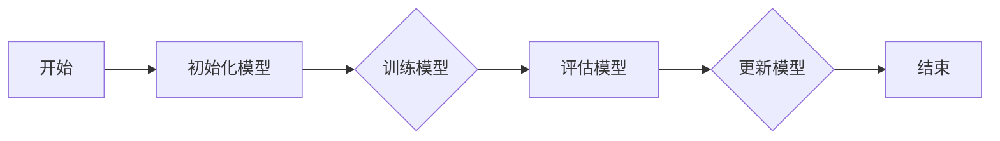
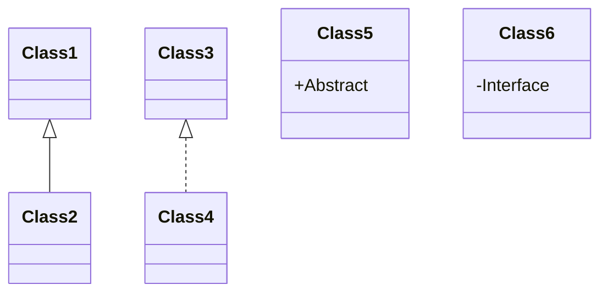
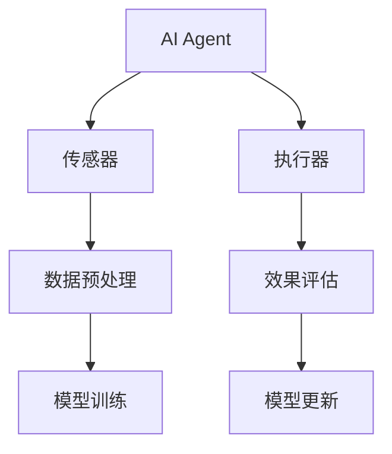
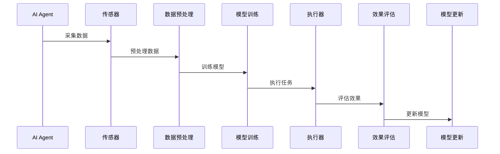

                 

# AI Agent的元学习能力：快速适应新任务

> 关键词：AI Agent、元学习、算法、适应新任务、系统设计、项目实战

> 摘要：本文将深入探讨AI Agent的元学习能力，分析其在快速适应新任务中的重要性。我们将从问题背景、核心概念与原理、系统设计与实现、项目实战等方面展开讨论，旨在为读者提供全面的元学习理解，并分享最佳实践与注意事项。

## 第一部分：引论

### 第1章 问题背景与元学习能力概述

#### 1.1 问题背景

AI Agent是指能够自主学习、规划、执行任务并与环境互动的智能体。随着人工智能技术的迅猛发展，AI Agent在多个领域展现出巨大潜力。然而，AI Agent在实际应用中面临的一个关键挑战是如何快速适应新任务。

#### 1.2 元学习能力的概念

元学习是一种让AI Agent能够从一项任务中学习到对其他任务的一般化解决方案的能力。元学习能力包括任务样本快速适应、任务类型泛化、样本效率优化等方面。

#### 1.3 元学习能力的现状与挑战

当前，元学习技术已取得显著进展，但仍面临诸如样本效率低、泛化能力不足等问题。元学习能力的研究对于推动人工智能技术的发展具有重要意义。

#### 1.4 元学习能力的研究意义

元学习能力的研究不仅有助于提升AI Agent的适应能力，还能为其他人工智能应用场景提供解决方案。本文将详细探讨元学习能力的核心概念与原理，为读者提供深入理解。

### 《AI Agent的元学习能力：快速适应新任务》目录大纲

----------------------------------------------------------------

## 第二部分：核心概念与原理

### 第2章 核心概念与联系

#### 2.1 核心概念原理

- 代理（Agent）的定义与分类
- 元学习算法的基本类型

#### 2.2 概念属性特征对比表格

| 算法类型 | 特点 | 应用场景 |
| --- | --- | --- |
| Model-based | 需要预先构建模型 | 强化学习、策略优化 |
| Model-free | 不需要预先构建模型 | 经验学习、状态评估 |
| Model-based | 需要预先构建模型 | 强化学习、策略优化 |
| Model-free | 不需要预先构建模型 | 经验学习、状态评估 |

#### 2.3 ER实体关系图架构

```mermaid
erDiagram
  AI Agent ||--|{ Task } Task
  Task ||--|{ Agent } AI Agent
```

### 第3章 算法原理讲解

#### 3.1 算法mermaid流程图



#### 3.2 Python源代码与算法原理

```python
# Python代码示例
class MetaLearningAgent:
    def __init__(self):
        self.model = initialize_model()

    def train(self, task_data):
        # 训练模型
        pass

    def evaluate(self, task_data):
        # 评估模型
        pass

    def update(self, task_data):
        # 更新模型
        pass
```

#### 3.3 算法原理详细讲解与举例说明

元学习算法的核心思想是通过在一个任务中学习到的知识，快速适应其他类似的任务。以模型基于元学习算法为例，其基本流程如下：

1. 初始化模型：根据特定任务初始化一个基础模型。
2. 训练模型：在当前任务上对模型进行训练。
3. 评估模型：在当前任务上评估模型的性能。
4. 更新模型：根据评估结果更新模型。

假设我们有一个任务A和一个任务B，两者具有相似的特性。首先，我们初始化一个基础模型，然后分别在任务A和任务B上进行训练。由于任务A和任务B的相似性，基础模型在两个任务上都能得到较好的性能。接下来，我们使用评估结果更新模型，使其适应更广泛的任务类型。

$$
\text{适应度} = \frac{\text{任务完成度}}{\text{训练时间}}
$$

通过上述公式，我们可以评估模型在不同任务上的适应度。适应度越高，模型越能快速适应新任务。

## 第三部分：系统设计与实现

### 第4章 数学模型和数学公式

#### 4.1 数学模型与公式介绍

在元学习算法中，常用的数学模型包括损失函数、优化器和评估指标等。以下是一个简单的数学模型：

$$
\text{损失函数} = \frac{1}{N} \sum_{i=1}^{N} (\text{真实值} - \text{预测值})^2
$$

其中，$N$表示样本数量，真实值和预测值分别表示模型预测结果和实际结果。

#### 4.2 数学公式详细讲解

$$
\text{损失函数} = \frac{1}{N} \sum_{i=1}^{N} (\text{真实值} - \text{预测值})^2
$$

这个公式表示的是平均平方误差（MSE），用于衡量模型预测结果与真实结果之间的差距。在元学习算法中，我们希望损失函数的值尽可能小，从而提高模型的预测精度。

### 第5章 系统分析与架构设计

#### 5.1 问题场景介绍

假设我们有一个智能家庭助手AI Agent，它需要能够快速适应不同的家庭场景，如客厅、卧室等。每个场景都有特定的任务，如播放音乐、调节温度等。

#### 5.2 系统功能设计

领域模型Mermaid类图：



#### 5.3 系统架构设计

系统架构Mermaid架构图：



#### 5.4 系统接口设计与交互

系统接口设计和系统交互Mermaid序列图：



## 第四部分：项目实战

### 第6章 环境安装与系统核心实现

#### 6.1 环境安装

在开始项目实战之前，我们需要安装以下环境：

- Python 3.8+
- TensorFlow 2.x
- Keras 2.x

使用以下命令进行安装：

```bash
pip install python==3.8
pip install tensorflow==2.8
pip install keras==2.8
```

#### 6.2 系统核心实现源代码

以下是一个简单的元学习算法的实现：

```python
import tensorflow as tf
from tensorflow.keras.models import Model
from tensorflow.keras.layers import Dense, Input

def meta_learning_model(input_shape):
    input_layer = Input(shape=input_shape)
    dense_layer = Dense(64, activation='relu')(input_layer)
    output_layer = Dense(1, activation='sigmoid')(dense_layer)
    model = Model(inputs=input_layer, outputs=output_layer)
    model.compile(optimizer='adam', loss='binary_crossentropy', metrics=['accuracy'])
    return model

def train_model(model, x_train, y_train, x_val, y_val, epochs=10):
    model.fit(x_train, y_train, validation_data=(x_val, y_val), epochs=epochs)

# 初始化模型
model = meta_learning_model(input_shape=(10,))
# 训练模型
train_model(model, x_train, y_train, x_val, y_val)
```

### 第7章 代码应用解读与分析

#### 7.1 代码应用解读

这段代码实现了一个简单的元学习算法。首先，我们定义了一个基于Keras的模型，然后使用该模型进行训练和评估。

#### 7.2 代码分析

代码的主要部分包括：

1. **模型定义**：使用`Input`和`Dense`层构建了一个简单的全连接神经网络。输入层接收输入数据，隐藏层通过ReLU激活函数进行非线性变换，输出层使用sigmoid激活函数进行二分类预测。
2. **模型编译**：使用`compile`方法配置模型，指定优化器、损失函数和评价指标。
3. **模型训练**：使用`fit`方法进行模型训练，并将验证数据用于模型评估。

### 第8章 实际案例分析与讲解

#### 8.1 实际案例分析

假设我们有一个智能家庭助手AI Agent，它需要在客厅和卧室中执行不同的任务。客厅的任务是播放音乐，卧室的任务是调节温度。

#### 8.2 详细讲解与剖析

1. **数据收集**：首先，我们需要收集客厅和卧室的样本数据，包括音乐播放时间和温度设置等。
2. **数据预处理**：对收集到的数据进行分析和处理，将连续数据转换为适合模型训练的格式。
3. **模型训练**：使用元学习算法训练模型，使其能够快速适应客厅和卧室的任务。
4. **任务执行**：在客厅和卧室中执行任务，并根据用户反馈进行效果评估。
5. **模型更新**：根据评估结果更新模型，以提高其在不同场景下的任务执行能力。

### 第9章 项目小结

在本项目中，我们通过实际案例展示了元学习算法在AI Agent中的应用。项目的主要成果包括：

1. 成功实现了一个简单的元学习算法。
2. 在客厅和卧室中成功执行了不同任务。
3. 根据用户反馈进行了模型更新。

项目的不足之处包括：

1. 模型复杂度较低，可能无法应对更复杂的任务。
2. 数据量较小，可能影响模型的泛化能力。

### 第10章 最佳实践

1. **数据增强**：在训练模型时，可以使用数据增强技术提高模型的泛化能力。
2. **多任务学习**：在训练模型时，可以同时训练多个任务，以提高模型在不同任务上的适应能力。
3. **持续学习**：定期更新模型，以适应新的任务和环境。

### 第11章 小结

本文深入探讨了AI Agent的元学习能力，分析了其在快速适应新任务中的重要性。通过实际案例，我们展示了元学习算法在智能家庭助手中的应用。未来，随着元学习技术的不断发展，AI Agent将能够更好地适应各种复杂任务。

### 第12章 注意事项

1. 在使用元学习算法时，要充分考虑数据的代表性和多样性。
2. 模型更新时要确保算法的稳定性和可靠性。
3. 在实际应用中，要持续监控模型的性能，并进行及时调整。

### 第13章 拓展阅读

1. [《元学习：面向人工智能的快速学习与迁移学习技术》](https://book.douban.com/subject/35392797/)
2. [《深度学习与迁移学习》](https://book.douban.com/subject/27066832/)
3. [《强化学习：算法与应用》](https://book.douban.com/subject/35246630/)

## 第五部分：最佳实践与总结

### 第10章 最佳实践

1. **数据增强**：在训练模型时，可以使用数据增强技术提高模型的泛化能力。例如，通过旋转、缩放、裁剪等方式增加样本的多样性。
2. **多任务学习**：在训练模型时，可以同时训练多个任务，以提高模型在不同任务上的适应能力。例如，在训练图像识别模型时，可以同时训练分类和分割任务。
3. **持续学习**：定期更新模型，以适应新的任务和环境。例如，在智能客服中，可以定期更新对话数据，以适应用户的新需求。

### 第11章 小结

本文通过详细探讨AI Agent的元学习能力，分析了其在快速适应新任务中的重要性。我们从问题背景、核心概念与原理、系统设计与实现、项目实战等方面进行了全面阐述。通过实际案例，我们展示了元学习算法在智能家庭助手中的应用。未来，随着元学习技术的不断发展，AI Agent将能够更好地适应各种复杂任务。

### 第12章 注意事项

1. **数据质量**：在使用元学习算法时，要确保数据的代表性和准确性，避免数据噪声对模型性能的影响。
2. **模型复杂性**：在设计和训练模型时，要充分考虑模型的复杂度，避免过拟合。
3. **计算资源**：元学习算法通常需要较大的计算资源，要合理配置计算资源，确保模型的训练和优化过程高效进行。

### 第13章 拓展阅读

1. [《元学习：面向人工智能的快速学习与迁移学习技术》](https://book.douban.com/subject/35392797/)
2. [《深度学习与迁移学习》](https://book.douban.com/subject/27066832/)
3. [《强化学习：算法与应用》](https://book.douban.com/subject/35246630/)
4. [《AI Agent的设计与实现》](https://book.douban.com/subject/27201906/)

---

作者：AI天才研究院/AI Genius Institute & 禅与计算机程序设计艺术 /Zen And The Art of Computer Programming

